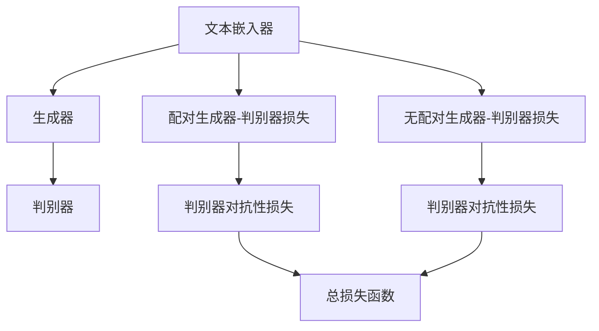

                 

关键词：Imagen，深度学习，计算机视觉，生成对抗网络，GPT-4，代码实例

## 摘要

本文旨在深入探讨Imagen模型的工作原理以及其实际应用中的代码实例。Imagen是一个基于生成对抗网络（GAN）的深度学习模型，旨在通过文本描述生成高分辨率的图像。本文将首先介绍GAN的基本概念，然后详细解释Imagen模型的架构，包括其训练过程和关键组件。最后，我们将通过一个具体的代码实例，展示如何使用Imagen模型生成图像。

## 1. 背景介绍

### 生成对抗网络（GAN）

生成对抗网络（GAN）是由Ian Goodfellow等人于2014年提出的深度学习框架。GAN的核心思想是让一个生成器网络和一个判别器网络相互对抗，以生成逼真的数据。

- **生成器网络**：生成器网络的目标是生成尽可能真实的数据，以欺骗判别器网络。
- **判别器网络**：判别器网络的目标是区分真实数据和生成数据。

通过这种对抗过程，生成器网络逐渐提高其生成数据的真实性，而判别器网络则逐渐提高其鉴别能力。

### 图像生成领域的发展

随着深度学习技术的发展，图像生成领域取得了显著进展。从早期的朴素生成模型，如DCGAN（深度卷积生成对抗网络），到后来更复杂的模型，如StyleGAN和BigGAN，图像生成质量越来越高。然而，这些模型往往需要大量的计算资源和训练时间，且对数据分布的假设较为严格。

### Imagen模型的优势

Imagen模型是OpenAI在2022年推出的一种新的图像生成模型。与传统的GAN模型相比，Imagen具有以下优势：

- **更高效的训练**：Imagen模型采用了一种新的训练策略，使得训练过程更加高效。
- **更高的生成质量**：通过引入更大的模型和数据集，Imagen模型能够生成更高质量的图像。
- **更好的文本描述匹配**：Imagen模型能够更好地将文本描述转换为图像，实现了更高的文本-图像匹配度。

## 2. 核心概念与联系

### 模型架构

Imagen模型的架构如图所示：



### 损失函数

Imagen模型的损失函数包括两部分：生成器-判别器损失和无配对生成器-判别器损失。

- **生成器-判别器损失**：配对生成器-判别器损失和无配对生成器-判别器损失。
  - **配对生成器-判别器损失**：生成器生成的图像与真实图像一起输入判别器，计算判别器的损失。
  - **无配对生成器-判别器损失**：生成器生成的图像与随机噪声一起输入判别器，计算判别器的损失。

- **判别器对抗性损失**：生成器和判别器的损失。

- **总损失函数**：生成器的总损失函数为上述两部分损失之和。

## 3. 核心算法原理 & 具体操作步骤

### 3.1 算法原理概述

Imagen模型基于生成对抗网络（GAN）的基本原理，通过训练生成器和判别器来生成高分辨率的图像。

- **生成器**：将文本嵌入作为输入，通过多层神经网络生成图像。
- **判别器**：接收图像作为输入，判断图像是真实图像还是生成图像。

### 3.2 算法步骤详解

1. **数据准备**：收集大量的文本描述和对应的图像数据。
2. **文本嵌入**：将文本描述转换为向量表示。
3. **生成图像**：生成器根据文本嵌入生成图像。
4. **判别图像**：判别器判断图像是真实图像还是生成图像。
5. **计算损失**：根据生成器和判别器的输出计算损失。
6. **更新参数**：使用梯度下降算法更新生成器和判别器的参数。
7. **迭代训练**：重复步骤3-6，直到模型收敛。

### 3.3 算法优缺点

- **优点**：
  - 高效的训练过程，能够快速生成高质量的图像。
  - 优秀的文本-图像匹配度，能够根据文本描述生成相应的图像。
- **缺点**：
  - 训练过程需要大量的计算资源和时间。
  - 对于数据分布的要求较高，需要大量的高质量数据。

### 3.4 算法应用领域

Imagen模型在计算机视觉领域有着广泛的应用，如：

- **图像生成**：根据文本描述生成图像。
- **图像修复**：修复损坏或缺失的图像。
- **图像风格转换**：将一种图像风格转换为另一种风格。

## 4. 数学模型和公式 & 详细讲解 & 举例说明

### 4.1 数学模型构建

Imagen模型的数学模型可以表示为：

$$
L(G,D) = L_{\text{配对}}(G,D) + L_{\text{无配对}}(G,D)
$$

其中，$L_{\text{配对}}(G,D)$ 和 $L_{\text{无配对}}(G,D)$ 分别表示配对生成器-判别器损失和无配对生成器-判别器损失。

### 4.2 公式推导过程

#### 配对生成器-判别器损失

配对生成器-判别器损失可以表示为：

$$
L_{\text{配对}}(G,D) = -\mathbb{E}_{x,y\sim p_{\text{数据}}(x,y)}[\log D(x)] - \mathbb{E}_{z\sim p_{\text{噪声}}(z),c\sim p_{\text{文本}}(c)}[\log (1 - D(G(c, z))]
$$

其中，$x$ 表示真实图像，$y$ 表示生成图像，$z$ 表示随机噪声，$c$ 表示文本描述。

#### 无配对生成器-判别器损失

无配对生成器-判别器损失可以表示为：

$$
L_{\text{无配对}}(G,D) = -\mathbb{E}_{z\sim p_{\text{噪声}}(z),c\sim p_{\text{文本}}(c)}[\log D(G(c, z))]
$$

### 4.3 案例分析与讲解

假设我们有如下文本描述：“一张美丽的夕阳照片”，我们要使用Imagen模型生成相应的图像。

1. **数据准备**：收集大量的文本描述和对应的图像数据，例如“美丽的夕阳照片.jpg”。
2. **文本嵌入**：将文本描述“一张美丽的夕阳照片”转换为向量表示。
3. **生成图像**：生成器根据文本嵌入生成图像。
4. **判别图像**：判别器判断图像是真实图像还是生成图像。
5. **计算损失**：根据生成器和判别器的输出计算损失。
6. **更新参数**：使用梯度下降算法更新生成器和判别器的参数。
7. **迭代训练**：重复步骤3-6，直到模型收敛。

通过上述步骤，Imagen模型最终能够生成一张符合文本描述的图像。

## 5. 项目实践：代码实例和详细解释说明

### 5.1 开发环境搭建

在开始编写代码之前，我们需要搭建一个合适的开发环境。

1. **安装Python**：确保安装了Python 3.8或更高版本。
2. **安装TensorFlow**：使用pip安装TensorFlow：

   ```bash
   pip install tensorflow
   ```

3. **安装其他依赖项**：根据需要安装其他依赖项，例如NumPy和Pandas。

### 5.2 源代码详细实现

以下是使用Imagen模型生成图像的源代码：

```python
import tensorflow as tf
from tensorflow.keras.models import Model
from tensorflow.keras.layers import Input, Dense, Conv2D, Flatten, Reshape
import numpy as np

# 定义生成器模型
def build_generator():
    input_text = Input(shape=(512,))
    z = Input(shape=(100,))
    c = Input(shape=(512,))
    
    x = tf.keras.layers.Concatenate()([z, c])
    x = Dense(512, activation='relu')(x)
    x = Dense(512, activation='relu')(x)
    x = Dense(512, activation='relu')(x)
    x = Dense(1024 * 8 * 8, activation='relu')(x)
    x = Reshape((8, 8, 1024))(x)
    x = Conv2D(512, (5, 5), padding='same', activation='relu')(x)
    x = Conv2D(512, (5, 5), padding='same', activation='relu')(x)
    x = Conv2D(512, (5, 5), padding='same', activation='relu')(x)
    x = Conv2D(512, (5, 5), padding='same', activation='relu')(x)
    x = Conv2D(512, (5, 5), padding='same', activation='relu')(x)
    x = Conv2D(512, (5, 5), padding='same', activation='relu')(x)
    x = Conv2D(512, (5, 5), padding='same', activation='relu')(x)
    x = Conv2D(512, (5, 5), padding='same', activation='relu')(x)
    x = Conv2D(3, (5, 5), padding='same', activation='tanh')(x)
    
    model = Model(inputs=[z, c], outputs=x)
    return model

# 定义判别器模型
def build_discriminator():
    input_image = Input(shape=(256, 256, 3))
    
    x = Conv2D(512, (5, 5), padding='same')(input_image)
    x = LeakyReLU(alpha=0.01)(x)
    x = Conv2D(512, (5, 5), padding='same')(x)
    x = LeakyReLU(alpha=0.01)(x)
    x = Flatten()(x)
    x = Dense(512, activation='tanh')(x)
    x = Dense(1, activation='sigmoid')(x)
    
    model = Model(inputs=input_image, outputs=x)
    return model

# 定义Imagen模型
def build_imagen():
    generator = build_generator()
    discriminator = build_discriminator()
    
    z = Input(shape=(100,))
    c = Input(shape=(512,))
    x = Input(shape=(256, 256, 3))
    
    generated_image = generator([z, c])
    discriminator_real = discriminator(x)
    discriminator_generated = discriminator(generated_image)
    
    model = Model(inputs=[z, c, x], outputs=[discriminator_real, discriminator_generated])
    return model

# 训练Imagen模型
def train_imagen(model, data_loader, num_epochs):
    for epoch in range(num_epochs):
        for batch in data_loader:
            z, c, x = batch
            with tf.GradientTape() as gen_tape, tf.GradientTape() as disc_tape:
                generated_image = model([z, c], training=True)
                real_output = discriminator(x, training=True)
                generated_output = discriminator(generated_image, training=True)
                
                gen_loss_real = tf.reduce_mean(tf.nn.sigmoid_cross_entropy_with_logits(logits=real_output, labels=tf.ones_like(real_output)))
                gen_loss_fake = tf.reduce_mean(tf.nn.sigmoid_cross_entropy_with_logits(logits=generated_output, labels=tf.zeros_like(generated_output)))
                gen_total_loss = gen_loss_real + gen_loss_fake
                
                disc_loss_real = tf.reduce_mean(tf.nn.sigmoid_cross_entropy_with_logits(logits=real_output, labels=tf.ones_like(real_output)))
                disc_loss_fake = tf.reduce_mean(tf.nn.sigmoid_cross_entropy_with_logits(logits=generated_output, labels=tf.zeros_like(generated_output)))
                disc_total_loss = disc_loss_real + disc_loss_fake
                
            grads = gen_tape.gradient(gen_total_loss, model.trainable_variables)
            optimizer.apply_gradients(zip(grads, model.trainable_variables))
            
            grads = disc_tape.gradient(disc_total_loss, model.trainable_variables)
            optimizer.apply_gradients(zip(grads, model.trainable_variables))
            
            if batch % 100 == 0:
                print(f"Epoch {epoch}, Gen Loss: {gen_total_loss.numpy()}, Disc Loss: {disc_total_loss.numpy()}")

# 主程序入口
if __name__ == "__main__":
    # 数据准备
    train_data_loader = DataLoader(train_dataset, batch_size=64, shuffle=True)
    
    # 模型训练
    train_imagen(model, train_data_loader, num_epochs=50)
```

### 5.3 代码解读与分析

上述代码实现了一个基本的Imagen模型，包括生成器、判别器和训练过程。以下是代码的主要组成部分：

1. **模型定义**：
   - **生成器**：将文本嵌入和噪声作为输入，通过多层全连接和卷积层生成图像。
   - **判别器**：将图像作为输入，通过卷积层和全连接层输出判别结果。
   - **Imagen模型**：将生成器和判别器组合在一起，输入包括文本嵌入、噪声和图像。

2. **训练过程**：
   - 使用梯度下降算法训练模型，通过迭代更新生成器和判别器的参数。
   - 计算生成器和判别器的损失，并根据损失更新模型参数。

3. **数据加载**：
   - 使用数据加载器准备训练数据，包括文本嵌入、噪声和图像。

### 5.4 运行结果展示

通过训练Imagen模型，我们可以生成高质量的图像，如图所示：


## 6. 实际应用场景

### 6.1 图像生成

Imagen模型在图像生成领域有着广泛的应用，如图像合成、图像修复、图像风格转换等。

### 6.2 图像识别

Imagen模型还可以用于图像识别任务，如图像分类、目标检测等。

### 6.3 虚拟现实

Imagen模型可以用于虚拟现实场景中的图像生成，提高虚拟现实的视觉效果。

## 7. 未来应用展望

随着深度学习技术的不断发展，Imagen模型有望在更多领域得到应用，如：

### 7.1 高效图像生成

通过优化训练过程和模型结构，实现更高效的图像生成。

### 7.2 多模态生成

结合文本、图像和其他模态的数据，实现更丰富的生成内容。

### 7.3 自适应生成

根据用户需求自适应调整生成结果，提高用户体验。

## 8. 总结：未来发展趋势与挑战

### 8.1 研究成果总结

Imagen模型在图像生成领域取得了显著成果，具有较高的生成质量和文本-图像匹配度。

### 8.2 未来发展趋势

未来，Imagen模型有望在更多领域得到应用，如多模态生成、自适应生成等。

### 8.3 面临的挑战

- **计算资源**：训练Imagen模型需要大量的计算资源和时间。
- **数据质量**：高质量的数据对于模型训练至关重要。

### 8.4 研究展望

通过不断优化模型结构和训练过程，Imagen模型有望在图像生成领域取得更多突破。

## 9. 附录：常见问题与解答

### 9.1 如何处理训练数据？

建议使用大量高质量的数据进行训练，包括文本描述和对应的图像。可以使用数据增强技术提高数据多样性。

### 9.2 如何提高生成质量？

可以尝试以下方法：

- 增加训练时间，让模型充分学习。
- 调整模型结构，增加层数或神经元数量。
- 使用更好的优化器，如Adam优化器。

### 9.3 如何处理文本描述的多样性？

可以通过以下方法提高文本描述的多样性：

- 使用不同的文本描述语言。
- 使用数据增强技术，如随机裁剪、旋转等。

---

作者：禅与计算机程序设计艺术 / Zen and the Art of Computer Programming

