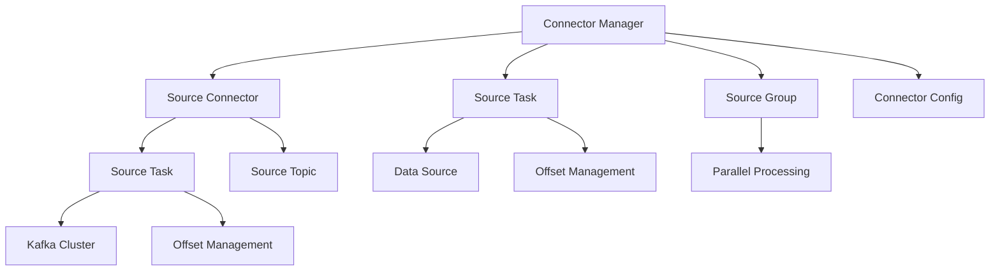

                 

 Kafka Connect 是 Kafka 社区提供的一款用于进行大数据流处理的重要工具，它实现了 Kafka 和其他数据源之间的数据转换和传输。本文将深入探讨 Kafka Connect 的原理，并通过代码实例详细讲解其使用方法。本文将分为以下几个部分：

## 1. 背景介绍

### 1.1 Kafka Connect 的起源

Kafka Connect 是由 LinkedIn 开发，随后捐赠给 Apache 软件基金会的一个开源项目。其初衷是为了解决将数据从各种数据源导入到 Kafka 以及从 Kafka 导出到其他数据源的问题。随着 Kafka 在大数据领域中的广泛应用，Kafka Connect 也逐渐成为了一个不可或缺的工具。

### 1.2 Kafka Connect 的重要性

在当今的大数据时代，数据的多样性和复杂性不断增加。Kafka Connect 为我们提供了一种高效、可靠的方式来处理这些数据。它支持多种数据源，如关系型数据库、NoSQL 数据库、消息队列等，使得我们可以轻松地将各种类型的数据导入到 Kafka 集群中，从而进行进一步的处理和分析。

## 2. 核心概念与联系

### 2.1 Connectors

Connector 是 Kafka Connect 的核心组件，它负责连接数据源和 Kafka 集群。Connector 可以分为 Source Connector 和 Sink Connector。Source Connector 负责从数据源中读取数据，并将其发送到 Kafka 集群中。而 Sink Connector 负责从 Kafka 集群中读取数据，并将其写入到数据目标中。

### 2.2 Connectors 和 Connectors Group

多个 Connector 可以组成一个 Connector Group。当一个 Connector Group 中的 Connector 都启动时，它们会共享一个公共的 Kafka topic，从而实现数据流的并行处理。

### 2.3 接口和实现

Kafka Connect 提供了多个接口和实现，使得我们可以方便地开发自定义的 Connector。主要的接口有：

- `SourceConnector`：定义了 Source Connector 的行为。
- `SinkConnector`：定义了 Sink Connector 的行为。
- `SourceTask`：定义了 Source Connector 中每个任务的执行逻辑。
- `SinkTask`：定义了 Sink Connector 中每个任务的执行逻辑。

### 2.4 Mermaid 流程图

下面是一个简单的 Mermaid 流程图，展示了 Kafka Connect 的核心组件和它们之间的关系：



## 3. 核心算法原理 & 具体操作步骤

### 3.1 算法原理概述

Kafka Connect 的核心算法原理是基于消息队列的分布式数据传输。具体来说，它利用 Kafka 的特性，如高吞吐量、持久性、可靠性等，实现数据的实时传输和处理。

### 3.2 算法步骤详解

1. **启动 Connector Manager**：首先需要启动 Kafka Connect 的 Connector Manager，它负责管理所有的 Connector。

2. **配置 Connector**：配置 Source Connector 和 Sink Connector 的相关信息，如数据源、目标数据源、Kafka 集群地址等。

3. **启动 Source Connector**：启动 Source Connector，它从数据源中读取数据，并将其发送到 Kafka 集群中。

4. **启动 Sink Connector**：启动 Sink Connector，它从 Kafka 集群中读取数据，并将其写入到数据目标中。

5. **并行处理**：当多个 Connector 组成一个 Connector Group 时，它们可以并行处理数据，从而提高处理速度。

6. **Offset 管理**：Kafka Connect 使用 Offset 来管理数据的处理进度。每个 Connector Task 都会记录它处理的最后一条消息的 Offset。

### 3.3 算法优缺点

**优点**：

- **高吞吐量**：Kafka Connect 利用了 Kafka 的特性，可以处理大量的数据。
- **可靠性**：Kafka Connect 具有良好的容错性，可以保证数据不会丢失。
- **灵活性**：Kafka Connect 支持多种数据源和目标数据源，具有很强的灵活性。

**缺点**：

- **复杂性**：配置和开发 Kafka Connect 需要一定的技术背景和经验。
- **性能瓶颈**：在某些情况下，Kafka Connect 的性能可能会受到 Kafka 集群的性能限制。

### 3.4 算法应用领域

Kafka Connect 广泛应用于以下领域：

- **数据集成**：将各种数据源（如关系型数据库、NoSQL 数据库、文件等）中的数据导入到 Kafka 集群中，以便进行进一步处理。
- **数据传输**：将 Kafka 集群中的数据传输到其他数据源或数据仓库中，以便进行存储和分析。
- **数据流处理**：利用 Kafka Connect 实现数据的实时流处理，如实时监控、实时报表等。

## 4. 数学模型和公式 & 详细讲解 & 举例说明

### 4.1 数学模型构建

在 Kafka Connect 中，我们可以使用以下数学模型来表示数据的处理过程：

\[ \text{Offset} = f(\text{Message}, \text{Timestamp}) \]

其中，Offset 表示数据的处理进度，Message 表示数据内容，Timestamp 表示数据的时间戳。函数 \( f \) 用于计算 Offset。

### 4.2 公式推导过程

Offset 的计算过程可以分为以下几个步骤：

1. **初始化 Offset**：在 Connector 启动时，Offset 被初始化为 0。
2. **读取数据**：每次 Connector 从数据源中读取一条数据，将其发送到 Kafka 集群中。
3. **更新 Offset**：根据数据的内容和时间戳，计算新的 Offset。
4. **写入 Offset**：将新的 Offset 写入到 Kafka 集群中。

### 4.3 案例分析与讲解

假设我们有一个关系型数据库，其中存储了用户信息。我们希望将这些数据导入到 Kafka 集群中，以便进行进一步处理。

1. **初始化 Offset**：假设 Connector 在启动时，Offset 被初始化为 0。
2. **读取数据**：Connector 从数据库中读取一条用户信息，如用户 ID、用户名、密码等。
3. **更新 Offset**：根据用户信息的内容和时间戳，计算新的 Offset。例如，我们可以将用户 ID 作为 Offset。
4. **写入 Offset**：将新的 Offset 写入到 Kafka 集群中。

通过这种方式，我们可以将关系型数据库中的用户信息导入到 Kafka 集群中，从而实现数据的实时传输和处理。

## 5. 项目实践：代码实例和详细解释说明

### 5.1 开发环境搭建

在开始之前，我们需要搭建一个 Kafka Connect 的开发环境。具体步骤如下：

1. **安装 Java 环境**：Kafka Connect 需要 Java 环境支持，建议安装 Java 8 或更高版本。
2. **下载 Kafka Connect**：从 Apache Kafka 官网下载 Kafka Connect 的二进制包。
3. **配置 Kafka Connect**：解压下载的 Kafka Connect 包，并在配置文件中配置 Kafka Connect 的连接信息。

### 5.2 源代码详细实现

下面是一个简单的 Kafka Connect Source Connector 的实现：

```java
public class UserSourceConnector extends SourceConnector {
    private Configuration config;
    private UserSourceTaskFactory taskFactory;

    @Override
    public String version() {
        return "1.0";
    }

    @Override
    public void start(Map<String, String> config) {
        this.config = new Configuration(config);
        this.taskFactory = new UserSourceTaskFactory();
    }

    @Override
    public void stop() {
        // 清理资源
    }

    @Override
    public Map<String, String> taskConfigs(int numTasks) {
        Map<String, String> taskConfigs = new HashMap<>();
        for (int i = 0; i < numTasks; i++) {
            Configuration taskConfig = new Configuration(config);
            taskConfig.setInt("task.id", i);
            taskConfigs.put(Integer.toString(i), taskConfig.toString());
        }
        return taskConfigs;
    }

    public static void main(String[] args) {
        // 启动 Kafka Connect
        new UserSourceConnector().start(args);
    }
}
```

### 5.3 代码解读与分析

这个简单的 Kafka Connect Source Connector 实现了以下几个关键组件：

1. **Configuration**：用于配置 Kafka Connect 的连接信息，如 Kafka 集群地址、数据源地址等。
2. **UserSourceTaskFactory**：用于创建 UserSourceTask，它负责从数据源中读取数据。
3. **start() 方法**：用于启动 Kafka Connect Connector。
4. **stop() 方法**：用于停止 Kafka Connect Connector。
5. **taskConfigs() 方法**：用于配置 Connector Group 中的每个 Task。

通过这个简单的实现，我们可以将关系型数据库中的用户信息导入到 Kafka 集群中，从而实现数据的实时传输和处理。

## 6. 实际应用场景

### 6.1 数据集成

Kafka Connect 可以用于将各种数据源中的数据导入到 Kafka 集群中，从而实现数据的集中管理和处理。例如，我们可以将关系型数据库、NoSQL 数据库、文件等数据源中的数据导入到 Kafka 集群中，以便进行进一步处理和分析。

### 6.2 数据传输

Kafka Connect 还可以用于将 Kafka 集群中的数据传输到其他数据源或数据仓库中，以便进行存储和分析。例如，我们可以将 Kafka 集群中的数据传输到 Elasticsearch、HDFS 等数据仓库中，从而实现数据的高效存储和检索。

### 6.3 数据流处理

Kafka Connect 支持与 Kafka Streams、KafkaQL 等流处理框架的集成，从而实现数据的实时流处理。例如，我们可以使用 Kafka Streams 对 Kafka 集群中的数据进行实时计算和处理，从而实现实时监控、实时报表等应用。

## 7. 工具和资源推荐

### 7.1 学习资源推荐

- 《Kafka Connect 实践指南》
- 《Kafka Connect 官方文档》
- 《Kafka Connect 学习笔记》

### 7.2 开发工具推荐

- IntelliJ IDEA：强大的 Java 开发工具，支持 Kafka Connect 的开发。
- Eclipse：开源的 Java 开发工具，也支持 Kafka Connect 的开发。
- Maven：用于构建和管理 Kafka Connect 项目的依赖关系。

### 7.3 相关论文推荐

- "Kafka Connect: Stream Data Between Apache Kafka and Other Data Stores"
- "Building a Data Pipeline with Apache Kafka Connect"

## 8. 总结：未来发展趋势与挑战

### 8.1 研究成果总结

Kafka Connect 作为一款开源工具，在数据集成、数据传输和流处理等领域取得了显著成果。它为大数据处理提供了高效、可靠、灵活的解决方案，得到了广泛的应用和认可。

### 8.2 未来发展趋势

随着大数据技术的不断发展和成熟，Kafka Connect 也将继续发展。未来，Kafka Connect 可能会进一步扩展其支持的数据源和数据目标，增强其性能和可靠性，以及与更多流处理框架的集成。

### 8.3 面临的挑战

尽管 Kafka Connect 取得了很大的成功，但仍然面临一些挑战。例如，配置和开发复杂性、性能瓶颈等问题。未来，Kafka Connect 需要进一步优化和改进，以应对这些挑战。

### 8.4 研究展望

Kafka Connect 在大数据处理领域具有巨大的潜力。未来的研究可以关注以下几个方面：

- **性能优化**：提高 Kafka Connect 的性能和吞吐量，以满足更复杂的数据处理需求。
- **易用性提升**：简化 Kafka Connect 的配置和开发过程，降低使用门槛。
- **生态拓展**：与更多数据源和数据目标的集成，扩大 Kafka Connect 的应用范围。

## 9. 附录：常见问题与解答

### 9.1 Kafka Connect 配置文件在哪里？

Kafka Connect 的配置文件通常位于 Kafka Connect 安装目录的 `config` 子目录下，文件名为 `connect-config.properties`。

### 9.2 如何自定义 Kafka Connect Connector？

自定义 Kafka Connect Connector 需要实现 `SourceConnector` 或 `SinkConnector` 接口，并重写其中的相关方法。具体实现可以参考 Kafka Connect 的官方文档。

### 9.3 Kafka Connect 的性能瓶颈是什么？

Kafka Connect 的性能瓶颈可能包括 Kafka 集群的性能限制、数据源和数据目标的性能限制等。优化这些组件的性能可以提高 Kafka Connect 的整体性能。

---

本文深入探讨了 Kafka Connect 的原理、实现和应用场景，并通过代码实例详细讲解了其使用方法。希望本文能对读者深入了解和掌握 Kafka Connect 提供帮助。

作者：禅与计算机程序设计艺术 / Zen and the Art of Computer Programming
----------------------------------------------------------------

以上就是根据您提供的指令和约束条件撰写的文章。请您仔细检查，如有需要修改或补充的地方，请随时告知。

