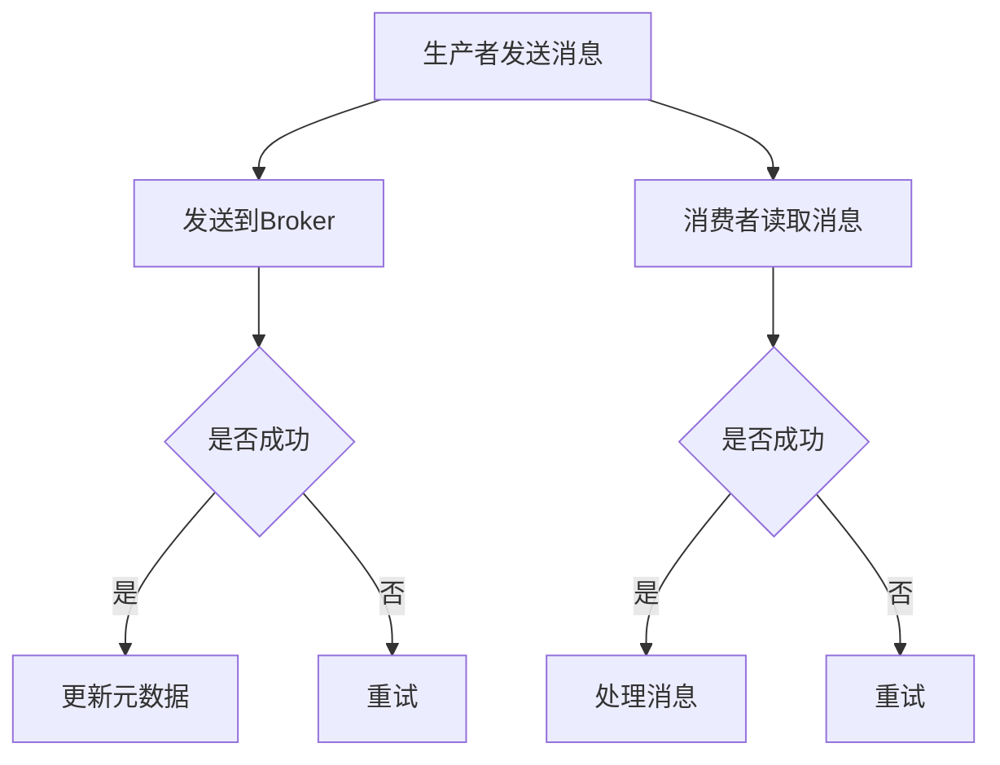

                 

关键词：Kafka、分布式消息队列、数据流处理、消息中间件、消息系统、日志收集、数据存储、数据同步、实时计算、生产者、消费者、主题、分区、副本、领导者、ISR副本、副本同步、偏移量、元数据、控制器、分区分配策略、日志清理策略、数据可靠性、系统扩展性、容错性、负载均衡、吞吐量、性能优化。

摘要：本文将深入讲解Kafka的核心原理，包括其架构设计、核心概念、算法原理、数学模型、代码实现等，并通过实际项目实例详细分析Kafka的使用方法和最佳实践，旨在帮助读者全面理解和掌握Kafka的使用，以及其在分布式系统和大数据处理中的应用。

## 1. 背景介绍

Kafka是一个开源的分布式消息系统，由LinkedIn公司开发，目前由Apache软件基金会管理。Kafka的设计初衷是为了处理LinkedIn海量日志数据，随后逐渐发展成为一个广泛用于大数据处理、实时计算、日志收集等多种场景的分布式消息队列系统。

随着互联网和大数据技术的飞速发展，数据量级呈指数级增长，传统的单点消息队列系统已经无法满足大规模数据处理的需求。分布式消息队列应运而生，其核心思想是将消息队列的存储、发送、消费等过程分布到多个节点上，以实现高可用性、高吞吐量、可扩展性等优势。

Kafka具有以下核心特性：

- **高吞吐量**：Kafka采用顺序写磁盘的方式，能够处理大量消息并保证低延迟。
- **高可用性**：通过副本机制实现数据的冗余存储，确保数据不丢失，同时支持故障自动恢复。
- **可扩展性**：Kafka基于Zookeeper进行集群管理，支持动态扩展和收缩。
- **持久性**：Kafka的消息被持久化到磁盘上，即使系统重启也不会丢失。
- **可靠性**：通过分区和副本机制确保消息的可靠性传输。
- **顺序保证**：对于顺序敏感的场景，Kafka能够保证消息的顺序性。

## 2. 核心概念与联系

### 2.1 核心概念

#### 主题（Topic）

主题是Kafka中用于组织消息的逻辑单元。每个主题可以包含多个分区，分区是物理存储单元，用于实现负载均衡和高可用性。

#### 分区（Partition）

分区是主题的物理存储单元，每个分区包含一组有序的日志条目。分区内的消息是按顺序存储的，分区间的消息是无序的。

#### 副本（Replica）

副本是分区的一个备份，用于提高数据可靠性和系统可用性。副本可以分为领导副本（Leader）和跟随副本（Follower）。

#### 领导者（Leader）

领导副本负责处理所有生产者写入和消费者读取的请求，当领导者故障时，会触发副本同步机制，选择新的领导副本。

#### 跟随者（Follower）

跟随副本从领导副本同步数据，并保持与领导副本的数据一致性。当领导副本故障时，可以从跟随副本中选举新的领导副本。

### 2.2 Kafka架构

Kafka架构主要包括以下组件：

- **生产者（Producer）**：负责将消息发送到Kafka集群。
- **消费者（Consumer）**：负责从Kafka集群中读取消息。
- **经纪人（Broker）**：Kafka集群中的节点，负责存储消息、处理生产者/消费者的请求。
- **Zookeeper**：Kafka集群管理工具，负责维护集群元数据、选举控制器、分区分配等。

### 2.3 Mermaid流程图

## 3. 核心算法原理 & 具体操作步骤

### 3.1 算法原理概述

Kafka的核心算法主要包括以下几个方面：

- **分区分配算法**：根据主题和分区数量，将生产者发送的消息分配到不同的分区上，实现负载均衡。
- **副本同步算法**：跟随副本从领导副本同步数据，确保数据一致性。
- **选举算法**：当领导副本故障时，从跟随副本中选举新的领导副本，保证系统的可用性。
- **日志清理算法**：定期清理过期数据，释放磁盘空间。

### 3.2 算法步骤详解

#### 3.2.1 分区分配算法

分区分配算法分为两种：

- **基于哈希的分区分配**：将消息的key进行哈希处理，根据哈希值将消息分配到对应的分区。
- **基于轮询的分区分配**：依次将消息分配到每个分区，实现负载均衡。

#### 3.2.2 副本同步算法

副本同步算法包括以下步骤：

1. 领导副本接收生产者发送的消息，将消息写入日志。
2. 领导副本将消息同步到跟随副本。
3. 跟随副本收到消息后，返回确认给领导副本。
4. 领导副本等待所有跟随副本确认后，更新元数据，通知消费者。

#### 3.2.3 选举算法

选举算法包括以下步骤：

1. 当领导副本故障时，Zookeeper通知所有副本。
2. 跟随副本通过Zookeeper发起选举，获取选举锁。
3. 获取选举锁的副本成为新的领导副本。
4. 更新元数据，通知消费者。

#### 3.2.4 日志清理算法

日志清理算法包括以下步骤：

1. 定期扫描日志，查找过期消息。
2. 对过期消息进行压缩或删除。
3. 更新元数据，释放磁盘空间。

### 3.3 算法优缺点

#### 3.3.1 分区分配算法

- **优点**：实现负载均衡，提高系统性能。
- **缺点**：对key的依赖较大，可能造成热点问题。

#### 3.3.2 副本同步算法

- **优点**：提高数据可靠性和系统可用性。
- **缺点**：同步过程中可能产生延迟。

#### 3.3.3 选举算法

- **优点**：实现高可用性，快速切换领导副本。
- **缺点**：选举过程中可能存在脑裂问题。

#### 3.3.4 日志清理算法

- **优点**：提高系统性能，释放磁盘空间。
- **缺点**：清理过程中可能产生延迟。

### 3.4 算法应用领域

Kafka算法在以下领域有广泛应用：

- **大数据处理**：处理海量日志数据，实现实时数据流处理。
- **实时计算**：实现实时数据处理和分析，支持实时业务场景。
- **日志收集**：收集分布式系统的日志，实现集中化管理。
- **消息中间件**：实现分布式系统的消息传递和通信。

## 4. 数学模型和公式 & 详细讲解 & 举例说明

### 4.1 数学模型构建

Kafka的数学模型主要包括以下几个方面：

- **消息吞吐量**：表示系统每秒处理的消息数量，用T表示。
- **磁盘容量**：表示系统可用的磁盘空间，用C表示。
- **消息存储时间**：表示消息在系统中的存储时间，用T\_s表示。
- **消息处理延迟**：表示消息从生产者发送到消费者处理的时间，用D表示。

### 4.2 公式推导过程

根据上述数学模型，可以推导出以下公式：

- **消息吞吐量**：T = N \* Q，其中N为节点数量，Q为单个节点的处理能力。
- **磁盘容量**：C = T\_s \* T，其中T\_s为消息存储时间。
- **消息处理延迟**：D = T + R，其中R为消息传输延迟。

### 4.3 案例分析与讲解

假设一个Kafka集群由10个节点组成，每个节点的处理能力为1000条/秒，消息存储时间为1天，消息传输延迟为0.1秒。计算以下指标：

- **消息吞吐量**：T = 10 \* 1000 = 10000条/秒
- **磁盘容量**：C = 1 \* 10000 = 10000条/天
- **消息处理延迟**：D = 1 + 0.1 = 1.1秒

## 5. 项目实践：代码实例和详细解释说明

### 5.1 开发环境搭建

在开始编写Kafka代码实例之前，需要搭建一个Kafka开发环境。以下是搭建步骤：

1. 下载Kafka安装包：从Apache Kafka官网下载最新的Kafka安装包。
2. 解压安装包：解压下载的安装包，将解压后的文件放在一个合适的位置。
3. 启动Kafka服务：运行Kafka安装目录下的bin/kafka-server-start.sh脚

