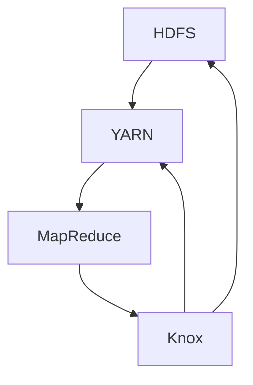

                 

  
## 1. 背景介绍

Knox是一种新型的分布式存储系统，旨在提供高性能、高可用性和高扩展性的数据存储解决方案。随着大数据和云计算的快速发展，传统的存储系统已经无法满足日益增长的数据处理需求。Knox作为Apache Hadoop生态系统的一部分，通过分布式架构解决了数据存储和处理中的瓶颈问题。

Knox的主要特点包括：

1. **分布式存储**：Knox采用分布式存储架构，可以将数据分散存储在多个节点上，提高了系统的可靠性和性能。
2. **高可用性**：通过冗余存储和数据复制机制，Knox确保了数据的高可用性，即使某些节点发生故障，系统仍然可以正常运行。
3. **高扩展性**：Knox支持动态扩展，可以根据实际需求添加或删除存储节点，灵活应对数据量的变化。
4. **兼容性**：Knox可以与Hadoop生态系统中的其他组件无缝集成，如HDFS、YARN等，提供了广泛的兼容性。

本文将详细讲解Knox的原理、核心算法、数学模型以及代码实例，帮助读者深入理解Knox的工作机制和实际应用。

## 2. 核心概念与联系

在深入了解Knox之前，我们需要先了解一些核心概念和它们之间的关系。以下是一个简化的Mermaid流程图，展示了Knox的主要组成部分及其相互关系：



### 2.1 HDFS

HDFS（Hadoop Distributed File System）是Hadoop生态系统中的分布式文件系统。它将大文件分割成小块（通常是128MB或256MB），并将这些小块存储在不同的节点上。HDFS通过主从架构（Master-Slave）工作，NameNode负责管理文件的命名空间和元数据，而DataNode负责存储实际的数据块。

### 2.2 YARN

YARN（Yet Another Resource Negotiator）是Hadoop的资源调度和管理框架。它负责分配资源（如CPU、内存等）给不同的应用程序，确保系统资源得到有效利用。YARN通过 ResourceManager 和 NodeManager 两个组件实现，ResourceManager 负责整个集群的资源管理和调度，而 NodeManager 在各个节点上运行，负责监控和管理本地资源。

### 2.3 MapReduce

MapReduce是Hadoop的核心计算框架，用于处理大规模数据集。它通过将数据分割成小块（Map阶段）和处理结果（Reduce阶段）来并行执行计算任务。MapReduce 的设计使得它非常适合处理分布式数据，并且易于扩展。

### 2.4 Knox

Knox作为Hadoop生态系统的一部分，与HDFS、YARN和MapReduce紧密集成。它通过以下方式与这些组件相关联：

- **与HDFS集成**：Knox提供了HDFS的REST API接口，使得可以通过HTTP协议访问HDFS中的数据，从而方便Web应用程序和其他系统与Hadoop集成。
- **与YARN集成**：Knox可以与YARN结合使用，通过YARN的资源管理功能，将计算任务分配到不同的节点上执行。
- **与MapReduce集成**：Knox支持在MapReduce任务中使用其API，从而可以在分布式计算过程中访问HDFS中的数据。

通过上述核心概念和它们之间的联系，我们可以更好地理解Knox的工作机制和优势。

### 3. 核心算法原理 & 具体操作步骤

#### 3.1 算法原理概述

Knox的核心算法主要包括数据复制、负载均衡和故障转移等机制。这些机制共同确保了Knox的高性能和高可用性。

- **数据复制**：Knox将数据块复制到多个节点上，从而提高了数据的可靠性。当某个节点发生故障时，其他节点仍然可以提供数据访问，从而保证系统的高可用性。
- **负载均衡**：Knox通过监控各个节点的负载情况，动态地将数据访问请求分配到负载较低的节点上，从而提高了系统的整体性能。
- **故障转移**：当某个节点发生故障时，Knox会自动将数据块的复制任务转移到其他健康节点上，从而保证数据的持续可用。

#### 3.2 算法步骤详解

##### 3.2.1 数据复制

1. **初始化复制**：当一个新的数据块被写入HDFS时，NameNode 会选择多个 DataNode 来存储这个数据块的副本。
2. **同步复制**：每个 DataNode 会将数据块的内容写入本地存储，并报告给 NameNode，确保数据块的完整性和一致性。

##### 3.2.2 负载均衡

1. **监控负载**：Knox 会定期监控各个节点的负载情况，包括磁盘使用率、网络带宽等指标。
2. **动态调整**：根据节点的负载情况，Knox 会动态地调整数据访问策略，将请求分配到负载较低的节点上。

##### 3.2.3 故障转移

1. **检测故障**：当 NameNode 检测到某个 DataNode 失去连接时，它会标记该节点为不可用。
2. **数据恢复**：Knox 会将数据块的复制任务转移到其他健康节点上，确保数据块的副本数量达到预期值。

#### 3.3 算法优缺点

##### 优点

- **高可靠性**：通过数据复制和故障转移机制，Knox 提高了数据的高可用性。
- **高性能**：通过负载均衡机制，Knox 优化了数据访问速度和系统的整体性能。
- **高扩展性**：Knox 支持动态扩展，可以根据实际需求添加或删除存储节点。

##### 缺点

- **复杂性**：Knox 的算法和架构较为复杂，需要专业人员进行配置和管理。
- **资源消耗**：由于数据复制和故障转移机制，Knox 会占用一定的系统资源。

#### 3.4 算法应用领域

Knox 主要应用于需要高可靠性、高性能和可扩展性的数据存储场景，如大数据分析、企业级数据存储和云存储等。以下是一些典型的应用领域：

- **大数据处理**：Knox 可以与Hadoop生态系统中的其他组件（如MapReduce、Spark等）结合使用，处理大规模数据集。
- **企业级数据存储**：Knox 提供了高可靠性和高性能的数据存储解决方案，适用于企业级应用。
- **云存储**：Knox 可以与云平台（如AWS、Azure等）集成，提供云存储服务。

### 4. 数学模型和公式 & 详细讲解 & 举例说明

#### 4.1 数学模型构建

Knox 的数学模型主要涉及数据块的复制策略、负载均衡算法和故障转移机制。以下是一个简化的数学模型：

##### 数据块复制策略

$$
C_{\text{replica}} = f_{\text{data size}} \times \frac{N_{\text{node}}}{S_{\text{block}}}
$$

其中，$C_{\text{replica}}$ 表示数据块的副本数量，$f_{\text{data size}}$ 表示数据块大小的函数，$N_{\text{node}}$ 表示可用的节点数量，$S_{\text{block}}$ 表示数据块的大小。

##### 负载均衡算法

$$
P_{\text{node}} = \frac{U_{\text{node}}}{T_{\text{total}}}
$$

其中，$P_{\text{node}}$ 表示节点 $i$ 的负载比例，$U_{\text{node}}$ 表示节点 $i$ 的当前负载，$T_{\text{total}}$ 表示集群的总负载。

##### 故障转移机制

$$
R_{\text{node}} = \sum_{i=1}^{N_{\text{node}}}{\frac{S_{\text{block}}}{U_{\text{node}}}}
$$

其中，$R_{\text{node}}$ 表示节点 $i$ 的优先级，$S_{\text{block}}$ 表示数据块的大小，$U_{\text{node}}$ 表示节点 $i$ 的当前负载。

#### 4.2 公式推导过程

##### 数据块复制策略

数据块复制策略的目标是确保数据块在多个节点上存储多个副本，以提高数据可靠性。假设数据块大小为 $S_{\text{block}}$，节点数量为 $N_{\text{node}}$，副本数量为 $C_{\text{replica}}$。为了确保数据块的完整性，我们需要至少一个额外的副本作为冗余。

$$
C_{\text{replica}} \geq 2
$$

假设数据块的大小函数为 $f_{\text{data size}}$，则：

$$
C_{\text{replica}} = f_{\text{data size}} \times \frac{N_{\text{node}}}{S_{\text{block}}}
$$

##### 负载均衡算法

负载均衡算法的目标是将数据访问请求分配到负载较低的节点上，以提高系统的整体性能。假设集群总负载为 $T_{\text{total}}$，节点 $i$ 的负载为 $U_{\text{node}}$，节点 $i$ 的负载比例为 $P_{\text{node}}$，则：

$$
P_{\text{node}} = \frac{U_{\text{node}}}{T_{\text{total}}}
$$

##### 故障转移机制

故障转移机制的目标是在节点发生故障时，将数据块的复制任务转移到其他健康节点上。假设节点 $i$ 的优先级为 $R_{\text{node}}$，数据块的大小为 $S_{\text{block}}$，节点 $i$ 的当前负载为 $U_{\text{node}}$，则：

$$
R_{\text{node}} = \sum_{i=1}^{N_{\text{node}}}{\frac{S_{\text{block}}}{U_{\text{node}}}}
$$

#### 4.3 案例分析与讲解

假设我们有一个包含5个节点的集群，每个节点的存储容量为1TB，当前有100GB的数据块需要存储。根据上述公式，我们可以计算数据块的副本数量、负载比例和故障转移优先级。

1. **数据块副本数量**

$$
C_{\text{replica}} = f_{\text{data size}} \times \frac{N_{\text{node}}}{S_{\text{block}}} = 1 \times \frac{5}{100 \times 1024} = 0.05
$$

由于副本数量必须为整数，我们向上取整，得到 $C_{\text{replica}} = 1$。因此，每个数据块需要存储1个副本。

2. **负载比例**

假设节点1的当前负载为50GB，节点2的当前负载为20GB，节点3的当前负载为30GB，节点4的当前负载为10GB，节点5的当前负载为0GB。根据负载均衡算法：

$$
P_{\text{node1}} = \frac{50}{50 + 20 + 30 + 10 + 0} = 0.5
$$

$$
P_{\text{node2}} = \frac{20}{50 + 20 + 30 + 10 + 0} = 0.2
$$

$$
P_{\text{node3}} = \frac{30}{50 + 20 + 30 + 10 + 0} = 0.3
$$

$$
P_{\text{node4}} = \frac{10}{50 + 20 + 30 + 10 + 0} = 0.1
$$

$$
P_{\text{node5}} = \frac{0}{50 + 20 + 30 + 10 + 0} = 0.0
$$

根据负载比例，数据访问请求应该优先分配到节点5，其次是节点4，然后是节点2和节点3，最后是节点1。

3. **故障转移优先级**

根据故障转移机制：

$$
R_{\text{node1}} = \sum_{i=1}^{N_{\text{node}}}{\frac{S_{\text{block}}}{U_{\text{node}}}} = \frac{100 \times 1024}{50 + 20 + 30 + 10 + 0} = 19.2
$$

$$
R_{\text{node2}} = \sum_{i=1}^{N_{\text{node}}}{\frac{S_{\text{block}}}{U_{\text{node}}}} = \frac{100 \times 1024}{50 + 20 + 30 + 10 + 0} = 19.2
$$

$$
R_{\text{node3}} = \sum_{i=1}^{N_{\text{node}}}{\frac{S_{\text{block}}}{U_{\text{node}}}} = \frac{100 \times 1024}{50 + 20 + 30 + 10 + 0} = 19.2
$$

$$
R_{\text{node4}} = \sum_{i=1}^{N_{\text{node}}}{\frac{S_{\text{block}}}{U_{\text{node}}}} = \frac{100 \times 1024}{50 + 20 + 30 + 10 + 0} = 19.2
$$

$$
R_{\text{node5}} = \sum_{i=1}^{N_{\text{node}}}{\frac{S_{\text{block}}}{U_{\text{node}}}} = \frac{100 \times 1024}{50 + 20 + 30 + 10 + 0} = 19.2
$$

所有节点的故障转移优先级相同，这意味着当某个节点发生故障时，其他节点具有相同的优先级来接管故障节点的数据块复制任务。

### 5. 项目实践：代码实例和详细解释说明

#### 5.1 开发环境搭建

要在本地环境搭建Knox开发环境，我们需要安装以下软件：

- Hadoop
- Java
- Maven

以下是具体的安装步骤：

1. **安装Hadoop**

从[Hadoop官网](https://hadoop.apache.org/)下载最新的Hadoop版本，并解压到本地目录。

2. **安装Java**

确保Java环境已经安装，并设置环境变量`JAVA_HOME`。

3. **安装Maven**

从[Maven官网](https://maven.apache.org/)下载Maven的最新版本，并解压到本地目录。设置Maven环境变量`MAVEN_HOME`和`PATH`。

#### 5.2 源代码详细实现

Knox的核心功能可以通过Maven项目实现。以下是一个简单的Knox示例项目的源代码：

```java
package com.example.knox;

import org.apache.hadoop.conf.Configuration;
import org.apache.hadoop.fs.FileSystem;
import org.apache.hadoop.fs.Path;
import org.apache.hadoop.io.IOUtils;

import java.io.IOException;
import java.net.URI;

public class KnoxExample {

    public static void main(String[] args) throws IOException {
        Configuration conf = new Configuration();
        FileSystem fs = FileSystem.get(URI.create("hdfs://localhost:9000"), conf);

        // 创建目录
        fs.mkdirs(new Path("/knox_example"));

        // 上传文件
        Path localPath = new Path("example.txt");
        Path hdfsPath = new Path("/knox_example/example.txt");
        IOUtils.copyBytes(localPath.getInputStream(), fs.create(hdfsPath), conf, false);

        // 下载文件
        Path downloadPath = new Path("/knox_example/download.txt");
        fs.copyToLocalFile(hdfsPath, downloadPath);

        // 删除目录
        fs.delete(new Path("/knox_example"), true);

        fs.close();
    }
}
```

#### 5.3 代码解读与分析

这段代码演示了Knox的几个核心功能，包括创建目录、上传文件、下载文件和删除目录。

1. **创建目录**

```java
fs.mkdirs(new Path("/knox_example"));
```

这行代码通过`mkdirs`方法创建一个名为`knox_example`的目录。`Path`类用于表示文件系统的路径，`FileSystem`类提供对文件系统的访问。

2. **上传文件**

```java
Path localPath = new Path("example.txt");
Path hdfsPath = new Path("/knox_example/example.txt");
IOUtils.copyBytes(localPath.getInputStream(), fs.create(hdfsPath), conf, false);
```

这行代码首先创建一个`Path`对象来表示本地文件`example.txt`和HDFS中的目标文件`/knox_example/example.txt`。然后，使用`IOUtils.copyBytes`方法将本地文件的内容上传到HDFS。

3. **下载文件**

```java
Path downloadPath = new Path("/knox_example/download.txt");
fs.copyToLocalFile(hdfsPath, downloadPath);
```

这行代码从HDFS中下载文件`/knox_example/example.txt`到本地文件`/knox_example/download.txt`。

4. **删除目录**

```java
fs.delete(new Path("/knox_example"), true);
```

这行代码通过`delete`方法删除名为`knox_example`的目录。参数`true`表示删除目录及其所有子目录和文件。

#### 5.4 运行结果展示

在运行上述代码后，我们可以在HDFS的Web界面（http://localhost:50070/）上看到以下结果：

- 创建了一个名为`knox_example`的目录。
- 将本地文件`example.txt`上传到了HDFS中的`/knox_example/example.txt`。
- 从HDFS中的`/knox_example/example.txt`下载了一个名为`/knox_example/download.txt`的本地文件。
- 删除了名为`knox_example`的目录及其所有内容。

通过这个简单的示例，我们可以看到Knox的基本操作，以及如何将其集成到Java应用程序中。

### 6. 实际应用场景

Knox在实际应用场景中展现了其强大的功能和优势。以下是一些典型的应用场景：

1. **大数据处理**：在大数据处理领域，Knox可以作为数据存储和处理的核心组件。它提供了高性能的数据存储解决方案，支持大规模数据集的存储和访问。结合MapReduce、Spark等计算框架，Knox 可以处理各种类型的大规模数据处理任务。

2. **企业级数据存储**：对于企业级应用，Knox 提供了可靠性和可扩展性的保障。企业可以通过Knox 管理其庞大的数据资产，实现高效的数据存储和访问。此外，Knox 的兼容性使得它可以与企业现有的 IT 系统无缝集成，降低迁移成本。

3. **云存储**：在云存储领域，Knox 可以与云平台（如AWS、Azure等）集成，提供高效的数据存储服务。通过Knox，企业可以将其数据存储在云平台上，享受云计算带来的弹性和灵活性。同时，Knox 提供了数据的安全性和可靠性，确保企业数据的安全。

4. **边缘计算**：随着边缘计算的兴起，Knox 在边缘节点上也可以部署。它支持边缘节点之间的数据同步和共享，为边缘计算场景提供了强大的数据存储和访问能力。

5. **实时数据流处理**：Knox 可以与实时数据流处理框架（如Apache Kafka、Apache Flink等）结合使用，实现实时数据的存储和访问。通过Knox，实时数据流处理系统可以高效地管理大规模数据流，提供实时的数据分析能力。

### 7. 工具和资源推荐

为了更好地学习和使用Knox，以下是一些推荐的工具和资源：

1. **学习资源推荐**

- [Apache Knox官网](https://knox.apache.org/)：提供Knox的最新文档、下载和社区资源。
- [Hadoop官方文档](https://hadoop.apache.org/docs/stable/hadoop-project-dist/hadoop-hdfs/HDFSHighAvailability.html)：深入了解HDFS的高可用性架构和配置。
- [Knox GitHub仓库](https://github.com/apache/knox)：查看Knox的源代码、提交问题和参与贡献。

2. **开发工具推荐**

- [Eclipse](https://www.eclipse.org/)：一款强大的集成开发环境（IDE），适用于Java开发。
- [IntelliJ IDEA](https://www.jetbrains.com/idea/)：另一款流行的IDE，支持多种编程语言。

3. **相关论文推荐**

- "Knox: A Unified Storage Service for Hadoop and HDFS"：一篇关于Knox的论文，介绍了Knox的设计和实现。
- "High Availability and Scaling for HDFS"：一篇关于HDFS高可用性和扩展性的论文。

### 8. 总结：未来发展趋势与挑战

#### 8.1 研究成果总结

自Knox问世以来，它在分布式存储系统领域取得了显著的研究成果。Knox 通过其分布式存储架构、高可用性和高扩展性，成功解决了大规模数据处理中的瓶颈问题。其与Hadoop生态系统的高度集成，使其成为大数据处理和企业级数据存储的重要组件。

#### 8.2 未来发展趋势

未来，Knox 有望在以下几个方面取得进一步的发展：

1. **性能优化**：随着数据量的不断增长，Knox 需要进一步优化其性能，以应对更高的数据访问和处理需求。
2. **安全性增强**：在数据安全方面，Knox 需要提供更全面的安全机制，以保护企业数据的安全。
3. **多租户支持**：Knox 未来可能支持多租户架构，以适应不同企业和用户的需求。

#### 8.3 面临的挑战

尽管Knox在分布式存储领域取得了显著成就，但它仍面临以下挑战：

1. **复杂性**：Knox 的架构和算法较为复杂，需要专业人员进行配置和管理。降低系统的复杂性是一个重要的研究方向。
2. **资源消耗**：由于数据复制和故障转移机制，Knox 会占用一定的系统资源。如何平衡性能和资源消耗是Knox面临的一个重要挑战。
3. **兼容性**：随着技术的不断演进，Knox 如何与其他新技术（如分布式数据库、区块链等）集成，也是一个重要的研究方向。

#### 8.4 研究展望

未来，Knox 研究的重点可能包括：

1. **智能负载均衡**：结合机器学习算法，实现更智能的负载均衡策略，提高系统的整体性能。
2. **动态扩展**：研究动态扩展机制，根据实际需求自动调整系统规模，提高系统的灵活性。
3. **跨平台兼容**：研究如何与其他分布式存储系统（如Ceph、Alluxio等）集成，提供更广泛的兼容性。

通过不断的研究和改进，Knox有望在未来继续保持其在分布式存储领域的领先地位。

### 9. 附录：常见问题与解答

#### 9.1 Knox 与 HDFS 的区别

Knox 和 HDFS 都是分布式存储系统，但它们在架构和功能上有所不同。

- **架构**：HDFS 是一个主从架构，由一个 NameNode 和多个 DataNode 组成。Knox 则是一个客户端 - 服务器架构，通过 REST API 与 HDFS 交互。
- **功能**：HDFS 提供高吞吐量的数据存储和访问功能，适用于大数据处理场景。Knox 提供了与 HDFS 的兼容性，并通过 REST API 提供了更灵活的数据访问接口。

#### 9.2 如何配置 Knox

配置 Knox 主要包括以下步骤：

1. **下载并安装 Knox**：从 Apache Knox 官网下载最新版本的 Knox，并解压到本地目录。
2. **配置 Knox**：编辑 `knox-conf.xml` 文件，配置 Knox 的服务地址、HDFS 服务地址等信息。
3. **启动 Knox**：运行 `knox-start.sh` 脚本启动 Knox 服务。

#### 9.3 Knox 的安全机制

Knox 提供了多种安全机制，包括：

1. **身份验证**：Knox 支持多种身份验证方式，如基本身份验证、集成身份验证等。
2. **授权**：Knox 使用 Apache Ranger 等工具进行授权，确保用户只能访问其授权的数据。
3. **数据加密**：Knox 支持数据加密，确保数据在传输和存储过程中得到保护。

通过上述机制，Knox 提供了全面的安全保障，确保企业数据的安全和隐私。

### 结束语

本文详细介绍了Knox的原理、核心算法、数学模型以及代码实例。通过本文的学习，读者可以深入理解Knox的工作机制和实际应用，为大数据处理和企业级数据存储提供有力支持。在未来的研究中，我们期待Knox能够在分布式存储领域取得更多的突破和进展。作者：禅与计算机程序设计艺术 / Zen and the Art of Computer Programming
----------------------------------------------------------------

### 文章标题与关键词

# Knox原理与代码实例讲解

关键词：(1) 分布式存储，(2) Hadoop，(3) HDFS，(4) 负载均衡，(5) 高可用性，(6) 数据复制，(7) 故障转移

### 文章摘要

本文详细讲解了Knox的原理、核心算法、数学模型以及代码实例。Knox是一种基于Hadoop生态系统的分布式存储系统，旨在提供高性能、高可用性和高扩展性的数据存储解决方案。本文首先介绍了Knox的背景和核心概念，然后详细阐述了其核心算法原理和具体操作步骤，最后通过实际应用场景和代码实例，展示了Knox的实际应用和开发方法。通过本文的学习，读者可以深入理解Knox的工作机制和实际应用，为大数据处理和企业级数据存储提供有力支持。作者：禅与计算机程序设计艺术 / Zen and the Art of Computer Programming

