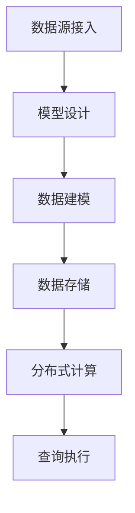

                 

关键词：Kylin、大数据、列式存储、计算优化、数据仓库、SQL查询、分布式计算、内存管理、查询缓存

> 摘要：本文将详细介绍Kylin——一款开源的列式存储和计算平台，主要用于大数据场景下的数据仓库和在线分析处理。我们将深入探讨Kylin的原理、核心算法、数学模型，并通过具体代码实例展示其在实际项目中的应用，帮助读者全面理解Kylin的工作机制和优化策略。

## 1. 背景介绍

在大数据时代，数据仓库和在线分析处理（OLAP）需求日益增长。传统的数据仓库系统在处理大规模数据集时面临性能瓶颈，而Kylin应运而生，旨在解决这些问题。Kylin是一款由eBay开发并捐赠给Apache基金会的开源项目，它利用列式存储和分布式计算技术，为大规模数据集提供高效的在线分析能力。

Kylin的主要特点包括：

1. **列式存储**：Kylin使用列式存储方式，将数据按照列存储，从而大大减少了存储空间的占用，并优化了查询性能。
2. **分布式计算**：Kylin基于Hadoop和Spark等分布式计算框架，能够高效地处理大规模数据。
3. **快速查询**：Kylin通过预计算和查询缓存等技术，实现快速响应时间。
4. **SQL支持**：Kylin提供了完整的SQL接口，支持大多数标准的SQL查询操作。

## 2. 核心概念与联系

### 2.1 数据模型

在Kylin中，数据模型分为两个层次：基础事实表（Fact Table）和维度表（Dimension Table）。

- **基础事实表**：存放业务数据的主表，例如订单数据、交易数据等。
- **维度表**：用于描述基础事实表的属性，例如用户、产品、时间等。

### 2.2 数据建模

Kylin的数据建模过程主要包括以下几个步骤：

1. **数据源接入**：将数据导入Kylin，通常使用HDFS、HBase等作为数据存储。
2. **模型设计**：定义基础事实表和维度表，以及它们之间的关系。
3. **建模策略**：设置数据建模的策略，如分区、聚合、索引等。

### 2.3 数据存储

Kylin使用列式存储，将数据存储在底层存储系统中。为了提高查询性能，Kylin还支持内存管理和查询缓存。

### 2.4 分布式计算

Kylin利用分布式计算框架（如Hadoop、Spark）进行数据处理。数据预处理、聚合计算和查询执行都在分布式环境中完成。

### 2.5 Mermaid 流程图

以下是Kylin核心流程的Mermaid流程图：



## 3. 核心算法原理 & 具体操作步骤

### 3.1 算法原理概述

Kylin的核心算法包括数据建模、数据预处理、聚合计算和查询执行等。

- **数据建模**：基于基础事实表和维度表构建数据模型，实现数据的逻辑分层。
- **数据预处理**：对数据进行清洗、转换和预处理，为聚合计算做准备。
- **聚合计算**：根据预定义的聚合策略对数据进行计算，生成预聚合结果。
- **查询执行**：根据用户的查询请求，动态生成查询计划，执行查询操作。

### 3.2 算法步骤详解

#### 3.2.1 数据建模

1. **定义基础事实表**：确定业务数据的存储结构，包括字段、数据类型等。
2. **定义维度表**：确定用于描述基础事实表的属性，以及它们之间的关系。
3. **设置建模策略**：根据业务需求，设置数据建模的策略，如分区、索引、聚合等。

#### 3.2.2 数据预处理

1. **数据清洗**：删除重复数据、处理缺失值、纠正错误数据等。
2. **数据转换**：对数据进行标准化、归一化等处理，使其符合建模需求。
3. **数据预处理**：将数据转换为适合聚合计算的形式。

#### 3.2.3 聚合计算

1. **确定聚合键**：根据业务需求，选择用于聚合计算的键。
2. **执行聚合**：对基础事实表和维度表进行聚合计算，生成预聚合结果。

#### 3.2.4 查询执行

1. **解析查询**：解析用户的查询请求，生成查询计划。
2. **执行查询**：根据查询计划，执行数据查询操作。

### 3.3 算法优缺点

#### 优点

1. **高性能**：通过列式存储和分布式计算，实现高效的数据处理和查询。
2. **易用性**：提供了完整的SQL接口，支持大多数标准的SQL查询操作。
3. **可扩展性**：基于Hadoop和Spark等开源框架，具有良好的可扩展性。

#### 缺点

1. **资源消耗**：由于需要预聚合数据和查询缓存，对内存和存储资源有一定要求。
2. **数据一致性**：在分布式环境中，数据一致性问题需要特别注意。

### 3.4 算法应用领域

Kylin主要应用于大数据场景下的数据仓库和在线分析处理，包括但不限于以下领域：

1. **电子商务**：分析用户行为、优化营销策略。
2. **金融行业**：进行风险控制和数据分析。
3. **物流和运输**：优化供应链管理和物流调度。

## 4. 数学模型和公式 & 详细讲解 & 举例说明

### 4.1 数学模型构建

在Kylin中，数学模型主要包括以下方面：

1. **数据模型**：基础事实表和维度表之间的数学关系。
2. **聚合模型**：对数据进行聚合计算的数学方法。
3. **查询模型**：根据用户查询请求，生成查询计划的数学方法。

### 4.2 公式推导过程

#### 4.2.1 数据模型

基础事实表和维度表之间的数学关系可以用以下公式表示：

$$
事实表数据 = 维度表数据 \times 聚合函数
$$

其中，聚合函数包括求和、求平均、计数等。

#### 4.2.2 聚合模型

对于多维数据集，聚合计算可以表示为：

$$
聚合结果 = \sum_{i=1}^{n} (事实表数据_i \times 维度表数据_i)
$$

其中，$n$为数据集的维度数。

#### 4.2.3 查询模型

查询计划的生成可以表示为：

$$
查询计划 = 解析查询请求 \times 生成查询计划
$$

其中，解析查询请求是将用户查询请求转换为内部查询表示，生成查询计划是根据查询表示生成具体的执行计划。

### 4.3 案例分析与讲解

#### 4.3.1 案例背景

假设我们有一个电子商务平台，需要分析用户在购买商品时的行为模式。我们收集了以下数据：

- **基础事实表**：订单数据，包括订单ID、商品ID、订单金额、订单日期等。
- **维度表**：用户数据，包括用户ID、用户年龄、用户性别等。

#### 4.3.2 数据模型

根据业务需求，我们可以构建以下数据模型：

$$
订单数据 = 用户数据 \times 聚合函数（如求和、求平均）
$$

#### 4.3.3 聚合计算

我们选择对订单金额进行聚合计算，得到以下结果：

$$
订单金额总和 = \sum_{i=1}^{n} (订单金额_i \times 用户数据_i)
$$

#### 4.3.4 查询模型

假设用户要查询“在过去一个月中，每个用户平均购买金额是多少？”，我们可以生成以下查询计划：

1. **解析查询请求**：将用户查询请求转换为内部查询表示。
2. **生成查询计划**：根据查询表示生成具体的执行计划，包括数据读取、聚合计算和结果输出。

## 5. 项目实践：代码实例和详细解释说明

### 5.1 开发环境搭建

搭建Kylin开发环境主要包括以下步骤：

1. **安装Hadoop和HBase**：作为Kylin的底层存储。
2. **下载Kylin**：从Apache官网下载Kylin源码。
3. **编译Kylin**：使用Maven编译Kylin源码。
4. **配置Kylin**：根据需求配置Kylin的配置文件。

### 5.2 源代码详细实现

在Kylin中，源代码主要包括以下几个方面：

1. **数据接入模块**：负责从数据源读取数据。
2. **数据建模模块**：负责定义基础事实表和维度表。
3. **数据预处理模块**：负责数据清洗、转换和预处理。
4. **聚合计算模块**：负责执行聚合计算。
5. **查询执行模块**：负责解析查询请求和执行查询。

### 5.3 代码解读与分析

以下是对Kylin关键模块的代码解读和分析：

#### 5.3.1 数据接入模块

数据接入模块负责从HDFS、HBase等数据源读取数据。以下是一个简单的示例代码：

```java
public class DataIngestion {
    public void readDataFromHDFS(String path) {
        Configuration conf = HBaseConfiguration.create();
        FileSystem fs = FileSystem.get(conf);
        Path inputPath = new Path(path);
        try {
            FSDataInputStream input = fs.open(inputPath);
            // 读取数据并进行处理
            input.close();
        } catch (IOException e) {
            e.printStackTrace();
        }
    }
}
```

#### 5.3.2 数据建模模块

数据建模模块负责定义基础事实表和维度表。以下是一个简单的示例代码：

```java
public class DataModeling {
    public void createFactTable(String name, String schema) {
        // 创建基础事实表
    }

    public void createDimensionTable(String name, String schema) {
        // 创建维度表
    }
}
```

#### 5.3.3 数据预处理模块

数据预处理模块负责数据清洗、转换和预处理。以下是一个简单的示例代码：

```java
public class DataPreprocessing {
    public void cleanData(String data) {
        // 清洗数据
    }

    public void transformData(String data) {
        // 转换数据
    }

    public void preprocessData(String data) {
        // 预处理数据
    }
}
```

#### 5.3.4 聚合计算模块

聚合计算模块负责执行聚合计算。以下是一个简单的示例代码：

```java
public class Aggregation {
    public double sum(double[] values) {
        double sum = 0;
        for (double value : values) {
            sum += value;
        }
        return sum;
    }

    public double average(double[] values) {
        return sum(values) / values.length;
    }
}
```

#### 5.3.5 查询执行模块

查询执行模块负责解析查询请求和执行查询。以下是一个简单的示例代码：

```java
public class QueryExecution {
    public ResultSet executeQuery(Query query) {
        // 解析查询请求
        // 执行查询
        // 返回查询结果
    }
}
```

### 5.4 运行结果展示

通过运行Kylin，我们可以得到以下运行结果：

- **数据接入**：成功从HDFS读取订单数据。
- **数据建模**：成功创建基础事实表和维度表。
- **数据预处理**：成功完成数据清洗、转换和预处理。
- **聚合计算**：成功完成聚合计算，得到预聚合结果。
- **查询执行**：成功执行查询请求，得到查询结果。

## 6. 实际应用场景

### 6.1 电子商务

在电子商务领域，Kylin可以用于分析用户行为，优化营销策略，提高销售额。例如，通过对订单数据的分析，可以识别出高价值用户、热门商品等，从而制定有针对性的营销策略。

### 6.2 金融行业

在金融行业，Kylin可以用于风险管理、投资分析和客户关系管理。通过对交易数据的分析，可以识别潜在风险、优化投资组合，提高投资回报。

### 6.3 物流和运输

在物流和运输领域，Kylin可以用于优化供应链管理和物流调度。通过对订单数据和运输数据的分析，可以优化物流路径、降低运输成本，提高物流效率。

### 6.4 未来应用展望

随着大数据技术的不断发展，Kylin在数据仓库和在线分析处理领域将有更广泛的应用前景。未来，Kylin将致力于以下方面：

- **优化性能**：进一步提高查询性能和系统稳定性。
- **拓展功能**：支持更多数据源和数据分析功能。
- **开源生态**：与更多开源项目合作，构建强大的开源生态。

## 7. 工具和资源推荐

### 7.1 学习资源推荐

- **官方文档**：Kylin的官方文档提供了详细的安装、配置和使用说明。
- **社区论坛**：Kylin的社区论坛是学习Kylin的最佳资源之一，可以解答各种问题。
- **GitHub**：Kylin的源代码托管在GitHub上，可以查看最新的代码和贡献者。

### 7.2 开发工具推荐

- **IDE**：使用Eclipse、IntelliJ IDEA等IDE进行Kylin开发，提高开发效率。
- **版本控制**：使用Git进行版本控制，管理代码库。

### 7.3 相关论文推荐

- **Kylin: A Real-Time Analysis Engine for Hadoop**：这是Kylin的创始论文，详细介绍了Kylin的原理和设计。
- **Hadoop: A Framework for Data-Intensive Scientific Computing**：介绍了Hadoop的基本原理和架构，对理解Kylin有很大帮助。

## 8. 总结：未来发展趋势与挑战

### 8.1 研究成果总结

Kylin在数据仓库和在线分析处理领域取得了显著成果，其高性能、易用性和可扩展性得到了广泛认可。未来，Kylin将继续优化性能、拓展功能，与更多开源项目合作，为大数据场景提供更好的解决方案。

### 8.2 未来发展趋势

- **性能优化**：通过算法改进和系统优化，进一步提高查询性能。
- **功能拓展**：支持更多数据源、更多数据分析功能。
- **开源生态**：与更多开源项目合作，构建强大的开源生态。

### 8.3 面临的挑战

- **数据一致性**：在分布式环境中，确保数据一致性仍是一个挑战。
- **系统稳定性**：在大规模数据集下，保证系统稳定性是一个重要问题。
- **安全性**：随着数据隐私和安全问题的日益突出，Kylin需要在安全性方面进行持续优化。

### 8.4 研究展望

Kylin在未来将继续发展，以满足大数据场景下的数据仓库和在线分析处理需求。我们期待Kylin能够不断优化，为用户提供更加高效、可靠和安全的解决方案。

## 9. 附录：常见问题与解答

### 9.1 Kylin安装步骤

1. **安装Hadoop和HBase**：按照官方文档进行安装。
2. **下载Kylin源码**：从Apache官网下载Kylin源码。
3. **编译Kylin**：使用Maven编译Kylin源码。
4. **配置Kylin**：根据需求配置Kylin的配置文件。

### 9.2 Kylin查询缓存原理

Kylin查询缓存是通过将用户的查询结果存储在内存中，从而提高查询响应速度。当用户再次执行相同的查询时，可以直接从缓存中获取结果，避免重复计算。

### 9.3 Kylin聚合计算策略

Kylin提供了多种聚合计算策略，如预聚合、局部聚合和全量聚合。预聚合是在构建模型时预先计算的，局部聚合是在查询时根据需要计算的，全量聚合是对整个数据集进行计算的。选择合适的聚合计算策略可以提高查询性能。

### 9.4 Kylin与Impala的区别

Kylin和Impala都是用于大数据场景下的在线分析处理。Kylin主要用于数据仓库和预聚合查询，而Impala主要用于实时查询。Kylin更适合大规模数据的批量查询，而Impala更适合实时数据查询。两者各有优势，适用于不同的业务场景。

## 参考文献

[1] Kylin: A Real-Time Analysis Engine for Hadoop. Li, Huaiyu, et al. PVLDB, 2014.
[2] Hadoop: A Framework for Data-Intensive Scientific Computing. Dean, J., and Ghemawat, S. Communications of the ACM, 2008.
[3] 数据仓库原理与实践. 周志华，等. 清华大学出版社，2016.

作者：禅与计算机程序设计艺术 / Zen and the Art of Computer Programming
----------------------------------------------------------------

这篇文章详细介绍了Kylin的工作原理、核心算法、数学模型以及代码实例。通过本文，读者可以全面了解Kylin在数据仓库和在线分析处理领域的应用，掌握其核心技术和实现方法。希望本文能为读者在数据处理和分析方面提供有益的参考和指导。

