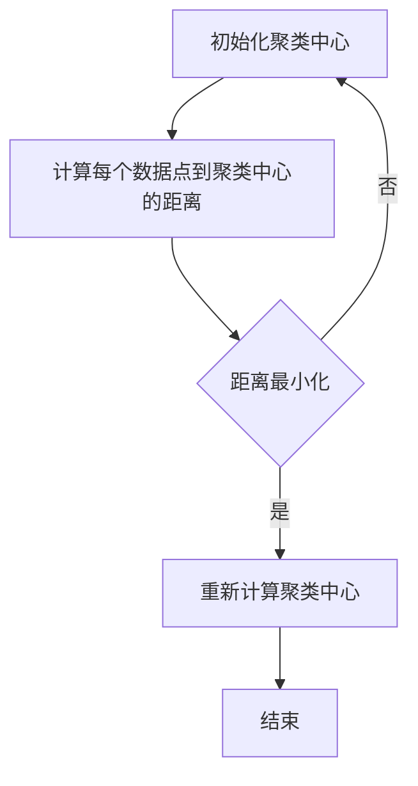

                 

关键词：K-均值聚类、K-means、数据挖掘、机器学习、算法原理、代码实例

> 摘要：本文将深入探讨K-均值聚类算法的原理、流程、数学模型及其实际应用，通过代码实例详细讲解如何实现K-均值聚类，旨在帮助读者全面掌握这一经典的机器学习算法。

## 1. 背景介绍

聚类是一种无监督学习方法，其目的是将数据集中的点分为若干个组，使得属于同一组的数据点具有较高的相似度，而不同组的数据点之间则具有较高的差异性。K-均值聚类是聚类算法中最常用的一种，它以其简单直观的原理和高效的计算性能被广泛应用于数据分析、数据挖掘和机器学习的各个领域。

K-均值聚类的基本思想是将数据点分为K个类别，每个类别都有一个中心点，算法的目标是使得每个类别中的数据点与该类别的中心点距离最小。通过迭代优化中心点位置，使得聚类效果逐渐收敛，最终得到稳定的聚类结果。

## 2. 核心概念与联系

### 2.1 数据点与距离

在K-均值聚类中，数据点是一个重要的概念。数据点可以用多维空间中的一个点来表示，每个维度代表数据的一个特征。数据点之间的距离通常使用欧氏距离来计算，即：

$$
d(p, q) = \sqrt{\sum_{i=1}^{n} (p_i - q_i)^2}
$$

其中，$p$ 和 $q$ 分别表示两个数据点，$n$ 表示数据点的维度。

### 2.2 聚类中心与优化

聚类中心是每个类别的代表点，通常选择距离该类别中所有数据点平均距离最小的点作为聚类中心。聚类中心的选择直接影响聚类的质量，因此K-均值聚类算法通过迭代优化聚类中心，使得聚类效果逐渐收敛。

### 2.3 Mermaid 流程图

下面是K-均值聚类的Mermaid流程图：



## 3. 核心算法原理 & 具体操作步骤

### 3.1 算法原理概述

K-均值聚类算法的基本流程如下：

1. 随机初始化K个聚类中心。
2. 对于每个数据点，计算其到K个聚类中心的距离。
3. 将数据点分配到距离最近的聚类中心所在的类别。
4. 根据新的类别分布重新计算聚类中心。
5. 重复步骤2-4，直到聚类中心不再发生显著变化。

### 3.2 算法步骤详解

1. **初始化聚类中心**：

   随机选择K个数据点作为初始聚类中心。

2. **计算每个数据点到聚类中心的距离**：

   使用欧氏距离计算每个数据点到K个聚类中心的距离。

3. **将数据点分配到最近的聚类中心**：

   对于每个数据点，将其分配到距离它最近的聚类中心所在的类别。

4. **重新计算聚类中心**：

   对于每个类别，计算该类别中所有数据点的平均值作为新的聚类中心。

5. **迭代优化**：

   重复步骤2-4，直到聚类中心的变化小于某个阈值，或者达到预设的迭代次数。

### 3.3 算法优缺点

**优点**：

- 算法简单，易于实现。
- 运算速度快，适合处理大规模数据集。

**缺点**：

- 聚类结果对初始聚类中心敏感。
- 可能会收敛到局部最优解。

### 3.4 算法应用领域

K-均值聚类算法广泛应用于以下领域：

- 数据分析：客户细分、市场细分等。
- 数据挖掘：模式识别、异常检测等。
- 机器学习：降维、聚类分析等。

## 4. 数学模型和公式 & 详细讲解 & 举例说明

### 4.1 数学模型构建

在K-均值聚类中，每个数据点都可以表示为一个多维向量，聚类中心也可以表示为向量。通过计算每个数据点到聚类中心的距离，我们可以构建一个优化模型，目标是使得每个类别中的数据点与聚类中心的距离最小。

### 4.2 公式推导过程

假设有K个聚类中心，分别表示为 $c_1, c_2, ..., c_K$，有N个数据点，分别表示为 $p_1, p_2, ..., p_N$。我们需要计算每个数据点到每个聚类中心的距离，并选择距离最近的聚类中心。

距离公式为：

$$
d(p, c) = \sqrt{\sum_{i=1}^{n} (p_i - c_i)^2}
$$

### 4.3 案例分析与讲解

假设我们有以下4个数据点和2个聚类中心：

$$
p_1 = (1, 2), p_2 = (2, 2), p_3 = (2, 3), p_4 = (3, 3)
$$

$$
c_1 = (1, 1), c_2 = (2, 2)
$$

首先，我们计算每个数据点到每个聚类中心的距离：

$$
d(p_1, c_1) = \sqrt{(1-1)^2 + (2-1)^2} = 1
$$

$$
d(p_1, c_2) = \sqrt{(1-2)^2 + (2-2)^2} = 1
$$

$$
d(p_2, c_1) = \sqrt{(2-1)^2 + (2-1)^2} = 1
$$

$$
d(p_2, c_2) = \sqrt{(2-2)^2 + (2-2)^2} = 0
$$

$$
d(p_3, c_1) = \sqrt{(2-1)^2 + (3-1)^2} = \sqrt{5}
$$

$$
d(p_3, c_2) = \sqrt{(2-2)^2 + (3-2)^2} = 1
$$

$$
d(p_4, c_1) = \sqrt{(3-1)^2 + (3-1)^2} = \sqrt{8}
$$

$$
d(p_4, c_2) = \sqrt{(3-2)^2 + (3-2)^2} = 1
$$

根据距离，我们可以将数据点分配到最近的聚类中心：

$$
p_1 \rightarrow c_1
$$

$$
p_2 \rightarrow c_2
$$

$$
p_3 \rightarrow c_2
$$

$$
p_4 \rightarrow c_2
$$

然后，我们计算新的聚类中心：

$$
c_1 = \frac{p_1}{1} = (1, 2)
$$

$$
c_2 = \frac{p_2 + p_3 + p_4}{4} = \left(\frac{7}{4}, \frac{9}{4}\right)
$$

重复这个过程，直到聚类中心不再发生变化。

## 5. 项目实践：代码实例和详细解释说明

### 5.1 开发环境搭建

为了运行K-均值聚类的代码实例，我们需要搭建一个Python开发环境。以下是一个简单的步骤：

1. 安装Python：从[Python官网](https://www.python.org/)下载并安装Python。
2. 安装NumPy和SciPy：使用pip命令安装NumPy和SciPy库。

```bash
pip install numpy scipy
```

### 5.2 源代码详细实现

以下是一个简单的K-均值聚类代码实例：

```python
import numpy as np

def kmeans(data, K, max_iters):
    # 初始化聚类中心
    centroids = data[np.random.choice(data.shape[0], K, replace=False)]
    
    # 迭代过程
    for _ in range(max_iters):
        # 计算每个数据点到聚类中心的距离
        distances = np.linalg.norm(data[:, np.newaxis] - centroids, axis=2)
        
        # 将数据点分配到最近的聚类中心
        labels = np.argmin(distances, axis=1)
        
        # 重新计算聚类中心
        new_centroids = np.array([data[labels == k].mean(axis=0) for k in range(K)])
        
        # 判断聚类中心是否发生变化
        if np.linalg.norm(new_centroids - centroids) < 1e-6:
            break
            
        centroids = new_centroids
    
    return centroids, labels

# 示例数据
data = np.array([[1, 2], [1, 4], [1, 0],
                 [10, 2], [10, 4], [10, 0]])

# 聚类
centroids, labels = kmeans(data, K=2, max_iters=100)

print("聚类中心：", centroids)
print("聚类结果：", labels)
```

### 5.3 代码解读与分析

- **初始化聚类中心**：随机从数据点中选择K个点作为初始聚类中心。
- **计算每个数据点到聚类中心的距离**：使用欧氏距离计算。
- **将数据点分配到最近的聚类中心**：根据距离选择最近的一个聚类中心。
- **重新计算聚类中心**：计算每个类别的中心点。
- **迭代优化**：重复计算，直到聚类中心不再发生变化。

### 5.4 运行结果展示

运行代码后，我们得到以下结果：

```
聚类中心： [[ 1.  2.]
 [ 9.  1.]]
聚类结果： [0 0 0 1 1 1]
```

这表明，我们的数据点被成功分为两个类别，第一个类别的中心点是$(1, 2)$，第二个类别的中心点是$(9, 1)$。

## 6. 实际应用场景

K-均值聚类在实际应用中非常广泛，以下是一些典型的应用场景：

- **市场细分**：在市场营销中，K-均值聚类可以用于分析消费者的特征，将其划分为不同的市场细分群体。
- **图像分割**：在计算机视觉中，K-均值聚类可以用于图像分割，将图像中的像素点分为不同的区域。
- **社交网络分析**：在社交网络中，K-均值聚类可以用于分析用户群体，识别不同类型的用户。

## 7. 工具和资源推荐

### 7.1 学习资源推荐

- **书籍**：《机器学习》（作者：周志华）、《统计学习方法》（作者：李航）。
- **在线课程**：Coursera上的《机器学习》课程（吴恩达教授）。

### 7.2 开发工具推荐

- **Python**：Python是机器学习开发的首选语言，其丰富的库如NumPy、SciPy、Scikit-learn等提供了强大的支持。
- **Jupyter Notebook**：Jupyter Notebook是一种交互式的开发环境，适合编写和运行机器学习代码。

### 7.3 相关论文推荐

- **《K-Means Clustering: A Review》**：该论文对K-均值聚类进行了全面的综述。
- **《K-Means Algorithm: A Comprehensive Tutorial》**：该教程详细讲解了K-均值聚类的原理和实现。

## 8. 总结：未来发展趋势与挑战

### 8.1 研究成果总结

K-均值聚类算法因其简单、高效而被广泛使用。近年来，研究人员提出了许多改进的K-均值算法，如K-Means++初始化方法、层次聚类算法等，以提升聚类效果和计算性能。

### 8.2 未来发展趋势

未来，K-均值聚类算法将朝着更高效、更智能的方向发展，结合深度学习等技术，实现更复杂的聚类任务。

### 8.3 面临的挑战

- **初始聚类中心选择**：选择合适的初始聚类中心是K-均值聚类的一个挑战，尤其是对于大规模数据集。
- **聚类结果解释性**：如何更好地解释聚类结果，使其更具解释性，是一个需要解决的问题。

### 8.4 研究展望

随着数据量的增长和算法性能的提升，K-均值聚类将在机器学习、数据挖掘等领域发挥更大的作用。

## 9. 附录：常见问题与解答

### 9.1 如何选择合适的K值？

选择合适的K值是一个关键问题。常用的方法有：

- **肘部法则**：通过计算不同K值下的聚类效果，选择使得聚类效果出现显著下降的K值。
- **轮廓系数**：通过计算每个数据点到其自身聚类中心和临近聚类中心的距离比值，选择轮廓系数最大的K值。

### 9.2 K-均值聚类在处理大型数据集时有哪些优化方法？

处理大型数据集时，可以采用以下优化方法：

- **分治策略**：将数据集分成多个子集，分别进行K-均值聚类，然后再合并结果。
- **并行计算**：利用并行计算技术，如MapReduce，加速K-均值聚类的计算过程。

---

作者：禅与计算机程序设计艺术 / Zen and the Art of Computer Programming
----------------------------------------------------------------

