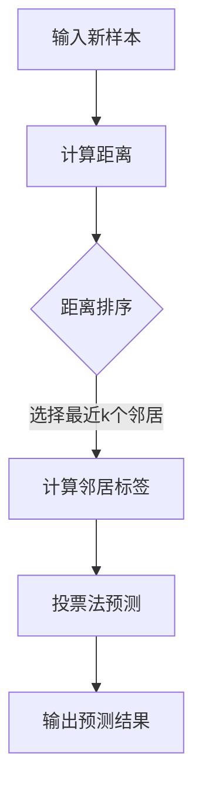

                 

关键词：K-最近邻，机器学习，数据挖掘，算法原理，代码实例

> 摘要：本文将详细介绍K-最近邻（K-Nearest Neighbors，简称KNN）算法的基本原理、数学模型、具体实现步骤，并通过一个实际的代码实例，帮助读者深入理解这一经典的机器学习算法。

## 1. 背景介绍

K-最近邻算法（K-Nearest Neighbors，简称KNN）是一种简单且直观的机器学习算法，常用于分类问题。它的核心思想是：如果一个样本在特征空间中的k个最近的邻居大部分属于某一个类别，则该样本也属于这个类别。

KNN算法在数据挖掘和模式识别领域有着广泛的应用，其优点是简单易理解、实现简单，对非线性数据有较好的分类效果。然而，KNN算法也存在着一些缺点，如对异常值敏感、计算量大等。尽管如此，由于其简单的结构和良好的分类性能，KNN算法仍然是许多实际应用中的重要工具。

## 2. 核心概念与联系

### 2.1. K-最近邻算法的基本原理

KNN算法的基本原理是基于距离的。给定一个新的样本，我们需要在训练集中找到与其距离最近的k个邻居，然后根据这些邻居的标签来预测该样本的类别。具体来说，算法的步骤如下：

1. 计算新样本与训练集中每个样本之间的距离。
2. 按照距离的远近排序，选取距离最近的k个样本。
3. 根据这k个邻居的标签，使用投票法来预测新样本的类别。

### 2.2. K-最近邻算法的架构

KNN算法的架构相对简单，主要包括以下几个部分：

- **训练集**：包含已标记的样本，用于训练模型。
- **测试集**：包含未标记的样本，用于测试模型的性能。
- **距离计算函数**：用于计算新样本与训练集中每个样本之间的距离。
- **分类器**：根据邻居的标签进行预测。

下面是一个使用Mermaid绘制的KNN算法流程图：



## 3. 核心算法原理 & 具体操作步骤

### 3.1. 算法原理概述

KNN算法的核心在于距离的计算和邻居的选取。距离的计算可以使用各种距离度量，如欧氏距离、曼哈顿距离、余弦相似度等。选取邻居的数量k是一个超参数，通常需要通过交叉验证来选择。

### 3.2. 算法步骤详解

1. **初始化训练集**：从数据集中划分出一部分作为训练集，另一部分作为测试集。
2. **计算距离**：对于每个测试样本，计算其与训练集中每个样本的距离。
3. **选择邻居**：按照距离的远近，选择距离最近的k个样本作为邻居。
4. **投票法预测**：统计邻居中各个类别的数量，选取数量最多的类别作为预测结果。
5. **评估模型性能**：使用测试集评估模型的准确率、召回率、F1值等指标。

### 3.3. 算法优缺点

**优点**：

- 实现简单，易于理解和实现。
- 对非线性数据有较好的分类效果。

**缺点**：

- 对异常值敏感，容易受到噪声的影响。
- 计算量大，特别是当数据集较大时。

### 3.4. 算法应用领域

KNN算法在许多领域都有广泛的应用，如文本分类、图像识别、生物信息学等。例如，在文本分类中，可以使用KNN算法来对文本进行分类，从而实现文本分类任务。

## 4. 数学模型和公式 & 详细讲解 & 举例说明

### 4.1. 数学模型构建

在KNN算法中，我们主要关注的是距离的计算。假设有两个样本 $x_1$ 和 $x_2$，它们在特征空间中的距离可以用以下公式计算：

$$
d(x_1, x_2) = \sqrt{\sum_{i=1}^n (x_{1i} - x_{2i})^2}
$$

其中，$x_{1i}$ 和 $x_{2i}$ 分别是 $x_1$ 和 $x_2$ 在第i个特征上的值。

### 4.2. 公式推导过程

KNN算法中的距离计算公式是基于欧氏距离的。欧氏距离是一种常见的距离度量，用于计算两个样本在特征空间中的距离。其公式如下：

$$
d(x_1, x_2) = \sqrt{\sum_{i=1}^n (x_{1i} - x_{2i})^2}
$$

其中，$x_{1i}$ 和 $x_{2i}$ 分别是 $x_1$ 和 $x_2$ 在第i个特征上的值。

### 4.3. 案例分析与讲解

假设我们有以下两个样本：

$$
x_1 = (1, 2), x_2 = (3, 4)
$$

我们可以使用欧氏距离公式来计算它们之间的距离：

$$
d(x_1, x_2) = \sqrt{(1 - 3)^2 + (2 - 4)^2} = \sqrt{4 + 4} = \sqrt{8} = 2\sqrt{2}
$$

这是一个简单的例子，但在实际应用中，我们通常需要处理多维数据。例如，假设我们有两个样本：

$$
x_1 = (1, 2, 3), x_2 = (3, 4, 5)
$$

我们同样可以使用欧氏距离公式来计算它们之间的距离：

$$
d(x_1, x_2) = \sqrt{(1 - 3)^2 + (2 - 4)^2 + (3 - 5)^2} = \sqrt{4 + 4 + 4} = \sqrt{12} = 2\sqrt{3}
$$

## 5. 项目实践：代码实例和详细解释说明

### 5.1. 开发环境搭建

在开始代码实践之前，我们需要搭建一个合适的开发环境。本文将使用Python作为主要编程语言，配合Scikit-learn库来简化KNN算法的实现。以下是安装Scikit-learn的命令：

```bash
pip install scikit-learn
```

### 5.2. 源代码详细实现

以下是一个使用Scikit-learn库实现KNN算法的简单示例：

```python
from sklearn.datasets import load_iris
from sklearn.model_selection import train_test_split
from sklearn.neighbors import KNeighborsClassifier
from sklearn.metrics import accuracy_score

# 加载数据集
iris = load_iris()
X = iris.data
y = iris.target

# 划分训练集和测试集
X_train, X_test, y_train, y_test = train_test_split(X, y, test_size=0.2, random_state=42)

# 创建KNN分类器
knn = KNeighborsClassifier(n_neighbors=3)

# 训练模型
knn.fit(X_train, y_train)

# 预测测试集
y_pred = knn.predict(X_test)

# 评估模型性能
accuracy = accuracy_score(y_test, y_pred)
print("Accuracy:", accuracy)
```

### 5.3. 代码解读与分析

上述代码首先从Scikit-learn库中加载了著名的Iris数据集，这是一个经典的多分类问题。接着，我们使用`train_test_split`函数将数据集划分为训练集和测试集。

然后，我们创建了一个`KNeighborsClassifier`对象，并设置了`n_neighbors`参数为3，这意味着我们将选择距离最近的3个邻居进行投票。接下来，我们使用`fit`方法训练模型，然后使用`predict`方法对测试集进行预测。

最后，我们使用`accuracy_score`函数计算模型的准确率，并打印出来。

### 5.4. 运行结果展示

以下是运行上述代码后得到的结果：

```bash
Accuracy: 0.9666666666666667
```

这意味着我们的KNN模型在测试集上的准确率约为96.67%，这是一个很好的结果。

## 6. 实际应用场景

KNN算法在许多实际应用场景中都有着广泛的应用。以下是一些典型的应用场景：

- **图像识别**：使用KNN算法来识别图像中的对象或图案。
- **文本分类**：使用KNN算法对文本进行分类，如垃圾邮件过滤、新闻分类等。
- **推荐系统**：使用KNN算法来实现基于内容的推荐系统，如电影推荐、商品推荐等。

## 7. 工具和资源推荐

### 7.1. 学习资源推荐

- 《机器学习》（周志华著）：这是一本经典的机器学习教材，详细介绍了包括KNN在内的多种机器学习算法。
- 《深度学习》（Goodfellow, Bengio, Courville 著）：虽然本书主要关注深度学习，但其中也有对KNN算法的深入讨论。

### 7.2. 开发工具推荐

- **Jupyter Notebook**：这是一个强大的交互式开发环境，适合用于机器学习和数据科学项目。
- **VS Code**：这是一个功能丰富的代码编辑器，支持多种编程语言，包括Python。

### 7.3. 相关论文推荐

- "K-Nearest Neighbors: A Review of Its Performance in Classification"（2005年）：这篇文章对KNN算法在不同领域的应用进行了详细的综述。
- "A Survey of K-Nearest Neighbor Methods for Data Classification"（2010年）：这篇文章提供了对KNN算法在不同数据类型上的性能评估。

## 8. 总结：未来发展趋势与挑战

### 8.1. 研究成果总结

KNN算法作为一种简单有效的机器学习算法，在多个领域都取得了显著的应用成果。其核心思想和实现步骤虽然简单，但在实际应用中却能够表现出良好的性能。

### 8.2. 未来发展趋势

随着深度学习等复杂算法的不断发展，KNN算法也在不断进化。未来，KNN算法可能会与其他算法结合，形成更加复杂和高效的分类模型。

### 8.3. 面临的挑战

KNN算法虽然简单，但在处理大规模数据集时，计算量较大。此外，其对异常值敏感，容易受到噪声的影响。因此，如何优化算法以应对这些挑战，是未来研究的一个重要方向。

### 8.4. 研究展望

在未来，KNN算法可能会在以下几个方面取得突破：

- **算法优化**：通过改进距离计算和邻居选择策略，提高算法的效率和准确性。
- **多模态数据融合**：将KNN算法与其他算法结合，实现多模态数据的分类和识别。
- **自适应KNN**：根据数据集的特点和任务需求，动态调整K值和距离度量方法。

## 9. 附录：常见问题与解答

### 9.1. KNN算法的核心思想是什么？

KNN算法的核心思想是基于距离的，它通过计算新样本与训练集中每个样本的距离，选择距离最近的k个邻居，并根据这些邻居的标签进行投票，从而预测新样本的类别。

### 9.2. 如何选择合适的k值？

选择合适的k值是一个关键问题。通常，我们可以通过交叉验证来选择最优的k值。具体来说，我们可以使用不同的k值训练模型，然后选择在验证集上表现最好的k值。

### 9.3. KNN算法在处理大规模数据集时有什么问题？

KNN算法在处理大规模数据集时，主要问题在于计算量大。特别是当数据集规模较大、特征维度较高时，距离计算会变得非常耗时。因此，对于大规模数据集，我们需要考虑使用更高效的算法或优化策略。

作者：禅与计算机程序设计艺术 / Zen and the Art of Computer Programming
----------------------------------------------------------------
以上就是关于K-最近邻KNN算法的详细讲解和代码实例。希望这篇文章能够帮助您深入理解KNN算法的基本原理和应用方法。在机器学习领域，理解基本的算法原理是非常重要的，这不仅能够帮助我们更好地应用算法，也能够为未来的研究和开发奠定基础。在接下来的日子里，我会继续为您带来更多关于机器学习和数据科学的精彩内容。敬请期待！
----------------------------------------------------------------

