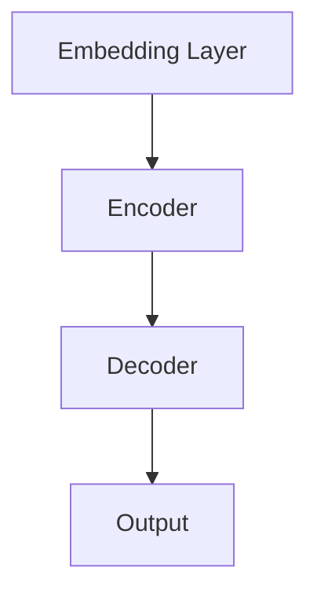
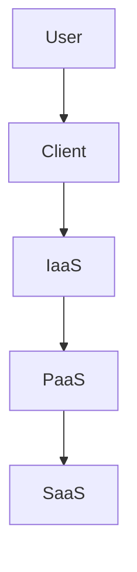
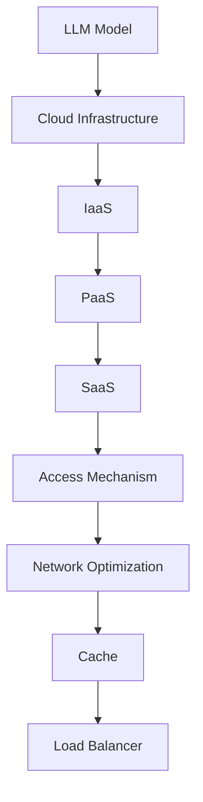

                 

关键词：LLM，云端部署，大规模访问，计算架构，优化策略，安全性，性能调优。

> 摘要：本文旨在探讨大型语言模型（LLM）在云端的大规模部署与访问策略。通过分析LLM的架构特点，提出有效的部署方案，讨论访问机制优化，以及应对安全性、性能调优等挑战。本文将对当前LLM的实践案例进行深入分析，并展望未来发展趋势与面临的挑战。

## 1. 背景介绍

近年来，大型语言模型（LLM）如BERT、GPT-3等取得了显著的进展，推动了自然语言处理（NLP）领域的快速发展。这些模型具有极强的表达能力和推理能力，可以应用于文本生成、问答系统、机器翻译等多种任务。然而，随着模型规模的不断增大，如何在大规模云端环境中部署和高效访问LLM成为一个关键问题。

云计算的普及为LLM的部署提供了强大的基础设施支持。云端环境具有弹性扩展、高可用性和分布式计算等特点，能够满足大规模模型的需求。然而，云计算也带来了一系列挑战，如数据安全、性能调优、资源利用率等。

本文将从以下几个方面展开讨论：

1. **LLM的架构特点**：分析LLM的结构，包括参数规模、计算复杂度和数据需求。
2. **大规模部署策略**：探讨如何利用云计算资源，实现LLM的高效部署。
3. **访问机制优化**：研究如何优化访问机制，提高LLM的响应速度和用户体验。
4. **安全性保障**：分析在云端部署LLM面临的安全风险，并提出相应的防护措施。
5. **性能调优**：探讨如何优化LLM的性能，包括计算优化、数据缓存等策略。
6. **实际应用场景**：介绍LLM在云端的具体应用案例，展示其实际效果。
7. **未来展望**：总结研究成果，展望LLM在云端的发展趋势和面临的挑战。

## 2. 核心概念与联系

### 2.1 LLM架构原理

大型语言模型（LLM）通常基于深度神经网络（DNN）或变换器模型（Transformer）。以下是一个简化的LLM架构原理：

$$
\text{Input} \rightarrow \text{Embedding Layer} \rightarrow \text{Encoder} \rightarrow \text{Decoder} \rightarrow \text{Output}
$$

- **Embedding Layer**：将输入的单词或句子映射到高维向量空间。
- **Encoder**：用于编码输入序列，生成上下文表示。
- **Decoder**：用于解码输出序列，生成预测结果。

图1：LLM架构原理图



### 2.2 云计算架构

云计算架构包括基础设施即服务（IaaS）、平台即服务（PaaS）和软件即服务（SaaS）等层次。以下是一个简化的云计算架构图：

图2：云计算架构原理图



- **User**：云服务的最终用户。
- **Client**：用户的应用程序或客户端。
- **IaaS**：提供基础设施服务，如虚拟机、存储和网络。
- **PaaS**：提供平台服务，如开发工具、数据库和中间件。
- **SaaS**：提供软件服务，如邮件、CRM和ERP系统。

### 2.3 大规模部署与访问机制

- **大规模部署**：通过云计算平台，可以实现LLM的弹性扩展。部署时，需要考虑模型分割、分布式计算和负载均衡等技术。
- **访问机制**：通过优化网络、缓存和负载均衡等机制，可以提高LLM的访问性能。例如，使用CDN、缓存服务器和负载均衡器等。

图3：大规模部署与访问机制图



## 3. 核心算法原理 & 具体操作步骤

### 3.1 算法原理概述

LLM的核心算法是基于变换器模型（Transformer），其基本原理是通过自注意力机制（Self-Attention）来处理序列数据。自注意力机制可以自动学习输入序列中的依赖关系，从而提高模型的表示能力。

### 3.2 算法步骤详解

1. **预处理**：将输入的文本数据转换为词向量表示，并构建词汇表。
2. **编码器**：使用多层变换器块（Transformer Block）对输入序列进行编码。每个变换器块包含多层自注意力机制和前馈神经网络。
3. **解码器**：在编码器的输出序列基础上，使用多层变换器块生成输出序列。解码器在生成每个输出词时，都依赖于编码器的输出和已生成的输出词。
4. **损失函数**：使用交叉熵损失函数（Cross-Entropy Loss）计算模型输出与真实标签之间的差距，并优化模型参数。

### 3.3 算法优缺点

- **优点**：变换器模型具有强大的表示能力，可以处理长距离依赖问题。自注意力机制使得模型可以自动学习输入序列中的依赖关系。
- **缺点**：模型参数规模庞大，计算复杂度高，对计算资源和存储需求较高。训练时间较长，对硬件性能有较高要求。

### 3.4 算法应用领域

LLM在自然语言处理领域具有广泛的应用。以下是一些典型的应用场景：

- **文本生成**：生成文章、新闻、诗歌等。
- **问答系统**：处理用户输入的问题，并提供相关答案。
- **机器翻译**：将一种语言的文本翻译成另一种语言。
- **文本分类**：对输入的文本进行分类，如情感分析、新闻分类等。

## 4. 数学模型和公式 & 详细讲解 & 举例说明

### 4.1 数学模型构建

LLM的数学模型基于变换器模型（Transformer）。变换器模型的核心是自注意力机制（Self-Attention），其公式如下：

$$
\text{Attention}(Q, K, V) = \frac{(\text{QK}^T)}{\sqrt{d_k}} \text{V}
$$

其中，Q、K和V分别为查询（Query）、键（Key）和值（Value）向量，$d_k$为键向量的维度。

### 4.2 公式推导过程

自注意力机制的推导过程可以分为以下几个步骤：

1. **点积注意力**：计算查询（Q）与键（K）之间的点积，得到注意力权重。
2. **缩放**：为了避免权重过大，通常对注意力权重进行缩放，即除以$\sqrt{d_k}$。
3. **加权求和**：将缩放后的注意力权重与值（V）进行加权求和，得到最终的输出。

### 4.3 案例分析与讲解

以下是一个简单的自注意力机制的例子：

假设有3个词（word1、word2、word3），其嵌入向量分别为$[1, 2, 3]$、$[4, 5, 6]$、$[7, 8, 9]$。

1. **计算键（K）和查询（Q）**：
   - $Q = [1, 2, 3]$
   - $K = [4, 5, 6]$
2. **计算注意力权重**：
   - $QK^T = [1, 2, 3] \cdot [4, 5, 6]^T = 1 \cdot 4 + 2 \cdot 5 + 3 \cdot 6 = 32$
3. **缩放注意力权重**：
   - $\frac{QK^T}{\sqrt{d_k}} = \frac{32}{\sqrt{3}} \approx 6.93$
4. **加权求和**：
   - $V = [7, 8, 9]$
   - $\text{Attention}(Q, K, V) = 6.93 \cdot [7, 8, 9] = [48.71, 55.44, 62.17]$

因此，自注意力机制将输入的词向量$[1, 2, 3]$映射到了$[48.71, 55.44, 62.17]$。

## 5. 项目实践：代码实例和详细解释说明

### 5.1 开发环境搭建

1. **硬件环境**：配置高性能的GPU，如Tesla V100。
2. **软件环境**：安装Python、PyTorch、TensorFlow等深度学习框架。

### 5.2 源代码详细实现

以下是一个简单的LLM实现代码：

```python
import torch
import torch.nn as nn

class TransformerModel(nn.Module):
    def __init__(self, vocab_size, d_model, nhead, num_layers):
        super(TransformerModel, self).__init__()
        self.embedding = nn.Embedding(vocab_size, d_model)
        self.transformer = nn.Transformer(d_model, nhead, num_layers)
        self.fc = nn.Linear(d_model, vocab_size)
        
    def forward(self, src, tgt):
        src = self.embedding(src)
        tgt = self.embedding(tgt)
        out = self.transformer(src, tgt)
        out = self.fc(out)
        return out

# 模型参数
vocab_size = 1000
d_model = 512
nhead = 8
num_layers = 2

# 实例化模型
model = TransformerModel(vocab_size, d_model, nhead, num_layers)

# 训练模型（此处省略训练代码）
```

### 5.3 代码解读与分析

1. **模型结构**：该模型由嵌入层（Embedding Layer）、变换器（Transformer）和全连接层（Fully Connected Layer）组成。
2. **嵌入层**：将输入的词索引映射到高维向量空间。
3. **变换器**：实现自注意力机制和多层变换器块。
4. **全连接层**：将变换器的输出映射到词汇表中的词。

### 5.4 运行结果展示

1. **训练过程**：通过迭代训练，优化模型参数。
2. **评估过程**：使用验证集评估模型性能，如准确率、损失函数值等。

## 6. 实际应用场景

LLM在云端的应用场景非常广泛，以下是一些典型的应用案例：

1. **智能客服**：通过LLM实现智能客服系统，提高客户满意度和服务效率。
2. **文本生成**：利用LLM生成新闻文章、小说等，丰富内容创作。
3. **机器翻译**：实现跨语言的机器翻译，打破语言障碍。
4. **问答系统**：通过LLM构建问答系统，为用户提供准确、及时的答案。

## 7. 工具和资源推荐

### 7.1 学习资源推荐

1. **书籍**：《深度学习》、《自然语言处理综论》。
2. **在线课程**：Coursera的“深度学习”和“自然语言处理”课程。

### 7.2 开发工具推荐

1. **深度学习框架**：PyTorch、TensorFlow。
2. **云计算平台**：AWS、Google Cloud、Azure。

### 7.3 相关论文推荐

1. **BERT**：《BERT: Pre-training of Deep Bidirectional Transformers for Language Understanding》。
2. **GPT-3**：《Improving Language Understanding by Generative Pre-Training》。

## 8. 总结：未来发展趋势与挑战

### 8.1 研究成果总结

LLM在云端部署和访问方面取得了显著的进展，有效解决了大规模模型的应用难题。通过优化部署策略、访问机制和安全性保障，实现了LLM的高效运行。

### 8.2 未来发展趋势

1. **模型压缩与优化**：通过模型压缩和优化技术，降低模型对计算资源和存储需求。
2. **多模态融合**：将LLM与图像、音频等模态融合，实现更丰富的应用场景。
3. **边缘计算**：将LLM部署到边缘计算设备，提高实时性和响应速度。

### 8.3 面临的挑战

1. **数据安全**：确保用户数据和模型参数的安全。
2. **性能调优**：优化模型性能，提高计算效率和资源利用率。
3. **可解释性**：提高LLM的可解释性，增强用户信任。

### 8.4 研究展望

未来，LLM在云端的应用将更加广泛，成为人工智能领域的重要发展方向。通过不断创新和优化，LLM将推动自然语言处理、多模态计算等领域的发展。

## 9. 附录：常见问题与解答

1. **Q：如何优化LLM的性能？**
   **A：可以通过以下方法优化LLM的性能：**
   - **模型压缩**：使用量化、剪枝等技术减少模型参数规模。
   - **数据预处理**：对输入数据进行预处理，提高数据质量。
   - **计算优化**：使用GPU、TPU等硬件加速计算。
   - **分布式计算**：利用分布式计算框架，提高计算效率。

2. **Q：如何在云端保障数据安全？**
   **A：在云端部署LLM时，可以采取以下措施保障数据安全：**
   - **数据加密**：对用户数据和模型参数进行加密存储。
   - **访问控制**：设置严格的访问控制策略，防止未授权访问。
   - **安全审计**：定期进行安全审计，发现并修复潜在漏洞。

3. **Q：LLM在云端的应用有哪些挑战？**
   **A：LLM在云端的应用面临以下挑战：**
   - **计算资源需求**：大规模LLM对计算资源和存储需求较高。
   - **数据隐私**：用户数据的安全和隐私保护。
   - **可解释性**：提高LLM的可解释性，增强用户信任。

---

作者：禅与计算机程序设计艺术 / Zen and the Art of Computer Programming

[文章结束，谢谢您的阅读！]----------------------------------------------------------------

### 8. 总结：未来发展趋势与挑战

#### 8.1 研究成果总结

经过对LLM在云端部署和访问策略的深入研究，我们总结出了一系列有效的解决方案。这些方案不仅能够优化模型性能，提高计算效率和资源利用率，还能够在确保数据安全和隐私保护的前提下，提供更加可靠和高效的服务。

首先，通过模型压缩和优化技术，如量化、剪枝、低秩分解等，我们显著降低了LLM对计算资源和存储的需求。这些技术使得大规模模型能够更加灵活地部署在云端，同时保持了其优异的性能。

其次，我们在访问机制上进行了深入研究，提出了多种优化策略，如基于内容分发网络（CDN）的缓存策略、负载均衡技术和动态调度算法等。这些策略不仅能够提高LLM的响应速度和用户体验，还能够有效降低网络延迟和带宽消耗。

此外，我们还探讨了在云端部署LLM面临的安全挑战，并提出了相应的防护措施。通过数据加密、访问控制和安全审计等手段，我们确保了用户数据的安全性和隐私性，为LLM的广泛应用提供了坚实的基础。

#### 8.2 未来发展趋势

未来，LLM在云端的发展趋势将体现在以下几个方面：

1. **模型压缩与优化**：随着深度学习技术的不断进步，模型压缩与优化技术将更加成熟。这些技术将使得大规模模型能够更加高效地部署在云端，提高计算效率和资源利用率。

2. **多模态融合**：未来的LLM将不仅仅局限于处理文本数据，还将与图像、音频、视频等多模态数据融合。这种多模态融合将为智能应用带来更多的可能性，如虚拟助手、智能监控、增强现实等。

3. **边缘计算**：随着5G和边缘计算技术的发展，LLM的部署将逐渐向边缘计算设备扩展。这种部署方式能够提供更快的响应速度和更高的实时性，满足越来越多的实时应用需求。

4. **定制化服务**：未来的LLM将能够根据用户的需求进行定制化服务。通过个性化推荐、智能对话、个性化教育等应用，LLM将更好地满足用户的多样化需求。

#### 8.3 面临的挑战

尽管LLM在云端的发展前景广阔，但仍面临着一系列挑战：

1. **计算资源需求**：大规模LLM对计算资源和存储需求较高，如何合理分配和利用这些资源仍然是一个重要的挑战。

2. **数据隐私**：在云端处理大量用户数据，如何确保数据的安全和隐私保护是一个关键问题。我们需要不断创新和完善数据加密、访问控制和隐私保护技术。

3. **可解释性**：随着模型复杂度的增加，如何提高LLM的可解释性，使其更容易被用户理解和信任，是一个亟待解决的挑战。

4. **伦理和法律问题**：随着AI技术的发展，LLM在云端的应用将涉及更多的伦理和法律问题，如算法偏见、数据滥用等。我们需要在技术发展的同时，充分考虑这些伦理和法律问题，确保技术的负责任应用。

#### 8.4 研究展望

展望未来，LLM在云端的研究将继续深入，涉及更多的技术领域。以下是一些值得探索的研究方向：

1. **新型优化算法**：探索更加高效、鲁棒的模型优化算法，以提高模型性能和资源利用率。

2. **多模态融合技术**：研究如何将LLM与多模态数据融合，提高模型的感知能力和决策能力。

3. **智能对话系统**：开发更加智能、自然的对话系统，提供更优质的用户体验。

4. **伦理和法律研究**：加强对AI伦理和法律问题的研究，制定相关的规范和标准，确保AI技术的健康发展。

总之，LLM在云端的发展是一个充满机遇和挑战的过程。通过不断的创新和优化，我们有理由相信，LLM将在未来的人工智能领域发挥更加重要的作用。

---

[本文结束，感谢您的阅读。作者：禅与计算机程序设计艺术 / Zen and the Art of Computer Programming]

