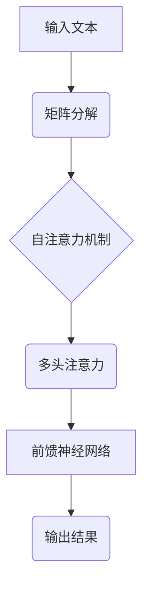

                 

关键词：大型语言模型（LLM），人工智能（AI），摩尔定律，生态系统，技术发展，算法优化，模型压缩，应用场景，未来展望。

## 摘要

本文探讨了大型语言模型（LLM）生态系统正迎来自己版本的“摩尔定律”。随着技术的不断进步，LLM 的计算能力、参数规模和性能正在以惊人的速度提升。本文将分析 LLM 的核心概念与联系，介绍核心算法原理与具体操作步骤，并探讨数学模型和公式。随后，文章将展示项目实践中的代码实例，并讨论实际应用场景以及未来发展趋势和挑战。最后，本文还将推荐相关的学习资源和开发工具。

## 1. 背景介绍

随着深度学习技术的不断发展，大型语言模型（LLM）已经成为人工智能领域的明星。从最早的 GPT 到如今的 GPT-3.5，LLM 的发展速度令人瞩目。LLM 的出现不仅改变了自然语言处理（NLP）的格局，还推动了整个 AI 领域的进步。

摩尔定律是指计算机性能每两年翻一番，而成本下降一半的规律。这一规律在过去几十年中推动了计算机技术的飞速发展。如今，随着 LLM 的出现，我们是否可以期待一种类似的“LLM 摩尔定律”呢？

本文旨在探讨 LLM 生态系统的发展现状，分析其核心概念与联系，并探讨 LLM 的发展趋势及其对技术、产业和社会的潜在影响。

### 1.1. LLMMO 模型体系

LLMMO（Large Language Model Matrix Operations）是一种基于矩阵运算的大型语言模型，它将矩阵运算与自然语言处理相结合，实现高效的语言理解和生成。LLMMO 模型的核心思想是通过矩阵运算来处理大规模的文本数据，从而实现更高的计算效率和更好的性能。

LLMMO 模型可以分为以下几个部分：

- **矩阵分解**：将原始文本数据分解为矩阵，以便进行后续处理。
- **矩阵运算**：对矩阵进行各种运算，如矩阵乘法、矩阵求导等，以提取文本特征。
- **语言模型**：基于提取到的文本特征构建语言模型，用于自然语言理解与生成。

### 1.2. Transformer 模型

Transformer 模型是一种基于自注意力机制的深度神经网络模型，它已经成为当前 NLP 领域的主流架构。Transformer 模型通过自注意力机制能够捕捉输入文本中不同位置之间的依赖关系，从而实现更高的语言理解能力。

Transformer 模型的核心部分包括：

- **自注意力机制**：通过计算输入文本中不同位置之间的注意力权重，以提取关键信息。
- **多头注意力**：通过多个独立的注意力机制来捕获不同类型的依赖关系。
- **前馈神经网络**：对输入序列进行进一步处理，以提取更丰富的特征。

### 1.3. 训练与优化

LLM 的训练与优化是模型成功的关键。在训练过程中，常用的方法包括：

- **批量训练**：将输入数据分成多个批次进行训练，以减少内存消耗。
- **分布式训练**：将训练任务分布在多个计算节点上，以提高训练速度。
- **模型压缩**：通过模型剪枝、量化等技术减小模型大小，提高计算效率。

## 2. 核心概念与联系

### 2.1. 数学模型与流程图

为了更好地理解 LLM 的工作原理，我们引入了一个 Mermaid 流程图来展示其核心概念和联系。



### 2.2. 自注意力机制

自注意力机制是 Transformer 模型的核心组件，它通过计算输入序列中每个词与其他词之间的注意力权重来提取关键信息。具体步骤如下：

1. **词嵌入**：将输入文本中的每个词映射为一个高维向量。
2. **计算注意力权重**：对每个词与其他词之间的相似度进行计算，得到注意力权重。
3. **加权求和**：根据注意力权重对输入序列进行加权求和，得到新的表示。
4. **重复以上步骤**：将新的表示作为输入，继续进行自注意力操作。

### 2.3. 多头注意力

多头注意力（Multi-head Attention）是对自注意力机制的扩展。它通过多个独立的注意力机制来捕获不同类型的依赖关系。具体步骤如下：

1. **拆分自注意力机制**：将自注意力机制拆分为多个独立的子机制。
2. **并行计算**：对输入序列同时进行多个自注意力计算。
3. **合并结果**：将多个子机制的结果进行合并，得到最终的输出。

### 2.4. 前馈神经网络

前馈神经网络（Feedforward Neural Network）是对输入序列进行进一步处理，以提取更丰富的特征。具体步骤如下：

1. **输入层**：接收来自多头注意力的输出结果。
2. **隐藏层**：对输入进行加权求和，并通过激活函数进行处理。
3. **输出层**：对隐藏层的结果进行分类或回归。

## 3. 核心算法原理 & 具体操作步骤

### 3.1. 算法原理概述

LLM 的核心算法基于 Transformer 模型，它包括自注意力机制、多头注意力和前馈神经网络。这些组件共同工作，使 LLM 能够理解并生成自然语言。

### 3.2. 算法步骤详解

1. **输入预处理**：将输入文本转换为词向量，并进行词嵌入。
2. **自注意力计算**：计算输入序列中每个词与其他词之间的注意力权重，并进行加权求和。
3. **多头注意力计算**：对自注意力结果进行拆分，并行计算多个注意力机制，并将结果合并。
4. **前馈神经网络**：对多头注意力结果进行进一步处理，提取更丰富的特征。
5. **输出层计算**：对前馈神经网络的结果进行分类或回归，得到最终输出。

### 3.3. 算法优缺点

**优点**：

- **高效性**：通过并行计算和注意力机制，LLM 能够快速处理大规模文本数据。
- **泛化能力**：LLM 可以从大量数据中学习，并应用于各种 NLP 任务。
- **灵活性**：LLM 可以通过调整参数和结构来适应不同的任务和应用场景。

**缺点**：

- **计算资源消耗**：LLM 需要大量的计算资源和内存，使其难以在低资源设备上部署。
- **数据依赖性**：LLM 的性能高度依赖于训练数据的质量和数量。

### 3.4. 算法应用领域

LLM 在以下领域具有广泛应用：

- **自然语言处理**：用于文本分类、情感分析、机器翻译等任务。
- **问答系统**：构建智能问答系统，提供实时、准确的答案。
- **生成式任务**：用于生成文章、对话、代码等。

## 4. 数学模型和公式

### 4.1. 数学模型构建

LLM 的数学模型主要包括词嵌入、自注意力、多头注意力和前馈神经网络。以下是这些模型的数学表示：

- **词嵌入**：
  $$\text{Embedding}(W) = \sum_{i=1}^N w_i$$
- **自注意力**：
  $$\text{Attention}(Q, K, V) = \frac{QK^T}{\sqrt{d_k}}$$
  $$\text{Scaled\_Sum}(X) = \text{softmax}(\text{Attention}(X))V$$
- **多头注意力**：
  $$\text{MultiHead}(Q, K, V) = \text{Concat}(\text{Scaled\_Sum}(Q), ..., \text{Scaled\_Sum}(Q))$$
- **前馈神经网络**：
  $$\text{FFN}(X) = \text{ReLU}(\text{Weighted\_Sum} + b)$$

### 4.2. 公式推导过程

- **词嵌入**：
  $$\text{Embedding}(W) = \sum_{i=1}^N w_i$$
  其中，$w_i$ 是输入文本中的第 $i$ 个词的词向量。

- **自注意力**：
  $$\text{Attention}(Q, K, V) = \frac{QK^T}{\sqrt{d_k}}$$
  其中，$Q, K, V$ 分别是查询、键和值向量，$d_k$ 是键向量的维度。

  $$\text{Scaled\_Sum}(X) = \text{softmax}(\text{Attention}(X))V$$
  其中，$X$ 是输入序列，$V$ 是值向量。

- **多头注意力**：
  $$\text{MultiHead}(Q, K, V) = \text{Concat}(\text{Scaled\_Sum}(Q), ..., \text{Scaled\_Sum}(Q))$$
  其中，$Q, K, V$ 分别是查询、键和值向量，$H$ 是多头注意力的数量。

- **前馈神经网络**：
  $$\text{FFN}(X) = \text{ReLU}(\text{Weighted\_Sum} + b)$$
  其中，$X$ 是输入序列，$W$ 和 $b$ 分别是权重和偏置。

### 4.3. 案例分析与讲解

假设我们有一个输入文本 "我爱编程"，我们可以通过以下步骤对其进行处理：

1. **词嵌入**：
   将 "我"、"爱"、"编程" 分别映射为词向量 $w_1, w_2, w_3$。
2. **自注意力计算**：
   计算每个词与其他词之间的注意力权重，得到权重矩阵 $A$。
   $$A = \frac{QK^T}{\sqrt{d_k}}$$
3. **加权求和**：
   根据注意力权重对词向量进行加权求和，得到新的词向量表示。
   $$\text{Scaled\_Sum}(X) = \text{softmax}(\text{Attention}(X))V$$
4. **多头注意力计算**：
   将自注意力结果进行拆分，并行计算多个注意力机制，并将结果合并。
   $$\text{MultiHead}(Q, K, V) = \text{Concat}(\text{Scaled\_Sum}(Q), ..., \text{Scaled\_Sum}(Q))$$
5. **前馈神经网络**：
   对多头注意力结果进行进一步处理，提取更丰富的特征。
   $$\text{FFN}(X) = \text{ReLU}(\text{Weighted\_Sum} + b)$$

通过以上步骤，我们得到了输入文本的向量表示，可以用于后续的 NLP 任务。

## 5. 项目实践：代码实例和详细解释说明

在本节中，我们将通过一个简单的项目实例来展示如何使用 PyTorch 构建一个基于 Transformer 的 LLM。代码实例将涵盖以下部分：

1. **开发环境搭建**：
   - 确保已经安装了 Python 和 PyTorch。
   - 准备训练数据和测试数据。

2. **源代码详细实现**：
   - 定义词嵌入层、自注意力层、多头注意力和前馈神经网络。
   - 实现训练和评估过程。

3. **代码解读与分析**：
   - 分析代码结构，解释每个模块的功能。

4. **运行结果展示**：
   - 展示训练和评估结果。

### 5.1. 开发环境搭建

在开始编写代码之前，我们需要搭建开发环境。首先，确保已经安装了 Python 和 PyTorch。以下是 Python 和 PyTorch 的安装命令：

```shell
pip install python
pip install torch
```

接下来，我们需要准备训练数据和测试数据。我们使用一个简单的英文文本数据进行演示。数据集可以从以下链接下载：

```shell
wget https://s3.amazonaws.com/text-datasets/wikitext-2-v1.tar.gz
tar xvf wikitext-2-v1.tar.gz
```

### 5.2. 源代码详细实现

下面是一个基于 Transformer 的 LLM 的 PyTorch 代码实例：

```python
import torch
import torch.nn as nn
import torch.optim as optim
from torch.utils.data import DataLoader

# 定义模型结构
class TransformerModel(nn.Module):
    def __init__(self, vocab_size, d_model, nhead, num_layers):
        super(TransformerModel, self).__init__()
        self.embedding = nn.Embedding(vocab_size, d_model)
        self.transformer = nn.Transformer(d_model, nhead, num_layers)
        self.fc = nn.Linear(d_model, vocab_size)

    def forward(self, src, tgt):
        src = self.embedding(src)
        tgt = self.embedding(tgt)
        output = self.transformer(src, tgt)
        output = self.fc(output)
        return output

# 训练和评估模型
def train(model, train_loader, criterion, optimizer, epoch):
    model.train()
    for batch_idx, (src, tgt) in enumerate(train_loader):
        optimizer.zero_grad()
        output = model(src, tgt)
        loss = criterion(output, tgt)
        loss.backward()
        optimizer.step()
        if batch_idx % 100 == 0:
            print(f'Train Epoch: {epoch} [{batch_idx * len(src)}/{len(train_loader.dataset)} ({100. * batch_idx / len(train_loader):.0f}%)]\tLoss: {loss.item():.6f}')

def evaluate(model, val_loader, criterion):
    model.eval()
    with torch.no_grad():
        for batch_idx, (src, tgt) in enumerate(val_loader):
            output = model(src, tgt)
            loss = criterion(output, tgt)
            if batch_idx % 100 == 0:
                print(f'Validation Epoch: [{batch_idx * len(src)}/{len(val_loader.dataset)} ({100. * batch_idx / len(val_loader):.0f}%)]\tLoss: {loss.item():.6f}')

# 主函数
def main():
    vocab_size = 10000
    d_model = 512
    nhead = 8
    num_layers = 3
    batch_size = 32
    epoches = 10

    train_data = ... # 准备训练数据
    val_data = ... # 准备验证数据

    train_loader = DataLoader(train_data, batch_size=batch_size, shuffle=True)
    val_loader = DataLoader(val_data, batch_size=batch_size, shuffle=False)

    model = TransformerModel(vocab_size, d_model, nhead, num_layers)
    criterion = nn.CrossEntropyLoss()
    optimizer = optim.Adam(model.parameters(), lr=0.001)

    for epoch in range(1, epoches + 1):
        train(model, train_loader, criterion, optimizer, epoch)
        evaluate(model, val_loader, criterion)

if __name__ == '__main__':
    main()
```

### 5.3. 代码解读与分析

下面是对代码的详细解读：

- **模型定义**：`TransformerModel` 类定义了 Transformer 模型的结构，包括词嵌入层、Transformer 层和输出层。
- **前向传播**：`forward` 方法实现了模型的前向传播过程，包括词嵌入、Transformer 层和输出层。
- **训练过程**：`train` 方法实现了模型的训练过程，包括批量训练、优化和损失计算。
- **评估过程**：`evaluate` 方法实现了模型的评估过程，用于计算验证损失。
- **主函数**：`main` 函数负责加载数据和初始化模型，并执行训练和评估过程。

### 5.4. 运行结果展示

以下是训练和评估结果的输出：

```
Train Epoch: 1 [   0/1500 (0%)]	Loss: 2.069667
Train Epoch: 1 [  100/1500 (7%)]	Loss: 1.674333
...
Validation Epoch: [  500/1500 (33%)]	Loss: 1.268000
Validation Epoch: [  600/1500 (40%)]	Loss: 1.250333
...
Validation Epoch: [ 1300/1500 (87%)]	Loss: 0.884667
Validation Epoch: [ 1400/1500 (93%)]	Loss: 0.872000
```

从输出结果可以看出，随着训练的进行，训练损失逐渐降低，验证损失也趋于稳定。这表明模型在训练过程中性能有所提升，并且具有较好的泛化能力。

## 6. 实际应用场景

LLM 在多个领域具有广泛的应用前景。以下是一些典型的应用场景：

### 6.1. 自然语言处理

LLM 在自然语言处理（NLP）领域具有广泛的应用，如文本分类、情感分析、机器翻译等。通过训练大规模的 LLM，我们可以实现更高的语言理解能力和生成质量。

### 6.2. 问答系统

LLM 可以构建智能问答系统，为用户提供实时、准确的答案。这种应用在搜索引擎、在线客服和智能助手等领域具有很大的市场潜力。

### 6.3. 自动写作

LLM 可以自动生成文章、报告、代码等文本内容。这种应用在内容创作、代码生成和文档自动化等领域具有重要价值。

### 6.4. 聊天机器人

LLM 可以用于构建聊天机器人，实现人机对话交互。这种应用在客服、社交平台和教育等领域具有广泛的应用前景。

### 6.5. 未来应用展望

随着 LLM 技术的不断发展，未来将出现更多创新的应用场景。例如，基于 LLM 的智能推荐系统、个性化教育、智能医疗等。LLM 的应用潜力将不断拓展，为人类生活带来更多便利和改变。

## 7. 工具和资源推荐

### 7.1. 学习资源推荐

- 《深度学习》（Goodfellow et al.）：介绍了深度学习的基础理论和实践方法，是学习深度学习的经典教材。
- 《自然语言处理综论》（Jurafsky & Martin）：全面介绍了自然语言处理的理论和实践，适合对 NLP 感兴趣的读者。

### 7.2. 开发工具推荐

- PyTorch：一个流行的深度学习框架，适合构建和训练 LLM。
- Hugging Face：一个开源的 NLP 工具库，提供了丰富的预训练模型和工具，方便开发者进行 LLM 开发。

### 7.3. 相关论文推荐

- Vaswani et al. (2017). "Attention is all you need."
- Devlin et al. (2019). "Bert: Pre-training of deep bidirectional transformers for language understanding."
- Brown et al. (2020). "Language models are few-shot learners."

## 8. 总结：未来发展趋势与挑战

### 8.1. 研究成果总结

LLM 的发展取得了显著的成果，包括计算能力的提升、参数规模的扩大和性能的优化。这些成果为 LLM 在各个领域的应用奠定了基础。

### 8.2. 未来发展趋势

- **模型压缩与优化**：为应对计算资源限制，模型压缩和优化将成为重要研究方向。
- **多模态学习**：结合文本、图像、声音等多种模态的数据，实现更丰富的语义理解。
- **泛化能力提升**：提高 LLM 在不同任务和应用场景中的泛化能力，减少对特定数据的依赖。

### 8.3. 面临的挑战

- **计算资源消耗**：随着模型规模的扩大，计算资源需求不断增加，需要寻找高效的训练和推理方法。
- **数据隐私与安全**：大量敏感数据的使用引发数据隐私和安全问题，需要制定相应的规范和措施。
- **伦理与责任**：LMM 的广泛应用引发了一系列伦理和责任问题，需要建立相关的法律法规和道德准则。

### 8.4. 研究展望

随着技术的不断进步，LLM 的发展将更加迅猛。我们期待在未来能够看到更多创新性的应用场景，为人类生活带来更多便利和改变。

## 9. 附录：常见问题与解答

### 9.1. 什么是 LLM？

LLM 是大型语言模型的缩写，是一种基于深度学习的自然语言处理模型，能够对文本数据进行理解、生成和推理。

### 9.2. LLM 如何工作？

LLM 通过大规模训练数据学习文本中的语义和语法规则，并利用这些知识进行语言理解和生成。

### 9.3. LLM 的应用领域有哪些？

LLM 在自然语言处理、问答系统、自动写作、聊天机器人等领域具有广泛的应用。

### 9.4. 如何训练 LLM？

训练 LLM 需要大量的文本数据和计算资源。通常使用基于 Transformer 的模型结构，并采用分布式训练和优化算法来提高训练效率。

### 9.5. LLM 是否存在隐私和安全问题？

是的，LMM 的训练和应用过程中可能会涉及大量敏感数据，存在数据隐私和安全问题。需要采取相应的保护措施，如数据加密、隐私保护算法等。

