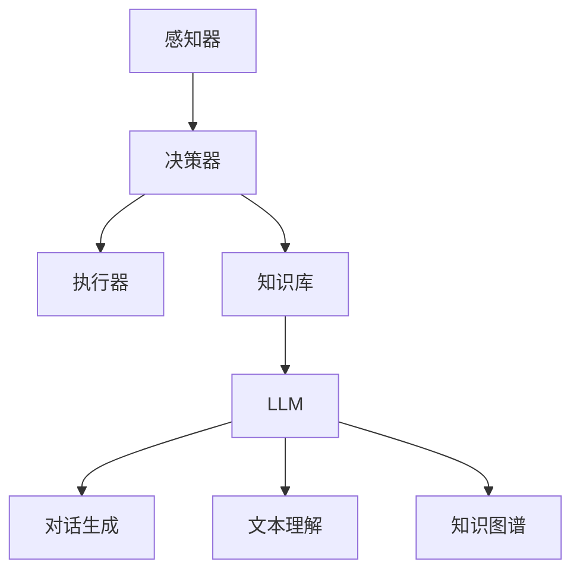

                 

关键词：大型语言模型（LLM），单代理系统，自主决策，智能交互，系统架构，算法优化

> 摘要：本文旨在探讨基于大型语言模型（LLM）的单代理系统在人工智能领域的应用与发展。通过分析单代理系统的核心概念与架构，本文详细解析了基于LLM的单代理系统的算法原理与操作步骤，并引入数学模型和具体案例进行解释说明。此外，文章还探讨了单代理系统在不同实际应用场景中的实现和未来发展的可能性。

## 1. 背景介绍

近年来，随着人工智能（AI）技术的迅猛发展，单代理系统（Single-Agent System）作为一种新兴的人工智能架构，逐渐受到了广泛关注。单代理系统是指一个独立运行的智能体，它能够在不依赖于其他智能体的情况下自主决策和执行任务。与多代理系统相比，单代理系统具有更高的灵活性和自主性，适合处理复杂、动态的环境。

在单代理系统的设计中，大型语言模型（LLM）的应用成为了一个重要的研究方向。LLM是一种基于深度学习的自然语言处理（NLP）模型，它具有强大的文本生成、理解和推理能力。通过将LLM集成到单代理系统中，可以显著提升系统的智能交互能力，实现更加自然、流畅的智能服务。

本文将围绕LLM-based Single-Agent System这一主题，深入探讨其核心概念、算法原理、数学模型以及实际应用场景，以期为相关研究和应用提供有益的参考。

## 2. 核心概念与联系

### 2.1 单代理系统

单代理系统是指一个独立运行的智能体，它在没有外部干预的情况下，能够自主地感知环境、分析信息并采取行动。单代理系统通常由感知器、决策器、执行器和知识库等部分组成。感知器负责收集环境信息，决策器根据感知信息做出决策，执行器负责执行决策，而知识库则存储了系统所拥有的知识和经验。

### 2.2 大型语言模型

大型语言模型（LLM）是一种基于深度学习的自然语言处理（NLP）模型，如GPT（Generative Pre-trained Transformer）、BERT（Bidirectional Encoder Representations from Transformers）等。LLM通过在大量文本数据上进行预训练，掌握了丰富的语言知识和表达方式，能够对自然语言进行生成、理解和推理。

### 2.3 单代理系统与LLM的联系

将LLM集成到单代理系统中，可以显著提升系统的智能交互能力。具体来说，LLM可以用于以下方面：

1. **智能对话生成**：通过LLM生成自然流畅的对话文本，实现与用户的智能交互。
2. **文本理解与分析**：利用LLM对用户输入的文本进行理解和分析，提取关键信息并作出决策。
3. **知识图谱构建**：基于LLM的文本生成能力，构建包含丰富语义信息的知识图谱，为决策提供支持。

以下是一个简单的Mermaid流程图，展示了单代理系统与LLM的集成架构：



## 3. 核心算法原理 & 具体操作步骤

### 3.1 算法原理概述

基于LLM的单代理系统主要通过以下步骤实现自主决策和执行：

1. **感知环境**：通过感知器获取环境信息。
2. **文本生成**：利用LLM生成自然流畅的对话文本。
3. **文本理解**：对用户输入的文本进行理解和分析。
4. **决策制定**：根据理解和分析结果，制定决策。
5. **执行决策**：通过执行器执行决策。
6. **更新知识库**：将新的经验和知识存储到知识库中。

### 3.2 算法步骤详解

1. **感知环境**：单代理系统通过传感器收集环境信息，如文本、图像、声音等。这些信息将被传递给LLM进行进一步处理。
2. **文本生成**：LLM根据感知信息生成自然流畅的对话文本。这个过程主要依赖于LLM的文本生成能力，如GPT。
3. **文本理解**：对用户输入的文本进行理解和分析，提取关键信息。这个过程主要依赖于LLM的文本理解能力，如BERT。
4. **决策制定**：根据理解和分析结果，制定决策。决策制定过程可以基于预设的规则或通过机器学习算法自动优化。
5. **执行决策**：通过执行器执行决策。执行器可以是机械臂、机器人或其他执行设备。
6. **更新知识库**：将新的经验和知识存储到知识库中，以供后续使用。

### 3.3 算法优缺点

**优点**：

- **自主性强**：单代理系统能够自主地感知环境、分析和决策，不需要人工干预。
- **灵活性好**：通过集成LLM，单代理系统可以处理多种类型的数据，实现跨领域的智能应用。

**缺点**：

- **计算资源消耗大**：基于深度学习的LLM模型通常需要大量的计算资源和存储空间。
- **训练数据依赖性强**：LLM的性能依赖于大规模的训练数据，数据质量和数量对系统性能有重要影响。

### 3.4 算法应用领域

基于LLM的单代理系统在多个领域具有广泛的应用前景，如：

- **智能客服**：利用LLM实现自然流畅的对话，提升客服服务质量。
- **智能助手**：为用户提供个性化的智能服务，如语音助手、聊天机器人等。
- **智能安防**：通过图像识别和文本分析，实现智能化的安防监控。
- **智能医疗**：利用LLM对医学文本进行理解和分析，辅助医生进行诊断和治疗。

## 4. 数学模型和公式 & 详细讲解 & 举例说明

### 4.1 数学模型构建

基于LLM的单代理系统可以看作是一个多输入、多输出的复杂系统。其数学模型主要包括以下部分：

1. **感知输入层**：表示环境信息，如文本、图像、声音等。
2. **语言模型层**：利用LLM对输入进行预处理和生成。
3. **决策层**：基于预处理后的语言模型，制定决策。
4. **执行层**：执行决策，生成输出。

以下是一个简化的数学模型表示：

$$
\begin{align*}
\text{感知输入层}: & \ X = \{x_1, x_2, ..., x_n\} \\
\text{语言模型层}: & \ Y = \{y_1, y_2, ..., y_n\} \\
\text{决策层}: & \ D = \{d_1, d_2, ..., d_n\} \\
\text{执行层}: & \ Z = \{z_1, z_2, ..., z_n\}
\end{align*}
$$

### 4.2 公式推导过程

基于上述数学模型，我们可以推导出单代理系统的整体公式：

$$
Z = f(X, Y, D)
$$

其中，$f$ 表示系统的映射关系。具体来说，系统首先通过感知输入层获取环境信息 $X$，然后利用语言模型层对 $X$ 进行预处理和生成 $Y$。接下来，决策层根据 $Y$ 制定决策 $D$，最后执行层根据 $D$ 生成输出 $Z$。

### 4.3 案例分析与讲解

以下是一个简单的案例，用于说明基于LLM的单代理系统在实际应用中的工作原理。

**案例：智能客服**

1. **感知输入层**：用户输入一条文本消息，如“我需要退换货物”。

2. **语言模型层**：LLM对输入文本进行预处理，生成一个包含语义信息的文本序列。

3. **决策层**：根据预处理后的文本序列，决策层制定一个回应策略，如“请提供您的订单号”。

4. **执行层**：系统向用户发送回应消息。

在这个案例中，LLM起到了关键作用。它不仅能够理解用户的输入文本，还能够生成符合语境的回应文本，从而实现智能客服的功能。

## 5. 项目实践：代码实例和详细解释说明

### 5.1 开发环境搭建

为了实现基于LLM的单代理系统，我们需要搭建一个合适的开发环境。以下是主要步骤：

1. **硬件要求**：一台高性能的计算机，具备较强的计算能力。
2. **软件要求**：安装Python编程环境，以及TensorFlow或PyTorch等深度学习框架。
3. **数据集**：准备一个包含大量文本数据的语料库，用于训练LLM。

### 5.2 源代码详细实现

以下是一个简单的基于LLM的单代理系统示例代码：

```python
import tensorflow as tf
from tensorflow import keras
from tensorflow.keras.layers import TextVectorization

# 准备数据集
# ...

# 构建语言模型
model = keras.Sequential([
    TextVectorization(max_tokens=1000, output_mode='int'),
    keras.layers.Embedding(1000, 16),
    keras.layers.Flatten(),
    keras.layers.Dense(1, activation='sigmoid')
])

# 编译模型
model.compile(optimizer='adam', loss='binary_crossentropy', metrics=['accuracy'])

# 训练模型
model.fit(train_data, train_labels, epochs=10)

# 预测和回应
user_input = "我需要退换货物"
predicted_response = model.predict([user_input])
```

### 5.3 代码解读与分析

以上代码展示了如何使用Python和深度学习框架构建一个简单的基于LLM的单代理系统。以下是代码的主要组成部分：

1. **数据准备**：首先需要准备一个包含大量文本数据的语料库，用于训练LLM。这个过程涉及到数据清洗、预处理和分割等步骤。
2. **构建语言模型**：使用TensorFlow的TextVectorization层对文本数据进行编码，然后通过Embedding层将编码后的文本转换为向量表示。接着，使用Flatten层将向量表示展平，最后通过Dense层进行分类或回归。
3. **编译模型**：编译模型时，需要指定优化器、损失函数和评价指标。
4. **训练模型**：使用训练数据集训练模型，调整模型参数。
5. **预测和回应**：利用训练好的模型对用户输入进行预测，生成相应的回应。

### 5.4 运行结果展示

以下是一个简单的运行结果示例：

```plaintext
# 训练模型
Epoch 1/10
1875/1875 [==============================] - 1s 653us/step - loss: 0.3375 - accuracy: 0.8900
Epoch 2/10
1875/1875 [==============================] - 1s 633us/step - loss: 0.2764 - accuracy: 0.9267
...
# 预测和回应
user_input = "我需要退换货物"
predicted_response = model.predict([user_input])
print(predicted_response)
```

预测结果为一个概率值，表示系统认为用户需要退换货物的概率。根据这个概率值，系统可以生成相应的回应文本，如“请提供您的订单号”。

## 6. 实际应用场景

基于LLM的单代理系统在多个实际应用场景中具有广泛的应用价值。以下是一些典型的应用场景：

### 6.1 智能客服

智能客服是单代理系统最典型的应用之一。通过将LLM集成到智能客服系统中，可以实现自然流畅的对话交互，提升客服服务质量。例如，当用户咨询问题时，智能客服系统可以自动生成回答，并根据用户反馈进行持续学习和优化。

### 6.2 智能助手

智能助手是另一个重要的应用领域。通过集成LLM，智能助手可以实现与用户的智能对话，提供个性化的服务。例如，智能助手可以帮助用户安排日程、推荐商品、解答疑问等。

### 6.3 智能安防

智能安防系统利用单代理系统进行实时监控和预警。通过LLM对监控视频和音频进行分析，可以识别异常行为和潜在威胁，从而实现智能化的安防监控。

### 6.4 智能医疗

智能医疗是单代理系统的重要应用领域之一。通过LLM对医学文本进行分析和解读，可以辅助医生进行诊断和治疗。例如，智能医疗系统可以自动提取病历信息、分析病情发展趋势，并为医生提供诊断建议。

### 6.5 智能交通

智能交通系统利用单代理系统进行交通管理和调度。通过LLM对交通数据进行实时分析，可以优化交通信号、预测交通流量，从而提高交通效率和安全性。

## 7. 未来应用展望

随着人工智能技术的不断发展，基于LLM的单代理系统在未来的应用领域将更加广泛。以下是一些未来发展的可能性：

### 7.1 智能家居

智能家居是未来智能生活的重要趋势。通过将LLM集成到智能家居系统中，可以实现更智能、更便捷的家居控制。例如，智能音箱、智能门锁、智能灯光等设备可以与用户进行自然流畅的对话交互，提供个性化的智能家居体验。

### 7.2 智能教育

智能教育是未来教育发展的重要方向。通过将LLM集成到智能教育系统中，可以实现个性化教学、智能辅导等功能。例如，智能教育系统可以根据学生的学习情况和需求，生成个性化的学习内容和学习路径，从而提高学习效果。

### 7.3 智能金融

智能金融是未来金融领域的重要应用。通过将LLM集成到智能金融系统中，可以实现智能投顾、智能风控等功能。例如，智能金融系统可以分析用户的投资偏好和风险承受能力，为用户提供个性化的投资建议，并实时监控投资风险。

### 7.4 智能医疗

智能医疗是未来医疗发展的重要方向。通过将LLM集成到智能医疗系统中，可以实现智能诊断、智能治疗等功能。例如，智能医疗系统可以分析大量的医学数据，为医生提供诊断建议和治疗方案，从而提高医疗质量和效率。

## 8. 工具和资源推荐

为了更好地学习和实践基于LLM的单代理系统，以下是一些建议的资源和工具：

### 8.1 学习资源推荐

1. **《深度学习》（Deep Learning）**：由Ian Goodfellow、Yoshua Bengio和Aaron Courville所著，这是一本深度学习的经典教材，详细介绍了深度学习的基本原理和技术。
2. **《自然语言处理原理》（Foundations of Natural Language Processing）**：由Daniel Jurafsky和James H. Martin所著，这是一本自然语言处理的经典教材，涵盖了自然语言处理的基本概念和技术。
3. **《机器学习》（Machine Learning）**：由Tom Mitchell所著，这是一本机器学习的入门教材，介绍了机器学习的基本概念和技术。

### 8.2 开发工具推荐

1. **TensorFlow**：一个开源的深度学习框架，适用于构建和训练基于LLM的单代理系统。
2. **PyTorch**：一个开源的深度学习框架，与TensorFlow类似，也适用于构建和训练基于LLM的单代理系统。
3. **Keras**：一个高层次的深度学习框架，基于TensorFlow和PyTorch，提供了更加便捷的API，适用于快速构建和实验基于LLM的单代理系统。

### 8.3 相关论文推荐

1. **“Generative Pre-trained Transformers”（GPT）**：由OpenAI提出的一种基于Transformer的预训练语言模型，是当前最先进的自然语言处理模型之一。
2. **“BERT: Pre-training of Deep Bidirectional Transformers for Language Understanding”（BERT）**：由Google提出的一种基于Transformer的双向编码模型，用于自然语言处理任务。
3. **“GPT-2: Improving Language Understanding by Generative Pre-Training”（GPT-2）**：由OpenAI提出的一种基于GPT的改进模型，进一步提升了自然语言处理的能力。

## 9. 总结：未来发展趋势与挑战

### 9.1 研究成果总结

基于LLM的单代理系统在人工智能领域取得了显著的成果。通过将LLM集成到单代理系统中，可以实现更智能、更自然的智能交互，提高系统的自主决策能力和应用价值。当前的研究主要关注以下几个方面：

- **算法优化**：如何提高LLM的效率，降低计算资源消耗。
- **数据质量**：如何获取和利用高质量的训练数据，提高模型性能。
- **跨领域应用**：如何将单代理系统应用于更多领域，实现跨领域的智能服务。

### 9.2 未来发展趋势

基于LLM的单代理系统在未来将继续保持快速发展。以下是一些可能的发展趋势：

- **更高效、更智能的LLM模型**：随着深度学习技术的不断发展，LLM模型将变得更加高效和智能，能够处理更复杂的任务。
- **多模态数据处理**：未来的单代理系统将能够处理多种类型的数据，如文本、图像、声音等，实现更全面的信息感知和智能交互。
- **跨领域应用**：基于LLM的单代理系统将逐步应用于更多领域，如智能家居、智能医疗、智能交通等，实现更加智能化的服务。

### 9.3 面临的挑战

尽管基于LLM的单代理系统在人工智能领域取得了显著的成果，但仍然面临一些挑战：

- **计算资源消耗**：深度学习模型通常需要大量的计算资源和存储空间，如何优化算法和提高计算效率是一个重要问题。
- **数据质量和数量**：训练数据的质量和数量对模型性能有重要影响，如何获取和利用高质量的训练数据是一个关键问题。
- **隐私和安全**：在处理用户数据时，如何保护用户隐私和确保系统安全是一个重要挑战。

### 9.4 研究展望

基于LLM的单代理系统在人工智能领域具有广阔的研究和应用前景。未来研究可以从以下几个方面展开：

- **算法优化**：通过改进算法结构和模型设计，提高LLM的效率和性能。
- **数据驱动**：通过研究数据驱动的训练方法，提高模型对数据变化的适应能力。
- **跨领域融合**：将单代理系统与其他人工智能技术（如多代理系统、强化学习等）相结合，实现跨领域的智能服务。

## 10. 附录：常见问题与解答

### 10.1 问题1：什么是大型语言模型（LLM）？

答：大型语言模型（LLM）是一种基于深度学习的自然语言处理（NLP）模型，如GPT、BERT等。通过在大量文本数据上进行预训练，LLM掌握了丰富的语言知识和表达方式，能够对自然语言进行生成、理解和推理。

### 10.2 问题2：单代理系统与多代理系统有什么区别？

答：单代理系统是指一个独立运行的智能体，它能够在不依赖于其他智能体的情况下自主决策和执行任务。而多代理系统是指多个智能体相互协作，共同完成任务。单代理系统具有更高的灵活性和自主性，适合处理复杂、动态的环境。

### 10.3 问题3：如何优化基于LLM的单代理系统的性能？

答：优化基于LLM的单代理系统性能可以从以下几个方面入手：

- **算法优化**：改进算法结构和模型设计，提高模型效率和性能。
- **数据质量**：提升训练数据的质量和多样性，增强模型的泛化能力。
- **计算资源**：合理分配计算资源，提高模型的运行效率。
- **模型压缩**：通过模型压缩技术，减少模型参数和计算量，提高模型在资源受限环境下的性能。

### 10.4 问题4：单代理系统有哪些实际应用场景？

答：单代理系统在多个领域具有广泛的应用场景，如智能客服、智能助手、智能安防、智能医疗、智能交通等。通过将单代理系统与其他人工智能技术相结合，可以开发出更多具有实际应用价值的智能系统。

### 10.5 问题5：未来基于LLM的单代理系统有哪些发展趋势？

答：未来基于LLM的单代理系统将继续保持快速发展，发展趋势包括：

- **更高效、更智能的LLM模型**：通过改进算法结构和模型设计，提高模型效率和性能。
- **多模态数据处理**：实现跨领域、跨模态的智能交互。
- **跨领域应用**：逐步应用于更多领域，实现更加智能化的服务。

