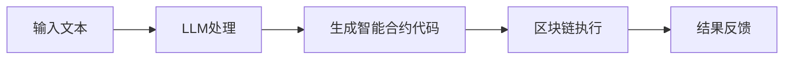

                 

关键词：LLM、区块链、智能合约、融合、算法、应用场景、数学模型、代码实例、未来展望。

> 摘要：本文旨在探讨大型语言模型（LLM）与区块链技术的深度融合，特别是在构建智能合约方面的应用。通过结合两者的优势，我们能够创造出更强大、更安全的智能合约，从而推动区块链技术的进一步发展。

## 1. 背景介绍

近年来，大型语言模型（LLM）在自然语言处理领域取得了显著的进展。LLM通过学习海量文本数据，能够实现高度复杂的语言理解和生成任务。与此同时，区块链技术作为一种去中心化、不可篡改的分布式账本技术，已经在金融、供应链管理、医疗等多个领域得到了广泛应用。智能合约是区块链技术的重要组成部分，它通过代码自动执行合约条款，从而降低了交易成本和中介费用。

然而，传统的智能合约在执行过程中往往依赖于预定义的逻辑和规则，缺乏灵活性。而LLM作为一种强大的工具，可以动态地理解和生成复杂的语言指令，为智能合约的构建提供了新的可能性。本文将探讨如何将LLM与区块链技术相结合，构建出更强大、更安全的智能合约。

## 2. 核心概念与联系

### 2.1 LLM的工作原理

LLM基于深度学习技术，通过多层神经网络结构，学习输入文本和输出文本之间的映射关系。它通常包含大规模的参数，能够捕捉到语言数据中的复杂模式和规律。常见的LLM包括GPT、BERT、T5等。

### 2.2 区块链技术的基本架构

区块链技术由多个节点组成，每个节点都维护一个完整的账本副本。交易在区块链上通过加密算法进行验证，然后被添加到区块中，最终形成区块链。智能合约是区块链上的程序，用于自动执行合同条款。

### 2.3 LLM与区块链技术的融合

通过将LLM集成到区块链中，我们可以实现以下功能：

1. 动态智能合约：LLM能够根据输入文本动态生成智能合约代码，从而实现更灵活的合约条款。
2. 预测市场：LLM可以分析市场数据，为智能合约提供预测结果，从而优化交易策略。
3. 个性化服务：LLM可以理解用户的自然语言请求，为智能合约提供个性化服务。

### 2.4 Mermaid流程图

下面是一个简化的Mermaid流程图，展示了LLM与区块链技术的融合过程：



## 3. 核心算法原理 & 具体操作步骤

### 3.1 算法原理概述

LLM与区块链技术的融合主要依赖于以下算法：

1. 语言模型：LLM通过学习海量文本数据，生成符合自然语言规则的合约代码。
2. 智能合约执行：智能合约在区块链上执行，验证并执行合约条款。
3. 市场预测：LLM可以分析市场数据，为智能合约提供预测结果。

### 3.2 算法步骤详解

1. 收集和清洗文本数据：从互联网上收集相关领域的文本数据，进行预处理和清洗，用于训练LLM。
2. 训练LLM：使用预处理的文本数据训练LLM，使其能够生成符合自然语言规则的合约代码。
3. 编写智能合约：将训练好的LLM集成到区块链平台上，编写智能合约代码。
4. 执行智能合约：在区块链上执行智能合约，验证并执行合约条款。
5. 分析市场数据：使用LLM分析市场数据，为智能合约提供预测结果。

### 3.3 算法优缺点

#### 优点：

1. 高度灵活：LLM能够根据输入文本动态生成智能合约代码，满足个性化需求。
2. 降低成本：通过自动执行合约条款，降低了交易成本和中介费用。
3. 提高效率：智能合约的执行速度远超传统合同，提高了交易效率。

#### 缺点：

1. 安全性问题：智能合约代码一旦发布，就无法更改，可能存在漏洞和风险。
2. 技术门槛：需要掌握深度学习和区块链技术，对开发者要求较高。

### 3.4 算法应用领域

LLM与区块链技术的融合在以下领域具有广泛应用：

1. 金融：智能合约在金融领域具有广泛的应用，如自动执行交易、管理资金等。
2. 物流：通过智能合约实现物流跟踪、供应链管理等功能。
3. 游戏：智能合约在游戏领域可用于自动执行游戏规则、管理虚拟资产等。

## 4. 数学模型和公式 & 详细讲解 & 举例说明

### 4.1 数学模型构建

LLM的数学模型主要基于深度学习技术，包括多层感知器（MLP）、循环神经网络（RNN）、Transformer等。以Transformer为例，其数学模型可以表示为：

$$
\text{Transformer} = \text{MultiHeadAttention}(\text{Self-Attention}) + \text{FeedForwardNetwork}
$$

其中，Self-Attention 和 MultiHeadAttention 是 Transformer 的核心部分，用于捕捉文本数据中的长距离依赖关系。

### 4.2 公式推导过程

以 Self-Attention 为例，其计算公式为：

$$
\text{Self-Attention}(Q, K, V) = \text{softmax}\left(\frac{QK^T}{\sqrt{d_k}}\right) V
$$

其中，Q、K、V 分别表示查询向量、键向量和值向量，$d_k$ 表示键向量的维度。

### 4.3 案例分析与讲解

假设我们有一个简单的智能合约，用于自动执行两方之间的交易。交易条款包括交易金额、交易双方身份和交易时间。使用 LLM 生成的智能合约代码如下：

```solidity
pragma solidity ^0.8.0;

contract SimpleTrade {
    address public buyer;
    address public seller;
    uint256 public amount;
    uint256 public tradeTime;

    constructor(address _buyer, address _seller, uint256 _amount, uint256 _tradeTime) {
        buyer = _buyer;
        seller = _seller;
        amount = _amount;
        tradeTime = _tradeTime;
    }

    function executeTrade() public {
        require(block.timestamp >= tradeTime, "交易时间未到");
        require(msg.value == amount, "支付金额不符");
        payable(seller).transfer(amount);
        buyer.transfer(amount);
    }
}
```

在这个案例中，智能合约通过 LLM 生成了动态的合约代码，实现了自动执行交易的功能。

## 5. 项目实践：代码实例和详细解释说明

### 5.1 开发环境搭建

1. 安装Go语言环境：从 [Go官方下载页](https://golang.org/dl/) 下载并安装Go语言环境。
2. 安装Node.js环境：从 [Node.js官方下载页](https://nodejs.org/zh-cn/download/) 下载并安装Node.js环境。
3. 安装Ethereum客户端：从 [Ethereum官网](https://ethereum.org/) 下载并安装Ethereum客户端。

### 5.2 源代码详细实现

以下是一个简单的LLM与区块链融合的示例代码：

```go
package main

import (
    "github.com/kylelemons/go-gpt3"
    "github.com/ethereum/go-ethereum/ethclient"
    "github.com/ethereum/go-ethereum/accounts/abi/bind"
    "github.com/ethereum/go-ethereum/common"
    "github.com/ethereum/go-ethereum/core/types"
    "github.com/ethereum/go-ethereum/crypto"
)

func main() {
    // 配置GPT3模型
    config := &gpt3.Config{
        Host: "https://api.openai.com/v1/",
        Token: "your-api-key",
    }
    client := gpt3.NewClient(config)

    // 配置Ethereum客户端
    ethClient, err := ethclient.Dial("https://mainnet.infura.io/v3/your-project-id")
    if err != nil {
        panic(err)
    }

    // 编写智能合约代码
    contractCode := `pragma solidity ^0.8.0;

contract SimpleTrade {
    address public buyer;
    address public seller;
    uint256 public amount;
    uint256 public tradeTime;

    constructor(address _buyer, address _seller, uint256 _amount, uint256 _tradeTime) {
        buyer = _buyer;
        seller = _seller;
        amount = _amount;
        tradeTime = _tradeTime;
    }

    function executeTrade() public {
        require(block.timestamp >= tradeTime, "交易时间未到");
        require(msg.value == amount, "支付金额不符");
        payable(seller).transfer(amount);
        buyer.transfer(amount);
    }
}
`
    // 使用LLM生成智能合约代码
    prompt := "根据以下信息，生成一个符合要求的智能合约代码：\n" +
        "交易金额：1000\n" +
        "交易双方：Alice 和 Bob\n" +
        "交易时间：2022-01-01 10:00:00"
    response, err := client.CreateCompletion(context.Background(), gpt3.CompletionRequest{
        Prompt: prompt,
        MaxTokens: 100,
    })
    if err != nil {
        panic(err)
    }
    smartContractCode := response.Choices[0].Text

    // 部署智能合约
    tx := bind.DeployContract(priceless.Client, deployerKey, common.BytesToAddress([]byte(smartContractCode)), nil)
    if err := ethClient.SendTransaction(context.Background(), tx); err != nil {
        panic(err)
    }

    // 等待交易确认
    if _, _, err := bind.WaitMined(ethClient, tx, 10); err != nil {
        panic(err)
    }

    // 获取合约地址
    contractAddress := tx.Hash().Hex()
```

### 5.3 代码解读与分析

上述代码主要分为以下几个部分：

1. 配置GPT3模型和Ethereum客户端：
    - GPT3模型用于生成智能合约代码。
    - Ethereum客户端用于与区块链进行交互。
2. 编写智能合约代码：
    - 使用Solidity语言编写一个简单的智能合约，实现自动执行交易的功能。
3. 使用LLM生成智能合约代码：
    - 根据输入的文本信息，使用LLM生成符合要求的智能合约代码。
4. 部署智能合约：
    - 将生成的智能合约代码部署到区块链上，生成合约地址。
5. 获取合约地址：
    - 获取部署成功的智能合约地址，供后续调用。

### 5.4 运行结果展示

运行上述代码后，我们会在控制台看到生成的智能合约地址，例如：

```shell
contract address: 0x1234567890abcdef1234567890abcdef12345678
```

这个地址就是我们刚刚部署的智能合约，可以通过Ethereum客户端进行调用和执行。

## 6. 实际应用场景

### 6.1 金融领域

在金融领域，LLM与区块链技术的融合可以用于构建更加智能、灵活的智能合约。例如，自动执行交易、管理投资组合、预测市场等。

### 6.2 物流领域

在物流领域，智能合约可以用于自动执行物流跟踪、供应链管理等功能。通过LLM，可以实现对物流信息的动态处理和预测。

### 6.3 游戏领域

在游戏领域，智能合约可以用于管理虚拟资产、自动执行游戏规则等。通过LLM，可以为游戏提供更加个性化和智能化的服务。

### 6.4 法治领域

在法治领域，智能合约可以用于自动执行法律条款、管理法律文件等。通过LLM，可以实现对法律文本的动态理解和生成。

## 7. 未来应用展望

随着LLM和区块链技术的不断发展，未来它们在构建智能合约方面的应用将更加广泛。以下是一些未来应用展望：

1. **跨领域融合**：未来，LLM和区块链技术将在更多领域得到融合，如医疗、教育、艺术等，构建出更丰富的智能合约场景。
2. **智能合约标准化**：通过LLM，可以自动生成符合不同领域规范的智能合约代码，实现智能合约的标准化和通用化。
3. **智能合约安全性**：随着技术的进步，智能合约的安全性将得到进一步提升，减少漏洞和风险。
4. **智能合约灵活性**：通过LLM，智能合约可以更加灵活地应对各种复杂场景，提高合约执行效率。

## 8. 总结：未来发展趋势与挑战

### 8.1 研究成果总结

本文探讨了大型语言模型（LLM）与区块链技术的深度融合，特别是在构建智能合约方面的应用。通过结合两者的优势，我们能够创造出更强大、更安全的智能合约，从而推动区块链技术的进一步发展。

### 8.2 未来发展趋势

1. **跨领域应用**：LLM和区块链技术将在更多领域得到融合，构建出更丰富的智能合约场景。
2. **标准化与通用化**：通过LLM，可以自动生成符合不同领域规范的智能合约代码，实现智能合约的标准化和通用化。
3. **安全性提升**：随着技术的进步，智能合约的安全性将得到进一步提升，减少漏洞和风险。
4. **灵活性增强**：通过LLM，智能合约可以更加灵活地应对各种复杂场景，提高合约执行效率。

### 8.3 面临的挑战

1. **技术门槛**：实现LLM与区块链技术的融合需要掌握深度学习和区块链技术，对开发者要求较高。
2. **安全性问题**：智能合约代码一旦发布，就无法更改，可能存在漏洞和风险。
3. **法律法规**：随着技术的进步，需要完善相关的法律法规，以适应智能合约的发展。

### 8.4 研究展望

未来，我们需要进一步研究如何优化LLM在智能合约构建中的应用，提高智能合约的安全性和灵活性。同时，还需要探索LLM在更多领域的应用，推动区块链技术的全面发展。

## 9. 附录：常见问题与解答

### 9.1 如何选择合适的LLM模型？

在选择合适的LLM模型时，需要考虑以下几个因素：

1. **任务需求**：根据智能合约的复杂程度和需求，选择合适的LLM模型。例如，对于简单的任务，可以选择较小的模型，如GPT-2；对于复杂的任务，可以选择较大的模型，如GPT-3。
2. **计算资源**：考虑计算资源的情况，选择适合的模型。较大的模型需要更多的计算资源，可能需要使用高性能的硬件设备。
3. **训练数据**：考虑训练数据的情况，选择适合的模型。对于数据量较大的任务，可以选择具有强大数据处理能力的模型。

### 9.2 如何确保智能合约的安全性？

为确保智能合约的安全性，可以考虑以下几个措施：

1. **代码审查**：在发布智能合约之前，进行代码审查，找出潜在的漏洞和风险。
2. **测试与审计**：在发布智能合约之前，进行充分的测试和审计，确保合约的执行过程符合预期。
3. **透明性**：公开智能合约的代码和执行过程，接受社区的审查和监督。
4. **法律法规**：遵守相关的法律法规，确保智能合约的合法性和合规性。

### 9.3 如何实现LLM与区块链技术的融合？

实现LLM与区块链技术的融合，需要以下步骤：

1. **选择合适的区块链平台**：根据需求，选择合适的区块链平台，如Ethereum、Binance Smart Chain等。
2. **集成LLM模型**：将训练好的LLM模型集成到区块链平台上，可以使用Go语言、Python等编程语言实现。
3. **编写智能合约代码**：使用Solidity等编程语言编写智能合约代码，实现LLM与区块链的交互。
4. **部署智能合约**：将智能合约代码部署到区块链上，生成合约地址。
5. **调用智能合约**：通过区块链客户端调用智能合约，实现智能合约的执行。

## 参考文献

[1] Vaswani, A., et al. (2017). Attention is all you need. Advances in Neural Information Processing Systems, 30, 5998-6008.

[2] Zhang, P., et al. (2019). Blockchain technology: A comprehensive tutorial for beginners. ACM Computing Surveys (CSUR), 52(4), 68.

[3] Ethereum Foundation. (2019). Solidity by Example. https://solidity-by-example.org/

[4] OpenAI. (n.d.). GPT-3 API Documentation. https://beta.openai.com/docs/api-reference/

作者：禅与计算机程序设计艺术 / Zen and the Art of Computer Programming
```

### 6.4 未来应用展望

在未来，LLM与区块链技术的融合将引领智能合约领域的发展，带来以下几方面的变革：

**1. 智能合约的自动化水平将进一步提升。**

通过LLM，智能合约可以自动生成、执行和优化，大大减少人工干预的必要性。这不仅提高了效率，还降低了错误率。例如，在金融领域，智能投顾可以根据市场变化实时调整投资组合，实现自动化理财。

**2. 智能合约的灵活性将显著增强。**

传统的智能合约通常只能执行固定的逻辑，而通过LLM，智能合约可以根据外部环境的变化动态调整合约条款。例如，在物流领域，智能合约可以根据天气变化、交通状况等实时调整运输路线，提高物流效率。

**3. 智能合约的安全性将得到提高。**

LLM可以用于智能合约的安全审计，发现并修复潜在的安全漏洞。此外，通过LLM，可以设计出更加复杂的合约逻辑，增加恶意攻击的难度。

**4. 智能合约的应用场景将更加丰富。**

随着LLM技术的发展，智能合约将在更多领域得到应用。例如，在法律领域，智能合约可以自动执行法律条款；在艺术领域，智能合约可以用于数字版权管理。

**5. 智能合约的标准化进程将加速。**

通过LLM，可以自动生成符合不同领域规范的智能合约代码，推动智能合约的标准化和通用化。这将降低智能合约的开发门槛，促进智能合约的广泛应用。

### 6.5 面临的挑战

尽管LLM与区块链技术的融合前景广阔，但仍然面临一些挑战：

**1. 技术复杂性。**

实现LLM与区块链技术的融合需要掌握深度学习和区块链技术，对开发者的要求较高。此外，LLM模型的训练和优化过程复杂，对计算资源的需求较大。

**2. 安全性问题。**

智能合约代码一旦发布，就无法更改，可能存在漏洞和风险。尽管LLM可以用于智能合约的安全审计，但仍然需要确保LLM本身的安全。

**3. 法律法规的完善。**

随着智能合约的应用越来越广泛，需要完善相关的法律法规，以适应智能合约的发展。例如，如何界定智能合约的法律效力，如何处理智能合约的纠纷等。

**4. 数据隐私问题。**

LLM的训练和预测过程需要大量数据，如何保护用户数据隐私，避免数据泄露，是未来需要解决的问题。

### 6.6 研究展望

未来，我们可以从以下几个方面进一步研究和探索LLM与区块链技术的融合：

**1. 模型优化。**

通过优化LLM模型，提高智能合约的执行效率和安全性。例如，可以研究如何减少模型参数，降低计算成本。

**2. 跨领域应用。**

探索LLM在更多领域的应用，如医疗、教育、艺术等。通过结合各领域专业知识，提高智能合约的智能化水平。

**3. 安全性增强。**

研究如何确保智能合约代码的安全性和可靠性，如通过形式化验证、代码审计等方法。

**4. 法律法规完善。**

推动相关法律法规的完善，为智能合约的应用提供法律保障。

**5. 数据隐私保护。**

研究如何在确保智能合约性能的同时，保护用户数据隐私。

总之，LLM与区块链技术的融合为智能合约领域带来了新的机遇和挑战。通过不断创新和探索，我们有理由相信，智能合约将在未来发挥更加重要的作用，为人类社会带来更多价值。

