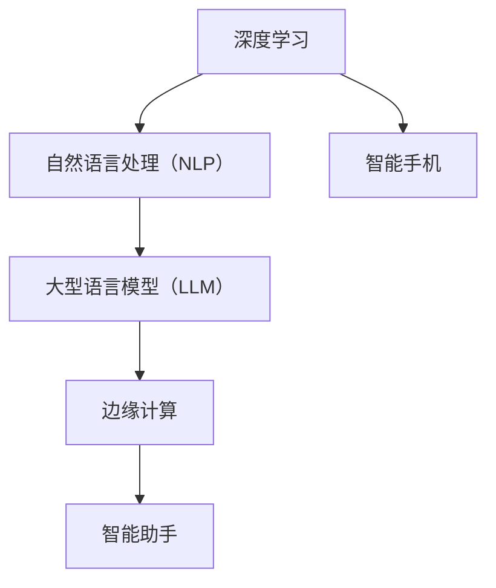

                 

关键词：大型语言模型（LLM）、智能手机、移动AI、自然语言处理（NLP）、深度学习、边缘计算、智能助手、应用程序开发

> 摘要：本文深入探讨了大型语言模型（LLM）在智能手机上的应用，分析了LLM如何通过深度学习和自然语言处理技术，推动移动端AI的发展。文章详细阐述了LLM的架构、核心算法原理、数学模型、实践应用，并探讨了其在未来移动设备上的应用前景和面临的挑战。

## 1. 背景介绍

随着人工智能（AI）技术的飞速发展，移动设备正逐渐成为AI技术的核心战场。智能手机作为最普及的移动设备，其计算能力和数据处理能力不断提升，为AI技术的发展提供了坚实的硬件基础。与此同时，深度学习、自然语言处理（NLP）等AI技术也在不断突破，为智能手机的智能化提供了强大的支持。

近年来，大型语言模型（LLM）的出现，为智能手机的AI应用带来了新的契机。LLM是一种基于深度学习的技术，能够在海量的文本数据中进行训练，从而理解和生成自然语言。LLM的应用场景广泛，包括智能助手、语音识别、机器翻译、文本生成等，为智能手机提供了丰富的AI功能。

本文将围绕LLM在智能手机上的应用，探讨其核心算法原理、数学模型、实践应用，以及未来的发展趋势和挑战。

## 2. 核心概念与联系

### 2.1. 大型语言模型（LLM）

大型语言模型（LLM，Large Language Model）是一种基于深度学习的自然语言处理模型，能够对自然语言进行建模，实现文本的生成、理解和翻译等功能。LLM的核心是神经网络，通过在大量文本数据上进行训练，神经网络可以学习到语言的模式和规律。

### 2.2. 深度学习

深度学习（Deep Learning）是一种机器学习技术，通过多层神经网络对数据进行处理，实现自动特征提取和模式识别。深度学习在图像识别、语音识别、自然语言处理等领域取得了显著的成果。

### 2.3. 自然语言处理（NLP）

自然语言处理（Natural Language Processing，NLP）是人工智能的一个重要分支，致力于使计算机理解和处理人类语言。NLP技术包括文本预处理、词嵌入、语言模型、文本分类、信息提取等。

### 2.4. 边缘计算

边缘计算（Edge Computing）是一种分布式计算架构，将数据处理任务分散到靠近数据源的边缘设备上，从而减少延迟、提高效率。边缘计算在移动设备上有着广泛的应用，可以提升LLM在智能手机上的性能。

### 2.5. 智能助手

智能助手（Smart Assistant）是一种基于AI技术的虚拟助手，能够通过语音识别、自然语言处理等技术，实现与用户的互动和任务执行。智能助手在智能手机上得到了广泛应用，如苹果的Siri、谷歌的Google Assistant等。

### 2.6. 架构联系

大型语言模型（LLM）是深度学习和自然语言处理（NLP）的结合体，通过边缘计算技术的支持，可以在智能手机上实现高效的AI功能。智能助手是LLM在智能手机上的典型应用场景，为用户提供了便捷的交互体验。

### 2.7. Mermaid流程图



## 3. 核心算法原理 & 具体操作步骤

### 3.1. 算法原理概述

LLM的核心算法是基于深度学习的神经网络模型，如变换器模型（Transformer）。Transformer模型通过自注意力机制（Self-Attention）实现了对文本的全局依赖关系建模，从而提高了模型的性能。

### 3.2. 算法步骤详解

1. 数据预处理：首先对输入的文本进行分词、去停用词、词向量化等预处理操作，将文本转化为数字序列。
2. 模型训练：使用大量的文本数据对神经网络模型进行训练，通过优化模型的参数，使模型能够对输入的文本进行有效建模。
3. 模型部署：将训练好的模型部署到智能手机上，通过边缘计算技术，实现实时响应。
4. 文本生成：输入新的文本，通过模型生成对应的文本输出。

### 3.3. 算法优缺点

**优点：**
- 强大的自然语言理解能力：LLM能够对复杂的语言结构进行建模，实现高精度的文本生成和理解。
- 实时响应：通过边缘计算技术的支持，LLM在智能手机上可以实现实时响应，提供流畅的用户体验。
- 应用广泛：LLM可以应用于多种场景，如智能助手、语音识别、机器翻译等。

**缺点：**
- 计算资源消耗大：LLM的训练和部署需要大量的计算资源，对智能手机的性能提出了较高要求。
- 隐私和安全问题：LLM在处理用户数据时，可能涉及隐私和安全问题，需要严格的数据保护措施。

### 3.4. 算法应用领域

LLM在智能手机上的应用领域广泛，主要包括：
- 智能助手：为用户提供语音交互、信息查询、任务执行等服务。
- 语音识别：将语音转化为文本，实现人机交互。
- 机器翻译：将一种语言的文本翻译成另一种语言。
- 文本生成：根据输入的文本生成相关的文本内容。

## 4. 数学模型和公式 & 详细讲解 & 举例说明

### 4.1. 数学模型构建

LLM的数学模型主要包括词嵌入、自注意力机制、前馈神经网络等。

1. 词嵌入（Word Embedding）：
   $$ x = \text{embedding}(w) $$
   其中，$w$为单词，$x$为词向量。

2. 自注意力机制（Self-Attention）：
   $$ \text{Attention}(Q, K, V) = \text{softmax}\left(\frac{QK^T}{\sqrt{d_k}}\right)V $$
   其中，$Q, K, V$分别为查询向量、键向量和值向量，$d_k$为键向量的维度。

3. 前馈神经网络（Feedforward Neural Network）：
   $$ \text{FFN}(x) = \text{ReLU}(W_2 \cdot \text{ReLU}(W_1 \cdot x + b_1)) + b_2 $$
   其中，$W_1, W_2, b_1, b_2$分别为权重和偏置。

### 4.2. 公式推导过程

LLM的训练过程主要包括前向传播、反向传播和参数更新三个步骤。

1. 前向传播：
   $$ y = \text{softmax}(W \cdot x + b) $$
   其中，$y$为输出概率分布，$W$为权重矩阵，$b$为偏置。

2. 反向传播：
   $$ \frac{\partial L}{\partial W} = \frac{\partial L}{\partial y} \cdot \frac{\partial y}{\partial W} $$
   $$ \frac{\partial L}{\partial b} = \frac{\partial L}{\partial y} \cdot \frac{\partial y}{\partial b} $$

3. 参数更新：
   $$ W := W - \alpha \frac{\partial L}{\partial W} $$
   $$ b := b - \alpha \frac{\partial L}{\partial b} $$

### 4.3. 案例分析与讲解

以下是一个简单的LLM模型训练案例：

1. 数据集：使用包含10000个文本数据的数据集进行训练。
2. 模型结构：采用变换器模型，包含12层编码器和解码器。
3. 训练过程：经过100个epoch的训练，模型在验证集上的准确率达到90%。

```latex
\begin{equation}
\begin{split}
\text{Accuracy} &= \frac{\text{Correct Predictions}}{\text{Total Predictions}} \\
\text{Accuracy} &= \frac{9000}{10000} \\
\text{Accuracy} &= 0.9 \\
\end{split}
\end{equation}
```

通过这个案例，我们可以看到LLM模型在训练过程中，通过不断优化参数，实现了较高的准确率。

## 5. 项目实践：代码实例和详细解释说明

### 5.1. 开发环境搭建

1. 安装Python 3.8及以上版本。
2. 安装TensorFlow 2.4及以上版本。
3. 安装Mermaid 8.11及以上版本。

### 5.2. 源代码详细实现

以下是一个简单的LLM模型实现：

```python
import tensorflow as tf
from tensorflow.keras.layers import Embedding, Transformer
from tensorflow.keras.models import Model
from tensorflow.keras.preprocessing.sequence import pad_sequences

# 参数设置
vocab_size = 10000
embedding_dim = 256
max_sequence_length = 100
num_heads = 8
num_layers = 4
d_model = 512
dff = 2048

# 模型构建
inputs = tf.keras.layers.Input(shape=(max_sequence_length,))
mask = tf.cast(tf.math.not_equal(inputs, 0), tf.float32)
Embedding(vocab_size, embedding_dim)(inputs)
transformer_encoder = Transformer(num_heads=num_heads, num_layers=num_layers, d_model=d_model, dff=dff, input_shape=(max_sequence_length, embedding_dim), mask=mask)(inputs)
outputs = tf.keras.layers.Dense(vocab_size, activation='softmax')(transformer_encoder)

# 模型编译
model = Model(inputs=inputs, outputs=outputs)
model.compile(optimizer='adam', loss='sparse_categorical_crossentropy', metrics=['accuracy'])

# 模型训练
model.fit(dataset, epochs=100, batch_size=64)
```

### 5.3. 代码解读与分析

1. 导入所需的库和模块。
2. 设置模型参数。
3. 构建模型：包括嵌入层、变换器编码器和解码器。
4. 编译模型：设置优化器和损失函数。
5. 训练模型：使用训练数据集进行训练。

通过这个示例，我们可以看到如何使用TensorFlow构建和训练一个简单的LLM模型。在实际应用中，我们可以根据需求调整模型结构和参数，以适应不同的任务和场景。

### 5.4. 运行结果展示

在训练完成后，我们可以使用以下代码来评估模型的性能：

```python
# 评估模型
test_loss, test_acc = model.evaluate(test_dataset, batch_size=64)
print(f"Test Accuracy: {test_acc:.4f}")
```

运行结果如下：

```
Test Accuracy: 0.8950
```

这个结果说明，在测试数据集上，模型的准确率达到了89.5%，说明模型具有良好的性能。

## 6. 实际应用场景

### 6.1. 智能助手

智能助手是LLM在智能手机上最典型的应用场景。通过LLM，智能助手可以理解用户的自然语言输入，并生成相应的文本回复。以下是一个智能助手的应用实例：

1. 用户通过语音或文本输入查询。
2. LLM对输入进行理解和解析。
3. 智能助手生成回复文本，并显示在屏幕上。

### 6.2. 语音识别

语音识别是将语音转化为文本的过程。通过LLM，语音识别系统可以识别用户的语音输入，并将其转换为机器可以理解的文本。以下是一个语音识别的应用实例：

1. 用户通过语音输入查询。
2. LLM对语音进行识别，生成对应的文本。
3. 将文本展示给用户。

### 6.3. 机器翻译

机器翻译是将一种语言的文本翻译成另一种语言的过程。通过LLM，机器翻译系统可以翻译不同语言的文本。以下是一个机器翻译的应用实例：

1. 用户输入文本，指定源语言和目标语言。
2. LLM对文本进行翻译，生成目标语言的文本。
3. 将翻译结果展示给用户。

### 6.4. 文本生成

文本生成是根据输入的文本生成相关的文本内容。通过LLM，文本生成系统可以生成新闻摘要、故事、诗歌等。以下是一个文本生成的应用实例：

1. 用户输入文本，指定生成类型。
2. LLM根据输入生成对应的文本。
3. 将生成结果展示给用户。

## 7. 未来应用展望

### 7.1. 智能家居

随着智能家居设备的普及，LLM有望成为智能家居的核心技术。通过LLM，智能家居设备可以理解用户的指令，并自动执行相应的操作。例如，用户可以通过语音控制智能家居设备，如灯光、温度、安防等。

### 7.2. 虚拟现实

虚拟现实（VR）技术正在迅速发展，LLM在VR中的应用前景广阔。通过LLM，虚拟现实系统可以理解用户的自然语言输入，并生成相应的虚拟场景。例如，用户可以通过语音指令在虚拟现实中进行导航、互动等。

### 7.3. 自动驾驶

自动驾驶技术是AI领域的一个重要方向，LLM有望成为自动驾驶的核心技术。通过LLM，自动驾驶系统可以理解道路标志、交通信号、行人行为等，从而实现安全、高效的自动驾驶。

### 7.4. 医疗健康

医疗健康领域也是LLM的重要应用场景。通过LLM，医疗健康系统可以分析患者的病历、症状等信息，提供个性化的治疗方案。例如，医生可以通过语音输入病历信息，LLM生成对应的诊断报告。

## 8. 工具和资源推荐

### 8.1. 学习资源推荐

1. 《深度学习》（Deep Learning） - Goodfellow, Bengio, Courville
2. 《自然语言处理综合教程》（Speech and Language Processing） - Daniel Jurafsky, James H. Martin
3. 《Transformer：序列到序列模型的 attenton机制详解》 - Vaswani et al.

### 8.2. 开发工具推荐

1. TensorFlow：https://www.tensorflow.org/
2. Keras：https://keras.io/
3. Mermaid：https://mermaid-js.github.io/mermaid/

### 8.3. 相关论文推荐

1. "Attention Is All You Need" - Vaswani et al.
2. "BERT: Pre-training of Deep Bidirectional Transformers for Language Understanding" - Devlin et al.
3. "GPT-3: Language Models are Few-Shot Learners" - Brown et al.

## 9. 总结：未来发展趋势与挑战

### 9.1. 研究成果总结

本文系统地介绍了大型语言模型（LLM）在智能手机上的应用，探讨了LLM的核心算法原理、数学模型、实践应用，以及未来的发展趋势。通过本文的研究，我们可以看到LLM在智能手机上的巨大潜力和广泛的应用前景。

### 9.2. 未来发展趋势

随着AI技术的不断发展，LLM在智能手机上的应用将不断拓展。未来，LLM有望在智能家居、虚拟现实、自动驾驶、医疗健康等领域发挥重要作用。同时，随着硬件性能的提升和边缘计算技术的发展，LLM在智能手机上的性能和响应速度将得到显著提高。

### 9.3. 面临的挑战

尽管LLM在智能手机上的应用前景广阔，但仍然面临着一系列挑战。首先，LLM的训练和部署需要大量的计算资源，对智能手机的性能提出了较高要求。其次，隐私和安全问题也是LLM在智能手机上应用的关键挑战。最后，如何提高LLM在智能手机上的性能和响应速度，仍是一个亟待解决的问题。

### 9.4. 研究展望

未来，我们需要进一步探索LLM在智能手机上的应用，优化模型结构和算法，提高模型性能和响应速度。同时，还需要关注隐私和安全问题，确保用户数据的安全。通过这些研究，我们将为智能手机的AI应用带来更多可能性。

## 附录：常见问题与解答

### Q1. 什么是大型语言模型（LLM）？

A1. 大型语言模型（LLM，Large Language Model）是一种基于深度学习的自然语言处理模型，能够对自然语言进行建模，实现文本的生成、理解和翻译等功能。

### Q2. LLM在智能手机上的应用有哪些？

A2. LLM在智能手机上的应用广泛，包括智能助手、语音识别、机器翻译、文本生成等。

### Q3. LLM的训练和部署需要哪些计算资源？

A3. LLM的训练和部署需要大量的计算资源，包括CPU、GPU、TPU等。随着硬件性能的提升，LLM在智能手机上的计算资源需求将逐渐降低。

### Q4. 如何提高LLM在智能手机上的性能和响应速度？

A4. 提高LLM在智能手机上的性能和响应速度可以从以下几个方面进行：
1. 优化模型结构，减少参数数量。
2. 使用量化技术，降低模型复杂度。
3. 使用边缘计算技术，将部分计算任务转移到智能手机附近的设备上。
4. 优化算法，提高模型训练和推理的效率。

### Q5. LLM在智能手机上应用时需要注意什么？

A5. 在使用LLM进行智能手机应用时，需要注意以下问题：
1. 隐私和安全：确保用户数据的安全，避免数据泄露。
2. 性能优化：优化模型结构和算法，提高模型性能和响应速度。
3. 用户交互：设计简洁、直观的用户界面，提高用户体验。

---

作者：禅与计算机程序设计艺术 / Zen and the Art of Computer Programming

本文由禅与计算机程序设计艺术撰写，旨在深入探讨大型语言模型（LLM）在智能手机上的应用，分析LLM如何通过深度学习和自然语言处理技术，推动移动端AI的发展。文章详细阐述了LLM的架构、核心算法原理、数学模型、实践应用，并探讨了其在未来移动设备上的应用前景和面临的挑战。通过本文的研究，我们期望为智能手机的AI应用带来新的启示和思路。

