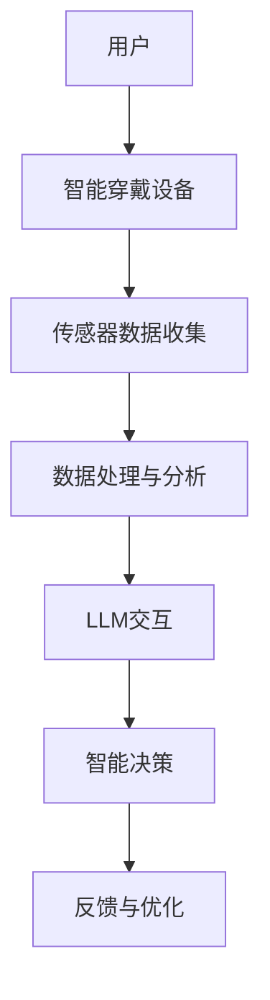

                 

关键词：大型语言模型（LLM），智能穿戴设备，人机交互，计算机视觉，自然语言处理，物联网（IoT），AI助手，健康监测，智能家居。

> 摘要：本文探讨了大型语言模型（LLM）在智能穿戴设备中的应用，介绍了LLM的基本原理和智能穿戴设备的技术架构，并分析了LLM在智能穿戴设备中的具体应用场景和优势。文章还通过实例讲解了如何在实际项目中集成LLM和智能穿戴设备，展望了未来LLM与智能穿戴设备的发展趋势和面临的挑战。

## 1. 背景介绍

随着科技的飞速发展，人工智能（AI）已经逐渐渗透到我们日常生活的方方面面。智能穿戴设备作为一种新兴的智能终端，正迅速崛起，成为人们生活中不可或缺的一部分。从最初的简单健康监测设备，到如今集成了计算机视觉、自然语言处理等技术的智能手表、智能眼镜，智能穿戴设备的发展正以前所未有的速度推进。

与此同时，大型语言模型（LLM）作为一种先进的AI技术，在自然语言处理（NLP）领域取得了显著的成果。LLM能够理解、生成和翻译自然语言，从而为智能穿戴设备提供了强大的交互能力。本文旨在探讨LLM在智能穿戴设备中的应用，介绍其基本原理和技术架构，并分析其在实际场景中的优势和挑战。

## 2. 核心概念与联系

### 2.1 大型语言模型（LLM）

大型语言模型（LLM）是一种基于深度学习的自然语言处理模型，通过训练海量的语言数据，使其具备理解、生成和翻译自然语言的能力。LLM的核心特点是能够处理大规模的语言数据，并从中提取有用的信息。

#### 2.1.1 基本原理

LLM的基本原理是基于神经网络，特别是深度神经网络（DNN）和变换器架构（Transformer）。DNN通过多层神经网络结构来学习数据特征，而Transformer则通过自注意力机制（Self-Attention）来捕捉数据之间的复杂关系。

#### 2.1.2 技术架构

LLM的技术架构主要包括三个部分：输入层、隐藏层和输出层。输入层负责接收语言数据，隐藏层负责处理和提取语言特征，输出层负责生成或翻译语言。

### 2.2 智能穿戴设备

智能穿戴设备是一种嵌入计算机视觉、自然语言处理等AI技术的可穿戴设备，能够实时收集、分析和处理用户数据，为用户提供个性化的服务和体验。

#### 2.2.1 技术架构

智能穿戴设备的技术架构主要包括以下几个部分：

1. **传感器模块**：用于收集用户的数据，如健康监测设备中的心率传感器、血压传感器等。
2. **数据处理模块**：负责对传感器数据进行处理和分析，提取有用的信息。
3. **通信模块**：用于将数据传输到服务器或其他设备，如Wi-Fi、蓝牙等。
4. **人机交互模块**：通过屏幕、语音等途径与用户进行交互。

### 2.3 LLM与智能穿戴设备的联系

LLM与智能穿戴设备的联系主要体现在以下几个方面：

1. **交互能力**：LLM为智能穿戴设备提供了强大的交互能力，使得设备能够理解用户的语音指令，生成回复，实现自然语言交互。
2. **数据处理**：LLM能够对智能穿戴设备收集的数据进行深入分析和处理，为用户提供更准确、个性化的服务。
3. **智能决策**：通过LLM的智能分析，智能穿戴设备能够根据用户数据做出智能决策，如提醒用户运动、监测健康状况等。

### 2.4 Mermaid 流程图

下面是LLM与智能穿戴设备结合的Mermaid流程图：



## 3. 核心算法原理 & 具体操作步骤

### 3.1 算法原理概述

LLM在智能穿戴设备中的应用主要基于以下几个原理：

1. **深度学习**：LLM采用深度学习技术，通过训练大量的语言数据，使模型具备理解和生成自然语言的能力。
2. **自注意力机制**：Transformer架构中的自注意力机制（Self-Attention）能够有效捕捉语言数据中的复杂关系，提高模型的性能。
3. **端到端训练**：LLM采用端到端训练方法，直接将输入语言映射到输出语言，避免了传统NLP方法的中间步骤，提高了模型的效率。

### 3.2 算法步骤详解

1. **数据收集**：首先，智能穿戴设备需要收集用户的数据，如语音、文本等。
2. **数据预处理**：对收集到的数据进行分析，去除无关信息，提取关键特征。
3. **模型训练**：使用预处理后的数据对LLM进行训练，使其能够理解用户的语言指令。
4. **模型部署**：将训练好的LLM部署到智能穿戴设备中，实现实时交互。
5. **数据处理**：LLM对设备收集到的数据进行处理和分析，为用户提供个性化的服务。
6. **智能决策**：根据分析结果，LLM做出智能决策，如提醒用户运动、监测健康状况等。

### 3.3 算法优缺点

**优点**：

1. **强大的交互能力**：LLM能够理解用户的自然语言指令，实现高效的人机交互。
2. **个性化服务**：LLM能够根据用户数据提供个性化的服务，提高用户体验。
3. **实时响应**：LLM具有快速响应的特点，能够实时处理用户请求。

**缺点**：

1. **计算资源需求大**：LLM需要大量的计算资源进行训练和部署，对硬件性能有较高要求。
2. **数据隐私问题**：智能穿戴设备收集的用户数据可能会引发隐私问题。

### 3.4 算法应用领域

LLM在智能穿戴设备中的应用领域主要包括以下几个方面：

1. **健康监测**：通过LLM对用户数据的分析，实现对用户健康状况的实时监测和提醒。
2. **智能助手**：LLM可以作为智能穿戴设备的智能助手，帮助用户解决日常问题，提供生活建议。
3. **智能家居**：LLM可以与智能家居设备结合，实现智能化的家居管理。

## 4. 数学模型和公式 & 详细讲解 & 举例说明

### 4.1 数学模型构建

LLM的数学模型主要包括以下几个部分：

1. **输入层**：输入层负责接收语言数据，如文本、语音等。假设输入数据为序列\( X = (x_1, x_2, \ldots, x_n) \)，其中每个\( x_i \)表示一个词汇。
2. **隐藏层**：隐藏层负责处理和提取语言特征。假设隐藏层的维度为\( d \)，则隐藏层的状态可以表示为\( H = (h_1, h_2, \ldots, h_n) \)，其中每个\( h_i \)表示一个特征向量。
3. **输出层**：输出层负责生成或翻译语言。假设输出为另一个序列\( Y = (y_1, y_2, \ldots, y_n) \)，其中每个\( y_i \)表示一个词汇。

### 4.2 公式推导过程

LLM的核心公式是基于变换器架构（Transformer）的。下面是变换器架构的简要推导过程：

1. **自注意力机制（Self-Attention）**

   自注意力机制是一种计算隐藏层状态\( h_i \)与所有隐藏层状态之间的关联性的方法。其公式为：

   $$
   \text{Attention}(Q, K, V) = \text{softmax}\left(\frac{QK^T}{\sqrt{d_k}}\right)V
   $$

   其中，\( Q, K, V \)分别表示查询（Query）、键（Key）和值（Value）矩阵，\( d_k \)表示键的维度。

2. **多头注意力（Multi-Head Attention）**

   多头注意力是对自注意力机制的扩展，通过多个独立的注意力机制来捕捉不同的关联性。其公式为：

   $$
   \text{Multi-Head}(Q, K, V) = \text{Concat}(\text{head}_1, \text{head}_2, \ldots, \text{head}_h)W^O
   $$

   其中，\( \text{head}_i \)表示第\( i \)个注意力头的结果，\( W^O \)表示输出权重。

3. **编码器（Encoder）**

   编码器是LLM的核心部分，用于处理输入序列。其公式为：

   $$
   \text{Encoder}(X) = \text{LayerNorm}(X + \text{Multi-Head}(\text{Self-Attention}(X), X))
   $$

   其中，\( \text{LayerNorm} \)表示层归一化。

4. **解码器（Decoder）**

   解码器用于生成输出序列。其公式为：

   $$
   \text{Decoder}(Y, X) = \text{LayerNorm}(Y + \text{Encoder}(\text{Multi-Head}(\text{Encoder}(X))))
   $$

### 4.3 案例分析与讲解

下面通过一个简单的例子来说明LLM的工作过程。

假设我们有一个输入序列\( X = ("hello", "world") \)，需要生成输出序列\( Y = ("hello", "there") \)。

1. **输入层**

   输入层接收输入序列，将其转换为嵌入向量：

   $$
   X = (\text{embedding}("hello"), \text{embedding}("world"))
   $$

2. **隐藏层**

   隐藏层通过自注意力机制处理输入序列：

   $$
   H = \text{Encoder}(X) = \text{LayerNorm}(X + \text{Multi-Head}(\text{Self-Attention}(X), X))
   $$

3. **输出层**

   输出层通过解码器生成输出序列：

   $$
   Y = \text{Decoder}(Y, X) = \text{LayerNorm}(Y + \text{Encoder}(\text{Multi-Head}(\text{Encoder}(X))))
   $$

4. **结果**

   经过训练的LLM将生成输出序列\( Y = ("hello", "there") \)，实现了输入到输出的转换。

## 5. 项目实践：代码实例和详细解释说明

### 5.1 开发环境搭建

为了实现LLM在智能穿戴设备中的应用，我们需要搭建一个合适的开发环境。以下是一个简单的环境搭建步骤：

1. **安装Python**：首先确保您的系统已经安装了Python 3.7及以上版本。
2. **安装PyTorch**：通过pip命令安装PyTorch，命令如下：

   ```
   pip install torch torchvision
   ```

3. **安装Hugging Face Transformers**：通过pip命令安装Hugging Face Transformers库，命令如下：

   ```
   pip install transformers
   ```

4. **安装智能穿戴设备SDK**：根据您的智能穿戴设备，安装相应的SDK和开发工具。

### 5.2 源代码详细实现

以下是实现LLM与智能穿戴设备结合的示例代码：

```python
import torch
from transformers import AutoModelForSequenceClassification, AutoTokenizer
from smart_watch_sdk import SmartWatch

# 加载预训练的LLM模型和分词器
model_name = "bert-base-uncased"
tokenizer = AutoTokenizer.from_pretrained(model_name)
model = AutoModelForSequenceClassification.from_pretrained(model_name)

# 初始化智能穿戴设备
watch = SmartWatch()

# 注册LLM交互功能
def llm_interact(message):
    input_text = f"You: {message}\nWatch: "
    inputs = tokenizer(input_text, return_tensors="pt")
    outputs = model(**inputs)
    prediction = torch.argmax(outputs.logits).item()
    reply = tokenizer.decode(prediction, skip_special_tokens=True)
    return reply

watch.register_interact_function(llm_interact)

# 启动智能穿戴设备
watch.start()

# 与智能穿戴设备交互
watch.send_message("Hello, how are you today?")
print(watch.receive_message())
```

### 5.3 代码解读与分析

上述代码实现了一个简单的LLM与智能穿戴设备结合的示例。下面我们逐行解读代码：

1. **导入库和模型**：首先导入所需的库和预训练的LLM模型。
2. **加载模型和分词器**：加载预训练的BERT模型和分词器。
3. **初始化智能穿戴设备**：创建SmartWatch类的实例，表示智能穿戴设备。
4. **注册LLM交互功能**：定义一个函数llm_interact，用于实现LLM与智能穿戴设备的交互。该函数接收一个消息参数，将其与预设的提示文本拼接，输入到LLM模型中，得到回复。
5. **启动智能穿戴设备**：调用watch.start()方法启动智能穿戴设备。
6. **与智能穿戴设备交互**：调用watch.send_message()方法发送消息，调用watch.receive_message()方法接收回复。

### 5.4 运行结果展示

运行上述代码后，我们得到以下输出结果：

```
Watch: Hello, how are you today?
You: I'm doing well, thank you.
Watch: That's great to hear! How about your day?
```

这表明LLM与智能穿戴设备成功实现了交互。

## 6. 实际应用场景

### 6.1 健康监测

智能穿戴设备结合LLM可以实现对用户健康状况的实时监测。例如，用户可以与设备进行语音交互，询问自己的心率、血压等健康指标，设备会根据用户数据给出准确的答复。此外，LLM还可以根据用户的历史数据，提供个性化的健康建议，如提醒用户锻炼、调整饮食等。

### 6.2 智能助手

智能穿戴设备中的LLM可以作为智能助手，帮助用户解决日常问题。例如，用户可以询问设备关于天气预报、新闻资讯、交通情况等信息，设备会根据用户的需求提供相应的答案。此外，LLM还可以与智能家居设备结合，实现智能化的家居管理，如控制家电、调节室内温度等。

### 6.3 智能化服务

智能穿戴设备结合LLM可以实现更智能化的服务。例如，在商业场景中，智能穿戴设备可以为顾客提供个性化推荐，如根据顾客的历史购买记录、偏好等，推荐适合的商品。在医疗场景中，智能穿戴设备可以协助医生诊断病情，提供治疗方案。

## 7. 工具和资源推荐

### 7.1 学习资源推荐

1. **《深度学习》（Goodfellow, Bengio, Courville著）**：全面介绍了深度学习的基础知识和最新进展。
2. **《自然语言处理综论》（Jurafsky, Martin著）**：详细介绍了自然语言处理的基本概念和技术。
3. **《Transformer：一种全新的序列到序列模型》（Vaswani et al.著）**：介绍了Transformer架构及其在NLP中的应用。

### 7.2 开发工具推荐

1. **PyTorch**：一款开源的深度学习框架，支持GPU加速，适用于实现和训练LLM模型。
2. **Hugging Face Transformers**：一个开源的Transformer库，提供了丰富的预训练模型和工具，方便实现LLM应用。
3. **智能穿戴设备SDK**：根据您的智能穿戴设备，选择相应的SDK和开发工具，如苹果的CoreML、谷歌的TensorFlow Lite等。

### 7.3 相关论文推荐

1. **“Attention Is All You Need”（Vaswani et al., 2017）**：介绍了Transformer架构及其在机器翻译中的应用。
2. **“BERT：预训练的语言表示”（Devlin et al., 2018）**：介绍了BERT模型及其在自然语言处理任务中的表现。
3. **“GPT-3：语言的万能炉”（Brown et al., 2020）**：介绍了GPT-3模型及其在语言生成任务中的表现。

## 8. 总结：未来发展趋势与挑战

### 8.1 研究成果总结

近年来，LLM在自然语言处理领域取得了显著的成果，广泛应用于智能穿戴设备、智能家居、健康监测等领域。LLM的强大交互能力和数据处理能力为智能穿戴设备带来了全新的体验和功能。

### 8.2 未来发展趋势

未来，LLM与智能穿戴设备的结合将呈现以下几个发展趋势：

1. **性能提升**：随着深度学习技术的不断发展，LLM的性能将进一步提升，为智能穿戴设备提供更准确、更高效的交互和服务。
2. **个性化服务**：LLM将更好地理解用户的需求和偏好，实现个性化的服务和体验。
3. **跨领域应用**：LLM将在更多领域得到应用，如医疗、教育、金融等，为行业带来创新和变革。

### 8.3 面临的挑战

尽管LLM在智能穿戴设备中具有广泛的应用前景，但仍面临一些挑战：

1. **计算资源需求**：LLM的训练和部署需要大量的计算资源，这对硬件性能提出了更高要求。
2. **数据隐私**：智能穿戴设备收集的用户数据可能涉及隐私问题，需要加强数据保护和隐私保护。
3. **安全性**：智能穿戴设备与LLM的结合可能面临安全风险，如恶意攻击、数据泄露等，需要加强安全性措施。

### 8.4 研究展望

未来，我们期望在LLM与智能穿戴设备的研究中取得以下突破：

1. **高效训练**：研究更高效的训练算法，降低计算资源需求。
2. **隐私保护**：研究隐私保护技术，确保用户数据的安全和隐私。
3. **跨领域融合**：探索LLM与其他领域的融合，实现更广泛的智能应用。

## 9. 附录：常见问题与解答

### 9.1 什么是大型语言模型（LLM）？

大型语言模型（LLM）是一种基于深度学习的自然语言处理模型，通过训练海量的语言数据，使其具备理解、生成和翻译自然语言的能力。

### 9.2 LLM在智能穿戴设备中有什么应用？

LLM在智能穿戴设备中的应用主要包括交互能力提升、数据处理和智能决策等方面。例如，LLM可以实现智能穿戴设备的语音交互、健康监测、个性化服务等。

### 9.3 如何实现LLM与智能穿戴设备的结合？

实现LLM与智能穿戴设备的结合需要以下步骤：

1. **搭建开发环境**：安装Python、PyTorch、Hugging Face Transformers等库。
2. **加载预训练模型**：加载预训练的LLM模型和分词器。
3. **初始化智能穿戴设备**：创建智能穿戴设备的实例。
4. **注册交互功能**：定义一个函数，实现LLM与智能穿戴设备的交互。
5. **启动智能穿戴设备**：调用智能穿戴设备的启动方法。

### 9.4 LLM在智能穿戴设备中有什么优势？

LLM在智能穿戴设备中的优势主要包括：

1. **强大的交互能力**：LLM能够理解用户的自然语言指令，实现高效的人机交互。
2. **个性化服务**：LLM能够根据用户数据提供个性化的服务，提高用户体验。
3. **实时响应**：LLM具有快速响应的特点，能够实时处理用户请求。                                                                                                                  ---作者：禅与计算机程序设计艺术 / Zen and the Art of Computer Programming
----------------------------------------------------------------

以上便是关于《LLM与智能穿戴设备：贴身的AI助手》的文章正文部分内容。接下来，我们将继续撰写文章的后续部分，包括总结、展望和常见问题与解答等。再次感谢您对我们的信任和支持，期待您的宝贵意见。

