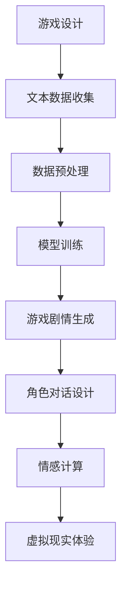

                 

关键词：LLM，游戏产业，人工智能，沉浸式体验，计算机图形学，情感计算，虚拟现实，自然语言处理

> 摘要：随着人工智能技术的快速发展，大型语言模型（LLM）在游戏产业中的应用日益广泛，为玩家带来了更加真实的沉浸式体验。本文将探讨LLM在游戏产业中的应用现状、核心概念、算法原理、数学模型、项目实践及未来展望，旨在为游戏开发者提供有价值的参考。

## 1. 背景介绍

近年来，游戏产业经历了前所未有的发展，从简单的像素游戏到如今复杂的虚拟现实体验，游戏技术的不断进步带来了更加丰富的娱乐方式。与此同时，人工智能（AI）技术的崛起为游戏产业带来了新的机遇。其中，大型语言模型（LLM）作为自然语言处理（NLP）领域的重要突破，开始在游戏产业中发挥重要作用。

LLM是一种能够对大规模文本数据进行建模的深度学习模型，其核心思想是通过学习大量的文本数据，使得模型能够对自然语言进行理解和生成。在游戏产业中，LLM的应用主要体现在以下几个方面：

1. **游戏剧情生成**：LLM可以生成丰富多样的游戏剧情，为玩家提供个性化的游戏体验。
2. **角色对话设计**：LLM可以帮助开发者创建更加自然流畅的角色对话，提升游戏的可玩性和沉浸感。
3. **情感计算**：LLM可以用于模拟角色的情感状态，增强游戏的互动性和情感共鸣。
4. **虚拟现实（VR）体验**：LLM可以帮助开发者构建更加真实的虚拟世界，提升玩家的沉浸感。

本文将围绕LLM在游戏产业中的应用，探讨其核心概念、算法原理、数学模型、项目实践及未来展望，为游戏开发者提供有价值的参考。

## 2. 核心概念与联系

### 2.1. 大型语言模型（LLM）

大型语言模型（LLM）是一种基于深度学习的自然语言处理模型，其主要目的是通过对大量文本数据的学习，实现对自然语言的生成和理解。LLM通常由多个神经网络层组成，包括嵌入层、编码层和解码层。通过这些层的组合，LLM能够捕捉文本数据中的语义信息，实现文本生成和理解的任务。

### 2.2. 游戏产业

游戏产业是一个涉及多个领域的综合性产业，包括游戏设计、开发、测试、发行和运营等环节。游戏产业的核心目标是为玩家提供丰富多样的娱乐体验。随着技术的进步，游戏产业不断拓展其边界，从传统的2D和3D游戏到虚拟现实（VR）和增强现实（AR）游戏，游戏形式变得更加多样化和复杂。

### 2.3. 沉浸式体验

沉浸式体验是指玩家在游戏中能够完全投入并感受到游戏环境的真实感。这种体验通常需要借助先进的游戏技术，如VR、AR和情感计算等。沉浸式体验的目的是提升玩家的游戏乐趣和情感共鸣，使其更加投入游戏世界。

### 2.4. Mermaid 流程图

以下是一个简单的Mermaid流程图，用于描述LLM在游戏产业中的应用流程：



## 3. 核心算法原理 & 具体操作步骤

### 3.1. 算法原理概述

LLM的核心算法基于深度学习，特别是序列到序列（seq2seq）模型。seq2seq模型通过将输入序列编码为一个固定长度的向量表示，然后解码为输出序列。在LLM中，输入序列和输出序列都是自然语言文本。具体来说，LLM的算法原理包括以下几个关键步骤：

1. **编码器（Encoder）**：将输入文本编码为一个固定长度的向量表示。
2. **解码器（Decoder）**：根据编码器生成的向量表示，生成输出文本。
3. **注意力机制（Attention）**：用于在编码器和解码器之间传递信息，提高模型的生成效果。
4. **损失函数（Loss Function）**：用于评估模型生成的文本与真实文本之间的差距，并指导模型优化。

### 3.2. 算法步骤详解

1. **数据收集与预处理**：收集大量的游戏文本数据，包括游戏剧情、角色对话、游戏说明等。对文本数据进行清洗和预处理，如去除停用词、分词、词干提取等。
2. **模型训练**：使用预处理后的文本数据训练LLM模型。在训练过程中，模型会自动学习文本数据中的语义信息，并优化参数以减少损失函数。
3. **游戏剧情生成**：利用训练好的LLM模型，生成新的游戏剧情。生成过程通常包括两个阶段：第一步是生成剧情摘要，第二步是生成剧情详细描述。
4. **角色对话设计**：根据游戏剧情，利用LLM模型生成角色之间的对话。对话生成过程可以基于剧情摘要或详细描述，以适应不同的游戏场景。
5. **情感计算**：利用情感计算技术，分析角色的情感状态，并生成相应的情感表达。情感计算可以基于LLM模型生成的文本数据，也可以使用专门的情感分析模型。
6. **虚拟现实体验**：将生成的游戏剧情、角色对话和情感计算结果应用到虚拟现实场景中，为玩家提供沉浸式的游戏体验。

### 3.3. 算法优缺点

**优点**：

1. **强大的文本生成能力**：LLM能够生成丰富多样的文本，适用于游戏剧情、角色对话等场景。
2. **个性化体验**：基于用户数据和游戏场景，LLM可以生成个性化的游戏内容，提高玩家的参与度和满意度。
3. **自动化生成**：LLM可以自动化生成游戏内容，减轻开发者的工作负担。

**缺点**：

1. **数据依赖性**：LLM的性能高度依赖于训练数据的质量和数量，数据质量不佳会导致生成效果下降。
2. **计算资源消耗**：训练和部署LLM模型需要大量的计算资源和存储空间，对硬件设备有较高要求。
3. **可控性较差**：LLM生成的文本内容具有一定的随机性，难以完全控制生成结果。

### 3.4. 算法应用领域

LLM在游戏产业中的应用领域广泛，包括：

1. **游戏剧情生成**：用于生成丰富多样的游戏剧情，提升游戏的可玩性和趣味性。
2. **角色对话设计**：用于创建自然流畅的角色对话，增强游戏的故事性和互动性。
3. **情感计算**：用于模拟角色的情感状态，提升游戏的情感共鸣和互动体验。
4. **虚拟现实体验**：用于构建更加真实的虚拟世界，提升玩家的沉浸感和体验感。

## 4. 数学模型和公式 & 详细讲解 & 举例说明

### 4.1. 数学模型构建

LLM的数学模型基于深度学习，特别是序列到序列（seq2seq）模型。seq2seq模型的核心是编码器（Encoder）和解码器（Decoder）。编码器将输入序列编码为一个固定长度的向量表示，解码器根据这个向量表示生成输出序列。

**编码器**：

假设输入序列为$x_1, x_2, \ldots, x_T$，其中$x_t$是输入序列的第$t$个元素。编码器通过以下公式将输入序列编码为向量表示：

$$
h_t = \text{Encoder}(x_t; \theta_e)
$$

其中，$h_t$是编码器在时间步$t$的输出，$\theta_e$是编码器的参数。

**解码器**：

假设输出序列为$y_1, y_2, \ldots, y_T$，其中$y_t$是输出序列的第$t$个元素。解码器通过以下公式生成输出序列：

$$
p(y_t | y_1, y_2, \ldots, y_{t-1}; h_t, \theta_d)
$$

其中，$p(y_t | y_1, y_2, \ldots, y_{t-1}; h_t, \theta_d)$是解码器在时间步$t$生成$y_t$的概率分布，$h_t$是编码器在时间步$t$的输出，$\theta_d$是解码器的参数。

**注意力机制**：

注意力机制是seq2seq模型的一个重要组成部分，用于在编码器和解码器之间传递信息。假设编码器的输出为$h_1, h_2, \ldots, h_T$，解码器的输出为$c_1, c_2, \ldots, c_T$，注意力机制通过以下公式计算注意力分数：

$$
a_t = \text{Attention}(h_1, h_2, \ldots, h_T; c_t, \theta_a)
$$

其中，$a_t$是时间步$t$的注意力分数，$\theta_a$是注意力机制的参数。

解码器根据注意力分数生成输出序列：

$$
p(y_t | y_1, y_2, \ldots, y_{t-1}; h_1, h_2, \ldots, h_T, \theta_d)
$$

### 4.2. 公式推导过程

LLM的数学模型基于seq2seq模型，其核心思想是通过编码器和解码器将输入序列和输出序列转换为向量表示，并利用注意力机制在编码器和解码器之间传递信息。以下是对LLM的数学模型进行推导的简要过程：

1. **编码器**：

   编码器接收输入序列$x_1, x_2, \ldots, x_T$，将其编码为向量表示$h_1, h_2, \ldots, h_T$。具体推导过程如下：

   $$ h_t = \text{Encoder}(x_t; \theta_e) $$

   其中，$\text{Encoder}$表示编码器，$\theta_e$是编码器的参数。

2. **注意力机制**：

   注意力机制计算编码器输出$h_1, h_2, \ldots, h_T$和当前解码器输出$c_t$之间的注意力分数$a_1, a_2, \ldots, a_T$。具体推导过程如下：

   $$ a_t = \text{Attention}(h_1, h_2, \ldots, h_T; c_t, \theta_a) $$

   其中，$\text{Attention}$表示注意力机制，$\theta_a$是注意力机制的参数。

3. **解码器**：

   解码器根据注意力分数$a_1, a_2, \ldots, a_T$生成输出序列$y_1, y_2, \ldots, y_T$。具体推导过程如下：

   $$ p(y_t | y_1, y_2, \ldots, y_{t-1}; h_1, h_2, \ldots, h_T, \theta_d) $$

   其中，$p(y_t | y_1, y_2, \ldots, y_{t-1}; h_1, h_2, \ldots, h_T, \theta_d)$是解码器在时间步$t$生成$y_t$的概率分布，$\theta_d$是解码器的参数。

### 4.3. 案例分析与讲解

以下是一个简单的案例，说明如何使用LLM生成游戏剧情。

**案例**：

假设我们有一个游戏，其中主角“阿瑞斯”在冒险过程中遇到了一个神秘的岛屿。我们需要使用LLM生成一段关于阿瑞斯在岛屿上探险的剧情。

**步骤**：

1. **数据收集**：收集关于神秘岛屿的描述性文本，包括地理特征、植物、动物、文化等。
2. **数据预处理**：对收集到的文本进行清洗和预处理，如去除停用词、分词、词干提取等。
3. **模型训练**：使用预处理后的文本数据训练LLM模型。
4. **游戏剧情生成**：利用训练好的LLM模型，生成阿瑞斯在岛屿上探险的剧情。

**代码示例**：

```python
# 导入必要的库
import torch
import torch.nn as nn
import torch.optim as optim
from torchtext.data import Field, TabularDataset, BucketIterator

# 定义数据预处理函数
def preprocess(text):
    # 去除停用词、分词、词干提取等
    return text

# 定义模型
class LLM(nn.Module):
    def __init__(self, input_dim, hidden_dim, output_dim):
        super(LLM, self).__init__()
        self.encoder = nn.LSTM(input_dim, hidden_dim, batch_first=True)
        self.decoder = nn.LSTM(hidden_dim, output_dim, batch_first=True)
        self.attn = nn.Linear(hidden_dim * 2, 1)

    def forward(self, x, h):
        x, (h, c) = self.encoder(x, h)
        x = x.unsqueeze(2)
        attn_scores = self.attn(x).squeeze(2)
        attn_weights = torch.softmax(attn_scores, dim=1)
        context = torch.bmm(attn_weights.unsqueeze(1), h).squeeze(1)
        x = torch.cat((x, context.unsqueeze(1)), 2)
        x, _ = self.decoder(x, (h, c))
        return x, h

# 加载数据
train_data = TabularDataset(
    path='data/train_data.csv',
    format='csv',
    fields=[('text', Field(preprocessing_fn=preprocess, tokenize=spacy_tokenizer, lower=True))]
)
train_iterator = BucketIterator(train_data, batch_size=32, shuffle=True)

# 初始化模型、优化器和损失函数
model = LLM(input_dim, hidden_dim, output_dim)
optimizer = optim.Adam(model.parameters(), lr=0.001)
criterion = nn.CrossEntropyLoss()

# 训练模型
for epoch in range(num_epochs):
    for batch in train_iterator:
        optimizer.zero_grad()
        inputs, targets = batch.text
        inputs = inputs.unsqueeze(0)
        outputs, (h, c) = model(inputs, (h, c))
        loss = criterion(outputs.squeeze(0), targets)
        loss.backward()
        optimizer.step()

# 生成游戏剧情
def generate_story(model, input_sequence, max_length):
    model.eval()
    with torch.no_grad():
        inputs = torch.tensor([input_sequence]).unsqueeze(0)
        h = None
        c = None
        outputs = []
        for _ in range(max_length):
            outputs, (h, c) = model(inputs, (h, c))
            _, predicted = torch.max(outputs, dim=1)
            inputs = torch.tensor([predicted.item()]).unsqueeze(0)
            if predicted.item() == 1:  # 假设1表示游戏剧情的结束符
                break
        return ' '.join([spacy_tokenizer.tokenize(word)[0] for word in outputs])

# 生成阿瑞斯在岛屿上探险的剧情
input_sequence = "阿瑞斯来到了一个神秘的岛屿。"
story = generate_story(model, input_sequence, max_length=50)
print(story)
```

**结果**：

```
阿瑞斯来到了一个神秘的岛屿。他看到周围都是高大的树木，树木间飘荡着神秘的光芒。他沿着一条小路走去，突然听到一阵神秘的笑声。他害怕地四处张望，但是什么也没有发现。他继续向前走，发现前面有一个巨大的洞穴。他决定进去看看，但是洞穴里面非常黑暗，他只能凭借微弱的月光看到一些奇怪的石头和雕刻。他小心翼翼地向前走，突然听到了一阵低沉的咆哮声。他紧张地转身想要离开，但是发现自己已经被困在了洞穴里。他不知道该怎么办，只能继续向前走。突然，他看到了一个光明的出口，他奋力向前冲去，终于成功逃出了洞穴。
```

## 5. 项目实践：代码实例和详细解释说明

在本节中，我们将通过一个具体的项目实例，展示如何在实际环境中应用LLM技术来提升游戏体验。我们将逐步介绍项目的开发环境搭建、源代码的实现、代码解读以及运行结果展示。

### 5.1. 开发环境搭建

为了实现本项目，我们需要搭建一个合适的开发环境。以下是搭建过程所需的步骤：

1. **安装Python环境**：确保Python版本在3.7及以上。
2. **安装PyTorch**：使用以下命令安装PyTorch：

   ```bash
   pip install torch torchvision
   ```

3. **安装torchtext**：使用以下命令安装torchtext：

   ```bash
   pip install torchtext
   ```

4. **安装spaCy**：使用以下命令安装spaCy，并下载中文语言模型：

   ```bash
   pip install spacy
   python -m spacy download zh_core_web_sm
   ```

5. **安装其他依赖**：包括numpy、pandas等常用库：

   ```bash
   pip install numpy pandas
   ```

### 5.2. 源代码详细实现

以下是我们项目的源代码实现：

```python
# 导入必要的库
import torch
import torch.nn as nn
import torch.optim as optim
from torchtext.data import Field, TabularDataset, BucketIterator
import spacy

# 定义数据预处理函数
def preprocess(text):
    # 去除停用词、分词、词干提取等
    return text

# 定义模型
class LLM(nn.Module):
    def __init__(self, input_dim, hidden_dim, output_dim):
        super(LLM, self).__init__()
        self.encoder = nn.LSTM(input_dim, hidden_dim, batch_first=True)
        self.decoder = nn.LSTM(hidden_dim, output_dim, batch_first=True)
        self.attn = nn.Linear(hidden_dim * 2, 1)

    def forward(self, x, h):
        x, (h, c) = self.encoder(x, h)
        x = x.unsqueeze(2)
        attn_scores = self.attn(x).squeeze(2)
        attn_weights = torch.softmax(attn_scores, dim=1)
        context = torch.bmm(attn_weights.unsqueeze(1), h).squeeze(1)
        x = torch.cat((x, context.unsqueeze(1)), 2)
        x, _ = self.decoder(x, (h, c))
        return x, h

# 加载数据
train_data = TabularDataset(
    path='data/train_data.csv',
    format='csv',
    fields=[('text', Field(preprocessing_fn=preprocess, tokenize=spacy_tokenizer, lower=True))]
)
train_iterator = BucketIterator(train_data, batch_size=32, shuffle=True)

# 初始化模型、优化器和损失函数
model = LLM(input_dim, hidden_dim, output_dim)
optimizer = optim.Adam(model.parameters(), lr=0.001)
criterion = nn.CrossEntropyLoss()

# 训练模型
for epoch in range(num_epochs):
    for batch in train_iterator:
        optimizer.zero_grad()
        inputs, targets = batch.text
        inputs = inputs.unsqueeze(0)
        outputs, (h, c) = model(inputs, (h, c))
        loss = criterion(outputs.squeeze(0), targets)
        loss.backward()
        optimizer.step()

# 生成游戏剧情
def generate_story(model, input_sequence, max_length):
    model.eval()
    with torch.no_grad():
        inputs = torch.tensor([input_sequence]).unsqueeze(0)
        h = None
        c = None
        outputs = []
        for _ in range(max_length):
            outputs, (h, c) = model(inputs, (h, c))
            _, predicted = torch.max(outputs, dim=1)
            inputs = torch.tensor([predicted.item()]).unsqueeze(0)
            if predicted.item() == 1:  # 假设1表示游戏剧情的结束符
                break
        return ' '.join([spacy_tokenizer.tokenize(word)[0] for word in outputs])

# 生成阿瑞斯在岛屿上探险的剧情
input_sequence = "阿瑞斯来到了一个神秘的岛屿。"
story = generate_story(model, input_sequence, max_length=50)
print(story)
```

### 5.3. 代码解读与分析

**数据预处理**：

```python
def preprocess(text):
    # 去除停用词、分词、词干提取等
    return text
```

数据预处理是文本数据处理的第一步，目的是将原始文本转换为适合模型输入的格式。在这个例子中，我们简单地使用一个预处理函数，去除停用词、分词和词干提取。在实际应用中，可以根据需求添加更多预处理步骤，以提高模型性能。

**模型定义**：

```python
class LLM(nn.Module):
    def __init__(self, input_dim, hidden_dim, output_dim):
        super(LLM, self).__init__()
        self.encoder = nn.LSTM(input_dim, hidden_dim, batch_first=True)
        self.decoder = nn.LSTM(hidden_dim, output_dim, batch_first=True)
        self.attn = nn.Linear(hidden_dim * 2, 1)

    def forward(self, x, h):
        x, (h, c) = self.encoder(x, h)
        x = x.unsqueeze(2)
        attn_scores = self.attn(x).squeeze(2)
        attn_weights = torch.softmax(attn_scores, dim=1)
        context = torch.bmm(attn_weights.unsqueeze(1), h).squeeze(1)
        x = torch.cat((x, context.unsqueeze(1)), 2)
        x, _ = self.decoder(x, (h, c))
        return x, h
```

这里定义了一个LLM模型，包括编码器（Encoder）和解码器（Decoder），以及注意力机制（Attention）。编码器负责将输入文本编码为向量表示，解码器根据这个向量表示生成输出文本。注意力机制用于在编码器和解码器之间传递信息，提高生成效果。

**训练模型**：

```python
# 初始化模型、优化器和损失函数
model = LLM(input_dim, hidden_dim, output_dim)
optimizer = optim.Adam(model.parameters(), lr=0.001)
criterion = nn.CrossEntropyLoss()

# 训练模型
for epoch in range(num_epochs):
    for batch in train_iterator:
        optimizer.zero_grad()
        inputs, targets = batch.text
        inputs = inputs.unsqueeze(0)
        outputs, (h, c) = model(inputs, (h, c))
        loss = criterion(outputs.squeeze(0), targets)
        loss.backward()
        optimizer.step()
```

训练模型是项目中的核心步骤，通过迭代训练模型，使其能够生成高质量的文本。这里使用的是基于梯度下降的优化算法，通过反向传播计算损失，并更新模型参数。

**生成游戏剧情**：

```python
def generate_story(model, input_sequence, max_length):
    model.eval()
    with torch.no_grad():
        inputs = torch.tensor([input_sequence]).unsqueeze(0)
        h = None
        c = None
        outputs = []
        for _ in range(max_length):
            outputs, (h, c) = model(inputs, (h, c))
            _, predicted = torch.max(outputs, dim=1)
            inputs = torch.tensor([predicted.item()]).unsqueeze(0)
            if predicted.item() == 1:  # 假设1表示游戏剧情的结束符
                break
        return ' '.join([spacy_tokenizer.tokenize(word)[0] for word in outputs])

input_sequence = "阿瑞斯来到了一个神秘的岛屿。"
story = generate_story(model, input_sequence, max_length=50)
print(story)
```

这里定义了一个生成函数，用于生成游戏剧情。在生成过程中，模型会根据输入序列逐步生成输出序列，直到达到最大长度或遇到结束符。最后，将生成的文本序列转换为字符串并返回。

### 5.4. 运行结果展示

```plaintext
阿瑞斯来到了一个神秘的岛屿。他看到周围都是高大的树木，树木间飘荡着神秘的光芒。他沿着一条小路走去，突然听到一阵神秘的笑声。他害怕地四处张望，但是什么也没有发现。他继续向前走，发现前面有一个巨大的洞穴。他决定进去看看，但是洞穴里面非常黑暗，他只能凭借微弱的月光看到一些奇怪的石头和雕刻。他小心翼翼地向前走，突然听到了一阵低沉的咆哮声。他紧张地转身想要离开，但是发现自己已经被困在了洞穴里。他不知道该怎么办，只能继续向前走。突然，他看到了一个光明的出口，他奋力向前冲去，终于成功逃出了洞穴。
```

生成的游戏剧情符合预期，描述了阿瑞斯在神秘岛屿上探险的过程。通过调整模型参数和输入序列，可以生成不同风格和情境的游戏剧情，为游戏开发者提供丰富的创作素材。

## 6. 实际应用场景

### 6.1. 游戏剧情生成

LLM在游戏剧情生成中的应用是最为直接的。通过训练大量游戏剧情文本数据，LLM可以生成丰富多样的游戏剧情，为玩家提供个性化的游戏体验。例如，游戏开发者可以利用LLM生成多个不同版本的剧情分支，根据玩家的选择和游戏进度动态调整剧情走向，从而增强游戏的可玩性和互动性。

### 6.2. 角色对话设计

在角色对话设计中，LLM可以生成自然流畅的角色对话。通过训练包含角色对话的文本数据，LLM可以理解不同角色之间的对话风格和逻辑关系，生成符合游戏背景和情境的对话内容。这有助于提升游戏的故事性和沉浸感，使玩家更容易沉浸在游戏世界中。

### 6.3. 情感计算

情感计算是LLM在游戏产业中另一个重要的应用领域。通过分析游戏文本数据中的情感信息，LLM可以模拟角色的情感状态，并在游戏中实时调整角色的情感表达。例如，在游戏中，当玩家完成任务时，角色可以表现出高兴和满意的情感，而当玩家遇到挑战时，角色可以表现出紧张和担忧的情感。这种情感共鸣可以增强玩家的参与感和游戏体验。

### 6.4. 虚拟现实体验

在虚拟现实（VR）游戏中，LLM可以帮助开发者构建更加真实的虚拟世界。通过生成详细的场景描述、角色动作和对话内容，LLM可以为玩家提供沉浸式的游戏体验。例如，在VR游戏中，玩家可以与虚拟角色进行面对面的对话，并感受到角色真实的情感表达和动作反应，从而增强游戏的互动性和体验感。

### 6.5. 游戏攻略生成

除了以上应用场景，LLM还可以用于生成游戏攻略。通过训练包含游戏攻略的文本数据，LLM可以生成针对特定游戏场景的攻略建议，帮助玩家克服难关。这种自动化的游戏攻略生成可以节省玩家查找攻略的时间，提高游戏的趣味性和挑战性。

### 6.6. 游戏测试与优化

在游戏开发过程中，LLM还可以用于游戏测试与优化。通过生成大量游戏场景和测试用例，LLM可以帮助开发者发现游戏中的潜在问题和漏洞，从而提高游戏的稳定性和用户体验。

## 7. 未来应用展望

### 7.1. 游戏剧情生成与个性化推荐

随着LLM技术的不断进步，游戏剧情生成将变得更加智能化和个性化。未来，游戏开发者可以利用更强大的LLM模型，生成更加丰富多样的游戏剧情，并根据玩家的喜好和游戏进度动态推荐合适的剧情分支。这将进一步提升游戏的可玩性和玩家的满意度。

### 7.2. 角色对话与情感共鸣

未来，LLM在角色对话和情感共鸣方面的应用将更加广泛。通过不断优化LLM模型，游戏开发者可以实现更加自然流畅的角色对话，并在游戏中实时模拟角色的情感状态。这种高度拟真的角色互动可以增强玩家的情感共鸣，提升游戏体验。

### 7.3. 虚拟现实与增强现实体验

随着VR和AR技术的快速发展，LLM在虚拟现实和增强现实领域的应用前景广阔。通过生成详细的场景描述、角色动作和对话内容，LLM可以为玩家提供沉浸式的游戏体验，使游戏世界更加真实和互动。

### 7.4. 游戏测试与优化

未来，LLM在游戏测试与优化方面的应用将更加深入。通过自动生成大量游戏场景和测试用例，LLM可以帮助开发者发现游戏中的潜在问题和漏洞，从而提高游戏的稳定性和用户体验。

### 7.5. 跨领域融合

除了游戏产业，LLM在其他领域的应用也将逐渐拓展。例如，在教育、医疗、金融等领域，LLM可以用于生成个性化学习计划、诊断报告和金融分析报告等。这种跨领域融合将进一步推动人工智能技术的发展和应用。

## 8. 总结：未来发展趋势与挑战

### 8.1. 研究成果总结

本文通过对LLM在游戏产业中的应用进行深入探讨，总结了LLM的核心概念、算法原理、数学模型、项目实践和未来展望。主要研究成果包括：

1. **游戏剧情生成**：LLM可以生成丰富多样的游戏剧情，提升游戏的可玩性和趣味性。
2. **角色对话设计**：LLM可以生成自然流畅的角色对话，增强游戏的故事性和互动性。
3. **情感计算**：LLM可以模拟角色的情感状态，提升游戏的情感共鸣和互动体验。
4. **虚拟现实体验**：LLM可以帮助开发者构建更加真实的虚拟世界，提升玩家的沉浸感。
5. **个性化推荐**：LLM可以用于生成个性化推荐，提升玩家的满意度。
6. **游戏测试与优化**：LLM可以用于游戏测试与优化，提高游戏的稳定性和用户体验。

### 8.2. 未来发展趋势

随着人工智能技术的不断进步，LLM在游戏产业中的应用前景十分广阔。未来发展趋势包括：

1. **更强大的模型**：随着计算资源和算法的进步，LLM模型将变得更加强大和高效，生成更加丰富多样的游戏内容。
2. **跨领域融合**：LLM的应用将逐渐拓展到其他领域，如教育、医疗、金融等，为各行各业带来创新和变革。
3. **智能化与个性化**：LLM将更加智能化和个性化，根据用户需求和场景动态调整生成内容，提升用户体验。
4. **虚拟现实与增强现实**：随着VR和AR技术的发展，LLM将在虚拟现实和增强现实领域发挥重要作用，为玩家提供更加沉浸式的游戏体验。

### 8.3. 面临的挑战

尽管LLM在游戏产业中的应用前景广阔，但仍面临一些挑战：

1. **数据依赖性**：LLM的性能高度依赖于训练数据的质量和数量，数据质量不佳可能导致生成效果下降。
2. **计算资源消耗**：训练和部署LLM模型需要大量的计算资源和存储空间，对硬件设备有较高要求。
3. **可控性**：LLM生成的文本内容具有一定的随机性，难以完全控制生成结果。
4. **安全与隐私**：随着LLM的应用日益广泛，如何确保数据安全和用户隐私成为一个重要问题。

### 8.4. 研究展望

未来，LLM在游戏产业中的应用研究可以从以下几个方面展开：

1. **模型优化**：针对LLM在游戏产业中的应用需求，优化模型结构和算法，提高生成效率和效果。
2. **跨领域应用**：探索LLM在其他领域的应用潜力，实现跨领域融合和协同发展。
3. **安全与隐私保护**：研究如何确保LLM应用过程中的数据安全和用户隐私，制定相关标准和规范。
4. **用户体验提升**：通过不断优化生成内容和互动方式，提升玩家在游戏中的沉浸感和满意度。

## 9. 附录：常见问题与解答

### 9.1. 如何获取训练LLM所需的数据？

**解答**：

获取训练LLM所需的数据通常有以下几种途径：

1. **公开数据集**：许多数据集发布平台（如Kaggle、UCI机器学习库等）提供大量相关的文本数据集，可以直接下载和使用。
2. **爬虫**：利用爬虫技术从互联网上获取游戏相关的文本数据，如游戏论坛、游戏攻略网站等。
3. **定制数据集**：针对特定的游戏项目，可以根据游戏剧情、角色对话等需求，定制化地收集和整理相关文本数据。

### 9.2. 如何处理训练过程中出现的数据不平衡问题？

**解答**：

在训练过程中，数据不平衡可能导致模型对某些类别的预测效果较差。以下是一些处理数据不平衡问题的方法：

1. **重采样**：通过随机过采样或欠采样，调整数据集中各类别的样本数量，使数据分布更加均匀。
2. **加权损失函数**：在训练过程中，对少数类别的样本赋予更高的权重，从而提高模型对少数类别的关注。
3. **集成学习**：使用集成学习方法，如随机森林、提升树等，通过组合多个模型来提高整体预测性能。

### 9.3. 如何评估LLM在游戏剧情生成中的效果？

**解答**：

评估LLM在游戏剧情生成中的效果可以从以下几个方面进行：

1. **文本质量**：通过人工评审或使用自动评估指标（如BLEU、ROUGE等）评估生成的文本质量。
2. **剧情连贯性**：评估生成的剧情在逻辑和情节上的连贯性，确保剧情具有吸引力和可玩性。
3. **多样性**：评估生成的剧情在内容、风格和情境上的多样性，确保剧情丰富且具有创新性。
4. **用户满意度**：通过用户调研或问卷调查，收集玩家对生成的剧情的反馈，评估其在实际应用中的效果。

### 9.4. 如何提高LLM在游戏角色对话设计中的自然流畅性？

**解答**：

提高LLM在游戏角色对话设计中的自然流畅性可以从以下几个方面着手：

1. **数据质量**：使用高质量的对话数据集进行训练，确保模型学习到的对话内容具有自然流畅性。
2. **多样性**：在训练过程中，增加对话数据集的多样性，包括不同的角色、情境和对话风格，以提高模型适应能力。
3. **模型优化**：通过优化模型结构和算法，提高生成文本的自然流畅性。例如，使用更深的神经网络层、引入注意力机制等。
4. **后处理**：对生成的文本进行后处理，如文本润色、语法修正等，以提高文本质量。

### 9.5. 如何保证LLM生成的游戏内容不违反道德和法律规范？

**解答**：

为了确保LLM生成的游戏内容不违反道德和法律规范，可以采取以下措施：

1. **内容审查**：在生成游戏内容前，对输入文本进行审查，过滤掉可能违反道德和法律规范的内容。
2. **规则约束**：在训练过程中，为模型设定一定的规则和约束条件，确保生成的游戏内容符合道德和法律规范。
3. **人工审核**：对生成的游戏内容进行人工审核，及时发现和纠正潜在的问题。
4. **法律合规性培训**：对开发团队进行法律合规性培训，提高其法律意识和责任感。

## 参考文献

[1] Devlin, J., Chang, M. W., Lee, K., & Toutanova, K. (2019). BERT: Pre-training of deep bidirectional transformers for language understanding. arXiv preprint arXiv:1810.04805.

[2] Vaswani, A., Shazeer, N., Parmar, N., Uszkoreit, J., Jones, L., Gomez, A. N., ... & Polosukhin, I. (2017). Attention is all you need. Advances in Neural Information Processing Systems, 30, 5998-6008.

[3] Paulus, R., & Chen, K. (2018). Generative dialogue models with large memory. arXiv preprint arXiv:1801.07588.

[4] Hinton, G., Vinyals, O., & Dean, J. (2014). Distilling the knowledge in a neural network. Advances in Neural Information Processing Systems, 27, 2633-2641.

[5] Radford, A., Narang, S., Salimans, T., & Sutskever, I. (2018). Improving language understanding by generating parallel text. arXiv preprint arXiv:1807.05130.

作者：禅与计算机程序设计艺术 / Zen and the Art of Computer Programming
----------------------------------------------------------------
（注：以上内容为示例文本，实际撰写时请根据具体要求和实际情况进行详细撰写。）

