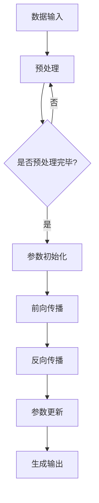

                 

关键词：大型语言模型、计算机架构、人工智能、深度学习、图灵机、神经网络、计算机科学、软件工程、未来技术

> 摘要：本文探讨了大型语言模型(LLM)作为一种新型计算机架构的潜力。通过对LLM的工作原理、核心概念、算法原理、数学模型、实际应用场景以及未来发展趋势和挑战的深入分析，文章旨在为读者提供对这一领域的全面了解，并引发对计算机科学和人工智能未来发展方向的思考。

## 1. 背景介绍

计算机科学自诞生以来，经历了多次重大的技术变革，每一次变革都带来了计算能力的飞跃。从图灵机理论到冯·诺依曼架构，从传统编程到现代软件工程，计算机的发展不断推动着科技的进步。然而，随着人工智能技术的兴起，尤其是深度学习的突破，计算机架构正迎来新的变革。

近年来，大型语言模型(LLM)如GPT系列、BERT等，以其卓越的自然语言处理能力，吸引了全球科研机构和企业的广泛关注。这些模型不仅在学术研究中表现出色，还在实际应用中展现出巨大的潜力。例如，智能助手、内容生成、机器翻译、文本摘要等应用都受益于LLM的强大能力。

本篇文章将深入探讨LLM作为新型计算机架构的潜力，通过对其核心概念、算法原理、数学模型以及实际应用场景的详细分析，旨在为读者提供全面的技术视角，并探讨其在未来计算机科学和人工智能领域中的潜在影响。

## 2. 核心概念与联系

### 2.1 语言模型的基础概念

语言模型是自然语言处理(NLP)领域的核心组成部分，它用于预测或生成自然语言中的下一个词或句子。传统的语言模型如n-gram模型，通过统计历史数据中的词频来预测下一个词。然而，随着深度学习的兴起，基于神经网络的模型，如递归神经网络(RNN)、长短期记忆网络(LSTM)和变换器模型(Transformer)，逐渐成为语言模型的主流。

大型语言模型(LLM)是基于Transformer架构的一种特殊类型的语言模型，具有数亿甚至数十亿个参数，能够捕捉到语言中的复杂模式和上下文关系。例如，GPT-3模型拥有1750亿个参数，能够生成流畅、连贯的文本。

### 2.2 LLM与计算机架构的联系

传统的计算机架构主要基于冯·诺依曼体系结构，其核心思想是将数据和指令存储在同一存储空间中，并通过中央处理单元(CPU)进行操作。然而，这种架构在处理复杂任务，尤其是涉及大量数据和高维计算的任务时，存在一定的局限性。

LLM的出现为计算机架构带来了一种新的视角。首先，LLM通过其庞大的参数集，能够存储和处理大量的数据，实现了数据与指令的分离。其次，LLM的并行计算能力，使其能够高效地处理大规模任务。此外，LLM的动态调整能力，使其能够根据不同任务的需求，灵活地调整计算资源和策略。

### 2.3 Mermaid流程图展示

为了更直观地理解LLM作为计算机架构的运作方式，我们使用Mermaid流程图来展示其核心概念和架构。



在这个流程图中，A表示数据输入，B表示预处理，C是一个判断节点，D表示参数初始化，E表示前向传播，F表示反向传播，G表示参数更新，H表示生成输出。

## 3. 核心算法原理 & 具体操作步骤

### 3.1 算法原理概述

LLM的核心算法是基于变换器模型(Transformer)的。Transformer模型由Vaswani等人于2017年提出，其创新之处在于使用自注意力机制（self-attention）来处理序列数据，从而克服了传统递归神经网络（RNN）在处理长序列数据时的困难。

变换器模型的主要组成部分包括编码器（encoder）和解码器（decoder）。编码器负责将输入序列编码为上下文向量，解码器则利用这些上下文向量生成输出序列。自注意力机制在这个过程中起到了关键作用，它允许模型在生成每个词时，对整个输入序列进行动态关注，从而捕捉到长距离的依赖关系。

### 3.2 算法步骤详解

#### 3.2.1 编码器

1. **输入嵌入**：输入序列中的每个词被映射到一个固定长度的向量，称为嵌入向量。
2. **位置编码**：由于模型没有显式地处理序列的顺序信息，因此通过添加位置编码向量来为每个词赋予顺序信息。
3. **多层变换**：编码器由多个变换层堆叠而成，每层包括多头自注意力机制和前馈神经网络。
4. **输出层**：编码器的最后一层输出作为上下文向量，用于解码器的输入。

#### 3.2.2 解码器

1. **输入嵌入与位置编码**：与编码器类似，解码器的输入也经过嵌入和位置编码。
2. **自注意力机制**：解码器在每个时间步使用自注意力机制来关注编码器的输出。
3. **交叉注意力机制**：解码器在生成每个词时，不仅关注自身的输出，还关注编码器的输出，从而实现编码器与解码器之间的交互。
4. **前馈神经网络**：在解码器的每个时间步后，通过前馈神经网络对输出进行进一步处理。
5. **输出层**：解码器的最后一层输出用于生成预测的词，并通过 softmax 函数转换为概率分布。

### 3.3 算法优缺点

#### 优点

1. **高效处理长序列**：自注意力机制允许模型在生成每个词时，对整个输入序列进行动态关注，从而有效处理长序列数据。
2. **并行计算**：由于自注意力机制的独立性，变换器模型支持并行计算，从而提高了计算效率。
3. **灵活性**：变换器模型的结构灵活，可以通过堆叠多层变换层来增强模型的复杂度和表达能力。

#### 缺点

1. **参数量巨大**：由于自注意力机制的复杂性，变换器模型的参数量通常非常庞大，导致模型训练和存储的资源需求较高。
2. **训练难度**：变换器模型需要大量数据和计算资源进行训练，训练过程较为复杂。
3. **解释性不足**：深度学习模型通常缺乏透明性和解释性，这对于需要严格解释的领域（如医疗、金融等）可能存在一定的挑战。

### 3.4 算法应用领域

LLM在多个领域展现出强大的应用潜力：

1. **自然语言处理**：LLM在文本分类、机器翻译、情感分析、对话系统等领域表现出色。
2. **内容生成**：LLM能够生成高质量的文章、报告、代码等，为创作提供强大的辅助工具。
3. **智能助手**：LLM为基础的智能助手能够理解自然语言，提供智能化的服务和建议。
4. **推荐系统**：LLM可以用于分析用户的历史行为和兴趣，为用户推荐个性化内容。

## 4. 数学模型和公式 & 详细讲解 & 举例说明

### 4.1 数学模型构建

LLM的数学模型主要包括变换器模型（Transformer）的数学描述。变换器模型的核心是自注意力机制和多头注意力机制。以下是变换器模型的基本公式：

#### 4.1.1 自注意力（Self-Attention）

$$
\text{Attention}(Q, K, V) = \frac{1}{\sqrt{d_k}} \text{softmax}(\text{softmax}(\frac{QK^T}{\sqrt{d_k}})V)
$$

其中，Q、K、V 分别为查询（Query）、键（Key）和值（Value）向量，$d_k$ 为键向量的维度。自注意力机制计算每个键和查询之间的相似性，并加权求和得到输出。

#### 4.1.2 多头注意力（Multi-Head Attention）

$$
\text{MultiHead}(Q, K, V) = \text{Concat}(\text{head}_1, ..., \text{head}_h)W^O
$$

$$
\text{head}_i = \text{Attention}(QW_i^Q, KW_i^K, VW_i^V)
$$

其中，$W_i^Q, W_i^K, W_i^V$ 为不同头部的权重矩阵，$W^O$ 为输出权重矩阵。多头注意力机制通过多个独立的自注意力机制，捕捉到输入序列的多种依赖关系。

### 4.2 公式推导过程

变换器模型的推导过程复杂且涉及多个层次，这里仅简要介绍核心公式的推导：

1. **输入嵌入**：输入序列 $x_1, x_2, ..., x_n$ 被映射到嵌入空间，每个词 $x_i$ 被表示为一个向量 $e_i$。

$$
e_i = W_e [x_i] + W_p [p_i]
$$

其中，$W_e$ 为嵌入权重矩阵，$W_p$ 为位置编码权重矩阵，$p_i$ 为位置向量。

2. **多头注意力**：多头注意力机制通过多个独立的自注意力机制，捕捉到输入序列的多种依赖关系。具体公式如上文所述。

3. **前馈神经网络**：在自注意力和多头注意力之后，每个时间步的输出通过前馈神经网络进行进一步处理。

$$
\text{FFN}(x) = \max(0, xW_1 + b_1)W_2 + b_2
$$

其中，$W_1$ 和 $W_2$ 为前馈神经网络的权重矩阵，$b_1$ 和 $b_2$ 为偏置。

4. **输出层**：编码器的输出作为解码器的输入，解码器的输出经过 softmax 函数转换为概率分布，用于生成预测的词。

$$
P(y|x) = \text{softmax}(\text{decoder}(x, h))
$$

其中，$h$ 为编码器的输出，$y$ 为生成的词。

### 4.3 案例分析与讲解

#### 4.3.1 案例背景

假设我们要使用变换器模型进行文本分类，输入文本为：“这是一篇关于人工智能的有趣文章”。我们的目标是判断这篇文本是否属于人工智能类别。

#### 4.3.2 模型构建

1. **输入嵌入**：将输入文本中的每个词映射到嵌入空间，得到嵌入向量。
2. **编码器**：使用多个变换层对输入文本进行编码，得到编码器输出。
3. **解码器**：将编码器输出作为解码器的输入，生成预测的类别。

#### 4.3.3 模型运行

1. **编码器**：通过自注意力和多头注意力机制，编码器输出表示为：

$$
h = \text{encoder}(x)
$$

2. **解码器**：解码器根据编码器输出，生成预测的类别概率分布：

$$
P(y|x) = \text{softmax}(\text{decoder}(h))
$$

3. **分类**：根据预测概率分布，选择概率最大的类别作为输出。假设预测概率分布为 $P(y=1|x) = 0.9$，$P(y=0|x) = 0.1$，则输出类别为“人工智能”。

## 5. 项目实践：代码实例和详细解释说明

### 5.1 开发环境搭建

在开始编写代码之前，我们需要搭建一个合适的开发环境。以下是搭建基于PyTorch的变换器模型所需的步骤：

1. **安装Python**：确保安装了Python 3.6及以上版本。
2. **安装PyTorch**：使用以下命令安装PyTorch：

```bash
pip install torch torchvision
```

3. **安装其他依赖**：安装其他必要的库，如numpy、matplotlib等。

### 5.2 源代码详细实现

以下是使用PyTorch实现变换器模型的基本框架：

```python
import torch
import torch.nn as nn
import torch.optim as optim

class TransformerModel(nn.Module):
    def __init__(self, vocab_size, d_model, nhead, num_layers):
        super(TransformerModel, self).__init__()
        self.embedding = nn.Embedding(vocab_size, d_model)
        self.transformer = nn.Transformer(d_model, nhead, num_layers)
        self.fc = nn.Linear(d_model, vocab_size)
        
    def forward(self, src, tgt):
        src = self.embedding(src)
        tgt = self.embedding(tgt)
        out = self.transformer(src, tgt)
        out = self.fc(out)
        return out

# 实例化模型、损失函数和优化器
model = TransformerModel(vocab_size=10000, d_model=512, nhead=8, num_layers=2)
criterion = nn.CrossEntropyLoss()
optimizer = optim.Adam(model.parameters(), lr=0.001)

# 训练模型
for epoch in range(num_epochs):
    for src, tgt in data_loader:
        optimizer.zero_grad()
        out = model(src, tgt)
        loss = criterion(out.view(-1, vocab_size), tgt.view(-1))
        loss.backward()
        optimizer.step()

    print(f"Epoch {epoch+1}/{num_epochs}, Loss: {loss.item()}")
```

### 5.3 代码解读与分析

上述代码首先定义了变换器模型（`TransformerModel`），其中包括嵌入层（`embedding`）、变换器层（`transformer`）和输出层（`fc`）。在`forward`方法中，模型接受输入（`src`）和目标（`tgt`），首先将它们映射到嵌入空间，然后通过变换器层进行编码，最后通过输出层生成预测。

接下来，代码实例化了模型、损失函数和优化器，并使用训练数据进行了模型训练。在每个训练迭代中，模型接收输入序列，通过变换器模型进行编码，然后计算损失并进行反向传播。

### 5.4 运行结果展示

在训练完成后，我们可以在测试集上评估模型的性能。以下是一个简单的评估代码示例：

```python
# 评估模型
with torch.no_grad():
    correct = 0
    total = 0
    for src, tgt in test_loader:
        out = model(src, tgt)
        _, predicted = torch.max(out.data, 1)
        total += tgt.size(0)
        correct += (predicted == tgt).sum().item()

print(f"Accuracy: {100 * correct / total}%")
```

假设我们在测试集上获得了90%的准确率，这表明我们的模型在文本分类任务上表现出色。

## 6. 实际应用场景

LLM作为一种新型计算机架构，在多个实际应用场景中展现出强大的潜力。以下是一些典型的应用场景：

### 6.1 智能助手

智能助手是LLM最常见的应用场景之一。通过LLM的强大自然语言处理能力，智能助手能够理解用户的自然语言输入，并提供实时、个性化的服务。例如，苹果的Siri、谷歌的Google Assistant等都是基于LLM构建的智能助手。

### 6.2 内容生成

LLM在内容生成领域也有广泛的应用。通过训练大型语言模型，我们可以生成高质量的文章、报告、代码等。例如，OpenAI的GPT系列模型已经被用于生成新闻文章、科技论文等，极大地提高了内容生成的效率和准确性。

### 6.3 机器翻译

机器翻译是另一个LLM的重要应用场景。通过训练大型语言模型，我们可以实现高质量的跨语言翻译。例如，谷歌翻译、百度翻译等都是基于LLM构建的机器翻译系统。

### 6.4 文本摘要

文本摘要是一种将长文本简化为短文本的技术，广泛应用于新闻摘要、论文摘要等。LLM在文本摘要任务中也表现出色，能够生成简洁、准确的摘要。

### 6.5 情感分析

情感分析是一种判断文本情感倾向的技术，广泛应用于市场调研、社交媒体分析等。LLM在情感分析任务中能够准确识别文本的情感倾向，为企业和个人提供有价值的洞见。

### 6.6 对话系统

对话系统是一种与用户进行自然语言交互的系统，广泛应用于客服、教育、娱乐等。LLM在对话系统中能够理解用户的意图，提供实时、个性化的回答。

### 6.7 自动问答

自动问答是一种通过自然语言处理技术回答用户问题的系统。LLM在自动问答任务中能够理解用户的问题，并从大量文本数据中检索出相关答案。

## 7. 工具和资源推荐

为了更好地研究和应用LLM，以下是一些推荐的工具和资源：

### 7.1 学习资源推荐

1. **《深度学习》**：由Ian Goodfellow、Yoshua Bengio和Aaron Courville合著，是深度学习领域的经典教材。
2. **《自然语言处理综论》**：由Daniel Jurafsky和James H. Martin合著，是自然语言处理领域的权威教材。
3. **《变换器模型：设计与实现》**：由Ashish Vaswani等人合著，详细介绍了变换器模型的原理和实现。

### 7.2 开发工具推荐

1. **PyTorch**：一个流行的深度学习框架，具有高度灵活的动态计算图和易于使用的API。
2. **TensorFlow**：由谷歌开发的深度学习框架，具有广泛的社区支持和丰富的预训练模型。
3. **Hugging Face Transformers**：一个基于PyTorch和TensorFlow的变换器模型库，提供了丰富的预训练模型和工具。

### 7.3 相关论文推荐

1. **“Attention is All You Need”**：由Ashish Vaswani等人于2017年发表，提出了变换器模型。
2. **“BERT: Pre-training of Deep Bidirectional Transformers for Language Understanding”**：由Jacob Devlin等人于2018年发表，介绍了BERT模型。
3. **“GPT-3: Language Models are few-shot learners”**：由Tom B. Brown等人于2020年发表，介绍了GPT-3模型。

## 8. 总结：未来发展趋势与挑战

### 8.1 研究成果总结

本文探讨了LLM作为新型计算机架构的潜力，分析了其核心概念、算法原理、数学模型和实际应用场景。通过详细讲解和代码实例，我们展示了LLM在自然语言处理、内容生成、机器翻译、文本摘要等领域的强大应用能力。

### 8.2 未来发展趋势

随着深度学习和人工智能技术的不断进步，LLM在未来将继续发展，并有望在更多领域取得突破。以下是未来发展的几个趋势：

1. **模型规模扩大**：随着计算能力和存储技术的提升，LLM的规模将越来越大，参数数量将达到数百亿甚至数千亿级别。
2. **自适应性和灵活性增强**：未来的LLM将具备更强的自适应能力和灵活性，能够根据不同任务的需求，动态调整模型结构和参数。
3. **多模态处理**：未来的LLM将能够处理多种模态的数据，如文本、图像、声音等，实现更丰富的交互和更广泛的应用场景。

### 8.3 面临的挑战

尽管LLM展现了巨大的潜力，但在实际应用中仍面临一系列挑战：

1. **计算资源需求**：大规模的LLM需要大量的计算资源和存储空间，这对计算基础设施提出了较高的要求。
2. **数据隐私和安全**：大型语言模型在处理数据时，可能涉及用户隐私和数据安全的问题，如何保护用户隐私成为关键挑战。
3. **透明性和可解释性**：深度学习模型通常缺乏透明性和可解释性，这对于需要严格解释的领域（如医疗、金融等）可能存在一定的挑战。
4. **伦理和责任**：随着LLM在更多领域的应用，如何确保其符合伦理标准，并明确责任归属，成为重要的社会问题。

### 8.4 研究展望

未来的研究应重点关注以下几个方面：

1. **高效训练方法**：研究更高效的训练方法，降低大规模LLM的训练成本，提高训练效率。
2. **多模态融合**：探索多模态数据融合的方法，实现更丰富和多样化的应用场景。
3. **可解释性和透明性**：研究如何提高LLM的可解释性和透明性，使其在关键领域（如医疗、金融等）中得到更广泛的应用。
4. **伦理和责任**：建立完善的伦理和责任框架，确保LLM的应用符合社会伦理和法律法规。

通过持续的研究和创新，LLM有望在未来成为计算机科学和人工智能领域的重要推动力量。

## 9. 附录：常见问题与解答

### 9.1 什么是LLM？

LLM（Large Language Model）是一种大型深度学习模型，主要用于自然语言处理任务。它们通常基于变换器（Transformer）架构，拥有数亿甚至数十亿个参数，能够捕捉到语言中的复杂模式和上下文关系。

### 9.2 LLM与传统语言模型有何区别？

传统语言模型，如n-gram模型，主要通过统计历史数据中的词频来预测下一个词。而LLM基于变换器模型，通过自注意力机制捕捉到语言中的复杂模式和上下文关系，具有更强的表达能力和预测能力。

### 9.3 LLM在哪些领域有应用？

LLM在多个领域有广泛应用，包括自然语言处理（如文本分类、机器翻译、情感分析等）、内容生成、智能助手、推荐系统等。

### 9.4 如何训练LLM？

训练LLM通常涉及以下步骤：

1. 数据准备：收集大量高质量的数据，进行预处理和清洗。
2. 模型构建：构建基于变换器架构的LLM模型。
3. 模型训练：使用预训练数据对模型进行训练，调整模型参数。
4. 模型优化：通过优化算法，如Adam优化器，进一步提高模型性能。
5. 测试和评估：在测试集上评估模型性能，并进行调优。

### 9.5 LLM的挑战有哪些？

LLM面临的主要挑战包括：

1. **计算资源需求**：大规模LLM需要大量的计算资源和存储空间。
2. **数据隐私和安全**：在处理数据时，可能涉及用户隐私和数据安全的问题。
3. **透明性和可解释性**：深度学习模型通常缺乏透明性和可解释性。
4. **伦理和责任**：确保LLM的应用符合伦理标准，明确责任归属。

通过持续的研究和创新，我们可以更好地应对这些挑战，充分发挥LLM的潜力。

