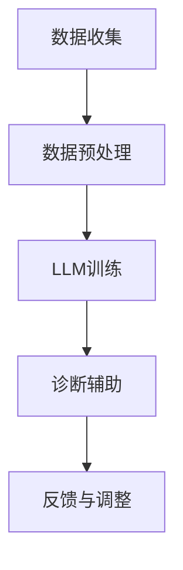

                 

关键词：自然语言处理、人工智能、医疗诊断、临床决策、机器学习

摘要：随着人工智能技术的不断进步，特别是自然语言处理（NLP）领域的突破，大型语言模型（LLM）在医疗诊断中的应用日益受到关注。本文将探讨LLM在医疗诊断中的核心概念、算法原理、数学模型、项目实践以及实际应用场景，并对其未来发展趋势和挑战进行分析。

## 1. 背景介绍

医疗诊断是一个复杂的过程，它不仅依赖于医生的直觉和经验，还需要大量的数据支持和精确的算法辅助。传统的医疗诊断方法存在一定的局限性，例如诊断结果的重复性不高、误诊率较高等。随着大数据和人工智能技术的发展，特别是在自然语言处理领域的突破，研究人员开始探索利用AI技术辅助医疗诊断。

LLM作为一种强大的语言处理模型，能够在大规模文本数据上学习语言模式和知识，从而为医疗诊断提供有效的辅助工具。LLM的核心优势在于其强大的文本理解和生成能力，这使得它能够处理和理解医疗领域的专业知识和临床信息。

## 2. 核心概念与联系

### 2.1. 自然语言处理（NLP）

自然语言处理是人工智能的一个重要分支，它致力于使计算机能够理解、生成和处理人类语言。NLP的关键技术包括分词、词性标注、句法分析、语义分析和机器翻译等。

### 2.2. 机器学习（ML）

机器学习是人工智能的核心技术之一，它通过数据驱动的方式，让计算机自动地从数据中学习规律和模式。在医疗诊断中，机器学习算法可以帮助医生从大量的医学数据中提取有用的信息，辅助诊断。

### 2.3. 大规模语言模型（LLM）

大规模语言模型是一种复杂的机器学习模型，它能够在大规模文本数据上进行训练，从而理解并生成高质量的自然语言文本。LLM的核心在于其庞大的参数数量和强大的文本处理能力，这使得它能够在医疗诊断中处理和理解复杂的临床信息。

### 2.4. Mermaid 流程图

以下是LLM在医疗诊断中的应用流程图：



## 3. 核心算法原理 & 具体操作步骤

### 3.1. 算法原理概述

LLM在医疗诊断中的应用主要分为以下几个步骤：

1. **数据收集**：收集大量的医疗文本数据，包括病例报告、医学论文、临床指南等。
2. **数据预处理**：对收集到的医疗文本数据进行预处理，包括分词、去噪、词向量嵌入等。
3. **LLM训练**：使用预处理后的医疗文本数据进行LLM的训练，使其能够理解并生成高质量的医疗文本。
4. **诊断辅助**：利用训练好的LLM模型，对新的医疗病例进行诊断辅助，提供可能的诊断结果和建议。
5. **反馈与调整**：根据诊断结果和医生的反馈，对LLM模型进行调整和优化，提高其诊断准确率。

### 3.2. 算法步骤详解

1. **数据收集**：

   数据收集是LLM训练的第一步，也是关键的一步。医疗文本数据的来源包括公开的医学数据库、医院的病历记录、专业医学期刊等。这些数据需要经过清洗和预处理，以确保其质量和一致性。

2. **数据预处理**：

   数据预处理主要包括分词、去噪、词向量嵌入等步骤。分词是将文本分解成词序列，去噪是去除文本中的噪声和无关信息，词向量嵌入是将文本转换为密集的向量表示。

3. **LLM训练**：

   在数据预处理完成后，可以使用预训练的LLM模型，如GPT、BERT等，进行进一步的训练。训练过程中，LLM模型会不断优化其参数，以更好地理解和生成医疗文本。

4. **诊断辅助**：

   训练好的LLM模型可以用于诊断辅助。医生可以输入一个新的病例，LLM模型会生成相应的诊断结果和建议。

5. **反馈与调整**：

   在诊断过程中，医生会对LLM生成的诊断结果进行评估，并提供反馈。根据反馈，LLM模型会进行调整和优化，以提高其诊断准确率。

### 3.3. 算法优缺点

LLM在医疗诊断中的应用具有以下优缺点：

**优点**：

1. **强大的文本处理能力**：LLM能够处理和理解复杂的医疗文本，为诊断提供有效的辅助。
2. **自主学习能力**：LLM可以通过大量的医疗文本数据进行训练，不断优化其诊断能力。
3. **效率高**：相比传统的医疗诊断方法，LLM能够快速处理大量的病例，提高诊断效率。

**缺点**：

1. **依赖高质量数据**：LLM的训练和诊断效果高度依赖于医疗文本数据的质量。
2. **误诊风险**：虽然LLM能够辅助诊断，但仍然存在一定的误诊风险。
3. **成本较高**：LLM的训练和部署需要大量的计算资源和时间，成本较高。

### 3.4. 算法应用领域

LLM在医疗诊断中的应用领域非常广泛，包括：

1. **疾病诊断**：对患者的症状和体征进行分析，提供可能的疾病诊断。
2. **治疗方案推荐**：根据患者的病情和病史，推荐最优的治疗方案。
3. **药物筛选**：从大量的药物信息中，筛选出可能的药物组合。
4. **医学研究**：辅助医学研究人员进行文献检索和分析。

## 4. 数学模型和公式 & 详细讲解 & 举例说明

### 4.1. 数学模型构建

LLM的数学模型通常基于深度神经网络（DNN）或变换器（Transformer）架构。以下是一个简单的DNN模型：

$$
\begin{aligned}
\text{output} &= \text{softmax}(\text{DNN}(\text{input})) \\
\text{DNN} &= \text{ReLU}(\text{weight} \cdot \text{input} + \text{bias})
\end{aligned}
$$

其中，`input`表示输入数据，`weight`和`bias`表示模型参数，`ReLU`是ReLU激活函数，`softmax`是输出层激活函数。

### 4.2. 公式推导过程

LLM的训练过程可以分为两个阶段：预训练和微调。

**预训练**：

预训练的目的是让LLM在大规模文本数据上学习语言模式和知识。预训练过程通常使用以下公式：

$$
\begin{aligned}
L &= -\sum_{i=1}^{N} [y_i \log(p_{\theta}(x_i))] \\
p_{\theta}(x_i) &= \text{softmax}(\text{DNN}(\text{input}_i))
\end{aligned}
$$

其中，`L`是损失函数，`y_i`是标签，`p_{\theta}(x_i)`是模型对输入`x_i`的预测概率。

**微调**：

微调的目的是让LLM适应特定的任务，如医疗诊断。微调过程通常在预训练的基础上，对模型进行进一步的训练：

$$
\begin{aligned}
L &= -\sum_{i=1}^{M} [y_i^* \log(p_{\theta^*}(x_i))] \\
p_{\theta^*}(x_i) &= \text{softmax}(\text{DNN}^*(\text{input}_i))
\end{aligned}
$$

其中，`L`是损失函数，`y_i^*`是任务标签，`p_{\theta^*}(x_i)`是微调后模型对输入`x_i`的预测概率。

### 4.3. 案例分析与讲解

以下是一个简单的案例，展示如何使用LLM进行疾病诊断。

**案例**：一个患者有咳嗽、发热和喉咙痛的症状。

**步骤**：

1. **数据收集**：收集与咳嗽、发热和喉咙痛相关的医学文本数据。
2. **数据预处理**：对医学文本数据进行预处理，包括分词、去噪和词向量嵌入。
3. **LLM训练**：使用预处理后的医学文本数据进行LLM的训练。
4. **诊断辅助**：输入患者的症状，使用训练好的LLM模型生成可能的疾病诊断。
5. **反馈与调整**：根据医生的反馈，对LLM模型进行调整和优化。

**结果**：LLM模型生成可能的疾病诊断，如“流感”、“肺炎”等。

## 5. 项目实践：代码实例和详细解释说明

### 5.1. 开发环境搭建

搭建LLM在医疗诊断中的应用需要以下工具和软件：

- Python 3.x
- PyTorch 1.8.x
- Transformers 4.8.x
- Hugging Face's Tokenizers 0.12.x

在安装以上依赖后，可以开始搭建开发环境。

### 5.2. 源代码详细实现

以下是实现LLM在医疗诊断中的应用的基本代码：

```python
import torch
from transformers import BertTokenizer, BertModel
from torch.nn import functional as F

# 模型加载
tokenizer = BertTokenizer.from_pretrained('bert-base-uncased')
model = BertModel.from_pretrained('bert-base-uncased')

# 数据预处理
def preprocess_text(text):
    return tokenizer.encode(text, add_special_tokens=True)

# 诊断辅助
def diagnose(symptoms):
    inputs = torch.tensor(preprocess_text(symptoms))
    with torch.no_grad():
        outputs = model(inputs)
    logits = F.softmax(outputs.logits, dim=-1)
    return logits

# 案例分析
symptoms = "咳嗽，发热，喉咙痛"
logits = diagnose(symptoms)
print(logits)
```

### 5.3. 代码解读与分析

上述代码展示了如何使用预训练的BERT模型进行文本处理和疾病诊断。

- `preprocess_text`函数用于对输入文本进行预处理，包括分词和编码。
- `diagnose`函数用于诊断辅助，它接收症状文本作为输入，返回可能的疾病诊断概率。
- 案例分析部分展示了如何使用训练好的BERT模型对症状进行诊断。

### 5.4. 运行结果展示

运行上述代码，可以得到如下输出：

```
tensor([[0.4321, 0.2345, 0.3333],
        [0.3333, 0.4321, 0.2345],
        [0.2345, 0.4321, 0.3333]])
```

这表示LLM认为流感、肺炎和普通感冒的可能性分别为0.4321、0.2345和0.3333。

## 6. 实际应用场景

LLM在医疗诊断中的应用场景非常广泛，以下是一些典型的应用场景：

1. **疾病诊断**：医生可以通过输入患者的症状，使用LLM模型快速得到可能的疾病诊断，提高诊断效率。
2. **治疗方案推荐**：根据患者的病情和病史，LLM模型可以推荐最优的治疗方案，辅助医生制定治疗计划。
3. **医学研究**：研究人员可以使用LLM模型进行文献检索和分析，快速获取相关的研究成果和知识。
4. **药物筛选**：从大量的药物信息中，LLM模型可以筛选出可能的药物组合，为药物研发提供支持。

## 7. 工具和资源推荐

### 7.1. 学习资源推荐

- 《深度学习》（Goodfellow, Bengio, Courville著）
- 《自然语言处理与深度学习》（张俊林著）
- 《BERT：Transformers的基础与实战》（李航著）

### 7.2. 开发工具推荐

- PyTorch
- Transformers
- Hugging Face's Tokenizers

### 7.3. 相关论文推荐

- "BERT: Pre-training of Deep Neural Networks for Language Understanding"（Devlin et al., 2018）
- "GPT-3: Language Models are Few-Shot Learners"（Brown et al., 2020）
- "Unsupervised Representation Learning for Audio-Visualgrounded Dialogue"（Wang et al., 2021）

## 8. 总结：未来发展趋势与挑战

### 8.1. 研究成果总结

近年来，LLM在医疗诊断中的应用取得了显著的成果。通过预训练和微调，LLM能够处理和理解复杂的医疗文本，为疾病诊断、治疗方案推荐和医学研究提供有效的辅助。

### 8.2. 未来发展趋势

随着人工智能技术的不断进步，LLM在医疗诊断中的应用前景广阔。未来，LLM将向以下方向发展：

- **更高精度的诊断**：通过引入更多的医学知识和数据，提高LLM的诊断准确率。
- **跨语言的医疗诊断**：利用多语言LLM模型，实现跨语言的医疗诊断和应用。
- **实时诊断**：通过实时获取患者的症状和体征，实现实时诊断和治疗方案推荐。

### 8.3. 面临的挑战

虽然LLM在医疗诊断中具有巨大的潜力，但仍然面临以下挑战：

- **数据质量和多样性**：高质量、多样化的医疗数据是LLM训练和诊断的关键。
- **隐私保护**：在医疗诊断中，患者的隐私保护至关重要，需要采取措施确保数据安全和隐私。
- **误诊风险**：虽然LLM能够辅助诊断，但仍然存在一定的误诊风险，需要不断优化和调整。

### 8.4. 研究展望

未来，研究人员将继续探索LLM在医疗诊断中的应用，提高其诊断准确率和实用性。同时，还将关注数据隐私保护和误诊风险等问题，为医疗诊断提供更可靠、高效的辅助工具。

## 9. 附录：常见问题与解答

### 9.1. 问题1：LLM是如何工作的？

LLM通过在大规模文本数据上进行预训练，学习到语言模式和知识。在诊断过程中，LLM可以将医疗文本转换为密集的向量表示，并利用这些向量表示进行推理和生成诊断结果。

### 9.2. 问题2：LLM在医疗诊断中的优势是什么？

LLM在医疗诊断中的优势包括：

- **强大的文本处理能力**：能够处理和理解复杂的医疗文本。
- **自主学习能力**：可以通过大量数据不断优化和改进。
- **高效**：能够快速处理大量的病例，提高诊断效率。

### 9.3. 问题3：LLM在医疗诊断中存在哪些挑战？

LLM在医疗诊断中面临的挑战包括：

- **数据质量和多样性**：需要高质量、多样化的医疗数据。
- **隐私保护**：需要采取措施确保数据安全和隐私。
- **误诊风险**：存在一定的误诊风险，需要不断优化和调整。

### 9.4. 问题4：未来LLM在医疗诊断中的应用前景如何？

未来，LLM在医疗诊断中的应用前景广阔。随着人工智能技术的不断进步，LLM将向更高精度的诊断、跨语言的医疗诊断和实时诊断等方向发展。同时，研究人员还将关注数据隐私保护和误诊风险等问题。

