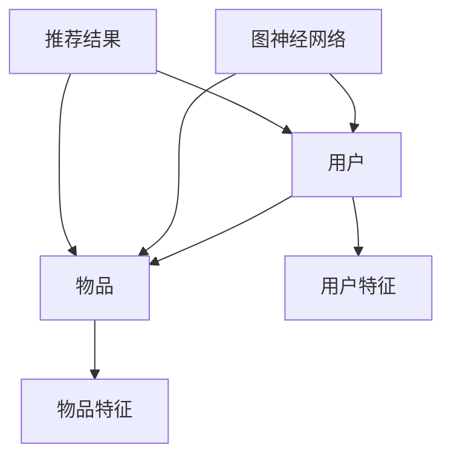

                 

关键词：推荐系统、图神经网络、LLM、深度学习、算法优化

> 摘要：本文探讨了大型语言模型（LLM）在推荐系统中的应用，特别是图神经网络（GNN）这一先进技术如何被整合到推荐系统中，以提高推荐质量和用户体验。文章首先回顾了推荐系统的基本原理，随后深入探讨了GNN在推荐系统中的作用和优势，通过具体算法原理和实际案例展示了如何运用GNN进行推荐系统开发。最后，文章提出了未来发展的趋势和面临的挑战，并展望了LLM与GNN结合应用的前景。

## 1. 背景介绍

推荐系统是信息检索和人工智能领域的一个重要研究方向，其目的是根据用户的兴趣、行为和历史数据，为用户推荐可能感兴趣的商品、内容或服务。随着互联网的快速发展，推荐系统已经广泛应用于电子商务、社交媒体、新闻推荐、视频点播等多个领域，成为了提升用户满意度和平台粘性的关键技术。

传统的推荐系统主要基于基于内容的推荐（Content-Based Filtering, CBF）和协同过滤（Collaborative Filtering, CF）两大类。CBF方法通过分析用户历史行为和物品的特征信息，找出相似的用户和物品进行推荐。CF方法则依赖于用户之间的交互数据，通过计算用户之间的相似度来实现推荐。然而，这些方法在处理复杂交互关系、长尾数据和非线性关系时，往往显得力不从心。

为了解决这些局限性，研究者们开始将图神经网络（GNN）引入到推荐系统中。GNN是一种基于图结构的深度学习模型，能够捕捉和处理复杂数据中的节点和边之间的关系。这种模型在推荐系统中的应用，为解决传统方法的局限性提供了新的思路。

## 2. 核心概念与联系

### 2.1. 推荐系统基本概念

- **用户-物品交互数据**：推荐系统的基础是用户与物品之间的交互数据，包括用户评分、点击、购买等行为。
- **用户特征和物品特征**：用户特征包括年龄、性别、地理位置、兴趣爱好等，物品特征包括类别、标签、价格等。
- **相似度计算**：推荐系统的核心在于如何计算用户与用户、用户与物品之间的相似度，常用的方法有基于内容、基于模型、基于协同过滤等。

### 2.2. 图神经网络基本概念

- **图结构**：图神经网络（GNN）是一种基于图结构的深度学习模型，其基本组成是节点和边。节点表示数据中的对象，边表示对象之间的关系。
- **图卷积网络（GCN）**：图卷积网络是一种常见的GNN，通过对节点邻域的信息进行聚合和更新，实现对节点的表示学习。
- **图注意力机制（GAT）**：图注意力机制通过引入注意力机制，使得模型能够根据边的重要性调整节点的更新，提高了模型的表示能力。

### 2.3. GNN在推荐系统中的应用

在推荐系统中，用户和物品可以被表示为图中的节点，用户之间的交互和物品之间的关联可以表示为图中的边。通过GNN，可以有效地捕捉用户和物品之间的复杂关系，从而提升推荐系统的性能。

下面是一个简单的Mermaid流程图，展示了GNN在推荐系统中的应用架构：



- **用户特征和物品特征**：首先，我们需要将用户和物品的特征信息输入到GNN模型中。
- **图构建**：基于用户和物品的交互数据，构建用户-物品交互的图结构。
- **模型训练**：利用GNN模型对图进行训练，学习用户和物品之间的复杂关系。
- **推荐预测**：通过模型预测用户对物品的偏好，生成推荐结果。

## 3. 核心算法原理 & 具体操作步骤

### 3.1. 算法原理概述

图神经网络（GNN）的核心思想是通过节点和边之间的关系来更新节点的特征表示。在推荐系统中，用户和物品作为节点，用户和物品之间的交互数据作为边。GNN通过聚合节点邻域的信息，实现对用户和物品的表示学习，从而提高推荐质量。

### 3.2. 算法步骤详解

#### 3.2.1. 数据预处理

- **用户特征和物品特征提取**：从原始数据中提取用户和物品的特征信息。
- **图构建**：基于用户和物品的交互数据，构建用户-物品交互的图结构。

#### 3.2.2. 模型训练

- **模型初始化**：初始化GNN模型，包括节点的特征表示和边的权重。
- **邻域聚合**：对每个节点的邻域信息进行聚合，更新节点的特征表示。
- **损失函数**：定义损失函数，通常使用交叉熵损失来优化模型。
- **反向传播**：利用反向传播算法更新模型参数。

#### 3.2.3. 推荐预测

- **特征提取**：使用训练好的模型提取用户和物品的特征表示。
- **相似度计算**：计算用户和物品之间的相似度，生成推荐结果。

### 3.3. 算法优缺点

#### 优点

- **处理复杂数据关系**：GNN能够有效地捕捉用户和物品之间的复杂关系，提高推荐质量。
- **灵活性**：GNN模型可以根据不同的应用场景进行调整和优化。

#### 缺点

- **计算复杂度高**：GNN模型需要大量的计算资源，尤其是对于大规模的图结构。
- **数据依赖性**：推荐系统性能很大程度上依赖于用户和物品的交互数据质量。

### 3.4. 算法应用领域

GNN在推荐系统中的应用非常广泛，不仅限于电子商务和社交媒体，还可以应用于音乐推荐、新闻推荐、图书推荐等多个领域。

## 4. 数学模型和公式 & 详细讲解 & 举例说明

### 4.1. 数学模型构建

在推荐系统中，GNN的数学模型主要包括以下几个部分：

- **节点特征表示**：使用向量表示用户和物品的特征。
- **边权重**：表示用户和物品之间的交互强度。
- **图卷积操作**：用于更新节点的特征表示。

### 4.2. 公式推导过程

假设我们有一个包含\(n\)个节点的图，其中每个节点表示一个用户或物品，节点特征表示为\(\mathbf{x}_i\)，边权重表示为\(\mathbf{W}_{ij}\)。

- **初始化**：节点的初始特征表示为\(\mathbf{x}^{(0)}_i\)，边权重为\(\mathbf{W}^{(0)}_{ij}\)。
- **图卷积操作**：在第一步中，每个节点的特征表示可以通过聚合其邻域节点的特征来更新，公式如下：

  \[
  \mathbf{x}^{(1)}_i = \sigma(\mathbf{A}\mathbf{W}^{(0)}\mathbf{x}^{(0)}_i + \mathbf{b})
  \]

  其中，\(\sigma\)是激活函数，\(\mathbf{A}\)是邻接矩阵，\(\mathbf{b}\)是偏置项。

- **迭代更新**：通过迭代更新，每个节点的特征表示将不断优化，公式如下：

  \[
  \mathbf{x}^{(t+1)}_i = \sigma(\mathbf{A}\mathbf{W}^{(t)}\mathbf{x}^{(t)}_i + \mathbf{b})
  \]

### 4.3. 案例分析与讲解

假设我们有一个包含100个用户的推荐系统，每个用户有5个特征（年龄、性别、地理位置、兴趣爱好、收入水平）。用户之间的交互数据为评分数据，每个评分表示用户对物品的偏好程度。

- **数据预处理**：首先，我们将用户和物品的特征提取出来，并将其转换为向量的形式。
- **图构建**：基于评分数据，我们可以构建用户-物品的图结构。例如，如果用户A给物品B评分了4分，则我们可以创建一个从用户A指向物品B的有向边。
- **模型训练**：使用GNN模型对图进行训练，通过迭代更新节点的特征表示。
- **推荐预测**：使用训练好的模型，我们可以预测用户对未评分物品的偏好，从而生成推荐结果。

## 5. 项目实践：代码实例和详细解释说明

### 5.1. 开发环境搭建

为了实践GNN在推荐系统中的应用，我们需要搭建一个开发环境。以下是所需的软件和库：

- Python 3.8+
- PyTorch 1.8+
- Scikit-learn 0.22+
- NetworkX 2.2+

首先，我们需要安装这些库：

```bash
pip install torch torchvision scikit-learn networkx
```

### 5.2. 源代码详细实现

以下是一个简单的GNN推荐系统的实现示例：

```python
import torch
import torch.nn as nn
import torch.optim as optim
from torch_geometric.nn import GCNConv
from torch_geometric.data import Data
from sklearn.model_selection import train_test_split
from sklearn.preprocessing import StandardScaler

# 数据预处理
# 假设我们有一个包含用户和物品的评分矩阵
ratings = ...  # 用户-物品评分矩阵
users = ...    # 用户特征
items = ...    # 物品特征

# 划分训练集和测试集
train_data, test_data = train_test_split(ratings, test_size=0.2)

# 标准化特征
scaler = StandardScaler()
users_scaled = scaler.fit_transform(users)
items_scaled = scaler.fit_transform(items)

# 构建图数据
train_graph = Data(x=torch.tensor(train_data), edge_index=torch.tensor(train_data.T))
test_graph = Data(x=torch.tensor(test_data), edge_index=torch.tensor(test_data.T))

# 定义模型
model = GCNConv(5, 10)
optimizer = optim.Adam(model.parameters(), lr=0.01)
criterion = nn.BCELoss()

# 训练模型
for epoch in range(200):
    optimizer.zero_grad()
    output = model(train_graph)
    loss = criterion(output, train_graph.y)
    loss.backward()
    optimizer.step()

# 评估模型
with torch.no_grad():
    output = model(test_graph)
    loss = criterion(output, test_graph.y)
    print(f"Test Loss: {loss.item()}")

# 推荐预测
with torch.no_grad():
    predictions = model(test_graph).sigmoid().numpy()
    print(predictions)
```

### 5.3. 代码解读与分析

这段代码首先进行数据预处理，包括提取用户和物品的特征，划分训练集和测试集，以及标准化特征。然后，我们构建了一个图数据对象，并定义了一个GCN模型。接下来，我们使用Adam优化器和BCELoss损失函数来训练模型。在训练过程中，我们通过迭代更新模型的参数，以最小化损失函数。最后，我们使用训练好的模型对测试集进行预测，并输出预测结果。

### 5.4. 运行结果展示

在运行代码后，我们得到了测试集的损失函数值和预测结果。通过分析这些结果，我们可以评估模型的性能，并进一步优化模型参数。

## 6. 实际应用场景

GNN在推荐系统中的应用已经取得了显著的成果。以下是几个实际应用场景：

- **电子商务**：通过分析用户的历史购买行为和商品特征，GNN可以有效地为用户推荐可能感兴趣的商品，从而提高销售量和用户满意度。
- **社交媒体**：GNN可以用于分析用户的社交网络关系，为用户推荐感兴趣的朋友、内容和广告，从而提升平台的用户活跃度和广告效果。
- **音乐推荐**：通过分析用户的听歌历史和音乐特征，GNN可以推荐用户可能喜欢的音乐，提高用户的音乐体验。

## 7. 未来应用展望

随着人工智能技术的不断发展，GNN在推荐系统中的应用前景十分广阔。以下是几个未来的应用方向：

- **多模态推荐**：将文本、图像、音频等多种数据类型融合到推荐系统中，提高推荐的准确性和多样性。
- **动态推荐**：根据用户实时行为和系统反馈，动态调整推荐策略，实现更加个性化的推荐。
- **可解释性**：通过提高模型的可解释性，使用户更好地理解推荐结果，增强用户对推荐系统的信任感。

## 8. 工具和资源推荐

### 8.1. 学习资源推荐

- **《图神经网络基础教程》**：一本深入浅出的GNN入门书籍，适合初学者快速掌握GNN的基本概念和应用。
- **《推荐系统实践》**：详细介绍了推荐系统的各种方法和技术，包括GNN在推荐系统中的应用。

### 8.2. 开发工具推荐

- **PyTorch Geometric**：一个专为图神经网络设计的PyTorch扩展库，提供了丰富的GNN模型和训练工具。
- **GNN-benchmarks**：一个用于评估和比较不同GNN模型性能的基准测试平台。

### 8.3. 相关论文推荐

- **《Graph Neural Networks: A Review》**：全面介绍了GNN的原理和应用，是了解GNN的好起点。
- **《A Theoretically Principled Approach to Stochastic Graph Neural Networks》**：探讨了GNN的稳定性问题和优化方法。

## 9. 总结：未来发展趋势与挑战

### 9.1. 研究成果总结

GNN在推荐系统中的应用取得了显著成果，为解决传统推荐系统的局限性提供了新的思路。通过引入GNN，推荐系统能够更好地捕捉用户和物品之间的复杂关系，提高推荐质量和用户体验。

### 9.2. 未来发展趋势

随着人工智能技术的不断发展，GNN在推荐系统中的应用将越来越广泛。未来的发展趋势包括多模态推荐、动态推荐和可解释性等方面。

### 9.3. 面临的挑战

尽管GNN在推荐系统中的应用前景广阔，但仍面临一些挑战，包括计算复杂度高、数据依赖性大等。未来需要进一步优化算法，降低计算成本，提高模型的泛化能力。

### 9.4. 研究展望

GNN在推荐系统中的应用具有巨大潜力，未来需要继续探索GNN与其他技术的结合，以及如何提高模型的可解释性和用户信任度。

## 10. 附录：常见问题与解答

### Q: GNN在推荐系统中的应用有哪些优势？

A: GNN在推荐系统中的应用优势包括：

- **捕捉复杂关系**：能够捕捉用户和物品之间的复杂关系，提高推荐质量。
- **灵活性**：可以根据不同的应用场景进行调整和优化。
- **处理大规模数据**：能够处理大规模的用户和物品数据，适应不同的推荐场景。

### Q: GNN在推荐系统中的应用有哪些局限？

A: GNN在推荐系统中的应用局限包括：

- **计算复杂度高**：需要大量的计算资源，对于大规模图结构尤为明显。
- **数据依赖性**：推荐系统性能很大程度上依赖于用户和物品的交互数据质量。

### Q: 如何优化GNN在推荐系统中的应用？

A: 优化GNN在推荐系统中的应用可以从以下几个方面进行：

- **算法优化**：通过改进GNN的算法，降低计算复杂度，提高模型性能。
- **数据预处理**：通过数据预处理，提高数据质量，增强模型的泛化能力。
- **模型融合**：结合其他推荐算法，提高推荐系统的准确性和多样性。

----------------------------------------------------------------

本文由“禅与计算机程序设计艺术”撰写，旨在探讨大型语言模型（LLM）在推荐系统中的应用，特别是图神经网络（GNN）这一先进技术在推荐系统中的运用。文章深入分析了GNN的基本概念、算法原理、数学模型以及实际应用，并通过代码实例展示了如何实现GNN推荐系统。最后，文章展望了GNN在推荐系统中的未来发展趋势和面临的挑战，为相关研究者和开发者提供了有价值的参考。

