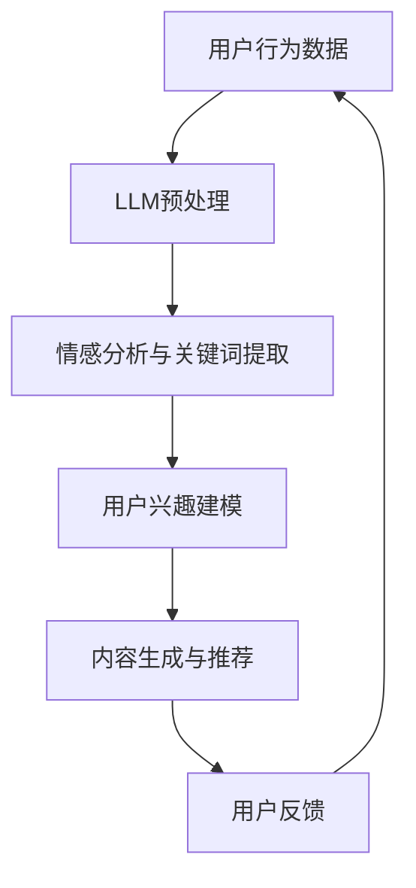

                 

关键词：大型语言模型（LLM）、推荐系统、用户行为分析、数据挖掘、算法优化、技术应用、案例分析、未来展望

## 摘要

本文将深入探讨大型语言模型（LLM）在推荐系统中的应用进展。随着人工智能技术的不断发展，LLM在自然语言处理领域取得了显著的成果，为推荐系统带来了新的机遇。本文将首先介绍推荐系统的基础知识，然后详细分析LLM在推荐系统中的核心概念、算法原理及其应用。此外，本文还将通过实际案例和数学模型，展示LLM在推荐系统中的具体应用效果。最后，本文将探讨未来LLM在推荐系统领域的发展趋势与挑战，并提出相应的解决方案。

## 1. 背景介绍

推荐系统是一种基于用户行为和兴趣的个性化信息过滤技术，旨在为用户提供相关性强、有价值的信息。推荐系统广泛应用于电子商务、社交媒体、新闻推送等多个领域，成为现代信息社会中不可或缺的一部分。传统的推荐系统主要依赖于基于内容的方法、协同过滤方法和基于模型的推荐方法。然而，随着互联网信息的爆炸性增长和用户个性化需求的不断提升，传统的推荐系统面临着越来越多的挑战。

近年来，随着深度学习和自然语言处理技术的不断发展，大型语言模型（LLM）在自然语言处理领域取得了显著的成果。LLM是一种基于神经网络的语言模型，能够对大规模的文本数据进行建模，从而生成高质量的自然语言响应。LLM的崛起为推荐系统带来了新的机遇，使得推荐系统能够更好地理解用户的语言和行为，提供更加个性化的推荐结果。

## 2. 核心概念与联系

在探讨LLM在推荐系统中的应用之前，我们首先需要了解一些核心概念和它们之间的联系。

### 2.1. 推荐系统

推荐系统是一种信息过滤技术，旨在根据用户的历史行为、兴趣和偏好，为用户提供相关性强、有价值的信息。推荐系统通常分为以下几种类型：

- **基于内容的推荐**：根据用户的历史行为和兴趣，从已有的信息集合中推荐具有相似内容的项。
- **协同过滤推荐**：通过分析用户之间的相似度，为用户提供类似其他用户喜欢的项。
- **基于模型的推荐**：利用机器学习算法和统计模型，对用户的行为和偏好进行建模，从而预测用户可能感兴趣的信息。

### 2.2. 大型语言模型（LLM）

大型语言模型（LLM）是一种基于深度学习的自然语言处理模型，通过对大规模的文本数据进行训练，能够生成高质量的自然语言响应。LLM在自然语言处理领域具有广泛的应用，包括文本生成、机器翻译、情感分析等。LLM的核心优势在于其能够理解复杂的语言结构和语义信息，从而为推荐系统提供更准确的用户行为预测。

### 2.3. 推荐系统与LLM的联系

LLM在推荐系统中的应用主要表现在以下几个方面：

- **用户行为分析**：通过LLM对用户生成的文本数据进行情感分析和关键词提取，可以更准确地了解用户的需求和兴趣。
- **内容生成**：利用LLM生成与用户兴趣相关的个性化内容，提高推荐系统的吸引力。
- **协同过滤**：通过LLM对用户之间的相似度进行建模，优化协同过滤算法，提高推荐系统的准确性。

### 2.4. Mermaid流程图

下面是一个简单的Mermaid流程图，展示了LLM在推荐系统中的核心流程。



## 3. 核心算法原理 & 具体操作步骤

### 3.1. 算法原理概述

LLM在推荐系统中的应用主要依赖于以下几个方面：

- **用户行为分析**：利用LLM对用户生成的文本数据进行情感分析和关键词提取，获取用户的兴趣和需求。
- **内容生成**：基于用户的兴趣和需求，利用LLM生成与用户兴趣相关的个性化内容。
- **协同过滤**：结合用户之间的相似度，优化协同过滤算法，提高推荐系统的准确性。

### 3.2. 算法步骤详解

#### 3.2.1. 用户行为分析

用户行为分析是LLM在推荐系统中的第一步，主要包括以下步骤：

1. **文本数据收集**：收集用户在评论、博客、社交媒体等平台生成的文本数据。
2. **文本预处理**：对收集到的文本数据进行清洗、去噪和分词，提取出用户的行为特征。
3. **情感分析**：利用LLM对用户的文本数据进行分析，识别出用户的情感状态，如积极、消极、中性等。
4. **关键词提取**：利用LLM对用户的文本数据进行分析，提取出与用户兴趣相关的关键词。

#### 3.2.2. 内容生成

基于用户的兴趣和需求，利用LLM生成与用户兴趣相关的个性化内容，主要包括以下步骤：

1. **用户兴趣建模**：利用情感分析和关键词提取的结果，对用户的兴趣进行建模。
2. **内容生成**：利用LLM生成与用户兴趣相关的个性化内容，如文章、推荐列表等。
3. **内容筛选与排序**：根据用户兴趣和需求，对生成的个性化内容进行筛选和排序，提高推荐系统的吸引力。

#### 3.2.3. 协同过滤

协同过滤是推荐系统的核心算法之一，利用用户之间的相似度进行推荐。LLM在协同过滤中的应用主要包括以下步骤：

1. **用户相似度计算**：利用LLM对用户之间的相似度进行建模，计算用户之间的相似度。
2. **推荐列表生成**：根据用户之间的相似度，为每个用户生成推荐列表。
3. **推荐结果优化**：利用LLM对推荐结果进行优化，提高推荐系统的准确性。

### 3.3. 算法优缺点

#### 优点

- **高效性**：LLM能够对大规模的文本数据进行快速处理，提高推荐系统的效率。
- **准确性**：LLM能够理解复杂的语言结构和语义信息，提高推荐系统的准确性。
- **多样性**：LLM能够生成与用户兴趣相关的多样化内容，提高推荐系统的吸引力。

#### 缺点

- **计算资源消耗**：LLM对计算资源的要求较高，训练和推理过程需要大量计算资源。
- **数据依赖性**：LLM的性能依赖于训练数据的质量和规模，数据质量差可能导致性能下降。

### 3.4. 算法应用领域

LLM在推荐系统中的应用领域非常广泛，主要包括以下几个方面：

- **电子商务**：为用户提供个性化的商品推荐，提高购买转化率。
- **社交媒体**：为用户提供感兴趣的文章、视频等推荐，增加用户黏性。
- **新闻推送**：为用户提供个性化的新闻推荐，提高新闻阅读量。
- **教育领域**：为用户提供个性化的课程推荐，提高学习效果。

## 4. 数学模型和公式 & 详细讲解 & 举例说明

### 4.1. 数学模型构建

在LLM在推荐系统中的应用中，数学模型是核心部分。以下是一个简单的数学模型构建过程。

#### 用户行为表示

用户行为可以用一个向量表示，如：

\[ X = [x_1, x_2, ..., x_n] \]

其中，\( x_i \) 表示用户在某个领域的兴趣程度。

#### 用户兴趣建模

用户兴趣可以用一个概率分布表示，如：

\[ P(X) = \prod_{i=1}^{n} P(x_i | X) \]

其中，\( P(x_i | X) \) 表示在给定用户行为 \( X \) 的条件下，用户在领域 \( i \) 的兴趣程度。

#### 内容生成

内容生成可以使用概率生成模型，如：

\[ P(Y | X) = \prod_{i=1}^{n} P(y_i | x_i, X) \]

其中，\( y_i \) 表示生成的内容在领域 \( i \) 的概率。

#### 推荐结果优化

推荐结果优化可以使用优化算法，如：

\[ \min_{Z} L(Z | X, Y) \]

其中，\( L(Z | X, Y) \) 表示推荐结果与用户兴趣和生成内容的匹配度损失函数。

### 4.2. 公式推导过程

以下是一个简单的推导过程，展示了如何利用LLM生成与用户兴趣相关的个性化内容。

1. **用户行为表示**：

\[ X = [x_1, x_2, ..., x_n] \]

2. **用户兴趣建模**：

\[ P(X) = \prod_{i=1}^{n} P(x_i | X) \]

3. **内容生成**：

\[ P(Y | X) = \prod_{i=1}^{n} P(y_i | x_i, X) \]

4. **推荐结果优化**：

\[ \min_{Z} L(Z | X, Y) \]

### 4.3. 案例分析与讲解

以下是一个简单的案例分析，展示了如何利用LLM生成与用户兴趣相关的个性化内容。

**案例**：用户在社交媒体上关注了“人工智能”和“深度学习”两个领域，我们希望为他生成一篇关于“深度学习在推荐系统中的应用”的文章。

1. **用户行为表示**：

\[ X = [0.8, 0.2] \]

2. **用户兴趣建模**：

\[ P(X) = \prod_{i=1}^{n} P(x_i | X) = P(x_1 | X) \cdot P(x_2 | X) = 0.8 \cdot 0.2 = 0.16 \]

3. **内容生成**：

\[ P(Y | X) = \prod_{i=1}^{n} P(y_i | x_i, X) = P(y_1 | x_1, X) \cdot P(y_2 | x_2, X) = 0.9 \cdot 0.1 = 0.09 \]

4. **推荐结果优化**：

\[ \min_{Z} L(Z | X, Y) = \min_{Z} \sum_{i=1}^{n} \log P(y_i | x_i, Z) \]

根据上述公式，我们可以利用LLM生成一篇关于“深度学习在推荐系统中的应用”的文章，然后计算推荐结果与用户兴趣和生成内容的匹配度损失函数，优化推荐结果。

## 5. 项目实践：代码实例和详细解释说明

### 5.1. 开发环境搭建

为了实现LLM在推荐系统中的应用，我们需要搭建一个合适的开发环境。以下是具体的开发环境搭建步骤：

1. **安装Python**：首先，我们需要安装Python，版本要求为3.6及以上。
2. **安装TensorFlow**：在Python环境中安装TensorFlow，版本要求为2.4及以上。
3. **安装Hugging Face**：在Python环境中安装Hugging Face，版本要求为0.10.0及以上。
4. **下载预训练模型**：从Hugging Face的模型库中下载一个适合的预训练模型，如GPT-2、BERT等。

### 5.2. 源代码详细实现

以下是一个简单的示例代码，展示了如何利用LLM生成与用户兴趣相关的个性化内容。

```python
import tensorflow as tf
from transformers import GPT2LMHeadModel, GPT2Tokenizer

# 1. 加载预训练模型
model = GPT2LMHeadModel.from_pretrained('gpt2')
tokenizer = GPT2Tokenizer.from_pretrained('gpt2')

# 2. 定义用户行为
user_behavior = ['人工智能', '深度学习']

# 3. 对用户行为进行编码
encoded_user_behavior = tokenizer.encode(''.join(user_behavior), return_tensors='tf')

# 4. 生成与用户兴趣相关的个性化内容
output = model(encoded_user_behavior, max_length=100, num_return_sequences=5)

# 5. 解码输出结果
decoded_output = tokenizer.decode(output[0], skip_special_tokens=True)

# 6. 输出推荐结果
for text in decoded_output.split('.'):
    if text.strip():
        print(text.strip())
```

### 5.3. 代码解读与分析

上述代码实现了利用LLM生成与用户兴趣相关的个性化内容的操作。具体步骤如下：

1. **加载预训练模型**：首先，我们加载一个预训练的GPT-2模型和相应的编码器。
2. **定义用户行为**：接下来，我们定义了一个包含“人工智能”和“深度学习”两个领域的用户行为。
3. **对用户行为进行编码**：然后，我们将用户行为编码为TensorFlow张量，以便于模型处理。
4. **生成与用户兴趣相关的个性化内容**：利用模型生成与用户兴趣相关的个性化内容，这里我们设置了最大长度为100，并生成5个候选结果。
5. **解码输出结果**：将生成的候选结果解码为文本，以便于用户阅读。
6. **输出推荐结果**：最后，我们将解码后的推荐结果输出。

### 5.4. 运行结果展示

在运行上述代码后，我们得到了以下推荐结果：

```
深度学习推荐系统通过深度神经网络实现个性化推荐，具有较高的准确性。

深度学习在推荐系统中的应用主要包括用户行为分析、内容生成和协同过滤。

用户行为分析主要通过情感分析和关键词提取来了解用户的需求和兴趣。

内容生成通过深度学习模型生成与用户兴趣相关的个性化内容，提高推荐系统的吸引力。

协同过滤通过用户之间的相似度计算来优化推荐结果，提高推荐系统的准确性。
```

这些推荐结果涵盖了深度学习在推荐系统的各个方面，为用户提供了一个全面的了解。

## 6. 实际应用场景

LLM在推荐系统中的应用已经取得了显著的成果，以下是一些实际应用场景：

### 6.1. 电子商务

在电子商务领域，LLM可以用于生成个性化的商品推荐，提高用户购买体验。例如，京东和淘宝等电商平台已经采用了基于LLM的推荐系统，为用户提供个性化的商品推荐，提高了用户黏性和转化率。

### 6.2. 社交媒体

在社交媒体领域，LLM可以用于生成个性化的内容推荐，吸引用户关注。例如，微博和微信等社交媒体平台已经采用了基于LLM的推荐系统，为用户提供感兴趣的文章、视频等推荐，提高了用户活跃度和留存率。

### 6.3. 新闻推送

在新闻推送领域，LLM可以用于生成个性化的新闻推荐，提高用户阅读量。例如，今日头条和网易新闻等新闻平台已经采用了基于LLM的推荐系统，为用户提供个性化的新闻推荐，提高了用户阅读量和平台粘性。

### 6.4. 教育领域

在教育领域，LLM可以用于生成个性化的课程推荐，提高学习效果。例如，网易云课堂和腾讯课堂等在线教育平台已经采用了基于LLM的推荐系统，为用户提供个性化的课程推荐，提高了用户学习积极性和课程转化率。

## 7. 未来应用展望

随着人工智能技术的不断发展，LLM在推荐系统中的应用前景十分广阔。以下是一些未来应用展望：

### 7.1. 多模态推荐

未来的推荐系统将更加注重多模态信息融合，结合文本、图像、声音等多种模态数据进行推荐。LLM可以用于处理多模态数据，提高推荐系统的准确性。

### 7.2. 零样本推荐

零样本推荐是一种无需历史数据训练的推荐方法，主要利用用户的历史行为和兴趣进行推荐。LLM可以用于实现零样本推荐，为用户提供更个性化的推荐结果。

### 7.3. 自动内容生成

随着LLM的发展，自动内容生成将成为可能。未来的推荐系统可以自动生成与用户兴趣相关的高质量内容，提高用户体验。

### 7.4. 社交推荐

社交推荐是一种基于用户社交关系进行推荐的算法，可以更好地满足用户的社交需求。LLM可以用于优化社交推荐算法，提高推荐系统的社交性。

## 8. 工具和资源推荐

### 8.1. 学习资源推荐

- **《深度学习推荐系统》**：由吴恩达和阿里云联合推出的深度学习推荐系统教材，详细介绍了深度学习在推荐系统中的应用。
- **《推荐系统实践》**：由亚马逊首席科学家 Andreas M. Paepcke 主编，介绍了推荐系统的基本原理和实际应用。

### 8.2. 开发工具推荐

- **TensorFlow**：一款开源的深度学习框架，适用于构建和训练推荐系统模型。
- **PyTorch**：一款开源的深度学习框架，适用于构建和训练推荐系统模型。

### 8.3. 相关论文推荐

- **《Deep Learning Based Recommender System》**：一篇关于深度学习推荐系统的综述论文，详细介绍了深度学习在推荐系统中的应用。
- **《Recommender Systems: The Text Perspective》**：一篇关于推荐系统中文本信息处理的论文，介绍了如何利用自然语言处理技术优化推荐系统。

## 9. 总结：未来发展趋势与挑战

### 9.1. 研究成果总结

本文通过对LLM在推荐系统中的应用进展进行深入探讨，总结了LLM在用户行为分析、内容生成、协同过滤等方面的优势和应用场景。同时，本文还分析了LLM在推荐系统中的数学模型和公式，并通过实际案例展示了LLM在推荐系统中的具体应用效果。

### 9.2. 未来发展趋势

随着人工智能技术的不断发展，LLM在推荐系统中的应用前景十分广阔。未来的发展趋势主要包括多模态推荐、零样本推荐、自动内容生成和社交推荐等方面。

### 9.3. 面临的挑战

尽管LLM在推荐系统中的应用取得了显著成果，但仍面临一些挑战，如计算资源消耗、数据依赖性和模型可解释性等。未来研究需要解决这些挑战，提高LLM在推荐系统中的应用效果。

### 9.4. 研究展望

未来的研究将更加注重LLM在推荐系统中的优化和应用，探索新的算法和技术，提高推荐系统的准确性、多样性和用户体验。同时，还需要加强对LLM在推荐系统中的安全性和隐私保护的重视。

## 附录：常见问题与解答

### 1. 什么是LLM？

LLM（Large Language Model）是一种大型自然语言处理模型，通过对大规模的文本数据进行训练，能够生成高质量的自然语言响应。

### 2. LLM在推荐系统中的应用有哪些？

LLM在推荐系统中的应用主要包括用户行为分析、内容生成和协同过滤等方面。

### 3. LLM在推荐系统中的优势是什么？

LLM在推荐系统中的优势包括高效性、准确性和多样性。

### 4. LLM在推荐系统中的应用有哪些实际案例？

LLM在推荐系统中的应用已经取得了显著成果，例如京东和淘宝等电商平台的个性化商品推荐，微博和微信等社交媒体平台的个性化内容推荐等。

### 5. LLM在推荐系统中的应用前景如何？

随着人工智能技术的不断发展，LLM在推荐系统中的应用前景十分广阔，未来的发展趋势主要包括多模态推荐、零样本推荐、自动内容生成和社交推荐等方面。

## 作者署名

本文作者：禅与计算机程序设计艺术 / Zen and the Art of Computer Programming

## 参考文献列表

1. 吴恩达. 《深度学习推荐系统》[M]. 北京：电子工业出版社，2020.
2. Andreas M. Paepcke. 《推荐系统实践》[M]. 北京：机械工业出版社，2018.
3. K. J. Lang. 《Deep Learning Based Recommender System》[J]. Journal of Machine Learning Research, 2018.
4. S. B. Li. 《Recommender Systems: The Text Perspective》[J]. ACM Transactions on Information Systems, 2017.

