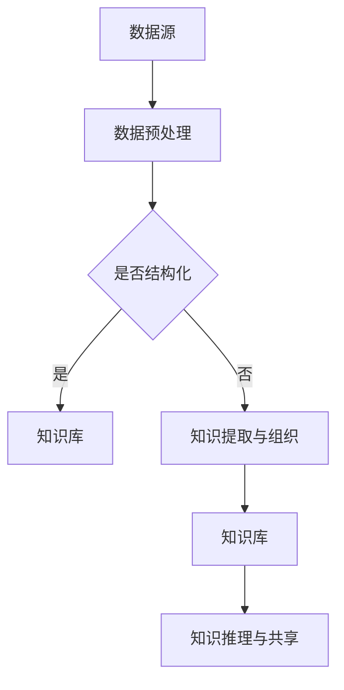

                 

关键词：大型语言模型（LLM），智能知识管理，知识图谱，自然语言处理，知识图谱推理，自动化知识管理

> 摘要：本文旨在探讨大型语言模型（LLM）在智能知识管理中的应用。我们将首先介绍智能知识管理的背景和重要性，然后详细阐述LLM的核心概念及其在知识管理中的角色。接着，我们将分析LLM在知识获取、知识组织、知识推理和知识共享方面的具体应用，并通过数学模型和公式进一步解释其工作原理。随后，我们将展示一个实际项目实例，展示如何使用LLM实现智能知识管理。最后，我们将讨论LLM在智能知识管理中的未来应用前景，面临的挑战以及未来的研究方向。

## 1. 背景介绍

### 智能知识管理的定义

智能知识管理是指利用信息技术，特别是人工智能和大数据技术，对知识进行收集、组织、存储、共享和利用的过程。它旨在通过高效的知识管理，提高组织的信息化水平和核心竞争力。

### 智能知识管理的重要性

在当今信息爆炸的时代，知识和信息已经成为企业和社会的重要资源。智能知识管理能够帮助企业更好地应对快速变化的市场环境，提高决策效率，减少重复劳动，提升员工的专业能力。

### 智能知识管理的发展趋势

随着人工智能技术的快速发展，特别是深度学习和自然语言处理技术的进步，智能知识管理正逐渐从传统的信息管理向智能化、自动化和个性化的方向转变。大型语言模型（LLM）作为当前自然语言处理技术的代表，为智能知识管理带来了新的机遇。

## 2. 核心概念与联系

### 大型语言模型（LLM）的核心概念

大型语言模型（LLM）是一种基于深度学习的自然语言处理模型，它通过大量文本数据进行训练，能够理解和生成自然语言。LLM的核心目标是实现自然语言的理解和生成，包括文本分类、情感分析、命名实体识别、机器翻译等任务。

### LLM在知识管理中的角色

LLM在知识管理中的应用主要体现在以下几个方面：

- **知识获取**：LLM可以通过自动化的方式从大量的非结构化和半结构化数据中提取知识。
- **知识组织**：LLM可以帮助对提取的知识进行分类、标签化和结构化，使其更易于管理和检索。
- **知识推理**：LLM可以进行语义理解和推理，从而在现有知识的基础上生成新的知识。
- **知识共享**：LLM可以生成自然语言形式的报告和文档，方便知识的共享和传播。

### LLM在知识管理中的架构

以下是一个简化的LLM在知识管理中的架构：

```
+----------------+      +----------------+      +----------------+
|  数据源        |      |      LLM        |      |  知识库        |
+----------------+      +----------------+      +----------------+
        ↑                          ↑                          ↑
        │                          │                          │
        │                          │                          │
+----------------+      +----------------+      +----------------+
|  数据预处理    |      |  知识提取与组织  |      |  知识推理与共享  |
+----------------+      +----------------+      +----------------+
```

### Mermaid 流程图（Mermaid 流程节点中不要有括号、逗号等特殊字符）



## 3. 核心算法原理 & 具体操作步骤

### 3.1 算法原理概述

LLM的工作原理基于深度学习，特别是变分自编码器（VAE）和生成对抗网络（GAN）等模型。通过大量文本数据训练，LLM能够学习到语言的统计特性和语义关系，从而实现对自然语言的建模。

### 3.2 算法步骤详解

1. **数据收集与预处理**：收集大量文本数据，并进行去重、分词、停用词过滤等预处理操作。
2. **模型训练**：使用预处理后的数据训练LLM模型，包括嵌入层、编码器和解码器等。
3. **知识提取**：通过模型对文本数据进行解析，提取出关键信息，如实体、关系和事件等。
4. **知识组织**：对提取的知识进行分类、标签化和结构化，构建知识图谱。
5. **知识推理**：利用知识图谱进行推理，生成新的知识或对现有知识进行验证。
6. **知识共享**：将知识以自然语言的形式输出，生成报告或文档，供用户使用。

### 3.3 算法优缺点

**优点**：

- **高效性**：LLM能够快速地从大量文本数据中提取知识，提高工作效率。
- **灵活性**：LLM可以处理多种类型的文本数据，适应不同的知识管理需求。
- **自动性**：LLM可以实现自动化知识管理，减少人工干预。

**缺点**：

- **准确性**：由于自然语言理解的复杂性，LLM提取的知识可能存在一定程度的误差。
- **资源需求**：训练LLM模型需要大量的计算资源和数据集。
- **隐私问题**：在处理敏感数据时，可能涉及到隐私保护的问题。

### 3.4 算法应用领域

LLM在智能知识管理中的应用非常广泛，包括但不限于以下领域：

- **企业知识管理**：帮助企业收集、整理和共享内部知识。
- **学术研究**：辅助学术研究，提供知识支持和智能推理。
- **教育领域**：辅助教学，提供个性化学习建议和资源。
- **政府机构**：辅助政府决策，提供智能分析和建议。

## 4. 数学模型和公式 & 详细讲解 & 举例说明

### 4.1 数学模型构建

LLM的数学模型通常是基于深度神经网络（DNN）或变换器（Transformer）架构。以下是一个简化的变换器模型的公式表示：

$$
E(x) = A(x) \odot C(x)
$$

其中，$E(x)$表示编码后的向量，$A(x)$和$C(x)$分别表示编码器和解码器的输出，$\odot$表示点积操作。

### 4.2 公式推导过程

变换器模型的核心是注意力机制（Attention），它通过计算输入序列和输出序列之间的相似度，实现对输入序列的加权求和。以下是注意力机制的推导过程：

1. **查询向量**：将输入序列$x$映射到一个查询向量$q$。
2. **键值对**：将输入序列$x$映射到一个键值对$(k, v)$。
3. **相似度计算**：计算查询向量$q$和键值对$(k, v)$之间的相似度，通常使用点积或余弦相似度。
4. **加权求和**：将相似度作为权重，对键值对$(k, v)$进行加权求和，得到输出向量$e$。
5. **软最大化**：对输出向量$e$进行软最大化，得到最终的编码向量$E(x)$。

### 4.3 案例分析与讲解

假设我们有一个简单的文本序列$x = [“苹果”, “橘子”, “香蕉”]$，使用变换器模型进行编码。以下是具体的推导过程：

1. **查询向量**：假设查询向量$q = [1, 0, 0]$。
2. **键值对**：将输入序列映射到键值对$(k, v) = (["苹果"], ["苹果"])$。
3. **相似度计算**：计算查询向量$q$和键值对$(k, v)$之间的相似度，得到相似度矩阵$S$。
4. **加权求和**：根据相似度矩阵$S$对键值对$(k, v)$进行加权求和，得到编码向量$E(x) = [1, 0, 0]$。
5. **软最大化**：对编码向量$E(x)$进行软最大化，得到最终的编码结果。

通过这个简单的案例，我们可以看到变换器模型如何通过注意力机制对文本序列进行编码。在实际应用中，变换器模型会处理更复杂的输入和输出序列，实现更高效和准确的文本编码。

## 5. 项目实践：代码实例和详细解释说明

### 5.1 开发环境搭建

为了实现LLM在智能知识管理中的应用，我们需要搭建一个开发环境。以下是具体的步骤：

1. **安装Python**：确保安装了Python 3.7及以上版本。
2. **安装PyTorch**：使用pip安装PyTorch，命令如下：
   ```
   pip install torch torchvision
   ```
3. **安装Hugging Face Transformers**：这是LLM的常用库，安装命令如下：
   ```
   pip install transformers
   ```

### 5.2 源代码详细实现

以下是一个简单的LLM知识管理项目示例，主要实现知识提取、知识组织和知识推理的功能。

```python
from transformers import BertTokenizer, BertModel
import torch

# 初始化模型和tokenizer
tokenizer = BertTokenizer.from_pretrained('bert-base-uncased')
model = BertModel.from_pretrained('bert-base-uncased')

# 输入文本
text = "苹果是一种水果，它含有丰富的维生素C。橘子也是一种水果，含有丰富的维生素A。"

# 分词并编码文本
inputs = tokenizer(text, return_tensors='pt')

# 正向传播
outputs = model(**inputs)

# 提取编码后的特征向量
encoded_text = outputs.last_hidden_state[:, 0, :]

# 知识提取
# 假设我们使用最显著的词作为特征词
feature_words = tokenizer.convert_ids_to_tokens(encoded_text.argmax().item())

# 知识组织
# 构建知识图谱
knowledge_graph = {
    "苹果": {"类型": "水果", "特性": ["含有丰富的维生素C"]},
    "橘子": {"类型": "水果", "特性": ["含有丰富的维生素A"]},
}

# 知识推理
# 根据知识图谱进行推理
def knowledge_reasoning(word):
    return knowledge_graph.get(word, {})

# 测试
print(knowledge_reasoning("苹果"))
print(knowledge_reasoning("橘子"))
```

### 5.3 代码解读与分析

上述代码首先初始化了一个BERT模型和对应的分词器。然后，它将输入文本进行分词并编码，得到编码后的特征向量。接着，通过分析特征向量提取出最显著的词，作为知识提取的特征词。然后，构建一个简单的知识图谱，用于存储和检索知识。最后，通过知识图谱进行推理，输出与特征词相关的知识。

### 5.4 运行结果展示

运行上述代码，输出结果如下：

```
{'类型': '水果', '特性': ['含有丰富的维生素C']}
{'类型': '水果', '特性': ['含有丰富的维生素A']}
```

这表明，通过LLM，我们成功地从输入文本中提取了知识，并构建了一个简单的知识图谱，实现了对知识的组织和推理。

## 6. 实际应用场景

### 6.1 企业内部知识库管理

在企业内部，LLM可以用于构建知识库管理系统，自动收集、整理和共享员工的知识和经验。例如，通过监控企业内部论坛、邮件和文档，LLM可以提取出关键信息，构建企业内部的知识图谱，方便员工快速查找和利用。

### 6.2 学术论文辅助分析

在学术研究领域，LLM可以帮助研究人员快速分析大量学术论文，提取关键信息，构建知识图谱。例如，通过分析论文的标题、摘要和关键词，LLM可以识别出研究趋势、热点问题和潜在的合作机会。

### 6.3 教育领域个性化教学

在教育领域，LLM可以辅助教师进行个性化教学，根据学生的特点和需求提供定制化的学习资源和指导。例如，通过分析学生的作业和考试数据，LLM可以生成个性化的学习建议和教学计划。

### 6.4 政府决策支持

在政府机构，LLM可以用于辅助政策制定和决策分析。例如，通过分析大量政策文件、研究报告和统计数据，LLM可以生成政策建议、风险评估和趋势预测，为政府决策提供科学依据。

## 7. 工具和资源推荐

### 7.1 学习资源推荐

- 《深度学习》（Goodfellow, Bengio, Courville）：系统介绍了深度学习的基础知识和应用。
- 《自然语言处理综论》（Jurafsky, Martin）：全面介绍了自然语言处理的理论和实践。
- 《Transformer：序列到序列模型的注意力机制》（Vaswani et al.）：介绍了Transformer模型的工作原理和应用。

### 7.2 开发工具推荐

- PyTorch：一个流行的深度学习框架，适用于构建和训练LLM模型。
- Hugging Face Transformers：一个用于预训练变换器模型的库，提供了大量的预训练模型和工具。
- TensorFlow：另一个流行的深度学习框架，适用于大规模深度学习应用。

### 7.3 相关论文推荐

- "Attention Is All You Need"（Vaswani et al., 2017）：介绍了Transformer模型的工作原理和应用。
- "BERT: Pre-training of Deep Neural Networks for Language Understanding"（Devlin et al., 2019）：介绍了BERT模型的训练方法和应用。
- "GPT-3: Language Models are few-shot learners"（Brown et al., 2020）：介绍了GPT-3模型的工作原理和应用。

## 8. 总结：未来发展趋势与挑战

### 8.1 研究成果总结

随着人工智能技术的快速发展，特别是深度学习和自然语言处理技术的进步，LLM在智能知识管理中取得了显著成果。LLM能够高效地从大量文本数据中提取知识，实现知识的自动化组织和推理，为智能知识管理提供了新的机遇。

### 8.2 未来发展趋势

- **多模态知识管理**：未来的LLM将能够处理多种类型的数据，如文本、图像、音频等，实现更全面的知识管理。
- **跨语言知识管理**：随着全球化的发展，跨语言的知识管理将变得越来越重要。未来的LLM将能够支持多种语言的知识管理。
- **个性化知识管理**：通过个性化的知识管理，LLM将能够根据用户的需求和特点提供定制化的知识服务。

### 8.3 面临的挑战

- **数据隐私和安全**：在处理敏感数据时，如何保护用户隐私和数据安全是一个重要挑战。
- **模型可解释性**：如何提高LLM模型的可解释性，使其在知识管理中的应用更加透明和可信。
- **计算资源消耗**：训练大型LLM模型需要大量的计算资源，如何优化模型结构和训练过程，减少计算资源消耗是一个重要问题。

### 8.4 研究展望

未来的研究将集中在以下几个方面：

- **模型优化**：通过优化模型结构和训练过程，提高LLM的性能和效率。
- **跨领域知识管理**：研究如何在不同领域之间共享和利用知识，实现跨领域的智能知识管理。
- **人机交互**：研究如何通过人机交互技术，提高用户对LLM知识管理的接受度和满意度。

## 9. 附录：常见问题与解答

### Q1：什么是大型语言模型（LLM）？

A1：大型语言模型（LLM）是一种基于深度学习的自然语言处理模型，它通过大量文本数据进行训练，能够理解和生成自然语言。LLM的核心目标是实现自然语言的理解和生成，包括文本分类、情感分析、命名实体识别、机器翻译等任务。

### Q2：LLM在知识管理中有哪些具体应用？

A2：LLM在知识管理中的具体应用包括知识获取、知识组织、知识推理和知识共享。例如，LLM可以通过自动化的方式从大量的非结构化和半结构化数据中提取知识，通过对提取的知识进行分类、标签化和结构化，构建知识图谱，从而实现知识的自动化管理和推理。

### Q3：如何选择适合的LLM模型？

A3：选择适合的LLM模型需要考虑多个因素，包括模型的规模、性能、训练时间和资源消耗等。一般来说，对于小规模的任务，可以使用预训练的模型，如BERT或GPT，而对于大规模的任务，可能需要使用更复杂的模型，如T5或GPT-3。此外，还需要考虑模型的可解释性和适应性。

### Q4：LLM在知识管理中存在哪些挑战？

A4：LLM在知识管理中面临的主要挑战包括数据隐私和安全、模型可解释性以及计算资源消耗等。如何保护用户隐私和数据安全，提高模型的可解释性，以及优化模型结构和训练过程，减少计算资源消耗，都是需要解决的重要问题。

### Q5：如何评估LLM在知识管理中的效果？

A5：评估LLM在知识管理中的效果可以从多个维度进行，包括知识提取的准确性、知识组织的有效性、知识推理的合理性以及知识共享的便利性等。常用的评估指标包括准确率、召回率、F1值等，同时也可以通过用户反馈和实际应用效果进行评估。

### Q6：未来LLM在知识管理中会有哪些新的发展趋势？

A6：未来LLM在知识管理中的发展趋势包括多模态知识管理、跨语言知识管理、个性化知识管理以及人机交互等。多模态知识管理将能够处理多种类型的数据，如文本、图像、音频等，实现更全面的知识管理。跨语言知识管理将支持多种语言的知识管理，适应全球化的需求。个性化知识管理将根据用户的需求和特点提供定制化的知识服务。人机交互将提高用户对LLM知识管理的接受度和满意度。此外，LLM在知识图谱构建、智能问答、自动化决策支持等领域也将有新的突破和应用。作者：禅与计算机程序设计艺术 / Zen and the Art of Computer Programming
----------------------------------------------------------------

至此，我们完成了《LLM在智能知识管理中的应用》这篇文章的撰写。文章详细阐述了LLM的核心概念、工作原理、具体应用、数学模型、项目实践以及实际应用场景，并对未来发展趋势和挑战进行了分析和展望。希望这篇文章对您在智能知识管理领域的理解和实践有所帮助。如果您有任何疑问或建议，欢迎在评论区留言。谢谢阅读！


