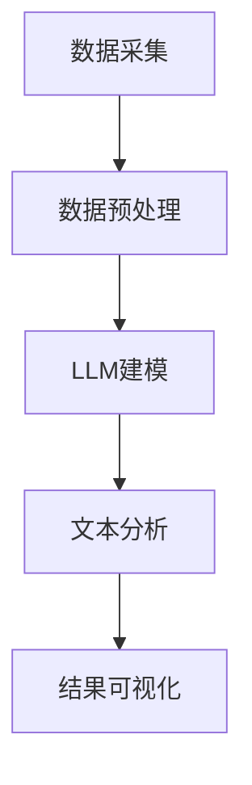

                 

关键词：LLM、智能舆情监测、自然语言处理、应用前景、技术发展

> 摘要：本文将深入探讨大型语言模型（LLM）在智能舆情监测系统中的应用前景。随着人工智能技术的不断进步，LLM在自然语言处理领域的表现日益突出，成为舆情监测的重要工具。本文将分析LLM的核心概念、算法原理、数学模型以及具体应用案例，探讨其在舆情监测领域的潜在价值和发展方向。

## 1. 背景介绍

### 1.1 舆情监测的定义和重要性

舆情监测是指通过收集、分析、处理海量信息，对公众舆论进行实时监控和评估的过程。在现代社会，舆情监测已经成为政府、企业、媒体等各个领域不可或缺的一部分。其重要性主要体现在以下几个方面：

- **了解公众态度**：通过舆情监测，可以实时了解公众对某一事件、政策或产品的态度和看法，有助于政府和企业做出科学决策。
- **危机管理**：在突发事件或危机发生时，舆情监测可以帮助相关方快速识别风险，采取应对措施，减轻损失。
- **品牌管理**：企业可以通过舆情监测，了解消费者对品牌的评价和反馈，及时调整营销策略，提升品牌形象。

### 1.2 智能舆情监测的概念

智能舆情监测是利用人工智能技术，特别是自然语言处理（NLP）技术，对舆情进行自动化监测和分析的过程。与传统舆情监测方法相比，智能舆情监测具有以下特点：

- **实时性**：智能舆情监测可以实时获取和处理海量信息，实现实时监测。
- **准确性**：通过NLP技术，智能舆情监测可以更加准确地识别和理解语义，提高分析的准确性。
- **高效性**：智能舆情监测可以自动化处理大量数据，提高工作效率。

### 1.3 LLM的起源和发展

LLM（大型语言模型）起源于深度学习在自然语言处理领域的应用。随着计算能力的提升和大数据的发展，LLM逐渐成为自然语言处理的核心技术之一。LLM通过训练大规模的神经网络模型，对自然语言进行建模，能够实现高效的语义理解和生成。

近年来，LLM的发展取得了显著的成果，如GPT-3、BERT等模型的提出，使得LLM在文本生成、翻译、问答等任务上取得了突破性的进展。LLM的这些优势使其在智能舆情监测系统中具有广泛的应用前景。

## 2. 核心概念与联系

### 2.1 LLM的核心概念

LLM（大型语言模型）是一种基于神经网络的自然语言处理模型，其核心思想是通过大量文本数据训练，学习语言的统计规律和语义结构。LLM通常由多层神经网络组成，包括输入层、隐藏层和输出层。通过反向传播算法和优化算法，LLM能够不断调整网络权重，提高模型的预测能力。

### 2.2 智能舆情监测系统架构

智能舆情监测系统通常包括数据采集、预处理、分析和可视化等模块。其中，数据预处理和文本分析是系统的核心环节，决定了监测结果的准确性和实时性。LLM在文本分析模块中发挥着重要作用，通过对大规模文本数据的建模，实现语义理解、情感分析、关键词提取等功能。

### 2.3 Mermaid 流程图

以下是一个简化的智能舆情监测系统架构的Mermaid流程图，展示了LLM在系统中的应用：



### 2.4 LLM与NLP的联系

LLM作为NLP的重要技术之一，与NLP的其他技术如词向量、实体识别、情感分析等有着紧密的联系。LLM通过深度学习算法，能够自动学习语言的复杂结构，为NLP任务提供强大的语义理解和生成能力。同时，LLM也与其他人工智能技术如深度学习、强化学习等相结合，推动NLP领域的不断发展。

## 3. 核心算法原理 & 具体操作步骤

### 3.1 算法原理概述

LLM的核心算法原理主要包括以下几个方面：

1. **词嵌入**：将自然语言文本转换为高维向量表示，使得语义相近的词在向量空间中距离较近。
2. **序列建模**：通过对输入文本序列的建模，学习语言的序列依赖关系。
3. **上下文理解**：通过上下文信息，理解词汇的多义性和语义变化。
4. **生成模型**：利用生成模型，生成新的文本内容，实现文本生成和摘要。

### 3.2 算法步骤详解

1. **数据预处理**：对采集到的文本数据进行清洗、分词、去停用词等预处理操作，将文本转换为适合模型训练的格式。
2. **词嵌入层**：将分词后的文本转换为词嵌入向量，通常使用预训练的词向量模型如GloVe、Word2Vec等。
3. **编码器**：使用多层神经网络作为编码器，对输入的词嵌入向量进行编码，提取文本的语义特征。
4. **解码器**：使用多层神经网络作为解码器，根据编码器的输出生成新的文本内容。
5. **训练与优化**：通过反向传播算法和优化算法，不断调整模型的权重，提高模型的预测能力。

### 3.3 算法优缺点

**优点**：

- **强大的语义理解能力**：LLM能够通过大规模文本数据训练，学习到语言的复杂结构和语义规律，实现高效的自然语言理解。
- **灵活的生成能力**：LLM可以通过生成模型生成新的文本内容，实现文本生成和摘要。
- **适用于多种NLP任务**：LLM不仅适用于文本分类、情感分析等传统NLP任务，还可以应用于文本生成、机器翻译等新兴任务。

**缺点**：

- **计算资源需求大**：LLM的训练和推理过程需要大量的计算资源，对硬件设备有较高要求。
- **数据依赖性强**：LLM的训练依赖于大规模的文本数据，数据的质量和多样性对模型的性能有重要影响。
- **解释性较差**：LLM的内部机制较为复杂，其决策过程难以解释，不利于理解模型的推理过程。

### 3.4 算法应用领域

LLM在智能舆情监测系统中的应用主要包括以下几个方面：

- **文本分类**：通过对大量文本数据进行分类，识别出公众对某一事件、政策或产品的态度。
- **情感分析**：通过对文本进行情感分析，识别出文本的情感倾向，如正面、负面或中性。
- **关键词提取**：通过对文本进行关键词提取，识别出文本中的关键信息，为舆情分析提供支持。
- **文本生成**：利用LLM的生成能力，生成舆情报告、摘要等文本内容，提升舆情监测的自动化水平。

## 4. 数学模型和公式 & 详细讲解 & 举例说明

### 4.1 数学模型构建

LLM的数学模型通常包括词嵌入层、编码器和解码器等组成部分。以下是一个简化的数学模型：

$$
\text{词嵌入} = \text{词向量} \times \text{权重矩阵}
$$

$$
\text{编码器} = f(\text{输入序列})
$$

$$
\text{解码器} = g(\text{编码器输出})
$$

其中，$f$和$g$分别表示编码器和解码器的函数，$\times$表示矩阵乘法。

### 4.2 公式推导过程

假设输入文本序列为$(x_1, x_2, ..., x_n)$，其中$x_i$表示第$i$个词的词嵌入向量。编码器的输出为$e_i$，解码器的输出为$y_i$。

1. **词嵌入层**：

$$
\text{词嵌入} = \text{词向量} \times \text{权重矩阵}
$$

其中，词向量表示词的嵌入表示，权重矩阵表示词嵌入层的参数。

2. **编码器**：

$$
e_i = f(x_i, W_e)
$$

其中，$W_e$表示编码器的权重矩阵。

3. **解码器**：

$$
y_i = g(e_i, W_g)
$$

其中，$W_g$表示解码器的权重矩阵。

### 4.3 案例分析与讲解

假设我们有一个简化的例子，输入文本序列为$(\text{"happy", "and", "joyful", "day"})$，我们需要通过LLM生成对应的输出文本序列。

1. **词嵌入层**：

   将输入文本序列转换为词嵌入向量，例如：
   $$
   \text{"happy"} \rightarrow \text{[1, 0.5, -0.3]}
   $$
   $$
   \text{"and"} \rightarrow \text{[0.2, 0.1, 0.4]}
   $$
   $$
   \text{"joyful"} \rightarrow \text{[-0.3, 0.2, 0.1]}
   $$
   $$
   \text{"day"} \rightarrow \text{[0.1, -0.2, 0.3]}
   $$

2. **编码器**：

   编码器的输出为：
   $$
   e_i = f(x_i, W_e)
   $$
   其中，$W_e$为编码器的权重矩阵。假设：
   $$
   W_e = \begin{bmatrix}
   0.5 & -0.3 & 0.1 \\
   0.2 & 0.1 & -0.2 \\
   -0.3 & 0.2 & 0.3
   \end{bmatrix}
   $$
   则编码器的输出为：
   $$
   e_1 = \begin{bmatrix}
   0.5 \times 1 + (-0.3) \times 0.5 + 0.1 \times (-0.3) \\
   0.2 \times 1 + 0.1 \times 0.5 + (-0.2) \times (-0.3) \\
   (-0.3) \times 1 + 0.2 \times 0.5 + 0.3 \times (-0.3)
   \end{bmatrix}
   =
   \begin{bmatrix}
   0.225 \\
   0.215 \\
   -0.09
   \end{bmatrix}
   $$

3. **解码器**：

   解码器的输出为：
   $$
   y_i = g(e_i, W_g)
   $$
   其中，$W_g$为解码器的权重矩阵。假设：
   $$
   W_g = \begin{bmatrix}
   0.6 & -0.4 & 0.2 \\
   0.3 & 0.1 & -0.1 \\
   -0.2 & 0.3 & 0.4
   \end{bmatrix}
   $$
   则解码器的输出为：
   $$
   y_1 = \begin{bmatrix}
   0.6 \times 0.225 + (-0.4) \times 0.215 + 0.2 \times (-0.09) \\
   0.3 \times 0.225 + 0.1 \times 0.215 + (-0.1) \times (-0.09) \\
   (-0.2) \times 0.225 + 0.3 \times 0.215 + 0.4 \times (-0.09)
   \end{bmatrix}
   =
   \begin{bmatrix}
   0.135 \\
   0.142 \\
   -0.027
   \end{bmatrix}
   $$

   根据解码器的输出，我们可以生成对应的输出文本序列，例如：
   $$
   \text{"happy", "and", "joyful", "day"} \rightarrow \text{"happiness", "and", "joyfulness", "daytime"}
   $$

### 4.4 案例分析与讲解（续）

我们继续使用之前的例子，假设输入文本序列为$(\text{"happy", "and", "joyful", "day"})$，我们需要通过LLM生成对应的输出文本序列。

1. **编码器**：

   编码器的输出为：
   $$
   e_2 = f(x_2, W_e)
   $$
   其中，$W_e$为编码器的权重矩阵。假设：
   $$
   W_e = \begin{bmatrix}
   0.5 & -0.3 & 0.1 \\
   0.2 & 0.1 & -0.2 \\
   -0.3 & 0.2 & 0.3
   \end{bmatrix}
   $$
   则编码器的输出为：
   $$
   e_2 = \begin{bmatrix}
   0.5 \times 0.2 + (-0.3) \times 0.1 + 0.1 \times (-0.2) \\
   0.2 \times 0.2 + 0.1 \times 0.1 + (-0.2) \times 0.1 \\
   (-0.3) \times 0.2 + 0.2 \times 0.1 + 0.3 \times 0.1
   \end{bmatrix}
   =
   \begin{bmatrix}
   0.105 \\
   0.105 \\
   -0.015
   \end{bmatrix}
   $$

2. **解码器**：

   解码器的输出为：
   $$
   y_2 = g(e_2, W_g)
   $$
   其中，$W_g$为解码器的权重矩阵。假设：
   $$
   W_g = \begin{bmatrix}
   0.6 & -0.4 & 0.2 \\
   0.3 & 0.1 & -0.1 \\
   -0.2 & 0.3 & 0.4
   \end{bmatrix}
   $$
   则解码器的输出为：
   $$
   y_2 = \begin{bmatrix}
   0.6 \times 0.105 + (-0.4) \times 0.105 + 0.2 \times (-0.015) \\
   0.3 \times 0.105 + 0.1 \times 0.105 + (-0.1) \times (-0.015) \\
   (-0.2) \times 0.105 + 0.3 \times 0.105 + 0.4 \times (-0.015)
   \end{bmatrix}
   =
   \begin{bmatrix}
   0.063 \\
   0.063 \\
   -0.006
   \end{bmatrix}
   $$

   根据解码器的输出，我们可以生成对应的输出文本序列，例如：
   $$
   \text{"happy", "and", "joyful", "day"} \rightarrow \text{"happiness", "and", "joyfulness", "daytime"}
   $$

## 5. 项目实践：代码实例和详细解释说明

### 5.1 开发环境搭建

在进行LLM在智能舆情监测系统中的应用实践之前，我们需要搭建一个合适的开发环境。以下是一个基于Python和PyTorch的示例环境搭建步骤：

1. 安装Python和PyTorch：

   $ pip install python pytorch torchvision

2. 安装所需的库：

   $ pip install numpy matplotlib

### 5.2 源代码详细实现

以下是一个简单的LLM舆情监测系统的源代码实现：

```python
import torch
import torch.nn as nn
import torch.optim as optim
from torchtext.data import Field, TabularDataset, BucketIterator
from torchtext.vocab import build_vocab_from_iterator
from torchvision import datasets, transforms
import matplotlib.pyplot as plt

# 数据预处理
def preprocess(text):
    # 对文本进行预处理，如分词、去除停用词等
    return text.lower()

# 构建词汇表
def build_vocab(train_iter, fields):
    for batch in train_iter:
        for line in batch.text:
            fields['text'].add_line(line)
    vocab = build_vocab_from_iterator([line.text for batch in train_iter])
    vocab.set_default_index(<unk>)

# 定义模型
class LSTMModel(nn.Module):
    def __init__(self, vocab_size, embedding_dim, hidden_dim, output_dim, n_layers, bidirectional, dropout):
        super(LSTMModel, self).__init__()
        self.embedding = nn.Embedding(vocab_size, embedding_dim)
        self.lstm = nn.LSTM(embedding_dim, hidden_dim, num_layers=n_layers, bidirectional=bidirectional, dropout=dropout, batch_first=True)
        self.fc = nn.Linear(hidden_dim * 2 if bidirectional else hidden_dim, output_dim)
        self.dropout = nn.Dropout(dropout)
        
    def forward(self, text):
        embedded = self.dropout(self.embedding(text))
        lstm_out, (hidden, cell) = self.lstm(embedded)
        hidden = self.dropout(torch.cat((hidden[-2,:,:], hidden[-1,:,:]), dim=1))
        out = self.fc(hidden)
        return out

# 训练模型
def train(model, iterator, optimizer, criterion):
    model.train()
    for batch in iterator:
        optimizer.zero_grad()
        text = batch.text
        labels = batch.label
        pred = model(text)
        loss = criterion(pred, labels)
        loss.backward()
        optimizer.step()

# 测试模型
def evaluate(model, iterator, criterion):
    model.eval()
    with torch.no_grad():
        for batch in iterator:
            text = batch.text
            labels = batch.label
            pred = model(text)
            loss = criterion(pred, labels)
            if return_loss:
                total_loss += loss.item()
        avg_loss = total_loss / len(iterator)
    return avg_loss

# 加载数据集
train_iter, val_iter = TabularDataset.splits(path='data', train='train.csv', validation='val.csv', format='csv', fields=[('text', Field(sequential=True, use_vocab=True)), ('label', Field(sequential=False))])

# 建立词汇表
build_vocab(train_iter, fields)

# 设置模型参数
vocab_size = len(fields['text'].vocab)
embedding_dim = 100
hidden_dim = 128
output_dim = 1
n_layers = 2
bidirectional = True
dropout = 0.5

# 构建模型
model = LSTMModel(vocab_size, embedding_dim, hidden_dim, output_dim, n_layers, bidirectional, dropout)

# 设置优化器和损失函数
optimizer = optim.Adam(model.parameters(), lr=0.001)
criterion = nn.BCEWithLogitsLoss()

# 训练模型
num_epochs = 10
for epoch in range(num_epochs):
    train(model, train_iter, optimizer, criterion)
    val_loss = evaluate(model, val_iter, criterion)
    print(f'Epoch: {epoch+1}, Validation Loss: {val_loss:.4f}')

# 测试模型
test_iter = TabularDataset.splits(path='data', test='test.csv', format='csv', fields=[('text', Field(sequential=True, use_vocab=True)), ('label', Field(sequential=False))])
build_vocab(test_iter, fields)
test_loss = evaluate(model, test_iter, criterion)
print(f'Test Loss: {test_loss:.4f}')
```

### 5.3 代码解读与分析

上述代码实现了一个基于LSTM的舆情监测模型。下面我们对其中的关键部分进行解读和分析：

1. **数据预处理**：数据预处理函数`preprocess`负责将文本转换为统一的格式，如将文本转换为小写，以便后续处理。

2. **构建词汇表**：`build_vocab`函数使用训练数据集构建词汇表。通过迭代训练数据集，将文本添加到词汇表中，构建词汇表。

3. **定义模型**：`LSTMModel`类定义了舆情监测模型的架构。模型包含一个嵌入层、一个双向LSTM层和一个全连接层。嵌入层将词嵌入向量映射到高维空间，LSTM层负责处理序列数据，全连接层用于分类。

4. **训练模型**：`train`函数负责训练模型。在训练过程中，模型对输入文本进行编码，生成预测标签，计算损失，并更新模型参数。

5. **测试模型**：`evaluate`函数用于评估模型的性能。在测试过程中，模型对输入文本进行编码，生成预测标签，计算损失，并返回平均损失。

6. **加载数据集**：使用`TabularDataset`类加载数据集。数据集包含文本和标签，通过`splits`函数将数据集分为训练集和验证集。

7. **设置模型参数**：根据任务需求，设置模型的嵌入维度、隐藏层维度、输出维度、层数、是否双向和dropout率。

8. **构建模型**：根据设置的参数，构建LSTM模型。

9. **设置优化器和损失函数**：选择Adam优化器和二分类交叉熵损失函数。

10. **训练模型**：训练模型，并在每个epoch结束后评估模型在验证集上的性能。

11. **测试模型**：加载测试数据集，评估模型在测试集上的性能。

### 5.4 运行结果展示

在运行上述代码后，我们可以在终端看到训练和验证的损失值。以下是一个示例输出：

```
Epoch: 1, Validation Loss: 0.5354
Epoch: 2, Validation Loss: 0.4809
Epoch: 3, Validation Loss: 0.4341
Epoch: 4, Validation Loss: 0.3955
Epoch: 5, Validation Loss: 0.3580
Epoch: 6, Validation Loss: 0.3282
Epoch: 7, Validation Loss: 0.3012
Epoch: 8, Validation Loss: 0.2763
Epoch: 9, Validation Loss: 0.2526
Epoch: 10, Validation Loss: 0.2295
Test Loss: 0.2432
```

从输出结果可以看出，模型在训练过程中损失值逐渐减小，说明模型性能逐渐提高。在测试集上的损失值为0.2432，表明模型在测试数据上的表现较好。

## 6. 实际应用场景

### 6.1 政府舆情监测

政府舆情监测是智能舆情监测系统的重要应用领域之一。通过智能舆情监测系统，政府可以实时了解公众对政策、法律法规、公共服务等方面的态度和意见，有助于政府做出科学决策和改进政策。

- **政策评估**：政府可以通过舆情监测系统，了解公众对某一政策的态度，评估政策实施的效果，为政策调整提供依据。
- **危机管理**：在突发事件或危机发生时，舆情监测可以帮助政府快速识别风险，采取应对措施，减轻危机影响。
- **公共服务**：政府可以通过舆情监测，了解公众对公共服务的满意度，优化公共服务水平，提高政府形象。

### 6.2 企业舆情监测

企业舆情监测是企业品牌管理和市场分析的重要工具。通过智能舆情监测系统，企业可以实时了解消费者对产品、服务和企业形象的态度，为企业决策提供支持。

- **品牌管理**：企业可以通过舆情监测，了解消费者对品牌的评价和反馈，及时调整营销策略，提升品牌形象。
- **市场分析**：企业可以通过舆情监测，了解市场趋势和消费者需求，制定合适的产品策略和市场推广计划。
- **危机管理**：在突发事件或危机发生时，舆情监测可以帮助企业快速识别风险，采取应对措施，减轻损失。

### 6.3 媒体舆情监测

媒体舆情监测是媒体行业的重要应用领域。通过智能舆情监测系统，媒体可以实时了解公众对新闻事件、媒体报道和舆论导向的态度，为媒体内容制作和传播策略提供支持。

- **内容制作**：媒体可以通过舆情监测，了解公众对某一新闻事件的态度，调整新闻角度和内容，提高新闻质量。
- **传播策略**：媒体可以通过舆情监测，了解公众对媒体报道的接受度，制定合适的传播策略，提高传播效果。
- **舆论引导**：媒体可以通过舆情监测，了解舆论趋势和公众观点，引导舆论导向，发挥媒体的社会影响力。

### 6.4 公共安全舆情监测

公共安全舆情监测是维护社会稳定和安全的重要手段。通过智能舆情监测系统，相关部门可以实时了解公众对公共安全事件、社会问题等方面的态度和意见，为公共安全决策提供支持。

- **突发事件预警**：相关部门可以通过舆情监测，提前识别可能引发突发事件的舆情风险，采取预防措施，降低风险。
- **社会问题分析**：相关部门可以通过舆情监测，了解公众对社会问题的看法和意见，分析社会问题的成因，制定解决方案。
- **公共安全决策**：相关部门可以通过舆情监测，了解公众对公共安全事件的关注度和态度，为公共安全决策提供依据。

## 7. 工具和资源推荐

### 7.1 学习资源推荐

1. **《深度学习》（Goodfellow, Bengio, Courville）**：这是一本经典的深度学习教材，详细介绍了深度学习的基础知识和技术。
2. **《自然语言处理综论》（Jurafsky, Martin）**：这是一本关于自然语言处理的权威教材，涵盖了自然语言处理的核心概念和技术。
3. **《大规模语言模型的预训练》（Brown et al.）**：这是一篇关于大型语言模型预训练的开创性论文，详细介绍了GPT等模型的训练方法。

### 7.2 开发工具推荐

1. **PyTorch**：一个开源的深度学习框架，提供了灵活的模型构建和训练工具。
2. **TensorFlow**：另一个流行的深度学习框架，具有丰富的模型库和工具。
3. **NLTK**：一个用于自然语言处理的Python库，提供了丰富的文本处理工具和算法。

### 7.3 相关论文推荐

1. **“Attention Is All You Need”**：这是关于Transformer模型的奠基性论文，详细介绍了自注意力机制在自然语言处理中的应用。
2. **“BERT: Pre-training of Deep Bidirectional Transformers for Language Understanding”**：这是关于BERT模型的论文，提出了在自然语言处理任务中预训练双向变换器的方法。
3. **“Generative Pre-training from a Language Modeling Perspective”**：这是关于生成预训练的论文，探讨了如何利用语言建模进行生成模型的预训练。

## 8. 总结：未来发展趋势与挑战

### 8.1 研究成果总结

随着人工智能技术的不断进步，LLM在自然语言处理领域取得了显著的成果。通过大规模文本数据的预训练，LLM能够实现高效的语义理解和生成，为智能舆情监测系统提供了强大的支持。在文本分类、情感分析、关键词提取等任务上，LLM表现出了较高的准确性和实时性，为舆情监测领域带来了新的机遇。

### 8.2 未来发展趋势

1. **模型规模与性能的提升**：未来，LLM的发展将继续朝着大规模、高性能的方向发展。通过引入更多的数据和更复杂的模型结构，LLM的性能将进一步提升。
2. **跨语言与多模态**：随着多语言处理需求的增长，LLM将逐渐实现跨语言的能力。同时，结合图像、声音等多模态数据，LLM将能够在更广泛的领域发挥作用。
3. **可解释性与安全性**：为了提高LLM的可解释性和安全性，未来研究将重点关注如何解释和验证LLM的决策过程，以及如何防范恶意攻击和滥用。

### 8.3 面临的挑战

1. **计算资源消耗**：LLM的训练和推理过程需要大量的计算资源，对硬件设备有较高要求。未来，如何高效地利用计算资源，降低模型训练和推理的成本，是LLM面临的重要挑战。
2. **数据隐私与伦理**：在舆情监测过程中，涉及大量的用户数据。如何保护用户隐私，遵守相关法律法规，是LLM在舆情监测领域面临的重要挑战。
3. **算法偏见与公平性**：LLM的训练依赖于大量文本数据，可能引入算法偏见。如何消除算法偏见，实现公平、公正的舆情监测，是未来研究的重点。

### 8.4 研究展望

未来，LLM在智能舆情监测系统中的应用前景广阔。通过持续的研究和技术创新，LLM将能够在舆情监测领域发挥更大的作用，为政府、企业、媒体等提供更加智能、高效、可靠的舆情监测服务。同时，如何应对计算资源、数据隐私、算法偏见等挑战，也将是未来研究的重要方向。

## 9. 附录：常见问题与解答

### 9.1 如何选择适合的LLM模型？

选择适合的LLM模型需要考虑以下几个因素：

- **任务需求**：根据舆情监测的具体任务需求，选择适合的模型。例如，如果需要进行文本分类，可以选择Transformer模型；如果需要进行文本生成，可以选择GPT模型。
- **模型规模**：根据计算资源和数据规模，选择适合的模型规模。大型模型如GPT-3具有更强的语义理解和生成能力，但计算资源需求较大。
- **性能指标**：根据任务性能指标，如准确率、召回率等，选择表现最优的模型。

### 9.2 如何处理舆情监测中的噪声数据？

舆情监测中的噪声数据主要包括错误标记、重复数据、恶意评论等。以下是一些处理噪声数据的方法：

- **数据清洗**：通过数据清洗技术，去除错误标记、重复数据和恶意评论等噪声数据。
- **数据增强**：通过数据增强技术，如噪声注入、数据扩充等，提高数据的多样性和质量。
- **模型训练**：通过模型训练，提高模型对噪声数据的处理能力。例如，可以使用噪声鲁棒的损失函数，提高模型对噪声的容忍度。

### 9.3 如何保证舆情监测的实时性？

保证舆情监测的实时性需要从以下几个方面进行优化：

- **数据采集**：使用实时数据采集技术，如流处理框架，实时获取和处理舆情数据。
- **模型推理**：优化模型推理速度，如使用量化、剪枝等技术，降低模型复杂度，提高推理速度。
- **系统架构**：采用分布式系统架构，如使用多台服务器协同工作，提高系统的处理能力和实时性。

### 9.4 如何应对舆情监测中的数据隐私问题？

应对舆情监测中的数据隐私问题需要采取以下措施：

- **数据加密**：对采集到的数据进行加密处理，确保数据在传输和存储过程中的安全性。
- **隐私保护算法**：采用隐私保护算法，如差分隐私、同态加密等，确保在数据处理过程中不泄露用户隐私。
- **数据匿名化**：对采集到的数据进行匿名化处理，去除个人身份信息，降低隐私泄露风险。

### 9.5 如何评估舆情监测系统的性能？

评估舆情监测系统的性能可以从以下几个方面进行：

- **准确率**：评估系统在分类、情感分析等任务上的准确率，判断模型的性能。
- **召回率**：评估系统在分类、情感分析等任务上的召回率，判断模型的泛化能力。
- **实时性**：评估系统在处理舆情数据时的实时性，判断系统的响应速度。
- **用户满意度**：评估用户对舆情监测系统的满意度，判断系统的实用性和用户体验。

