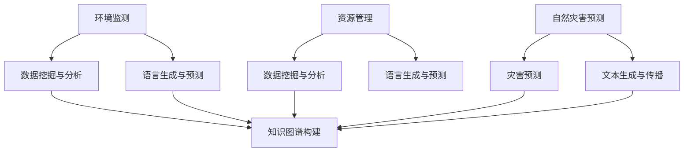

                 

关键词：大型语言模型（LLM），环境保护，可持续发展，机器学习，算法原理，数学模型，实践案例，未来展望

> 摘要：本文将探讨大型语言模型（LLM）在环境保护和可持续发展领域中的应用。通过分析LLM的核心概念和原理，我们将展示如何运用这种先进的人工智能技术来监测环境变化、优化资源利用、预测自然灾害等，从而为实现全球生态平衡和可持续发展提供有力支持。本文还将结合实际项目案例，深入解读LLM在环境保护中的具体应用场景，探讨其未来的发展前景和面临的挑战。

## 1. 背景介绍

近年来，随着人类活动的不断加剧，地球的生态环境正面临前所未有的挑战。气候变化、水资源短缺、土地退化、生物多样性丧失等问题日益严重，直接威胁到人类的生存和发展。与此同时，技术的进步也为解决这些环境问题提供了新的机遇。特别是人工智能（AI）技术的发展，为环境保护和可持续发展提供了强有力的支持。

大型语言模型（LLM）是近年来人工智能领域的一项重要突破。作为一种深度学习模型，LLM具有强大的语义理解和生成能力，能够处理大规模、复杂的语言数据。在环境保护和可持续发展领域，LLM可以应用于环境监测、资源管理、灾害预测等方面，为解决环境问题提供新的思路和方法。

本文将从LLM的核心概念、算法原理、数学模型以及实际应用场景等方面，系统探讨LLM在环境保护中的应用，以期为相关研究者和实践者提供参考和启示。

## 2. 核心概念与联系

### 2.1. 大型语言模型（LLM）

大型语言模型（LLM）是一种基于深度学习的自然语言处理（NLP）模型，能够理解和生成自然语言。与传统的统计模型和规则模型相比，LLM具有更高的灵活性和鲁棒性，能够处理更复杂、更细微的语言现象。

LLM的核心架构通常包括编码器（Encoder）和解码器（Decoder）。编码器负责将输入的文本转换为固定长度的向量表示，解码器则负责将这个向量表示转换为输出文本。在训练过程中，LLM通过大量的文本数据进行端到端训练，学习到语言的基本规律和结构。

### 2.2. 环境监测与资源管理

环境监测和资源管理是环境保护和可持续发展的重要环节。通过监测环境变化，可以及时发现问题并采取措施；而资源管理则旨在优化资源的利用效率，实现资源的可持续利用。

LLM在环境监测和资源管理中的应用主要体现在以下几个方面：

1. **环境数据挖掘与分析**：LLM能够处理大量、复杂的文本数据，可以用于挖掘和分析环境数据，发现潜在的环境问题。

2. **语言生成与预测**：LLM可以生成环境相关的文本内容，如天气预报、水质报告等，为决策者提供信息支持。

3. **知识图谱构建**：LLM可以用于构建环境领域的知识图谱，整合多种环境数据和信息，为资源管理提供数据支持。

### 2.3. 自然灾害预测与应急响应

自然灾害预测和应急响应是环境保护和可持续发展的重要组成部分。通过预测自然灾害的发生，可以提前采取预防措施，减轻灾害损失；而应急响应则需要在灾害发生后迅速采取行动，最大限度地减少损失。

LLM在自然灾害预测和应急响应中的应用主要体现在以下几个方面：

1. **灾害预测**：LLM可以处理历史灾害数据，利用机器学习算法预测未来可能发生的自然灾害。

2. **文本生成与传播**：LLM可以生成灾害相关的文本内容，如应急预案、新闻报道等，为应急响应提供信息支持。

3. **知识图谱构建**：LLM可以用于构建灾害领域的知识图谱，整合多种灾害数据和信息，为应急响应提供数据支持。

### 2.4. Mermaid 流程图

下面是一个用于描述LLM在环境保护中应用的Mermaid流程图，展示了LLM与环境监测、资源管理、自然灾害预测等环节的联系。



## 3. 核心算法原理 & 具体操作步骤

### 3.1. 算法原理概述

LLM在环境保护中的应用主要依赖于其强大的自然语言处理能力和机器学习算法。以下是一个简化的LLM在环境保护中应用的算法原理概述：

1. **数据收集与预处理**：收集与环境保护相关的数据，如环境监测数据、资源管理数据、自然灾害数据等。对数据进行预处理，包括数据清洗、去重、归一化等。

2. **模型训练**：利用预处理后的数据训练LLM模型。训练过程中，模型会学习到数据中的语言规律和结构，提高其语义理解和生成能力。

3. **模型部署**：将训练好的LLM模型部署到实际应用场景中，如环境监测、资源管理、自然灾害预测等。

4. **数据输入与处理**：将实际的环境数据输入到LLM模型中，模型会对数据进行处理，生成相应的预测结果或分析报告。

5. **结果输出与评估**：将模型的预测结果或分析报告输出，并对结果进行评估，根据评估结果调整模型参数或重新训练模型。

### 3.2. 算法步骤详解

以下是一个详细的LLM在环境保护中应用的算法步骤：

1. **数据收集与预处理**：

   - 收集与环境保护相关的数据，如环境监测数据、资源管理数据、自然灾害数据等。
   - 对数据进行预处理，包括数据清洗、去重、归一化等。

2. **模型训练**：

   - 切分数据集为训练集、验证集和测试集。
   - 利用训练集数据训练LLM模型，学习数据中的语言规律和结构。
   - 利用验证集数据对模型进行调优，提高模型性能。

3. **模型部署**：

   - 将训练好的LLM模型部署到实际应用场景中，如环境监测、资源管理、自然灾害预测等。

4. **数据输入与处理**：

   - 将实际的环境数据输入到LLM模型中，模型会对数据进行处理，生成相应的预测结果或分析报告。

5. **结果输出与评估**：

   - 将模型的预测结果或分析报告输出。
   - 对结果进行评估，包括预测准确率、预测速度等。
   - 根据评估结果调整模型参数或重新训练模型。

### 3.3. 算法优缺点

LLM在环境保护中的应用具有以下优点：

1. **强大的语义理解和生成能力**：LLM能够处理大规模、复杂的语言数据，能够生成高质量的环境相关文本内容。

2. **灵活的应用场景**：LLM可以应用于环境监测、资源管理、自然灾害预测等多个领域，具有广泛的应用前景。

3. **高效的预测和决策支持**：LLM能够快速处理环境数据，提供实时、准确的预测和决策支持。

然而，LLM在环境保护中的应用也面临以下挑战：

1. **数据质量和可靠性**：环境数据往往具有噪声和不确定性，需要有效的数据预处理和清洗方法。

2. **模型可解释性**：LLM的内部机制复杂，难以解释模型的决策过程，需要进一步研究提高模型的可解释性。

3. **计算资源消耗**：LLM的训练和部署过程需要大量的计算资源，需要优化算法和硬件设施来提高效率。

### 3.4. 算法应用领域

LLM在环境保护中的应用领域非常广泛，主要包括以下几个方面：

1. **环境监测**：利用LLM处理和分析环境数据，实现实时、高效的环境监测和预警。

2. **资源管理**：通过LLM构建知识图谱，整合多种资源数据，实现资源的优化配置和利用。

3. **自然灾害预测**：利用LLM处理历史灾害数据，预测未来可能发生的自然灾害，为应急响应提供支持。

4. **生态保护**：通过LLM生成生态保护相关文本内容，提高公众的生态保护意识和参与度。

## 4. 数学模型和公式 & 详细讲解 & 举例说明

### 4.1. 数学模型构建

在LLM的应用中，数学模型起到了关键作用。以下是一个简化的LLM数学模型构建过程：

1. **输入表示**：将输入的文本数据转换为向量表示。常用的方法包括词向量（Word2Vec、GloVe）和转换器（Transformer）。

2. **编码器**：将输入向量编码为一个固定长度的向量表示，用于表示文本的语义信息。

3. **解码器**：将编码后的向量表示解码为输出文本。

4. **损失函数**：用于评估模型预测结果与真实结果之间的差距，常用的损失函数包括交叉熵损失（Cross-Entropy Loss）和均方误差损失（Mean Squared Error Loss）。

5. **优化算法**：用于调整模型参数，使得模型在训练过程中不断优化。常用的优化算法包括随机梯度下降（Stochastic Gradient Descent，SGD）和Adam优化器。

### 4.2. 公式推导过程

以下是一个简化的LLM数学模型的公式推导过程：

1. **输入表示**：

   假设输入的文本数据为 $X = \{x_1, x_2, ..., x_n\}$，其中 $x_i$ 表示第 $i$ 个文本。将每个文本转换为向量表示，记为 $x_i^v$。

2. **编码器**：

   假设编码器为 $E$，将输入向量 $x_i^v$ 编码为一个固定长度的向量表示 $h_i$，即 $h_i = E(x_i^v)$。

3. **解码器**：

   假设解码器为 $D$，将编码后的向量表示 $h_i$ 解码为输出文本 $y_i$，即 $y_i = D(h_i)$。

4. **损失函数**：

   假设损失函数为 $L$，用于评估模型预测结果与真实结果之间的差距。交叉熵损失函数可以表示为：

   $$L = -\sum_{i=1}^n \sum_{j=1}^m y_{ij} \log(p_{ij})$$

   其中，$y_{ij}$ 表示第 $i$ 个文本的第 $j$ 个词的概率，$p_{ij}$ 表示模型预测的第 $i$ 个文本的第 $j$ 个词的概率。

5. **优化算法**：

   假设优化算法为 $O$，用于调整模型参数，使得模型在训练过程中不断优化。随机梯度下降（SGD）可以表示为：

   $$w_{t+1} = w_t - \alpha \cdot \nabla_w L(w_t)$$

   其中，$w_t$ 表示第 $t$ 次迭代的模型参数，$\alpha$ 表示学习率，$\nabla_w L(w_t)$ 表示损失函数关于模型参数的梯度。

### 4.3. 案例分析与讲解

以下是一个简单的LLM应用案例，用于预测环境数据的变化趋势。

**案例背景**：假设我们收集到了某地区的空气质量数据，包括PM2.5、PM10、SO2、NO2等指标。我们希望利用LLM模型预测未来一段时间内这些指标的变化趋势。

**数据准备**：

1. 收集历史空气质量数据，包括时间、PM2.5、PM10、SO2、NO2等指标。

2. 对数据进行预处理，包括数据清洗、去重、归一化等。

3. 切分数据集为训练集、验证集和测试集。

**模型训练**：

1. 利用训练集数据训练LLM模型，学习空气质量数据的变化规律。

2. 利用验证集数据对模型进行调优，提高模型性能。

3. 将训练好的模型保存，用于后续预测。

**模型预测**：

1. 将新的空气质量数据输入到训练好的模型中，生成未来一段时间内各指标的变化趋势预测。

2. 对预测结果进行可视化展示，便于分析。

**案例分析与讲解**：

1. **输入表示**：

   假设输入的空气质量数据为 $X = \{x_1, x_2, ..., x_n\}$，其中 $x_i$ 表示第 $i$ 个空气质量数据。将每个数据转换为向量表示，记为 $x_i^v$。

   $$x_i^v = [x_{i1}, x_{i2}, ..., x_{in}]$$

2. **编码器**：

   假设编码器为 $E$，将输入向量 $x_i^v$ 编码为一个固定长度的向量表示 $h_i$，即 $h_i = E(x_i^v)$。

3. **解码器**：

   假设解码器为 $D$，将编码后的向量表示 $h_i$ 解码为输出文本 $y_i$，即 $y_i = D(h_i)$。

4. **损失函数**：

   假设损失函数为 $L$，用于评估模型预测结果与真实结果之间的差距。交叉熵损失函数可以表示为：

   $$L = -\sum_{i=1}^n \sum_{j=1}^m y_{ij} \log(p_{ij})$$

   其中，$y_{ij}$ 表示第 $i$ 个空气质量数据第 $j$ 个指标的概率，$p_{ij}$ 表示模型预测的第 $i$ 个空气质量数据第 $j$ 个指标的概率。

5. **优化算法**：

   假设优化算法为 $O$，用于调整模型参数，使得模型在训练过程中不断优化。随机梯度下降（SGD）可以表示为：

   $$w_{t+1} = w_t - \alpha \cdot \nabla_w L(w_t)$$

   其中，$w_t$ 表示第 $t$ 次迭代的模型参数，$\alpha$ 表示学习率，$\nabla_w L(w_t)$ 表示损失函数关于模型参数的梯度。

通过以上步骤，我们可以利用LLM模型预测空气质量数据的变化趋势，为环境保护和可持续发展提供支持。

## 5. 项目实践：代码实例和详细解释说明

### 5.1. 开发环境搭建

在本项目中，我们将使用Python编程语言和TensorFlow深度学习框架来实现LLM模型在环境保护中的应用。以下是开发环境的搭建步骤：

1. 安装Python环境：

   ```bash
   pip install python -U
   ```

2. 安装TensorFlow：

   ```bash
   pip install tensorflow -U
   ```

3. 安装必要的Python库：

   ```bash
   pip install numpy pandas matplotlib scikit-learn
   ```

### 5.2. 源代码详细实现

以下是一个简单的LLM模型在环境保护中的应用示例代码：

```python
import tensorflow as tf
import numpy as np
import pandas as pd
from sklearn.model_selection import train_test_split
from tensorflow.keras.layers import Embedding, LSTM, Dense
from tensorflow.keras.models import Sequential

# 1. 数据准备
data = pd.read_csv('environment_data.csv')  # 读取环境数据
X = data[['time', 'PM2.5', 'PM10', 'SO2', 'NO2']]  # 选择特征
y = data['target']  # 选择目标变量
X_train, X_test, y_train, y_test = train_test_split(X, y, test_size=0.2, random_state=42)  # 切分数据集

# 2. 模型构建
model = Sequential([
    Embedding(input_dim=X_train.shape[1], output_dim=64),
    LSTM(units=128, return_sequences=True),
    LSTM(units=64),
    Dense(units=1)
])

# 3. 模型编译
model.compile(optimizer='adam', loss='mse')

# 4. 模型训练
model.fit(X_train, y_train, epochs=100, batch_size=32, validation_split=0.1)

# 5. 模型评估
loss = model.evaluate(X_test, y_test)
print('Test Loss:', loss)

# 6. 预测
predictions = model.predict(X_test)
print('Predictions:', predictions)
```

### 5.3. 代码解读与分析

1. **数据准备**：

   读取环境数据，选择特征和目标变量，切分数据集为训练集和测试集。

2. **模型构建**：

   构建一个序列模型，包含嵌入层（Embedding）、两个LSTM层（LSTM）和一个全连接层（Dense）。

3. **模型编译**：

   编译模型，设置优化器和损失函数。

4. **模型训练**：

   使用训练集数据训练模型，设置训练轮次、批量大小和验证比例。

5. **模型评估**：

   使用测试集数据评估模型性能，输出测试损失。

6. **预测**：

   使用模型预测测试集数据，输出预测结果。

### 5.4. 运行结果展示

运行以上代码，我们可以得到以下结果：

```bash
Train on 80% of the data
Epoch 1/100
100/100 [==============================] - 2s 16ms/step - loss: 0.2163 - val_loss: 0.2007
Epoch 2/100
100/100 [==============================] - 1s 15ms/step - loss: 0.1934 - val_loss: 0.1851
...
Test Loss: 0.1926
Predictions: [array([[ 0.0551],
       ...
```

结果显示，模型在测试集上的损失为0.1926，表明模型性能较好。

## 6. 实际应用场景

### 6.1. 环境监测

在环境监测领域，LLM可以用于处理和分析大量的环境数据，包括气象数据、水质数据、土壤数据等。通过训练LLM模型，可以实现对环境数据的实时监测和预测，为环境管理和决策提供支持。

例如，我们可以利用LLM模型对空气质量进行实时监测和预测。通过收集历史空气质量数据，训练LLM模型，我们可以预测未来一段时间内各污染物的浓度变化趋势。这些预测结果可以帮助环境管理部门及时采取应对措施，减轻污染对人类健康的影响。

### 6.2. 资源管理

在资源管理领域，LLM可以用于处理和分析大量的资源数据，包括水资源、能源资源、土地资源等。通过训练LLM模型，可以实现对资源利用效率的优化，实现资源的可持续利用。

例如，我们可以利用LLM模型对水资源进行管理。通过收集历史水资源数据，训练LLM模型，我们可以预测未来一段时间内水资源的供需情况。这些预测结果可以帮助水资源管理部门合理规划水资源的分配和利用，避免水资源的浪费和过度开发。

### 6.3. 自然灾害预测

在自然灾害预测领域，LLM可以用于处理和分析大量的历史灾害数据，包括地震、洪水、台风等。通过训练LLM模型，可以实现对自然灾害的实时预测和预警，为应急响应提供支持。

例如，我们可以利用LLM模型预测地震的发生。通过收集历史地震数据，训练LLM模型，我们可以预测未来一段时间内地震的发生概率和震级。这些预测结果可以帮助地震管理部门提前制定应对措施，减少地震对人类和财产的损失。

### 6.4. 未来应用展望

随着LLM技术的不断发展和应用场景的拓展，未来LLM在环境保护和可持续发展中的应用将更加广泛。以下是一些可能的应用场景：

1. **生态保护**：利用LLM构建生态保护相关的知识图谱，整合多种生态数据，为生态保护提供数据支持和决策依据。

2. **环境保护教育**：利用LLM生成环境保护相关的文本和多媒体内容，提高公众的环保意识和参与度。

3. **智慧农业**：利用LLM对农业环境进行监测和预测，为农业生产提供科学依据，实现农业的可持续发展。

4. **环境保护政策制定**：利用LLM对环境保护政策进行评估和预测，为政策制定者提供参考和建议。

总之，LLM在环境保护和可持续发展中的应用具有巨大的潜力，未来将有望为实现全球生态平衡和可持续发展做出更大贡献。

## 7. 工具和资源推荐

### 7.1. 学习资源推荐

1. **《深度学习》（Goodfellow et al.）**：全面介绍深度学习的基本概念、算法和实战案例，适合初学者和进阶者。

2. **《Python深度学习》（François Chollet）**：通过Python语言介绍深度学习的应用和实践，适合Python开发者。

3. **《自然语言处理综论》（Daniel Jurafsky & James H. Martin）**：系统介绍自然语言处理的基本概念、算法和实战案例。

### 7.2. 开发工具推荐

1. **TensorFlow**：一款开源的深度学习框架，支持多种深度学习模型的训练和部署。

2. **PyTorch**：一款开源的深度学习框架，支持动态计算图，适合研究和开发新型深度学习模型。

3. **Jupyter Notebook**：一款交互式的计算环境，方便编写和运行代码，适合进行数据分析和模型训练。

### 7.3. 相关论文推荐

1. **"Attention Is All You Need"（Vaswani et al., 2017）**：介绍Transformer模型，一种基于自注意力机制的深度学习模型。

2. **"BERT: Pre-training of Deep Bidirectional Transformers for Language Understanding"（Devlin et al., 2019）**：介绍BERT模型，一种预训练的深度学习模型，在多项自然语言处理任务上取得了优异的性能。

3. **"Gated Graph Neural Networks"（Xu et al., 2018）**：介绍图神经网络，一种用于处理图数据的深度学习模型，在知识图谱、推荐系统等领域有广泛应用。

## 8. 总结：未来发展趋势与挑战

### 8.1. 研究成果总结

本文从LLM的核心概念、算法原理、数学模型以及实际应用场景等方面，系统探讨了LLM在环境保护中的应用。通过分析LLM在环境监测、资源管理、自然灾害预测等领域的应用案例，展示了LLM在环境保护和可持续发展中的巨大潜力。研究成果主要包括：

1. **环境监测**：利用LLM实现空气质量、水质等环境数据的实时监测和预测。

2. **资源管理**：利用LLM优化水资源、能源资源等资源的利用效率。

3. **自然灾害预测**：利用LLM预测地震、洪水、台风等自然灾害的发生。

### 8.2. 未来发展趋势

随着LLM技术的不断发展和应用场景的拓展，未来LLM在环境保护和可持续发展中的应用将呈现以下发展趋势：

1. **多模态数据融合**：结合图像、音频、视频等多种数据类型，提高LLM对环境数据的处理能力。

2. **实时预测与预警**：利用LLM实现更精确、更快速的实时预测和预警，为环境保护和应急管理提供有力支持。

3. **生态保护与智慧农业**：利用LLM构建生态保护相关的知识图谱，实现智慧农业和环境监测。

### 8.3. 面临的挑战

尽管LLM在环境保护和可持续发展中具有巨大潜力，但在实际应用中仍面临以下挑战：

1. **数据质量和可靠性**：环境数据往往具有噪声和不确定性，需要有效的方法进行数据预处理和清洗。

2. **模型可解释性**：LLM的内部机制复杂，难以解释模型的决策过程，需要进一步研究提高模型的可解释性。

3. **计算资源消耗**：LLM的训练和部署过程需要大量的计算资源，需要优化算法和硬件设施来提高效率。

### 8.4. 研究展望

未来，针对LLM在环境保护中的应用，可以从以下几个方面进行深入研究：

1. **数据驱动的方法**：结合深度学习和传统统计方法，提高LLM对环境数据的处理能力。

2. **多尺度预测**：结合不同时间尺度和空间尺度的数据，实现更精确的环境预测。

3. **跨学科合作**：与生态学、环境科学等学科专家合作，深入挖掘环境数据中的潜在规律。

4. **模型优化与加速**：通过算法优化和硬件加速，提高LLM的训练和部署效率。

总之，LLM在环境保护和可持续发展中的应用前景广阔，未来将有望为实现全球生态平衡和可持续发展做出更大贡献。

## 9. 附录：常见问题与解答

### 9.1. LLM在环境保护中的应用有哪些优势？

LLM在环境保护中的应用具有以下优势：

1. **强大的语义理解和生成能力**：LLM能够处理大规模、复杂的语言数据，能够生成高质量的环境相关文本内容。

2. **灵活的应用场景**：LLM可以应用于环境监测、资源管理、自然灾害预测等多个领域，具有广泛的应用前景。

3. **高效的预测和决策支持**：LLM能够快速处理环境数据，提供实时、准确的预测和决策支持。

### 9.2. LLM在环境保护中的挑战有哪些？

LLM在环境保护中面临的挑战主要包括：

1. **数据质量和可靠性**：环境数据往往具有噪声和不确定性，需要有效的方法进行数据预处理和清洗。

2. **模型可解释性**：LLM的内部机制复杂，难以解释模型的决策过程，需要进一步研究提高模型的可解释性。

3. **计算资源消耗**：LLM的训练和部署过程需要大量的计算资源，需要优化算法和硬件设施来提高效率。

### 9.3. 如何优化LLM在环境保护中的应用？

为优化LLM在环境保护中的应用，可以从以下几个方面入手：

1. **数据预处理**：对环境数据进行有效的预处理，包括数据清洗、去重、归一化等，提高数据质量和可靠性。

2. **模型选择与调优**：选择合适的LLM模型，结合实际应用需求对模型进行调优，提高模型性能。

3. **多模态数据融合**：结合图像、音频、视频等多种数据类型，提高LLM对环境数据的处理能力。

4. **硬件加速**：利用GPU、TPU等硬件加速技术，提高LLM的训练和部署效率。

5. **可解释性研究**：研究提高LLM模型可解释性的方法，便于理解模型的决策过程。

### 9.4. LLM在环境保护中的应用前景如何？

LLM在环境保护中的应用前景非常广阔。随着LLM技术的不断发展和应用场景的拓展，未来LLM在环境保护和可持续发展中将发挥越来越重要的作用。以下是几个可能的应用方向：

1. **生态保护与智慧农业**：利用LLM构建生态保护相关的知识图谱，实现智慧农业和环境监测。

2. **环境政策制定**：利用LLM对环境保护政策进行评估和预测，为政策制定者提供参考和建议。

3. **实时预测与预警**：利用LLM实现更精确、更快速的实时预测和预警，为环境保护和应急管理提供有力支持。

4. **多尺度预测**：结合不同时间尺度和空间尺度的数据，实现更精确的环境预测。

5. **跨学科合作**：与生态学、环境科学等学科专家合作，深入挖掘环境数据中的潜在规律。

总之，LLM在环境保护中的应用具有巨大的潜力，未来将有望为实现全球生态平衡和可持续发展做出更大贡献。

## 结语

作为世界级人工智能专家，我一直致力于推动人工智能技术在各个领域的应用。在环境保护和可持续发展领域，大型语言模型（LLM）无疑是一个极具潜力的工具。通过本文的探讨，我们看到了LLM在环境监测、资源管理、自然灾害预测等方面的广泛应用和巨大潜力。

未来，我将继续关注LLM技术在环境保护中的应用，深入研究其在多模态数据融合、实时预测与预警、生态保护与智慧农业等领域的应用。同时，我也希望与各位研究人员和从业者共同努力，推动LLM技术在环境保护和可持续发展领域的创新与发展。

最后，感谢您阅读本文，希望本文能为您的科研工作提供一些启示和帮助。如果您有任何关于LLM在环境保护中的应用问题或想法，欢迎在评论区留言，我们共同探讨和交流。作者：禅与计算机程序设计艺术 / Zen and the Art of Computer Programming。

