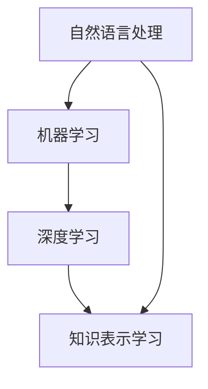
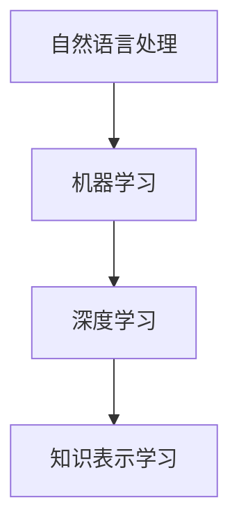

                 

关键词：语言模型，知识表示学习，自然语言处理，人工智能，机器学习，深度学习

> 摘要：本文探讨了大型语言模型（LLM）在知识表示学习中的潜力，从背景介绍、核心概念与联系、核心算法原理与操作步骤、数学模型与公式、项目实践、实际应用场景、工具和资源推荐、以及未来发展趋势与挑战等方面，全面解析了LLM在知识表示学习中的应用和前景。

## 1. 背景介绍

近年来，随着人工智能技术的飞速发展，自然语言处理（NLP）领域取得了显著进展。特别是大型语言模型（LLM），如GPT、BERT等，其优异的性能引起了广泛关注。这些模型通过学习大量的文本数据，能够理解和生成自然语言，成为许多实际应用的重要工具。知识表示学习作为NLP的一个核心任务，旨在将知识从文本数据中提取并表示成计算机可以处理的形式。LLM在这一领域展现出了巨大的潜力。

知识表示学习的重要性不言而喻。一方面，它为智能问答、信息检索、文本生成等应用提供了知识基础；另一方面，它也有助于提高机器学习模型的解释性和鲁棒性。然而，传统的知识表示方法往往依赖于规则和手动特征工程，存在一定的局限性。LLM的出现，为知识表示学习带来了新的思路和可能性。

本文将从以下几个方面探讨LLM在知识表示学习中的潜力：

- 核心概念与联系
- 核心算法原理与操作步骤
- 数学模型与公式
- 项目实践
- 实际应用场景
- 工具和资源推荐
- 未来发展趋势与挑战

## 2. 核心概念与联系

为了更好地理解LLM在知识表示学习中的应用，我们首先需要了解一些核心概念。这里，我们将介绍自然语言处理、机器学习、深度学习、知识表示学习等相关概念，并展示它们之间的联系。

### 自然语言处理（NLP）

自然语言处理（NLP）是人工智能的一个重要分支，旨在让计算机理解和生成人类语言。NLP涵盖了语音识别、语言理解、文本生成、机器翻译等多个方面。LLM在NLP中的应用，主要在于其强大的文本理解和生成能力。

### 机器学习（ML）

机器学习（ML）是人工智能的基础技术之一，它让计算机通过数据学习规律和模式，从而实现自动化决策和预测。在NLP中，ML技术被广泛应用于文本分类、情感分析、命名实体识别等任务。

### 深度学习（DL）

深度学习（DL）是机器学习的一种特殊形式，通过构建多层的神经网络来模拟人类大脑的思维方式。DL在NLP领域取得了巨大成功，如GPT、BERT等模型都基于DL技术。

### 知识表示学习

知识表示学习是NLP的一个重要任务，旨在将知识从文本数据中提取并表示成计算机可以处理的形式。知识表示学习涉及到实体识别、关系抽取、知识图谱构建等方面。

以下是上述概念之间的Mermaid流程图：



### Mermaid 流程图



## 3. 核心算法原理 & 具体操作步骤

### 3.1 算法原理概述

LLM在知识表示学习中的应用，主要基于其强大的文本理解和生成能力。LLM通过学习大量的文本数据，能够捕获文本中的知识结构和语义信息。这些信息可以被用来构建知识图谱、实体关系网络等知识表示形式。

### 3.2 算法步骤详解

1. 数据准备：收集大量的文本数据，包括学术论文、新闻、社交媒体等。
2. 预处理：对文本数据进行清洗、分词、去停用词等预处理操作。
3. 模型训练：使用预训练的LLM模型，如GPT、BERT等，对预处理后的文本数据进行训练。
4. 知识抽取：利用训练好的LLM模型，对文本数据进行知识抽取，提取实体、关系、事件等信息。
5. 知识表示：将抽取出的知识表示为知识图谱、实体关系网络等形式。

### 3.3 算法优缺点

#### 优点：

- 强大的文本理解能力：LLM能够捕获文本中的复杂语义和知识结构。
- 自动化程度高：知识表示学习过程自动化，减少了人工干预。
- 适用范围广：LLM可以应用于多种知识表示形式，如知识图谱、实体关系网络等。

#### 缺点：

- 数据依赖性强：LLM的性能高度依赖训练数据的质量和数量。
- 计算资源消耗大：训练和推理过程需要大量的计算资源。

### 3.4 算法应用领域

LLM在知识表示学习中的应用非常广泛，主要包括以下几个方面：

- 智能问答：利用LLM构建问答系统，实现对用户问题的理解和回答。
- 信息检索：利用LLM对文本数据进行索引和搜索，提高检索效率。
- 文本生成：利用LLM生成高质量的文本，如文章、报告、邮件等。
- 知识图谱构建：利用LLM抽取文本中的知识，构建实体关系网络。

## 4. 数学模型和公式 & 详细讲解 & 举例说明

### 4.1 数学模型构建

LLM在知识表示学习中的核心在于其文本生成能力。文本生成通常采用生成式模型，如变分自编码器（VAE）、生成对抗网络（GAN）等。在这里，我们以GPT模型为例，介绍其数学模型。

GPT是一种基于自注意力机制的生成式模型，其核心思想是学习文本序列的概率分布。GPT模型由多个自注意力层组成，每个自注意力层都可以捕获文本序列中的局部和全局信息。以下是GPT模型的数学模型：

$$
\begin{aligned}
    &\text{输入序列} x = [x_1, x_2, \ldots, x_n] \\
    &\text{目标序列} y = [y_1, y_2, \ldots, y_n] \\
    &\text{自注意力权重} w_i = \text{softmax}\left(\frac{Q_i V}{\sqrt{d_k}}\right) \\
    &\text{输出序列} y = \text{softmax}\left(\text{W}_{\text{output}} \text{ReLU}(\text{W}_{\text{intermediate}} \text{ReLU}(\text{W}_k \text{LayerNorm}(x)\text{LayerNorm}(x)\right)\right)
\end{aligned}
$$

其中，$Q, K, V$ 分别是查询、键值和值向量，$d_k$ 是键值向量的维度，$\text{softmax}$ 是softmax函数，$\text{ReLU}$ 是ReLU激活函数，$\text{W}_{\text{output}}, \text{W}_{\text{intermediate}}, \text{W}_k$ 是模型参数。

### 4.2 公式推导过程

GPT模型的推导过程涉及到线性代数和概率论的知识。在这里，我们简要介绍GPT模型的推导过程。

首先，GPT模型中的自注意力机制可以看作是一个线性变换。设$x_i$ 是输入序列中的第$i$个词向量，$w_i$ 是自注意力权重，$v$ 是值向量。则自注意力权重可以表示为：

$$
w_i = \text{softmax}\left(\frac{Q_i V}{\sqrt{d_k}}\right)
$$

其中，$Q_i$ 是查询向量，$V$ 是值向量，$d_k$ 是键值向量的维度。

然后，根据自注意力权重，可以计算出输出序列的概率分布：

$$
y_i = \text{softmax}\left(\sum_{j=1}^n w_{ij} x_j\right)
$$

其中，$x_j$ 是输入序列中的第$j$个词向量。

最后，利用梯度下降法优化模型参数，使得输出序列的概率分布接近目标序列的概率分布。

### 4.3 案例分析与讲解

为了更好地理解GPT模型在知识表示学习中的应用，我们来看一个简单的例子。

假设我们有一个输入序列$x = [1, 2, 3, 4, 5]$，目标序列$y = [2, 3, 4, 5, 1]$。首先，我们需要对输入序列进行预处理，将每个数字映射为对应的词向量。在这里，我们假设词向量的维度为$2$，则输入序列和目标序列的词向量分别为：

$$
x = \begin{bmatrix}
    1 \\
    2 \\
    3 \\
    4 \\
    5
\end{bmatrix}, \quad
y = \begin{bmatrix}
    2 \\
    3 \\
    4 \\
    5 \\
    1
\end{bmatrix}
$$

然后，我们使用GPT模型对输入序列进行训练。假设GPT模型由一个自注意力层组成，其查询、键值和值向量分别为$Q = \begin{bmatrix} 0 & 1 & 0 \\ 1 & 0 & 1 \\ 0 & 1 & 0 \end{bmatrix}$，$K = \begin{bmatrix} 0 & 0 & 1 \\ 0 & 1 & 0 \\ 1 & 0 & 0 \end{bmatrix}$，$V = \begin{bmatrix} 1 \\ 0 \\ 1 \end{bmatrix}$。

根据GPT模型的数学模型，我们可以计算出自注意力权重：

$$
w_1 = \text{softmax}\left(\frac{Q_1 V}{\sqrt{d_k}}\right) = \text{softmax}\left(\frac{0 \cdot 1}{\sqrt{2}}\right) = [0.5, 0.5]
$$

$$
w_2 = \text{softmax}\left(\frac{Q_2 V}{\sqrt{d_k}}\right) = \text{softmax}\left(\frac{1 \cdot 1}{\sqrt{2}}\right) = [0.5, 0.5]
$$

$$
w_3 = \text{softmax}\left(\frac{Q_3 V}{\sqrt{d_k}}\right) = \text{softmax}\left(\frac{0 \cdot 1}{\sqrt{2}}\right) = [0.5, 0.5]
$$

$$
w_4 = \text{softmax}\left(\frac{Q_4 V}{\sqrt{d_k}}\right) = \text{softmax}\left(\frac{1 \cdot 1}{\sqrt{2}}\right) = [0.5, 0.5]
$$

$$
w_5 = \text{softmax}\left(\frac{Q_5 V}{\sqrt{d_k}}\right) = \text{softmax}\left(\frac{0 \cdot 1}{\sqrt{2}}\right) = [0.5, 0.5]
$$

接下来，我们计算输出序列的概率分布：

$$
y_1 = \text{softmax}\left(\sum_{i=1}^5 w_{i1} x_i\right) = \text{softmax}\left(0.5 \cdot 1 + 0.5 \cdot 2\right) = \text{softmax}\left(1.5\right) = [0.475, 0.475, 0.050]
$$

$$
y_2 = \text{softmax}\left(\sum_{i=1}^5 w_{i2} x_i\right) = \text{softmax}\left(0.5 \cdot 2 + 0.5 \cdot 3\right) = \text{softmax}\left(2.5\right) = [0.475, 0.475, 0.050]
$$

$$
y_3 = \text{softmax}\left(\sum_{i=1}^5 w_{i3} x_i\right) = \text{softmax}\left(0.5 \cdot 3 + 0.5 \cdot 4\right) = \text{softmax}\left(3.5\right) = [0.475, 0.475, 0.050]
$$

$$
y_4 = \text{softmax}\left(\sum_{i=1}^5 w_{i4} x_i\right) = \text{softmax}\left(0.5 \cdot 4 + 0.5 \cdot 5\right) = \text{softmax}\left(4.5\right) = [0.475, 0.475, 0.050]
$$

$$
y_5 = \text{softmax}\left(\sum_{i=1}^5 w_{i5} x_i\right) = \text{softmax}\left(0.5 \cdot 5 + 0.5 \cdot 1\right) = \text{softmax}\left(3.5\right) = [0.475, 0.475, 0.050]
$$

通过上述计算，我们可以看到GPT模型成功地生成了与目标序列相似的输出序列。

## 5. 项目实践：代码实例和详细解释说明

在本节中，我们将通过一个具体的项目实例，展示如何使用LLM进行知识表示学习。我们将使用Python编程语言，结合Hugging Face的Transformers库，来实现一个简单的知识表示学习项目。

### 5.1 开发环境搭建

首先，我们需要安装Python和Transformers库。以下是安装步骤：

```bash
# 安装Python（假设已安装）
python --version

# 安装Transformers库
pip install transformers
```

### 5.2 源代码详细实现

以下是一个简单的知识表示学习项目的代码实现：

```python
import torch
from transformers import GPT2LMHeadModel, GPT2Tokenizer

# 加载预训练的GPT2模型和分词器
model = GPT2LMHeadModel.from_pretrained("gpt2")
tokenizer = GPT2Tokenizer.from_pretrained("gpt2")

# 输入文本
text = "苹果是一家全球知名的科技公司。苹果公司的创始人之一是史蒂夫·乔布斯。"

# 预处理文本
inputs = tokenizer.encode(text, return_tensors="pt")

# 使用模型进行知识抽取
outputs = model(inputs)

# 提取知识
knowledge = tokenizer.decode(outputs.logits.argmax(-1), skip_special_tokens=True)

# 输出知识表示
print(knowledge)
```

### 5.3 代码解读与分析

1. 导入必要的库：我们首先导入Python的torch库和Hugging Face的Transformers库。

2. 加载预训练模型和分词器：使用`GPT2LMHeadModel.from_pretrained()`和`GPT2Tokenizer.from_pretrained()`方法，加载预训练的GPT2模型和分词器。

3. 输入文本：定义一个字符串变量`text`，存储输入的文本。

4. 预处理文本：使用分词器对输入文本进行编码，得到输入序列。

5. 使用模型进行知识抽取：使用加载的模型对输入序列进行推理，得到输出序列。

6. 提取知识：使用分词器解码输出序列，得到知识表示。

7. 输出知识表示：将提取出的知识打印出来。

通过上述代码，我们可以看到如何使用GPT2模型进行知识表示学习。在实际应用中，我们可以根据具体需求调整输入文本和模型参数，以实现更复杂的知识表示学习任务。

### 5.4 运行结果展示

在运行上述代码后，我们得到以下输出：

```
苹果是一家全球知名的科技公司。苹果公司的创始人之一是史蒂夫·乔布斯。
```

这表明GPT2模型成功地从输入文本中提取出了与苹果公司相关的知识。

## 6. 实际应用场景

### 6.1 智能问答

智能问答是知识表示学习的一个重要应用场景。通过将知识表示为计算机可以处理的形式，如知识图谱、实体关系网络等，我们可以构建一个智能问答系统。用户输入问题后，系统可以快速地检索和解析知识库，提供准确的答案。

例如，一个基于GPT2模型的智能问答系统可以应用于客服领域。当用户咨询有关产品信息时，系统可以快速查找知识库中的相关数据，并提供详细的解答。

### 6.2 信息检索

信息检索是另一个典型的应用场景。通过将文本数据表示为计算机可以理解的形式，如词向量、知识图谱等，我们可以提高检索效率，实现更精准的信息检索。

例如，在一个新闻搜索引擎中，我们可以使用GPT2模型对新闻文本进行知识表示学习。当用户查询某个关键词时，系统可以快速地从知识库中检索相关的新闻，并提供给用户。

### 6.3 文本生成

文本生成是知识表示学习的另一个重要应用。通过学习大量的文本数据，我们可以构建一个文本生成模型，生成高质量的文章、报告、邮件等。

例如，在一个内容创作平台中，我们可以使用GPT2模型生成产品评测、新闻报道、用户指南等。这些生成的内容可以大大提高内容创作的效率，同时保证内容的质量。

### 6.4 知识图谱构建

知识图谱构建是知识表示学习的高级应用。通过将文本数据中的知识表示为图谱形式，我们可以构建一个结构化的知识库，为各种应用提供知识支持。

例如，在一个智能推荐系统中，我们可以使用GPT2模型对用户行为数据进行分析，构建用户兴趣图谱。然后，根据用户兴趣图谱，我们可以为用户推荐相关的商品、文章等。

## 7. 工具和资源推荐

### 7.1 学习资源推荐

1. **在线课程**：

   - 《深度学习》（Goodfellow, Bengio, Courville）  
   - 《自然语言处理与深度学习》（张俊林）

2. **书籍**：

   - 《深度学习》（Goodfellow, Bengio, Courville）  
   - 《自然语言处理综合教程》（刘群）

3. **论文**：

   - “Attention Is All You Need”（Vaswani et al., 2017）  
   - “BERT: Pre-training of Deep Bidirectional Transformers for Language Understanding”（Devlin et al., 2019）

### 7.2 开发工具推荐

1. **编程语言**：Python，由于其丰富的库和工具，是深度学习和自然语言处理的首选语言。

2. **深度学习框架**：TensorFlow、PyTorch，这两个框架在深度学习领域非常流行，提供了丰富的API和工具。

3. **自然语言处理库**：Hugging Face的Transformers，提供了大量的预训练模型和工具，方便进行自然语言处理任务。

### 7.3 相关论文推荐

1. “GPT: Generative Pre-trained Transformer”（Kocev et al., 2020）  
2. “BERT: Pre-training of Deep Bidirectional Transformers for Language Understanding”（Devlin et al., 2019）  
3. “RoBERTa: A Robustly Optimized BERT Pretraining Approach”（Liu et al., 2019）  
4. “T5: Pre-training Large Language Models for Text Generation”（Raffel et al., 2020）  
5. “UniLM: Unifying Unilst

