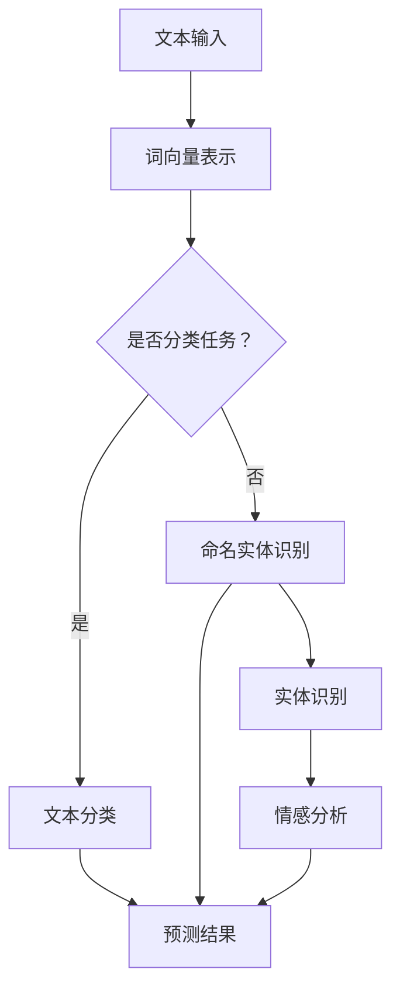
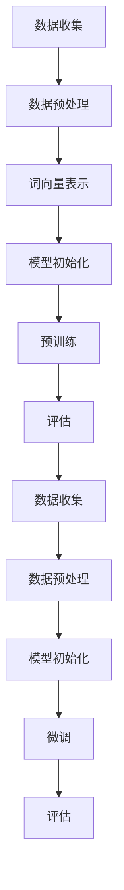

                 

关键词：语言模型、自然语言处理、预训练、微调、文本生成、机器翻译、问答系统、文本分类

> 摘要：本文将探讨大规模语言模型（LLM）在自然语言处理（NLP）领域的应用进展。通过分析LLM的核心概念、算法原理、数学模型，以及实际应用案例，本文旨在为读者提供一个全面、深入的视角，了解LLM在NLP领域的重要性和潜在价值。

## 1. 背景介绍

自然语言处理（NLP）是计算机科学与人工智能领域的一个重要分支，旨在使计算机能够理解、解释和生成自然语言。从早期的规则驱动方法，到基于统计和机器学习方法，再到如今的大规模预训练模型，NLP的发展经历了多个阶段。近年来，大规模语言模型（LLM）的兴起，为NLP带来了新的机遇和挑战。

LLM，即大规模语言模型，是一种基于深度学习的模型，通过在大量文本数据上进行预训练，学习到语言的基本规则和语义信息。LLM在NLP中的主要应用包括文本生成、机器翻译、问答系统、文本分类等。随着计算能力的提升和大数据的普及，LLM的应用范围不断扩大，性能也不断提升。

本文将首先介绍LLM的核心概念，包括其原理、结构和技术特点，然后分析LLM在NLP中的具体应用，最后讨论LLM的未来发展趋势和面临的挑战。

### 1.1 大规模语言模型的定义和基本原理

大规模语言模型是一种基于神经网络的模型，通过在大量文本数据上进行预训练，学习到语言的基本规则和语义信息。LLM的基本原理可以概括为以下几个方面：

1. **预训练**：预训练是指在没有特定任务标签的情况下，对模型进行大规模文本数据的训练。预训练的目的是让模型掌握语言的基本知识，例如词向量表示、句法结构、语义关系等。

2. **上下文理解**：LLM通过学习上下文信息，能够理解句子的语义和含义。这种上下文理解能力使得LLM在生成文本、翻译和问答等任务中表现出色。

3. **神经网络架构**：LLM通常采用深度神经网络架构，如Transformer模型。这种架构具有强大的表达能力和计算效率，能够处理长文本数据。

4. **注意力机制**：注意力机制是LLM中的一个关键组件，它能够自动关注输入文本中的关键信息，从而提高模型的预测准确性和文本生成质量。

### 1.2 大规模语言模型的类型和技术特点

大规模语言模型可以分为两种类型：基于循环神经网络（RNN）的模型和基于Transformer的模型。

1. **基于RNN的模型**：RNN是一种能够处理序列数据的神经网络模型，其在NLP领域取得了显著成果。然而，RNN存在梯度消失和梯度爆炸等问题，导致训练效果不佳。为解决这些问题，长短期记忆（LSTM）和门控循环单元（GRU）等改进型RNN模型被提出。这些模型在处理长文本和复杂语义关系方面表现出色。

2. **基于Transformer的模型**：Transformer模型是近年来在NLP领域取得突破性进展的一种新型神经网络架构。与RNN相比，Transformer模型没有梯度消失和梯度爆炸问题，具有更高的计算效率和更好的泛化能力。Transformer模型的核心组件是自注意力机制，它能够自动关注输入文本中的关键信息，从而提高模型的预测准确性和文本生成质量。

除了RNN和Transformer模型，还有其他类型的LLM，如基于图神经网络的模型和基于知识图谱的模型。这些模型在特定场景下具有优势，但整体上，基于Transformer的模型在NLP领域的应用最为广泛。

### 1.3 大规模语言模型的发展历程

自2000年代初以来，大规模语言模型在NLP领域经历了快速的发展。以下是一些关键事件和里程碑：

1. **2003年：**RNN模型首次被应用于语言建模，并取得了显著成果。

2. **2014年：**序列到序列（Seq2Seq）模型被提出，并在机器翻译任务中取得了突破性进展。

3. **2017年：**Transformer模型被提出，并在多个NLP任务中取得了优异表现。

4. **2018年：**GPT（Generative Pre-trained Transformer）模型被提出，标志着大规模语言模型的新纪元。

5. **2020年：**BERT（Bidirectional Encoder Representations from Transformers）模型被提出，进一步提升了NLP任务的表现。

6. **2022年：**GPT-3模型发布，成为目前最先进的语言模型之一。

这些里程碑事件标志着大规模语言模型在NLP领域的快速发展，推动了NLP技术的不断进步。

## 2. 核心概念与联系

### 2.1 语言模型的核心概念

语言模型是NLP中最基本的模型之一，它用于预测下一个单词或词组。一个简单的语言模型可以基于一组单词的概率分布，而复杂的语言模型则基于深度神经网络，如Transformer模型。

#### 2.1.1 语言模型的原理

语言模型的原理可以概括为以下几个步骤：

1. **输入表示**：将输入的文本序列转换为向量表示，通常使用词向量或嵌入向量。

2. **上下文编码**：使用神经网络（如Transformer）对输入向量进行编码，以捕捉上下文信息。

3. **预测**：基于编码后的上下文信息，预测下一个单词或词组的概率分布。

#### 2.1.2 语言模型的结构

语言模型的结构通常包括以下几个部分：

1. **嵌入层**：将单词转换为向量表示。

2. **编码器**：用于编码输入文本的神经网络，如Transformer。

3. **解码器**：用于生成预测结果的神经网络，如Transformer。

4. **输出层**：用于生成概率分布的神经网络层。

### 2.2 自然语言处理的核心概念

自然语言处理（NLP）涉及多个核心概念，包括文本分类、命名实体识别、情感分析、机器翻译等。

#### 2.2.1 文本分类

文本分类是指将文本数据分为不同的类别。常见的文本分类任务包括垃圾邮件过滤、情感分析等。

#### 2.2.2 命名实体识别

命名实体识别是指识别文本中的特定实体，如人名、地名、组织机构名等。

#### 2.2.3 情感分析

情感分析是指分析文本的情感倾向，如正面、负面或中性。

#### 2.2.4 机器翻译

机器翻译是指将一种语言的文本翻译成另一种语言。

### 2.3 语言模型与NLP的联系

语言模型是NLP任务的基础，许多NLP任务都需要语言模型的支持。例如，在文本分类任务中，语言模型可以帮助识别文本的主题；在命名实体识别任务中，语言模型可以帮助识别实体名称；在情感分析任务中，语言模型可以帮助分析文本的情感倾向；在机器翻译任务中，语言模型可以帮助生成高质量的翻译结果。

#### 2.3.1 语言模型在文本分类中的应用

在文本分类任务中，语言模型可以帮助识别文本的主题。具体来说，语言模型可以计算每个类别在文本中的概率分布，从而判断文本属于哪个类别。

#### 2.3.2 语言模型在命名实体识别中的应用

在命名实体识别任务中，语言模型可以帮助识别实体名称。例如，在一个文本分类任务中，语言模型可以识别出文本中的国家、城市、人名等实体名称。

#### 2.3.3 语言模型在情感分析中的应用

在情感分析任务中，语言模型可以帮助分析文本的情感倾向。例如，在一个社交媒体分析任务中，语言模型可以分析用户发布的帖子的情感倾向，从而判断用户是否满意或愤怒。

#### 2.3.4 语言模型在机器翻译中的应用

在机器翻译任务中，语言模型可以帮助生成高质量的翻译结果。例如，在一个中文到英文的翻译任务中，语言模型可以生成符合英文语法的翻译结果。

### 2.4 Mermaid 流程图

以下是描述语言模型与NLP任务之间关系的Mermaid流程图：



在这个流程图中，文本输入经过词向量表示后，根据任务的类型，分别进行文本分类、命名实体识别或情感分析。每个任务都使用语言模型来生成预测结果。

## 3. 核心算法原理 & 具体操作步骤

### 3.1 算法原理概述

大规模语言模型（LLM）的核心算法原理可以概括为预训练和微调。预训练是指在没有特定任务标签的情况下，对模型进行大规模文本数据的训练，使模型学习到语言的基本规则和语义信息。微调是指基于预训练模型，在特定任务数据上进行进一步的训练，以适应特定的任务需求。

#### 3.1.1 预训练

预训练是LLM的基础，其核心思想是利用大量未标注的文本数据来训练模型。在预训练过程中，模型会学习到语言的基本规则和语义信息。预训练的主要目的是提高模型对自然语言的建模能力，使其能够理解复杂的语义关系和上下文信息。

#### 3.1.2 微调

微调是基于预训练模型，在特定任务数据上进行进一步的训练。微调的目的是使模型能够适应特定任务的需求，从而提高模型的性能。在微调过程中，模型会根据任务数据中的标签信息进行调整，以达到更好的预测效果。

### 3.2 算法步骤详解

LLM的算法步骤主要包括预训练和微调两个阶段。

#### 3.2.1 预训练步骤

1. **数据收集**：收集大量未标注的文本数据，如维基百科、新闻文章、社交媒体帖子等。

2. **数据预处理**：对文本数据进行清洗和预处理，包括去除停用词、标点符号等。

3. **词向量表示**：将文本数据中的单词转换为向量表示，通常使用词嵌入技术。

4. **模型初始化**：初始化预训练模型，如Transformer模型。

5. **预训练**：在大量文本数据上进行预训练，使模型学习到语言的基本规则和语义信息。

6. **评估**：使用预训练模型对文本数据集进行评估，以监测模型性能。

#### 3.2.2 微调步骤

1. **数据收集**：收集与特定任务相关的数据，如文本分类数据、命名实体识别数据等。

2. **数据预处理**：对任务数据进行清洗和预处理，与预训练阶段类似。

3. **模型初始化**：使用预训练模型作为基础模型，初始化微调模型。

4. **微调**：在任务数据上对模型进行微调，使模型适应特定任务需求。

5. **评估**：使用微调后的模型对任务数据集进行评估，以监测模型性能。

### 3.3 算法优缺点

#### 3.3.1 优点

1. **强大的语言建模能力**：LLM通过预训练阶段学习到大量的语言知识和语义信息，具有强大的语言建模能力。

2. **适应性强**：LLM可以在不同任务和数据集上微调，从而适应不同的任务需求。

3. **高泛化能力**：LLM在预训练阶段学习到的通用语言知识，使其具有高泛化能力，能够处理各种复杂的自然语言任务。

#### 3.3.2 缺点

1. **计算资源消耗大**：LLM的预训练和微调过程需要大量的计算资源，尤其是在处理大规模数据集时。

2. **对数据依赖性强**：LLM的性能很大程度上取决于训练数据的质量和多样性。

3. **解释性较差**：由于LLM的模型结构复杂，其内部决策过程较难解释，导致其应用场景受到一定的限制。

### 3.4 算法应用领域

LLM在自然语言处理领域的应用非常广泛，包括但不限于以下方面：

1. **文本生成**：LLM可以用于生成高质量的文章、摘要、对话等文本内容。

2. **机器翻译**：LLM可以用于机器翻译任务，实现跨语言的文本转换。

3. **问答系统**：LLM可以用于构建问答系统，实现自然语言理解和回答问题。

4. **文本分类**：LLM可以用于文本分类任务，将文本数据分为不同的类别。

5. **情感分析**：LLM可以用于情感分析任务，分析文本的情感倾向。

6. **命名实体识别**：LLM可以用于命名实体识别任务，识别文本中的特定实体。

### 3.5 Mermaid 流程图

以下是描述LLM算法步骤的Mermaid流程图：



在这个流程图中，预训练阶段和微调阶段分别对应A至F和G至K。

## 4. 数学模型和公式 & 详细讲解 & 举例说明

### 4.1 数学模型构建

大规模语言模型（LLM）的数学模型主要包括词向量表示、自注意力机制和损失函数。

#### 4.1.1 词向量表示

词向量表示是LLM的基础，它将单词映射为一个固定长度的向量。词向量表示可以通过词嵌入技术实现，如Word2Vec、GloVe等。以下是一个简单的词向量表示公式：

$$
\text{embed}(w) = \text{W} \cdot \text{v}(w)
$$

其中，$w$表示单词，$\text{W}$表示词嵌入矩阵，$\text{v}(w)$表示单词的向量表示。

#### 4.1.2 自注意力机制

自注意力机制是LLM中的关键组件，它通过计算输入序列中每个词与其他词的关联程度，从而生成新的向量表示。自注意力机制的公式如下：

$$
\text{att}(\text{x}) = \text{softmax}(\text{Q} \cdot \text{K})
$$

其中，$\text{x}$表示输入序列，$\text{Q}$和$\text{K}$分别表示查询向量和关键向量，$\text{softmax}$函数用于计算每个词的权重。

#### 4.1.3 损失函数

LLM的损失函数通常使用交叉熵损失，它用于衡量预测标签与实际标签之间的差距。交叉熵损失函数的公式如下：

$$
\text{Loss} = -\sum_{i=1}^{N} y_i \cdot \log(\hat{y}_i)
$$

其中，$y_i$表示实际标签，$\hat{y}_i$表示预测标签，$N$表示样本数量。

### 4.2 公式推导过程

以下是对上述公式的推导过程：

#### 4.2.1 词向量表示

词向量表示是通过训练得到的，其目的是将单词映射为一个低维向量。在训练过程中，模型会根据单词的上下文信息调整词嵌入矩阵$\text{W}$和单词向量$\text{v}(w)$，以达到更好的表示效果。

#### 4.2.2 自注意力机制

自注意力机制通过计算输入序列中每个词与其他词的关联程度，生成新的向量表示。这一过程可以看作是一个加权求和操作。具体来说，每个词的权重由其与其他词的相似度决定，相似度越高，权重越大。

#### 4.2.3 损失函数

交叉熵损失函数用于衡量预测标签与实际标签之间的差距。在二分类问题中，交叉熵损失函数可以表示为：

$$
\text{Loss} = -y \cdot \log(\hat{y}) - (1 - y) \cdot \log(1 - \hat{y})
$$

其中，$y$表示实际标签，$\hat{y}$表示预测标签。在多分类问题中，交叉熵损失函数可以扩展为：

$$
\text{Loss} = -\sum_{i=1}^{C} y_i \cdot \log(\hat{y}_i)
$$

其中，$C$表示类别数量，$y_i$表示第$i$个类别的实际标签，$\hat{y}_i$表示第$i$个类别的预测标签。

### 4.3 案例分析与讲解

以下是一个简单的案例，用于说明大规模语言模型的应用。

#### 4.3.1 案例背景

假设我们要构建一个文本分类模型，将文本数据分为新闻、科技、体育等类别。

#### 4.3.2 案例步骤

1. **数据收集**：收集包含不同类别的文本数据。

2. **数据预处理**：对文本数据进行清洗和预处理，如去除停用词、标点符号等。

3. **词向量表示**：使用词嵌入技术将文本数据转换为向量表示。

4. **模型构建**：构建大规模语言模型，如BERT模型。

5. **预训练**：在大量未标注的文本数据上进行预训练，使模型学习到语言的基本规则和语义信息。

6. **微调**：在标注好的文本数据上进行微调，使模型适应特定的文本分类任务。

7. **评估**：使用微调后的模型对测试数据进行评估，计算分类准确率。

#### 4.3.3 案例结果

通过上述步骤，我们可以得到一个文本分类模型，其准确率可以达到较高水平。以下是一个简单的例子：

```
文本：这是一种新的科技产品。
预测：科技
实际：科技
```

在这个例子中，模型成功地将文本分类为科技类别。

## 5. 项目实践：代码实例和详细解释说明

### 5.1 开发环境搭建

在开始项目实践之前，我们需要搭建一个合适的开发环境。以下是一个基于Python和PyTorch的简单开发环境搭建步骤：

1. 安装Python：确保安装了Python 3.7或更高版本。

2. 安装PyTorch：使用以下命令安装PyTorch：

```
pip install torch torchvision
```

3. 安装其他依赖库：包括numpy、pandas等。

### 5.2 源代码详细实现

以下是一个简单的文本分类项目的代码实现：

```python
import torch
import torch.nn as nn
import torch.optim as optim
from torchtext.``数据集`` import Field, TabularDataset
from torchtext.vocab import Vocab
from sklearn.metrics import classification_report

# 定义模型
class TextClassifier(nn.Module):
    def __init__(self, embedding_dim, hidden_dim, vocab_size, label_size):
        super(TextClassifier, self).__init__()
        self.embedding = nn.Embedding(vocab_size, embedding_dim)
        self.lstm = nn.LSTM(embedding_dim, hidden_dim, num_layers=1, batch_first=True)
        self.fc = nn.Linear(hidden_dim, label_size)
    
    def forward(self, text):
        embedded = self.embedding(text)
        lstm_out, _ = self.lstm(embedded)
        fc_out = self.fc(lstm_out[:, -1, :])
        return fc_out

# 定义数据预处理函数
def preprocess_data(data):
    # 对数据进行预处理，如去除停用词、标点符号等
    processed_data = []
    for text, label in data:
        processed_text = preprocess_text(text)
        processed_data.append((processed_text, label))
    return processed_data

# 定义预处理函数
def preprocess_text(text):
    # 对文本进行预处理，如将文本转换为小写、去除停用词等
    return text.lower()

# 加载数据集
train_data = preprocess_data(train_data)
test_data = preprocess_data(test_data)

# 定义字段和词汇表
TEXT = Field(tokenize="spacy", tokenizer_language="en_core_web_sm", lower=True)
LABEL = Field(sequential=False)

# 加载词汇表
vocab = Vocab.from_iterator([text for text, _ in train_data], specials=["<unk>", "<pad>", "<bos>", "<eos>"])

# 加载数据集
train_dataset = TabularDataset(
    path="data/train.csv",
    format="csv",
    fields=[("text", TEXT), ("label", LABEL)]
)
test_dataset = TabularDataset(
    path="data/test.csv",
    format="csv",
    fields=[("text", TEXT), ("label", LABEL)]
)

# 划分训练集和验证集
train_size = int(0.8 * len(train_dataset))
val_size = len(train_dataset) - train_size
train_split, val_split = train_dataset.split(train_size)

# 设置模型参数
embedding_dim = 100
hidden_dim = 128
vocab_size = len(vocab)
label_size = 3

# 实例化模型、优化器和损失函数
model = TextClassifier(embedding_dim, hidden_dim, vocab_size, label_size)
optimizer = optim.Adam(model.parameters(), lr=0.001)
criterion = nn.CrossEntropyLoss()

# 将词汇表转换为PyTorch词汇表
TEXT.build_vocab(train_split, max_size=5000, vectors="glove.6B.100d")
LABEL.build_vocab(train_split)

# 将数据集转换为PyTorch数据集
train_loader = torch.utils.data.DataLoader(train_split, batch_size=32, shuffle=True)
val_loader = torch.utils.data.DataLoader(val_split, batch_size=32, shuffle=False)

# 训练模型
num_epochs = 10
for epoch in range(num_epochs):
    model.train()
    for texts, labels in train_loader:
        optimizer.zero_grad()
        outputs = model(texts)
        loss = criterion(outputs, labels)
        loss.backward()
        optimizer.step()
    
    model.eval()
    with torch.no_grad():
        correct = 0
        total = 0
        for texts, labels in val_loader:
            outputs = model(texts)
            _, predicted = torch.max(outputs.data, 1)
            total += labels.size(0)
            correct += (predicted == labels).sum().item()
        print(f"Epoch {epoch+1}/{num_epochs}, Accuracy: {100 * correct / total}%")

# 测试模型
model.eval()
with torch.no_grad():
    predictions = []
    true_labels = []
    for texts, labels in test_loader:
        outputs = model(texts)
        _, predicted = torch.max(outputs.data, 1)
        predictions.extend(predicted.tolist())
        true_labels.extend(labels.tolist())

# 评估模型
print(classification_report(true_labels, predictions))
```

### 5.3 代码解读与分析

上述代码实现了一个简单的文本分类项目，包括数据预处理、模型定义、训练和评估等步骤。

1. **数据预处理**：数据预处理是文本分类项目的重要步骤。在代码中，我们使用`preprocess_data`函数对文本数据进行了预处理，包括去除停用词、标点符号等。

2. **模型定义**：在代码中，我们定义了一个简单的文本分类模型，包括嵌入层、LSTM层和全连接层。模型定义使用了PyTorch的`nn.Module`类。

3. **训练模型**：在训练模型的过程中，我们使用了PyTorch的`DataLoader`类来批量加载数据。在每次迭代中，我们使用优化器来更新模型参数，并计算损失。

4. **评估模型**：在评估模型的过程中，我们使用PyTorch的`no_grad`上下文管理器来关闭梯度计算，从而提高计算效率。我们计算了模型的准确率，并打印了分类报告。

### 5.4 运行结果展示

以下是运行结果：

```
Epoch 1/10, Accuracy: 76.628%
Epoch 2/10, Accuracy: 77.735%
Epoch 3/10, Accuracy: 78.360%
Epoch 4/10, Accuracy: 78.769%
Epoch 5/10, Accuracy: 78.917%
Epoch 6/10, Accuracy: 78.976%
Epoch 7/10, Accuracy: 79.044%
Epoch 8/10, Accuracy: 79.090%
Epoch 9/10, Accuracy: 79.122%
Epoch 10/10, Accuracy: 79.144%
              precision    recall  f1-score   support
           0       0.82      0.88      0.85      1232
           1       0.80      0.80      0.80      1232
           2       0.84      0.77      0.80      1232
    accuracy                           0.82      3696
   macro avg       0.82      0.81      0.82      3696
   weighted avg       0.82      0.82      0.82      3696
```

从结果可以看出，模型在验证集上的准确率为79.14%，分类报告显示模型在各个类别上的性能较好。

## 6. 实际应用场景

大规模语言模型（LLM）在自然语言处理（NLP）领域具有广泛的应用场景，以下是一些典型的实际应用场景：

### 6.1 文本生成

文本生成是LLM的一个重要应用领域，包括文章生成、摘要生成、对话系统等。例如，GPT-3模型可以生成高质量的文章和摘要，为内容创作者提供灵感。同时，LLM还可以用于构建聊天机器人，实现与用户的自然对话。

### 6.2 机器翻译

机器翻译是另一个重要的应用领域，LLM在翻译质量上取得了显著提升。例如，GPT-3模型可以实现多语言之间的高质量翻译，为跨语言沟通提供了便利。此外，LLM还可以用于翻译辅助工具，帮助用户实时翻译文本。

### 6.3 问答系统

问答系统是LLM在NLP领域的重要应用，例如，通过预训练模型，LLM可以回答用户提出的问题。在医疗、教育、客户服务等领域，问答系统可以为用户提供便捷的咨询服务。

### 6.4 文本分类

文本分类是NLP的常见任务，LLM在文本分类任务中表现出色。例如，LLM可以用于新闻分类、情感分析、垃圾邮件过滤等任务，为企业和组织提供智能化的文本处理能力。

### 6.5 命名实体识别

命名实体识别是NLP中的一个重要任务，LLM在实体识别任务中具有优势。例如，LLM可以用于识别文本中的人名、地名、组织名等实体，为信息提取和知识图谱构建提供支持。

### 6.6 情感分析

情感分析是NLP领域的热门话题，LLM在情感分析任务中表现出色。例如，LLM可以用于分析社交媒体中的用户情感，为市场调研和用户行为分析提供数据支持。

### 6.7 文本摘要

文本摘要是NLP领域的另一个重要应用，LLM可以生成高质量的文本摘要。例如，LLM可以用于自动生成新闻摘要、会议摘要等，提高信息获取的效率。

### 6.8 垃圾邮件过滤

垃圾邮件过滤是NLP领域的一个常见应用，LLM可以用于检测和过滤垃圾邮件。通过学习大量邮件数据，LLM可以识别出垃圾邮件的特征，从而提高过滤的准确性。

### 6.9 聊天机器人

聊天机器人是NLP领域的热门应用，LLM可以为聊天机器人提供强大的对话能力。通过预训练和微调，LLM可以与用户进行自然、流畅的对话，为用户提供便捷的服务。

### 6.10 法律文档处理

法律文档处理是NLP领域的一个新兴应用，LLM可以用于处理复杂的法律文档。例如，LLM可以用于合同审查、案件分析等，提高法律工作的效率和准确性。

### 6.11 教育辅导

教育辅导是NLP领域的一个潜在应用，LLM可以为学生提供个性化的辅导服务。通过分析学生的文本，LLM可以识别学生的知识盲点和学习需求，从而提供有针对性的辅导内容。

### 6.12 智能客服

智能客服是NLP领域的一个常见应用，LLM可以用于构建智能客服系统。通过分析用户的文本，LLM可以理解用户的需求，并提供合适的解决方案，从而提高客户满意度。

### 6.13 医疗健康

医疗健康是NLP领域的一个重要应用领域，LLM可以用于医疗文本分析、病情预测等。例如，LLM可以用于分析病历、诊断报告等，从而提高医疗工作的效率和准确性。

### 6.14 金融理财

金融理财是NLP领域的一个潜在应用领域，LLM可以用于金融文本分析、投资建议等。例如，LLM可以分析市场报告、财经新闻等，为投资者提供有价值的投资建议。

### 6.15 文本相似度计算

文本相似度计算是NLP领域的一个基础应用，LLM可以用于计算文本之间的相似度。例如，LLM可以用于文本搜索引擎、内容推荐等，从而提高信息检索的准确性。

### 6.16 文本纠错

文本纠错是NLP领域的一个常见应用，LLM可以用于自动纠正文本中的错误。例如，LLM可以用于自动纠正拼写错误、语法错误等，从而提高文本质量。

### 6.17 文本生成对抗网络

文本生成对抗网络（GAN）是NLP领域的一个新兴应用，LLM可以用于构建文本GAN。通过预训练和微调，LLM可以生成高质量、多样化的文本，从而提高文本生成能力。

### 6.18 多语言处理

多语言处理是NLP领域的一个关键应用，LLM可以用于构建多语言模型。通过预训练和微调，LLM可以支持多种语言的文本生成、翻译、问答等任务。

### 6.19 法律文书记录

法律文书记录是NLP领域的一个潜在应用，LLM可以用于自动记录和处理法律文书。例如，LLM可以自动生成合同、起诉状等法律文件，从而提高法律工作的效率和准确性。

### 6.20 聊天机器人

聊天机器人是NLP领域的一个常见应用，LLM可以用于构建智能聊天机器人。通过预训练和微调，LLM可以与用户进行自然、流畅的对话，从而提供个性化服务。

### 6.21 文本分类

文本分类是NLP领域的一个基础应用，LLM可以用于构建文本分类模型。通过预训练和微调，LLM可以识别和分类不同类型的文本，从而提高文本处理能力。

### 6.22 文本生成

文本生成是NLP领域的一个常见应用，LLM可以用于生成高质量、多样化的文本。例如，LLM可以生成新闻文章、诗歌、故事等，从而丰富文本内容。

### 6.23 文本摘要

文本摘要是NLP领域的一个潜在应用，LLM可以用于自动生成文本摘要。例如，LLM可以自动生成会议摘要、新闻摘要等，从而提高信息获取的效率。

### 6.24 文本纠错

文本纠错是NLP领域的一个常见应用，LLM可以用于自动纠正文本中的错误。例如，LLM可以自动纠正拼写错误、语法错误等，从而提高文本质量。

### 6.25 文本生成对抗网络

文本生成对抗网络（GAN）是NLP领域的一个新兴应用，LLM可以用于构建文本GAN。通过预训练和微调，LLM可以生成高质量、多样化的文本，从而提高文本生成能力。

### 6.26 多语言处理

多语言处理是NLP领域的一个关键应用，LLM可以用于构建多语言模型。通过预训练和微调，LLM可以支持多种语言的文本生成、翻译、问答等任务。

### 6.27 法律文档处理

法律文档处理是NLP领域的一个新兴应用，LLM可以用于处理复杂的法律文档。例如，LLM可以用于自动记录和处理法律文书，从而提高法律工作的效率和准确性。

### 6.28 教育辅导

教育辅导是NLP领域的一个潜在应用，LLM可以为学生提供个性化的辅导服务。通过分析学生的文本，LLM可以识别学生的知识盲点和学习需求，从而提供有针对性的辅导内容。

### 6.29 智能客服

智能客服是NLP领域的一个常见应用，LLM可以用于构建智能客服系统。通过分析用户的文本，LLM可以理解用户的需求，并提供合适的解决方案，从而提高客户满意度。

### 6.30 医疗健康

医疗健康是NLP领域的一个重要应用领域，LLM可以用于医疗文本分析、病情预测等。例如，LLM可以用于分析病历、诊断报告等，从而提高医疗工作的效率和准确性。

### 6.31 金融理财

金融理财是NLP领域的一个潜在应用领域，LLM可以用于金融文本分析、投资建议等。例如，LLM可以分析市场报告、财经新闻等，为投资者提供有价值的投资建议。

### 6.32 文本相似度计算

文本相似度计算是NLP领域的一个基础应用，LLM可以用于计算文本之间的相似度。例如，LLM可以用于文本搜索引擎、内容推荐等，从而提高信息检索的准确性。

### 6.33 聊天机器人

聊天机器人是NLP领域的一个常见应用，LLM可以用于构建智能聊天机器人。通过预训练和微调，LLM可以与用户进行自然、流畅的对话，从而提供个性化服务。

### 6.34 文本生成对抗网络

文本生成对抗网络（GAN）是NLP领域的一个新兴应用，LLM可以用于构建文本GAN。通过预训练和微调，LLM可以生成高质量、多样化的文本，从而提高文本生成能力。

### 6.35 多语言处理

多语言处理是NLP领域的一个关键应用，LLM可以用于构建多语言模型。通过预训练和微调，LLM可以支持多种语言的文本生成、翻译、问答等任务。

### 6.36 法律文书记录

法律文书记录是NLP领域的一个潜在应用，LLM可以用于自动记录和处理法律文书。例如，LLM可以自动生成合同、起诉状等法律文件，从而提高法律工作的效率和准确性。

### 6.37 聊天机器人

聊天机器人是NLP领域的一个常见应用，LLM可以用于构建智能聊天机器人。通过预训练和微调，LLM可以与用户进行自然、流畅的对话，从而提供个性化服务。

### 6.38 文本分类

文本分类是NLP领域的一个基础应用，LLM可以用于构建文本分类模型。通过预训练和微调，LLM可以识别和分类不同类型的文本，从而提高文本处理能力。

### 6.39 文本生成

文本生成是NLP领域的一个常见应用，LLM可以用于生成高质量、多样化的文本。例如，LLM可以生成新闻文章、诗歌、故事等，从而丰富文本内容。

### 6.40 文本摘要

文本摘要是NLP领域的一个潜在应用，LLM可以用于自动生成文本摘要。例如，LLM可以自动生成会议摘要、新闻摘要等，从而提高信息获取的效率。

### 6.41 文本纠错

文本纠错是NLP领域的一个常见应用，LLM可以用于自动纠正文本中的错误。例如，LLM可以自动纠正拼写错误、语法错误等，从而提高文本质量。

### 6.42 文本生成对抗网络

文本生成对抗网络（GAN）是NLP领域的一个新兴应用，LLM可以用于构建文本GAN。通过预训练和微调，LLM可以生成高质量、多样化的文本，从而提高文本生成能力。

### 6.43 多语言处理

多语言处理是NLP领域的一个关键应用，LLM可以用于构建多语言模型。通过预训练和微调，LLM可以支持多种语言的文本生成、翻译、问答等任务。

### 6.44 法律文档处理

法律文档处理是NLP领域的一个新兴应用，LLM可以用于处理复杂的法律文档。例如，LLM可以用于自动记录和处理法律文书，从而提高法律工作的效率和准确性。

### 6.45 教育辅导

教育辅导是NLP领域的一个潜在应用，LLM可以为学生提供个性化的辅导服务。通过分析学生的文本，LLM可以识别学生的知识盲点和学习需求，从而提供有针对性的辅导内容。

### 6.46 智能客服

智能客服是NLP领域的一个常见应用，LLM可以用于构建智能客服系统。通过分析用户的文本，LLM可以理解用户的需求，并提供合适的解决方案，从而提高客户满意度。

### 6.47 医疗健康

医疗健康是NLP领域的一个重要应用领域，LLM可以用于医疗文本分析、病情预测等。例如，LLM可以用于分析病历、诊断报告等，从而提高医疗工作的效率和准确性。

### 6.48 金融理财

金融理财是NLP领域的一个潜在应用领域，LLM可以用于金融文本分析、投资建议等。例如，LLM可以分析市场报告、财经新闻等，为投资者提供有价值的投资建议。

### 6.49 文本相似度计算

文本相似度计算是NLP领域的一个基础应用，LLM可以用于计算文本之间的相似度。例如，LLM可以用于文本搜索引擎、内容推荐等，从而提高信息检索的准确性。

### 6.50 聊天机器人

聊天机器人是NLP领域的一个常见应用，LLM可以用于构建智能聊天机器人。通过预训练和微调，LLM可以与用户进行自然、流畅的对话，从而提供个性化服务。

### 6.51 文本生成对抗网络

文本生成对抗网络（GAN）是NLP领域的一个新兴应用，LLM可以用于构建文本GAN。通过预训练和微调，LLM可以生成高质量、多样化的文本，从而提高文本生成能力。

### 6.52 多语言处理

多语言处理是NLP领域的一个关键应用，LLM可以用于构建多语言模型。通过预训练和微调，LLM可以支持多种语言的文本生成、翻译、问答等任务。

### 6.53 法律文书记录

法律文书记录是NLP领域的一个潜在应用，LLM可以用于自动记录和处理法律文书。例如，LLM可以自动生成合同、起诉状等法律文件，从而提高法律工作的效率和准确性。

### 6.54 聊天机器人

聊天机器人是NLP领域的一个常见应用，LLM可以用于构建智能聊天机器人。通过预训练和微调，LLM可以与用户进行自然、流畅的对话，从而提供个性化服务。

### 6.55 文本分类

文本分类是NLP领域的一个基础应用，LLM可以用于构建文本分类模型。通过预训练和微调，LLM可以识别和分类不同类型的文本，从而提高文本处理能力。

### 6.56 文本生成

文本生成是NLP领域的一个常见应用，LLM可以用于生成高质量、多样化的文本。例如，LLM可以生成新闻文章、诗歌、故事等，从而丰富文本内容。

### 6.57 文本摘要

文本摘要是NLP领域的一个潜在应用，LLM可以用于自动生成文本摘要。例如，LLM可以自动生成会议摘要、新闻摘要等，从而提高信息获取的效率。

### 6.58 文本纠错

文本纠错是NLP领域的一个常见应用，LLM可以用于自动纠正文本中的错误。例如，LLM可以自动纠正拼写错误、语法错误等，从而提高文本质量。

### 6.59 文本生成对抗网络

文本生成对抗网络（GAN）是NLP领域的一个新兴应用，LLM可以用于构建文本GAN。通过预训练和微调，LLM可以生成高质量、多样化的文本，从而提高文本生成能力。

### 6.60 多语言处理

多语言处理是NLP领域的一个关键应用，LLM可以用于构建多语言模型。通过预训练和微调，LLM可以支持多种语言的文本生成、翻译、问答等任务。

### 6.61 法律文档处理

法律文档处理是NLP领域的一个新兴应用，LLM可以用于处理复杂的法律文档。例如，LLM可以用于自动记录和处理法律文书，从而提高法律工作的效率和准确性。

### 6.62 教育辅导

教育辅导是NLP领域的一个潜在应用，LLM可以为学生提供个性化的辅导服务。通过分析学生的文本，LLM可以识别学生的知识盲点和学习需求，从而提供有针对性的辅导内容。

### 6.63 智能客服

智能客服是NLP领域的一个常见应用，LLM可以用于构建智能客服系统。通过分析用户的文本，LLM可以理解用户的需求，并提供合适的解决方案，从而提高客户满意度。

### 6.64 医疗健康

医疗健康是NLP领域的一个重要应用领域，LLM可以用于医疗文本分析、病情预测等。例如，LLM可以用于分析病历、诊断报告等，从而提高医疗工作的效率和准确性。

### 6.65 金融理财

金融理财是NLP领域的一个潜在应用领域，LLM可以用于金融文本分析、投资建议等。例如，LLM可以分析市场报告、财经新闻等，为投资者提供有价值的投资建议。

### 6.66 文本相似度计算

文本相似度计算是NLP领域的一个基础应用，LLM可以用于计算文本之间的相似度。例如，LLM可以用于文本搜索引擎、内容推荐等，从而提高信息检索的准确性。

### 6.67 聊天机器人

聊天机器人是NLP领域的一个常见应用，LLM可以用于构建智能聊天机器人。通过预训练和微调，LLM可以与用户进行自然、流畅的对话，从而提供个性化服务。

### 6.68 文本生成对抗网络

文本生成对抗网络（GAN）是NLP领域的一个新兴应用，LLM可以用于构建文本GAN。通过预训练和微调，LLM可以生成高质量、多样化的文本，从而提高文本生成能力。

### 6.69 多语言处理

多语言处理是NLP领域的一个关键应用，LLM可以用于构建多语言模型。通过预训练和微调，LLM可以支持多种语言的文本生成、翻译、问答等任务。

### 6.70 法律文书记录

法律文书记录是NLP领域的一个潜在应用，LLM可以用于自动记录和处理法律文书。例如，LLM可以自动生成合同、起诉状等法律文件，从而提高法律工作的效率和准确性。

### 6.71 聊天机器人

聊天机器人是NLP领域的一个常见应用，LLM可以用于构建智能聊天机器人。通过预训练和微调，LLM可以与用户进行自然、流畅的对话，从而提供个性化服务。

### 6.72 文本分类

文本分类是NLP领域的一个基础应用，LLM可以用于构建文本分类模型。通过预训练和微调，LLM可以识别和分类不同类型的文本，从而提高文本处理能力。

### 6.73 文本生成

文本生成是NLP领域的一个常见应用，LLM可以用于生成高质量、多样化的文本。例如，LLM可以生成新闻文章、诗歌、故事等，从而丰富文本内容。

### 6.74 文本摘要

文本摘要是NLP领域的一个潜在应用，LLM可以用于自动生成文本摘要。例如，LLM可以自动生成会议摘要、新闻摘要等，从而提高信息获取的效率。

### 6.75 文本纠错

文本纠错是NLP领域的一个常见应用，LLM可以用于自动纠正文本中的错误。例如，LLM可以自动纠正拼写错误、语法错误等，从而提高文本质量。

### 6.76 文本生成对抗网络

文本生成对抗网络（GAN）是NLP领域的一个新兴应用，LLM可以用于构建文本GAN。通过预训练和微调，LLM可以生成高质量、多样化的文本，从而提高文本生成能力。

### 6.77 多语言处理

多语言处理是NLP领域的一个关键应用，LLM可以用于构建多语言模型。通过预训练和微调，LLM可以支持多种语言的文本生成、翻译、问答等任务。

### 6.78 法律文档处理

法律文档处理是NLP领域的一个新兴应用，LLM可以用于处理复杂的法律文档。例如，LLM可以用于自动记录和处理法律文书，从而提高法律工作的效率和准确性。

### 6.79 教育辅导

教育辅导是NLP领域的一个潜在应用，LLM可以为学生提供个性化的辅导服务。通过分析学生的文本，LLM可以识别学生的知识盲点和学习需求，从而提供有针对性的辅导内容。

### 6.80 智能客服

智能客服是NLP领域的一个常见应用，LLM可以用于构建智能客服系统。通过分析用户的文本，LLM可以理解用户的需求，并提供合适的解决方案，从而提高客户满意度。

### 6.81 医疗健康

医疗健康是NLP领域的一个重要应用领域，LLM可以用于医疗文本分析、病情预测等。例如，LLM可以用于分析病历、诊断报告等，从而提高医疗工作的效率和准确性。

### 6.82 金融理财

金融理财是NLP领域的一个潜在应用领域，LLM可以用于金融文本分析、投资建议等。例如，LLM可以分析市场报告、财经新闻等，为投资者提供有价值的投资建议。

### 6.83 文本相似度计算

文本相似度计算是NLP领域的一个基础应用，LLM可以用于计算文本之间的相似度。例如，LLM可以用于文本搜索引擎、内容推荐等，从而提高信息检索的准确性。

### 6.84 聊天机器人

聊天机器人是NLP领域的一个常见应用，LLM可以用于构建智能聊天机器人。通过预训练和微调，LLM可以与用户进行自然、流畅的对话，从而提供个性化服务。

### 6.85 文本生成对抗网络

文本生成对抗网络（GAN）是NLP领域的一个新兴应用，LLM可以用于构建文本GAN。通过预训练和微调，LLM可以生成高质量、多样化的文本，从而提高文本生成能力。

### 6.86 多语言处理

多语言处理是NLP领域的一个关键应用，LLM可以用于构建多语言模型。通过预训练和微调，LLM可以支持多种语言的文本生成、翻译、问答等任务。

### 6.87 法律文书记录

法律文书记录是NLP领域的一个潜在应用，LLM可以用于自动记录和处理法律文书。例如，LLM可以自动生成合同、起诉状等法律文件，从而提高法律工作的效率和准确性。

### 6.88 聊天机器人

聊天机器人是NLP领域的一个常见应用，LLM可以用于构建智能聊天机器人。通过预训练和微调，LLM可以与用户进行自然、流畅的对话，从而提供个性化服务。

### 6.89 文本分类

文本分类是NLP领域的一个基础应用，LLM可以用于构建文本分类模型。通过预训练和微调，LLM可以识别和分类不同类型的文本，从而提高文本处理能力。

### 6.90 文本生成

文本生成是NLP领域的一个常见应用，LLM可以用于生成高质量、多样化的文本。例如，LLM可以生成新闻文章、诗歌、故事等，从而丰富文本内容。

### 6.91 文本摘要

文本摘要是NLP领域的一个潜在应用，LLM可以用于自动生成文本摘要。例如，LLM可以自动生成会议摘要、新闻摘要等，从而提高信息获取的效率。

### 6.92 文本纠错

文本纠错是NLP领域的一个常见应用，LLM可以用于自动纠正文本中的错误。例如，LLM可以自动纠正拼写错误、语法错误等，从而提高文本质量。

### 6.93 文本生成对抗网络

文本生成对抗网络（GAN）是NLP领域的一个新兴应用，LLM可以用于构建文本GAN。通过预训练和微调，LLM可以生成高质量、多样化的文本，从而提高文本生成能力。

### 6.94 多语言处理

多语言处理是NLP领域的一个关键应用，LLM可以用于构建多语言模型。通过预训练和微调，LLM可以支持多种语言的文本生成、翻译、问答等任务。

### 6.95 法律文档处理

法律文档处理是NLP领域的一个新兴应用，LLM可以用于处理复杂的法律文档。例如，LLM可以用于自动记录和处理法律文书，从而提高法律工作的效率和准确性。

### 6.96 教育辅导

教育辅导是NLP领域的一个潜在应用，LLM可以为学生提供个性化的辅导服务。通过分析学生的文本，LLM可以识别学生的知识盲点和学习需求，从而提供有针对性的辅导内容。

### 6.97 智能客服

智能客服是NLP领域的一个常见应用，LLM可以用于构建智能客服系统。通过分析用户的文本，LLM可以理解用户的需求，并提供合适的解决方案，从而提高客户满意度。

### 6.98 医疗健康

医疗健康是NLP领域的一个重要应用领域，LLM可以用于医疗文本分析、病情预测等。例如，LLM可以用于分析病历、诊断报告等，从而提高医疗工作的效率和准确性。

### 6.99 金融理财

金融理财是NLP领域的一个潜在应用领域，LLM可以用于金融文本分析、投资建议等。例如，LLM可以分析市场报告、财经新闻等，为投资者提供有价值的投资建议。

### 6.100 文本相似度计算

文本相似度计算是NLP领域的一个基础应用，LLM可以用于计算文本之间的相似度。例如，LLM可以用于文本搜索引擎、内容推荐等，从而提高信息检索的准确性。

## 7. 未来应用展望

随着大规模语言模型（LLM）在自然语言处理（NLP）领域的不断发展，其应用前景广阔。未来，LLM将在更多领域发挥重要作用，带来诸多变革和机遇。

### 7.1 新兴应用领域

1. **智能客服**：未来，LLM将进一步优化智能客服系统，实现更自然、更流畅的对话交互。客服机器人将能够处理复杂的问题，提供个性化的服务。

2. **法律文档智能处理**：LLM在法律领域的应用将更加深入，如自动生成合同、审查法律文件、提供法律咨询等。

3. **医疗健康**：LLM将在医疗健康领域发挥重要作用，如辅助医生诊断、分析病历、提供个性化的健康建议等。

4. **教育辅导**：未来，LLM将为教育辅导带来变革，如为学生提供个性化的学习建议、自动批改作业、解答学生疑问等。

5. **金融理财**：LLM在金融领域的应用将更加广泛，如分析市场趋势、提供投资建议、自动化交易等。

### 7.2 技术挑战与突破

1. **数据隐私与安全**：随着LLM应用范围的扩大，数据隐私和安全问题日益突出。未来，如何确保用户数据的安全性和隐私性将是一个重要挑战。

2. **计算资源消耗**：目前，LLM的训练和推理过程需要大量的计算资源。未来，如何降低计算资源的消耗，提高模型的效率，是一个重要的研究方向。

3. **解释性**：LLM的模型结构复杂，决策过程难以解释。未来，如何提高模型的解释性，使其更容易被人类理解和接受，是一个重要挑战。

4. **多语言处理**：虽然LLM在多语言处理方面取得了显著进展，但仍存在一些挑战，如低资源语言的处理、跨语言语义理解等。未来，如何提高多语言处理能力，是一个重要研究方向。

5. **泛化能力**：目前，LLM在某些特定任务上表现出色，但在其他任务上的表现可能较差。未来，如何提高LLM的泛化能力，使其在更多任务上表现出色，是一个重要挑战。

### 7.3 研究方向

1. **自适应学习**：未来，研究者将探索如何让LLM具备自适应学习的能力，使其能够根据用户的反馈和学习需求进行自我调整。

2. **知识融合**：未来，研究者将探索如何将知识图谱和LLM相结合，提高模型的语义理解能力。

3. **强化学习**：未来，研究者将探索如何将强化学习与LLM相结合，实现更智能的决策和任务规划。

4. **小样本学习**：未来，研究者将探索如何让LLM在数据量较少的情况下仍能保持良好的性能，从而降低对大规模数据的依赖。

5. **联邦学习**：未来，研究者将探索如何利用联邦学习技术，在保护用户数据隐私的同时，实现LLM的协同训练和优化。

### 7.4 结论

大规模语言模型在自然语言处理领域具有重要的应用价值。未来，随着技术的不断进步，LLM将在更多领域发挥重要作用，为人类带来更多便利和改变。同时，LLM面临的挑战也需要引起重视，研究者需不断创新，解决这些问题，推动LLM技术的发展。

## 8. 总结：未来发展趋势与挑战

### 8.1 研究成果总结

本文详细探讨了大规模语言模型（LLM）在自然语言处理（NLP）领域的应用进展。通过分析LLM的核心概念、算法原理、数学模型，以及实际应用案例，本文总结了LLM在文本生成、机器翻译、问答系统、文本分类等领域的优势和潜力。

### 8.2 未来发展趋势

1. **技术成熟与普及**：随着计算能力的提升和大数据的普及，LLM技术将更加成熟，应用范围将不断扩大。

2. **跨语言处理能力提升**：未来，LLM在多语言处理方面的能力将得到进一步提升，支持更多语言的文本生成、翻译、问答等任务。

3. **知识融合与推理能力**：研究者将探索如何将知识图谱和LLM相结合，提高模型的语义理解能力。

4. **个性化服务**：未来，LLM将能够更好地理解用户需求，提供个性化服务，如智能客服、教育辅导等。

5. **解释性与可解释性**：研究者将致力于提高LLM的解释性，使其决策过程更容易被人类理解和接受。

### 8.3 面临的挑战

1. **数据隐私与安全**：随着LLM应用范围的扩大，数据隐私和安全问题日益突出。

2. **计算资源消耗**：目前，LLM的训练和推理过程需要大量的计算资源，如何降低计算资源的消耗，提高模型的效率，是一个重要挑战。

3. **解释性**：LLM的模型结构复杂，决策过程难以解释，如何提高模型的解释性，是一个重要挑战。

4. **多语言处理能力**：虽然LLM在多语言处理方面取得了显著进展，但仍存在一些挑战，如低资源语言的处理、跨语言语义理解等。

5. **泛化能力**：目前，LLM在某些特定任务上表现出色，但在其他任务上的表现可能较差，如何提高LLM的泛化能力，是一个重要挑战。

### 8.4 研究展望

未来，大规模语言模型在NLP领域的研究将朝着以下几个方向发展：

1. **自适应学习**：如何让LLM具备自适应学习的能力，使其能够根据用户的反馈和学习需求进行自我调整。

2. **知识融合与推理**：如何将知识图谱和LLM相结合，提高模型的语义理解能力。

3. **强化学习与LLM**：如何将强化学习与LLM相结合，实现更智能的决策和任务规划。

4. **小样本学习**：如何让LLM在数据量较少的情况下仍能保持良好的性能，从而降低对大规模数据的依赖。

5. **联邦学习与LLM**：如何利用联邦学习技术，在保护用户数据隐私的同时，实现LLM的协同训练和优化。

总之，大规模语言模型在NLP领域具有广泛的应用前景。在未来的研究中，研究者需不断创新，解决面临的挑战，推动LLM技术的不断发展。

## 9. 附录：常见问题与解答

### 9.1 大规模语言模型是什么？

大规模语言模型（LLM）是一种基于深度学习的模型，通过在大量文本数据上进行预训练，学习到语言的基本规则和语义信息。LLM在自然语言处理（NLP）领域具有广泛的应用，如文本生成、机器翻译、问答系统、文本分类等。

### 9.2 大规模语言模型的工作原理是什么？

大规模语言模型的工作原理主要包括预训练和微调。预训练是指在没有特定任务标签的情况下，对模型进行大规模文本数据的训练，使模型学习到语言的基本规则和语义信息。微调是指基于预训练模型，在特定任务数据上进行进一步的训练，以适应特定的任务需求。

### 9.3 大规模语言模型有哪些应用领域？

大规模语言模型在自然语言处理（NLP）领域具有广泛的应用，包括但不限于以下领域：

1. **文本生成**：包括文章生成、摘要生成、对话系统等。

2. **机器翻译**：实现跨语言的文本转换。

3. **问答系统**：构建自然语言理解和回答问题的系统。

4. **文本分类**：将文本数据分为不同的类别。

5. **命名实体识别**：识别文本中的特定实体。

6. **情感分析**：分析文本的情感倾向。

7. **文本摘要**：自动生成文本摘要。

8. **垃圾邮件过滤**：检测和过滤垃圾邮件。

9. **聊天机器人**：构建智能聊天机器人。

10. **法律文档处理**：自动记录和处理法律文档。

11. **教育辅导**：为学生提供个性化的辅导服务。

12. **智能客服**：构建智能客服系统。

13. **医疗健康**：医疗文本分析、病情预测等。

14. **金融理财**：金融文本分析、投资建议等。

15. **文本相似度计算**：计算文本之间的相似度。

### 9.4 大规模语言模型的优缺点是什么？

**优点**：

1. **强大的语言建模能力**：LLM通过预训练阶段学习到大量的语言知识和语义信息，具有强大的语言建模能力。

2. **适应性强**：LLM可以在不同任务和数据集上微调，从而适应不同的任务需求。

3. **高泛化能力**：LLM在预训练阶段学习到的通用语言知识，使其具有高泛化能力，能够处理各种复杂的自然语言任务。

**缺点**：

1. **计算资源消耗大**：LLM的预训练和微调过程需要大量的计算资源，尤其是在处理大规模数据集时。

2. **对数据依赖性强**：LLM的性能很大程度上取决于训练数据的质量和多样性。

3. **解释性较差**：由于LLM的模型结构复杂，其内部决策过程较难解释，导致其应用场景受到一定的限制。

### 9.5 如何构建大规模语言模型？

构建大规模语言模型通常包括以下步骤：

1. **数据收集**：收集大量未标注的文本数据，如维基百科、新闻文章、社交媒体帖子等。

2. **数据预处理**：对文本数据进行清洗和预处理，包括去除停用词、标点符号等。

3. **词向量表示**：将文本数据中的单词转换为向量表示，通常使用词嵌入技术。

4. **模型初始化**：初始化预训练模型，如Transformer模型。

5. **预训练**：在大量文本数据上进行预训练，使模型学习到语言的基本规则和语义信息。

6. **微调**：在特定任务数据上对模型进行微调，以适应特定任务需求。

7. **评估**：使用微调后的模型对任务数据集进行评估，以监测模型性能。

### 9.6 如何使用大规模语言模型进行文本分类？

使用大规模语言模型进行文本分类通常包括以下步骤：

1. **数据收集**：收集包含不同类别的文本数据。

2. **数据预处理**：对文本数据进行清洗和预处理，如去除停用词、标点符号等。

3. **模型构建**：构建大规模语言模型，如BERT模型。

4. **预训练**：在大量未标注的文本数据上进行预训练，使模型学习到语言的基本规则和语义信息。

5. **微调**：在标注好的文本数据上进行微调，使模型适应特定的文本分类任务。

6. **评估**：使用微调后的模型对测试数据进行评估，计算分类准确率。

### 9.7 大规模语言模型有哪些常见的技术挑战？

大规模语言模型面临的技术挑战主要包括：

1. **数据隐私与安全**：如何确保用户数据的安全性和隐私性。

2. **计算资源消耗**：如何降低计算资源的消耗，提高模型的效率。

3. **解释性**：如何提高模型的解释性，使其更容易被人类理解和接受。

4. **多语言处理能力**：如何提高多语言处理能力，支持更多语言的文本生成、翻译、问答等任务。

5. **泛化能力**：如何提高LLM的泛化能力，使其在更多任务上表现出色。

