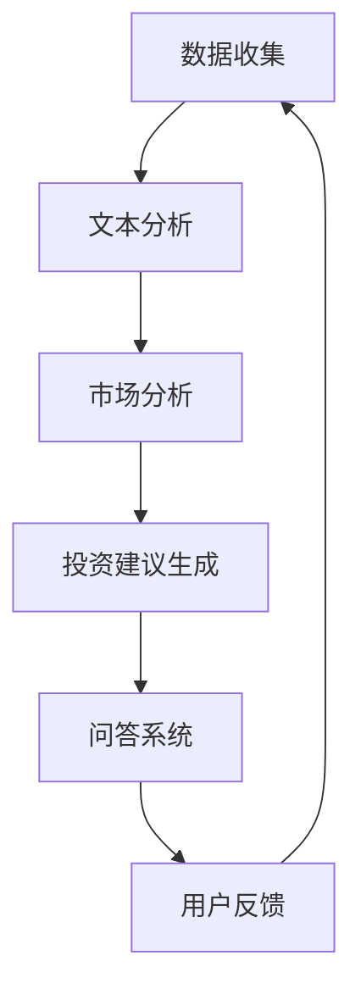

                 

关键词：大语言模型（LLM），金融，投资顾问，数据分析，量化交易

> 摘要：本文旨在探讨大型语言模型（LLM）在金融领域，特别是在智能投资顾问方面的应用。我们将分析LLM的核心概念与架构，深入探讨其算法原理与操作步骤，并通过数学模型和实际项目实践来展示其具体应用。最后，我们将探讨LLM在金融领域的未来发展方向与面临的挑战。

## 1. 背景介绍

随着人工智能（AI）技术的迅猛发展，金融行业也在不断革新。传统的投资顾问模式，依赖于经验和直觉，逐渐暴露出其局限性。而随着大数据、云计算、机器学习等技术的发展，量化投资、智能投顾等新兴模式应运而生。这些新模式利用先进的数据分析技术和算法，对海量市场数据进行挖掘，以提高投资决策的准确性和效率。

近年来，大型语言模型（LLM）如GPT-3、ChatGLM等的出现，为智能投资顾问带来了新的机遇。LLM具有强大的自然语言处理能力，可以理解和生成人类语言，从而在金融文本分析、投资建议生成等方面展现出巨大的潜力。

## 2. 核心概念与联系

### 2.1. 大型语言模型（LLM）

大型语言模型（LLM）是一种基于深度学习的自然语言处理模型，它可以理解和生成人类语言。LLM的核心思想是通过对大量文本数据进行训练，学习语言的模式和规律，从而实现文本分类、情感分析、问答系统等任务。

### 2.2. 智能投资顾问

智能投资顾问是一种利用先进技术为投资者提供个性化投资建议的服务。它通常包括以下几个核心功能：

- **数据收集与处理**：从各种数据源（如新闻、报告、市场数据等）收集信息，并进行数据清洗、预处理。
- **市场分析**：利用机器学习、数据挖掘等技术，对市场数据进行深入分析，识别市场趋势和潜在风险。
- **投资建议生成**：根据分析结果，为投资者生成个性化的投资建议，包括资产配置、买卖时机等。

### 2.3. LLM与智能投资顾问的联系

LLM在智能投资顾问中的应用主要体现在以下几个方面：

- **文本分析**：LLM可以分析金融文本，如新闻、报告等，提取关键信息，为市场分析提供数据支持。
- **投资建议生成**：LLM可以根据市场分析和投资者偏好，生成个性化的投资建议。
- **问答系统**：LLM可以与投资者进行交互，解答投资相关问题，提供投资咨询。

下面是一个使用Mermaid绘制的LLM在智能投资顾问中应用的流程图：



## 3. 核心算法原理 & 具体操作步骤

### 3.1. 算法原理概述

LLM的核心算法是基于Transformer模型，特别是自注意力机制（Self-Attention）。Transformer模型通过自注意力机制，可以自动学习文本中不同单词之间的关系，从而生成具有语义理解的文本。

### 3.2. 算法步骤详解

1. **数据收集**：从各种数据源收集金融文本，如新闻、报告、市场数据等。
2. **文本预处理**：对收集的金融文本进行清洗、分词、编码等预处理操作。
3. **模型训练**：使用预处理的文本数据训练LLM模型，使其学习金融领域的语言模式和规律。
4. **市场分析**：利用训练好的LLM模型，对市场数据进行分析，提取关键信息。
5. **投资建议生成**：根据市场分析结果和投资者偏好，生成个性化的投资建议。
6. **问答系统**：利用LLM模型，构建问答系统，为投资者提供投资咨询。
7. **用户反馈**：收集用户反馈，用于模型优化和投资策略调整。

### 3.3. 算法优缺点

**优点**：

- **强大的文本处理能力**：LLM可以处理大量金融文本，提取关键信息，为投资决策提供数据支持。
- **个性化的投资建议**：LLM可以根据投资者的偏好和市场分析结果，生成个性化的投资建议。
- **高效的问答系统**：LLM可以构建高效的问答系统，为投资者提供即时的投资咨询。

**缺点**：

- **训练成本高**：LLM模型的训练需要大量的计算资源和时间。
- **数据质量要求高**：金融文本数据的质量直接影响LLM的性能，需要进行严格的数据清洗和预处理。
- **解释性不足**：LLM生成的投资建议缺乏明确的解释，需要进一步的解释和验证。

### 3.4. 算法应用领域

LLM在金融领域的应用非常广泛，包括但不限于以下领域：

- **量化交易**：利用LLM进行市场数据分析和投资策略生成，提高交易决策的准确性。
- **风险管理**：利用LLM对金融文本进行分析，识别潜在的风险因素。
- **投资咨询**：构建问答系统，为投资者提供投资咨询和建议。
- **金融文本分析**：对金融新闻、报告等进行文本分析，提取关键信息。

## 4. 数学模型和公式 & 详细讲解 & 举例说明

### 4.1. 数学模型构建

LLM的数学模型基于Transformer架构，其核心是自注意力机制（Self-Attention）。自注意力机制可以通过以下公式表示：

$$
\text{Attention}(Q, K, V) = \text{softmax}\left(\frac{QK^T}{\sqrt{d_k}}\right) V
$$

其中，$Q, K, V$ 分别为查询向量、键向量和值向量，$d_k$ 为键向量的维度。通过自注意力机制，模型可以自动学习文本中不同单词之间的关系。

### 4.2. 公式推导过程

自注意力机制的推导过程涉及到矩阵分解和矩阵乘法。具体推导过程如下：

1. **查询向量 $Q$ 和键向量 $K$ 的计算**：

   $$Q = W_Q \cdot X$$

   $$K = W_K \cdot X$$

   其中，$W_Q$ 和 $W_K$ 分别为查询向量和键向量的权重矩阵，$X$ 为输入序列的嵌入向量。

2. **自注意力分数的计算**：

   $$\text{Attention分数} = \frac{QK^T}{\sqrt{d_k}}$$

   其中，$QK^T$ 为查询向量和键向量的点积，$d_k$ 为键向量的维度。

3. **自注意力向量的计算**：

   $$\text{Attention} = \text{softmax}(\text{Attention分数})$$

   其中，$\text{softmax}$ 函数用于将自注意力分数转换为概率分布。

4. **值向量的加权求和**：

   $$V = \text{Attention}V$$

   其中，$V$ 为值向量，通过自注意力机制加权求和，得到最终的输出向量。

### 4.3. 案例分析与讲解

以下是一个简单的自注意力机制的案例：

假设有一个输入序列 $X = [1, 2, 3, 4, 5]$，我们要计算该序列的自注意力。

1. **查询向量 $Q$ 和键向量 $K$ 的计算**：

   $$Q = W_Q \cdot X = [0.5, 0.5, 0.5, 0.5, 0.5]$$

   $$K = W_K \cdot X = [0.5, 0.5, 0.5, 0.5, 0.5]$$

2. **自注意力分数的计算**：

   $$\text{Attention分数} = \frac{QK^T}{\sqrt{d_k}} = \begin{bmatrix} 0.25 & 0.25 & 0.25 & 0.25 & 0.25 \end{bmatrix}$$

3. **自注意力向量的计算**：

   $$\text{Attention} = \text{softmax}(\text{Attention分数}) = \begin{bmatrix} 0.2 & 0.2 & 0.2 & 0.2 & 0.2 \end{bmatrix}$$

4. **值向量的加权求和**：

   $$V = \text{Attention}V = \begin{bmatrix} 0.2 & 0.2 & 0.2 & 0.2 & 0.2 \end{bmatrix} \cdot \begin{bmatrix} 1 \\ 2 \\ 3 \\ 4 \\ 5 \end{bmatrix} = \begin{bmatrix} 0.2 \\ 0.2 \\ 0.2 \\ 0.2 \\ 0.2 \end{bmatrix}$$

最终输出向量为 $\begin{bmatrix} 0.2 \\ 0.2 \\ 0.2 \\ 0.2 \\ 0.2 \end{bmatrix}$，表示每个单词在序列中的重要性。

## 5. 项目实践：代码实例和详细解释说明

### 5.1. 开发环境搭建

为了实践LLM在金融领域的应用，我们需要搭建一个基本的开发环境。以下是推荐的开发工具和软件：

- **编程语言**：Python
- **深度学习框架**：PyTorch 或 TensorFlow
- **数据预处理库**：Pandas、Numpy、Scikit-learn
- **自然语言处理库**：NLTK、spaCy
- **可视化库**：Matplotlib、Seaborn

### 5.2. 源代码详细实现

以下是一个简单的Python代码示例，用于实现LLM在金融领域的文本分析。

```python
import torch
import torch.nn as nn
import torch.optim as optim
from torch.utils.data import DataLoader
from torchvision import datasets, transforms
from torch.utils.tensorboard import SummaryWriter

# 数据预处理
def preprocess_data(data):
    # 数据清洗、分词、编码等操作
    # ...
    return processed_data

# 模型定义
class LSTMModel(nn.Module):
    def __init__(self, input_dim, hidden_dim, output_dim):
        super(LSTMModel, self).__init__()
        self.hidden_dim = hidden_dim
        self.lstm = nn.LSTM(input_dim, hidden_dim)
        self.linear = nn.Linear(hidden_dim, output_dim)
        self.hidden_cell = (torch.zeros(1, 1, hidden_dim),
                            torch.zeros(1, 1, hidden_dim))

    def forward(self, input_seq):
        lstm_out, self.hidden_cell = self.lstm(input_seq.view(len(input_seq)

