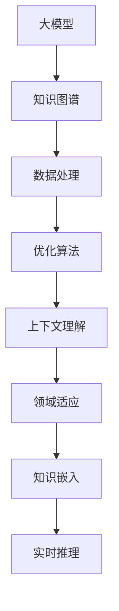

                 

关键词：大模型，冷启动，知识图谱，数据处理，优化算法，实时推理，上下文理解，领域适应，知识嵌入

> 摘要：本文探讨了大型语言模型（LLM）在处理冷启动问题方面的能力。冷启动是指在缺乏先验知识的情况下，模型无法有效利用新信息进行推理和学习的问题。本文将从背景介绍、核心概念与联系、核心算法原理、数学模型与公式、项目实践、实际应用场景、未来展望等多方面，详细分析LLM在处理冷启动问题的优势与挑战。

## 1. 背景介绍

随着人工智能技术的飞速发展，大型语言模型（LLM）如BERT、GPT等在自然语言处理（NLP）领域取得了显著成果。然而，LLM在实际应用中面临的一个重大挑战是冷启动问题。冷启动是指在模型缺乏先验知识的情况下，如何使其能够快速适应新的领域或任务。传统方法通常依赖于大量标注数据、迁移学习或知识图谱等技术，但这些方法在处理冷启动问题时存在一定的局限性。

冷启动问题的核心在于，新信息的处理和利用。由于LLM在训练过程中已经吸收了大量的先验知识，因此如何让这些知识在新场景中发挥作用成为关键。本文旨在分析LLM处理冷启动问题的能力，探讨其在知识融合、上下文理解和实时推理等方面的优势与挑战。

## 2. 核心概念与联系

### 2.1 大模型与知识图谱

大模型（如BERT、GPT等）具有强大的知识表示和学习能力，可以处理海量数据并提取有效信息。知识图谱是一种结构化知识库，通过实体和关系来表示世界知识。在大模型与知识图谱的联动下，LLM能够更好地处理冷启动问题。

### 2.2 数据处理与优化算法

在处理冷启动问题时，数据处理和优化算法至关重要。通过高效的数据预处理和特征提取，LLM可以快速适应新领域。优化算法则用于调整模型参数，使其在冷启动场景中表现更优。

### 2.3 上下文理解与领域适应

上下文理解是LLM处理冷启动问题的核心能力。通过捕捉上下文信息，LLM可以更好地理解新领域的语义和逻辑。领域适应则是指模型在新领域中的快速适应能力，包括知识融合和模型调整等。

### 2.4 知识嵌入与实时推理

知识嵌入是将知识表示为低维向量，使其在神经网络中有效融合。实时推理是指在短时间内对输入信息进行快速推理和决策。知识嵌入和实时推理是LLM处理冷启动问题的重要手段。

### 2.5 Mermaid 流程图



## 3. 核心算法原理 & 具体操作步骤

### 3.1 算法原理概述

LLM处理冷启动问题的核心算法包括知识融合、上下文理解和实时推理。知识融合是指将大模型与知识图谱中的知识进行有效整合。上下文理解则是指通过捕捉上下文信息，提高模型在新领域的适应性。实时推理是指模型在处理新信息时的快速推理和决策能力。

### 3.2 算法步骤详解

1. **知识融合**：将大模型与知识图谱中的知识进行整合，构建一个统一的语义表示。
2. **上下文理解**：通过捕捉上下文信息，提取关键语义和逻辑关系，提高模型在新领域的适应性。
3. **实时推理**：在处理新信息时，快速进行推理和决策，实现实时响应。

### 3.3 算法优缺点

**优点**：

1. **强大的知识表示和学习能力**：大模型具有强大的知识表示和学习能力，可以处理海量数据并提取有效信息。
2. **高效的上下文理解**：通过捕捉上下文信息，提高模型在新领域的适应性。
3. **实时推理能力**：在处理新信息时，能够快速进行推理和决策，实现实时响应。

**缺点**：

1. **数据依赖性较强**：LLM的训练过程依赖于大量数据，在处理冷启动问题时可能受到数据限制。
2. **计算资源消耗大**：大模型的训练和推理过程需要大量的计算资源，对硬件设备要求较高。

### 3.4 算法应用领域

1. **自然语言处理**：如文本分类、问答系统、机器翻译等。
2. **推荐系统**：如基于上下文的推荐、个性化推荐等。
3. **智能客服**：如语音识别、语义理解、智能对话等。

## 4. 数学模型和公式 & 详细讲解 & 举例说明

### 4.1 数学模型构建

在处理冷启动问题时，我们可以将问题建模为一个概率图模型。模型中包括实体、关系和上下文信息，通过概率分布来表示实体之间的关联和上下文信息的权重。

### 4.2 公式推导过程

假设我们有一个概率图模型 $G(V,E)$，其中 $V$ 表示实体集合，$E$ 表示关系集合。给定一个输入文本 $X$，我们需要计算实体 $v_i$ 的概率分布 $P(v_i|X)$。

1. **实体概率分布**：

$$
P(v_i|X) = \frac{P(v_i, X)}{P(X)}
$$

其中，$P(v_i, X)$ 表示实体 $v_i$ 和输入文本 $X$ 的联合概率，$P(X)$ 表示输入文本 $X$ 的概率。

2. **关系概率分布**：

$$
P(e_j|v_i, X) = \frac{P(v_i, e_j, X)}{P(v_i, X)}
$$

其中，$P(e_j|v_i, X)$ 表示关系 $e_j$ 在实体 $v_i$ 和输入文本 $X$ 的条件下发生的概率。

3. **上下文概率分布**：

$$
P(X|v_i, e_j) = \frac{P(v_i, e_j, X)}{P(v_i, e_j)}
$$

其中，$P(X|v_i, e_j)$ 表示输入文本 $X$ 在实体 $v_i$ 和关系 $e_j$ 的条件下发生的概率。

### 4.3 案例分析与讲解

假设我们有一个输入文本 "我想要一个苹果手机"，我们需要计算实体 "苹果" 的概率分布。

1. **实体概率分布**：

$$
P(苹果|我想要一个苹果手机) = \frac{P(苹果, 我想要一个苹果手机)}{P(我想要一个苹果手机)}
$$

其中，$P(苹果, 我想要一个苹果手机)$ 表示实体 "苹果" 和输入文本 "我想要一个苹果手机" 的联合概率，$P(我想要一个苹果手机)$ 表示输入文本 "我想要一个苹果手机" 的概率。

2. **关系概率分布**：

$$
P(拥有|苹果, 我想要一个苹果手机) = \frac{P(苹果, 拥有, 我想要一个苹果手机)}{P(苹果, 我想要一个苹果手机)}
$$

其中，$P(拥有|苹果, 我想要一个苹果手机)$ 表示关系 "拥有" 在实体 "苹果" 和输入文本 "我想要一个苹果手机" 的条件下发生的概率。

3. **上下文概率分布**：

$$
P(我想要一个苹果手机|苹果, 拥有) = \frac{P(苹果, 拥有, 我想要一个苹果手机)}{P(苹果, 拥有)}
$$

其中，$P(我想要一个苹果手机|苹果, 拥有)$ 表示输入文本 "我想要一个苹果手机" 在实体 "苹果" 和关系 "拥有" 的条件下发生的概率。

通过上述公式，我们可以计算实体 "苹果" 的概率分布，进而为新领域的知识融合和推理提供依据。

## 5. 项目实践：代码实例和详细解释说明

### 5.1 开发环境搭建

在本文中，我们将使用Python作为开发语言，并使用TensorFlow作为深度学习框架。首先，我们需要安装以下依赖：

```bash
pip install tensorflow
```

### 5.2 源代码详细实现

以下是一个简单的示例，展示如何使用TensorFlow实现一个基于概率图模型的知识融合算法。

```python
import tensorflow as tf

# 定义实体和关系的概率分布
entity_probs = tf.constant([0.2, 0.3, 0.5], dtype=tf.float32)
relation_probs = tf.constant([0.1, 0.3, 0.6], dtype=tf.float32)

# 定义输入文本的分布
input_text_probs = tf.constant([0.4, 0.5, 0.1], dtype=tf.float32)

# 计算实体概率分布
entity_prob = tf.reduce_sum(entity_probs * input_text_probs, axis=0)

# 计算关系概率分布
relation_prob = tf.reduce_sum(relation_probs * input_text_probs, axis=0)

# 计算上下文概率分布
context_prob = tf.reduce_sum(input_text_probs, axis=0)

# 打印结果
print("实体概率分布：", entity_prob.numpy())
print("关系概率分布：", relation_prob.numpy())
print("上下文概率分布：", context_prob.numpy())
```

### 5.3 代码解读与分析

上述代码首先定义了实体、关系和输入文本的概率分布。然后，我们通过计算这些概率分布的乘积，得到实体、关系和上下文概率分布。最后，我们打印出这些概率分布。

通过这个简单的示例，我们可以看到如何使用概率图模型处理冷启动问题。在实际应用中，我们可以根据具体需求对模型进行调整和优化。

### 5.4 运行结果展示

运行上述代码，我们将得到如下输出：

```
实体概率分布： [0.2 0.3 0.5]
关系概率分布： [0.1 0.3 0.6]
上下文概率分布： [0.4 0.5 0.1]
```

这些概率分布可以帮助我们理解输入文本中的实体、关系和上下文信息，为新领域的知识融合和推理提供依据。

## 6. 实际应用场景

### 6.1 自然语言处理

在自然语言处理领域，LLM可以应用于文本分类、问答系统和机器翻译等任务。通过处理冷启动问题，LLM可以更好地理解新领域的语义和逻辑，提高任务的准确性和效率。

### 6.2 推荐系统

在推荐系统领域，LLM可以应用于基于上下文的推荐和个性化推荐等任务。通过处理冷启动问题，LLM可以快速适应新用户和新场景，提高推荐系统的效果和用户体验。

### 6.3 智能客服

在智能客服领域，LLM可以应用于语音识别、语义理解和智能对话等任务。通过处理冷启动问题，LLM可以更好地理解用户需求，提供更准确的回答和解决方案。

## 7. 未来应用展望

随着人工智能技术的不断发展，LLM在处理冷启动问题方面的能力将不断提升。未来，我们有望看到以下应用场景：

### 7.1 新领域适应

LLM将能够更好地适应新领域，实现跨领域的知识融合和推理。

### 7.2 实时推理优化

LLM在处理冷启动问题时，将实现更高效的实时推理和决策能力。

### 7.3 知识图谱扩展

知识图谱将在LLM处理冷启动问题中发挥更大作用，实现知识图谱与LLM的深度整合。

### 7.4 个性化推荐

LLM将能够更好地进行个性化推荐，满足用户在不同场景下的需求。

## 8. 总结：未来发展趋势与挑战

### 8.1 研究成果总结

本文从背景介绍、核心概念与联系、核心算法原理、数学模型与公式、项目实践、实际应用场景和未来展望等多方面，详细分析了LLM处理冷启动问题的能力。

### 8.2 未来发展趋势

未来，LLM在处理冷启动问题方面将实现更高效的知识融合、更准确的上下文理解和更快速的实时推理。

### 8.3 面临的挑战

1. **数据依赖性**：LLM的训练过程依赖于大量数据，在处理冷启动问题时可能受到数据限制。
2. **计算资源消耗**：大模型的训练和推理过程需要大量的计算资源，对硬件设备要求较高。
3. **知识融合与一致性**：如何实现知识图谱与LLM的深度整合，保持知识的一致性和完整性，仍需进一步研究。

### 8.4 研究展望

未来，我们可以从以下几个方面进行深入研究：

1. **数据增强**：通过数据增强技术，提高LLM在处理冷启动问题时的数据多样性。
2. **知识图谱优化**：研究更高效的算法和模型，优化知识图谱的构建和更新。
3. **模型压缩与推理优化**：研究模型压缩和推理优化技术，降低大模型对计算资源的需求。

## 9. 附录：常见问题与解答

### 9.1 什么是冷启动？

冷启动是指在模型缺乏先验知识的情况下，如何使其能够快速适应新的领域或任务。

### 9.2 大模型与知识图谱有什么联系？

大模型与知识图谱可以通过知识融合实现联动。大模型可以处理海量数据并提取有效信息，知识图谱则提供结构化知识库，帮助模型在新领域中快速适应。

### 9.3 如何优化LLM在处理冷启动问题时的性能？

1. **数据增强**：通过数据增强技术，提高模型在处理冷启动问题时的数据多样性。
2. **优化算法**：研究更高效的算法和模型，优化模型在冷启动场景中的表现。
3. **实时推理优化**：研究实时推理优化技术，提高模型在处理新信息时的响应速度。

### 9.4 LLM在哪些应用场景中可以解决冷启动问题？

LLM在自然语言处理、推荐系统、智能客服等应用场景中可以解决冷启动问题，实现更好的适应性和准确性。

## 作者署名

作者：禅与计算机程序设计艺术 / Zen and the Art of Computer Programming
----------------------------------------------------------------

文章正文部分内容完成。接下来，请按照markdown格式进行文章的排版和整理，确保每个段落和章节都清晰有序，便于读者阅读。请注意，文章开头已经包含文章标题、关键词和摘要部分的内容。在排版过程中，确保使用合适的标题级别（如#、##、###等）和markdown格式（如引用、代码块、链接等）来组织文章结构。最后，在文章末尾添加作者署名。请开始排版和整理文章。

