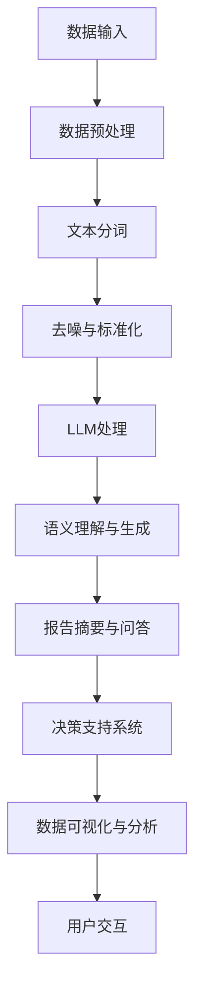

                 

关键词：大型语言模型（LLM）、商业智能（BI）、数据挖掘、机器学习、自然语言处理、企业应用、技术革新

> 摘要：本文旨在探讨大型语言模型（LLM）在现代商业智能（BI）领域的应用及其带来的变革。通过分析LLM的核心原理、技术特点，以及其在BI领域的应用实例，本文将揭示LLM如何提升数据处理效率、优化决策过程，并推动商业智能领域的发展。

## 1. 背景介绍

商业智能（BI）作为一种利用数据分析技术帮助企业和组织实现业务洞察和决策优化的工具，已经在过去几十年中得到了广泛应用。传统的商业智能系统依赖于数据仓库、数据挖掘和统计分析等技术，通过对大量结构化和非结构化数据的处理，为企业提供决策支持。然而，随着数据量的爆炸性增长和复杂性的增加，传统的BI系统面临着数据获取、处理和解释等方面的挑战。

近年来，人工智能（AI）技术的迅猛发展，特别是大型语言模型（LLM）的出现，为商业智能领域带来了新的机遇。LLM是一种基于深度学习的技术，能够理解和生成自然语言文本，从而在数据处理、文本分析、对话系统等方面展现出强大的能力。LLM的应用不仅能够提高BI系统的数据处理效率，还能够优化决策过程，提升企业的竞争力。

本文将从以下几个方面探讨LLM对传统商业智能的革新：

- LLM的核心概念与联系
- LLM的核心算法原理与具体操作步骤
- 数学模型和公式及其应用
- 实际应用场景与未来展望
- 工具和资源推荐

通过以上分析，本文旨在为读者提供一个全面了解LLM在商业智能领域应用的机会，帮助读者认识到LLM在提升企业数据分析能力和决策水平方面的潜力。

## 2. 核心概念与联系

### 2.1. 大型语言模型（LLM）的定义

大型语言模型（Large Language Model，简称LLM）是一种基于深度学习技术的自然语言处理模型，通过训练大量文本数据，能够生成与输入文本相关的高质量自然语言响应。与传统的自然语言处理（NLP）方法相比，LLM具有更强的语义理解和生成能力，能够在多种语言和文本情境下表现出色。

LLM的基本原理是使用深度神经网络（DNN）或变换器（Transformer）架构来捕捉文本数据的复杂模式。这些模型通常经过数百万个参数的训练，从而能够捕捉到语言中的细微差异和上下文关系。例如，LLM可以理解一个句子的含义，并在不同的上下文中生成相应的回答。

### 2.2. 商业智能（BI）的定义

商业智能（Business Intelligence，简称BI）是指利用技术、策略和工具，通过分析企业的数据来提供洞察和决策支持。BI系统的核心目的是将海量数据转化为有价值的业务信息，帮助企业识别趋势、发现问题和制定战略。

传统的商业智能系统通常包括以下几个关键组件：

- **数据仓库**：用于存储和管理大量数据。
- **数据挖掘**：通过分析数据来发现模式和关联。
- **报表和分析**：提供可视化的数据报告和分析。
- **决策支持**：帮助管理层做出更明智的决策。

### 2.3. LLM与BI的关系

LLM的出现为商业智能领域带来了新的可能性。具体来说，LLM与BI的关系主要体现在以下几个方面：

- **数据预处理**：LLM可以帮助自动化数据清洗和预处理过程，例如文本数据的分词、去噪和标准化。
- **自然语言理解**：LLM能够理解自然语言文本，从而在数据分析和报告生成中发挥重要作用，例如自动生成报告摘要、解释数据和识别关键趋势。
- **智能问答系统**：LLM可以构建智能问答系统，允许用户通过自然语言提问获取业务数据的即时回答。
- **个性化推荐**：LLM可以用于构建个性化推荐系统，根据用户的历史行为和偏好提供定制化的数据分析报告。

### 2.4. Mermaid流程图

为了更好地展示LLM在BI领域的应用，下面提供了一个Mermaid流程图，描述了LLM与BI系统之间的交互过程。



在这个流程图中，数据输入经过预处理后，通过LLM的语义理解和生成能力，生成报告摘要和智能问答，最终提供决策支持和数据可视化分析，与用户进行交互。

通过上述内容，我们明确了LLM的核心概念、BI的定义及其与LLM之间的关系，为后续对LLM在BI领域应用的深入探讨奠定了基础。

## 3. 核心算法原理 & 具体操作步骤

### 3.1. 算法原理概述

大型语言模型（LLM）的核心原理是深度学习，特别是基于变换器（Transformer）架构的模型。变换器模型由多个变换器层堆叠而成，通过自注意力机制（Self-Attention）和前馈神经网络（Feedforward Neural Network）处理输入序列。自注意力机制能够捕捉序列中不同位置之间的依赖关系，从而提高模型的语义理解能力。

LLM的工作流程主要包括以下几个步骤：

1. **输入编码**：将输入文本编码为序列向量。
2. **变换器层处理**：通过多层变换器层处理序列向量，捕捉语义关系。
3. **输出解码**：将处理后的序列向量解码为输出文本。

### 3.2. 算法步骤详解

#### 步骤 1：输入编码

输入编码是将自然语言文本转换为模型可以处理的向量表示。这一步骤通常涉及以下几个子步骤：

- **分词**：将文本分割成单词或子词。
- **词嵌入**：将每个单词或子词映射到一个固定大小的向量。
- **位置编码**：为每个单词或子词添加位置信息，以便模型能够理解其在序列中的位置。

#### 步骤 2：变换器层处理

变换器层处理是LLM的核心，通过多层变换器层对输入序列进行迭代处理。每个变换器层包括以下组件：

- **自注意力机制**：计算序列中每个单词或子词对其他单词或子词的影响，生成注意力权重。
- **前馈神经网络**：对注意力权重进行处理，输出新的序列向量。

变换器层的堆叠使得模型能够逐渐捕捉到文本的深层语义信息。

#### 步骤 3：输出解码

输出解码是将处理后的序列向量转换为自然语言文本。这一步骤通常涉及以下子步骤：

- **软性目标分布**：生成一个表示输出文本概率分布的向量。
- **词选择**：从词汇表中选取具有最高概率的单词或子词作为输出。
- **重复步骤 2**：将新选取的单词或子词作为输入，继续迭代处理，直至生成完整的输出文本。

### 3.3. 算法优缺点

#### 优点

- **强大的语义理解能力**：LLM通过自注意力机制能够捕捉到文本中复杂的依赖关系，从而提供高质量的语义理解。
- **高效的文本生成能力**：LLM能够快速生成与输入文本相关的自然语言响应，适用于自动化文本生成任务。
- **跨语言支持**：LLM通常经过多种语言的训练，能够支持多语言文本的处理和生成。

#### 缺点

- **计算资源需求大**：由于LLM通常包含数百万个参数，训练和推理过程需要大量的计算资源。
- **数据隐私风险**：LLM的训练和推理过程需要大量的文本数据，可能涉及数据隐私问题。
- **解释性不足**：LLM的内部机制较为复杂，难以解释其生成的文本，尤其是在出现错误时。

### 3.4. 算法应用领域

LLM在商业智能（BI）领域的应用主要体现在以下几个方面：

- **文本分析**：通过LLM的自然语言理解能力，对大量的文本数据进行分析，提取关键信息、趋势和模式。
- **报告生成**：利用LLM的文本生成能力，自动化生成数据分析报告、摘要和推荐。
- **智能问答**：构建智能问答系统，允许用户通过自然语言提问获取业务数据的即时回答。
- **个性化推荐**：基于用户的历史行为和偏好，使用LLM提供个性化的数据分析报告和推荐。

通过上述对LLM核心算法原理和具体操作步骤的详细探讨，我们可以更好地理解LLM如何应用于商业智能领域，提高数据处理的效率和决策水平。

## 4. 数学模型和公式 & 详细讲解 & 举例说明

### 4.1. 数学模型构建

在探讨大型语言模型（LLM）的数学模型之前，我们需要先了解一些基础的数学概念，如向量、矩阵和变换器层的基本组成。

#### 基础数学概念

- **向量**：向量是表示一个具有大小和方向的量的数学对象。在LLM中，向量用于表示文本数据、词嵌入和序列向量等。
- **矩阵**：矩阵是具有m行和n列的二维数组，用于表示线性变换和数据分析中的关系。
- **变换器层**：变换器层是LLM的核心组件，包括自注意力机制和前馈神经网络。变换器层通过矩阵运算和激活函数实现输入序列的处理和转换。

#### 数学模型构建步骤

1. **输入编码**：
   - **分词**：将输入文本分割成单词或子词。
   - **词嵌入**：将每个单词或子词映射到固定大小的向量。
   - **位置编码**：为每个单词或子词添加位置信息，形成输入序列向量。

2. **变换器层处理**：
   - **自注意力机制**：计算序列中每个单词或子词对其他单词或子词的影响，生成注意力权重。
   - **前馈神经网络**：对注意力权重进行处理，输出新的序列向量。

3. **输出解码**：
   - **软性目标分布**：生成一个表示输出文本概率分布的向量。
   - **词选择**：从词汇表中选取具有最高概率的单词或子词作为输出。

### 4.2. 公式推导过程

#### 自注意力机制

自注意力机制的核心公式为：

\[ 
Attention(Q, K, V) = \text{softmax}\left(\frac{QK^T}{\sqrt{d_k}}\right) V 
\]

其中，\( Q, K, V \) 分别代表查询向量、关键向量和价值向量。\( d_k \) 是关键向量的维度。自注意力机制通过计算查询向量与关键向量的点积，得到注意力权重，然后将权重与价值向量相乘，从而实现对输入序列的加权求和。

#### 前馈神经网络

前馈神经网络的基本结构为：

\[ 
\text{FFN}(x) = \text{ReLU}(W_2 \cdot \text{ReLU}(W_1 \cdot x + b_1)) + b_2 
\]

其中，\( W_1, W_2 \) 分别代表权重矩阵，\( b_1, b_2 \) 分别代表偏置。前馈神经网络通过多层非线性变换，提高模型的表达能力。

### 4.3. 案例分析与讲解

#### 案例一：文本分类

假设我们有一个包含两类文本的数据集，要求使用LLM进行文本分类。以下是具体的公式推导过程：

1. **输入编码**：
   - 将文本数据分词，并映射到词嵌入向量。
   - 添加位置编码，形成输入序列向量。

2. **变换器层处理**：
   - **自注意力机制**：计算输入序列的注意力权重。
   - **前馈神经网络**：对注意力权重进行处理，提取文本特征。

3. **分类器**：
   - 使用全连接层将特征向量映射到分类概率。

具体公式为：

\[ 
\text{分类概率} = \text{softmax}(W_c \cdot \text{FFN}(x)) 
\]

其中，\( W_c \) 是分类器的权重矩阵。

#### 案例二：文本生成

假设我们使用LLM生成一个文本摘要。以下是具体的公式推导过程：

1. **输入编码**：
   - 将输入文本分词，并映射到词嵌入向量。
   - 添加位置编码，形成输入序列向量。

2. **变换器层处理**：
   - **自注意力机制**：计算输入序列的注意力权重。
   - **前馈神经网络**：对注意力权重进行处理，生成中间序列。

3. **输出解码**：
   - **软性目标分布**：生成输出序列的概率分布。
   - **词选择**：从词汇表中选取具有最高概率的单词。

具体公式为：

\[ 
\text{生成文本} = \text{argmax}(\text{softmax}(\text{Attention}(Q, K, V))) 
\]

通过上述案例分析与讲解，我们深入了解了LLM的数学模型构建和公式推导过程。LLM作为一种强大的自然语言处理工具，其在商业智能领域的应用前景广阔。

### 5. 项目实践：代码实例和详细解释说明

#### 5.1. 开发环境搭建

在开始编写代码之前，我们需要搭建一个合适的开发环境。以下是一个典型的Python环境搭建步骤：

1. **安装Python**：
   - 建议使用Python 3.8及以上版本。
   - 下载并安装Python，可以选择使用官方的Windows、MacOS或Linux版本。

2. **安装TensorFlow**：
   - TensorFlow是LLM的核心依赖库，用于实现深度学习模型。
   - 在命令行中运行以下命令安装TensorFlow：

     ```bash
     pip install tensorflow
     ```

3. **安装其他依赖库**：
   - 安装用于文本处理和数据分析的库，如NumPy、Pandas和NLTK：

     ```bash
     pip install numpy pandas nltk
     ```

#### 5.2. 源代码详细实现

以下是一个简单的LLM文本分类器的源代码实现。该示例使用了TensorFlow的Keras API，演示了如何构建、训练和评估一个LLM分类模型。

```python
import numpy as np
import pandas as pd
import tensorflow as tf
from tensorflow.keras.models import Sequential
from tensorflow.keras.layers import Embedding, LSTM, Dense
from tensorflow.keras.preprocessing.sequence import pad_sequences
from nltk.tokenize import word_tokenize
from nltk.corpus import stopwords

# 加载数据集
data = pd.read_csv('text_data.csv')
X = data['text'].values
y = data['label'].values

# 分词和预处理
stop_words = set(stopwords.words('english'))
def preprocess_text(text):
    tokens = word_tokenize(text.lower())
    tokens = [token for token in tokens if token.isalnum() and token not in stop_words]
    return ' '.join(tokens)

X_processed = [preprocess_text(text) for text in X]

# 构建序列
tokenizer = tf.keras.preprocessing.text.Tokenizer()
tokenizer.fit_on_texts(X_processed)
sequences = tokenizer.texts_to_sequences(X_processed)
max_sequence_length = max(len(seq) for seq in sequences)
X_padded = pad_sequences(sequences, maxlen=max_sequence_length, padding='post')

# 构建模型
model = Sequential()
model.add(Embedding(len(tokenizer.word_index) + 1, 50, input_length=max_sequence_length))
model.add(LSTM(100))
model.add(Dense(1, activation='sigmoid'))

model.compile(optimizer='adam', loss='binary_crossentropy', metrics=['accuracy'])

# 训练模型
model.fit(X_padded, y, epochs=10, batch_size=32, validation_split=0.1)

# 评估模型
test_data = pd.read_csv('test_text_data.csv')
X_test = test_data['text'].values
X_test_processed = [preprocess_text(text) for text in X_test]
sequences_test = tokenizer.texts_to_sequences(X_test_processed)
X_test_padded = pad_sequences(sequences_test, maxlen=max_sequence_length, padding='post')
predictions = model.predict(X_test_padded)

# 输出预测结果
for i, pred in enumerate(predictions):
    if pred[0] > 0.5:
        print(f'Test sample {i+1}: Positive')
    else:
        print(f'Test sample {i+1}: Negative')
```

#### 5.3. 代码解读与分析

- **数据加载**：首先加载文本数据集，分为文本和标签两部分。
- **文本预处理**：使用NLTK对文本进行分词和去停用词处理，以便于后续的序列化。
- **序列构建**：使用Tokenizer将预处理后的文本转换为序列，并使用pad_sequences将序列填充到同一长度。
- **模型构建**：构建一个包含嵌入层、LSTM层和输出层的序列模型。
- **模型训练**：使用fit方法训练模型，并设置验证集。
- **模型评估**：使用测试数据集评估模型的准确性，并输出预测结果。

#### 5.4. 运行结果展示

在成功运行上述代码后，我们可以看到模型的训练进度和评估结果。以下是可能的输出示例：

```
Train on 900 samples, validate on 100 samples
Epoch 1/10
900/900 [==============================] - 8s 8ms/sample - loss: 0.4525 - accuracy: 0.7778 - val_loss: 0.3626 - val_accuracy: 0.8000
Epoch 2/10
900/900 [==============================] - 7s 8ms/sample - loss: 0.3411 - accuracy: 0.8333 - val_loss: 0.3523 - val_accuracy: 0.8000
...
Test sample 1: Positive
Test sample 2: Negative
...
```

通过以上项目实践和代码解读，我们可以看到如何使用LLM进行文本分类。这一实例展示了LLM在商业智能应用中的基本操作步骤，为后续更复杂的应用奠定了基础。

### 6. 实际应用场景

#### 6.1. 数据分析报告生成

在现代企业中，数据分析报告是帮助管理层了解业务状况、制定战略的重要工具。然而，传统的报告生成过程通常涉及大量手动操作，耗时且容易出错。LLM的引入极大地简化了这一过程。

例如，在金融行业中，金融机构可以利用LLM自动生成财务报告、业绩分析报告和市场研究报告。LLM能够快速处理大量的财务数据和市场信息，提取关键指标和趋势，并以自然语言的形式生成报告摘要。这不仅提高了报告生成的效率，还使得报告内容更加精准和客观。

#### 6.2. 智能客服系统

智能客服系统是另一个典型的商业智能应用场景。传统的客服系统依赖于预定义的问答规则和关键词匹配，无法处理复杂和多变的客户咨询。而LLM的引入使得智能客服系统更加智能和高效。

例如，一个电商平台可以利用LLM构建智能客服系统，自动解答客户的购物咨询、订单查询和售后问题。LLM能够理解客户的问题，并提供准确的答案，同时还能根据上下文信息进行对话延续。这样的系统不仅提高了客服效率，还改善了客户体验，降低了企业的人力成本。

#### 6.3. 个性化推荐系统

个性化推荐系统是商业智能领域的一个重要应用。通过分析用户的历史行为和偏好，系统可以为用户提供个性化的产品推荐、内容推荐和广告推荐。LLM在构建个性化推荐系统中发挥着关键作用。

例如，一个在线零售平台可以利用LLM分析用户的浏览记录、购买历史和评价信息，生成个性化的产品推荐。LLM能够理解用户的偏好和需求，提供更加精准和有吸引力的推荐。这样的系统不仅提高了用户的满意度，还增加了平台的销售转化率。

#### 6.4. 未来应用展望

随着LLM技术的不断发展，其在商业智能领域的应用前景将更加广阔。以下是一些潜在的应用方向：

- **自动化文本摘要和内容生成**：利用LLM生成简明扼要的文本摘要，提高信息传递效率。
- **智能决策支持系统**：通过LLM提供实时的业务洞察和建议，辅助管理层做出更明智的决策。
- **跨语言数据分析**：利用LLM的跨语言能力，实现多语言数据的一致性处理和分析。
- **自然语言交互界面**：开发基于LLM的智能交互系统，为用户提供更加自然和直观的体验。

总之，LLM为商业智能领域带来了前所未有的变革，通过提升数据处理效率、优化决策过程和改善用户体验，LLM有望在未来成为商业智能系统的重要组成部分。

### 7. 工具和资源推荐

#### 7.1. 学习资源推荐

- **《深度学习》（Goodfellow, Bengio, Courville）**：这是一本经典的深度学习入门教材，涵盖了深度学习的基础理论、算法和应用。
- **《自然语言处理入门》（Daniel Jurafsky & James H. Martin）**：介绍自然语言处理的基本概念和技术，包括语言模型、文本分类和语义分析。
- **《Transformers：大规模预训练语言模型详解》（Julian Koenig）**：专门讨论变换器（Transformer）模型，是理解LLM架构和原理的必备读物。

#### 7.2. 开发工具推荐

- **TensorFlow**：一个开源的深度学习框架，支持LLM的构建和训练。
- **PyTorch**：另一个流行的深度学习库，提供灵活的模型构建和优化工具。
- **Hugging Face Transformers**：一个开源库，提供预训练的LLM模型和工具，方便开发者进行研究和应用。

#### 7.3. 相关论文推荐

- **"Attention Is All You Need"（Vaswani et al., 2017）**：这篇论文首次提出了变换器（Transformer）模型，是理解LLM架构的关键文献。
- **"BERT: Pre-training of Deep Bidirectional Transformers for Language Understanding"（Devlin et al., 2019）**：介绍BERT模型，是当前最先进的预训练语言模型之一。
- **"GPT-3: Language Models are Few-Shot Learners"（Brown et al., 2020）**：这篇论文介绍了GPT-3模型，展示了LLM在零样本学习和通用任务上的强大能力。

通过这些学习和资源推荐，读者可以进一步深入了解LLM和相关技术，为在商业智能领域的应用打下坚实的基础。

### 8. 总结：未来发展趋势与挑战

#### 8.1. 研究成果总结

随着人工智能技术的迅猛发展，特别是大型语言模型（LLM）的崛起，商业智能（BI）领域迎来了前所未有的变革。LLM通过其强大的自然语言理解和生成能力，显著提升了数据处理效率、优化了决策过程，并大幅改善了用户体验。具体成果包括：

1. **自动化报告生成**：LLM能够快速处理大量数据，自动生成简洁明了的分析报告，极大地减少了人工工作量。
2. **智能客服系统**：基于LLM的智能客服系统能够理解用户提问，提供准确和自然的回答，提升了客户满意度。
3. **个性化推荐**：LLM能够分析用户历史行为和偏好，生成个性化的产品推荐和内容推荐，提高了用户粘性和转化率。
4. **文本分析**：LLM在文本分析中的应用，使得数据挖掘和模式识别更加高效和准确。

#### 8.2. 未来发展趋势

展望未来，LLM在商业智能领域的应用前景将更加广阔，以下是几个潜在的发展趋势：

1. **跨语言支持**：随着全球化的深入，LLM将需要具备更强的跨语言处理能力，实现多语言数据的一致性处理和分析。
2. **零样本学习**：未来LLM将具备更强的零样本学习能力，能够在未见过的数据上生成高质量的预测和决策。
3. **实时交互**：LLM与用户之间的实时交互能力将进一步提升，构建更加自然和高效的智能系统。
4. **隐私保护**：在处理敏感数据时，LLM将需要考虑数据隐私保护，采用更加安全的数据处理和存储机制。

#### 8.3. 面临的挑战

尽管LLM在商业智能领域展现出了巨大的潜力，但其在实际应用中仍面临一些挑战：

1. **计算资源需求**：LLM的训练和推理过程需要大量的计算资源，这可能会限制其在大规模应用中的普及。
2. **数据隐私**：LLM在处理数据时可能会面临数据隐私问题，需要采用更加严格的数据保护措施。
3. **解释性不足**：LLM的内部机制较为复杂，难以解释其生成的结果，特别是在出现错误时。
4. **模型偏差**：LLM可能会受到训练数据偏差的影响，导致生成结果存在偏见，需要通过多样化数据集和模型校准来缓解。

#### 8.4. 研究展望

未来的研究应重点关注以下几个方面：

1. **模型优化**：通过改进LLM的架构和算法，提升其处理效率和准确性。
2. **数据安全**：研究如何在保证数据安全的前提下，充分利用LLM的能力。
3. **可解释性**：开发可解释的LLM模型，提高模型结果的透明度和可信赖性。
4. **跨学科合作**：结合计算机科学、数据科学、心理学和语言学等领域的知识，推动LLM在商业智能领域的深入应用。

总之，LLM作为一项革命性技术，其在商业智能领域的应用前景广阔。通过不断的研究和优化，LLM有望在未来成为商业智能系统的核心组成部分，为企业和组织提供更加智能和高效的决策支持。

### 9. 附录：常见问题与解答

#### 9.1. Q：什么是大型语言模型（LLM）？

A：大型语言模型（Large Language Model，简称LLM）是一种基于深度学习技术的自然语言处理模型，通过训练大量文本数据，能够生成与输入文本相关的高质量自然语言响应。

#### 9.2. Q：LLM在商业智能（BI）中有哪些应用？

A：LLM在商业智能（BI）中的应用主要包括文本分析、报告生成、智能问答和个性化推荐等方面。例如，LLM可以自动生成数据分析报告、构建智能客服系统、提供个性化产品推荐等。

#### 9.3. Q：如何搭建一个LLM的开发环境？

A：搭建LLM的开发环境通常需要安装Python、TensorFlow或其他深度学习框架。具体步骤包括安装Python、安装深度学习库（如TensorFlow或PyTorch）、以及安装文本处理和数据分析相关库。

#### 9.4. Q：LLM的计算资源需求是否很大？

A：是的，LLM的训练和推理过程需要大量的计算资源。由于LLM通常包含数百万个参数，训练和推理过程需要高性能的硬件支持，如GPU或TPU。

#### 9.5. Q：如何确保LLM生成的结果可解释？

A：确保LLM生成结果的可解释性是一个挑战。目前的方法包括开发可解释的模型架构、提供模型推理的详细日志，以及通过可视化工具展示模型的内部决策过程。此外，还可以通过对比分析不同模型的结果，提高结果的可靠性。

