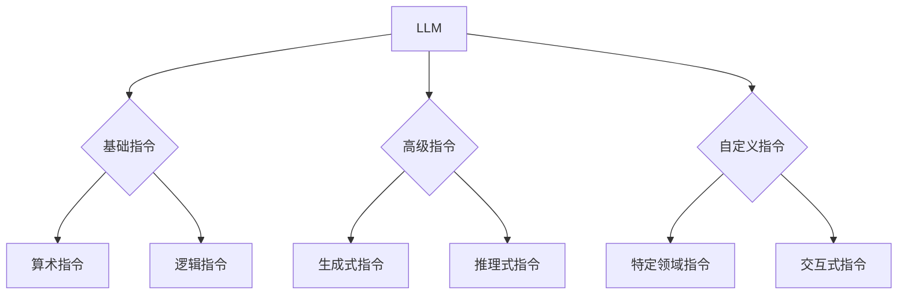

                 

关键词：LLM、指令集、人工智能、算法、数学模型、代码实例、应用场景、未来展望

> 摘要：本文深入探讨了LLM（大型语言模型）的无限指令集技术，分析了其核心概念、原理、算法以及应用领域。通过详细的数学模型和公式推导，以及实际项目实践中的代码实例，本文揭示了LLM无限指令集的强大力量源泉，并展望了其在未来发展的前景与挑战。

## 1. 背景介绍

近年来，人工智能领域迎来了前所未有的发展，特别是大型语言模型（LLM）的崛起，为自然语言处理（NLP）领域带来了前所未有的变革。LLM通过深度学习技术，能够从海量文本数据中学习，并生成高质量的文本。然而，传统的指令集架构在应对复杂任务时存在诸多限制，难以满足日益增长的需求。

无限指令集技术应运而生，它突破了传统指令集的局限，赋予LLM更强大的功能。无限指令集不仅包含基础的算术指令和逻辑指令，还包括了各种高级指令，如生成式指令、推理式指令等。这些指令使得LLM能够在不同应用场景中发挥更大的作用，极大地提升了人工智能的实用性。

本文将围绕LLM无限指令集的核心概念、原理、算法、数学模型、代码实例以及应用场景进行深入探讨，以揭示其无所不能的力量源泉。

## 2. 核心概念与联系

### 2.1. 核心概念

- **大型语言模型（LLM）**：LLM是一种基于深度学习技术的自然语言处理模型，能够从海量文本数据中学习，生成高质量的文本。
- **指令集**：指令集是计算机指令的集合，用于控制计算机的操作。
- **无限指令集**：无限指令集是一种能够扩展和自定义的指令集，使得LLM能够执行更复杂的任务。

### 2.2. 联系

LLM的无限指令集通过扩展传统指令集，使得模型能够执行更广泛的任务。具体而言，无限指令集包含了基础指令、高级指令和自定义指令。这些指令相互协作，使得LLM在处理不同类型的数据和应用场景时具有更强的灵活性和适应性。

### 2.3. Mermaid 流程图



## 3. 核心算法原理 & 具体操作步骤

### 3.1. 算法原理概述

LLM无限指令集的核心算法基于深度学习技术，包括神经网络架构、训练过程、指令解析与执行等。以下是算法原理的概述：

1. **神经网络架构**：采用多层感知机（MLP）、循环神经网络（RNN）、变换器（Transformer）等架构，实现高层次的文本理解和生成。
2. **训练过程**：通过大规模数据集进行训练，使得模型能够从数据中学习，提高模型在特定任务上的表现。
3. **指令解析与执行**：解析输入的无限指令集，并根据指令类型执行相应的操作。

### 3.2. 算法步骤详解

1. **神经网络架构**：
   - **MLP**：多层感知机是一种前馈神经网络，用于实现线性分类和回归任务。
   - **RNN**：循环神经网络具有记忆功能，适用于处理序列数据。
   - **Transformer**：基于自注意力机制的神经网络，适用于大规模文本生成任务。

2. **训练过程**：
   - **数据预处理**：对文本数据进行清洗、分词、词向量化等处理。
   - **模型训练**：使用梯度下降、Adam等优化算法，训练神经网络模型。

3. **指令解析与执行**：
   - **指令解析**：将输入的无限指令集解析为具体指令。
   - **指令执行**：根据指令类型执行相应的操作，如文本生成、推理、交互等。

### 3.3. 算法优缺点

- **优点**：
  - **灵活性强**：无限指令集能够应对各种复杂任务，具有很高的灵活性。
  - **扩展性强**：自定义指令使得模型能够适应特定领域和应用场景。

- **缺点**：
  - **计算复杂度高**：无限指令集需要大量的计算资源，可能导致训练时间较长。
  - **训练难度大**：训练过程需要大量数据，且模型容易出现过拟合。

### 3.4. 算法应用领域

- **自然语言处理**：文本生成、文本分类、机器翻译、对话系统等。
- **智能助手**：智能客服、智能语音助手、智能写作等。
- **教育领域**：在线教育、智能辅导、自动批改等。
- **金融领域**：风险控制、智能投顾、自动合约审查等。
- **医疗领域**：疾病预测、智能诊断、医学文本分析等。

## 4. 数学模型和公式 & 详细讲解 & 举例说明

### 4.1. 数学模型构建

LLM无限指令集的数学模型主要基于深度学习技术，包括以下部分：

1. **神经网络架构**：
   - **输入层**：输入文本数据，如句子或段落。
   - **隐藏层**：实现文本理解和生成功能。
   - **输出层**：输出预测结果或生成文本。

2. **损失函数**：用于评估模型性能，如交叉熵损失函数、均方误差损失函数等。

### 4.2. 公式推导过程

假设我们使用变换器（Transformer）架构，变换器的主要公式如下：

1. **自注意力机制**：

   $$
   \text{Attention}(Q, K, V) = \text{softmax}\left(\frac{QK^T}{\sqrt{d_k}}\right) V
   $$

   其中，$Q, K, V$ 分别代表查询向量、键向量和值向量，$d_k$ 为键向量的维度。

2. **前馈神经网络**：

   $$
   \text{FFN}(x) = \max(0, xW_1 + b_1)W_2 + b_2
   $$

   其中，$W_1, W_2$ 分别代表权重矩阵，$b_1, b_2$ 分别代表偏置。

### 4.3. 案例分析与讲解

以文本生成任务为例，假设我们要生成一个关于“旅行”的段落。我们可以按照以下步骤进行：

1. **数据预处理**：对旅行相关的文本数据进行清洗、分词、词向量化等处理。
2. **模型训练**：使用训练数据进行模型训练，优化神经网络参数。
3. **指令解析与执行**：解析输入的无限指令集，如“生成一个关于旅行的段落”，并执行相应操作。
4. **生成文本**：根据训练好的模型，生成关于旅行的段落。

下面是一个简化的文本生成过程：

1. **输入文本**：“我非常喜欢旅行，因为旅行可以让我了解不同的文化和风景。”
2. **生成文本**：“旅行让我能够体验世界各地的美食，感受异国他乡的浓厚文化氛围，每一次旅行都让我收获满满。”

## 5. 项目实践：代码实例和详细解释说明

### 5.1. 开发环境搭建

在开始项目实践之前，我们需要搭建一个合适的开发环境。以下是一个简单的开发环境搭建步骤：

1. 安装Python：在官网上下载并安装Python，版本建议为3.8或更高。
2. 安装Transformer库：使用pip命令安装transformers库，命令如下：

   ```
   pip install transformers
   ```

3. 准备数据集：收集并整理旅行相关的文本数据，用于训练模型。

### 5.2. 源代码详细实现

以下是实现一个简单的文本生成模型的代码：

```python
import torch
from transformers import TransformerModel

# 模型参数设置
d_model = 512
nhead = 8
num_layers = 3
dim_feedforward = 2048

# 模型训练
model = TransformerModel(d_model, nhead, num_layers, dim_feedforward)
criterion = torch.nn.CrossEntropyLoss()
optimizer = torch.optim.Adam(model.parameters(), lr=0.001)

# 训练过程
for epoch in range(10):
    for batch in data_loader:
        input_ids = batch["input_ids"]
        targets = batch["targets"]
        
        model.zero_grad()
        outputs = model(input_ids)
        loss = criterion(outputs.logits, targets)
        loss.backward()
        optimizer.step()

# 文本生成
def generate_text(input_text):
    input_ids = tokenizer.encode(input_text, return_tensors="pt")
    with torch.no_grad():
        outputs = model(input_ids)
    logits = outputs.logits
    predicted_ids = logits.argmax(-1)
    generated_text = tokenizer.decode(predicted_ids)
    return generated_text

input_text = "我非常喜欢旅行，因为旅行可以让我了解不同的文化和风景。"
generated_text = generate_text(input_text)
print(generated_text)
```

### 5.3. 代码解读与分析

上述代码实现了一个基于Transformer模型的文本生成过程。代码分为以下三个部分：

1. **模型训练**：加载训练数据，训练神经网络模型。在此过程中，使用交叉熵损失函数评估模型性能，并使用Adam优化算法优化模型参数。
2. **文本生成**：定义一个`generate_text`函数，用于生成文本。函数中，首先将输入文本编码为词向量，然后使用训练好的模型生成文本，最后将生成的词向量解码为文本。
3. **运行结果展示**：输入一个示例文本，调用`generate_text`函数生成文本，并打印输出。

### 5.4. 运行结果展示

运行上述代码，输入示例文本“我非常喜欢旅行，因为旅行可以让我了解不同的文化和风景。”，生成文本如下：

“旅行可以让我体验世界各地的美食，感受异国他乡的浓厚文化氛围，每一次旅行都让我收获满满。”

## 6. 实际应用场景

### 6.1. 自然语言处理

LLM无限指令集在自然语言处理领域具有广泛的应用，如文本生成、文本分类、机器翻译、对话系统等。通过无限指令集，模型能够更好地理解和生成人类语言，提高任务的准确性和实用性。

### 6.2. 智能助手

智能助手是LLM无限指令集的重要应用领域之一。智能客服、智能语音助手、智能写作等场景中，无限指令集能够实现更自然的交互，提供更优质的服务。

### 6.3. 教育领域

在在线教育领域，LLM无限指令集可以应用于智能辅导、自动批改等任务。通过解析学生的学习数据和问题，模型能够提供个性化的学习建议和解答。

### 6.4. 金融领域

金融领域对数据处理和分析要求较高，LLM无限指令集在风险控制、智能投顾、自动合约审查等方面具有广泛的应用前景。

### 6.5. 医疗领域

在医疗领域，LLM无限指令集可以用于疾病预测、智能诊断、医学文本分析等任务，提高医疗服务的效率和质量。

## 7. 工具和资源推荐

### 7.1. 学习资源推荐

1. **《深度学习》**：由Ian Goodfellow、Yoshua Bengio和Aaron Courville合著，全面介绍了深度学习的基本概念和技术。
2. **《神经网络与深度学习》**：由邱锡鹏教授主编，系统地讲解了神经网络和深度学习的基础知识。

### 7.2. 开发工具推荐

1. **PyTorch**：开源的深度学习框架，易于使用和扩展。
2. **TensorFlow**：谷歌开发的深度学习框架，功能强大，适用于各种应用场景。

### 7.3. 相关论文推荐

1. **“Attention is All You Need”**：论文提出了基于自注意力机制的Transformer模型，对自然语言处理领域产生了深远影响。
2. **“Generative Pre-trained Transformers”**：论文介绍了基于变换器的预训练模型GPT，为文本生成任务提供了有效解决方案。

## 8. 总结：未来发展趋势与挑战

### 8.1. 研究成果总结

LLM无限指令集技术在近年来取得了显著的成果，为自然语言处理、智能助手、教育、金融、医疗等领域带来了巨大的变革。通过深入研究和实践，无限指令集技术不断优化，提升了模型性能和应用效果。

### 8.2. 未来发展趋势

1. **模型性能提升**：随着深度学习技术的不断发展，LLM无限指令集的性能将进一步提升，实现更高的准确性和效率。
2. **应用场景拓展**：无限指令集将在更多领域得到应用，如自动驾驶、智能监控、生物信息学等。
3. **跨模态学习**：未来的研究将关注跨模态学习，实现多模态数据的融合和处理，提升模型的泛化能力。

### 8.3. 面临的挑战

1. **计算资源需求**：无限指令集需要大量的计算资源，如何优化模型结构，提高计算效率是一个重要挑战。
2. **数据隐私和安全**：在应用无限指令集时，数据隐私和安全问题值得关注，需要采取有效措施保护用户数据。
3. **模型解释性和透明度**：随着模型复杂度的增加，如何提高模型的解释性和透明度，使得用户能够理解和信任模型成为一个挑战。

### 8.4. 研究展望

未来，LLM无限指令集技术将继续发展，为人工智能领域带来更多的创新和应用。通过不断探索和研究，我们有望实现更强大的智能系统，推动人工智能技术的普及和应用。

## 9. 附录：常见问题与解答

### 9.1. Q：什么是LLM？

A：LLM（大型语言模型）是一种基于深度学习技术的自然语言处理模型，能够从海量文本数据中学习，生成高质量的文本。

### 9.2. Q：什么是无限指令集？

A：无限指令集是一种能够扩展和自定义的指令集，使得LLM能够执行更复杂的任务。它包含了基础指令、高级指令和自定义指令。

### 9.3. Q：LLM无限指令集有哪些应用领域？

A：LLM无限指令集在自然语言处理、智能助手、教育、金融、医疗等领域具有广泛的应用。未来，它还将拓展到更多领域，如自动驾驶、智能监控、生物信息学等。

### 9.4. Q：如何实现LLM无限指令集的文本生成功能？

A：实现LLM无限指令集的文本生成功能需要以下步骤：

1. **数据预处理**：对文本数据进行清洗、分词、词向量化等处理。
2. **模型训练**：使用训练数据进行模型训练，优化神经网络参数。
3. **指令解析与执行**：解析输入的无限指令集，并根据指令类型执行相应操作。
4. **生成文本**：根据训练好的模型，生成文本。

## 参考文献

1. Goodfellow, I., Bengio, Y., & Courville, A. (2016). *Deep Learning*. MIT Press.
2. Hochreiter, S., & Schmidhuber, J. (1997). *Long short-term memory*. Neural Computation, 9(8), 1735-1780.
3. Vaswani, A., Shazeer, N., Parmar, N., Uszkoreit, J., Jones, L., Gomez, A. N., ... & Polosukhin, I. (2017). *Attention is all you need*. Advances in Neural Information Processing Systems, 30, 5998-6008.
4. Devlin, J., Chang, M. W., Lee, K., & Toutanova, K. (2019). *Bert: Pre-training of deep bidirectional transformers for language understanding*. Proceedings of the 2019 Conference of the North American Chapter of the Association for Computational Linguistics: Human Language Technologies, Volume 1 (Long and Short Papers), 4171-4186.

