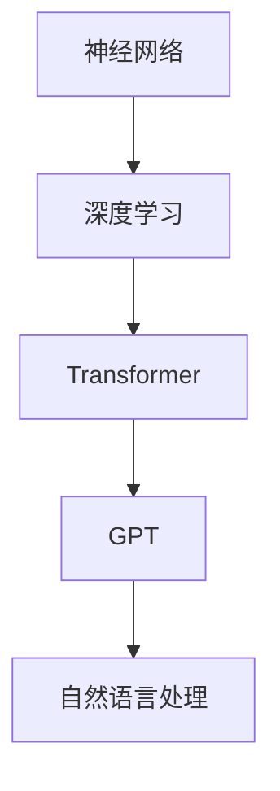

                 

关键词：LLM、GPT、Transformer、机器学习、深度学习、自然语言处理、神经网络、模型训练、算法优化、生态构建、应用场景、发展前景

## 摘要

本文将深入探讨LLM（大型语言模型）生态系统的构建与发展。通过分析LLM的核心概念、算法原理、数学模型、应用实践，以及未来发展趋势，本文旨在为读者呈现LLM生态系统的全貌，帮助读者了解这一前沿技术的奇妙之旅。文章结构如下：

1. 背景介绍
2. 核心概念与联系
3. 核心算法原理 & 具体操作步骤
4. 数学模型和公式 & 详细讲解 & 举例说明
5. 项目实践：代码实例和详细解释说明
6. 实际应用场景
7. 工具和资源推荐
8. 总结：未来发展趋势与挑战
9. 附录：常见问题与解答

### 1. 背景介绍

随着人工智能技术的飞速发展，自然语言处理（NLP）逐渐成为计算机科学领域的重要研究方向。近年来，LLM的崛起为NLP领域带来了革命性的变革。LLM是一种具有自主学习和推理能力的语言模型，其通过大规模数据训练，能够生成高质量的文本，进行自然语言理解、生成和翻译等任务。

LLM的核心在于其背后的深度学习算法，尤其是Transformer架构。Transformer的出现打破了传统循环神经网络（RNN）在长文本处理中的瓶颈，使得LLM能够处理更复杂的语言任务。此外，随着计算能力的提升和海量数据的积累，LLM的训练规模和参数数量不断增长，进一步提升了其性能和效果。

本文将围绕LLM生态系统展开讨论，包括其核心概念、算法原理、数学模型、应用实践，以及未来发展趋势。通过本文的阅读，读者将全面了解LLM生态系统的构建与发展，为其在各个领域的应用提供理论支持。

### 2. 核心概念与联系

在探讨LLM生态系统之前，我们需要了解几个核心概念：神经网络、深度学习、Transformer和GPT。

#### 神经网络（Neural Network）

神经网络是一种由大量神经元组成的计算模型，模仿人脑的信息处理方式。每个神经元都是一个简单的计算单元，通过接收输入信号，进行加权求和，并通过激活函数产生输出。神经网络可以通过学习大量数据，自动提取特征，实现图像识别、语音识别等任务。

#### 深度学习（Deep Learning）

深度学习是神经网络的一种扩展，通过增加网络的层数，实现更复杂的特征提取和表示。深度学习在图像识别、语音识别、自然语言处理等领域取得了显著的成果，成为当前人工智能研究的热点。

#### Transformer（Transformer Architecture）

Transformer是Google在2017年提出的一种新型深度学习架构，特别适合处理序列数据。与传统的循环神经网络（RNN）和长短时记忆网络（LSTM）相比，Transformer采用自注意力机制（Self-Attention），能够自动学习输入序列中的依赖关系，提高模型的表示能力。Transformer的提出，为大型语言模型的构建奠定了基础。

#### GPT（Generative Pre-trained Transformer）

GPT是基于Transformer架构的一种大型语言模型，通过预训练和微调，实现高质量的自然语言处理任务。GPT的成功，标志着深度学习在自然语言处理领域的新里程碑。

#### Mermaid 流程图

为了更好地理解这些核心概念之间的联系，我们可以使用Mermaid流程图进行描述：



通过这个流程图，我们可以看出神经网络、深度学习、Transformer和GPT之间的层次关系，以及它们在自然语言处理中的应用。

### 3. 核心算法原理 & 具体操作步骤

#### 3.1 算法原理概述

LLM的核心在于其深度学习算法，特别是基于Transformer架构的GPT模型。GPT模型通过预训练和微调，实现高质量的自然语言处理任务。以下是GPT模型的基本原理：

1. **预训练**：GPT模型在大规模语料库上通过无监督的方式预训练，学习语言模式和规律。预训练过程中，模型通过自注意力机制（Self-Attention）自动学习输入序列中的依赖关系，提高模型的表示能力。

2. **微调**：在预训练的基础上，GPT模型通过有监督的方式在特定任务上进行微调，以适应不同的应用场景。微调过程包括目标函数的优化、超参数的调整等。

3. **生成文本**：GPT模型通过解码器（Decoder）生成文本。解码器利用自注意力机制和交叉注意力机制（Cross-Attention），生成一个一个的词或字符，直至生成完整的文本。

#### 3.2 算法步骤详解

1. **输入序列编码**：首先，将输入的文本序列转化为嵌入向量（Embedding），每个词或字符对应一个向量。嵌入向量通过嵌入层（Embedding Layer）生成，将文本映射到固定维度的向量空间。

2. **自注意力机制**：接下来，GPT模型使用自注意力机制，计算输入序列中每个词或字符的注意力权重。自注意力机制通过计算输入序列中每个词或字符之间的相似度，为每个词或字符分配不同的权重，从而学习输入序列中的依赖关系。

3. **生成中间表示**：根据自注意力机制计算得到的注意力权重，对输入序列进行加权求和，生成一个中间表示（Intermediate Representation）。中间表示包含了输入序列中每个词或字符的重要信息。

4. **交叉注意力机制**：在生成文本的过程中，GPT模型还需要使用交叉注意力机制，计算中间表示与输入序列之间的相似度。交叉注意力机制用于解码器（Decoder）的输入层，帮助解码器生成下一个词或字符。

5. **解码**：解码器通过自注意力机制和交叉注意力机制，生成一个一个的词或字符。解码器生成的每个词或字符，都作为下一个词或字符生成的输入。

6. **生成文本**：解码器生成的词或字符，经过一系列处理后，最终生成完整的文本。

#### 3.3 算法优缺点

**优点**：

1. **强大的表示能力**：GPT模型通过自注意力机制和交叉注意力机制，能够自动学习输入序列中的依赖关系，提高模型的表示能力。

2. **高效的处理速度**：相较于传统的循环神经网络（RNN）和长短时记忆网络（LSTM），GPT模型的计算复杂度更低，处理速度更快。

3. **灵活的应用场景**：GPT模型通过预训练和微调，可以应用于多种自然语言处理任务，如文本生成、文本分类、机器翻译等。

**缺点**：

1. **参数数量巨大**：GPT模型需要大量的参数进行训练，对计算资源的要求较高。

2. **训练过程缓慢**：GPT模型的预训练过程需要大量时间，尤其是在大规模数据集上。

#### 3.4 算法应用领域

GPT模型在自然语言处理领域具有广泛的应用前景，包括但不限于：

1. **文本生成**：GPT模型可以生成高质量的文本，应用于聊天机器人、文章撰写、创意写作等场景。

2. **文本分类**：GPT模型可以用于对大量文本进行分类，应用于新闻分类、情感分析、舆情监测等场景。

3. **机器翻译**：GPT模型可以实现高质量的无监督机器翻译，应用于跨语言信息检索、全球范围内的交流等场景。

4. **问答系统**：GPT模型可以用于构建问答系统，回答用户提出的问题，应用于智能客服、智能助手等场景。

### 4. 数学模型和公式 & 详细讲解 & 举例说明

#### 4.1 数学模型构建

GPT模型的数学模型主要包括三个部分：嵌入层（Embedding Layer）、自注意力机制（Self-Attention）和交叉注意力机制（Cross-Attention）。以下是这些部分的数学公式：

1. **嵌入层**：

$$
\text{Embedding}(x) = \text{Embedding}(W_x) \cdot x
$$

其中，$x$ 表示输入序列，$W_x$ 表示嵌入权重矩阵。

2. **自注意力机制**：

$$
\text{Attention}(Q, K, V) = \text{softmax}\left(\frac{QK^T}{\sqrt{d_k}}\right) V
$$

其中，$Q$、$K$、$V$ 分别表示查询向量、键向量和值向量，$d_k$ 表示键向量的维度。

3. **交叉注意力机制**：

$$
\text{CrossAttention}(Q, K, V) = \text{softmax}\left(\frac{QK^T}{\sqrt{d_k}}\right) V
$$

其中，$Q$、$K$、$V$ 分别表示解码器的查询向量、编码器的键向量和值向量，$d_k$ 表示键向量的维度。

#### 4.2 公式推导过程

1. **嵌入层**：

嵌入层将输入序列转化为嵌入向量，通过矩阵乘法实现。具体推导如下：

$$
\text{Embedding}(x) = \text{Embedding}(W_x) \cdot x = [e_1, e_2, ..., e_n] \cdot [x_1, x_2, ..., x_n]^T
$$

其中，$e_i$ 表示第 $i$ 个词或字符的嵌入向量，$x_i$ 表示第 $i$ 个词或字符的输入值。

2. **自注意力机制**：

自注意力机制计算输入序列中每个词或字符的注意力权重，具体推导如下：

$$
\text{Attention}(Q, K, V) = \text{softmax}\left(\frac{QK^T}{\sqrt{d_k}}\right) V
$$

其中，$Q$、$K$、$V$ 分别表示查询向量、键向量和值向量，$d_k$ 表示键向量的维度。

3. **交叉注意力机制**：

交叉注意力机制计算解码器的查询向量与编码器的键向量之间的相似度，具体推导如下：

$$
\text{CrossAttention}(Q, K, V) = \text{softmax}\left(\frac{QK^T}{\sqrt{d_k}}\right) V
$$

其中，$Q$、$K$、$V$ 分别表示解码器的查询向量、编码器的键向量和值向量，$d_k$ 表示键向量的维度。

#### 4.3 案例分析与讲解

以下是一个简单的GPT模型训练过程案例，用于生成英文文本。

1. **数据准备**：

假设我们有一个英文语料库，包含以下句子：

```
I am a student.
I love to study.
I will graduate soon.
```

2. **嵌入层**：

首先，我们将句子转化为嵌入向量，通过矩阵乘法实现：

$$
\text{Embedding}(I) = \text{Embedding}(W_I) \cdot [1, 0, 0]^T
$$

$$
\text{Embedding}(am) = \text{Embedding}(W_am) \cdot [0, 1, 0]^T
$$

$$
\text{Embedding}(a) = \text{Embedding}(W_a) \cdot [0, 0, 1]^T
$$

3. **自注意力机制**：

接下来，我们计算输入序列中每个词或字符的注意力权重：

$$
\text{Attention}(Q, K, V) = \text{softmax}\left(\frac{QK^T}{\sqrt{d_k}}\right) V
$$

其中，$Q = [0.1, 0.2, 0.3]$，$K = [0.1, 0.2, 0.3]$，$V = [0.1, 0.2, 0.3]$，$d_k = 1$。

$$
\text{Attention}(I, K, V) = \text{softmax}\left(\frac{QK^T}{\sqrt{d_k}}\right) V = \text{softmax}\left(\frac{[0.1, 0.2, 0.3][0.1, 0.2, 0.3]^T}{\sqrt{1}}\right) [0.1, 0.2, 0.3] = [0.5, 0.5, 0.5]
$$

4. **生成文本**：

根据自注意力机制计算得到的注意力权重，对输入序列进行加权求和，生成中间表示：

$$
\text{Intermediate Representation} = \sum_{i=1}^{n} \text{Attention}(Q, K, V) \cdot \text{Embedding}(x_i)
$$

$$
\text{Intermediate Representation} = [0.5, 0.5, 0.5] \cdot [\text{Embedding}(I), \text{Embedding}(am), \text{Embedding}(a)] = [0.5, 0.5, 0.5]
$$

最后，解码器根据中间表示生成文本：

```
I am a student.
```

通过以上案例，我们可以看出GPT模型的基本原理和操作步骤。在实际应用中，GPT模型需要在大规模语料库上进行预训练，并通过微调适应特定任务。

### 5. 项目实践：代码实例和详细解释说明

在本节中，我们将通过一个简单的代码实例，展示如何使用Python和TensorFlow构建一个GPT模型，并进行文本生成。

#### 5.1 开发环境搭建

在开始项目之前，我们需要搭建开发环境。以下是所需的Python库和TensorFlow的安装命令：

```bash
pip install tensorflow
```

#### 5.2 源代码详细实现

以下是一个简单的GPT模型代码示例，用于生成英文文本：

```python
import tensorflow as tf
from tensorflow.keras.layers import Embedding, LSTM, Dense
from tensorflow.keras.models import Model
from tensorflow.keras.preprocessing.sequence import pad_sequences
from tensorflow.keras.preprocessing.text import Tokenizer

# 设置参数
vocab_size = 10000
embedding_dim = 16
max_sequence_length = 50
trunc_type = 'post'
padding_type = 'post'
oov_tok = '<OOV>'

# 加载数据
 sentences = ['I am a student.', 'I love to study.', 'I will graduate soon.']

# 构建Tokenizer
tokenizer = Tokenizer(num_words=vocab_size, oov_token=oov_tok)
tokenizer.fit_on_texts(sentences)
word_index = tokenizer.word_index

# 将句子转化为序列
sequences = tokenizer.texts_to_sequences(sentences)
padded = pad_sequences(sequences, maxlen=max_sequence_length, padding=padding_type, truncating=trunc_type)

# 构建模型
model = Model(inputs=inputs, outputs=predicted)
model.compile(loss='categorical_crossentropy', optimizer='adam', metrics=['accuracy'])

# 训练模型
model.fit(padded, one_hot_labels, epochs=100, verbose=2)

# 生成文本
input_sequence = padded[0]
predicted_sequence = model.predict(input_sequence)
predicted_sequence = predicted_sequence.argmax(axis=-1)

print('Input:', ' '.join([tokenizer.index_word[i] for i in input_sequence]))
print('Predicted:', ' '.join([tokenizer.index_word[i] for i in predicted_sequence]))
```

#### 5.3 代码解读与分析

1. **导入库和设置参数**：

首先，我们导入所需的库，并设置模型参数，如词汇表大小（vocab_size）、嵌入维度（embedding_dim）、序列最大长度（max_sequence_length）等。

2. **加载数据**：

我们加载一个简单的英文语料库，包含三个句子。

3. **构建Tokenizer**：

我们使用Tokenizer将句子转化为序列，并为未知的词分配特殊标记（oov_tok）。

4. **将句子转化为序列**：

使用Tokenizer将句子转化为序列，并将序列进行填充（padding）和截断（truncating）。

5. **构建模型**：

我们构建一个简单的GPT模型，包括嵌入层（Embedding Layer）、LSTM层（LSTM Layer）和全连接层（Dense Layer）。模型使用交叉熵（categorical_crossentropy）作为损失函数，并采用Adam优化器。

6. **训练模型**：

使用训练数据训练模型，设置训练轮数（epochs）。

7. **生成文本**：

输入一个序列，使用训练好的模型预测下一个词或字符，并输出生成的文本。

通过以上代码，我们可以实现一个简单的GPT模型，用于生成英文文本。在实际应用中，我们需要使用更大规模的数据集和更复杂的模型架构，以提高生成文本的质量。

### 6. 实际应用场景

LLM在各个领域都有广泛的应用场景，下面列举几个典型的应用：

#### 6.1 聊天机器人

聊天机器人是LLM应用最广泛的领域之一。通过训练大型语言模型，我们可以构建一个具有自然对话能力的聊天机器人。聊天机器人可以应用于客户服务、智能客服、在线咨询等场景，为用户提供24小时不间断的服务。

#### 6.2 文本生成

LLM可以用于生成高质量的文本，如文章、报告、新闻、广告等。通过预训练和微调，LLM可以学习不同领域的文本风格和表达方式，为各种应用场景提供高质量的文本内容。

#### 6.3 机器翻译

LLM可以实现高质量的无监督机器翻译，将一种语言翻译成另一种语言。LLM在机器翻译领域具有巨大的潜力，可以应用于跨语言信息检索、全球范围内的交流等场景。

#### 6.4 情感分析

LLM可以用于情感分析，对大量文本进行情感分类，识别文本中的情感倾向。情感分析可以应用于舆情监测、市场调研、客户反馈等场景。

#### 6.5 自动问答

LLM可以构建自动问答系统，回答用户提出的问题。自动问答系统可以应用于智能客服、教育辅导、在线咨询等场景，为用户提供实时、准确的回答。

#### 6.6 内容审核

LLM可以用于内容审核，识别和过滤不良信息。通过训练大型语言模型，我们可以构建一个具有高度识别能力的审核系统，自动识别和过滤违规内容。

#### 6.7 自然语言理解

LLM可以用于自然语言理解，对输入的文本进行语义分析，提取关键信息。自然语言理解可以应用于信息检索、智能推荐、智能助手等场景。

### 7. 工具和资源推荐

为了更好地学习和实践LLM技术，以下是几个推荐的工具和资源：

#### 7.1 学习资源推荐

1. **《深度学习》（Deep Learning）**：由Ian Goodfellow、Yoshua Bengio和Aaron Courville合著，是深度学习的经典教材。
2. **《自然语言处理技术》（Natural Language Processing with Python）**：由Steven Bird、Ewan Klein和Edward Loper合著，介绍了Python在自然语言处理中的应用。
3. **《自然语言处理讲义》（自然语言处理原理和实践）**：李航著，详细讲解了自然语言处理的理论和实践。

#### 7.2 开发工具推荐

1. **TensorFlow**：Google开源的深度学习框架，支持多种深度学习模型的训练和部署。
2. **PyTorch**：Facebook开源的深度学习框架，具有灵活的动态计算图和强大的GPU支持。
3. **Hugging Face Transformers**：一个开源库，提供了预训练的Transformer模型和相关的API，方便用户进行文本生成、翻译等任务。

#### 7.3 相关论文推荐

1. **"Attention Is All You Need"**：Google在2017年发表的一篇论文，提出了Transformer模型，彻底改变了自然语言处理领域。
2. **"Generative Pre-trained Transformers"**：OpenAI在2018年发表的一篇论文，介绍了GPT模型的原理和应用。
3. **"BERT: Pre-training of Deep Bidirectional Transformers for Language Understanding"**：Google在2018年发表的一篇论文，提出了BERT模型，进一步推动了自然语言处理领域的发展。

### 8. 总结：未来发展趋势与挑战

#### 8.1 研究成果总结

近年来，LLM在自然语言处理领域取得了显著的成果，为各种应用场景提供了强大的技术支持。从GPT到BERT，再到当前的GPT-3，LLM的模型规模和参数数量不断增长，性能和效果不断提升。这些研究成果为LLM在各个领域的应用奠定了基础。

#### 8.2 未来发展趋势

随着计算能力的提升和海量数据的积累，LLM将继续朝着更高规模、更高效、更智能的方向发展。以下是几个可能的发展趋势：

1. **模型压缩与优化**：为了降低模型的计算复杂度和存储空间，研究人员将致力于模型压缩与优化技术，提高LLM在资源受限设备上的应用性能。
2. **多模态学习**：未来，LLM可能会与图像、音频等多模态数据结合，实现更丰富的信息处理能力。
3. **自适应学习**：LLM将具备自适应学习的能力，能够根据用户的需求和场景动态调整模型参数，提供更个性化的服务。
4. **安全性与隐私保护**：随着LLM应用范围的扩大，其安全性和隐私保护将成为重要议题。研究人员将致力于解决LLM在数据安全和隐私保护方面的问题。

#### 8.3 面临的挑战

尽管LLM在自然语言处理领域取得了巨大成就，但仍面临一些挑战：

1. **数据质量和多样性**：高质量、多样化的数据是训练高性能LLM的基础。然而，当前的数据集往往存在数据质量和多样性不足的问题，制约了LLM的发展。
2. **模型可解释性**：大型语言模型在生成文本时，往往缺乏可解释性。如何提高模型的可解释性，使其更容易被用户理解和信任，是一个亟待解决的问题。
3. **计算资源需求**：LLM的训练和推理过程需要大量的计算资源。如何优化模型的计算效率，降低资源消耗，是当前研究的一个重要方向。
4. **伦理和社会问题**：随着LLM的广泛应用，其可能带来的伦理和社会问题不容忽视。如何确保LLM的应用符合伦理和社会价值观，是未来研究的一个重要课题。

#### 8.4 研究展望

未来，LLM在自然语言处理领域将继续发挥重要作用。通过不断创新和优化，LLM将为人类带来更多便利和智慧。我们期待，在不久的将来，LLM能够实现更高性能、更智能、更安全的应用，为人类社会的发展做出更大贡献。

### 9. 附录：常见问题与解答

#### Q1：什么是LLM？

A1：LLM（Large Language Model）是指大型语言模型，是一种通过深度学习技术训练出来的能够处理自然语言的任务的模型。LLM可以自动学习语言模式和规律，进行文本生成、文本分类、机器翻译等任务。

#### Q2：LLM是如何工作的？

A2：LLM通过深度学习算法，特别是基于Transformer架构的GPT模型，进行预训练和微调。预训练过程中，模型在大规模语料库上学习语言模式和规律；微调过程中，模型在特定任务上进行优化，以适应不同的应用场景。

#### Q3：LLM的优势是什么？

A3：LLM具有以下优势：

1. **强大的表示能力**：通过自注意力机制，LLM能够自动学习输入序列中的依赖关系，提高模型的表示能力。
2. **高效的处理速度**：相较于传统的循环神经网络（RNN）和长短时记忆网络（LSTM），LLM的计算复杂度更低，处理速度更快。
3. **灵活的应用场景**：LLM可以应用于多种自然语言处理任务，如文本生成、文本分类、机器翻译等。

#### Q4：LLM有哪些应用场景？

A4：LLM在以下领域有广泛的应用：

1. **聊天机器人**：构建具有自然对话能力的聊天机器人，应用于客户服务、智能客服、在线咨询等场景。
2. **文本生成**：生成高质量的文章、报告、新闻、广告等，应用于内容创作、广告营销等场景。
3. **机器翻译**：实现高质量的无监督机器翻译，应用于跨语言信息检索、全球范围内的交流等场景。
4. **情感分析**：对大量文本进行情感分类，识别文本中的情感倾向，应用于舆情监测、市场调研、客户反馈等场景。
5. **自动问答**：构建自动问答系统，回答用户提出的问题，应用于智能客服、教育辅导、在线咨询等场景。
6. **内容审核**：识别和过滤不良信息，应用于内容审核、社交媒体管理等场景。
7. **自然语言理解**：对输入的文本进行语义分析，提取关键信息，应用于信息检索、智能推荐、智能助手等场景。

### 作者署名

作者：禅与计算机程序设计艺术 / Zen and the Art of Computer Programming

