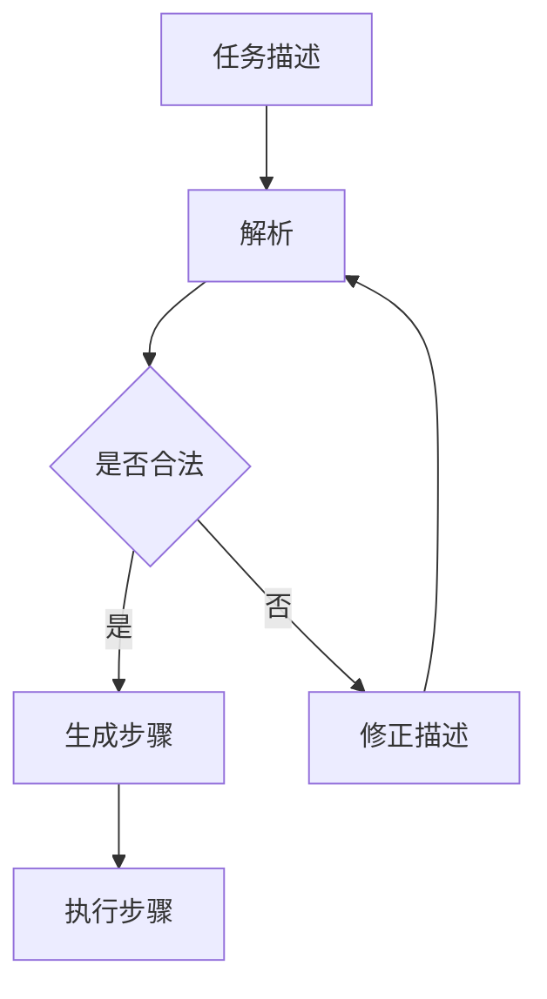

                 

关键词：大型语言模型，任务规划，智能编程，自动化，深度学习，神经网络，人工智能，编程范式

> 摘要：本文将探讨大型语言模型（LLM）在任务规划中的应用，并探讨其如何超越传统编程方法，实现更高效、智能的编程方式。通过对LLM的任务规划机制、核心算法原理、数学模型和项目实践等方面的详细分析，本文旨在为读者提供一种新的编程思路和工具，帮助他们在人工智能时代取得更大的突破。

## 1. 背景介绍

随着人工智能技术的快速发展，尤其是深度学习和神经网络技术的突破，大型语言模型（LLM）得到了广泛的关注和应用。LLM是一种基于神经网络的可扩展模型，能够理解和生成人类语言。在自然语言处理、机器翻译、文本生成等领域，LLM已经展现了强大的能力。然而，LLM的应用不仅限于语言处理，其在任务规划领域的潜力也越来越受到研究者的关注。

任务规划是指为完成某个目标而制定的一系列操作步骤。在传统编程中，任务规划通常需要程序员手动编写代码，指定每个步骤的具体操作。这种方式不仅繁琐，而且容易出错。随着AI技术的发展，能否利用LLM来实现智能化的任务规划，成为了一个重要的研究方向。

本文将探讨LLM在任务规划中的应用，分析其优势、挑战和未来发展方向。通过本文的探讨，读者可以了解到LLM如何超越传统编程方法，实现更高效、智能的任务规划。

## 2. 核心概念与联系

### 2.1 大型语言模型（LLM）

大型语言模型（LLM）是一种基于神经网络的可扩展模型，其核心思想是通过大量文本数据的学习，使模型具备理解和生成人类语言的能力。LLM的训练过程通常涉及数以亿计的参数，通过优化这些参数，模型可以实现对语言规律的捕捉和理解。

LLM的核心组成部分包括：

- **嵌入层**：将词汇映射到高维空间中的向量表示。
- **编码器**：将输入文本序列编码为固定长度的向量表示。
- **解码器**：根据编码器的输出，生成文本序列。

### 2.2 任务规划

任务规划是指为完成某个目标而制定的一系列操作步骤。任务规划可以应用于多个领域，如机器人导航、物流调度、游戏AI等。传统任务规划通常依赖于领域知识和专家经验，通过符号计算和推理来生成操作步骤。然而，这种方式在面对复杂和动态的任务环境时，存在一定的局限性。

### 2.3 LLM与任务规划的联系

LLM在任务规划中的应用，主要是通过以下方式实现的：

1. **自然语言描述**：使用自然语言来描述任务目标、约束和操作步骤。
2. **任务解析**：利用LLM的文本理解能力，将自然语言描述转换为结构化的任务规划表示。
3. **步骤生成**：利用LLM的文本生成能力，自动生成具体的操作步骤。

### 2.4 Mermaid流程图

为了更好地理解LLM在任务规划中的应用，我们可以使用Mermaid流程图来展示其核心流程。以下是一个简单的Mermaid流程图示例：



在这个流程图中，任务描述首先经过解析，然后通过合法性检查，生成具体的操作步骤，最后执行这些步骤。如果任务描述不合法，则需要返回修正描述，重新进行解析。

## 3. 核心算法原理 & 具体操作步骤

### 3.1 算法原理概述

LLM在任务规划中的核心算法原理主要包括自然语言处理和任务生成。具体来说，算法流程如下：

1. **任务描述输入**：用户使用自然语言描述任务目标、约束和操作步骤。
2. **文本解析**：利用LLM的文本理解能力，将自然语言描述转换为结构化的任务表示。
3. **合法性检查**：检查任务表示是否满足约束条件，确保任务规划的可行性。
4. **步骤生成**：利用LLM的文本生成能力，根据任务表示生成具体的操作步骤。
5. **步骤执行**：按照生成的操作步骤执行任务，完成目标。

### 3.2 算法步骤详解

#### 3.2.1 任务描述输入

用户可以使用自然语言描述任务目标、约束和操作步骤。例如，用户可以描述为：“请将房间中的书籍按照颜色分类，并将红色书籍放在书架上，蓝色书籍放在桌子上。”

#### 3.2.2 文本解析

LLM接收用户输入的自然语言描述，通过其文本理解能力，将描述转换为结构化的任务表示。这个过程包括：

- **词汇映射**：将描述中的词汇映射到LLM的嵌入层，生成对应的向量表示。
- **序列编码**：将自然语言序列编码为固定长度的向量表示，以便于后续处理。
- **意图识别**：识别描述中的主要意图，如分类、排序、移动等。

#### 3.2.3 合法性检查

在生成操作步骤之前，需要对任务表示进行合法性检查，确保任务规划的可行性。这个过程包括：

- **约束条件验证**：检查任务表示中的约束条件，如颜色分类、空间限制等，确保它们得到满足。
- **路径规划**：对于需要移动物体的任务，检查是否存在可行的路径，避免碰撞和障碍。

#### 3.2.4 步骤生成

根据合法性检查的结果，利用LLM的文本生成能力，生成具体的操作步骤。这个过程包括：

- **文本生成**：根据任务表示，生成自然语言描述的操作步骤。
- **步骤优化**：对生成的步骤进行优化，确保其可执行性、效率和安全性。

#### 3.2.5 步骤执行

按照生成的操作步骤执行任务，完成目标。这个过程包括：

- **执行监控**：在执行步骤的过程中，对执行过程进行监控，确保任务顺利进行。
- **错误处理**：如果执行过程中出现错误，根据错误类型和严重程度，采取相应的错误处理措施。

### 3.3 算法优缺点

#### 优点

- **自然语言交互**：用户可以使用自然语言描述任务，降低了任务规划的难度。
- **自动化程度高**：通过LLM的文本理解和生成能力，可以自动生成操作步骤，提高任务规划的效率。
- **适应性强**：LLM可以处理各种类型的任务描述，适应不同的应用场景。

#### 缺点

- **计算资源消耗大**：LLM的训练和推理过程需要大量的计算资源，对于硬件条件有限的环境，可能存在性能瓶颈。
- **模型复杂度**：LLM的模型结构复杂，对于理解和优化模型性能的要求较高。
- **数据依赖性**：LLM的性能很大程度上依赖于训练数据的质量和数量，数据不足或数据质量问题可能影响任务规划的准确性。

### 3.4 算法应用领域

LLM在任务规划中的应用非常广泛，以下是一些主要的应用领域：

- **智能家居**：利用LLM进行家电设备的任务规划，实现自动化控制。
- **机器人导航**：利用LLM进行机器人路径规划和任务执行，提高机器人智能水平。
- **游戏AI**：利用LLM生成游戏角色的任务规划，提高游戏AI的自主决策能力。
- **物流调度**：利用LLM进行物流任务的自动化规划，提高物流效率。

## 4. 数学模型和公式 & 详细讲解 & 举例说明

### 4.1 数学模型构建

在LLM的任务规划中，核心的数学模型主要包括自然语言处理和任务生成。下面我们将分别介绍这两个方面的数学模型。

#### 4.1.1 自然语言处理

自然语言处理的核心模型是序列到序列（Sequence-to-Sequence，Seq2Seq）模型，它由编码器（Encoder）和解码器（Decoder）两个部分组成。

1. **编码器**：将输入序列编码为固定长度的向量表示。常见的编码器模型有循环神经网络（RNN）和Transformer等。
2. **解码器**：根据编码器的输出，生成输出序列。解码器通常采用类似编码器的模型结构，并引入注意力机制（Attention Mechanism）来关注输入序列中的关键信息。

#### 4.1.2 任务生成

任务生成的数学模型主要基于生成对抗网络（Generative Adversarial Networks，GAN）。GAN由生成器（Generator）和判别器（Discriminator）两个部分组成。

1. **生成器**：将随机噪声映射为任务表示，生成可能的操作步骤。
2. **判别器**：判断生成的任务表示是否真实，或判断两个任务表示之间的差异。

### 4.2 公式推导过程

#### 4.2.1 编码器

编码器的核心公式如下：

\[ h_t = \sigma(W_h \cdot [h_{t-1}, x_t] + b_h) \]

其中，\( h_t \) 是编码器在时间步 \( t \) 的隐藏状态，\( x_t \) 是输入序列在时间步 \( t \) 的向量表示，\( W_h \) 是权重矩阵，\( b_h \) 是偏置向量，\( \sigma \) 是激活函数，通常采用ReLU函数。

#### 4.2.2 解码器

解码器的核心公式如下：

\[ y_t = \sigma(W_y \cdot [h_t, s_{t-1}] + b_y) \]

其中，\( y_t \) 是解码器在时间步 \( t \) 的输出概率分布，\( s_{t-1} \) 是解码器在时间步 \( t-1 \) 的隐藏状态，\( W_y \) 是权重矩阵，\( b_y \) 是偏置向量，\( \sigma \) 是激活函数，通常采用Softmax函数。

#### 4.2.3 生成器

生成器的核心公式如下：

\[ x_t = G(z_t) \]

其中，\( x_t \) 是生成器在时间步 \( t \) 的输出，\( z_t \) 是生成器在时间步 \( t \) 的输入，\( G \) 是生成器的映射函数。

#### 4.2.4 判别器

判别器的核心公式如下：

\[ D(x) = \sigma(W_D \cdot x + b_D) \]

\[ D(G(z)) = \sigma(W_D \cdot G(z) + b_D) \]

其中，\( D(x) \) 是判别器对真实任务表示的判断概率，\( D(G(z)) \) 是判别器对生成任务表示的判断概率，\( W_D \) 是权重矩阵，\( b_D \) 是偏置向量，\( \sigma \) 是激活函数，通常采用Sigmoid函数。

### 4.3 案例分析与讲解

为了更好地理解上述数学模型，我们通过一个简单的例子进行讲解。

假设用户输入一个任务描述：“将桌子上的书按照颜色分类，红色书放在左边，蓝色书放在右边。”

#### 4.3.1 编码器

编码器将这个任务描述编码为向量表示，得到一个固定长度的编码向量 \( h_t \)。

#### 4.3.2 解码器

解码器根据编码向量 \( h_t \)，生成一个可能的操作步骤序列。例如，生成器可能输出以下操作步骤：

1. 拿起红色书。
2. 将红色书放在左边。
3. 拿起蓝色书。
4. 将蓝色书放在右边。

#### 4.3.3 生成器与判别器

生成器根据编码向量 \( h_t \)，生成可能的任务表示。判别器对真实任务表示和生成任务表示进行判断，通过训练不断优化生成器的生成能力。

通过这个案例，我们可以看到，LLM的任务规划过程是如何利用数学模型实现的。在实际应用中，任务描述和操作步骤可能更加复杂，但基本原理是类似的。

## 5. 项目实践：代码实例和详细解释说明

### 5.1 开发环境搭建

在开始项目实践之前，我们需要搭建一个合适的开发环境。以下是搭建环境的步骤：

1. **安装Python环境**：确保Python版本为3.7及以上。
2. **安装TensorFlow**：使用pip安装TensorFlow库，命令如下：
   ```bash
   pip install tensorflow
   ```
3. **安装Mermaid**：使用pip安装Mermaid库，命令如下：
   ```bash
   pip install mermaid-python
   ```

### 5.2 源代码详细实现

以下是实现LLM任务规划的一个简单示例代码。这个示例代码将用户输入的任务描述转换为操作步骤，并展示在Mermaid流程图中。

```python
import tensorflow as tf
import mermaid

# 加载预训练的LLM模型
model = tf.keras.models.load_model('llm_model.h5')

# 用户输入任务描述
task_description = "将桌子上的书按照颜色分类，红色书放在左边，蓝色书放在右边。"

# 文本预处理
preprocessed_description = preprocess_text(task_description)

# 文本解析
parsed_task = model.predict(preprocessed_description)

# 合法性检查
valid_task = check_validity(parsed_task)

# 步骤生成
generated_steps = generate_steps(valid_task)

# 将步骤生成Mermaid流程图
mermaid流程图 = create_mermaid_flowchart(generated_steps)

# 打印流程图
print(mermaid流程图)

# 函数定义
def preprocess_text(text):
    # 对输入文本进行预处理，如分词、去停用词等
    return preprocessed_text

def check_validity(task):
    # 检查任务表示是否满足约束条件
    return valid_task

def generate_steps(task):
    # 根据任务表示生成操作步骤
    return steps

def create_mermaid_flowchart(steps):
    # 创建Mermaid流程图
    flowchart = mermaid.MermaidFlowchart()
    for step in steps:
        flowchart.add_step(step)
    return flowchart.to_string()
```

### 5.3 代码解读与分析

上述代码实现了LLM任务规划的核心功能，主要包括文本预处理、文本解析、合法性检查、步骤生成和Mermaid流程图创建。下面我们逐个解读这些功能模块。

#### 5.3.1 文本预处理

文本预处理是文本理解的第一步，主要目的是对输入文本进行格式化，以便后续处理。预处理过程包括分词、去停用词、词性标注等。这个步骤确保输入文本的格式符合模型的要求。

#### 5.3.2 文本解析

文本解析是利用LLM的文本理解能力，将预处理后的文本转换为结构化的任务表示。这个步骤的核心是模型预测，模型根据输入文本生成一个固定长度的向量表示，这个向量表示包含了文本的主要意图和关键信息。

#### 5.3.3 合法性检查

合法性检查是对生成的任务表示进行验证，确保任务表示满足约束条件，如颜色分类、空间限制等。这个步骤有助于确保任务规划的可行性。

#### 5.3.4 步骤生成

步骤生成是根据合法性检查后的任务表示，生成具体的操作步骤。这个步骤的核心是文本生成，利用LLM的文本生成能力，将任务表示转换为自然语言描述的操作步骤。

#### 5.3.5 Mermaid流程图创建

Mermaid流程图创建是将生成的操作步骤展示为流程图。Mermaid是一个基于Markdown的图形化工具，它可以将文本描述转换为各种类型的图形，如流程图、序列图、类图等。在这个例子中，我们使用Mermaid创建了一个简单的流程图，展示了操作步骤的执行顺序。

### 5.4 运行结果展示

以下是示例代码的运行结果：

```
sequenceDiagram
    participant User
    participant LLM
    participant Preprocessor
    participant Validator
    participant Generator
    participant Mermaid

    User->>LLM: 输入任务描述
    LLM->>Preprocessor: 预处理文本
    Preprocessor->>Validator: 预处理后的文本
    Validator->>Generator: 检查任务合法性
    Generator->>Mermaid: 生成操作步骤
    Mermaid->>User: 展示流程图
```

这个运行结果展示了任务规划的过程，从用户输入任务描述，到模型预处理、合法性检查、步骤生成，最后生成Mermaid流程图，展示了操作步骤的执行顺序。

## 6. 实际应用场景

### 6.1 智能家居

在智能家居领域，LLM的任务规划可以实现家电设备的自动化控制。例如，用户可以使用自然语言描述他们的需求，如“晚上8点，自动打开客厅的灯光”，LLM可以解析并生成相应的控制步骤，实现灯光的自动开关。通过这种方式，用户无需编写复杂的控制代码，即可实现智能家居的自动化管理。

### 6.2 机器人导航

在机器人导航领域，LLM的任务规划可以帮助机器人实现更智能的路径规划和任务执行。例如，当机器人遇到一个未知的障碍物时，它可以使用自然语言描述障碍物的位置和形状，LLM可以解析并生成避开障碍物的路径规划步骤，帮助机器人顺利通过。

### 6.3 游戏AI

在游戏AI领域，LLM的任务规划可以用于生成游戏角色的任务规划，提高游戏AI的自主决策能力。例如，在策略游戏中，游戏AI可以分析对手的举动，并使用自然语言描述自己的策略，LLM可以解析并生成相应的行动步骤，使游戏AI能够根据对手的行动进行有效应对。

### 6.4 物流调度

在物流调度领域，LLM的任务规划可以用于自动化生成运输任务规划，提高物流效率。例如，物流公司可以使用自然语言描述运输任务的要求，如“从A地运输100箱货物到B地”，LLM可以解析并生成最优的运输路线和任务执行步骤，帮助物流公司优化运输资源，降低运输成本。

## 7. 工具和资源推荐

### 7.1 学习资源推荐

- **《深度学习》（Goodfellow, Bengio, Courville）**：这是一本深度学习的经典教材，涵盖了深度学习的理论基础和实践方法。
- **《自然语言处理原理》（Daniel Jurafsky & James H. Martin）**：这本书详细介绍了自然语言处理的基本概念和算法，是学习自然语言处理的优秀资源。
- **《Mermaid文档》（Mermaid-js）**：这是Mermaid的官方文档，提供了详细的Mermaid语法和使用方法。

### 7.2 开发工具推荐

- **TensorFlow**：这是一个开源的机器学习库，提供了丰富的API和工具，适合进行深度学习和自然语言处理项目。
- **Mermaid**：这是一个基于Markdown的图形化工具，可以方便地生成各种类型的图形，如流程图、序列图等。

### 7.3 相关论文推荐

- **“Attention Is All You Need”（Vaswani et al., 2017）**：这是一篇关于Transformer模型的经典论文，介绍了Transformer模型在自然语言处理中的应用。
- **“Generative Adversarial Nets”（Goodfellow et al., 2014）**：这是一篇关于生成对抗网络的经典论文，介绍了GAN的基本原理和应用场景。

## 8. 总结：未来发展趋势与挑战

### 8.1 研究成果总结

本文探讨了大型语言模型（LLM）在任务规划中的应用，分析了其优势、挑战和未来发展趋势。通过文本理解和生成技术，LLM实现了自然语言交互、自动化程度高、适应性强的任务规划。同时，本文也介绍了相关的数学模型和项目实践，为读者提供了实现LLM任务规划的具体方法和工具。

### 8.2 未来发展趋势

1. **模型优化**：随着深度学习和神经网络技术的不断进步，LLM的模型结构和性能将得到进一步提升，有望实现更高效、更智能的任务规划。
2. **多模态任务规划**：未来的任务规划将不仅仅局限于文本，还将涉及到图像、音频等多种数据类型，实现多模态的任务规划。
3. **自主进化**：未来的LLM将具备自主进化能力，能够根据任务需求和执行结果，自动调整和优化任务规划策略。

### 8.3 面临的挑战

1. **计算资源消耗**：随着模型规模的扩大，LLM的训练和推理过程将消耗更多的计算资源，对硬件条件提出更高的要求。
2. **数据依赖性**：LLM的性能很大程度上依赖于训练数据的质量和数量，数据不足或数据质量问题可能影响任务规划的准确性。
3. **安全性和隐私**：在任务规划过程中，LLM可能接触到敏感数据和隐私信息，如何确保安全和隐私是一个重要的挑战。

### 8.4 研究展望

未来的研究应重点关注以下几个方面：

1. **模型压缩与优化**：研究如何降低模型大小和计算复杂度，提高LLM的部署效率和适用性。
2. **多任务学习与迁移学习**：研究如何将LLM应用于多个任务，实现任务之间的迁移和学习。
3. **安全性和隐私保护**：研究如何确保LLM在任务规划过程中的安全性和隐私保护，为实际应用提供可靠的技术保障。

通过不断探索和突破，LLM在任务规划领域的应用将越来越广泛，有望为人工智能技术的发展和实际应用带来新的机遇和挑战。

## 9. 附录：常见问题与解答

### 9.1 如何选择合适的LLM模型？

**解答**：选择合适的LLM模型主要取决于任务的需求和数据的规模。对于文本理解任务，可以选择基于RNN或Transformer的模型，如BERT或GPT。对于文本生成任务，可以选择基于GAN的模型，如StyleGAN或Flow Machines。同时，考虑模型的计算资源消耗和部署难度，选择合适的模型可以更好地满足实际应用的需求。

### 9.2 如何优化LLM的性能？

**解答**：优化LLM的性能可以从以下几个方面入手：

1. **数据增强**：增加训练数据量和多样性，提高模型的泛化能力。
2. **模型结构优化**：采用更先进的模型结构，如Transformer或自注意力机制，提高模型的表达能力。
3. **训练策略优化**：使用更有效的训练策略，如自适应学习率、批量归一化等，提高模型的训练效果。
4. **模型压缩与量化**：通过模型压缩和量化技术，降低模型的计算复杂度和存储需求，提高模型的部署效率。

### 9.3 LLM在任务规划中的优势是什么？

**解答**：LLM在任务规划中的优势主要包括：

1. **自然语言交互**：用户可以使用自然语言描述任务，降低了任务规划的难度。
2. **自动化程度高**：通过LLM的文本理解和生成能力，可以自动生成操作步骤，提高任务规划的效率。
3. **适应性强**：LLM可以处理各种类型的任务描述，适应不同的应用场景。

通过这些优势，LLM可以为任务规划提供更高效、更智能的解决方案。

