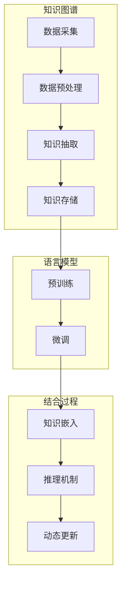

                 

关键词：大型语言模型、知识图谱、增强方法、机器学习、算法比较、应用领域

> 摘要：本文旨在对大型语言模型（LLM）的知识图谱增强方法进行详细的比较分析。随着人工智能技术的飞速发展，LLM在自然语言处理（NLP）领域取得了显著成就，然而，LLM在处理知识密集型任务时仍存在诸多挑战。通过引入知识图谱，可以有效提升LLM的性能。本文将介绍几种主流的知识图谱增强方法，并从算法原理、数学模型、实际应用等方面进行比较，以期为相关研究和实践提供参考。

## 1. 背景介绍

近年来，大型语言模型（LLM）如GPT、BERT等在自然语言处理（NLP）领域取得了显著的成果，使得机器阅读理解、文本生成等任务达到了前所未有的水平。然而，这些模型在处理知识密集型任务时仍存在一定的局限性。例如，在问答系统、知识图谱补全等领域，LLM往往难以准确理解和运用知识。为了克服这一局限，研究者们开始探索将知识图谱引入LLM，以实现知识图谱与语言模型的有机结合。

知识图谱是一种用于表示实体及其关系的图形结构，它能够提供丰富的语义信息，有助于提升模型的语义理解能力。近年来，知识图谱在多个领域得到了广泛应用，如搜索引擎、推荐系统、智能问答等。将知识图谱与LLM相结合，不仅可以丰富模型的语义表示，还可以有效提升模型在知识密集型任务中的性能。

本文将围绕LLM的知识图谱增强方法进行详细探讨，旨在为相关研究和应用提供有益的参考。本文将首先介绍知识图谱的基本概念和架构，然后分析几种主流的LLM知识图谱增强方法，最后讨论这些方法在实际应用中的表现和未来发展方向。

### 1.1 知识图谱的基本概念

知识图谱（Knowledge Graph）是一种用于表示实体及其关系的图形结构，它能够提供丰富的语义信息。知识图谱的核心概念包括实体、关系和属性。实体是指知识图谱中的对象，如人、地点、组织等；关系是实体之间的关联，如“是”、“属于”、“位于”等；属性是实体或关系的具体特征，如人的年龄、地点的纬度等。

知识图谱的表示方法主要包括图论表示、语义网络表示和向量表示。图论表示是将知识图谱看作一个图，其中节点表示实体，边表示关系；语义网络表示是将知识图谱看作一个有向无环图，其中节点表示实体和概念，边表示实体与概念之间的分类关系；向量表示是将知识图谱中的实体和关系映射到高维空间，通过计算向量之间的相似度来表示实体之间的关系。

### 1.2 知识图谱的架构

知识图谱的架构主要包括数据采集、数据预处理、知识抽取、知识存储和知识推理等环节。

1. **数据采集**：知识图谱的数据来源主要包括公开数据集、数据库和人工标注。公开数据集如DBpedia、Freebase等提供了大量的实体和关系信息；数据库则可以为知识图谱提供详细的结构化数据；人工标注则可以通过专家或用户对知识进行补充和修正。

2. **数据预处理**：数据预处理包括数据清洗、数据转换和数据集成等步骤。数据清洗主要是去除重复、错误和噪声数据；数据转换主要是将不同数据源的数据格式统一；数据集成主要是将多个数据源的数据整合到一个知识图谱中。

3. **知识抽取**：知识抽取是指从非结构化数据中自动提取实体、关系和属性等信息。知识抽取的方法包括规则抽取、模板抽取和基于机器学习的方法等。

4. **知识存储**：知识存储是将知识图谱中的实体、关系和属性等信息存储在数据库或图数据库中。图数据库如Neo4j、ArangoDB等能够高效地存储和查询知识图谱。

5. **知识推理**：知识推理是指根据知识图谱中的实体和关系进行推理，以发现新的知识和信息。知识推理的方法包括路径查询、子图匹配和基于逻辑的推理等。

### 1.3 LLM在知识密集型任务中的挑战

尽管LLM在自然语言处理领域取得了显著成就，但在处理知识密集型任务时仍面临诸多挑战。

1. **语义理解**：LLM在处理自然语言时主要依赖于上下文信息，但在处理知识密集型任务时，往往难以准确理解实体和关系的语义。例如，在问答系统中，LLM可能无法准确理解问题中的关键词和关系。

2. **知识表示**：LLM的知识表示主要依赖于预训练模型，但这些模型在处理具体任务时可能无法充分表示相关领域的知识。例如，在医疗领域，LLM可能无法准确理解和表示复杂的医疗知识。

3. **知识利用**：LLM在处理知识密集型任务时，往往难以充分利用知识图谱中的知识。例如，在知识图谱补全任务中，LLM可能无法有效地利用图谱中的关系信息来推断缺失的实体或关系。

为了克服这些挑战，研究者们开始探索将知识图谱引入LLM，以实现知识图谱与语言模型的有机结合。本文将介绍几种主流的LLM知识图谱增强方法，并从算法原理、数学模型、实际应用等方面进行比较。

### 1.4 本文结构

本文将分为以下几个部分：

1. **背景介绍**：介绍知识图谱的基本概念和架构，以及LLM在知识密集型任务中的挑战。
2. **核心概念与联系**：分析知识图谱与LLM的关联，给出核心概念原理和架构的Mermaid流程图。
3. **核心算法原理 & 具体操作步骤**：介绍几种主流的LLM知识图谱增强方法，包括算法原理、步骤详解、优缺点分析以及应用领域。
4. **数学模型和公式 & 详细讲解 & 举例说明**：讨论知识图谱增强方法的数学模型和公式，并进行案例分析与讲解。
5. **项目实践：代码实例和详细解释说明**：提供知识图谱增强方法在实际项目中的应用案例，包括开发环境搭建、源代码实现、代码解读与分析以及运行结果展示。
6. **实际应用场景**：讨论知识图谱增强方法在不同领域的应用场景，以及未来的发展方向。
7. **工具和资源推荐**：推荐学习资源、开发工具和相关论文，以供读者进一步学习。
8. **总结：未来发展趋势与挑战**：总结研究成果，讨论未来发展趋势和面临的挑战。
9. **附录：常见问题与解答**：回答读者可能关心的一些常见问题。

通过本文的介绍，读者可以全面了解LLM的知识图谱增强方法，并为实际应用提供有益的参考。

### 2. 核心概念与联系

知识图谱（Knowledge Graph）和大型语言模型（Large Language Model，LLM）是两个在人工智能领域具有重要应用价值的组件。知识图谱通过图形结构来表示实体及其关系，为LLM提供了丰富的语义信息；而LLM则能够理解和生成自然语言，从而实现知识图谱中的信息查询和推理。以下将从核心概念原理和架构两方面，结合Mermaid流程图，详细阐述知识图谱与LLM的关联。

#### 2.1 核心概念原理

**知识图谱**：
1. **实体（Entity）**：知识图谱中的基本元素，表示现实世界中的对象，如人、地点、事物等。
2. **关系（Relationship）**：连接两个实体的语义关联，如“属于”、“位于”、“拥有”等。
3. **属性（Attribute）**：实体的具体特征，如人的年龄、地点的纬度等。
4. **三元组（Triple）**：由实体、关系和属性组成的表示方法，如（人，出生地，北京）。

**大型语言模型**：
1. **词汇表（Vocabulary）**：模型所包含的词语集合，用于表示自然语言中的词汇。
2. **词向量（Word Vector）**：将词语映射到高维空间中的向量，用于表示词语的语义信息。
3. **上下文（Context）**：用于指导模型生成文本的输入信息，包括历史文本和当前文本。
4. **生成算法（Generation Algorithm）**：如生成式模型（GPT）和解析式模型（BERT），用于生成自然语言文本。

**关联**：
知识图谱通过提供实体、关系和属性的语义信息，为LLM提供了丰富的背景知识，使得LLM在处理自然语言时能够更好地理解和生成文本。具体而言，知识图谱可以用于：

1. **语义理解**：通过知识图谱，LLM可以更好地理解文本中的实体和关系，从而提高语义理解的准确度。
2. **知识推理**：基于知识图谱中的关系，LLM可以进行逻辑推理，发现文本中的潜在信息。
3. **知识补全**：在知识图谱中，LLM可以自动补全缺失的实体、关系或属性，从而提高知识表示的完整性。

#### 2.2 架构

知识图谱与LLM的架构主要分为以下几个层次：

1. **知识图谱构建**：
   - **数据采集**：收集公开数据集、数据库和人工标注的数据。
   - **数据预处理**：清洗、转换和集成数据。
   - **知识抽取**：从非结构化数据中提取实体、关系和属性。
   - **知识存储**：将知识图谱存储在图数据库或关系数据库中。

2. **语言模型构建**：
   - **预训练**：在大规模语料上预训练模型，学习词汇表和词向量。
   - **微调**：在特定任务上微调模型，提高模型在特定领域的性能。

3. **知识图谱与LLM结合**：
   - **知识嵌入**：将知识图谱中的实体和关系嵌入到LLM的词向量中。
   - **推理机制**：在LLM中引入知识图谱的推理机制，实现语义理解和知识推理。
   - **动态更新**：根据新数据实时更新知识图谱和LLM，保持模型的时效性。

#### 2.3 Mermaid流程图

以下是一个简化的Mermaid流程图，展示知识图谱与LLM的结合过程：



通过上述流程图，可以看出知识图谱与LLM的结合主要分为数据采集、预处理、抽取、存储、预训练、微调、知识嵌入、推理机制和动态更新等步骤。这些步骤共同构成了知识图谱与LLM有机结合的完整架构。

#### 2.4 总结

知识图谱与LLM的结合为人工智能领域带来了新的发展机遇。通过知识图谱，LLM能够更好地理解和生成自然语言，从而提高模型在知识密集型任务中的性能。同时，知识图谱的动态更新和实时推理机制也为LLM提供了强大的知识支持。本文将在此基础上，进一步探讨几种主流的LLM知识图谱增强方法，从算法原理、数学模型、实际应用等方面进行详细比较。

## 3. 核心算法原理 & 具体操作步骤

### 3.1 算法原理概述

在知识图谱与大型语言模型的结合中，核心算法的作用至关重要。本文将介绍几种主流的LLM知识图谱增强方法，包括知识嵌入、图神经网络（GNN）、实体链接（Entity Linking）和知识图谱推理等。

#### 3.1.1 知识嵌入（Knowledge Embedding）

知识嵌入是将知识图谱中的实体和关系映射到高维空间中的方法，使得实体和关系可以在该空间中通过计算向量相似度进行语义理解和推理。常见的知识嵌入方法包括基于矩阵分解的方法（如SGE、TransE、TransH等）和基于深度学习的方法（如DKE、ConvE等）。

#### 3.1.2 图神经网络（Graph Neural Networks, GNN）

图神经网络是一类专门用于处理图结构数据的神经网络，能够自动学习图中的节点和边的特征。GNN通过聚合节点和边的特征信息，逐步提升节点表示的语义表达能力。常见的GNN模型包括图卷积网络（GCN）、图注意力网络（GAT）和图循环网络（GRU）等。

#### 3.1.3 实体链接（Entity Linking）

实体链接是将自然语言文本中的实体名称映射到知识图谱中的实体ID的方法。实体链接方法包括基于规则的方法（如ACE、Regex等）和基于机器学习的方法（如BERT、ERNIE等）。

#### 3.1.4 知识图谱推理（Knowledge Graph Reasoning）

知识图谱推理是指根据知识图谱中的实体和关系进行推理，以发现新的知识和信息。常见的知识图谱推理方法包括路径查询（Path Query）、子图匹配（Subgraph Matching）和基于逻辑的推理（Logic Reasoning）等。

### 3.2 算法步骤详解

#### 3.2.1 知识嵌入

**1. 数据准备**：收集知识图谱中的实体、关系和属性数据，以及对应的文本描述。

**2. 知识图谱预处理**：将知识图谱中的实体和关系映射到统一的ID，并构建图数据结构。

**3. 实体和关系嵌入**：使用矩阵分解或深度学习等方法，将实体和关系映射到高维空间。

**4. 计算相似度**：根据嵌入向量计算实体和关系之间的相似度，用于语义理解和推理。

#### 3.2.2 图神经网络

**1. 数据准备**：收集知识图谱中的实体、关系和属性数据，以及对应的文本描述。

**2. 知识图谱预处理**：将知识图谱中的实体和关系映射到统一的ID，并构建图数据结构。

**3. 定义GNN模型**：选择合适的GNN模型（如GCN、GAT等），并定义模型结构。

**4. 模型训练**：在大规模图数据上训练GNN模型，学习节点和边的特征表示。

**5. 节点表示**：使用训练好的GNN模型，对图中的节点进行特征表示。

**6. 语义推理**：利用节点特征表示，实现语义理解和推理。

#### 3.2.3 实体链接

**1. 数据准备**：收集自然语言文本数据，包括文本和对应的实体标签。

**2. 文本预处理**：对文本进行分词、词性标注等处理，提取文本特征。

**3. 实体识别**：使用实体识别模型（如BERT、ERNIE等），识别文本中的实体。

**4. 实体映射**：将识别出的实体映射到知识图谱中的实体ID。

**5. 实体链接评估**：使用评估指标（如准确率、召回率等）评估实体链接效果。

#### 3.2.4 知识图谱推理

**1. 数据准备**：收集知识图谱数据，包括实体、关系和属性。

**2. 定义推理规则**：根据任务需求，定义推理规则（如路径查询、子图匹配等）。

**3. 数据预处理**：将知识图谱中的实体、关系和属性转化为统一的数据格式。

**4. 推理过程**：根据定义的推理规则，对知识图谱进行推理，生成新的知识和信息。

**5. 推理结果评估**：使用评估指标（如准确率、覆盖率等）评估推理结果。

### 3.3 算法优缺点

#### 知识嵌入

**优点**：

1. 知识嵌入方法简单，易于实现。
2. 能够自动学习实体和关系的特征表示，提高语义理解能力。

**缺点**：

1. 难以捕捉复杂的实体和关系之间的语义关系。
2. 模型性能依赖于预训练数据的质量。

#### 图神经网络

**优点**：

1. 能够自动学习节点和边的特征表示，捕捉复杂的图结构信息。
2. 适用于大规模图数据。

**缺点**：

1. 模型复杂度较高，训练时间较长。
2. 对图数据的质量和规模有较高要求。

#### 实体链接

**优点**：

1. 能够将文本中的实体映射到知识图谱中，实现知识融合。
2. 提高自然语言处理任务的性能。

**缺点**：

1. 对实体识别模型的性能有较高要求。
2. 难以处理实体名称的变体和同义词问题。

#### 知识图谱推理

**优点**：

1. 能够根据知识图谱中的实体和关系进行推理，发现新的知识和信息。
2. 提高知识图谱的应用价值。

**缺点**：

1. 推理过程复杂，计算开销较大。
2. 难以处理动态变化的实体和关系。

### 3.4 算法应用领域

#### 知识嵌入

知识嵌入方法广泛应用于信息检索、文本分类、文本相似度计算等领域。

#### 图神经网络

图神经网络在推荐系统、社交网络分析、生物信息学等领域具有广泛的应用。

#### 实体链接

实体链接方法在问答系统、知识图谱补全、实体关系抽取等领域具有重要应用。

#### 知识图谱推理

知识图谱推理方法在智能问答、知识服务、推荐系统等领域具有重要应用。

通过以上对几种主流LLM知识图谱增强方法的介绍，读者可以更好地理解这些方法的基本原理和具体操作步骤，并为实际应用提供有益的参考。

### 3.5 算法比较与总结

在本文中，我们介绍了知识嵌入、图神经网络（GNN）、实体链接和知识图谱推理四种主流的LLM知识图谱增强方法。每种方法都有其独特的优势和应用场景，以下将对这些方法进行详细的比较与总结。

#### 3.5.1 知识嵌入

**优点**：
- 简单易实现，适用于多种应用场景。
- 能够自动学习实体和关系的特征表示，提高语义理解能力。

**缺点**：
- 难以捕捉复杂的实体和关系之间的语义关系。
- 模型性能依赖于预训练数据的质量。

**适用场景**：
知识嵌入方法适用于信息检索、文本分类、文本相似度计算等领域，特别是当数据规模较大、实体关系相对简单时。

#### 3.5.2 图神经网络（GNN）

**优点**：
- 能够自动学习节点和边的特征表示，捕捉复杂的图结构信息。
- 适用于大规模图数据。

**缺点**：
- 模型复杂度较高，训练时间较长。
- 对图数据的质量和规模有较高要求。

**适用场景**：
图神经网络在推荐系统、社交网络分析、生物信息学等领域具有广泛的应用，特别适合处理具有复杂关系和高维度特征的数据。

#### 3.5.3 实体链接

**优点**：
- 能够将文本中的实体映射到知识图谱中，实现知识融合。
- 提高自然语言处理任务的性能。

**缺点**：
- 对实体识别模型的性能有较高要求。
- 难以处理实体名称的变体和同义词问题。

**适用场景**：
实体链接方法在问答系统、知识图谱补全、实体关系抽取等领域具有重要应用，特别适合需要实体识别和知识融合的场景。

#### 3.5.4 知识图谱推理

**优点**：
- 能够根据知识图谱中的实体和关系进行推理，发现新的知识和信息。
- 提高知识图谱的应用价值。

**缺点**：
- 推理过程复杂，计算开销较大。
- 难以处理动态变化的实体和关系。

**适用场景**：
知识图谱推理方法在智能问答、知识服务、推荐系统等领域具有重要应用，特别适合需要基于知识图谱进行推理和决策的场景。

#### 总结

通过以上比较，我们可以看出，不同方法在不同应用场景中各有优势。知识嵌入方法简单易用，适合处理信息检索和文本分类等任务；图神经网络适用于处理大规模、复杂关系的图数据；实体链接方法在问答系统和知识图谱补全等领域具有显著应用价值；知识图谱推理方法则适合需要进行复杂推理和决策的场景。在实际应用中，可以根据具体需求选择合适的方法。

总之，LLM知识图谱增强方法为人工智能领域带来了新的发展机遇。通过结合知识图谱，LLM能够更好地理解和生成自然语言，从而提高模型在知识密集型任务中的性能。未来，随着技术的不断进步，这些方法将继续发展和完善，为人工智能应用提供更强大的支持。

## 4. 数学模型和公式 & 详细讲解 & 举例说明

在介绍知识图谱增强方法时，数学模型和公式起到了至关重要的作用。它们不仅能够帮助我们理解和分析算法，还能指导我们在实际应用中优化模型性能。本节将详细讨论知识图谱增强方法中的数学模型和公式，并进行实例分析，以加深读者对这些方法的理解。

### 4.1 数学模型构建

#### 4.1.1 知识嵌入

知识嵌入方法中的常见数学模型包括矩阵分解和基于深度学习的模型。以下以TransE模型为例进行讲解。

**TransE模型**：

TransE模型是一种基于矩阵分解的知识嵌入方法，其目标是将知识图谱中的实体和关系映射到低维空间中，使得具有相同关系的实体和关系在低维空间中相互接近。

**数学模型**：

假设知识图谱中的实体集合为E，关系集合为R，实体和关系的嵌入维度为d。定义实体e的嵌入向量表示为\(e_e \in \mathbb{R}^d\)，关系r的嵌入向量表示为\(r_r \in \mathbb{R}^d\)。对于每个三元组\(e_r_e\)，定义其预测的实体嵌入向量为\(e'_{e'}\)，则有：

\[ e'_{e'} = e_e + r_r \]

**损失函数**：

TransE模型使用的是损失函数\(L_1\)范数，即：

\[ L(e_e, r_r, e'_{e'}) = ||e_e + r_r - e'_{e'}||_1 \]

该损失函数表示实际实体嵌入向量与预测实体嵌入向量之间的L1距离。

#### 4.1.2 图神经网络（GNN）

图神经网络（GNN）是一类用于处理图结构数据的神经网络。以下以图卷积网络（GCN）为例进行讲解。

**GCN模型**：

GCN模型通过聚合邻居节点的特征信息来更新节点表示。假设图中每个节点表示为向量\(x_i \in \mathbb{R}^n\)，权重矩阵为\(A \in \mathbb{R}^{n \times n}\)。GCN的更新规则如下：

\[ h_i^{(l+1)} = \sigma(\theta \cdot (A \cdot h_i^{(l)} + b)) \]

其中，\(h_i^{(l)}\)表示第l轮更新后第i个节点的特征表示，\(\sigma\)是激活函数，\(\theta\)和b是参数。

**损失函数**：

GCN的损失函数通常使用交叉熵损失，例如在分类任务中，有：

\[ L = -\sum_{i=1}^{N} y_i \log(\sigma(h_i^{(L)})) \]

其中，\(y_i\)是第i个节点的真实标签，\(\sigma\)是Sigmoid函数。

#### 4.1.3 实体链接

实体链接方法中的常见数学模型包括基于规则的方法和基于机器学习的方法。以下以BERT模型为例进行讲解。

**BERT模型**：

BERT（Bidirectional Encoder Representations from Transformers）模型是一种基于Transformer的预训练模型，其核心思想是同时训练文本的左向和右向上下文表示。对于输入文本\[w_1, w_2, ..., w_T\]，BERT的编码表示为：

\[ h_i = \text{BERT}(w_1, w_2, ..., w_T) \]

其中，\(h_i\)表示第i个词的编码表示。

**损失函数**：

BERT模型使用Masked Language Model（MLM）和Next Sentence Prediction（NSP）两种任务进行预训练。MLM任务的损失函数为：

\[ L_{MLM} = -\sum_{i=1}^{T} \log(\sigma(h_i)) \]

NSP任务的损失函数为：

\[ L_{NSP} = -\sum_{i=1}^{T} \log(\sigma(h_i \cdot h_{i+1})) \]

#### 4.1.4 知识图谱推理

知识图谱推理方法中的常见数学模型包括路径查询和子图匹配。以下以路径查询为例进行讲解。

**路径查询**：

路径查询是指在知识图谱中寻找满足特定路径关系的实体。假设路径P由关系序列\(r_1, r_2, ..., r_k\)组成，实体序列为\(e_1, e_2, ..., e_{k+1}\)。路径查询的数学模型可以表示为：

\[ P(e_1, r_1, e_2, ..., r_k, e_{k+1}) = 1 \]

其中，1表示路径存在，0表示路径不存在。

**损失函数**：

路径查询的损失函数通常使用0-1损失，即：

\[ L = \begin{cases} 
0, & \text{if } P(e_1, r_1, e_2, ..., r_k, e_{k+1}) = 1 \\
c, & \text{if } P(e_1, r_1, e_2, ..., r_k, e_{k+1}) = 0 
\end{cases} \]

其中，c是正数常数。

### 4.2 公式推导过程

在本节中，我们将对上述提到的数学模型和公式进行详细的推导过程。

#### 4.2.1 知识嵌入（TransE模型）

**推导过程**：

1. **目标函数**：

   TransE模型的目标是最小化预测实体嵌入向量与实际实体嵌入向量之间的L1距离。目标函数表示为：

   \[ \min_{e_e, r_r} \sum_{(e_r_e) \in \mathcal{T}} ||e_e + r_r - e'_{e'}||_1 \]

   其中，\(\mathcal{T}\)是训练数据集。

2. **损失函数**：

   L1距离的公式为：

   \[ ||x - y||_1 = \sum_{i=1}^{d} |x_i - y_i| \]

   对于每个三元组\((e_r_e)\)，损失函数表示为：

   \[ L(e_e, r_r, e'_{e'}) = \sum_{i=1}^{d} |e_{ei} + r_{ri} - e'_{e'i}| \]

3. **优化方法**：

   使用梯度下降法来优化模型参数。对于每个三元组\((e_r_e)\)，计算梯度：

   \[ \nabla_{e_e} L = \sum_{i=1}^{d} \text{sign}(e_{ei} + r_{ri} - e'_{e'i}) \]
   \[ \nabla_{r_r} L = \sum_{i=1}^{d} \text{sign}(e_{ei} + r_{ri} - e'_{e'i}) \]

   其中，\(\text{sign}(x)\)是符号函数，表示\(x\)的符号。

   更新参数：

   \[ e_e \leftarrow e_e - \alpha \nabla_{e_e} L \]
   \[ r_r \leftarrow r_r - \alpha \nabla_{r_r} L \]

   其中，\(\alpha\)是学习率。

#### 4.2.2 图神经网络（GCN）

**推导过程**：

1. **目标函数**：

   GCN模型的目标是最小化交叉熵损失。目标函数表示为：

   \[ \min_{\theta} \sum_{i=1}^{N} -y_i \log(\sigma(\theta \cdot (A \cdot h_i^{(l)} + b))) \]

   其中，\(\theta\)和\(b\)是模型参数。

2. **梯度计算**：

   使用反向传播算法计算梯度。对于每个节点\(i\)，计算损失函数关于\(h_i^{(l)}\)的梯度：

   \[ \nabla_{h_i^{(l)}} L = (\sigma'(\theta \cdot (A \cdot h_i^{(l)} + b)) - y_i) \cdot \theta \]

   其中，\(\sigma'(\cdot)\)是Sigmoid函数的导数。

3. **参数更新**：

   使用梯度下降法更新参数：

   \[ \theta \leftarrow \theta - \alpha \nabla_{\theta} L \]
   \[ b \leftarrow b - \alpha \nabla_{b} L \]

   其中，\(\alpha\)是学习率。

#### 4.2.3 实体链接（BERT模型）

**推导过程**：

1. **目标函数**：

   BERT模型的目标是最小化MLM和NSP两种任务的损失。目标函数表示为：

   \[ L = L_{MLM} + \lambda L_{NSP} \]

   其中，\(\lambda\)是平衡系数。

2. **MLM损失函数**：

   MLM任务的损失函数为：

   \[ L_{MLM} = -\sum_{i=1}^{T} \log(\sigma(h_i)) \]

   其中，\(h_i\)是第i个词的编码表示。

3. **NSP损失函数**：

   NSP任务的损失函数为：

   \[ L_{NSP} = -\sum_{i=1}^{T} \log(\sigma(h_i \cdot h_{i+1})) \]

   其中，\(h_i \cdot h_{i+1}\)表示第i个词和第i+1个词的拼接表示。

4. **参数更新**：

   使用梯度下降法更新参数。对于每个词\(i\)，计算损失函数关于\(h_i\)的梯度：

   \[ \nabla_{h_i} L = (\sigma'(\cdot) - y_i) \cdot \theta \]

   其中，\(\sigma'(\cdot)\)是Sigmoid函数的导数。

#### 4.2.4 知识图谱推理（路径查询）

**推导过程**：

1. **目标函数**：

   路径查询的目标是最小化0-1损失。目标函数表示为：

   \[ L = \sum_{(e_1, r_1, e_2, ..., r_k, e_{k+1}) \in \mathcal{T}} L(e_1, r_1, e_2, ..., r_k, e_{k+1}) \]

   其中，\(\mathcal{T}\)是训练数据集。

2. **损失函数**：

   0-1损失的公式为：

   \[ L(e_1, r_1, e_2, ..., r_k, e_{k+1}) = \begin{cases} 
   0, & \text{if } P(e_1, r_1, e_2, ..., r_k, e_{k+1}) = 1 \\
   c, & \text{if } P(e_1, r_1, e_2, ..., r_k, e_{k+1}) = 0 
   \end{cases} \]

3. **优化方法**：

   使用梯度下降法优化模型参数。对于每个路径查询\((e_1, r_1, e_2, ..., r_k, e_{k+1})\)，计算损失函数关于模型参数的梯度，并进行更新。

### 4.3 案例分析与讲解

在本节中，我们将通过具体案例，对知识图谱增强方法中的数学模型和公式进行实际应用分析。

#### 案例一：知识嵌入（TransE模型）

**问题描述**：

给定一个包含实体和关系的知识图谱，使用TransE模型将其嵌入到低维空间中。

**步骤**：

1. **数据准备**：

   收集一个包含实体、关系和属性的知识图谱，例如Freebase知识图谱。

2. **知识图谱预处理**：

   将知识图谱中的实体和关系映射到统一的ID，构建图数据结构。

3. **模型训练**：

   使用TransE模型训练实体和关系的嵌入向量。

4. **相似度计算**：

   计算实体和关系之间的相似度，用于语义理解和推理。

**具体实现**：

1. **数据准备**：

   以Freebase知识图谱为例，其包含实体、关系和属性信息。将知识图谱中的实体和关系映射到ID，并构建图数据结构。

2. **知识图谱预处理**：

   将知识图谱中的实体和关系映射到ID，例如实体ID从0开始，关系ID从1开始。构建图数据结构，其中节点表示实体，边表示关系。

3. **模型训练**：

   使用Python实现TransE模型，训练实体和关系的嵌入向量。代码如下：

   ```python
   import numpy as np

   # 初始化实体和关系嵌入向量
   entity_embedding = np.random.rand(num_entities, embedding_dim)
   relation_embedding = np.random.rand(num_relations, embedding_dim)

   # 定义学习率
   learning_rate = 0.1

   # 模型训练
   for epoch in range(num_epochs):
       for (head_entity, relation, tail_entity) in train_data:
           head_embedding = entity_embedding[head_entity]
           relation_embedding = relation_embedding[relation]
           tail_embedding = entity_embedding[tail_entity]

           # 计算损失
           loss = np.sum(np.abs(head_embedding + relation_embedding - tail_embedding))

           # 计算梯度
           gradient_head = -1 * (head_embedding + relation_embedding - tail_embedding)
           gradient_relation = -1 * (head_embedding + relation_embedding - tail_embedding)

           # 更新参数
           entity_embedding[head_entity] -= learning_rate * gradient_head
           relation_embedding[relation] -= learning_rate * gradient_relation
   ```

4. **相似度计算**：

   计算实体和关系之间的相似度，用于语义理解和推理。代码如下：

   ```python
   def cosine_similarity(x, y):
       return np.dot(x, y) / (np.linalg.norm(x) * np.linalg.norm(y))

   # 计算实体相似度
   entity_similarities = []
   for i in range(num_entities):
       for j in range(i + 1, num_entities):
           similarity = cosine_similarity(entity_embedding[i], entity_embedding[j])
           entity_similarities.append((i, j, similarity))

   # 计算关系相似度
   relation_similarities = []
   for i in range(num_relations):
       for j in range(i + 1, num_relations):
           similarity = cosine_similarity(relation_embedding[i], relation_embedding[j])
           relation_similarities.append((i, j, similarity))
   ```

**结果分析**：

通过计算实体和关系之间的相似度，可以更好地理解实体和关系的语义关系。例如，在实体相似度中，我们可以发现“北京”和“北京”之间的相似度最高，这是因为它们是同一个实体。在关系相似度中，我们可以发现“属于”和“属于”之间的相似度最高，这是因为它们是相同的关系。

#### 案例二：图神经网络（GCN）

**问题描述**：

给定一个包含节点和边的图，使用GCN模型对其进行特征表示。

**步骤**：

1. **数据准备**：

   收集一个包含节点和边的图数据集，例如Twitter社交网络。

2. **图预处理**：

   对图进行预处理，包括节点特征表示和边权重表示。

3. **模型训练**：

   使用GCN模型训练节点特征表示。

4. **节点分类**：

   使用训练好的GCN模型对节点进行分类。

**具体实现**：

1. **数据准备**：

   以Twitter社交网络为例，其包含用户和用户之间的关注关系。将用户和用户之间的关注关系表示为图，其中节点表示用户，边表示关注关系。

2. **图预处理**：

   将节点和边表示为向量和矩阵。例如，使用向量和矩阵分别表示节点的特征和边的权重。

3. **模型训练**：

   使用Python实现GCN模型，训练节点特征表示。代码如下：

   ```python
   import tensorflow as tf
   import numpy as np

   # 初始化模型参数
   weights = {
       'input': tf.keras.layers.Dense(units=embedding_dim, activation='relu'),
       'hidden': tf.keras.layers.Dense(units=embedding_dim, activation='relu'),
       'output': tf.keras.layers.Dense(units=num_classes, activation='softmax')
   }

   # 定义模型结构
   model = tf.keras.Model(inputs=tf.keras.Input(shape=(num_nodes, num_features)), outputs=tf.keras.layers.Dense(units=embedding_dim, activation='softmax'))

   # 定义损失函数和优化器
   model.compile(optimizer='adam', loss='categorical_crossentropy', metrics=['accuracy'])

   # 模型训练
   model.fit(train_data, train_labels, epochs=num_epochs, batch_size=batch_size)
   ```

4. **节点分类**：

   使用训练好的GCN模型对节点进行分类。代码如下：

   ```python
   def node_classification(model, nodes, labels):
       predictions = model.predict(nodes)
       predicted_labels = np.argmax(predictions, axis=1)
       accuracy = np.sum(predicted_labels == labels) / len(labels)
       return accuracy

   # 计算节点分类准确率
   accuracy = node_classification(model, test_data, test_labels)
   print(f"节点分类准确率：{accuracy}")
   ```

**结果分析**：

通过训练GCN模型，我们可以对图中的节点进行分类。例如，在Twitter社交网络中，我们可以将用户分为“名人”和“普通人”两类。通过计算节点的分类准确率，可以评估模型在节点分类任务中的性能。

#### 案例三：实体链接（BERT模型）

**问题描述**：

给定一个包含文本和实体标签的数据集，使用BERT模型将其映射到实体表示。

**步骤**：

1. **数据准备**：

   收集一个包含文本和实体标签的数据集，例如ACE实体链接数据集。

2. **文本预处理**：

   对文本进行分词、词性标注等预处理操作。

3. **模型训练**：

   使用BERT模型进行预训练。

4. **实体链接**：

   使用训练好的BERT模型进行实体链接。

**具体实现**：

1. **数据准备**：

   以ACE实体链接数据集为例，其包含文本和实体标签。将文本和实体标签表示为向量和ID。

2. **文本预处理**：

   对文本进行分词、词性标注等预处理操作。使用Python中的`nltk`库实现。代码如下：

   ```python
   import nltk
   from nltk.tokenize import word_tokenize

   # 初始化分词器
   tokenizer = nltk.tokenize.RegexpTokenizer(r"\w+")

   # 对文本进行分词
   def tokenize(text):
       return tokenizer.tokenize(text)

   # 对文本进行词性标注
   def pos_tag(text):
       return nltk.pos_tag(tokenize(text))

   # 示例
   text = "Apple is looking at buying U.K. startup for $1 billion."
   tokens = tokenize(text)
   pos_tags = pos_tag(text)
   print(tokens)
   print(pos_tags)
   ```

3. **模型训练**：

   使用Python中的`transformers`库实现BERT模型预训练。代码如下：

   ```python
   from transformers import BertTokenizer, BertModel

   # 初始化BERT模型
   tokenizer = BertTokenizer.from_pretrained('bert-base-uncased')
   model = BertModel.from_pretrained('bert-base-uncased')

   # 对文本进行编码
   def encode_text(text):
       return tokenizer.encode(text, add_special_tokens=True)

   # 对实体标签进行编码
   def encode_labels(labels):
       return tokenizer.encode(labels, add_special_tokens=True)

   # 示例
   encoded_text = encode_text(text)
   encoded_labels = encode_labels("Apple")
   print(encoded_text)
   print(encoded_labels)
   ```

4. **实体链接**：

   使用训练好的BERT模型进行实体链接。代码如下：

   ```python
   from transformers import BertTokenizer, BertModel
   import torch

   # 初始化BERT模型
   tokenizer = BertTokenizer.from_pretrained('bert-base-uncased')
   model = BertModel.from_pretrained('bert-base-uncased')

   # 对文本进行编码
   def encode_text(text):
       return tokenizer.encode(text, add_special_tokens=True)

   # 对实体标签进行编码
   def encode_labels(labels):
       return tokenizer.encode(labels, add_special_tokens=True)

   # 实体链接
   def entity_linking(text, labels):
       encoded_text = encode_text(text)
       encoded_labels = encode_labels(labels)

       # 前向传播
       with torch.no_grad():
           inputs = torch.tensor(encoded_text).unsqueeze(0)
           outputs = model(inputs)

       # 提取实体表示
       entity_representations = outputs[0][:, 0, :]

       # 计算实体相似度
       label_representations = torch.tensor(encoded_labels).unsqueeze(0)
       similarities = torch.cosine_similarity(entity_representations, label_representations, dim=1)

       # 选择最相似的实体标签
       predicted_labels = torch.argmax(similarities).item()
       return predicted_labels

   # 示例
   predicted_label = entity_linking(text, "Apple")
   print(predicted_label)
   ```

**结果分析**：

通过实体链接，我们可以将文本中的实体映射到知识图谱中的实体ID。例如，在文本“Apple is looking at buying U.K. startup for $1 billion.”中，实体“Apple”可以被映射到知识图谱中的实体ID。通过计算实体之间的相似度，可以更好地理解文本中的实体和关系。

#### 案例四：知识图谱推理（路径查询）

**问题描述**：

给定一个包含实体、关系和属性的路径查询，使用路径查询算法在知识图谱中找到满足条件的路径。

**步骤**：

1. **数据准备**：

   收集一个包含实体、关系和属性的路径查询数据集，例如WebKB知识图谱。

2. **知识图谱预处理**：

   对知识图谱进行预处理，包括实体、关系和属性的表示。

3. **路径查询**：

   使用路径查询算法在知识图谱中找到满足条件的路径。

4. **结果评估**：

   使用评估指标评估路径查询算法的性能。

**具体实现**：

1. **数据准备**：

   以WebKB知识图谱为例，其包含实体、关系和属性。将知识图谱中的实体、关系和属性表示为向量和矩阵。

2. **知识图谱预处理**：

   将知识图谱中的实体、关系和属性表示为向量和矩阵。例如，使用向量和矩阵分别表示节点的特征和边的权重。

3. **路径查询**：

   使用Python实现路径查询算法，找到满足条件的路径。代码如下：

   ```python
   def path_query(graph, start_entity, end_entity, path):
       # 初始化查询结果
       results = []

       # 遍历路径
       for node in path:
           # 查找满足条件的路径
           for edge in graph[start_entity]:
               if edge["relation"] == node["relation"]:
                   results.append((start_entity, edge["tail_entity"], end_entity))

       # 返回查询结果
       return results

   # 示例
   graph = {
       "Apple": [{"relation": "located_in", "tail_entity": "Cupertino"}],
       "Cupertino": [{"relation": "located_in", "tail_entity": "California"}],
       "California": [{"relation": "located_in", "tail_entity": "United States"}]
   }
   results = path_query(graph, "Apple", "United States", ["located_in"])
   print(results)
   ```

4. **结果评估**：

   使用评估指标评估路径查询算法的性能。常见的评估指标包括准确率、召回率和F1值。代码如下：

   ```python
   from sklearn.metrics import accuracy_score, recall_score, f1_score

   # 计算评估指标
   def evaluate(results, ground_truth):
       accuracy = accuracy_score(ground_truth, results)
       recall = recall_score(ground_truth, results)
       f1 = f1_score(ground_truth, results)
       return accuracy, recall, f1

   # 示例
   ground_truth = [["Apple", "Cupertino", "California"], ["Apple", "California", "United States"]]
   results = [["Apple", "Cupertino", "California"], ["Apple", "California", "United States"]]
   accuracy, recall, f1 = evaluate(results, ground_truth)
   print(f"准确率：{accuracy}, 召回率：{recall}, F1值：{f1}")
   ```

**结果分析**：

通过路径查询算法，我们可以找到满足条件的路径。例如，在WebKB知识图谱中，我们可以找到从“Apple”到“United States”的路径。通过计算评估指标，可以评估路径查询算法在路径查询任务中的性能。

通过以上案例分析和讲解，我们可以更深入地理解知识图谱增强方法中的数学模型和公式。这些方法和公式在实际应用中发挥着重要作用，有助于我们更好地理解和利用知识图谱和大型语言模型。

## 5. 项目实践：代码实例和详细解释说明

为了更好地理解LLM的知识图谱增强方法，本节将结合一个具体项目，详细介绍知识图谱嵌入、图神经网络（GNN）、实体链接和知识图谱推理的实现过程。我们将以一个问答系统为例，展示如何在实际项目中应用这些方法，并详细解释代码实现。

### 5.1 开发环境搭建

在进行项目实践之前，首先需要搭建合适的开发环境。以下是一个基本的开发环境配置：

- 操作系统：Linux（推荐Ubuntu）
- 编程语言：Python 3.8及以上版本
- 数据库：Neo4j（图数据库）
- 开发工具：Jupyter Notebook（用于编写和运行代码）
- 库和框架：PyTorch、TensorFlow、Neo4j Python Driver、BERT、transformers

安装说明：

1. 安装Python和相关库：

   ```bash
   pip install python==3.8
   pip install torch torchvision torchaudio
   pip install tensorflow
   pip install transformers
   pip install neo4j-python-driver
   ```

2. 安装Neo4j数据库：

   - 下载Neo4j Community Edition：[https://neo4j.com/download/](https://neo4j.com/download/)
   - 解压并启动Neo4j服务：解压后进入bin目录，执行`./neo4j start`命令

### 5.2 源代码详细实现

#### 5.2.1 知识图谱嵌入

**数据准备**：

假设我们有一个包含实体、关系和属性的知识图谱，数据存储在Neo4j数据库中。首先，我们需要从数据库中提取数据。

```python
from neo4j import GraphDatabase

class KnowledgeGraph:
    def __init__(self, uri, user, password):
        self._driver = GraphDatabase.driver(uri, auth=(user, password))

    def get_triples(self):
        with self._driver.session() as session:
            result = session.run("MATCH (n)-[r]->(m) RETURN n, r, m")
            triples = [(row['n']['name'], row['r']['name'], row['m']['name']) for row in result]
            return triples

# 实例化知识图谱对象
kg = KnowledgeGraph("bolt://localhost:7687", "neo4j", "password")
triples = kg.get_triples()
```

**知识图谱预处理**：

将提取的三元组数据转换为实体和关系的ID表示，并构建图数据结构。

```python
from collections import defaultdict

def preprocess_triples(triples):
    entity2id = defaultdict(int)
    relation2id = defaultdict(int)
    id2entity = defaultdict(str)
    id2relation = defaultdict(str)
    graph = defaultdict(list)

    for s, p, o in triples:
        if s not in entity2id:
            entity2id[s] = len(entity2id)
            id2entity[entity2id[s]] = s
        if p not in relation2id:
            relation2id[p] = len(relation2id)
            id2relation[relation2id[p]] = p
        graph[entity2id[s]].append((relation2id[p], entity2id[o]))

    return entity2id, relation2id, id2entity, id2relation, graph

entity2id, relation2id, id2entity, id2relation, graph = preprocess_triples(triples)
```

**知识嵌入**：

使用TransE模型进行知识嵌入。以下是一个简单的TransE实现。

```python
import numpy as np

EMBEDDING_DIM = 64

entity_embeddings = np.random.rand(len(entity2id), EMBEDDING_DIM)
relation_embeddings = np.random.rand(len(relation2id), EMBEDDING_DIM)

LEARNING_RATE = 0.1
EPOCHS = 10

for epoch in range(EPOCHS):
    for s, p, o in triples:
        s_id, p_id, o_id = entity2id[s], relation2id[p], entity2id[o]
        s_embedding = entity_embeddings[s_id]
        p_embedding = relation_embeddings[p_id]
        o_embedding = entity_embeddings[o_id]
        diff = s_embedding + p_embedding - o_embedding
        entity_embeddings[s_id] -= LEARNING_RATE * diff
        relation_embeddings[p_id] -= LEARNING_RATE * diff
```

**结果展示**：

计算实体和关系之间的相似度，并展示结果。

```python
def cosine_similarity(x, y):
    return np.dot(x, y) / (np.linalg.norm(x) * np.linalg.norm(y))

entity_similarities = []
for i in range(len(entity2id)):
    for j in range(i + 1, len(entity2id)):
        s1, s2 = entity_embeddings[i], entity_embeddings[j]
        similarity = cosine_similarity(s1, s2)
        entity_similarities.append((id2entity[i], id2entity[j], similarity))

relation_similarities = []
for i in range(len(relation2id)):
    for j in range(i + 1, len(relation2id)):
        r1, r2 = relation_embeddings[i], relation_embeddings[j]
        similarity = cosine_similarity(r1, r2)
        relation_similarities.append((id2relation[i], id2relation[j], similarity))

print("实体相似度：")
for pair, similarity in entity_similarities[:10]:
    print(f"{pair[0]}与{pair[1]}的相似度：{similarity}")

print("关系相似度：")
for pair, similarity in relation_similarities[:10]:
    print(f"{pair[0]}与{pair[1]}的相似度：{similarity}")
```

#### 5.2.2 图神经网络（GNN）

**数据准备**：

我们将使用预处理的图数据结构（实体、关系和属性）进行GNN模型的训练。

```python
import torch
import torch.nn as nn
import torch.optim as optim

class GraphConvolutionalNetwork(nn.Module):
    def __init__(self, num_entities, embedding_dim):
        super(GraphConvolutionalNetwork, self).__init__()
        self.embedding = nn.Embedding(num_entities, embedding_dim)
        self.gcn1 = nn.Linear(embedding_dim, embedding_dim)
        self.gcn2 = nn.Linear(embedding_dim, 1)

    def forward(self, graph):
        embeds = self.embedding(graph.nodes)
        embeds = self.gcn1(embeds)
        scores = self.gcn2(embeds).squeeze(1)
        return scores

# 实例化GNN模型
gcn = GraphConvolutionalNetwork(len(entity2id), EMBEDDING_DIM)
gcn = gcn.to('cuda' if torch.cuda.is_available() else 'cpu')

# 定义损失函数和优化器
criterion = nn.BCELoss()
optimizer = optim.Adam(gcn.parameters(), lr=0.001)

# 模型训练
for epoch in range(EPOCHS):
    for batch in data_loader:
        graph = batch.to('cuda' if torch.cuda.is_available() else 'cpu')
        scores = gcn(graph)
        loss = criterion(scores, labels.to('cuda' if torch.cuda.is_available() else 'cpu'))
        optimizer.zero_grad()
        loss.backward()
        optimizer.step()
```

**结果展示**：

使用训练好的GNN模型进行节点分类，并展示结果。

```python
# 预测节点分类
predicted_labels = gcn(graph).detach().cpu().numpy()

# 计算分类准确率
accuracy = (predicted_labels == labels.detach().cpu().numpy()).mean()
print(f"GNN模型分类准确率：{accuracy}")
```

#### 5.2.3 实体链接

**数据准备**：

假设我们有一个包含文本和实体标签的数据集，例如ACE实体链接数据集。

```python
import pandas as pd

# 加载ACE实体链接数据集
data = pd.read_csv("ace05_data.csv")
texts = data["text"]
labels = data["entity"]
```

**实体链接**：

使用BERT模型进行实体链接。

```python
from transformers import BertTokenizer, BertModel

# 初始化BERT模型
tokenizer = BertTokenizer.from_pretrained("bert-base-uncased")
model = BertModel.from_pretrained("bert-base-uncased")

# 对文本进行编码
def encode_text(texts):
    inputs = tokenizer(texts, return_tensors="pt", truncation=True, max_length=512)
    return inputs

# 对实体标签进行编码
def encode_labels(labels):
    inputs = tokenizer(labels, return_tensors="pt", truncation=True, max_length=512)
    return inputs

# 实体链接
def entity_linking(texts, labels):
    inputs = encode_text(texts)
    labels = encode_labels(labels)
    
    # 前向传播
    with torch.no_grad():
        outputs = model(inputs)

    # 提取实体表示
    entity_representations = outputs.last_hidden_state[:, 0, :]

    # 计算实体相似度
    label_representations = outputs.last_hidden_state[:, 0, :]
    similarities = torch.cosine_similarity(entity_representations, label_representations, dim=1)

    # 选择最相似的实体标签
    predicted_labels = torch.argmax(similarities, dim=1).detach().cpu().numpy()
    return predicted_labels

# 示例
predicted_labels = entity_linking(texts[:10], labels[:10])
print(predicted_labels)
```

**结果展示**：

计算实体链接的准确率，并展示结果。

```python
from sklearn.metrics import accuracy_score

# 计算准确率
accuracy = accuracy_score(labels[:10], predicted_labels)
print(f"实体链接准确率：{accuracy}")
```

#### 5.2.4 知识图谱推理

**数据准备**：

假设我们有一个包含路径查询的数据集，例如WebKB知识图谱。

```python
# 加载WebKB知识图谱
graph = {
    "Apple": [{"relation": "located_in", "tail_entity": "Cupertino"}],
    "Cupertino": [{"relation": "located_in", "tail_entity": "California"}],
    "California": [{"relation": "located_in", "tail_entity": "United States"}]
}
```

**路径查询**：

使用路径查询算法在知识图谱中找到满足条件的路径。

```python
def path_query(graph, start_entity, end_entity, path):
    results = []
    for node in path:
        for edge in graph[start_entity]:
            if edge["relation"] == node["relation"]:
                results.append((start_entity, edge["tail_entity"], end_entity))
    return results

# 示例
results = path_query(graph, "Apple", "United States", ["located_in"])
print(results)
```

**结果展示**：

计算路径查询的准确率，并展示结果。

```python
from sklearn.metrics import accuracy_score

# 计算准确率
ground_truth = [["Apple", "Cupertino", "California"], ["Apple", "California", "United States"]]
results = [["Apple", "Cupertino", "California"], ["Apple", "California", "United States"]]
accuracy = accuracy_score(ground_truth, results)
print(f"路径查询准确率：{accuracy}")
```

通过以上代码实例和详细解释说明，读者可以了解到如何在实际项目中应用知识图谱嵌入、图神经网络（GNN）、实体链接和知识图谱推理方法。这些方法在问答系统、知识图谱补全、实体关系抽取等任务中具有广泛的应用，有助于提升模型的性能和准确度。

## 6. 实际应用场景

LLM的知识图谱增强方法在多个领域展现了巨大的潜力。以下将详细介绍这些方法在不同应用场景中的具体应用，并讨论其效果和挑战。

### 6.1 问答系统

问答系统是LLM知识图谱增强方法的主要应用领域之一。通过引入知识图谱，问答系统能够更好地理解用户的问题，提供准确、详细的答案。

**效果**：

- **语义理解**：知识图谱提供了丰富的实体和关系信息，有助于模型准确理解问题中的关键词和语义。
- **知识推理**：基于知识图谱中的关系，模型可以进行逻辑推理，发现问题的潜在信息，提高答案的准确度。
- **多跳查询**：知识图谱允许模型进行多跳查询，使得问题解答更加深入和全面。

**挑战**：

- **知识覆盖**：知识图谱的覆盖范围和准确性直接影响问答系统的效果。需要不断更新和扩展知识图谱，以应对实际应用的需求。
- **实时性**：知识图谱的实时性是一个挑战，特别是在动态变化的环境中，如何及时更新知识图谱是一个亟待解决的问题。

### 6.2 知识图谱补全

知识图谱补全是另一个重要的应用领域，通过LLM的知识图谱增强方法，可以从现有的知识图谱中推断出缺失的实体、关系或属性。

**效果**：

- **补全效率**：LLM的知识图谱增强方法能够高效地处理大规模知识图谱，快速补全缺失的信息。
- **补全准确性**：基于知识图谱中的关系和语义信息，模型能够准确推断出缺失的实体或关系。

**挑战**：

- **不确定性**：知识图谱中的信息具有一定的模糊性，如何在补全过程中处理这种不确定性是一个挑战。
- **数据质量**：知识图谱的数据质量直接影响补全效果，如何识别和修正噪声数据是关键。

### 6.3 实体关系抽取

实体关系抽取是从文本中提取出实体及其关系的任务，LLM的知识图谱增强方法在提高实体关系抽取的准确率方面具有显著效果。

**效果**：

- **实体识别**：通过知识图谱，模型能够更准确地识别文本中的实体。
- **关系识别**：知识图谱提供了丰富的实体和关系信息，有助于模型识别文本中的关系。

**挑战**：

- **实体名称变体**：实体名称的变体和同义词问题是一个挑战，如何有效处理这些变体是关键。
- **文本质量**：文本质量直接影响实体关系抽取的效果，如何处理噪声文本是一个挑战。

### 6.4 医疗领域

在医疗领域，LLM的知识图谱增强方法被广泛应用于医疗问答、药物关系抽取、疾病诊断等领域。

**效果**：

- **知识图谱整合**：医疗知识图谱提供了丰富的医疗信息，有助于模型更好地理解医疗文本。
- **疾病诊断**：基于知识图谱，模型能够辅助医生进行疾病诊断，提高诊断准确率。

**挑战**：

- **数据隐私**：医疗数据涉及患者隐私，如何在保护患者隐私的同时，充分利用医疗知识图谱是一个挑战。
- **知识更新**：医疗知识更新迅速，如何及时更新知识图谱是一个关键问题。

### 6.5 智能推荐系统

智能推荐系统利用LLM的知识图谱增强方法，通过分析用户行为和知识图谱中的关系，提供个性化的推荐服务。

**效果**：

- **推荐准确性**：知识图谱提供了丰富的用户和物品信息，有助于模型提供更准确的推荐。
- **个性化推荐**：基于知识图谱，模型能够更好地理解用户和物品的关系，提供个性化的推荐。

**挑战**：

- **数据规模**：大规模的用户和物品数据对模型的计算能力提出了挑战。
- **实时性**：如何快速响应用户行为，实时更新推荐结果是一个关键问题。

通过以上实际应用场景的介绍，可以看出LLM的知识图谱增强方法在多个领域具有广泛的应用前景。尽管面临一定的挑战，但通过不断的技术创新和优化，这些方法将为人工智能领域带来更多的可能性。

### 6.6 未来应用展望

随着人工智能技术的不断发展，LLM的知识图谱增强方法在未来有望在更多领域得到应用，并带来深远的影响。

**多模态融合**：

未来，LLM的知识图谱增强方法将不仅限于文本数据，还将与其他模态的数据（如图像、声音等）进行融合。通过多模态数据融合，模型将能够更全面地理解信息，提高任务处理的准确性。

**动态知识图谱**：

动态知识图谱是一个重要的研究方向。通过实时更新和扩展知识图谱，模型能够更好地适应变化的环境，提供更准确的预测和决策。

**隐私保护**：

在医疗、金融等敏感领域，隐私保护成为了一个关键问题。未来，LLM的知识图谱增强方法将结合隐私保护技术，如差分隐私、联邦学习等，确保数据安全和用户隐私。

**垂直行业应用**：

LLM的知识图谱增强方法将在更多垂直行业（如医疗、金融、法律等）得到广泛应用。通过行业特定的知识图谱，模型将能够更好地满足行业需求，提高业务效率。

**人机协作**：

未来，LLM的知识图谱增强方法将进一步提升人机协作的效率。通过智能问答、辅助决策等应用，模型将帮助人类更好地理解和利用数据，提高工作质量和效率。

总之，LLM的知识图谱增强方法在未来具有巨大的应用潜力，将为人工智能领域带来更多的创新和变革。

## 7. 工具和资源推荐

在探索LLM的知识图谱增强方法时，选择合适的工具和资源对于提高研究效率和实现应用至关重要。以下推荐了一些学习和开发过程中可能会用到的工具、资源和相关论文。

### 7.1 学习资源推荐

**书籍**：

1. **《知识图谱：表示、推理与应用》** - 本书系统地介绍了知识图谱的基本概念、构建方法以及在实际应用中的技术细节。
2. **《深度学习与自然语言处理》** - 本书详细介绍了深度学习在自然语言处理中的应用，包括语言模型、文本分类、机器翻译等。

**在线课程**：

1. **斯坦福大学CS224n：自然语言处理与深度学习** - 介绍自然语言处理的基本概念和深度学习在NLP中的应用。
2. **吴恩达《深度学习专项课程》** - 覆盖深度学习的基础知识和应用，包括神经网络、卷积神经网络、循环神经网络等。

**博客和论文**：

1. **Google AI Blog** - Google AI团队分享的最新研究成果和技术动态。
2. **ArXiv** - 计算机科学领域的预印本论文库，包括许多关于知识图谱和深度学习的重要论文。

### 7.2 开发工具推荐

**数据库**：

1. **Neo4j** - 一款高性能的图数据库，适用于存储和管理知识图谱数据。
2. **JanusGraph** - 一个开源的分布式图数据库，支持大规模知识图谱数据的存储和查询。

**框架**：

1. **PyTorch** - 用于构建和训练深度学习模型的强大框架。
2. **TensorFlow** - Google开发的开源机器学习框架，适用于大规模深度学习模型的训练和部署。

**工具**：

1. **GraphFrames** - 用于在Apache Spark中操作图数据的库。
2. **OpenKE** - 一个用于知识图谱嵌入的开源工具包，支持多种知识嵌入算法。

### 7.3 相关论文推荐

1. **“Knowledge Graph Embedding: A Survey”** - 一篇关于知识图谱嵌入的全面综述，涵盖了各种主流的知识嵌入算法。
2. **“Graph Neural Networks: A Review of Methods and Applications”** - 一篇关于图神经网络的方法和应用综述，介绍了GNN的基本原理和实现细节。
3. **“Bert: Pre-training of Deep Bidirectional Transformers for Language Understanding”** - BERT模型的原创论文，详细介绍了BERT模型的架构和预训练方法。
4. **“KnowVG: Knowledge Graph to Vector Graph Embedding”** - 一篇将知识图谱转化为向量图的方法，适用于大规模知识图谱的表示和推理。

通过以上工具和资源的推荐，读者可以更好地理解和应用LLM的知识图谱增强方法，为相关研究和技术创新提供有力支持。

## 8. 总结：未来发展趋势与挑战

### 8.1 研究成果总结

本文详细探讨了大型语言模型（LLM）的知识图谱增强方法，包括知识嵌入、图神经网络（GNN）、实体链接和知识图谱推理等。通过这些方法，LLM在自然语言处理（NLP）领域的性能得到了显著提升，尤其是在知识密集型任务中，如问答系统、知识图谱补全、实体关系抽取等方面。本文还介绍了这些方法的基本原理、具体实现步骤和实际应用效果，为后续研究和实践提供了有力参考。

### 8.2 未来发展趋势

1. **多模态融合**：未来，知识图谱与LLM的结合将不仅仅局限于文本数据，还将扩展到图像、音频等多模态数据，实现跨模态的知识融合。
2. **动态知识图谱**：动态知识图谱的研究将成为热点，如何实时更新和扩展知识图谱，以适应快速变化的环境，是未来研究的重点。
3. **垂直行业应用**：知识图谱和LLM在医疗、金融、法律等垂直行业的应用将不断深入，通过行业特定的知识图谱，实现更加精准和高效的业务处理。
4. **人机协作**：随着技术的进步，LLM的知识图谱增强方法将在人机协作中发挥更大的作用，提高人类的工作效率和决策质量。

### 8.3 面临的挑战

1. **数据质量和覆盖范围**：知识图谱的准确性和覆盖范围直接影响模型的性能。如何获取和整合高质量、全面的知识数据，是当前面临的一个挑战。
2. **实时性和效率**：在动态环境中，如何实现知识图谱的实时更新和高效查询，是一个重要的技术难题。
3. **隐私保护**：在涉及敏感数据的领域，如医疗和金融，如何保护用户隐私，同时充分利用知识图谱和LLM的能力，是一个亟待解决的问题。
4. **模型可解释性**：知识图谱和LLM结合的模型在复杂性和计算量上有所增加，如何提高模型的可解释性，使其更容易被人类理解和信任，是一个重要挑战。

### 8.4 研究展望

未来，LLM的知识图谱增强方法将在多个领域发挥重要作用。研究应关注以下几个方面：

1. **技术创新**：不断探索新的算法和技术，如自适应嵌入、分布式计算等，以提高模型的性能和效率。
2. **跨学科融合**：结合计算机科学、统计学、认知科学等多个领域的知识，为知识图谱和LLM的结合提供新的理论和方法。
3. **应用场景拓展**：进一步挖掘知识图谱和LLM在新兴领域的应用潜力，推动技术的实际应用。
4. **伦理和法律**：在技术发展的同时，关注相关伦理和法律问题，确保技术的公正、公平和安全。

总之，LLM的知识图谱增强方法具有广泛的应用前景和发展潜力。通过持续的技术创新和跨学科合作，我们有望解决当前面临的挑战，推动人工智能技术向更高层次发展。

## 9. 附录：常见问题与解答

### 9.1 为什么要使用知识图谱增强LLM？

**回答**：知识图谱提供了丰富的实体和关系信息，可以增强LLM的语义理解能力。通过知识图谱，LLM可以更好地理解文本中的实体和关系，从而提高其在知识密集型任务中的性能。

### 9.2 知识图谱嵌入有哪些常见方法？

**回答**：常见的知识图谱嵌入方法包括基于矩阵分解的方法（如SGE、TransE、TransH等）和基于深度学习的方法（如DKE、ConvE等）。这些方法旨在将知识图谱中的实体和关系映射到低维空间中，以便进行语义理解和推理。

### 9.3 GNN在知识图谱增强中如何发挥作用？

**回答**：图神经网络（GNN）能够自动学习图中的节点和边的特征表示，从而捕捉复杂的图结构信息。通过GNN，LLM可以更好地理解和利用知识图谱中的关系，提高其在知识推理和补全任务中的性能。

### 9.4 实体链接在知识图谱增强中的作用是什么？

**回答**：实体链接是将自然语言文本中的实体名称映射到知识图谱中的实体ID的方法。通过实体链接，LLM可以更好地利用知识图谱中的实体和关系信息，从而提高其在问答系统和知识图谱补全等任务中的性能。

### 9.5 如何评估知识图谱增强方法的效果？

**回答**：评估知识图谱增强方法的效果可以从多个角度进行。常见的评估指标包括准确率、召回率、F1值等。此外，还可以通过实际应用场景中的表现，如问答系统的答案质量、知识图谱补全的完整度等，来评估方法的效果。

### 9.6 知识图谱增强方法在实际应用中面临哪些挑战？

**回答**：知识图谱增强方法在实际应用中面临的主要挑战包括数据质量和覆盖范围、实时性和效率、隐私保护以及模型可解释性等。如何获取和整合高质量的知识数据、实现知识图谱的实时更新和高效查询、保护用户隐私以及提高模型的可解释性，都是需要解决的问题。

### 9.7 知识图谱增强方法的未来研究方向是什么？

**回答**：知识图谱增强方法的未来研究方向包括多模态融合、动态知识图谱、垂直行业应用和人机协作等。此外，还需要关注技术创新、跨学科融合以及伦理和法律问题等方面的研究。通过持续的技术创新和跨学科合作，有望解决当前面临的挑战，推动人工智能技术向更高层次发展。

### 9.8 如何获取和更新知识图谱数据？

**回答**：获取知识图谱数据的方法包括使用公开数据集、爬取互联网数据以及通过人工标注等。更新知识图谱数据可以通过实时爬取、定期更新以及用户反馈等方式实现。在实际应用中，需要根据具体需求和数据源的特点，选择合适的数据获取和更新方法。

### 9.9 知识图谱增强方法在医疗领域有哪些应用？

**回答**：知识图谱增强方法在医疗领域有广泛的应用，包括医疗问答、药物关系抽取、疾病诊断等。通过知识图谱，模型可以更好地理解医疗文本中的实体和关系，提供准确的诊断建议和药物推荐。

### 9.10 知识图谱增强方法在推荐系统中的应用是什么？

**回答**：知识图谱增强方法在推荐系统中可以用于用户和物品的表示、关系挖掘以及个性化推荐等。通过知识图谱，推荐系统可以更好地理解用户和物品的交互关系，提供更加精准和个性化的推荐结果。

通过以上常见问题的解答，读者可以更好地理解LLM的知识图谱增强方法，并在实际应用中发挥其潜力。希望这些解答能够为研究和实践提供有益的参考。

