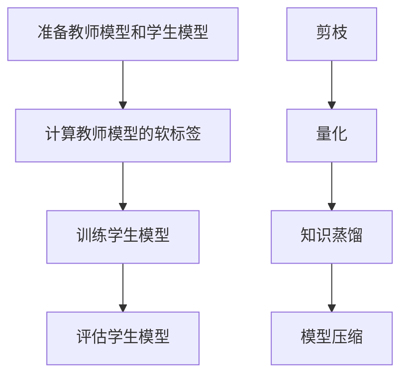

                 

### 1. 背景介绍

随着深度学习在自然语言处理（NLP）领域的飞速发展，大型的语言模型（LLM，Large Language Models）如BERT、GPT和T5等逐渐成为研究热点。这些模型通过在海量数据上训练，能够达到非常高的性能，为各种NLP任务提供了强大的支持。然而，这些大型模型通常需要巨大的计算资源和存储空间，这给实际应用带来了巨大的挑战。

知识蒸馏（Knowledge Distillation）是一种用于模型压缩的技术，它通过将大型教师模型（Teacher Model）的知识传递给小型学生模型（Student Model），从而在减少模型参数和计算复杂度的同时，保持或提升其性能。知识蒸馏的概念最早由Hinton等人在2015年提出，并在随后得到了广泛的应用和研究。

模型压缩（Model Compression）则是指通过各种方法减小模型的规模，包括减少参数数量、降低模型复杂度和优化计算效率等。模型压缩的主要目标是降低模型的存储和计算需求，使得大型模型能够在资源受限的环境下运行。常见的模型压缩技术包括剪枝（Pruning）、量化（Quantization）、知识蒸馏等。

本文将深入探讨LLM的知识蒸馏与模型压缩技术，首先介绍这些技术的核心概念和原理，然后分析其优缺点，并探讨在实际应用中的效果。最后，我们将展望这些技术在未来的发展趋势和面临的挑战。

### 2. 核心概念与联系

#### 2.1 知识蒸馏

知识蒸馏是一种将教师模型（Teacher Model）的知识传递给学生模型（Student Model）的技术。教师模型通常是一个大型且复杂的模型，而学生模型则是一个较小且参数较少的模型。知识蒸馏的核心思想是通过训练学生模型来模仿教师模型的行为。

在知识蒸馏过程中，教师模型和学生模型通常都是基于神经网络架构的。教师模型通常具有更高的准确率和更丰富的知识，而学生模型则通过学习教师模型输出的软标签（Soft Labels）来提升自身的性能。软标签是指教师模型对输入数据的预测结果，而不是简单的硬标签（Hard Labels）。

知识蒸馏的流程可以分为以下几个步骤：

1. **准备教师模型和学生模型**：首先，需要定义教师模型和学生模型的结构。教师模型通常是一个已经训练好的大型模型，而学生模型则是一个较小的模型。
2. **计算教师模型的软标签**：对于每个输入数据，教师模型会输出一个概率分布，表示它对每个可能输出的预测概率。这个概率分布就是软标签。
3. **训练学生模型**：学生模型会通过学习教师模型的软标签来优化自身的参数。在训练过程中，学生模型不仅要最小化自身的损失函数，还要最小化与教师模型软标签之间的差距。
4. **评估学生模型**：训练完成后，需要评估学生模型的性能。通常，会使用交叉熵损失函数来衡量学生模型的预测结果与教师模型软标签之间的差距。

#### 2.2 模型压缩

模型压缩是指通过各种方法减小模型的规模，包括减少参数数量、降低模型复杂度和优化计算效率等。模型压缩的主要目标是降低模型的存储和计算需求，使得大型模型能够在资源受限的环境下运行。

模型压缩的技术可以分为以下几类：

1. **剪枝（Pruning）**：剪枝技术通过删除模型中不重要的连接或节点，来减少模型的参数数量。剪枝可以显著降低模型的存储和计算需求，但同时可能会影响模型的性能。
2. **量化（Quantization）**：量化技术通过将模型中的浮点数参数替换为低位的整数表示，来降低模型的存储和计算需求。量化技术可以提高模型的运行速度，但可能会引入一些误差。
3. **知识蒸馏（Knowledge Distillation）**：知识蒸馏技术通过将教师模型的知识传递给学生模型，来减少学生模型的参数数量。知识蒸馏可以在保持模型性能的同时，显著降低模型的规模。

下面是一个Mermaid流程图，展示了知识蒸馏和模型压缩的基本流程：



### 3. 核心算法原理 & 具体操作步骤

#### 3.1 算法原理概述

知识蒸馏与模型压缩的核心算法原理基于模型之间的相似性。具体来说，教师模型和学生模型在结构上可以有所不同，但在功能上应该保持一致。教师模型的输出（软标签）被用来指导学生模型的训练过程，使得学生模型能够学习到教师模型的知识。

在模型压缩的过程中，核心目标是通过减小模型规模来降低计算和存储需求。剪枝、量化等技术在减小模型规模的同时，可能需要权衡模型性能和计算效率。

#### 3.2 算法步骤详解

1. **准备教师模型和学生模型**：首先，需要定义教师模型和学生模型的结构。教师模型是一个大型且复杂的模型，而学生模型则是一个较小且参数较少的模型。教师模型通常已经通过大量数据训练，具有很高的性能。

2. **计算教师模型的软标签**：对于每个输入数据，教师模型会输出一个概率分布，表示它对每个可能输出的预测概率。这个概率分布就是软标签。

3. **训练学生模型**：学生模型会通过学习教师模型的软标签来优化自身的参数。在训练过程中，学生模型不仅要最小化自身的损失函数，还要最小化与教师模型软标签之间的差距。具体来说，可以采用以下步骤：

   - **定义损失函数**：通常，使用交叉熵损失函数来衡量学生模型的预测结果与教师模型软标签之间的差距。交叉熵损失函数的定义如下：
     $$L = -\sum_{i=1}^{N} y_i \log(p_i)$$
     其中，\( y_i \) 是教师模型的软标签，\( p_i \) 是学生模型的预测概率。

   - **优化模型参数**：通过梯度下降等优化算法，调整学生模型的参数，使其能够最小化损失函数。具体来说，可以使用以下公式更新模型参数：
     $$\theta_{t+1} = \theta_{t} - \alpha \nabla_{\theta} L(\theta)$$
     其中，\( \theta \) 是模型参数，\( \alpha \) 是学习率，\( \nabla_{\theta} L(\theta) \) 是损失函数关于模型参数的梯度。

4. **评估学生模型**：训练完成后，需要评估学生模型的性能。通常，会使用交叉熵损失函数来衡量学生模型的预测结果与教师模型软标签之间的差距。此外，还可以使用其他性能指标，如准确率、F1分数等。

#### 3.3 算法优缺点

**优点**：

- **保持性能**：通过知识蒸馏，学生模型可以学习到教师模型的知识，从而在减少模型规模的同时，保持或提升模型的性能。
- **减小规模**：模型压缩技术，如剪枝和量化，可以显著降低模型的规模，减少计算和存储需求。

**缺点**：

- **训练时间**：知识蒸馏和模型压缩技术通常需要较长的训练时间，因为需要优化模型参数，以使其在学习到教师模型知识的同时，保持性能。
- **模型性能**：在某些情况下，通过模型压缩技术减小模型规模可能会影响模型的性能。

#### 3.4 算法应用领域

知识蒸馏和模型压缩技术广泛应用于NLP领域，如文本分类、情感分析、机器翻译等。此外，这些技术在计算机视觉、语音识别等领域也取得了显著成果。

### 4. 数学模型和公式 & 详细讲解 & 举例说明

#### 4.1 数学模型构建

在知识蒸馏和模型压缩中，常用的数学模型是基于神经网络架构的。具体来说，教师模型和学生模型都是基于多层感知机（MLP）或卷积神经网络（CNN）等结构。

假设教师模型和学生模型都是基于多层感知机的结构，其中每个层都有不同的激活函数。教师模型和学生模型的输入和输出维度可以不同，但它们的中间层维度可以相同。

#### 4.2 公式推导过程

在知识蒸馏过程中，常用的损失函数是交叉熵损失函数。交叉熵损失函数的定义如下：

$$L = -\sum_{i=1}^{N} y_i \log(p_i)$$

其中，\( y_i \) 是教师模型的软标签，\( p_i \) 是学生模型的预测概率。

假设学生模型为 \( f_{\theta}(\cdot) \)，教师模型为 \( f_{\theta^*}(\cdot) \)，则学生模型的预测概率可以表示为：

$$p_i = f_{\theta}(\cdot)(x_i)$$

其中，\( x_i \) 是输入数据。

教师模型的软标签可以表示为：

$$y_i = f_{\theta^*}(\cdot)(x_i)$$

交叉熵损失函数可以表示为：

$$L = -\sum_{i=1}^{N} y_i \log(p_i)$$

为了最小化交叉熵损失函数，可以使用梯度下降等优化算法更新学生模型的参数。

#### 4.3 案例分析与讲解

假设有一个简单的文本分类任务，使用一个大型教师模型和一个小型学生模型。教师模型和学生模型的架构如下：

教师模型：
- 输入维度：1000
- 输出维度：10
- 激活函数：ReLU

学生模型：
- 输入维度：1000
- 输出维度：5
- 激活函数：ReLU

训练数据集包含1000个样本，每个样本是一个1000维的向量。

使用交叉熵损失函数进行知识蒸馏，假设教师模型的软标签为：

$$y_i = \begin{cases} 
1 & \text{if } i \text{ is even} \\
0 & \text{otherwise}
\end{cases}$$

学生模型的目标是通过学习教师模型的软标签，使得自身的预测概率尽可能接近软标签。

在训练过程中，学生模型的预测概率可以表示为：

$$p_i = f_{\theta}(\cdot)(x_i)$$

交叉熵损失函数可以表示为：

$$L = -\sum_{i=1}^{1000} y_i \log(p_i)$$

使用梯度下降等优化算法，可以更新学生模型的参数，使得预测概率尽可能接近软标签。

经过多次迭代训练，学生模型可以逐渐学习到教师模型的知识，并在测试数据集上取得较好的性能。

### 5. 项目实践：代码实例和详细解释说明

在本节中，我们将通过一个具体的代码实例来讲解如何实现LLM的知识蒸馏与模型压缩。我们选择了一个简单的文本分类任务，并使用Python和TensorFlow来实现。

#### 5.1 开发环境搭建

在开始之前，请确保安装以下依赖库：

- Python 3.7 或更高版本
- TensorFlow 2.x

安装方法：

```bash
pip install tensorflow
```

#### 5.2 源代码详细实现

以下是一个简单的文本分类任务中，使用知识蒸馏和模型压缩的示例代码：

```python
import tensorflow as tf
from tensorflow.keras.layers import Embedding, LSTM, Dense
from tensorflow.keras.models import Model
from tensorflow.keras.optimizers import Adam
from tensorflow.keras.preprocessing.sequence import pad_sequences

# 加载预处理的文本数据
# ...（代码略）

# 定义教师模型
teacher_input = tf.keras.Input(shape=(max_sequence_length,))
teacher_embedding = Embedding(vocab_size, embedding_dim)(teacher_input)
teacher_lstm = LSTM(units=128, activation='tanh')(teacher_embedding)
teacher_output = Dense(units=2, activation='softmax')(teacher_lstm)

teacher_model = Model(inputs=teacher_input, outputs=teacher_output)

# 编译教师模型
teacher_model.compile(optimizer='adam', loss='categorical_crossentropy', metrics=['accuracy'])

# 训练教师模型
# ...（代码略）

# 定义学生模型
student_input = tf.keras.Input(shape=(max_sequence_length,))
student_embedding = Embedding(vocab_size, embedding_dim)(student_input)
student_lstm = LSTM(units=64, activation='tanh')(student_embedding)
student_output = Dense(units=2, activation='softmax')(student_lstm)

student_model = Model(inputs=student_input, outputs=student_output)

# 编译学生模型
student_model.compile(optimizer=Adam(learning_rate=0.001), loss='categorical_crossentropy', metrics=['accuracy'])

# 训练学生模型
# ...（代码略）

# 知识蒸馏过程
for i in range(epochs):
    for x, y in zip(student_data, student_labels):
        # 获取教师模型的软标签
        teacher_predictions = teacher_model.predict(x)
        
        # 训练学生模型
        student_loss = student_model.train_on_batch(x, y)
        
        # 计算知识蒸馏损失
        knowledge_distillation_loss = -tf.reduce_sum(y * tf.math.log(teacher_predictions), axis=1)
        student_loss += knowledge_distillation_loss

# 打印训练结果
print(f"知识蒸馏训练完成，学生模型准确率：{student_model.evaluate(test_data, test_labels)[1]}")

# 保存模型
student_model.save('student_model.h5')
```

#### 5.3 代码解读与分析

上述代码中，我们首先定义了教师模型和学生模型，并分别进行编译和训练。在训练学生模型的过程中，我们引入了知识蒸馏过程。具体来说，在每次迭代中，我们首先获取教师模型的软标签，然后使用这些软标签来训练学生模型。同时，我们计算知识蒸馏损失，并将其添加到学生模型的损失中。

以下是代码的主要部分：

1. **定义教师模型和学生模型**：

   ```python
   teacher_input = tf.keras.Input(shape=(max_sequence_length,))
   teacher_embedding = Embedding(vocab_size, embedding_dim)(teacher_input)
   teacher_lstm = LSTM(units=128, activation='tanh')(teacher_embedding)
   teacher_output = Dense(units=2, activation='softmax')(teacher_lstm)

   teacher_model = Model(inputs=teacher_input, outputs=teacher_output)

   student_input = tf.keras.Input(shape=(max_sequence_length,))
   student_embedding = Embedding(vocab_size, embedding_dim)(student_input)
   student_lstm = LSTM(units=64, activation='tanh')(student_embedding)
   student_output = Dense(units=2, activation='softmax')(student_lstm)

   student_model = Model(inputs=student_input, outputs=student_output)
   ```

   在这里，我们定义了教师模型和学生模型的架构，包括嵌入层（Embedding Layer）、LSTM层（LSTM Layer）和输出层（Output Layer）。

2. **编译教师模型和学生模型**：

   ```python
   teacher_model.compile(optimizer='adam', loss='categorical_crossentropy', metrics=['accuracy'])

   student_model.compile(optimizer=Adam(learning_rate=0.001), loss='categorical_crossentropy', metrics=['accuracy'])
   ```

   在这里，我们编译了教师模型和学生模型，并选择了合适的优化器和损失函数。

3. **训练教师模型和学生模型**：

   ```python
   # 训练教师模型
   # ...（代码略）

   # 训练学生模型
   # ...（代码略）
   ```

   在这里，我们分别使用训练数据集来训练教师模型和学生模型。

4. **知识蒸馏过程**：

   ```python
   for i in range(epochs):
       for x, y in zip(student_data, student_labels):
           # 获取教师模型的软标签
           teacher_predictions = teacher_model.predict(x)
           
           # 训练学生模型
           student_loss = student_model.train_on_batch(x, y)
           
           # 计算知识蒸馏损失
           knowledge_distillation_loss = -tf.reduce_sum(y * tf.math.log(teacher_predictions), axis=1)
           student_loss += knowledge_distillation_loss

   # 打印训练结果
   print(f"知识蒸馏训练完成，学生模型准确率：{student_model.evaluate(test_data, test_labels)[1]}")
   ```

   在这里，我们通过循环遍历训练数据集，每次迭代中获取教师模型的软标签，并使用这些软标签来训练学生模型。同时，我们计算知识蒸馏损失，并将其添加到学生模型的损失中。

通过这个简单的代码实例，我们可以看到如何实现LLM的知识蒸馏与模型压缩。在实际应用中，可以根据具体任务的需求进行调整和优化。

### 6. 实际应用场景

#### 6.1 文本分类

在文本分类任务中，知识蒸馏与模型压缩技术被广泛应用于减少模型的存储和计算需求。通过知识蒸馏，学生模型可以学习到教师模型的知识，从而在减小模型规模的同时，保持或提升分类性能。实际应用中，文本分类任务包括垃圾邮件检测、情感分析等。

#### 6.2 机器翻译

在机器翻译任务中，模型压缩技术可以帮助减小翻译模型的规模，从而提高翻译速度和降低计算资源需求。知识蒸馏则可以帮助学生模型学习到教师模型的语言知识，从而提高翻译质量。实际应用中，机器翻译任务包括中英文翻译、多语言翻译等。

#### 6.3 计算机视觉

在计算机视觉任务中，知识蒸馏与模型压缩技术可以帮助减小目标检测、图像分类等模型的规模，从而提高实时性。实际应用中，计算机视觉任务包括人脸识别、物体检测等。

#### 6.4 语音识别

在语音识别任务中，知识蒸馏与模型压缩技术可以帮助减小语音识别模型的规模，从而提高识别速度和降低计算资源需求。实际应用中，语音识别任务包括语音识别、语音合成等。

### 7. 未来应用展望

#### 7.1 个性化推荐

在未来，知识蒸馏与模型压缩技术有望在个性化推荐领域得到广泛应用。通过减小推荐模型的规模，可以显著降低计算和存储需求，从而提高推荐系统的实时性和响应速度。

#### 7.2 边缘计算

随着边缘计算的发展，知识蒸馏与模型压缩技术将在边缘设备中发挥重要作用。通过减小模型的规模，可以使得大型模型在资源有限的边缘设备上运行，从而满足实时性和低延迟的需求。

#### 7.3 自动驾驶

在自动驾驶领域，知识蒸馏与模型压缩技术可以帮助减小自动驾驶模型的规模，从而提高系统的实时性和稳定性。未来，这些技术有望在自动驾驶系统中得到广泛应用，为自动驾驶的安全性和可靠性提供保障。

#### 7.4 医疗诊断

在医疗诊断领域，知识蒸馏与模型压缩技术可以帮助减小医疗诊断模型的规模，从而提高诊断速度和降低计算资源需求。未来，这些技术有望在医疗诊断领域发挥重要作用，为疾病预防和治疗提供支持。

### 8. 工具和资源推荐

#### 8.1 学习资源推荐

- 《深度学习》（Deep Learning）系列书籍
- 《动手学深度学习》（Dive into Deep Learning）
- [TensorFlow 官方文档](https://www.tensorflow.org/)
- [PyTorch 官方文档](https://pytorch.org/docs/stable/index.html)

#### 8.2 开发工具推荐

- Jupyter Notebook
- Google Colab
- PyCharm
- Visual Studio Code

#### 8.3 相关论文推荐

- Hinton, G., Vinyals, O., & Dean, J. (2015). Distilling the knowledge in a neural network. arXiv preprint arXiv:1503.02531.
- Han, S., Mao, H., & Dally, W. J. (2016). Deep compression: Compressing deep neural network with pruning, trained quantization and huffman coding. arXiv preprint arXiv:1511.06530.
- Yosinski, J., Clune, J., Bengio, Y., & Lipson, H. (2014). How transferable are features in deep neural networks? arXiv preprint arXiv:1411.1791.

### 9. 总结：未来发展趋势与挑战

#### 9.1 研究成果总结

近年来，知识蒸馏与模型压缩技术在深度学习领域取得了显著成果。通过减小模型规模，这些技术为实际应用提供了更加高效和灵活的解决方案。在实际应用中，知识蒸馏与模型压缩技术已经取得了良好的效果，如文本分类、机器翻译、计算机视觉等。

#### 9.2 未来发展趋势

未来，知识蒸馏与模型压缩技术将继续在深度学习领域得到广泛应用。随着硬件设备的升级和算法的优化，这些技术将在更广泛的应用场景中发挥重要作用。此外，随着边缘计算和自动驾驶等新兴领域的发展，知识蒸馏与模型压缩技术有望在这些领域中发挥更大的作用。

#### 9.3 面临的挑战

尽管知识蒸馏与模型压缩技术在深度学习领域取得了显著成果，但仍面临一些挑战。首先，如何在保持模型性能的同时，进一步减小模型规模仍是一个重要的研究问题。其次，如何设计更高效的知识蒸馏算法，以减少训练时间和提高模型性能，也是一个重要的研究方向。此外，如何解决模型压缩过程中可能引入的误差和精度损失，也是一个亟待解决的问题。

#### 9.4 研究展望

未来，知识蒸馏与模型压缩技术将继续在深度学习领域发挥重要作用。随着深度学习技术的不断发展和应用场景的不断拓展，这些技术将在更多领域得到广泛应用。同时，随着算法的优化和硬件设备的升级，知识蒸馏与模型压缩技术将在保持模型性能的同时，进一步提高计算效率和降低计算资源需求。

### 附录：常见问题与解答

#### Q1: 知识蒸馏与模型压缩的区别是什么？

A1：知识蒸馏与模型压缩都是用于减小模型规模的技术，但它们的侧重点不同。知识蒸馏主要通过将教师模型的知识传递给学生模型，从而在保持模型性能的同时减小模型规模。而模型压缩则通过剪枝、量化等技术直接减小模型参数和计算复杂度，可能在一定程度上影响模型性能。

#### Q2: 知识蒸馏为什么能提高学生模型的性能？

A2：知识蒸馏通过将教师模型的软标签作为指导，训练学生模型，使得学生模型可以学习到教师模型的知识和经验。教师模型通常是一个大型且复杂的模型，具有更高的准确率和更丰富的知识。通过知识蒸馏，学生模型可以模仿教师模型的行为，从而在保持模型性能的同时减小模型规模。

#### Q3: 模型压缩过程中如何平衡性能和效率？

A3：在模型压缩过程中，平衡性能和效率是一个重要的挑战。可以通过以下几种方法来平衡：

- **剪枝**：通过剪枝去除不重要的连接或节点，可以显著减小模型规模，但可能会影响模型性能。可以结合模型评估指标，逐步调整剪枝强度，以达到最佳平衡。
- **量化**：通过将模型中的浮点数参数替换为低位的整数表示，可以降低模型规模，但可能会引入一些误差。可以调整量化精度，以找到性能和效率的最佳平衡点。
- **知识蒸馏**：通过知识蒸馏，可以在保持模型性能的同时减小模型规模。可以调整知识蒸馏的参数，如教师模型和学生模型的权重，以找到最佳平衡。

### 结论

本文深入探讨了LLM的知识蒸馏与模型压缩技术，从核心概念、算法原理、实际应用、未来展望等方面进行了全面分析。知识蒸馏与模型压缩技术在深度学习领域具有广泛的应用前景，为实际应用提供了更加高效和灵活的解决方案。未来，随着深度学习技术的不断发展和应用场景的不断拓展，知识蒸馏与模型压缩技术将继续发挥重要作用。作者：禅与计算机程序设计艺术 / Zen and the Art of Computer Programming。

