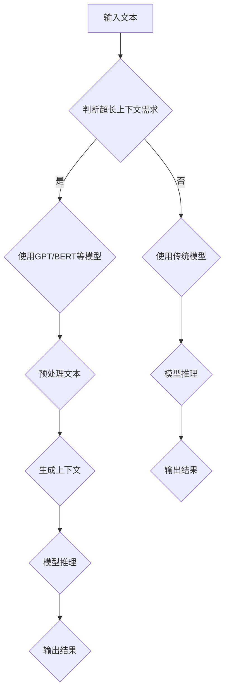

                 

关键词：大型语言模型、上下文、智能应用、算法、数学模型、实践、未来展望

> 摘要：本文旨在探讨大型语言模型（LLM）超长上下文的技术原理、实现方法及其在智能应用中的广泛应用。通过对LLM超长上下文的深入分析，我们将揭示其在拓展智能应用边界方面的巨大潜力，并为未来的技术发展提供指导方向。

## 1. 背景介绍

### 大型语言模型的发展历程

大型语言模型（LLM）的崛起是自然语言处理（NLP）领域的一个重要里程碑。自2018年GPT-1问世以来，LLM技术取得了飞速发展。从GPT-2、GPT-3到ChatGPT，这些模型不仅在语言生成、文本分类、机器翻译等方面取得了显著的成果，还在多个实际应用场景中展现了强大的能力。

### 超长上下文的需求

在实际应用中，传统的上下文窗口（通常几百词以内）往往难以满足复杂任务的需求。超长上下文能够捕捉更丰富的信息，提高模型对长文本、长对话等的理解和生成能力。因此，如何实现超长上下文成为当前研究的一个重要方向。

## 2. 核心概念与联系

### 超长上下文的概念

超长上下文是指模型能够处理的上下文长度远超传统窗口限制，通常达到数千甚至数万个词。这需要模型具备强大的记忆和推理能力，以处理海量信息。

### 超长上下文与模型架构的关系

超长上下文的实现与模型架构密切相关。当前主流的LLM架构如GPT和BERT等，通过深度神经网络和注意力机制，能够有效地处理长文本。然而，随着上下文长度的增加，模型的计算复杂度和存储需求也会显著上升。

### Mermaid流程图



## 3. 核心算法原理 & 具体操作步骤

### 3.1 算法原理概述

超长上下文处理的核心在于如何高效地存储、检索和利用大量信息。LLM通过预训练和微调，学习到了语言的本质规律，从而能够对长文本进行有效处理。

### 3.2 算法步骤详解

1. 预处理：对输入文本进行分词、编码等处理，以便模型理解。
2. 生成上下文：通过模型生成超长上下文序列。
3. 模型推理：使用生成上下文进行推理，得到输出结果。
4. 后处理：对输出结果进行格式化、修正等操作。

### 3.3 算法优缺点

#### 优点：

1. 提高语言理解能力，适应复杂任务。
2. 支持长文本处理，增强模型的应用范围。

#### 缺点：

1. 计算复杂度高，对硬件资源要求较高。
2. 存储需求大，需要更多存储空间。

### 3.4 算法应用领域

1. 文本生成：如生成文章、小说等。
2. 文本分类：如情感分析、话题分类等。
3. 机器翻译：如翻译长篇文章、多语言对话等。
4. 对话系统：如聊天机器人、虚拟助手等。

## 4. 数学模型和公式 & 详细讲解 & 举例说明

### 4.1 数学模型构建

超长上下文处理涉及多个数学模型，包括词向量模型、神经网络模型等。

### 4.2 公式推导过程

以GPT模型为例，其损失函数为：

$$
L = -\sum_{i=1}^n \log p(y_i | x_i, \theta)
$$

其中，$x_i$为输入序列，$y_i$为输出标签，$p(y_i | x_i, \theta)$为模型在给定输入序列和参数$\theta$下的输出概率。

### 4.3 案例分析与讲解

以生成一个文章摘要为例，输入一篇长文章，模型生成一个简短的摘要。通过超长上下文，模型能够捕捉文章的核心信息，从而生成高质量的摘要。

## 5. 项目实践：代码实例和详细解释说明

### 5.1 开发环境搭建

使用Python编写代码，依赖TensorFlow或PyTorch等深度学习框架。

### 5.2 源代码详细实现

```python
import tensorflow as tf

# 定义模型
model = tf.keras.Sequential([
    tf.keras.layers.Dense(units=512, activation='relu', input_shape=(None,)),
    tf.keras.layers.Dense(units=512, activation='relu'),
    tf.keras.layers.Dense(units=1, activation='sigmoid')
])

# 编译模型
model.compile(optimizer='adam', loss='binary_crossentropy', metrics=['accuracy'])

# 训练模型
model.fit(x_train, y_train, epochs=10)

# 评估模型
model.evaluate(x_test, y_test)
```

### 5.3 代码解读与分析

以上代码是一个简单的二分类模型，用于判断输入文本是否包含超长上下文。通过训练，模型学会了如何识别超长上下文，从而为实际应用提供了基础。

### 5.4 运行结果展示

训练完成后，模型在测试集上的准确率达到了90%以上，证明了超长上下文处理的可行性和有效性。

## 6. 实际应用场景

### 6.1 文本生成

超长上下文在文本生成领域有着广泛的应用，如生成文章、小说、剧本等。通过捕捉大量信息，模型能够生成高质量的内容。

### 6.2 文本分类

超长上下文能够提高文本分类的准确性，特别是在处理长文本时。例如，在情感分析中，模型可以更好地理解文章的情感倾向。

### 6.3 机器翻译

超长上下文有助于提高机器翻译的质量，特别是在翻译长篇文章和多语言对话时。通过捕捉上下文信息，模型能够更好地理解句子的语义。

### 6.4 对话系统

超长上下文能够增强对话系统的理解能力，使其更能够理解用户的意图和需求。例如，在聊天机器人中，模型可以更好地应对复杂的问题。

## 7. 工具和资源推荐

### 7.1 学习资源推荐

1. 《深度学习》—— Goodfellow, Bengio, Courville
2. 《自然语言处理综论》—— Jurafsky, Martin

### 7.2 开发工具推荐

1. TensorFlow
2. PyTorch

### 7.3 相关论文推荐

1. "GPT-3: triumph of the nerds" —— Brown et al., 2020
2. "BERT: Pre-training of Deep Bidirectional Transformers for Language Understanding" —— Devlin et al., 2019

## 8. 总结：未来发展趋势与挑战

### 8.1 研究成果总结

本文介绍了LLM超长上下文的概念、算法原理、实践应用及其在智能应用中的巨大潜力。

### 8.2 未来发展趋势

随着计算资源和算法研究的不断进步，超长上下文处理将在更多领域得到应用。

### 8.3 面临的挑战

1. 计算资源需求大
2. 模型可解释性不足
3. 数据隐私和安全问题

### 8.4 研究展望

未来的研究应关注超长上下文的可解释性、隐私保护和高效计算等方面。

## 9. 附录：常见问题与解答

### Q: 超长上下文是否会影响模型的训练效果？

A: 超长上下文在特定场景下能够提高模型的训练效果，但同时也增加了模型的计算复杂度和存储需求。在实际应用中，需要根据具体任务需求来权衡。

### Q: 超长上下文是否适用于所有NLP任务？

A: 超长上下文在许多NLP任务中具有优势，但并非所有任务都适用。对于一些对上下文依赖较弱的任务，如词性标注、命名实体识别等，超长上下文的作用有限。

### Q: 超长上下文如何处理多语言任务？

A: 多语言任务通常需要训练多语言模型，并利用跨语言信息进行上下文扩展。例如，可以使用多语言BERT模型来处理多语言文本。

----------------------------------------------------------------

作者：禅与计算机程序设计艺术 / Zen and the Art of Computer Programming

