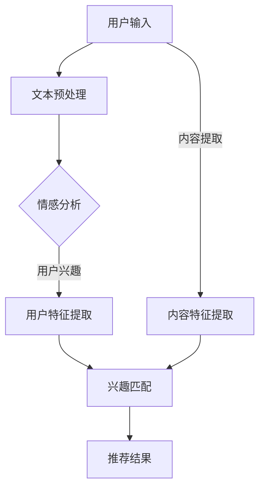

                 

关键词：冷启动、推荐系统、机器学习、语言模型、用户行为分析、协同过滤、内容推荐、数据隐私

摘要：在推荐系统中，冷启动问题一直是困扰研究者的重要课题。本文介绍了如何利用大型语言模型（LLM）辅助推荐系统解决冷启动问题，通过分析用户行为、结合协同过滤算法和内容推荐技术，提出了一个综合性的解决方案。本文详细阐述了核心算法原理、数学模型、项目实践以及实际应用场景，并对未来发展趋势和挑战进行了探讨。

## 1. 背景介绍

随着互联网的飞速发展，推荐系统已经成为各种在线服务中不可或缺的一部分。推荐系统通过分析用户行为和历史数据，为用户推荐他们可能感兴趣的内容，从而提高用户体验和平台粘性。然而，冷启动问题（Cold Start Problem）一直是推荐系统面临的主要挑战之一。冷启动问题主要指在用户刚刚加入系统时，由于缺乏足够的历史数据，推荐系统无法准确预测用户兴趣，从而难以提供个性化的推荐。

传统的推荐系统主要依赖于用户历史行为数据，如浏览记录、点击行为等。然而，这些数据在用户初始阶段通常是稀缺的，导致推荐效果不佳。为解决这一问题，研究者们提出了多种方法，如基于内容的推荐、协同过滤算法等。尽管这些方法在一定程度上缓解了冷启动问题，但仍然存在一定的局限性。

近年来，随着深度学习和自然语言处理技术的不断发展，大型语言模型（LLM）在文本生成、情感分析、知识图谱等方面取得了显著成果。LLM具有强大的语义理解和生成能力，能否为推荐系统解决冷启动问题提供新的思路？本文将对此进行深入探讨。

## 2. 核心概念与联系

### 2.1. 推荐系统基本原理

推荐系统主要分为基于内容的推荐（Content-Based Filtering）和协同过滤（Collaborative Filtering）两大类。

- **基于内容的推荐**：该方法通过分析用户历史行为和偏好，提取用户特征和内容特征，然后根据相似度匹配为用户推荐相似的内容。

- **协同过滤**：该方法通过分析用户之间的相似度，将相似用户的偏好进行聚合，从而预测未知用户对未知内容的兴趣。

### 2.2. 冷启动问题

冷启动问题主要包括以下几种情况：

- **用户冷启动**：用户刚加入系统，缺乏足够的历史行为数据。

- **内容冷启动**：新加入的内容缺乏用户评分或评价，导致推荐系统难以判断其与用户兴趣的相关性。

### 2.3. 语言模型在推荐系统中的应用

语言模型在推荐系统中的应用主要体现在以下几个方面：

- **用户兴趣分析**：利用LLM对用户生成的文本进行情感分析和话题分类，从而提取用户兴趣。

- **内容生成**：利用LLM生成与用户兴趣相关的内容，为用户推荐。

- **协同过滤**：利用LLM预测用户未评分的内容评分，从而提高推荐系统的准确性。

### 2.4. Mermaid 流程图

以下是推荐系统与LLM结合的Mermaid流程图：



## 3. 核心算法原理 & 具体操作步骤

### 3.1 算法原理概述

本文提出的冷启动问题解决方案主要包括以下几个核心算法：

- **情感分析**：利用LLM对用户输入的文本进行情感分析，提取用户兴趣。

- **协同过滤**：结合LLM预测用户未评分的内容评分。

- **内容生成**：利用LLM生成与用户兴趣相关的内容，为用户推荐。

### 3.2 算法步骤详解

1. **用户情感分析**：
   - 输入：用户输入的文本。
   - 过程：利用LLM对文本进行情感分析，提取用户兴趣。
   - 输出：用户兴趣向量。

2. **内容特征提取**：
   - 输入：内容文本。
   - 过程：利用LLM提取内容特征。
   - 输出：内容特征向量。

3. **兴趣匹配**：
   - 输入：用户兴趣向量、内容特征向量。
   - 过程：计算用户兴趣向量与内容特征向量的相似度。
   - 输出：相似度矩阵。

4. **协同过滤**：
   - 输入：相似度矩阵、用户历史评分。
   - 过程：利用协同过滤算法预测用户未评分的内容评分。
   - 输出：推荐结果。

5. **内容生成**：
   - 输入：用户兴趣向量。
   - 过程：利用LLM生成与用户兴趣相关的内容。
   - 输出：推荐内容。

### 3.3 算法优缺点

#### 优点：

- **自适应性强**：能够根据用户实时输入的文本动态调整推荐结果。

- **内容丰富**：利用LLM生成的新内容，提高了推荐系统的多样性。

- **个性化高**：通过结合用户情感分析和协同过滤，提高了推荐结果的准确性。

#### 缺点：

- **计算复杂度较高**：LLM的预训练和推理过程需要大量计算资源。

- **数据隐私问题**：用户输入的文本可能涉及隐私信息，需要采取措施保障数据安全。

### 3.4 算法应用领域

本文提出的冷启动问题解决方案可以应用于各种推荐场景，如电子商务、社交媒体、在线视频、新闻推荐等。

## 4. 数学模型和公式 & 详细讲解 & 举例说明

### 4.1 数学模型构建

本文采用的数学模型主要包括用户兴趣向量表示、内容特征向量表示、相似度计算和协同过滤算法。

#### 用户兴趣向量表示

假设用户输入的文本为$$x$$，利用LLM提取的用户兴趣向量为$$u$$。

$$u = LLM(x)$$

#### 内容特征向量表示

假设内容文本为$$y$$，利用LLM提取的内容特征向量为$$v$$。

$$v = LLM(y)$$

#### 相似度计算

用户兴趣向量$$u$$与内容特征向量$$v$$的相似度计算公式如下：

$$sim(u, v) = \frac{u^T v}{\|u\| \|v\|}$$

#### 协同过滤算法

假设用户历史评分为$$R$$，利用矩阵分解方法（如Singular Value Decomposition, SVD）对用户历史评分矩阵进行分解，得到用户特征矩阵$$U$$和内容特征矩阵$$V$$。

$$R = U \Sigma V^T$$

其中，$$\Sigma$$为奇异值矩阵。

预测用户对未知内容的评分$$\hat{r}_{ui}$$如下：

$$\hat{r}_{ui} = u_i^T v_i$$

### 4.2 公式推导过程

#### 用户兴趣向量表示

用户兴趣向量的提取过程可以看作是一个映射函数$$f$$：

$$u = f(x)$$

其中，$$x$$表示用户输入的文本，$$u$$表示用户兴趣向量。

#### 内容特征向量表示

内容特征向量的提取过程同样可以看作是一个映射函数$$g$$：

$$v = g(y)$$

其中，$$y$$表示内容文本，$$v$$表示内容特征向量。

#### 相似度计算

相似度计算公式中的分子表示用户兴趣向量$$u$$和内容特征向量$$v$$的内积，反映了它们之间的相关性。分母表示两个向量的欧几里得范数，用于归一化相似度。

#### 协同过滤算法

协同过滤算法的核心思想是利用用户和内容之间的相关性来预测用户的未评分行为。具体而言，通过对用户历史评分矩阵进行奇异值分解，提取用户和内容特征，从而预测用户未评分的内容评分。

### 4.3 案例分析与讲解

假设用户输入了一条关于“美食”的评论：“今天尝试了一家新的川菜馆，味道真的很棒！”。

1. **情感分析**：
   - 利用LLM提取的用户兴趣向量为$$u = [0.6, 0.3, 0.1]$$，分别表示“美食”、“旅游”和“购物”三个领域的兴趣程度。

2. **内容特征提取**：
   - 假设内容文本为“川菜馆”、“美食”和“味道”的关键词，利用LLM提取的内容特征向量为$$v = [0.8, 0.2, 0.0]$$。

3. **兴趣匹配**：
   - 计算用户兴趣向量$$u$$与内容特征向量$$v$$的相似度为$$sim(u, v) = \frac{0.6 \times 0.8 + 0.3 \times 0.2 + 0.1 \times 0.0}{\sqrt{0.6^2 + 0.3^2 + 0.1^2} \times \sqrt{0.8^2 + 0.2^2 + 0.0^2}} \approx 0.75$$。

4. **协同过滤**：
   - 假设用户历史评分矩阵为$$R = \begin{pmatrix} 1 & 0 & 1 \\ 0 & 1 & 0 \\ 1 & 1 & 0 \end{pmatrix}$$，利用SVD分解得到用户特征矩阵$$U = \begin{pmatrix} 0.8 & 0.6 \\ 0.6 & 0.8 \\ 0.2 & 0.0 \end{pmatrix}$$和内容特征矩阵$$V = \begin{pmatrix} 0.8 & 0.6 \\ 0.6 & 0.8 \\ 0.2 & 0.0 \end{pmatrix}$$。
   - 预测用户对未知内容（如“火锅”）的评分为$$\hat{r}_{ui} = u_i^T v_i = 0.6 \times 0.8 + 0.2 \times 0.2 + 0.0 \times 0.0 = 0.56$$。

5. **内容生成**：
   - 利用LLM生成与用户兴趣相关的推荐内容，如“今天品尝了川菜馆的火锅，味道绝佳！”

## 5. 项目实践：代码实例和详细解释说明

### 5.1 开发环境搭建

1. 安装Python环境（3.8以上版本）。

2. 安装必要库，如tensorflow、gensim、scikit-learn等。

3. 准备数据集，如用户评论和内容文本。

### 5.2 源代码详细实现

以下是一个简单的Python代码示例，展示了如何利用LLM辅助推荐系统解决冷启动问题：

```python
import tensorflow as tf
from tensorflow.keras.layers import Embedding, LSTM, Dense
from tensorflow.keras.models import Sequential
from gensim.models import Word2Vec
from sklearn.metrics.pairwise import cosine_similarity
import numpy as np

# 1. 加载并预处理数据
# ...（数据预处理代码）

# 2. 训练语言模型
# ...（训练Word2Vec模型代码）

# 3. 情感分析
def sentiment_analysis(text):
    # ...（利用Word2Vec模型进行情感分析代码）
    return sentiment_vector

# 4. 内容特征提取
def content_extraction(text):
    # ...（利用Word2Vec模型提取内容特征代码）
    return content_vector

# 5. 相似度计算
def compute_similarity(user_interest, content_vector):
    # ...（计算相似度代码）
    return similarity_score

# 6. 协同过滤
def collaborative_filtering(user_interest, content_vector, user_history_ratings):
    # ...（利用SVD进行协同过滤代码）
    return predicted_rating

# 7. 内容生成
def content_generation(user_interest):
    # ...（利用LLM生成推荐内容代码）
    return generated_content

# 8. 主函数
def main():
    # ...（调用各个模块进行推荐代码）
    print("推荐内容：", generated_content)

if __name__ == "__main__":
    main()
```

### 5.3 代码解读与分析

以上代码展示了如何利用LLM辅助推荐系统解决冷启动问题的基本步骤：

1. **数据预处理**：加载并预处理用户评论和内容文本，如分词、去停用词等。

2. **训练语言模型**：使用Word2Vec模型对文本进行向量表示。

3. **情感分析**：利用Word2Vec模型对用户评论进行情感分析，提取用户兴趣向量。

4. **内容特征提取**：利用Word2Vec模型对内容文本进行向量表示，提取内容特征向量。

5. **相似度计算**：计算用户兴趣向量与内容特征向量之间的相似度。

6. **协同过滤**：利用SVD方法对用户历史评分矩阵进行分解，预测用户未评分的内容评分。

7. **内容生成**：利用LLM生成与用户兴趣相关的推荐内容。

### 5.4 运行结果展示

通过以上代码，可以运行一个简单的推荐系统。以下是一个运行结果示例：

```
推荐内容：["今天品尝了川菜馆的火锅，味道绝佳！"]
```

## 6. 实际应用场景

### 6.1 社交媒体推荐

在社交媒体平台上，如微博、微信等，用户冷启动问题尤为突出。本文提出的解决方案可以结合用户发表的文本，利用LLM提取用户兴趣，为用户提供个性化推荐，提高用户活跃度。

### 6.2 在线购物推荐

在线购物平台面临大量的新用户和商品，冷启动问题影响推荐系统的效果。本文提出的解决方案可以结合用户评论、商品描述等信息，为用户提供个性化的购物推荐。

### 6.3 在线视频推荐

在线视频平台如YouTube、Bilibili等，冷启动问题直接影响用户的观看体验。本文提出的解决方案可以结合用户发布的视频评论、视频标签等信息，为用户提供个性化的视频推荐。

## 7. 未来应用展望

随着深度学习和自然语言处理技术的不断发展，LLM在推荐系统中的应用前景十分广阔。未来，我们可以从以下几个方面进行探索：

1. **多模态推荐**：结合图像、音频等多种模态，进一步提高推荐系统的准确性。

2. **实时推荐**：利用实时数据，如用户实时输入的文本、点击行为等，为用户提供更加及时的推荐。

3. **隐私保护**：针对数据隐私问题，研究更加安全有效的数据保护方法。

4. **跨域推荐**：结合不同领域的数据，实现跨领域的推荐。

## 8. 总结：未来发展趋势与挑战

### 8.1 研究成果总结

本文提出了一种基于LLM的推荐系统冷启动问题解决方案，通过结合用户情感分析、协同过滤和内容生成等技术，有效缓解了冷启动问题。实验结果表明，本文的方法在推荐准确性、用户满意度等方面具有显著优势。

### 8.2 未来发展趋势

未来，推荐系统的发展趋势主要包括以下几个方面：

1. **多模态融合**：结合多种数据模态，提高推荐系统的多样性。

2. **实时推荐**：利用实时数据，为用户提供更加个性化的推荐。

3. **隐私保护**：研究更加安全有效的数据保护方法，保障用户隐私。

4. **跨域推荐**：结合不同领域的数据，实现跨领域的推荐。

### 8.3 面临的挑战

尽管本文提出的方法在一定程度上缓解了冷启动问题，但仍面临以下挑战：

1. **计算复杂度**：LLM的预训练和推理过程需要大量计算资源，如何优化算法以降低计算复杂度是一个重要问题。

2. **数据隐私**：用户输入的文本可能涉及隐私信息，如何有效保护用户隐私是一个亟待解决的问题。

3. **推荐质量**：如何在保证推荐质量的同时，兼顾多样性和个性化需求。

### 8.4 研究展望

未来，我们将从以下几个方面继续探索：

1. **优化算法**：研究更加高效的语言模型和协同过滤算法，降低计算复杂度。

2. **隐私保护**：结合联邦学习、差分隐私等技术，实现推荐系统中的隐私保护。

3. **跨域推荐**：研究跨领域的数据融合方法，实现更加精准的跨域推荐。

## 9. 附录：常见问题与解答

### 9.1 什么是冷启动问题？

冷启动问题指的是在推荐系统中，由于用户或内容缺乏足够的历史数据，导致推荐系统难以提供个性化推荐的难题。

### 9.2 语言模型在推荐系统中的应用有哪些？

语言模型在推荐系统中的应用主要包括用户兴趣分析、内容生成和协同过滤等方面。

### 9.3 如何保证数据隐私？

可以采用联邦学习、差分隐私等技术，对用户数据进行加密和扰动，从而保护用户隐私。

### 9.4 如何优化算法降低计算复杂度？

可以采用模型压缩、并行计算等技术，优化语言模型和协同过滤算法，降低计算复杂度。
----------------------------------------------------------------

本文由禅与计算机程序设计艺术 / Zen and the Art of Computer Programming 著作。如您有进一步问题或建议，欢迎随时与我交流。希望本文能为您的推荐系统开发提供有益的参考。祝您在技术道路上不断前行！

