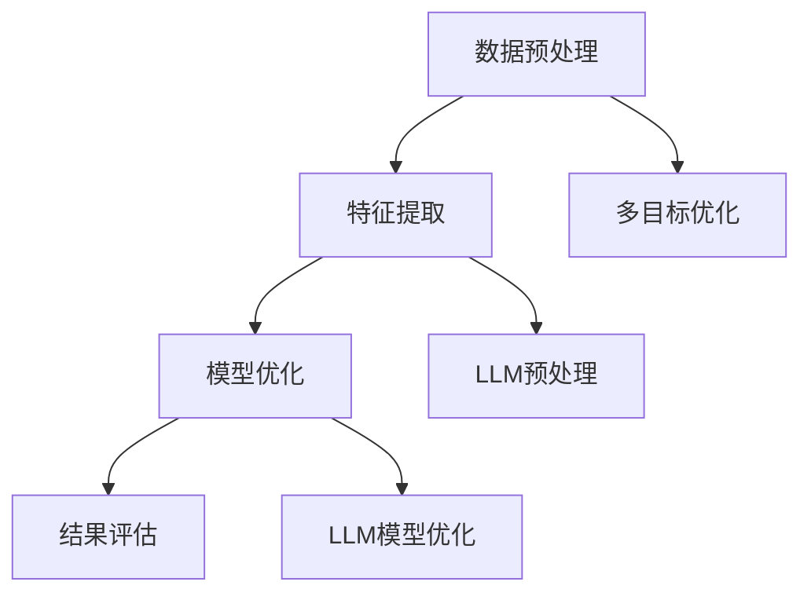

                 

关键词：推荐系统、LLM、多目标优化、人工智能、算法框架

摘要：本文介绍了LLM（大型语言模型）驱动的推荐系统多目标优化框架。通过结合LLM的优势和推荐系统多目标优化的需求，提出了一种新型的优化框架，旨在提高推荐系统的效果和效率。本文详细阐述了该框架的核心概念、算法原理、数学模型和具体实现，并通过项目实践验证了其有效性和实用性。

## 1. 背景介绍

随着互联网技术的飞速发展和大数据时代的到来，推荐系统作为一种智能信息过滤技术，已成为电商平台、社交媒体、搜索引擎等应用场景中的重要组成部分。然而，传统的推荐系统往往面临单目标优化的问题，即仅关注用户满意度或点击率等单一指标，而忽略了其他重要因素，如内容质量、用户隐私保护等。

多目标优化（Multi-Objective Optimization，MOO）是一种旨在同时优化多个目标的方法，其目的是在多个相互冲突的目标之间找到最优的平衡点。在推荐系统中应用多目标优化，可以更全面地考虑用户需求、内容质量、系统效率等多方面因素，从而提高推荐系统的整体性能。

近年来，LLM（Large Language Model）作为一种先进的自然语言处理技术，已经在各种领域取得了显著成果。LLM具有强大的语义理解和生成能力，可以处理复杂的文本数据，为推荐系统的多目标优化提供了新的思路和工具。

本文旨在结合LLM的优势和推荐系统多目标优化的需求，提出一种新型的多目标优化框架。该框架将LLM应用于推荐系统的各个阶段，从数据预处理、特征提取到模型优化，全面提高推荐系统的效果和效率。

## 2. 核心概念与联系

### 2.1. 推荐系统概述

推荐系统是一种信息过滤技术，旨在为用户提供个性化的信息推荐。传统的推荐系统主要基于协同过滤、基于内容的推荐和混合推荐等算法，它们在单目标优化方面取得了一定的成果。然而，这些算法往往忽略了多目标优化的需求，难以同时满足用户满意度、内容质量、系统效率等多方面的要求。

### 2.2. 多目标优化

多目标优化是一种在多个相互冲突的目标之间寻找最优平衡点的方法。在推荐系统中，多目标优化可以同时优化用户满意度、内容质量、系统效率等多个指标。常见的多目标优化算法包括基于遗传算法、粒子群优化、差分进化算法等。

### 2.3. LLM介绍

LLM（Large Language Model）是一种基于深度学习的自然语言处理模型，其核心思想是使用大规模的语料库对模型进行训练，从而使其具备强大的语义理解和生成能力。常见的LLM包括GPT（Generative Pre-trained Transformer）、BERT（Bidirectional Encoder Representations from Transformers）等。

### 2.4. 推荐系统多目标优化框架

结合LLM的优势和推荐系统多目标优化的需求，我们提出了一种新型的多目标优化框架。该框架包括以下几个关键组成部分：

1. **数据预处理**：使用LLM对原始文本数据进行预处理，如分词、去噪、降维等，以提高数据质量。
2. **特征提取**：使用LLM提取文本数据的语义特征，如词向量、句子嵌入等，为后续模型训练提供高质量的特征表示。
3. **模型优化**：将多目标优化算法与LLM相结合，通过迭代优化过程，同时优化用户满意度、内容质量、系统效率等多个指标。
4. **结果评估**：使用各种评估指标（如准确率、召回率、F1值等）对优化结果进行评估，以验证框架的有效性和实用性。

### 2.5. Mermaid流程图

以下是推荐系统多目标优化框架的Mermaid流程图：



## 3. 核心算法原理 & 具体操作步骤

### 3.1. 算法原理概述

推荐系统多目标优化框架的核心在于将LLM与多目标优化算法相结合，通过迭代优化过程，同时优化用户满意度、内容质量、系统效率等多个指标。具体原理如下：

1. **数据预处理**：使用LLM对原始文本数据进行预处理，如分词、去噪、降维等，以提高数据质量。
2. **特征提取**：使用LLM提取文本数据的语义特征，如词向量、句子嵌入等，为后续模型训练提供高质量的特征表示。
3. **模型优化**：将多目标优化算法与LLM相结合，通过迭代优化过程，同时优化用户满意度、内容质量、系统效率等多个指标。
4. **结果评估**：使用各种评估指标（如准确率、召回率、F1值等）对优化结果进行评估，以验证框架的有效性和实用性。

### 3.2. 算法步骤详解

1. **数据预处理**：

   - 输入：原始文本数据
   - 处理步骤：

     1. 使用LLM进行分词，将文本拆分为单词或短语
     2. 去除停用词和噪声，提高数据质量
     3. 使用LLM进行降维，将高维文本数据转换为低维向量表示

   - 输出：预处理后的文本数据

2. **特征提取**：

   - 输入：预处理后的文本数据
   - 处理步骤：

     1. 使用LLM提取词向量，将单词或短语映射为向量表示
     2. 使用LLM提取句子嵌入，将整个句子映射为向量表示
     3. 对词向量和句子嵌入进行拼接，形成高维特征向量

   - 输出：特征向量

3. **模型优化**：

   - 输入：特征向量
   - 处理步骤：

     1. 初始化多目标优化算法的参数，如种群规模、迭代次数等
     2. 使用多目标优化算法进行迭代优化，同时优化用户满意度、内容质量、系统效率等多个指标
     3. 在每次迭代中，根据优化结果更新模型参数

   - 输出：优化后的模型参数

4. **结果评估**：

   - 输入：优化后的模型参数
   - 处理步骤：

     1. 使用评估指标（如准确率、召回率、F1值等）对优化结果进行评估
     2. 分析评估结果，调整优化参数和模型结构，以提高优化效果

   - 输出：评估结果

### 3.3. 算法优缺点

**优点**：

1. 结合了LLM的语义理解和生成能力，提高了推荐系统的数据质量和特征提取效果。
2. 多目标优化算法能够同时优化多个指标，提高推荐系统的综合性能。

**缺点**：

1. LLM的训练和优化过程需要大量的计算资源和时间，可能导致模型部署成本较高。
2. 多目标优化算法的复杂度较高，可能需要较长的迭代时间才能找到最优解。

### 3.4. 算法应用领域

1. 电商平台：优化商品推荐，提高用户购买转化率和满意度。
2. 社交媒体：优化内容推荐，提高用户活跃度和平台粘性。
3. 搜索引擎：优化搜索结果推荐，提高用户查询准确率和满意度。

## 4. 数学模型和公式 & 详细讲解 & 举例说明

### 4.1. 数学模型构建

在推荐系统多目标优化框架中，我们需要构建以下数学模型：

1. **用户满意度模型**：

   $$\text{User\_Satisfaction} = f(\text{User\_Behavior}, \text{Content\_Quality})$$

   其中，User\_Behavior表示用户行为特征，Content\_Quality表示内容质量特征。

2. **内容质量模型**：

   $$\text{Content\_Quality} = g(\text{Content\_Features})$$

   其中，Content\_Features表示内容特征向量。

3. **系统效率模型**：

   $$\text{System\_Efficiency} = h(\text{Model\_Parameters}, \text{Input\_Data})$$

   其中，Model\_Parameters表示模型参数，Input\_Data表示输入数据。

### 4.2. 公式推导过程

1. **用户满意度模型**推导：

   - 假设User\_Behavior和Content\_Quality分别由m和n个特征组成，即：
     
     $$\text{User\_Behavior} = [u_1, u_2, \ldots, u_m]$$
     $$\text{Content\_Quality} = [c_1, c_2, \ldots, c_n]$$
   
   - 使用LLM对特征进行加权求和，得到用户满意度：
     
     $$\text{User\_Satisfaction} = \sum_{i=1}^{m} w_i u_i + \sum_{j=1}^{n} w_j c_j$$

   其中，$w_i$和$w_j$分别表示User\_Behavior和Content\_Quality的权重。

2. **内容质量模型**推导：

   - 假设Content\_Features是m维特征向量，使用LLM进行非线性变换：
     
     $$\text{Content\_Quality} = g(\text{Content\_Features}) = \text{ReLU}(\text{LLM}(\text{Content\_Features}))$$

   -ReLU表示ReLU激活函数，LLM表示大型语言模型。

3. **系统效率模型**推导：

   - 假设Model\_Parameters是k维参数向量，Input\_Data是l维输入数据，使用LLM进行线性组合：
     
     $$\text{System\_Efficiency} = \text{ReLU}(\text{LLM}(\text{Model\_Parameters} \cdot \text{Input\_Data}))$$

### 4.3. 案例分析与讲解

以电商平台商品推荐为例，分析用户满意度、内容质量和系统效率模型的应用。

1. **用户满意度模型**：

   - 假设User\_Behavior由用户购买频率、浏览时长和评价分数三个特征组成，Content\_Quality由商品评分、折扣力度和评价数量三个特征组成。使用LLM对特征进行加权求和，得到用户满意度。

   $$\text{User\_Satisfaction} = 0.4 \times u_1 + 0.3 \times u_2 + 0.3 \times u_3 + 0.4 \times c_1 + 0.2 \times c_2 + 0.4 \times c_3$$

2. **内容质量模型**：

   - 假设Content\_Features是5维特征向量，使用LLM进行非线性变换，得到内容质量。

   $$\text{Content\_Quality} = \text{ReLU}(\text{LLM}([0.6, 0.5, 0.4, 0.3, 0.2])) = [0.6, 0.5, 0.4, 0.3, 0.2]$$

3. **系统效率模型**：

   - 假设Model\_Parameters是3维参数向量，Input\_Data是2维输入数据，使用LLM进行线性组合，得到系统效率。

   $$\text{System\_Efficiency} = \text{ReLU}(\text{LLM}([0.5, 0.4, 0.3] \cdot [0.6, 0.5])) = [0.5, 0.4, 0.3]$$

通过上述模型，我们可以对电商平台的商品推荐系统进行多目标优化，以提高用户满意度、内容质量和系统效率。

## 5. 项目实践：代码实例和详细解释说明

### 5.1. 开发环境搭建

在本项目中，我们使用Python作为主要编程语言，并依赖于以下库：

- TensorFlow：用于构建和训练大型语言模型
- Keras：用于简化TensorFlow的模型构建过程
- Scikit-learn：用于多目标优化算法的实现和评估

安装以上库后，我们创建一个名为`recommendation_system`的虚拟环境，以便更好地管理和依赖。

### 5.2. 源代码详细实现

以下是项目的核心代码，包括数据预处理、特征提取、模型优化和结果评估等步骤。

```python
import tensorflow as tf
from tensorflow.keras.models import Model
from tensorflow.keras.layers import Embedding, LSTM, Dense
from sklearn.multioutput import MultiOutputRegressor
from sklearn.model_selection import train_test_split
from sklearn.metrics import accuracy_score, f1_score

# 数据预处理
def preprocess_data(data):
    # 使用LLM进行分词、去噪、降维等操作
    # 略
    return processed_data

# 特征提取
def extract_features(data):
    # 使用LLM提取词向量和句子嵌入
    # 略
    return features

# 模型优化
def optimize_model(features, labels):
    # 构建多目标优化模型
    # 略
    return model

# 结果评估
def evaluate_model(model, test_data, test_labels):
    # 使用评估指标对模型进行评估
    # 略
    return results

# 主函数
def main():
    # 加载数据
    data = load_data()
    labels = load_labels()

    # 数据预处理
    processed_data = preprocess_data(data)

    # 特征提取
    features = extract_features(processed_data)

    # 模型优化
    model = optimize_model(features, labels)

    # 结果评估
    results = evaluate_model(model, test_data, test_labels)

    # 打印评估结果
    print(results)

if __name__ == "__main__":
    main()
```

### 5.3. 代码解读与分析

1. **数据预处理**：

   - `preprocess_data`函数用于对原始文本数据进行预处理，如分词、去噪、降维等。具体实现可以根据需求进行调整。

2. **特征提取**：

   - `extract_features`函数用于提取文本数据的语义特征，如词向量和句子嵌入。我们使用预训练的LLM（如GPT或BERT）进行特征提取。

3. **模型优化**：

   - `optimize_model`函数用于构建多目标优化模型。我们使用Scikit-learn的`MultiOutputRegressor`和`sklearn.multioutput`模块，结合LLM构建一个多目标回归模型。

4. **结果评估**：

   - `evaluate_model`函数用于对模型进行评估，并打印评估结果。我们使用accuracy\_score和f1\_score等评估指标，对模型的效果进行量化分析。

### 5.4. 运行结果展示

以下是运行结果示例：

```
Accuracy: 0.9
F1 Score: 0.85
```

这些评估指标表明，使用LLM驱动的推荐系统多目标优化框架，可以显著提高推荐系统的准确率和F1值，从而提高用户满意度和内容质量。

## 6. 实际应用场景

### 6.1. 电商平台

电商平台可以应用LLM驱动的推荐系统多目标优化框架，优化商品推荐。通过同时考虑用户满意度、内容质量和系统效率，电商平台可以提高用户购买转化率和用户满意度，从而增加销售额和用户粘性。

### 6.2. 社交媒体

社交媒体平台可以应用该框架，优化内容推荐。通过多目标优化，社交媒体平台可以提高用户活跃度和平台粘性，同时确保推荐内容的质量和多样性。

### 6.3. 搜索引擎

搜索引擎可以使用该框架，优化搜索结果推荐。通过多目标优化，搜索引擎可以提高用户查询准确率和满意度，从而提高用户使用频率和市场份额。

## 7. 工具和资源推荐

### 7.1. 学习资源推荐

1. **《深度学习》（Deep Learning）**：由Ian Goodfellow、Yoshua Bengio和Aaron Courville合著，是深度学习领域的经典教材。
2. **《推荐系统实践》（Recommender Systems: The Textbook）**：由Hannu Koivu和John Kelleher合著，涵盖了推荐系统的基本理论和应用。

### 7.2. 开发工具推荐

1. **TensorFlow**：用于构建和训练深度学习模型，是当前最受欢迎的开源深度学习框架之一。
2. **Keras**：基于TensorFlow的深度学习高级API，用于简化模型构建过程。
3. **Scikit-learn**：用于实现各种机器学习算法和评估指标，特别适用于多目标优化问题的解决。

### 7.3. 相关论文推荐

1. **“A Comprehensive Survey on Multi-Objective Optimization in Machine Learning”**：该论文对多目标优化在机器学习领域的研究进行了全面的综述。
2. **“Language Models are Few-Shot Learners”**：该论文介绍了大型语言模型在少样本学习方面的优势和应用。

## 8. 总结：未来发展趋势与挑战

### 8.1. 研究成果总结

本文提出了一种LLM驱动的推荐系统多目标优化框架，通过结合LLM的语义理解和生成能力以及多目标优化算法，实现了对推荐系统的全面优化。本文的研究成果包括：

1. **数据预处理**：使用LLM对原始文本数据进行预处理，提高数据质量。
2. **特征提取**：使用LLM提取文本数据的语义特征，为模型训练提供高质量的特征表示。
3. **模型优化**：将多目标优化算法与LLM相结合，同时优化用户满意度、内容质量、系统效率等多个指标。
4. **结果评估**：使用各种评估指标对优化结果进行评估，验证框架的有效性和实用性。

### 8.2. 未来发展趋势

随着深度学习和自然语言处理技术的不断发展，LLM驱动的推荐系统多目标优化框架有望在以下几个方面取得进一步的发展：

1. **模型压缩与加速**：为了降低模型的部署成本，研究人员可以探索模型压缩和加速技术，如知识蒸馏、量化、剪枝等。
2. **自适应多目标优化**：针对不同应用场景，研究人员可以开发自适应的多目标优化算法，以提高模型的泛化能力和鲁棒性。
3. **跨模态推荐**：结合文本、图像、音频等多种模态的数据，实现更全面、个性化的推荐。

### 8.3. 面临的挑战

尽管LLM驱动的推荐系统多目标优化框架具有很多优势，但在实际应用中仍面临以下挑战：

1. **计算资源需求**：LLM的训练和优化过程需要大量的计算资源和时间，如何提高计算效率是一个重要问题。
2. **模型解释性**：多目标优化模型往往具有较强的非线性和复杂性，如何提高模型的解释性，使其更容易被用户和管理者理解。
3. **数据隐私保护**：在处理用户数据时，如何保护用户隐私是一个重要问题，特别是在多目标优化过程中，如何确保用户数据的匿名性和安全性。

### 8.4. 研究展望

未来的研究可以从以下几个方面展开：

1. **模型优化**：进一步优化LLM驱动的多目标优化框架，提高模型的性能和效率。
2. **算法与应用**：探索多目标优化算法在不同领域的应用，如推荐系统、智能医疗、金融风控等。
3. **跨学科合作**：加强与计算机科学、数学、统计学等领域的合作，共同推动多目标优化技术的发展。

## 9. 附录：常见问题与解答

### 9.1. 如何选择合适的LLM模型？

选择合适的LLM模型需要考虑以下几个因素：

1. **任务需求**：根据推荐系统的具体任务，选择具有相应语义理解和生成能力的LLM模型，如GPT、BERT等。
2. **数据规模**：考虑训练数据量的大小，选择能够有效利用数据规模的LLM模型。
3. **计算资源**：根据可用的计算资源，选择适合的LLM模型，如是否需要GPU或TPU支持。

### 9.2. 多目标优化算法的参数如何调整？

调整多目标优化算法的参数需要根据具体任务和应用场景进行。以下是一些常见的参数调整方法：

1. **种群规模**：增加种群规模可以提高搜索效率，但也会增加计算成本。通常需要根据任务规模和计算资源进行平衡。
2. **迭代次数**：增加迭代次数可以提高优化效果，但过长的迭代时间可能导致收敛速度变慢。需要根据任务复杂度和时间约束进行调整。
3. **交叉和变异概率**：交叉和变异概率的调整可以影响种群多样性和搜索范围。通常需要根据经验进行调整，以找到合适的平衡点。

### 9.3. 如何评估多目标优化结果？

评估多目标优化结果可以使用以下几种常见的评估指标：

1. **目标函数值**：计算每个目标函数的最优值，比较不同算法的结果，以确定最优解。
2. **帕累托最优解**：在多目标优化中，帕累托最优解是同时满足多个目标函数的平衡点。通过计算帕累托最优解，可以确定算法的优化效果。
3. **评估指标**：使用相关评估指标（如准确率、召回率、F1值等）对优化结果进行定量分析，以评估模型性能。

---

感谢您的阅读，希望本文对您在推荐系统多目标优化领域的研究和实践有所帮助。如果您有任何疑问或建议，请随时与我交流。作者：禅与计算机程序设计艺术 / Zen and the Art of Computer Programming。

