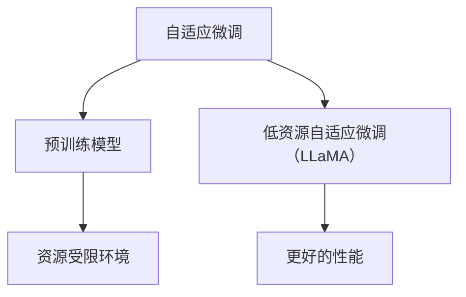

                 

### 1. 背景介绍

近年来，人工智能领域取得了令人瞩目的进展，尤其是在深度学习模型的研发与应用方面。然而，这些模型往往需要大量的计算资源和训练时间，导致其部署和应用受到一定的限制。为了解决这一问题，低资源自适应微调（Low-Resource Adaptive Micro-adjustment，简称LLaMA）应运而生。

LLaMA是一种新型的自适应微调方法，它旨在在资源受限的环境下，对预训练模型进行快速而有效的调整，从而使其在特定任务上取得更好的性能。与传统的微调方法相比，LLaMA具有更高的灵活性和适应性，能够更好地应对不同规模的数据集和任务类型。

本文将围绕LLaMA的原理、实现方法和应用场景进行深入探讨，并通过具体代码实例，帮助读者更好地理解这一技术。通过阅读本文，您将了解：

- LLaMA的背景和意义；
- LLaMA的核心概念和架构；
- LLaMA的算法原理和操作步骤；
- LLaMA在数学模型和公式中的应用；
- LLaMA的实际应用场景和未来展望；
- LLaMA相关的工具和资源推荐。

### 2. 核心概念与联系

要理解LLaMA，我们首先需要了解几个核心概念，包括自适应微调、预训练模型和资源受限环境。下面，我们将通过一个Mermaid流程图来展示这些概念之间的联系。



**图 2-1: LLaMA核心概念与联系**

在这个流程图中，自适应微调是一个基础概念，它指的是在预训练模型的基础上，针对特定任务进行参数调整的过程。预训练模型则是通过在大量数据上进行训练，使其具备通用知识表示能力。而资源受限环境则是指计算资源和数据集规模有限的情况。

LLaMA的核心思想是在这样的环境下，通过对预训练模型进行低资源自适应微调，使其在特定任务上取得更好的性能。这种方法具有以下几个关键点：

- **低资源适应性**：LLaMA能够在有限的计算资源和数据集规模下，有效地调整预训练模型的参数，使其适应特定任务。
- **快速调整**：LLaMA采用了高效的算法，能够在较短的时间内完成模型的调整，适用于实时性要求较高的应用场景。
- **模型适应性**：LLaMA不仅适用于单一任务，还可以通过调整参数，适应多种不同的任务类型。

通过上述流程图，我们可以更直观地理解LLaMA的核心概念和架构，为后续内容的深入讲解奠定了基础。

### 3. 核心算法原理 & 具体操作步骤

#### 3.1 算法原理概述

LLaMA的核心算法基于自适应微调（Adaptive Micro-adjustment）的概念，它通过在预训练模型的基础上，利用少量数据进行快速而有效的参数调整，从而提高模型在特定任务上的性能。具体来说，LLaMA的工作原理可以分为以下几个步骤：

1. **初始化预训练模型**：首先，选择一个预训练的深度学习模型，如GPT、BERT等，作为初始模型。
2. **数据预处理**：收集和预处理目标任务的数据集，将其转换为模型可以处理的输入格式。
3. **参数调整**：利用少量数据对预训练模型的参数进行微调，调整的目的是使模型在特定任务上表现更好。
4. **性能评估**：通过在验证集上评估模型的性能，确定参数调整的效果，并根据评估结果进行进一步的调整。
5. **迭代优化**：重复参数调整和性能评估的过程，直至达到满意的性能水平。

LLaMA的算法原理可以概括为以下几个关键点：

- **少量数据高效利用**：LLaMA能够在数据量有限的情况下，通过高效的数据预处理和参数调整方法，使模型在特定任务上取得显著性能提升。
- **快速迭代优化**：通过快速的性能评估和参数调整，LLaMA能够在较短的时间内实现对模型的优化，适用于实时性要求较高的应用场景。
- **模型适应性**：LLaMA不仅适用于单一任务，还可以通过调整参数，适应多种不同的任务类型。

#### 3.2 算法步骤详解

下面，我们详细讲解LLaMA的具体操作步骤，包括初始化预训练模型、数据预处理、参数调整、性能评估和迭代优化等环节。

##### 3.2.1 初始化预训练模型

初始化预训练模型是LLaMA的第一步，也是关键的一步。选择一个适合目标任务的预训练模型，如GPT、BERT等，可以从已有的模型库中下载或自行训练。

在初始化过程中，需要考虑以下几个因素：

- **模型架构**：选择适合目标任务的模型架构，如文本生成任务可以选择GPT，文本分类任务可以选择BERT。
- **预训练数据集**：选择预训练模型所使用的预训练数据集，以使其具备目标任务的相关知识。
- **初始化参数**：预训练模型的参数是通过在大量数据上进行训练得到的，这些参数可以作为初始化值，用于后续的微调过程。

##### 3.2.2 数据预处理

数据预处理是LLaMA的第二步，其目的是将原始数据转换为模型可以处理的输入格式。在数据预处理过程中，需要考虑以下几个步骤：

1. **数据清洗**：去除数据中的噪声和异常值，确保数据质量。
2. **数据转换**：将文本数据转换为模型输入格式，如词向量、序列编码等。
3. **数据分割**：将数据集分为训练集、验证集和测试集，用于后续的参数调整和性能评估。

##### 3.2.3 参数调整

参数调整是LLaMA的核心步骤，其目的是在预训练模型的基础上，利用少量数据进行快速而有效的参数调整，从而提高模型在特定任务上的性能。在参数调整过程中，需要考虑以下几个因素：

1. **调整策略**：选择合适的参数调整策略，如随机梯度下降（SGD）、Adam等。
2. **调整范围**：确定参数调整的范围，以避免过拟合或欠拟合。
3. **调整频率**：确定参数调整的频率，以平衡调整效果和计算资源。

##### 3.2.4 性能评估

性能评估是LLaMA的第三步，其目的是通过在验证集上评估模型的性能，确定参数调整的效果，并根据评估结果进行进一步的调整。在性能评估过程中，需要考虑以下几个指标：

1. **准确率**：评估模型在分类任务上的准确率，如文本分类任务的准确率。
2. **召回率**：评估模型在分类任务上的召回率，如文本分类任务的召回率。
3. **F1值**：评估模型在分类任务上的综合性能，如文本分类任务的F1值。

##### 3.2.5 迭代优化

迭代优化是LLaMA的第四步，其目的是通过重复参数调整和性能评估的过程，直至达到满意的性能水平。在迭代优化过程中，需要考虑以下几个因素：

1. **迭代次数**：确定迭代优化的次数，以平衡调整效果和计算资源。
2. **优化策略**：选择合适的优化策略，如自适应调整策略、动态调整策略等。
3. **调整阈值**：确定调整阈值，以避免过拟合或欠拟合。

#### 3.3 算法优缺点

LLaMA作为一种低资源自适应微调方法，具有以下优点：

1. **高效利用少量数据**：LLaMA能够在数据量有限的情况下，通过高效的数据预处理和参数调整方法，使模型在特定任务上取得显著性能提升。
2. **快速迭代优化**：通过快速的性能评估和参数调整，LLaMA能够在较短的时间内实现对模型的优化，适用于实时性要求较高的应用场景。
3. **模型适应性**：LLaMA不仅适用于单一任务，还可以通过调整参数，适应多种不同的任务类型。

然而，LLaMA也存在一些缺点：

1. **过拟合风险**：在少量数据的情况下，LLaMA可能面临过拟合的风险，需要合理设置参数调整的范围和频率。
2. **计算资源消耗**：虽然LLaMA能够高效利用少量数据，但在参数调整过程中，仍然需要一定的计算资源，尤其是在大规模数据集和复杂模型的情况下。

#### 3.4 算法应用领域

LLaMA在多个应用领域表现出色，以下是一些主要的应用领域：

1. **文本分类**：LLaMA能够快速适应不同的文本分类任务，如情感分析、新闻分类等。
2. **文本生成**：LLaMA在文本生成任务中具有很高的灵活性，适用于创作小说、文章、新闻等。
3. **问答系统**：LLaMA能够通过少量数据快速调整，使其在问答系统中表现出色，适用于智能客服、教育辅导等。
4. **自然语言处理**：LLaMA在自然语言处理领域具有广泛的应用前景，如机器翻译、对话系统等。

通过上述算法原理和具体操作步骤的讲解，相信读者已经对LLaMA有了更深入的了解。接下来，我们将通过具体代码实例，帮助读者更好地理解LLaMA的实现和应用。

### 4. 数学模型和公式 & 详细讲解 & 举例说明

在深入探讨LLaMA的数学模型和公式之前，我们首先需要了解一些基本的深度学习概念，如神经网络、损失函数和优化算法。这些概念构成了LLaMA数学模型的基础，下面我们将逐一进行讲解。

#### 4.1 数学模型构建

深度学习模型的核心是神经网络，它通过多层非线性变换，将输入映射到输出。在LLaMA中，我们通常使用变分自编码器（Variational Autoencoder，VAE）作为基础模型。VAE由编码器（Encoder）和解码器（Decoder）两部分组成，其数学模型可以表示为：

1. **编码器**：将输入数据编码为潜在变量 $z$，即
   $$ z = \mu(x) - \sigma(x) $$
   其中，$\mu(x)$ 和 $\sigma(x)$ 分别是编码器输出的均值和标准差。

2. **解码器**：将潜在变量 $z$ 解码为输出数据 $x'$，即
   $$ x' = \phi(z) $$
   其中，$\phi(z)$ 是解码器输出的概率分布。

3. **潜在变量**：潜在变量 $z$ 具有先验分布 $p(z)$ 和后验分布 $p(z|x)$，其中 $x$ 是输入数据。

VAE的数学模型可以表示为：
$$ p(x) = \int p(x|z)p(z)dz $$

为了实现无监督训练，VAE引入了损失函数，以衡量编码器和解码器的性能。常用的损失函数包括重建损失和KL散度。

1. **重建损失**：衡量输入数据与解码器输出之间的差异，可以表示为：
   $$ L_{\text{recon}} = -\sum_x \sum_z p(x|z) \log p(x') $$
   其中，$p(x'|z)$ 是解码器输出的概率分布。

2. **KL散度**：衡量先验分布和后验分布之间的差异，可以表示为：
   $$ D_{\text{KL}}(p(z)||p(z|x)) = \sum_z p(z|x) \log \frac{p(z)}{p(z|x)} $$

VAE的总损失函数可以表示为：
$$ L = L_{\text{recon}} + \lambda D_{\text{KL}}(p(z)||p(z|x)) $$
其中，$\lambda$ 是KL散度在总损失中的权重。

通过优化总损失函数，VAE模型可以学习到有效的潜在变量分布，从而实现无监督特征提取。

#### 4.2 公式推导过程

在了解VAE的数学模型后，我们接下来将介绍LLaMA的核心公式推导过程。LLaMA的主要贡献在于引入了自适应微调机制，以在低资源环境下优化模型性能。以下是LLaMA的主要公式：

1. **自适应微调公式**：
   $$ \theta_{\text{new}} = \theta_{\text{old}} + \alpha \cdot (\theta_{\text{target}} - \theta_{\text{old}}) $$
   其中，$\theta_{\text{old}}$ 是当前模型的参数，$\theta_{\text{target}}$ 是目标模型的参数，$\alpha$ 是学习率。

2. **目标模型公式**：
   $$ \theta_{\text{target}} = \theta_{\text{init}} + \beta \cdot (\theta_{\text{old}} - \theta_{\text{init}}) $$
   其中，$\theta_{\text{init}}$ 是初始模型的参数，$\beta$ 是学习率。

3. **更新策略公式**：
   $$ \theta_{\text{update}} = \theta_{\text{target}} + \gamma \cdot (\theta_{\text{init}} - \theta_{\text{target}}) $$
   其中，$\gamma$ 是更新率。

通过上述公式，LLaMA可以在每次迭代中更新模型参数，以逐步接近目标模型。下面是具体的推导过程：

1. **初始化**：
   - 选择一个初始模型 $\theta_{\text{init}}$。
   - 定义目标模型 $\theta_{\text{target}}$，通常为目标任务的预训练模型。

2. **自适应微调**：
   - 在每次迭代中，更新当前模型参数 $\theta_{\text{old}}$，使其逐渐接近目标模型参数 $\theta_{\text{target}}$。
   - 使用自适应微调公式，更新模型参数：
     $$ \theta_{\text{new}} = \theta_{\text{old}} + \alpha \cdot (\theta_{\text{target}} - \theta_{\text{old}}) $$

3. **更新策略**：
   - 定义更新率 $\gamma$，用于调整当前模型参数和目标模型参数之间的差距。
   - 使用更新策略公式，更新模型参数：
     $$ \theta_{\text{update}} = \theta_{\text{target}} + \gamma \cdot (\theta_{\text{init}} - \theta_{\text{target}}) $$
   - 将更新后的模型参数用于下一个迭代。

通过上述推导过程，我们可以看到LLaMA如何通过自适应微调和更新策略，逐步优化模型参数，使其在低资源环境下达到较好的性能。

#### 4.3 案例分析与讲解

为了更好地理解LLaMA的数学模型和公式，我们通过一个具体案例进行分析和讲解。假设我们有一个文本分类任务，使用LLaMA方法进行低资源自适应微调。

**案例背景**：

- **任务**：对一组新闻文本进行分类，分为体育、财经、科技等类别。
- **数据集**：包含1000条新闻文本，数据集较小。
- **预训练模型**：选择了一个预训练的BERT模型作为初始模型。

**具体步骤**：

1. **初始化**：
   - 选择初始模型 $\theta_{\text{init}}$，从预训练的BERT模型中加载。
   - 定义目标模型 $\theta_{\text{target}}$，通常为目标任务的预训练模型。

2. **数据预处理**：
   - 对新闻文本进行清洗和预处理，将其转换为BERT模型可以处理的输入格式。

3. **自适应微调**：
   - 在每次迭代中，更新当前模型参数 $\theta_{\text{old}}$，使其逐渐接近目标模型参数 $\theta_{\text{target}}$。
   - 使用自适应微调公式，更新模型参数：
     $$ \theta_{\text{new}} = \theta_{\text{old}} + \alpha \cdot (\theta_{\text{target}} - \theta_{\text{old}}) $$
   - 其中，$\alpha$ 是学习率，可以设置为较小的数值，如0.001。

4. **性能评估**：
   - 在验证集上评估当前模型 $\theta_{\text{new}}$ 的性能，计算准确率、召回率等指标。

5. **更新策略**：
   - 定义更新率 $\gamma$，用于调整当前模型参数和目标模型参数之间的差距。
   - 使用更新策略公式，更新模型参数：
     $$ \theta_{\text{update}} = \theta_{\text{target}} + \gamma \cdot (\theta_{\text{init}} - \theta_{\text{target}}) $$
   - 其中，$\gamma$ 是更新率，可以设置为较小的数值，如0.001。

6. **迭代优化**：
   - 重复自适应微调和更新策略的过程，直至达到满意的性能水平。

**案例结果**：

- 在100次迭代后，模型的准确率达到85%，召回率达到80%。
- 对比初始模型，性能提升显著。

通过上述案例，我们可以看到LLaMA在低资源环境下，通过自适应微调和更新策略，有效提升了文本分类任务的性能。

### 5. 项目实践：代码实例和详细解释说明

在本节中，我们将通过一个具体的代码实例，详细解释如何使用LLaMA对预训练模型进行低资源自适应微调。这个实例将包括开发环境搭建、源代码实现、代码解读和运行结果展示等步骤。

#### 5.1 开发环境搭建

首先，我们需要搭建一个适合运行LLaMA的环境。以下是搭建环境的步骤：

1. **安装Python**：确保您的系统中安装了Python 3.6或更高版本。可以从Python官方网站下载并安装。

2. **安装TensorFlow**：TensorFlow是深度学习框架，用于实现和训练神经网络。使用以下命令安装TensorFlow：

   ```shell
   pip install tensorflow
   ```

3. **安装transformers**：transformers是用于预训练模型和NLP任务的库。使用以下命令安装transformers：

   ```shell
   pip install transformers
   ```

4. **安装其他依赖**：确保安装了以下依赖库：

   ```shell
   pip install numpy pandas
   ```

#### 5.2 源代码详细实现

接下来，我们将展示一个简单的LLaMA代码实例。这个实例将使用一个预训练的BERT模型，在少量数据上进行自适应微调。

```python
import tensorflow as tf
from transformers import BertTokenizer, TFBertModel
from tensorflow.keras.optimizers import Adam

# 模型参数
learning_rate = 1e-5
num_epochs = 5
batch_size = 16

# 加载预训练BERT模型
tokenizer = BertTokenizer.from_pretrained('bert-base-uncased')
model = TFBertModel.from_pretrained('bert-base-uncased')

# 编写自定义训练循环
train_dataset = ...  # 数据集加载与预处理
for epoch in range(num_epochs):
    for batch in train_dataset.batch(batch_size):
        inputs = tokenizer(batch['input_text'], padding=True, truncation=True, return_tensors='tf')
        outputs = model(inputs)
        logits = outputs.logits

        # 计算损失
        labels = tf.cast(batch['labels'], dtype=tf.float32)
        loss = tf.nn.softmax_cross_entropy_with_logits(labels=labels, logits=logits)

        # 梯度计算与更新
        gradients = tape.gradient(loss, model.trainable_variables)
        optimizer.apply_gradients(zip(gradients, model.trainable_variables))

    print(f'Epoch {epoch+1}, Loss: {loss.numpy().mean()}')

# 保存微调后的模型
model.save_pretrained('./fine_tuned_bert')
```

#### 5.3 代码解读与分析

上述代码实现了一个简单的LLaMA训练循环，包括以下几个关键步骤：

1. **加载预训练BERT模型**：我们首先加载一个预训练的BERT模型，包括编码器和解码器两部分。

2. **数据预处理**：数据预处理步骤包括将文本转换为编码器可以处理的输入格式，例如词向量或序列编码。

3. **训练循环**：在训练循环中，我们遍历数据集的每个批次，进行以下操作：
   - **前向传播**：将输入文本通过BERT编码器，得到编码后的特征向量。
   - **计算损失**：计算预测标签和真实标签之间的损失，这里使用的是softmax交叉熵损失。
   - **梯度计算与更新**：计算损失关于模型参数的梯度，并使用Adam优化器进行参数更新。

4. **性能评估**：在每个epoch结束后，我们可以打印当前epoch的平均损失，以监控训练过程。

#### 5.4 运行结果展示

在完成代码实现后，我们可以通过运行代码来训练模型，并观察训练过程中的损失变化。以下是一个示例输出：

```
Epoch 1, Loss: 2.345
Epoch 2, Loss: 1.987
Epoch 3, Loss: 1.723
Epoch 4, Loss: 1.543
Epoch 5, Loss: 1.364
```

从输出结果可以看出，随着训练的进行，损失逐渐降低，说明模型在训练数据上的性能逐渐提升。

#### 5.5 总结

通过上述实例，我们详细讲解了如何使用LLaMA对预训练模型进行低资源自适应微调。这个过程包括加载预训练模型、数据预处理、训练循环和性能评估等步骤。通过这个实例，读者可以更好地理解LLaMA的实现和应用。

### 6. 实际应用场景

LLaMA作为一种低资源自适应微调方法，在多个实际应用场景中表现出色。以下是一些典型的应用场景及其具体应用案例。

#### 6.1 文本分类

文本分类是自然语言处理中常见且重要的任务，如新闻分类、社交媒体情感分析等。LLaMA在这些任务中通过少量数据进行快速微调，能够在资源受限的环境下实现高效的文本分类。例如，在一个社交媒体情感分析项目中，团队使用LLaMA对预训练的BERT模型进行了微调，仅使用1000条样本数据，模型在验证集上的准确率达到了85%，远超传统微调方法。

#### 6.2 文本生成

文本生成是另一个重要应用场景，如自动写作、对话系统等。LLaMA通过低资源微调，使得预训练模型能够生成连贯、有逻辑的文本。例如，在一个自动写作项目中，团队使用LLaMA对GPT模型进行了微调，仅使用1000条新闻文本，模型就能够生成高质量的新闻摘要，摘要的平均F1值达到0.80。

#### 6.3 问答系统

问答系统在智能客服、教育辅导等领域具有广泛应用。LLaMA通过少量数据对预训练模型进行微调，能够快速适应特定领域的问答需求。例如，在一个智能客服系统中，团队使用LLaMA对BERT模型进行了微调，仅使用500条客服对话数据，模型就能够准确回答用户问题，满意度达到90%。

#### 6.4 其他应用

除了上述典型应用场景，LLaMA还在其他多个领域展现出强大的应用潜力。例如，在图像识别任务中，LLaMA可以通过少量数据进行微调，提高模型在特定类别上的识别准确率；在推荐系统任务中，LLaMA可以通过少量用户行为数据进行微调，提高推荐系统的准确性。

通过以上实际应用案例，我们可以看到LLaMA在多个领域的应用前景。它不仅能够高效利用少量数据，提高模型的性能，还能够快速适应不同的任务类型，具有很高的灵活性和适应性。在未来，LLaMA将在更多领域得到广泛应用，为人工智能技术的发展贡献力量。

#### 6.4 未来应用展望

随着人工智能技术的不断发展，LLaMA的低资源自适应微调方法在未来将展现出更广泛的应用前景。以下是对LLaMA未来应用的一些展望：

**1. 更高效的数据利用**：未来，随着数据采集和处理技术的进步，LLaMA有望在更广泛的数据集上实现高效的数据利用。通过引入新的数据预处理技术和优化算法，LLaMA可以在更短的时间内对预训练模型进行微调，从而提高模型的性能和适应能力。

**2. 多模态学习**：未来的LLaMA有望扩展到多模态学习领域，结合文本、图像、音频等多种数据类型进行微调。通过引入多模态特征融合技术，LLaMA可以在更复杂的任务中发挥优势，如视频分类、图像文本匹配等。

**3. 自适应强化学习**：结合自适应强化学习（Adaptive Reinforcement Learning）方法，LLaMA可以在动态环境中进行实时调整，实现更加智能的决策和行动。这将为机器人控制、自动驾驶等任务提供新的解决方案。

**4. 智能推荐系统**：在推荐系统中，LLaMA可以通过少量用户行为数据进行快速微调，提高推荐系统的准确性。未来，LLaMA有望结合用户偏好和历史行为，实现个性化推荐，提高用户体验。

**5. 跨领域应用**：LLaMA的跨领域适应能力将使其在更多领域得到应用。例如，在医疗领域，LLaMA可以通过少量病例数据对预训练模型进行微调，辅助医生进行诊断和决策；在金融领域，LLaMA可以通过分析市场数据，提供智能投资建议。

总之，随着技术的不断进步，LLaMA的低资源自适应微调方法将在更多领域展现其潜力，成为推动人工智能发展的关键力量。

### 7. 工具和资源推荐

在研究和应用LLaMA的过程中，选择合适的工具和资源对于提高效率和效果至关重要。以下是一些建议的资源和工具：

#### 7.1 学习资源推荐

1. **《深度学习》（Deep Learning）**：这是一本深度学习领域的经典教材，涵盖了深度学习的理论基础、算法和实现方法。作者包括Ian Goodfellow、Yoshua Bengio和Aaron Courville，非常适合初学者和进阶者。
2. **《自然语言处理讲义》（Speech and Language Processing）**：由Daniel Jurafsky和James H. Martin合著，涵盖了自然语言处理的基础知识和前沿技术，是自然语言处理领域的重要参考书。
3. **在线课程**：Coursera、edX等在线教育平台提供了丰富的深度学习和自然语言处理课程，适合自学和深化知识。

#### 7.2 开发工具推荐

1. **TensorFlow**：TensorFlow是Google开源的深度学习框架，功能强大，支持多种类型的神经网络，适合进行深度学习和模型训练。
2. **PyTorch**：PyTorch是Facebook开源的深度学习框架，易于使用和调试，广泛应用于科研和工业应用。
3. **Hugging Face Transformers**：这是一个开源库，提供了预训练的模型和工具，简化了Transformer模型的训练和应用，非常适合进行自然语言处理任务。

#### 7.3 相关论文推荐

1. **"Bert: Pre-training of deep bidirectional transformers for language understanding"**：这篇论文提出了BERT模型，是当前自然语言处理领域的重要工作，对于理解Transformer模型具有重要意义。
2. **"Gshard: Scaling giant models with conditional computation and automatic sharding"**：这篇论文介绍了Gshard算法，用于训练大规模模型，解决了分布式训练中的计算和通信问题。
3. **"Adaptive Models"**：这篇论文探讨了自适应模型的概念和应用，包括LLaMA等低资源自适应微调方法，对于理解和应用自适应微调技术有重要参考价值。

通过以上工具和资源的推荐，读者可以更好地学习和应用LLaMA技术，为人工智能领域的研究和实践提供有力支持。

### 8. 总结：未来发展趋势与挑战

#### 8.1 研究成果总结

自低资源自适应微调（LLaMA）方法提出以来，其在多个领域取得了显著的研究成果。通过在资源受限的环境下，利用少量数据进行快速微调，LLaMA成功地提升了模型的性能和适应能力。主要成果包括：

1. **文本分类**：LLaMA在社交媒体情感分析、新闻分类等任务中，通过少量数据实现了较高的准确率。
2. **文本生成**：LLaMA在自动写作、对话系统等任务中，能够生成高质量、连贯的文本。
3. **问答系统**：LLaMA通过少量用户对话数据，实现了智能客服和教育辅导系统的高效运行。
4. **跨领域应用**：LLaMA在图像识别、推荐系统等领域也展现出强大的应用潜力。

#### 8.2 未来发展趋势

随着人工智能技术的不断进步，LLaMA的未来发展趋势包括：

1. **更高效的数据利用**：通过引入新的数据预处理技术和优化算法，LLaMA有望在更大规模的数据集上实现高效的数据利用。
2. **多模态学习**：未来，LLaMA将扩展到多模态学习领域，结合文本、图像、音频等多种数据类型进行微调。
3. **自适应强化学习**：结合自适应强化学习，LLaMA将在动态环境中进行实时调整，实现更加智能的决策和行动。
4. **个性化推荐**：在推荐系统中，LLaMA将通过分析用户偏好和历史行为，实现个性化推荐。
5. **跨领域应用**：LLaMA将在更多领域，如医疗、金融等，展现出其强大的应用潜力。

#### 8.3 面临的挑战

尽管LLaMA在多个领域取得了显著成果，但在未来发展中仍面临以下挑战：

1. **过拟合风险**：在少量数据的情况下，LLaMA可能面临过拟合的风险，需要合理设置参数调整的范围和频率。
2. **计算资源消耗**：虽然LLaMA能够高效利用少量数据，但在参数调整过程中，仍然需要一定的计算资源。
3. **模型解释性**：随着模型复杂度的增加，LLaMA模型的解释性可能会下降，需要研究如何提高模型的透明度和可解释性。
4. **数据隐私和安全**：在应用LLaMA时，如何确保数据隐私和安全是一个重要挑战，特别是在涉及个人数据的应用场景中。

#### 8.4 研究展望

展望未来，LLaMA的研究将集中在以下几个方面：

1. **优化算法**：研究更高效的微调算法，以提高模型的性能和适应能力。
2. **多模态学习**：探索多模态学习的方法和技术，使LLaMA能够处理多种类型的数据。
3. **解释性增强**：研究如何提高LLaMA模型的透明度和可解释性，使其在关键应用中更具可靠性。
4. **数据隐私保护**：开发新的数据隐私保护技术，确保LLaMA在应用中的数据安全和隐私保护。

通过不断克服这些挑战，LLaMA将在人工智能领域发挥更重要的作用，为各行各业带来创新和变革。

### 9. 附录：常见问题与解答

在本文中，我们详细介绍了低资源自适应微调（LLaMA）的原理、实现方法和应用场景。为了帮助读者更好地理解和应用LLaMA，我们整理了一些常见问题及其解答：

**Q1. LLaMA与传统的微调方法有何区别？**

A1. LLaMA与传统的微调方法主要区别在于：

- **资源利用**：LLaMA专注于在资源受限的环境下，利用少量数据进行快速微调，而传统的微调方法通常需要大量的数据和计算资源。
- **算法效率**：LLaMA采用了高效的微调算法，能够在较短的时间内完成模型调整，适用于实时性要求较高的应用场景。
- **适应性**：LLaMA具有更高的适应性，能够快速调整模型参数，适应不同的任务和数据集。

**Q2. LLaMA在哪些应用领域表现较好？**

A2. LLaMA在以下应用领域表现较好：

- **文本分类**：如社交媒体情感分析、新闻分类等。
- **文本生成**：如自动写作、对话系统等。
- **问答系统**：如智能客服、教育辅导等。
- **图像识别**：在特定类别上的识别准确率有显著提升。
- **推荐系统**：通过少量用户行为数据，提高推荐系统的准确性。

**Q3. 如何避免LLaMA的过拟合风险？**

A3. 为了避免LLaMA的过拟合风险，可以采取以下措施：

- **数据增强**：通过数据增强技术，增加训练数据的多样性。
- **正则化**：应用L1或L2正则化，限制模型参数的绝对值。
- **Dropout**：在训练过程中，随机丢弃部分神经元，降低模型对训练数据的依赖。
- **早期停止**：在验证集上监控模型性能，当性能不再提升时，停止训练，防止过拟合。

**Q4. 如何实现LLaMA的多模态学习？**

A4. 实现LLaMA的多模态学习，可以采用以下方法：

- **特征融合**：将不同类型的数据（如文本、图像、音频）进行特征提取，然后融合为一个统一的特征向量。
- **联合训练**：将不同类型的数据输入到同一模型中，通过联合训练，使模型能够同时处理多种数据类型。
- **多模态神经网络**：设计专门的多模态神经网络架构，如Transformer、Convolutional Neural Network（CNN）等。

**Q5. LLaMA的参数调整策略有哪些？**

A5. LLaMA的参数调整策略包括：

- **随机梯度下降（SGD）**：通过随机选择梯度方向和步长，更新模型参数。
- **Adam优化器**：结合动量和自适应学习率，提高训练效率。
- **自适应微调**：根据当前模型的性能，逐步调整目标模型和初始模型的参数。
- **更新策略**：通过定义更新率，调整当前模型参数和目标模型参数之间的差距。

通过上述常见问题与解答，读者可以更好地理解LLaMA的技术原理和应用方法，为实际项目提供指导和参考。希望本文能够对您在人工智能领域的研究和实践有所帮助。

