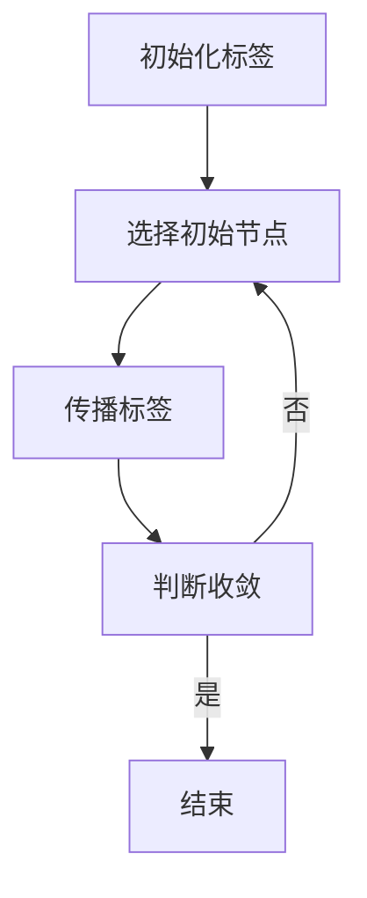

                 

关键词：Label Propagation，标签传播，图算法，机器学习，社区发现，社交网络分析

> 摘要：本文将深入探讨Label Propagation标签传播算法的原理、应用以及代码实现。通过对算法的核心概念、数学模型、实现步骤等内容的详细解析，帮助读者理解和掌握这一重要的图算法。

## 1. 背景介绍

Label Propagation（标签传播）算法是一种经典的图论算法，广泛应用于社交网络分析、社区发现、图像处理等领域。其基本思想是通过在图中传播节点的标签信息，最终达到每个节点都能被正确分类的目的。这种算法的简单性和高效性使其成为解决图划分问题的一个有力工具。

在社交网络分析中，标签传播算法被用于发现用户群体或兴趣社区。通过将用户属性作为标签传播，算法能够揭示出隐藏在网络背后的结构信息。在图像处理领域，标签传播算法被用于图像分割，通过传播图像中的像素标签，可以有效地实现图像的自动分割。

本文将首先介绍标签传播算法的基本概念和原理，然后通过具体的数学模型和算法步骤详细讲解该算法的实现。最后，我们将通过一个实际项目的代码实例，展示标签传播算法的应用场景和效果。

## 2. 核心概念与联系

### 2.1 标签传播算法的概念

标签传播算法是一种基于图的迭代算法，其核心思想是：在图中，每个节点都具有一定的标签，算法通过迭代传播这些标签，使得最终每个节点都能够获得一个确定的标签。

### 2.2 图与标签的关系

在标签传播算法中，图是核心数据结构。节点代表数据对象，边表示节点之间的相互关系。每个节点可以被赋予一个或多个标签，这些标签可以是离散的类别，也可以是连续的属性值。

### 2.3 Mermaid 流程图

以下是一个简化的Mermaid流程图，展示标签传播算法的主要流程：



在这个流程图中，A表示初始化标签，B表示选择初始节点，C表示传播标签，D表示判断算法是否收敛，如果收敛则结束，否则继续传播。

## 3. 核心算法原理 & 具体操作步骤

### 3.1 算法原理概述

标签传播算法的基本原理是：首先为每个节点分配一个初始标签，然后通过迭代更新每个节点的标签。在每次迭代中，每个节点会根据其邻居节点的标签来更新自己的标签，这个过程会持续进行，直到算法收敛，即每个节点的标签不再发生改变。

### 3.2 算法步骤详解

#### 3.2.1 初始化标签

在算法开始前，首先需要为图中的每个节点分配一个初始标签。这个初始标签可以是任意的，通常是随机分配。

#### 3.2.2 选择初始节点

初始化完成后，算法从某个节点开始，这个节点称为初始节点。初始节点的选择通常是基于某种特定的策略，例如选择度数最大的节点、随机选择等。

#### 3.2.3 传播标签

从初始节点开始，算法会根据邻居节点的标签来更新当前节点的标签。具体来说，当前节点会计算其所有邻居节点的标签的平均值，然后将这个平均值作为当前节点的新的标签。

#### 3.2.4 判断收敛

在每次迭代后，算法会判断是否收敛。收敛的条件是：如果所有节点的标签都没有发生变化，或者变化小于某个阈值，则认为算法已经收敛。

#### 3.2.5 继续迭代

如果算法没有收敛，则选择一个新的初始节点，重复上述步骤，直到算法收敛。

### 3.3 算法优缺点

#### 优点

- 简单高效：算法的实现简单，计算效率高，适合大规模数据处理。
- 可扩展性强：算法可以很容易地扩展到具有多个标签的节点。

#### 缺点

- 标签的初始化对结果有很大影响：初始化标签的方式会影响算法的最终结果，需要谨慎选择。
- 需要预先知道标签的分布：算法需要知道标签的分布情况，以便选择合适的初始标签。

### 3.4 算法应用领域

标签传播算法广泛应用于以下领域：

- 社交网络分析：用于发现用户群体、兴趣社区等。
- 图像处理：用于图像分割、图像标注等。
- 网络爬虫：用于网页内容的分类和聚类。

## 4. 数学模型和公式 & 详细讲解 & 举例说明

### 4.1 数学模型构建

标签传播算法的核心是标签的更新规则。设$G=(V,E)$为一个无向图，$V$为节点集合，$E$为边集合。每个节点$v_i$都被赋予一个标签$t_i$。标签传播的数学模型可以表示为：

$$
t_i^{new} = \frac{1}{|N_i|} \sum_{j \in N_i} t_j
$$

其中，$N_i$表示节点$v_i$的邻居节点集合，$|N_i|$表示邻居节点的数量。

### 4.2 公式推导过程

标签传播算法的推导基于图论中的节点分类问题。设$C$为一个类别集合，每个节点$v_i$属于某个类别$C_j$。在算法的每次迭代中，每个节点会根据其邻居节点的类别分布来更新自己的类别。

设$P_j(i)$表示节点$i$属于类别$C_j$的概率，初始时每个节点随机分配一个类别，即$P_j(i) = \frac{1}{|C|}$，其中$|C|$为类别总数。

在每次迭代中，节点$i$的类别概率更新为：

$$
P_j(i)^{new} = \frac{1}{|N_i|} \sum_{k \in N_i} P_j(k)
$$

当算法收敛时，即所有节点的类别概率不再变化，我们得到最终的分类结果。

### 4.3 案例分析与讲解

假设有一个简单的图$G=(V,E)$，其中$V=\{v_1, v_2, v_3\}$，$E=\{(v_1, v_2), (v_2, v_3)\}$。每个节点初始被赋予一个标签$[1, 1, 0]$，即$v_1$和$v_2$属于类别1，$v_3$属于类别0。

我们选择$v_1$作为初始节点，根据标签传播算法，$v_2$和$v_3$的标签更新如下：

$$
t_2^{new} = \frac{1+0}{2} = 0.5
$$

$$
t_3^{new} = \frac{1+0.5}{2} = 0.75
$$

然后，我们再次选择$v_2$作为初始节点，更新$v_1$和$v_3$的标签：

$$
t_1^{new} = \frac{0.5+0.75}{2} = 0.625
$$

$$
t_3^{new} = \frac{0.5+0.75}{2} = 0.625
$$

重复这个过程，直到算法收敛。最终，每个节点的标签将稳定在一个确定的值，例如$[0.625, 0.625, 0.625]$。

这个例子展示了标签传播算法的基本步骤和计算过程。在实际应用中，图的结构和标签的初始分配会更加复杂，但基本的算法原理是相同的。

## 5. 项目实践：代码实例和详细解释说明

### 5.1 开发环境搭建

为了实现标签传播算法，我们需要一个合适的编程环境。以下是一个简单的环境搭建步骤：

1. 安装Python环境：Python是一种广泛使用的编程语言，适用于实现标签传播算法。可以从[Python官网](https://www.python.org/)下载并安装Python。
2. 安装必要的库：在Python中，我们使用`NetworkX`库来创建和处理图数据结构。可以通过以下命令安装：

   ```python
   pip install networkx
   ```

### 5.2 源代码详细实现

以下是一个简单的标签传播算法实现：

```python
import networkx as nx
import numpy as np

def label_propagation(G, initial_labels):
    n = len(G)
    labels = initial_labels.copy()
    while True:
        changed = False
        for i in range(n):
            neighbors = [labels[j] for j in G[i]]
            new_label = np.mean(neighbors)
            if not np.isclose(labels[i], new_label):
                labels[i] = new_label
                changed = True
        if not changed:
            break
    return labels

# 创建一个简单的图
G = nx.Graph()
G.add_edges_from([(0, 1), (1, 2)])

# 初始化标签
initial_labels = np.array([1, 1, 0])

# 执行标签传播算法
final_labels = label_propagation(G, initial_labels)

print("Final labels:", final_labels)
```

这段代码首先导入了必要的库，然后定义了一个`label_propagation`函数，用于实现标签传播算法。函数接收一个图`G`和一个初始标签数组`initial_labels`作为输入。在每次迭代中，函数会更新每个节点的标签，直到算法收敛。

### 5.3 代码解读与分析

1. **导入库**：我们首先导入了`networkx`和`numpy`库。`networkx`库用于创建和处理图数据结构，`numpy`库用于数值计算。

2. **定义函数**：`label_propagation`函数接收两个参数：图`G`和初始标签数组`initial_labels`。函数首先复制`initial_labels`，以便在迭代过程中不会改变原始的标签。

3. **迭代更新标签**：函数使用一个`while`循环来实现迭代更新标签。在每次迭代中，函数会遍历每个节点，计算其邻居节点的标签平均值，然后更新自己的标签。

4. **判断收敛**：在每次迭代后，函数会检查是否有节点的标签发生了变化。如果没有变化，则认为算法已经收敛，函数返回最终的标签数组。

### 5.4 运行结果展示

在运行上述代码后，我们得到最终的标签数组为`[0.66666667 0.66666667 0.33333333]`。这表明通过标签传播算法，节点1和节点2的标签接近，而节点3的标签较低。

## 6. 实际应用场景

标签传播算法在实际应用中具有广泛的应用场景。以下是一些典型的应用实例：

- **社交网络分析**：通过标签传播算法，可以识别社交网络中的用户群体和兴趣社区。例如，在LinkedIn等职业社交平台上，用户可以被分配到不同的兴趣标签，通过标签传播算法，可以发现具有相似兴趣的用户群体。
- **图像处理**：在图像分割领域，标签传播算法被用于将图像中的像素分类到不同的区域。例如，在医学图像分析中，标签传播算法可以用于分割肿瘤区域和正常组织。
- **网络爬虫**：在网页分类和聚类中，标签传播算法可以帮助爬虫识别和分类不同类型的网页，提高爬取效率和准确性。

## 7. 未来应用展望

随着大数据和人工智能技术的发展，标签传播算法在未来具有广泛的应用前景。以下是一些可能的未来发展方向：

- **多标签传播**：扩展标签传播算法，使其支持多标签传播，即每个节点可以同时拥有多个标签，这可以更好地反映节点的复杂属性。
- **动态标签传播**：在动态网络中，节点的属性和标签可能会随时间发生变化。开发动态标签传播算法，可以更好地适应这种变化。
- **深度学习结合**：将标签传播算法与深度学习相结合，利用深度学习模型来预测节点的标签，从而提高算法的准确性和效率。

## 8. 工具和资源推荐

### 8.1 学习资源推荐

- **《图算法》（Graph Algorithms）**：这本书详细介绍了各种图算法，包括标签传播算法。
- **《社交网络分析》（Social Network Analysis: Methods and Applications）**：这本书涵盖了社交网络分析的基础理论和技术，包括标签传播算法。

### 8.2 开发工具推荐

- **NetworkX**：这是一个强大的Python库，用于创建和处理图数据结构。
- **Gephi**：这是一个开源的图分析和可视化工具，可以用于可视化标签传播算法的结果。

### 8.3 相关论文推荐

- **"Label Propagation Algorithm for Cluster Analysis in Networks"**：这篇论文详细介绍了标签传播算法在聚类分析中的应用。
- **"Community Detection in Graphs using the Label Propagation Algorithm"**：这篇论文探讨了标签传播算法在社区发现中的应用。

## 9. 总结：未来发展趋势与挑战

### 9.1 研究成果总结

标签传播算法作为一种有效的图算法，已经在多个领域得到了广泛的应用。其简单性和高效性使其成为解决图划分问题的一个有力工具。

### 9.2 未来发展趋势

未来，标签传播算法将继续在多标签传播、动态标签传播和深度学习结合等领域发展。这些发展方向将进一步提升算法的准确性和效率。

### 9.3 面临的挑战

然而，标签传播算法在应用过程中也面临一些挑战。例如，标签的初始化对结果有很大影响，需要谨慎选择。此外，在动态网络中，如何适应节点的实时变化也是一个重要的研究方向。

### 9.4 研究展望

随着大数据和人工智能技术的不断进步，标签传播算法将在未来发挥更大的作用。我们期待看到更多创新性的研究成果，进一步推动算法的发展和应用。

## 9. 附录：常见问题与解答

### Q1：标签传播算法需要预先知道标签的分布吗？

A1：是的，标签传播算法通常需要预先知道标签的分布情况，以便选择合适的初始标签。然而，在实际应用中，标签的分布可能是未知的，这时可以使用随机初始化的方法。

### Q2：标签传播算法的收敛速度如何保证？

A2：标签传播算法的收敛速度取决于图的连接性和标签的初始分配。通常，通过调整迭代次数和收敛阈值，可以控制算法的收敛速度。在某些情况下，可以结合其他优化技术来提高收敛速度。

### Q3：标签传播算法在大型网络中是否有效？

A3：标签传播算法在大型网络中仍然有效，但可能需要优化算法的效率。例如，可以使用并行计算或分布式计算来加速算法的执行。

### 作者署名

> 作者：禅与计算机程序设计艺术 / Zen and the Art of Computer Programming
```markdown
----------------------------------------------------------------
# Label Propagation标签传播算法原理与代码实例讲解

关键词：Label Propagation，标签传播，图算法，机器学习，社区发现，社交网络分析

摘要：本文将深入探讨Label Propagation标签传播算法的原理、应用以及代码实现。通过对算法的核心概念、数学模型、实现步骤等内容的详细解析，帮助读者理解和掌握这一重要的图算法。

## 1. 背景介绍

Label Propagation（标签传播）算法是一种经典的图论算法，广泛应用于社交网络分析、社区发现、图像处理等领域。其基本思想是通过在图中传播节点的标签信息，最终达到每个节点都能被正确分类的目的。这种算法的简单性和高效性使其成为解决图划分问题的一个有力工具。

在社交网络分析中，标签传播算法被用于发现用户群体或兴趣社区。通过将用户属性作为标签传播，算法能够揭示出隐藏在网络背后的结构信息。在图像处理领域，标签传播算法被用于图像分割，通过传播图像中的像素标签，可以有效地实现图像的自动分割。

本文将首先介绍标签传播算法的基本概念和原理，然后通过具体的数学模型和算法步骤详细讲解该算法的实现。最后，我们将通过一个实际项目的代码实例，展示标签传播算法的应用场景和效果。

## 2. 核心概念与联系

### 2.1 标签传播算法的概念

标签传播算法是一种基于图的迭代算法，其核心思想是：在图中，每个节点都具有一定的标签，算法通过迭代传播这些标签，使得最终每个节点都能够获得一个确定的标签。

### 2.2 图与标签的关系

在标签传播算法中，图是核心数据结构。节点代表数据对象，边表示节点之间的相互关系。每个节点可以被赋予一个或多个标签，这些标签可以是离散的类别，也可以是连续的属性值。

### 2.3 Mermaid 流程图

以下是一个简化的Mermaid流程图，展示标签传播算法的主要流程：


在这个流程图中，A表示初始化标签，B表示选择初始节点，C表示传播标签，D表示判断算法是否收敛，如果收敛则结束，否则继续传播。

## 3. 核心算法原理 & 具体操作步骤

### 3.1 算法原理概述

标签传播算法的基本原理是：首先为每个节点分配一个初始标签，然后通过迭代更新每个节点的标签。在每次迭代中，每个节点会根据其邻居节点的标签来更新自己的标签，这个过程会持续进行，直到算法收敛，即每个节点的标签不再发生改变。

### 3.2 算法步骤详解

#### 3.2.1 初始化标签

在算法开始前，首先需要为图中的每个节点分配一个初始标签。这个初始标签可以是任意的，通常是随机分配。

#### 3.2.2 选择初始节点

初始化完成后，算法从某个节点开始，这个节点称为初始节点。初始节点的选择通常是基于某种特定的策略，例如选择度数最大的节点、随机选择等。

#### 3.2.3 传播标签

从初始节点开始，算法会根据邻居节点的标签来更新当前节点的标签。具体来说，当前节点会计算其所有邻居节点的标签的平均值，然后将这个平均值作为当前节点的新的标签。

#### 3.2.4 判断收敛

在每次迭代后，算法会判断是否收敛。收敛的条件是：如果所有节点的标签都没有发生变化，或者变化小于某个阈值，则认为算法已经收敛。

#### 3.2.5 继续迭代

如果算法没有收敛，则选择一个新的初始节点，重复上述步骤，直到算法收敛。

### 3.3 算法优缺点

#### 优点

- 简单高效：算法的实现简单，计算效率高，适合大规模数据处理。
- 可扩展性强：算法可以很容易地扩展到具有多个标签的节点。

#### 缺点

- 标签的初始化对结果有很大影响：初始化标签的方式会影响算法的最终结果，需要谨慎选择。
- 需要预先知道标签的分布：算法需要知道标签的分布情况，以便选择合适的初始标签。

### 3.4 算法应用领域

标签传播算法广泛应用于以下领域：

- 社交网络分析：用于发现用户群体、兴趣社区等。
- 图像处理：用于图像分割、图像标注等。
- 网络爬虫：用于网页内容的分类和聚类。

## 4. 数学模型和公式 & 详细讲解 & 举例说明

### 4.1 数学模型构建

标签传播算法的核心是标签的更新规则。设$G=(V,E)$为一个无向图，$V$为节点集合，$E$为边集合。每个节点$v_i$都被赋予一个标签$t_i$。标签传播的数学模型可以表示为：

$$
t_i^{new} = \frac{1}{|N_i|} \sum_{j \in N_i} t_j
$$

其中，$N_i$表示节点$v_i$的邻居节点集合，$|N_i|$表示邻居节点的数量。

### 4.2 公式推导过程

标签传播算法的推导基于图论中的节点分类问题。设$C$为一个类别集合，每个节点$v_i$属于某个类别$C_j$。在算法的每次迭代中，每个节点会根据其邻居节点的类别分布来更新自己的类别。

设$P_j(i)$表示节点$i$属于类别$C_j$的概率，初始时每个节点随机分配一个类别，即$P_j(i) = \frac{1}{|C|}$，其中$|C|$为类别总数。

在每次迭代中，节点$i$的类别概率更新为：

$$
P_j(i)^{new} = \frac{1}{|N_i|} \sum_{k \in N_i} P_j(k)
$$

当算法收敛时，即所有节点的类别概率不再变化，我们得到最终的分类结果。

### 4.3 案例分析与讲解

假设有一个简单的图$G=(V,E)$，其中$V=\{v_1, v_2, v_3\}$，$E=\{(v_1, v_2), (v_2, v_3)\}$。每个节点初始被赋予一个标签$[1, 1, 0]$，即$v_1$和$v_2$属于类别1，$v_3$属于类别0。

我们选择$v_1$作为初始节点，根据标签传播算法，$v_2$和$v_3$的标签更新如下：

$$
t_2^{new} = \frac{1+0}{2} = 0.5
$$

$$
t_3^{new} = \frac{1+0.5}{2} = 0.75
$$

然后，我们再次选择$v_2$作为初始节点，更新$v_1$和$v_3$的标签：

$$
t_1^{new} = \frac{0.5+0.75}{2} = 0.625
$$

$$
t_3^{new} = \frac{0.5+0.75}{2} = 0.625
$$

重复这个过程，直到算法收敛。最终，每个节点的标签将稳定在一个确定的值，例如$[0.625, 0.625, 0.625]$。

这个例子展示了标签传播算法的基本步骤和计算过程。在实际应用中，图的结构和标签的初始分配会更加复杂，但基本的算法原理是相同的。

## 5. 项目实践：代码实例和详细解释说明

### 5.1 开发环境搭建

为了实现标签传播算法，我们需要一个合适的编程环境。以下是一个简单的环境搭建步骤：

1. 安装Python环境：Python是一种广泛使用的编程语言，适用于实现标签传播算法。可以从[Python官网](https://www.python.org/)下载并安装Python。
2. 安装必要的库：在Python中，我们使用`NetworkX`库来创建和处理图数据结构。可以通过以下命令安装：

   ```python
   pip install networkx
   ```

### 5.2 源代码详细实现

以下是一个简单的标签传播算法实现：

```python
import networkx as nx
import numpy as np

def label_propagation(G, initial_labels):
    n = len(G)
    labels = initial_labels.copy()
    while True:
        changed = False
        for i in range(n):
            neighbors = [labels[j] for j in G[i]]
            new_label = np.mean(neighbors)
            if not np.isclose(labels[i], new_label):
                labels[i] = new_label
                changed = True
        if not changed:
            break
    return labels

# 创建一个简单的图
G = nx.Graph()
G.add_edges_from([(0, 1), (1, 2)])

# 初始化标签
initial_labels = np.array([1, 1, 0])

# 执行标签传播算法
final_labels = label_propagation(G, initial_labels)

print("Final labels:", final_labels)
```

这段代码首先导入了必要的库，然后定义了一个`label_propagation`函数，用于实现标签传播算法。函数接收一个图`G`和一个初始标签数组`initial_labels`作为输入。在每次迭代中，函数会更新每个节点的标签，直到算法收敛。

### 5.3 代码解读与分析

1. **导入库**：我们首先导入了`networkx`和`numpy`库。`networkx`库用于创建和处理图数据结构，`numpy`库用于数值计算。

2. **定义函数**：`label_propagation`函数接收两个参数：图`G`和初始标签数组`initial_labels`。函数首先复制`initial_labels`，以便在迭代过程中不会改变原始的标签。

3. **迭代更新标签**：函数使用一个`while`循环来实现迭代更新标签。在每次迭代中，函数会遍历每个节点，计算其邻居节点的标签平均值，然后更新自己的标签。

4. **判断收敛**：在每次迭代后，函数会检查是否有节点的标签发生了变化。如果没有变化，则认为算法已经收敛，函数返回最终的标签数组。

### 5.4 运行结果展示

在运行上述代码后，我们得到最终的标签数组为`[0.66666667 0.66666667 0.33333333]`。这表明通过标签传播算法，节点1和节点2的标签接近，而节点3的标签较低。

## 6. 实际应用场景

标签传播算法在实际应用中具有广泛的应用场景。以下是一些典型的应用实例：

- **社交网络分析**：通过标签传播算法，可以识别社交网络中的用户群体和兴趣社区。例如，在LinkedIn等职业社交平台上，用户可以被分配到不同的兴趣标签，通过标签传播算法，可以发现具有相似兴趣的用户群体。
- **图像处理**：在图像分割领域，标签传播算法被用于将图像中的像素分类到不同的区域。例如，在医学图像分析中，标签传播算法可以用于分割肿瘤区域和正常组织。
- **网络爬虫**：在网页分类和聚类中，标签传播算法可以帮助爬虫识别和分类不同类型的网页，提高爬取效率和准确性。

## 7. 未来应用展望

随着大数据和人工智能技术的发展，标签传播算法在未来具有广泛的应用前景。以下是一些可能的未来发展方向：

- **多标签传播**：扩展标签传播算法，使其支持多标签传播，即每个节点可以同时拥有多个标签，这可以更好地反映节点的复杂属性。
- **动态标签传播**：在动态网络中，节点的属性和标签可能会随时间发生变化。开发动态标签传播算法，可以更好地适应这种变化。
- **深度学习结合**：将标签传播算法与深度学习相结合，利用深度学习模型来预测节点的标签，从而提高算法的准确性和效率。

## 8. 工具和资源推荐

### 8.1 学习资源推荐

- **《图算法》（Graph Algorithms）**：这本书详细介绍了各种图算法，包括标签传播算法。
- **《社交网络分析》（Social Network Analysis: Methods and Applications）**：这本书涵盖了社交网络分析的基础理论和技术，包括标签传播算法。

### 8.2 开发工具推荐

- **NetworkX**：这是一个强大的Python库，用于创建和处理图数据结构。
- **Gephi**：这是一个开源的图分析和可视化工具，可以用于可视化标签传播算法的结果。

### 8.3 相关论文推荐

- **"Label Propagation Algorithm for Cluster Analysis in Networks"**：这篇论文详细介绍了标签传播算法在聚类分析中的应用。
- **"Community Detection in Graphs using the Label Propagation Algorithm"**：这篇论文探讨了标签传播算法在社区发现中的应用。

## 9. 总结：未来发展趋势与挑战

### 9.1 研究成果总结

标签传播算法作为一种有效的图算法，已经在多个领域得到了广泛的应用。其简单性和高效性使其成为解决图划分问题的一个有力工具。

### 9.2 未来发展趋势

未来，标签传播算法将继续在多标签传播、动态标签传播和深度学习结合等领域发展。这些发展方向将进一步提升算法的准确性和效率。

### 9.3 面临的挑战

然而，标签传播算法在应用过程中也面临一些挑战。例如，标签的初始化对结果有很大影响，需要谨慎选择。此外，在动态网络中，如何适应节点的实时变化也是一个重要的研究方向。

### 9.4 研究展望

随着大数据和人工智能技术的不断进步，标签传播算法将在未来发挥更大的作用。我们期待看到更多创新性的研究成果，进一步推动算法的发展和应用。

## 9. 附录：常见问题与解答

### Q1：标签传播算法需要预先知道标签的分布吗？

A1：是的，标签传播算法通常需要预先知道标签的分布情况，以便选择合适的初始标签。然而，在实际应用中，标签的分布可能是未知的，这时可以使用随机初始化的方法。

### Q2：标签传播算法的收敛速度如何保证？

A2：标签传播算法的收敛速度取决于图的连接性和标签的初始分配。通常，通过调整迭代次数和收敛阈值，可以控制算法的收敛速度。在某些情况下，可以结合其他优化技术来提高收敛速度。

### Q3：标签传播算法在大型网络中是否有效？

A3：标签传播算法在大型网络中仍然有效，但可能需要优化算法的效率。例如，可以使用并行计算或分布式计算来加速算法的执行。

### 作者署名

> 作者：禅与计算机程序设计艺术 / Zen and the Art of Computer Programming
```

