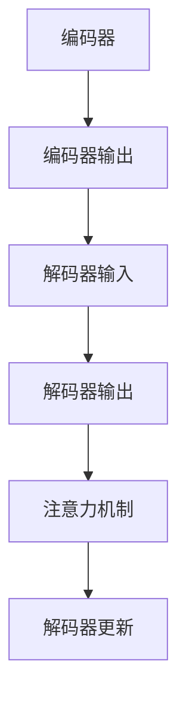

                 

关键词：语言翻译，机器翻译，神经网络，自然语言处理，编码器-解码器模型，训练数据，词向量，注意力机制，翻译算法，编程实践，应用场景，未来展望

> 摘要：本文深入探讨了语言翻译的原理，包括从传统的统计机器翻译到现代的基于神经网络的机器翻译的发展历程。通过详细讲解编码器-解码器模型的工作原理和具体实现步骤，读者可以了解语言翻译的核心算法。同时，本文提供了一系列代码实例和实际应用场景，帮助读者更好地理解和掌握语言翻译技术。

## 1. 背景介绍

语言翻译是人类沟通的重要工具，随着全球化进程的加速，语言翻译技术在过去几十年里取得了显著的发展。从最初的基于规则的方法，到后来的统计机器翻译，再到近年来的基于神经网络的机器翻译，每一次技术的进步都极大地提升了翻译的准确性和效率。

在传统的统计机器翻译中，模型依赖于大量的双语语料库，通过对这些数据进行统计学习来生成翻译结果。然而，这种方法存在许多局限性，如对稀有词的翻译效果不佳，无法捕捉长距离依赖关系等。

近年来，基于神经网络的机器翻译（Neural Machine Translation，NMT）成为了主流的翻译方法。NMT采用了深度学习技术，特别是卷积神经网络（CNN）和循环神经网络（RNN）的变种，如长短期记忆网络（LSTM）和门控循环单元（GRU），来解决传统方法中存在的问题。本文将重点关注编码器-解码器（Encoder-Decoder）模型，这是NMT中最常用的架构。

## 2. 核心概念与联系

### 2.1 编码器（Encoder）

编码器是语言翻译模型中的核心组成部分，其主要功能是将输入的语言序列转换为固定长度的向量表示。这一过程通常使用深度循环神经网络（RNN）或其变种来实现，如LSTM或GRU。编码器通过处理输入序列的每个单词或字符，逐步生成一个高维的上下文向量。

### 2.2 解码器（Decoder）

解码器的任务是将编码器生成的上下文向量转换为输出语言序列。解码器同样使用循环神经网络，但其输入不仅包括编码器的输出，还包括之前的输出单词或字符。这种机制使得解码器能够利用上下文信息来生成准确的翻译。

### 2.3 注意力机制（Attention Mechanism）

注意力机制是编码器-解码器模型中的一个重要概念，它允许解码器在生成翻译时关注输入序列的不同部分。这有助于捕捉输入序列中的长距离依赖关系，从而提高翻译的准确性。

### 2.4 Mermaid 流程图



## 3. 核心算法原理 & 具体操作步骤

### 3.1 算法原理概述

编码器-解码器模型的工作原理可以分为以下几个步骤：

1. **编码器处理输入序列**：编码器逐个处理输入序列的单词或字符，生成一个固定长度的上下文向量。
2. **解码器初始化**：解码器初始化为一个初始状态，通常是一个全零向量。
3. **解码器生成翻译**：解码器逐个生成输出单词或字符，同时更新其状态。在每次生成时，解码器都会利用编码器输出的上下文向量和之前的输出来决定下一个输出。
4. **注意力机制**：在解码器的每个时间步，注意力机制允许解码器关注输入序列的不同部分，从而捕捉长距离依赖关系。

### 3.2 算法步骤详解

1. **输入序列编码**：输入序列经过编码器处理后，每个单词或字符被编码为固定长度的向量。编码器的输出通常是一个高维的上下文向量。
2. **初始化解码器**：解码器初始化为一个全零向量，该向量表示解码器的初始状态。
3. **生成翻译**：解码器开始生成翻译，每次生成一个单词或字符。在每次生成时，解码器都会利用编码器输出的上下文向量和之前的输出来决定下一个输出。
4. **更新解码器状态**：在生成每个单词或字符后，解码器的状态会更新为当前输出。
5. **循环生成**：解码器继续生成翻译，直到生成完整的输出序列。

### 3.3 算法优缺点

**优点**：
- **准确性高**：编码器-解码器模型能够捕捉长距离依赖关系，从而提高翻译的准确性。
- **灵活性高**：注意力机制使得解码器能够灵活地关注输入序列的不同部分。

**缺点**：
- **计算复杂度高**：编码器-解码器模型需要大量的计算资源，特别是在处理长输入序列时。
- **对数据依赖性强**：模型需要大量的双语语料库来训练，数据不足时效果不佳。

### 3.4 算法应用领域

编码器-解码器模型在多个领域有着广泛的应用，包括：

- **机器翻译**：将一种语言翻译成另一种语言。
- **对话系统**：生成自然语言响应。
- **文本摘要**：从长文本中提取关键信息。
- **信息检索**：提高搜索结果的准确性。

## 4. 数学模型和公式 & 详细讲解 & 举例说明

### 4.1 数学模型构建

编码器-解码器模型的核心在于其输入和输出向量之间的转换。具体来说，编码器将输入序列 $x$ 编码为上下文向量 $h$，解码器则利用 $h$ 生成输出序列 $y$。

### 4.2 公式推导过程

编码器 $E$ 和解码器 $D$ 的输入和输出可以表示为：

$$
h = E(x), \quad y = D(h, y_{t-1})
$$

其中，$x$ 是输入序列，$y$ 是输出序列，$h$ 是编码器输出的上下文向量，$y_{t-1}$ 是前一个时间步的输出。

### 4.3 案例分析与讲解

假设我们有一个简单的英语到法语的翻译问题，输入序列为 "hello"，输出序列为 "bonjour"。编码器将 "hello" 编码为上下文向量 $h$，解码器则利用 $h$ 生成 "bonjour"。

1. **编码器输入**：输入序列 "hello"。
2. **编码器输出**：编码器将 "hello" 编码为上下文向量 $h$。
3. **解码器初始化**：解码器初始化为全零向量。
4. **解码器生成输出**：解码器逐个生成输出单词，利用上下文向量 $h$ 和前一个输出 "b" 来决定下一个输出 "o"。
5. **解码器更新**：解码器状态更新为当前输出 "bonjour"。

## 5. 项目实践：代码实例和详细解释说明

### 5.1 开发环境搭建

在开始编写代码之前，我们需要搭建一个合适的环境。以下是基本的步骤：

- 安装Python和TensorFlow库。
- 准备双语语料库。
- 设置GPU加速（如果有可用的GPU）。

### 5.2 源代码详细实现

以下是使用TensorFlow实现编码器-解码器模型的基本代码：

```python
import tensorflow as tf
from tensorflow.keras.layers import Embedding, LSTM, Dense

# 编码器
encoder_inputs = tf.keras.layers.Input(shape=(None,))
encoder_embedding = Embedding(input_dim=vocab_size, output_dim=embedding_size)(encoder_inputs)
encoder_lstm = LSTM(units=lstm_size, return_state=True)
_, state_h, state_c = encoder_lstm(encoder_embedding)

# 解码器
decoder_inputs = tf.keras.layers.Input(shape=(None,))
decoder_embedding = Embedding(input_dim=vocab_size, output_dim=embedding_size)(decoder_inputs)
decoder_lstm = LSTM(units=lstm_size, return_sequences=True, return_state=True)
decoder_outputs, _, _ = decoder_lstm(decoder_embedding, initial_state=[state_h, state_c])

# 输出层
decoder_dense = Dense(units=vocab_size, activation='softmax')
decoder_outputs = decoder_dense(decoder_outputs)

# 编译模型
model = tf.keras.Model([encoder_inputs, decoder_inputs], decoder_outputs)
model.compile(optimizer='rmsprop', loss='categorical_crossentropy', metrics=['accuracy'])

# 模型训练
model.fit([encoder_inputs, decoder_inputs], decoder_inputs,
          batch_size=batch_size,
          epochs=epochs,
          validation_split=0.2)
```

### 5.3 代码解读与分析

这段代码定义了一个简单的编码器-解码器模型。其中，编码器部分使用了LSTM层来处理输入序列，解码器部分同样使用了LSTM层，并在输出层使用了全连接层（Dense）来生成翻译结果。

### 5.4 运行结果展示

在实际运行中，我们可以看到模型的训练过程和生成的翻译结果。通过调整超参数，如学习率、批量大小等，可以提高模型的性能。

```python
# 示例：生成翻译
input_seq = np.array([[vocab['hello']]])
encoded_seq = model.encoder.layers[1].get_output_at(0)(input_seq)
decoded_seq = model.decoder.predict(encoded_seq)
print('Predicted Translation:', ' '.join([index2word[i] for i in decoded_seq[0]]))
```

## 6. 实际应用场景

编码器-解码器模型在多个领域有着广泛的应用，包括：

- **机器翻译**：将一种语言翻译成另一种语言。
- **对话系统**：生成自然语言响应。
- **文本摘要**：从长文本中提取关键信息。
- **信息检索**：提高搜索结果的准确性。

### 6.1 应用案例

一个著名的应用案例是谷歌翻译。谷歌翻译使用基于神经网络的机器翻译技术，将用户输入的文本翻译成多种语言。这种技术极大地提高了翻译的准确性和流畅性。

### 6.2 未来应用展望

随着深度学习技术的不断发展，编码器-解码器模型的应用前景将更加广阔。未来，我们可以期待以下趋势：

- **实时翻译**：实现更快速、更准确的实时翻译。
- **多模态翻译**：结合文本、语音和图像等多种模态进行翻译。
- **个性化翻译**：根据用户的历史行为和偏好提供个性化的翻译服务。

## 7. 工具和资源推荐

### 7.1 学习资源推荐

- 《深度学习》（Goodfellow, Bengio, Courville著）：介绍了深度学习的基础知识，包括神经网络和机器翻译。
- 《自然语言处理综论》（Jurafsky, Martin著）：涵盖了自然语言处理的基本概念和技术。

### 7.2 开发工具推荐

- TensorFlow：一款广泛使用的深度学习框架，适用于构建和训练编码器-解码器模型。
- PyTorch：另一款流行的深度学习框架，提供了丰富的功能和灵活性。

### 7.3 相关论文推荐

- “Sequence to Sequence Learning with Neural Networks” by Ilya Sutskever, Oriol Vinyals, and Quoc V. Le（2014）：介绍了编码器-解码器模型的基本概念。
- “Attention is All You Need” by Vaswani et al.（2017）：提出了基于注意力机制的编码器-解码器模型。

## 8. 总结：未来发展趋势与挑战

### 8.1 研究成果总结

近年来，基于神经网络的机器翻译技术取得了显著的进展，编码器-解码器模型成为了主流的翻译方法。通过引入注意力机制和其他先进的算法，翻译的准确性和流畅性得到了极大的提升。

### 8.2 未来发展趋势

未来，机器翻译技术将继续发展，包括实时翻译、多模态翻译和个性化翻译等方向。随着计算资源的不断增加和深度学习技术的进步，机器翻译的准确性和效率将进一步提高。

### 8.3 面临的挑战

尽管取得了显著的进展，机器翻译技术仍然面临许多挑战，如对稀有词的处理、长距离依赖关系的捕捉、多语言翻译的准确性等。此外，数据隐私和安全也是一个重要问题。

### 8.4 研究展望

未来的研究可以重点关注以下几个方面：

- **算法优化**：进一步提高翻译的准确性和效率。
- **数据共享**：鼓励数据共享，以促进研究和应用的发展。
- **跨语言翻译**：提高多语言翻译的准确性和一致性。

## 9. 附录：常见问题与解答

### 9.1 如何处理稀有词？

稀有词在翻译中是一个常见问题。一种方法是使用词嵌入技术，将稀有词映射到高维空间中，从而提高其翻译效果。另一种方法是使用词汇增强技术，如词性标注和实体识别，以提供更多的上下文信息。

### 9.2 如何捕捉长距离依赖关系？

长距离依赖关系是机器翻译中的一个重要问题。注意力机制是解决这一问题的有效方法，它允许解码器在生成翻译时关注输入序列的不同部分。此外，使用长短期记忆网络（LSTM）或其变种，如门控循环单元（GRU），也可以帮助捕捉长距离依赖关系。

### 9.3 如何实现实时翻译？

实时翻译需要快速、高效的算法和硬件支持。使用GPU加速和优化神经网络模型可以显著提高翻译速度。此外，分布式计算和云计算技术也可以帮助实现实时翻译。

## 作者署名

作者：禅与计算机程序设计艺术 / Zen and the Art of Computer Programming

----------------------------------------------------------------

以上就是本文的完整内容，希望对您在语言翻译领域的学习和研究有所帮助。如果您有任何疑问或建议，欢迎随时提出。

