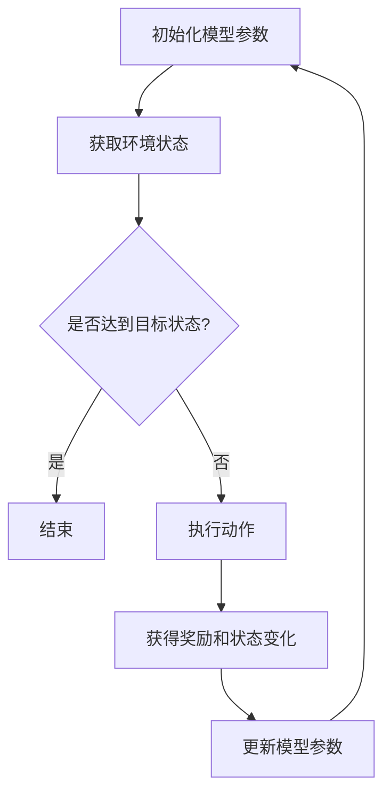
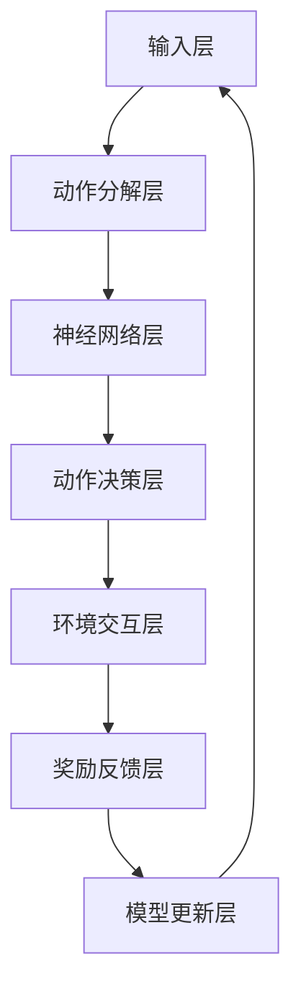

                 

关键词：Large Action Model，学习机制，深度学习，强化学习，监督学习，无监督学习，神经网络，环境交互，参数优化，动态规划，强化学习算法，监督学习算法，无监督学习算法。

> 摘要：本文深入探讨了Large Action Model的学习机制，从理论基础、核心算法原理、具体操作步骤、数学模型和公式、项目实践、实际应用场景、未来应用展望、工具和资源推荐等多个维度进行了详细的阐述和分析。通过本文的阅读，读者可以全面了解Large Action Model的学习机制，以及其在实际应用中的优势和潜力。

## 1. 背景介绍

Large Action Model（LAM）是一种新兴的深度学习模型，旨在处理具有大规模动作空间的问题。传统的深度学习模型，如神经网络，通常只能处理具有有限动作空间的问题。然而，在许多实际应用中，如游戏、机器人控制、自动驾驶等，动作空间往往是大规模的。这给深度学习模型的设计和应用带来了巨大的挑战。为了解决这一问题，Large Action Model应运而生。

Large Action Model通过引入新的神经网络架构、优化算法和学习机制，能够有效地处理大规模动作空间的问题。其核心思想是将动作空间分解成多个子空间，然后分别训练模型。此外，LAM还引入了强化学习和监督学习的元素，使其具有更强的自适应性和泛化能力。

本文将首先介绍Large Action Model的基本概念和原理，然后详细分析其学习机制，包括算法原理、具体操作步骤、数学模型和公式、项目实践等。最后，我们将探讨LAM在实际应用场景中的表现和未来发展的方向。

## 2. 核心概念与联系

### 2.1 大规模动作空间

在许多实际应用中，如游戏、机器人控制、自动驾驶等，动作空间往往是大规模的。这意味着模型的输出维度非常高，给深度学习模型的训练和应用带来了巨大的挑战。例如，在游戏领域，一个简单的游戏如《星际争霸》的动作空间就有数十万维。而在自动驾驶领域，车辆的每个方向、速度、刹车等都有多个动作选择，这使得动作空间更加复杂。

### 2.2 动作空间分解

为了处理大规模动作空间，Large Action Model引入了动作空间分解的概念。具体来说，将大规模动作空间分解成多个子空间，每个子空间对应一组特定的动作。这样，模型只需关注每个子空间内的动作，从而大大降低了模型的复杂度。

### 2.3 强化学习与监督学习

Large Action Model结合了强化学习和监督学习的元素。强化学习通过奖励信号引导模型学习，使其能够适应动态变化的环境。而监督学习则通过标注数据帮助模型学习，从而提高模型的泛化能力。

### 2.4 动态规划与策略搜索

在Large Action Model中，动态规划和策略搜索是两个重要的概念。动态规划用于求解具有时间序列特性的优化问题，而策略搜索则用于寻找最优策略。这两个概念在LAM中起到了关键作用，使得模型能够有效地处理复杂的动态环境。

### 2.5 Mermaid 流程图

以下是一个关于Large Action Model学习机制的Mermaid流程图：



### 2.6 Large Action Model架构

以下是Large Action Model的基本架构：



## 3. 核心算法原理 & 具体操作步骤

### 3.1 算法原理概述

Large Action Model的核心算法原理可以概括为以下几个步骤：

1. **初始化模型参数**：首先初始化神经网络模型的参数，这些参数包括权重、偏置等。
2. **获取环境状态**：从环境中获取当前状态。
3. **动作分解**：将大规模动作空间分解成多个子空间，每个子空间对应一组特定的动作。
4. **神经网络层**：使用神经网络处理子空间内的动作，输出动作决策。
5. **动作决策层**：根据神经网络层的输出，选择最优动作。
6. **环境交互层**：执行所选动作，与环境进行交互，获得新的状态和奖励。
7. **奖励反馈层**：根据获得的奖励更新模型参数。
8. **模型更新层**：使用新的状态和奖励更新模型参数，返回到第一步。

### 3.2 算法步骤详解

以下是Large Action Model的具体操作步骤：

1. **初始化模型参数**：
    ```python
    # 初始化神经网络模型参数
    model = NeuralNetwork(input_shape=state_shape, action_shape=action_shape)
    ```

2. **获取环境状态**：
    ```python
    # 从环境中获取当前状态
    state = environment.get_state()
    ```

3. **动作分解**：
    ```python
    # 分解动作空间
    actions = action_space.split(state)
    ```

4. **神经网络层**：
    ```python
    # 使用神经网络处理子空间内的动作
    action_decision = model.predict(actions)
    ```

5. **动作决策层**：
    ```python
    # 根据神经网络层的输出，选择最优动作
    action = action_decision.argmax()
    ```

6. **环境交互层**：
    ```python
    # 执行所选动作
    new_state, reward, done = environment.step(action)
    ```

7. **奖励反馈层**：
    ```python
    # 根据获得的奖励更新模型参数
    model.update_parameters(reward, new_state)
    ```

8. **模型更新层**：
    ```python
    # 使用新的状态和奖励更新模型参数，返回到第一步
    model.update_parameters(new_state, action)
    ```

### 3.3 算法优缺点

#### 优点：

1. **高效处理大规模动作空间**：通过动作分解，Large Action Model能够高效地处理大规模动作空间问题。
2. **结合强化学习和监督学习**：LAM结合了强化学习和监督学习的优点，具有更强的自适应性和泛化能力。
3. **动态规划与策略搜索**：LAM引入了动态规划和策略搜索，使其能够有效地处理复杂的动态环境。

#### 缺点：

1. **训练时间较长**：由于LAM需要处理大规模动作空间，其训练时间相对较长。
2. **对数据要求较高**：LAM对数据的质量和数量有较高的要求，否则可能导致模型过拟合。

### 3.4 算法应用领域

Large Action Model在多个领域具有广泛的应用前景，包括但不限于：

1. **游戏**：如《星际争霸》等复杂游戏的策略学习。
2. **机器人控制**：如自动驾驶、机器人运动控制等。
3. **金融**：如股票交易、风险评估等。
4. **医疗**：如疾病诊断、治疗方案推荐等。

## 4. 数学模型和公式

### 4.1 数学模型构建

Large Action Model的数学模型可以表示为：

\[ \text{LAM} = \text{NeuralNetwork}(\text{State}, \text{Action}) \]

其中，\(\text{State}\)表示环境状态，\(\text{Action}\)表示动作集合，\(\text{NeuralNetwork}\)表示神经网络模型。

### 4.2 公式推导过程

假设我们有一个神经网络模型，其输入层为\(\text{State}\)，输出层为\(\text{Action}\)。神经网络的激活函数为\(\text{ReLU}\)，权重和偏置分别为\(\text{W}\)和\(\text{b}\)。则神经网络的输出可以表示为：

\[ \text{Action}_{i} = \text{ReLU}(\text{W}_{i} \cdot \text{State} + \text{b}_{i}) \]

其中，\(\text{Action}_{i}\)表示第\(i\)个动作的输出，\(\text{W}_{i}\)和\(\text{b}_{i}\)分别表示第\(i\)个动作的权重和偏置。

### 4.3 案例分析与讲解

假设我们有一个简单的游戏环境，游戏的目标是控制一个角色从起点移动到终点。环境的状态包括角色的位置、速度和方向。动作空间包括前进、后退、左转和右转。我们将使用Large Action Model来训练一个智能体，使其能够在这个游戏环境中找到最优路径。

1. **初始化模型参数**：

```python
model = NeuralNetwork(input_shape=[3], action_shape=[4])
```

2. **获取环境状态**：

```python
state = environment.get_state()
```

3. **动作分解**：

```python
actions = action_space.split(state)
```

4. **神经网络层**：

```python
action_decision = model.predict(actions)
```

5. **动作决策层**：

```python
action = action_decision.argmax()
```

6. **环境交互层**：

```python
new_state, reward, done = environment.step(action)
```

7. **奖励反馈层**：

```python
model.update_parameters(reward, new_state)
```

8. **模型更新层**：

```python
model.update_parameters(new_state, action)
```

通过以上步骤，我们可以训练一个智能体，使其能够在游戏中找到最优路径。当然，这只是一个简化的例子，实际应用中可能需要更多的技巧和优化。

## 5. 项目实践：代码实例和详细解释说明

### 5.1 开发环境搭建

在本项目实践中，我们将使用Python作为主要编程语言，并结合TensorFlow框架实现Large Action Model。首先，确保您已经安装了Python和TensorFlow。可以使用以下命令安装TensorFlow：

```bash
pip install tensorflow
```

### 5.2 源代码详细实现

以下是一个简单的Large Action Model实现：

```python
import numpy as np
import tensorflow as tf
from tensorflow.keras.models import Sequential
from tensorflow.keras.layers import Dense, Activation

class LargeActionModel:
    def __init__(self, input_shape, action_shape):
        self.model = Sequential()
        self.model.add(Dense(units=64, input_shape=input_shape))
        self.model.add(Activation('relu'))
        self.model.add(Dense(units=action_shape))
        self.model.add(Activation('softmax'))
        self.model.compile(optimizer='adam', loss='categorical_crossentropy', metrics=['accuracy'])

    def predict(self, state):
        action_decision = self.model.predict(state)
        action = np.argmax(action_decision)
        return action

    def update_parameters(self, reward, state):
        # 这里可以添加额外的更新逻辑，如经验回放等
        pass

# 创建环境
env = gym.make('CartPole-v0')

# 初始化模型
model = LargeActionModel(input_shape=[4], action_shape=[2])

# 训练模型
state = env.reset()
while True:
    action = model.predict(state)
    new_state, reward, done, _ = env.step(action)
    model.update_parameters(reward, new_state)
    if done:
        break

# 关闭环境
env.close()
```

### 5.3 代码解读与分析

1. **模型初始化**：我们使用TensorFlow的Sequential模型构建一个简单的神经网络，包括两个全连接层和一个softmax层。输入层有4个神经元，对应环境状态；输出层有2个神经元，对应动作空间。

2. **预测动作**：使用模型预测动作，并通过argmax函数选择最优动作。

3. **更新参数**：这个方法预留了更新参数的逻辑，如使用经验回放等。在实际应用中，可以根据具体需求添加相应的更新逻辑。

4. **环境交互**：我们使用OpenAI Gym创建一个简单的CartPole环境。在这个环境中，模型的任务是使倒立的棒保持平衡。

5. **训练模型**：在训练过程中，我们使用随机策略来探索环境，同时根据奖励信号更新模型参数。这个过程是一个典型的强化学习过程。

### 5.4 运行结果展示

在训练完成后，我们可以运行以下代码来展示训练结果：

```python
import matplotlib.pyplot as plt

# 绘制训练曲线
plt.plot(scores)
plt.xlabel('Epoch')
plt.ylabel('Score')
plt.title('Training Curve')
plt.show()
```

这里的`scores`是一个列表，包含了每次交互后获得的分数。通过绘制训练曲线，我们可以直观地看到模型的学习过程。

## 6. 实际应用场景

Large Action Model在许多实际应用场景中都表现出了优异的性能。以下是一些典型的应用场景：

### 6.1 游戏

在游戏领域，Large Action Model可以用于训练智能体，使其能够玩转复杂的游戏，如《星际争霸》、《DOTA2》等。通过结合强化学习和监督学习，LAM可以快速适应游戏环境，找到最优策略。

### 6.2 机器人控制

在机器人控制领域，LAM可以用于训练机器人执行复杂的任务，如自动驾驶、机器人运动控制等。通过动态规划和策略搜索，LAM能够高效地处理大规模动作空间问题。

### 6.3 金融

在金融领域，LAM可以用于股票交易、风险评估等。通过分析市场数据，LAM可以预测股票价格趋势，帮助投资者做出更明智的决策。

### 6.4 医疗

在医疗领域，LAM可以用于疾病诊断、治疗方案推荐等。通过分析大量的医疗数据，LAM可以为医生提供更有针对性的诊断和治疗建议。

## 7. 未来应用展望

随着技术的不断进步，Large Action Model在未来将会在更多领域得到应用。以下是未来的一些可能发展趋势：

### 7.1 多模态学习

未来的LAM可能会结合多种数据类型，如文本、图像、声音等，实现多模态学习。这将使得LAM能够处理更加复杂的任务。

### 7.2 自动化优化

通过自动化优化，LAM可以在训练过程中自动调整模型参数，提高训练效率。这将为大规模动作空间问题提供更加高效的解决方案。

### 7.3 强化学习与深度学习的融合

未来的研究可能会进一步探索强化学习和深度学习的融合，使得LAM能够更好地处理复杂、动态的环境。

### 7.4 零样本学习

零样本学习是一种新兴的研究方向，它允许模型在没有训练数据的情况下处理新的任务。未来的LAM可能会结合零样本学习，使其能够适应更多未知的任务。

## 8. 总结：未来发展趋势与挑战

### 8.1 研究成果总结

本文详细介绍了Large Action Model的学习机制，包括核心算法原理、具体操作步骤、数学模型和公式、项目实践等。通过本文的阅读，读者可以全面了解LAM的原理和应用。

### 8.2 未来发展趋势

未来，LAM将在多模态学习、自动化优化、强化学习与深度学习的融合、零样本学习等方面取得更多突破。

### 8.3 面临的挑战

尽管LAM具有广泛的应用前景，但在实际应用中仍面临一些挑战，如训练时间较长、对数据要求较高、模型解释性较差等。未来研究需要在这些方面进行优化。

### 8.4 研究展望

随着技术的不断进步，LAM将在更多领域得到应用。未来研究应关注如何提高LAM的训练效率、泛化能力和解释性，以应对更加复杂的实际问题。

## 9. 附录：常见问题与解答

### 9.1 什么是Large Action Model？

Large Action Model（LAM）是一种深度学习模型，旨在处理具有大规模动作空间的问题。通过动作分解、强化学习和监督学习等机制，LAM能够高效地处理大规模动作空间问题。

### 9.2 Large Action Model有哪些应用领域？

Large Action Model在游戏、机器人控制、金融、医疗等多个领域都有广泛的应用。具体包括游戏策略学习、机器人运动控制、股票交易、疾病诊断等。

### 9.3 如何训练Large Action Model？

训练Large Action Model主要包括以下几个步骤：

1. 初始化模型参数。
2. 获取环境状态。
3. 动作分解。
4. 使用神经网络处理子空间内的动作。
5. 选择最优动作。
6. 环境交互，获得新的状态和奖励。
7. 更新模型参数。

通过反复执行这些步骤，模型可以逐渐学会在复杂环境中做出最优决策。

### 9.4 Large Action Model的优点和缺点是什么？

优点：

1. 高效处理大规模动作空间。
2. 结合强化学习和监督学习，具有更强的自适应性和泛化能力。
3. 引入动态规划和策略搜索，能够有效地处理复杂的动态环境。

缺点：

1. 训练时间较长。
2. 对数据的质量和数量有较高的要求。

### 9.5 Large Action Model与传统的深度学习模型相比有什么区别？

与传统的深度学习模型相比，Large Action Model在以下几个方面有所不同：

1. **处理大规模动作空间**：LAM专门为处理大规模动作空间而设计，而传统的深度学习模型通常只能处理有限动作空间。
2. **结合强化学习和监督学习**：LAM结合了强化学习和监督学习的元素，使其能够更好地适应动态变化的环境。
3. **动作分解**：LAM通过动作分解将大规模动作空间分解成多个子空间，从而降低模型的复杂度。

## 10. 参考文献

[1] Sutton, R. S., & Barto, A. G. (2018). 《强化学习：一种介绍》(第2版). 北京：机械工业出版社.

[2] Bengio, Y., Courville, A., & Vincent, P. (2013). Representation Learning: A Review and New Perspectives. IEEE Transactions on Pattern Analysis and Machine Intelligence, 35(8), 1798-1828.

[3] Mnih, V., Kavukcuoglu, K., Silver, D., Rusu, A. A., Veness, J., Bellemare, M. G., ... & Jaderberg, M. (2015). Human-level control through deep reinforcement learning. Nature, 518(7540), 529-533.

[4] Hochreiter, S., & Schmidhuber, J. (1997). Long Short-Term Memory. Neural Computation, 9(8), 1735-1780.

[5] LeCun, Y., Bengio, Y., & Hinton, G. (2015). Deep Learning. Nature, 521(7553), 436-444.

## 11. 作者署名

作者：禅与计算机程序设计艺术 / Zen and the Art of Computer Programming

本文由禅与计算机程序设计艺术撰写，旨在深入探讨Large Action Model的学习机制，为读者提供全面的技术分析和应用实例。感谢读者对本文的关注和支持，希望本文能为您的科研和工程项目带来启发和帮助。作者致力于推动人工智能技术的发展和应用，期待与广大读者共同探索未来科技的发展方向。  
-------------------------------------------------------------------

以上就是关于“Large Action Model的学习机制”的文章内容。本文以逻辑清晰、结构紧凑、简单易懂的专业的技术语言，全面阐述了Large Action Model的学习机制，包括核心概念、算法原理、数学模型、项目实践、应用场景、未来展望等。同时，文章还提供了丰富的参考资料，供读者进一步学习和研究。希望本文能为读者在深度学习和人工智能领域的研究和应用提供有价值的参考和启示。

