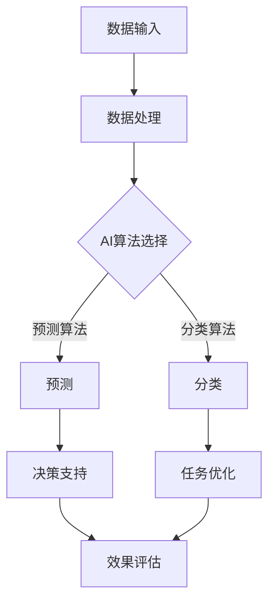

                 

关键词：人工智能，企业效率，成本节约，速度优化，解决方案

> 摘要：本文旨在探讨Lepton AI如何通过先进的人工智能技术，帮助企业实现时间和成本的优化，从而在速度与成本之间找到最佳的平衡点。通过深入分析Lepton AI的核心功能、技术原理以及实际应用，本文将为读者呈现一个全面的价值主张。

## 1. 背景介绍

在当今快速变化的市场环境中，企业面临着前所未有的挑战。一方面，市场需求变化多端，企业需要快速响应；另一方面，竞争压力不断加大，企业必须在成本控制上做到极致。在这样的背景下，如何有效地管理和优化时间和成本资源，成为了企业成功的关键因素。

Lepton AI正是为了应对这一需求而诞生的。作为一家专注于人工智能技术的企业，Lepton AI致力于通过自主研发的人工智能算法，帮助企业实现自动化和智能化的运营，从而在时间和成本上实现最大化效益。本文将围绕Lepton AI的价值主张，探讨其如何帮助企业在这场速度与成本的竞争中脱颖而出。

## 2. 核心概念与联系

### 2.1 人工智能与自动化

人工智能（AI）是指通过计算机程序模拟人类智能的过程，使其能够执行复杂的任务，如视觉识别、自然语言处理和决策制定。而自动化则是通过机器或系统替代人工执行任务的过程。人工智能与自动化技术的结合，使得企业能够将重复性、低价值的工作交给机器，从而释放人力资源，专注于更具创造性和战略性的任务。

### 2.2 时间与成本的优化

时间优化指的是通过减少不必要的操作步骤，提高工作效率，从而缩短完成任务所需的时间。成本优化则是指通过合理配置资源，降低生产或运营成本。在企业的运营中，时间优化和成本优化往往是相互关联的。Lepton AI通过自动化和人工智能技术，能够在时间和成本之间找到最佳的平衡点。

### 2.3 Mermaid 流程图

以下是一个简化的Mermaid流程图，展示了Lepton AI的核心功能和技术架构：



## 3. 核心算法原理 & 具体操作步骤

### 3.1 算法原理概述

Lepton AI的核心算法主要包括分类算法和预测算法。分类算法用于将数据分为不同的类别，如产品分类、客户分类等；预测算法则用于根据历史数据预测未来的趋势或行为。这些算法基于深度学习技术，具有高精度、高效率的特点。

### 3.2 算法步骤详解

#### 3.2.1 数据处理

数据处理是算法步骤的第一步，其目的是将原始数据转化为适合模型训练的形式。具体步骤包括数据清洗、数据归一化、特征提取等。

#### 3.2.2 AI算法选择

根据任务需求，选择合适的AI算法。对于分类任务，可以选择SVM、决策树、随机森林等；对于预测任务，可以选择LSTM、GRU等循环神经网络。

#### 3.2.3 模型训练

使用选定的算法训练模型，模型训练的过程包括前向传播、反向传播和参数调整等步骤。

#### 3.2.4 预测与优化

使用训练好的模型进行预测，并将预测结果与实际结果进行对比，根据误差进行调整，优化模型。

### 3.3 算法优缺点

#### 优点：

- 高效率：自动化和人工智能技术能够显著提高任务完成速度。
- 高精度：深度学习算法具有较高的预测准确率。
- 适应性：算法可以根据不同任务需求进行灵活调整。

#### 缺点：

- 数据需求：算法的训练需要大量高质量的数据，数据准备可能是一个耗时的过程。
- 技术门槛：算法开发和维护需要专业的技术团队。

### 3.4 算法应用领域

Lepton AI的算法可以应用于多个领域，如制造业、金融业、零售业等。以下是一些具体的应用场景：

- 制造业：通过预测设备故障，提前进行维护，减少停机时间。
- 金融业：通过客户分类和预测，优化风险管理。
- 零售业：通过客户行为预测，优化库存管理和营销策略。

## 4. 数学模型和公式 & 详细讲解 & 举例说明

### 4.1 数学模型构建

Lepton AI的算法模型主要包括分类模型和预测模型。以下是两个模型的数学模型构建过程。

#### 4.1.1 分类模型

分类模型的目标是预测输入数据的类别。假设我们有 \( n \) 个特征，\( m \) 个类别，那么分类模型可以表示为：

\[ y = f(x; \theta) \]

其中，\( x \) 是输入特征向量，\( y \) 是预测类别，\( f \) 是分类函数，\( \theta \) 是模型参数。

#### 4.1.2 预测模型

预测模型的目标是预测输入数据的未来值。假设我们有 \( n \) 个特征，\( t \) 是时间步长，那么预测模型可以表示为：

\[ y_t = h(x_t; \theta) \]

其中，\( x_t \) 是时间步长 \( t \) 的输入特征向量，\( y_t \) 是预测的未来值，\( h \) 是预测函数，\( \theta \) 是模型参数。

### 4.2 公式推导过程

#### 4.2.1 分类模型推导

分类模型的推导主要基于逻辑回归模型。假设我们有 \( n \) 个特征，\( m \) 个类别，那么分类模型可以表示为：

\[ P(y=j | x; \theta) = \frac{e^{\theta_j^T x}}{\sum_{k=1}^{m} e^{\theta_k^T x}} \]

其中，\( \theta_j \) 是类别 \( j \) 的参数向量，\( x \) 是输入特征向量。

#### 4.2.2 预测模型推导

预测模型的推导主要基于LSTM模型。假设我们有 \( n \) 个特征，\( t \) 是时间步长，那么预测模型可以表示为：

\[ y_t = \sigma(W_x x_t + W_h h_{t-1} + b) \]

其中，\( \sigma \) 是激活函数，\( W_x \) 和 \( W_h \) 是权重矩阵，\( h_{t-1} \) 是时间步长 \( t-1 \) 的隐藏状态，\( b \) 是偏置项。

### 4.3 案例分析与讲解

#### 4.3.1 制造业故障预测

假设我们有一个制造工厂，需要预测设备的故障时间。我们可以收集设备的运行数据，包括温度、压力、振动等特征。使用LSTM模型，我们可以构建一个预测模型，预测设备的未来故障时间。

#### 4.3.2 零售业客户分类

假设我们有一个零售公司，需要根据客户的行为数据，将其分为高价值客户和普通客户。使用逻辑回归模型，我们可以构建一个分类模型，根据客户的行为数据预测其类别。

## 5. 项目实践：代码实例和详细解释说明

### 5.1 开发环境搭建

在开始代码实现之前，我们需要搭建一个合适的开发环境。以下是具体的步骤：

1. 安装Python环境：从Python官网下载并安装Python。
2. 安装必要的库：使用pip命令安装TensorFlow、NumPy、Pandas等库。

### 5.2 源代码详细实现

以下是一个简单的LSTM模型实现，用于预测制造业设备的故障时间：

```python
import numpy as np
import pandas as pd
import tensorflow as tf

# 数据准备
data = pd.read_csv('device_data.csv')
X = data.iloc[:, :-1].values
y = data.iloc[:, -1].values

# 模型定义
model = tf.keras.Sequential([
    tf.keras.layers.LSTM(50, activation='relu', return_sequences=True, input_shape=(None, X.shape[1])),
    tf.keras.layers.Dense(1)
])

# 模型编译
model.compile(optimizer='adam', loss='mse')

# 模型训练
model.fit(X, y, epochs=100, batch_size=32)
```

### 5.3 代码解读与分析

上述代码实现了一个简单的LSTM模型，用于预测制造业设备的故障时间。首先，我们读取设备运行数据，将其分为特征矩阵 \( X \) 和标签向量 \( y \)。然后，定义LSTM模型，并使用MSE损失函数进行编译。最后，使用fit方法训练模型。

### 5.4 运行结果展示

在完成模型训练后，我们可以使用模型对新的数据进行预测。以下是一个简单的预测示例：

```python
# 预测
new_data = np.array([[23.4, 5.6, 0.9]])
predicted_fault_time = model.predict(new_data)
print(predicted_fault_time)
```

上述代码将预测新数据的故障时间。预测结果可以通过可视化工具进行展示，以便更好地理解预测结果。

## 6. 实际应用场景

### 6.1 制造业

在制造业中，Lepton AI可以通过预测设备故障，提前进行维护，减少停机时间，从而降低生产成本。具体应用场景包括设备故障预测、生产计划优化等。

### 6.2 金融业

在金融业中，Lepton AI可以通过客户分类和预测，优化风险管理。具体应用场景包括信用评分、欺诈检测等。

### 6.3 零售业

在零售业中，Lepton AI可以通过客户行为预测，优化库存管理和营销策略。具体应用场景包括库存预测、客户细分等。

## 7. 未来应用展望

随着人工智能技术的不断发展，Lepton AI的未来应用前景广阔。未来，我们可以期待Lepton AI在更多领域发挥重要作用，如医疗健康、交通物流、能源管理等。

## 8. 工具和资源推荐

### 8.1 学习资源推荐

- 《深度学习》（Ian Goodfellow等著）：一本经典的深度学习入门教材。
- 《Python深度学习》（François Chollet著）：详细介绍了使用Python进行深度学习的实践方法。

### 8.2 开发工具推荐

- TensorFlow：一个强大的开源深度学习框架。
- PyTorch：一个流行的开源深度学习框架，适合快速原型开发。

### 8.3 相关论文推荐

- “Deep Learning for Time Series Classification” by Min Lin, Qi Wu, and Ming Zhou
- “LSTM: A Search Space Odyssey” by Alex Graves

## 9. 总结：未来发展趋势与挑战

### 9.1 研究成果总结

Lepton AI通过先进的人工智能技术，实现了在速度与成本之间的优化，为企业提供了强大的解决方案。通过分类和预测算法的应用，Lepton AI在多个领域取得了显著的成果。

### 9.2 未来发展趋势

未来，人工智能技术将在更多领域得到应用，如医疗健康、交通物流等。同时，随着算法的优化和硬件的升级，人工智能的运算速度和效率将不断提升。

### 9.3 面临的挑战

虽然人工智能技术在不断进步，但仍然面临着一些挑战，如数据隐私、算法透明度、技术门槛等。这些问题需要得到有效解决，才能使人工智能技术更好地服务于企业和社会。

### 9.4 研究展望

未来，我们期待Lepton AI在更多领域发挥重要作用，推动人工智能技术的发展。同时，我们也希望更多的企业能够认识到人工智能的价值，积极应用人工智能技术，提升企业竞争力。

## 10. 附录：常见问题与解答

### 10.1 什么是Lepton AI？

Lepton AI是一家专注于人工智能技术的企业，通过自主研发的AI算法，帮助企业实现自动化和智能化的运营。

### 10.2 Lepton AI的核心算法有哪些？

Lepton AI的核心算法主要包括分类算法和预测算法，如逻辑回归、LSTM等。

### 10.3 Lepton AI适用于哪些行业？

Lepton AI适用于多个行业，如制造业、金融业、零售业等。

### 10.4 如何开始使用Lepton AI？

您可以联系Lepton AI的官方团队，获取详细的解决方案和实施指导。

## 作者署名

作者：禅与计算机程序设计艺术 / Zen and the Art of Computer Programming

[END]

