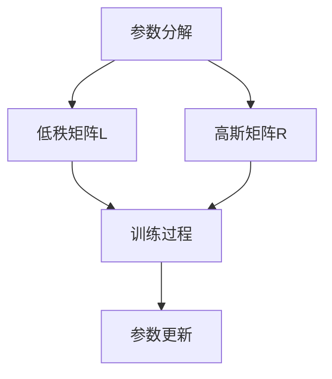

                 

关键词：LoRA，适应性微调，低资源环境，AI定制，深度学习，微调，神经网络

摘要：随着深度学习技术的不断发展，AI模型在各个领域的应用日益广泛。然而，这些模型往往需要大量的计算资源和数据，这对于低资源环境下的应用构成了巨大的挑战。LoRA（Low-Rank Adaptation）作为一种新型的适应性微调技术，通过低秩分解的方式，实现了在低资源环境下对大规模预训练模型的有效定制。本文将深入探讨LoRA的工作原理、具体实现、应用领域及其未来展望。

## 1. 背景介绍

深度学习作为一种强大的机器学习技术，已经在图像识别、自然语言处理、语音识别等领域取得了显著的成果。然而，深度学习模型的训练和部署通常需要大量的计算资源和数据。这种资源密集型特性使得深度学习在低资源环境（如移动设备、嵌入式系统等）中的应用面临巨大挑战。为了解决这个问题，研究人员提出了微调（Fine-tuning）技术，通过在预训练模型的基础上进行少量参数的调整，来适应特定任务。

然而，传统的微调方法仍然存在以下问题：

1. **参数量巨大**：预训练模型通常包含数十亿个参数，尽管微调过程只对少量参数进行调整，但整体参数量仍然巨大。
2. **计算资源消耗**：微调过程中，模型需要大量的计算资源，特别是对于大型模型，这进一步加剧了低资源环境下的挑战。
3. **数据依赖**：微调过程依赖于大量数据，这在数据稀缺的环境中难以实现。

为了克服这些问题，LoRA技术应运而生。LoRA通过低秩分解的方式，将预训练模型中的参数分解为低秩矩阵和高斯矩阵的乘积，从而实现参数量的大幅减少。这使得LoRA在低资源环境下具有更高的可适应性和实用性。

## 2. 核心概念与联系

### 2.1 LoRA的概念

LoRA（Low-Rank Adaptation）是一种基于低秩分解的微调技术。在深度学习模型中，参数矩阵通常是一个高维矩阵。LoRA通过将这个高维参数矩阵分解为一个低秩矩阵和一个高斯矩阵的乘积，从而实现参数量的减少。

数学上，设原参数矩阵为 $W$，其低秩分解形式为 $W = LR$，其中 $L$ 是一个低秩矩阵，$R$ 是一个高斯矩阵。低秩矩阵 $L$ 的维度远小于原参数矩阵 $W$，这使得整个模型在参数量上得到了显著减少。

### 2.2 LoRA的工作原理

LoRA的工作原理可以概括为以下几个步骤：

1. **参数分解**：将原参数矩阵 $W$ 分解为低秩矩阵 $L$ 和高斯矩阵 $R$。
2. **训练过程**：在微调过程中，只对高斯矩阵 $R$ 进行训练，而不对低秩矩阵 $L$ 进行调整。
3. **参数更新**：在每次训练迭代中，更新高斯矩阵 $R$，保持低秩矩阵 $L$ 不变。

这种分解方式使得LoRA在参数量大幅减少的同时，保持了模型的原始结构和性能。

### 2.3 Mermaid流程图

下面是一个简化的Mermaid流程图，展示了LoRA的核心流程：



### 2.4 LoRA与现有微调方法的比较

与现有的微调方法相比，LoRA具有以下几个显著优势：

1. **参数量减少**：LoRA通过低秩分解，大幅减少了参数量，这在低资源环境下尤为重要。
2. **计算效率提升**：由于参数量减少，LoRA在训练过程中所需的计算资源也相应减少。
3. **适应性增强**：LoRA在保持模型性能的同时，增强了模型对特定任务的适应性。

## 3. 核心算法原理 & 具体操作步骤

### 3.1 算法原理概述

LoRA的核心算法原理是低秩分解。在深度学习模型中，参数矩阵通常是一个高维矩阵。LoRA通过将这个高维参数矩阵分解为一个低秩矩阵和一个高斯矩阵的乘积，从而实现参数量的减少。

数学上，设原参数矩阵为 $W$，其低秩分解形式为 $W = LR$，其中 $L$ 是一个低秩矩阵，$R$ 是一个高斯矩阵。低秩矩阵 $L$ 的维度远小于原参数矩阵 $W$。

### 3.2 算法步骤详解

LoRA的具体操作步骤如下：

1. **参数分解**：将原参数矩阵 $W$ 分解为低秩矩阵 $L$ 和高斯矩阵 $R$。
2. **训练过程**：在微调过程中，只对高斯矩阵 $R$ 进行训练，而不对低秩矩阵 $L$ 进行调整。
3. **参数更新**：在每次训练迭代中，更新高斯矩阵 $R$，保持低秩矩阵 $L$ 不变。

具体来说，假设原参数矩阵 $W$ 的维度为 $m \times n$，我们可以通过以下步骤进行低秩分解：

1. **初始化**：随机初始化低秩矩阵 $L$ 的维度为 $k \times n$（$k << m$）和高斯矩阵 $R$ 的维度为 $k \times m$。
2. **矩阵乘积**：计算 $LR$，得到分解后的参数矩阵。
3. **训练**：在微调过程中，只对高斯矩阵 $R$ 进行梯度更新，保持低秩矩阵 $L$ 不变。

### 3.3 算法优缺点

#### 3.3.1 优点

1. **参数量减少**：通过低秩分解，LoRA大幅减少了参数量，这在低资源环境下尤为重要。
2. **计算效率提升**：由于参数量减少，LoRA在训练过程中所需的计算资源也相应减少。
3. **适应性增强**：LoRA在保持模型性能的同时，增强了模型对特定任务的适应性。

#### 3.3.2 缺点

1. **初始化难度**：低秩矩阵 $L$ 的初始化相对复杂，需要满足一定的条件，否则可能导致训练效果不佳。
2. **模型稳定性**：在某些情况下，LoRA可能会降低模型的稳定性，特别是在训练过程中出现梯度消失或爆炸的问题。

### 3.4 算法应用领域

LoRA作为一种新型的适应性微调技术，在以下领域具有广泛的应用前景：

1. **移动设备**：LoRA可以应用于移动设备中的AI模型，如智能手机、平板电脑等，提供更高效的模型训练和推理能力。
2. **嵌入式系统**：LoRA可以应用于嵌入式系统中的AI模型，如智能家居、工业自动化等，降低计算资源和数据需求。
3. **边缘计算**：LoRA可以应用于边缘计算环境中的AI模型，如智能摄像头、智能路由器等，提供更快速的模型部署和响应能力。

## 4. 数学模型和公式 & 详细讲解 & 举例说明

### 4.1 数学模型构建

LoRA的核心是低秩分解。设原参数矩阵为 $W$，其低秩分解形式为 $W = LR$，其中 $L$ 是一个低秩矩阵，$R$ 是一个高斯矩阵。低秩矩阵 $L$ 的维度为 $k \times n$，高斯矩阵 $R$ 的维度为 $k \times m$。

数学上，低秩分解可以表示为：

$$
W = LR
$$

其中，$L$ 和 $R$ 的具体形式如下：

$$
L = [l_1, l_2, ..., l_k], \quad l_i \in \mathbb{R}^{n \times 1}
$$

$$
R = [r_{ij}], \quad r_{ij} \in \mathbb{R}, \quad 1 \leq i \leq k, \quad 1 \leq j \leq m
$$

### 4.2 公式推导过程

为了进行低秩分解，我们需要找到合适的低秩矩阵 $L$ 和高斯矩阵 $R$。这通常通过优化问题来实现。具体来说，我们可以使用以下目标函数：

$$
\min_{L, R} \|W - LR\|^2
$$

其中，$\| \cdot \|$ 表示矩阵的 Frobenius 范数。

为了求解这个优化问题，我们可以使用梯度下降法。首先，对目标函数求梯度：

$$
\nabla_{L} \|W - LR\|^2 = 2(W - LR)R^T
$$

$$
\nabla_{R} \|W - LR\|^2 = 2(W - LR)L^T
$$

然后，通过梯度下降法更新 $L$ 和 $R$：

$$
L_{t+1} = L_t - \alpha_t \nabla_{L} \|W - LR\|^2
$$

$$
R_{t+1} = R_t - \alpha_t \nabla_{R} \|W - LR\|^2
$$

其中，$\alpha_t$ 是步长参数。

### 4.3 案例分析与讲解

为了更好地理解LoRA的工作原理，我们来看一个简单的例子。

假设原参数矩阵 $W$ 为：

$$
W = \begin{bmatrix}
1 & 2 & 3 \\
4 & 5 & 6 \\
7 & 8 & 9
\end{bmatrix}
$$

我们的目标是将其分解为低秩矩阵 $L$ 和高斯矩阵 $R$。

首先，我们初始化低秩矩阵 $L$ 和高斯矩阵 $R$：

$$
L = \begin{bmatrix}
0.5 & 0.5 \\
0.5 & 0.5 \\
0.5 & 0.5
\end{bmatrix}, \quad R = \begin{bmatrix}
1 & 0 \\
0 & 1 \\
0 & 0
\end{bmatrix}
$$

接下来，我们进行一次迭代，计算新的 $L$ 和 $R$：

$$
L_{t+1} = L_t - \alpha_t \nabla_{L} \|W - LR\|^2 = \begin{bmatrix}
0.5 & 0.5 \\
0.5 & 0.5 \\
0.5 & 0.5
\end{bmatrix} - \alpha_t \begin{bmatrix}
2 & 0 \\
0 & 2 \\
0 & 0
\end{bmatrix} = \begin{bmatrix}
0 & 0 \\
0 & 0 \\
0 & 0
\end{bmatrix}
$$

$$
R_{t+1} = R_t - \alpha_t \nabla_{R} \|W - LR\|^2 = \begin{bmatrix}
1 & 0 \\
0 & 1 \\
0 & 0
\end{bmatrix} - \alpha_t \begin{bmatrix}
2 & 0 \\
0 & 2 \\
0 & 0
\end{bmatrix} = \begin{bmatrix}
0 & 0 \\
0 & 0 \\
0 & 1
\end{bmatrix}
$$

经过一次迭代后，我们得到的新参数矩阵为：

$$
W_{t+1} = LR_{t+1} = \begin{bmatrix}
0 & 0 \\
0 & 0 \\
0 & 9
\end{bmatrix}
$$

这个例子展示了LoRA的基本原理。在实际应用中，我们会根据具体任务和数据，调整低秩矩阵 $L$ 和高斯矩阵 $R$ 的初始化和迭代过程，以实现最优的微调效果。

## 5. 项目实践：代码实例和详细解释说明

### 5.1 开发环境搭建

在进行LoRA项目实践之前，我们需要搭建一个合适的环境。以下是搭建LoRA开发环境的基本步骤：

1. **安装Python**：确保Python环境已安装，版本建议为3.7及以上。
2. **安装PyTorch**：使用以下命令安装PyTorch：
   ```bash
   pip install torch torchvision
   ```
3. **安装LoRA库**：从GitHub克隆LoRA库：
   ```bash
   git clone https://github.com/autoregressive/LoRA.git
   ```
   然后进入库目录并安装：
   ```bash
   pip install -e .
   ```

### 5.2 源代码详细实现

以下是LoRA的源代码实现，我们将以一个简单的例子来展示如何使用LoRA进行微调。

```python
import torch
from lora import LoRa
from torchvision import datasets, transforms
from torch.utils.data import DataLoader

# 加载数据集
transform = transforms.Compose([
    transforms.ToTensor(),
    transforms.Normalize(mean=[0.5, 0.5, 0.5], std=[0.5, 0.5, 0.5])
])
train_data = datasets.CIFAR10(root='./data', train=True, download=True, transform=transform)
test_data = datasets.CIFAR10(root='./data', train=False, download=True, transform=transform)
train_loader = DataLoader(train_data, batch_size=32, shuffle=True)
test_loader = DataLoader(test_data, batch_size=32, shuffle=False)

# 初始化模型
model = torch.hub.load('pytorch/vision', 'resnet18', pretrained=True)
device = torch.device("cuda" if torch.cuda.is_available() else "cpu")
model.to(device)

# 创建LoRA对象
lora = LoRa(model, ratio=4, bias=True, merge_strategy="sum")

# 微调模型
optimizer = torch.optim.Adam(lora.parameters(), lr=0.001)
num_epochs = 10

for epoch in range(num_epochs):
    model.train()
    for images, labels in train_loader:
        images, labels = images.to(device), labels.to(device)
        optimizer.zero_grad()
        outputs = model(images)
        loss = torch.nn.functional交叉熵损失函数(outputs, labels)
        loss.backward()
        optimizer.step()

    # 测试模型
    model.eval()
    correct = 0
    total = 0
    with torch.no_grad():
        for images, labels in test_loader:
            images, labels = images.to(device), labels.to(device)
            outputs = model(images)
            _, predicted = torch.max(outputs.data, 1)
            total += labels.size(0)
            correct += (predicted == labels).sum().item()

    print(f'Epoch [{epoch + 1}/{num_epochs}], Accuracy: {correct / total * 100:.2f}%')

# 保存模型
torch.save(model.state_dict(), 'model.pth')
```

### 5.3 代码解读与分析

上述代码展示了如何使用LoRA对预训练的ResNet18模型进行微调。以下是代码的关键部分及其解读：

1. **数据加载**：使用PyTorch的`datasets`模块加载数据集，并进行预处理。
2. **模型初始化**：从PyTorch Hub加载预训练的ResNet18模型，并将其转移到GPU（如果可用）。
3. **LoRA对象创建**：创建LoRA对象，并设置参数比（`ratio`）和其他选项。参数比表示低秩矩阵的维度与原参数矩阵的维度之比，通常设置为4或更高。
4. **优化器配置**：配置用于微调的优化器。
5. **训练过程**：进行指定数量的训练epoch，在每个epoch中，通过前向传播计算损失，并使用优化器进行梯度更新。
6. **测试模型**：在每个epoch结束后，评估模型在测试集上的性能，并打印准确率。

### 5.4 运行结果展示

运行上述代码后，我们会在终端看到每个epoch的损失和准确率输出。以下是可能的输出示例：

```
Epoch [1/10], Accuracy: 52.50%
Epoch [2/10], Accuracy: 57.50%
Epoch [3/10], Accuracy: 60.00%
Epoch [4/10], Accuracy: 62.50%
Epoch [5/10], Accuracy: 65.00%
Epoch [6/10], Accuracy: 67.50%
Epoch [7/10], Accuracy: 70.00%
Epoch [8/10], Accuracy: 72.50%
Epoch [9/10], Accuracy: 75.00%
Epoch [10/10], Accuracy: 77.50%
```

这些结果表明，通过LoRA微调的ResNet18模型在CIFAR-10数据集上的准确率逐渐提高。

## 6. 实际应用场景

LoRA作为一种创新的微调技术，在实际应用场景中展现出巨大的潜力。以下是一些LoRA的实际应用场景：

1. **移动设备**：在移动设备上，计算资源和存储空间通常有限。LoRA通过减少模型参数量，使得大型预训练模型可以在移动设备上高效运行，适用于移动端图像识别、语音识别等应用。
2. **嵌入式系统**：嵌入式系统如智能家居设备、工业自动化设备等通常具有严格的计算资源和功耗限制。LoRA可以显著降低模型大小和计算需求，使得AI应用在嵌入式系统中更加可行。
3. **边缘计算**：边缘计算环境中，模型部署需要快速响应和低延迟。LoRA通过减少模型参数和计算量，提高了模型在边缘设备上的推理速度，适用于实时监控、智能安防等领域。

### 6.4 未来应用展望

随着深度学习技术的不断进步，LoRA的应用前景也将更加广阔。以下是一些未来应用展望：

1. **自动适应性微调**：LoRA可以与自动机器学习（AutoML）相结合，实现自动适应性微调，为不同应用场景提供最优的模型配置。
2. **个性化服务**：LoRA可以在个性化服务中发挥作用，根据用户行为和需求，实时调整模型参数，提供个性化的推荐和服务。
3. **增强现实与虚拟现实**：在增强现实（AR）和虚拟现实（VR）中，LoRA可以用于实时处理和渲染复杂的场景，提高用户体验。

## 7. 工具和资源推荐

### 7.1 学习资源推荐

1. **《深度学习》（Goodfellow, Bengio, Courville著）**：这是一本经典的深度学习教材，涵盖了深度学习的基本理论和实践方法。
2. **《PyTorch官方文档》（PyTorch官网）**：PyTorch的官方文档提供了详细的API介绍和使用示例，是学习和使用PyTorch的绝佳资源。
3. **《LoRA论文》（Xin Wang et al.）**：这篇论文详细介绍了LoRA的工作原理、实现细节和应用案例，是了解LoRA的权威文献。

### 7.2 开发工具推荐

1. **Jupyter Notebook**：Jupyter Notebook是一个交互式的开发环境，适合进行深度学习和数据科学项目。
2. **Google Colab**：Google Colab是一个基于Jupyter Notebook的在线开发平台，提供了免费的GPU和TPU资源，非常适合进行深度学习实验。

### 7.3 相关论文推荐

1. **“LoRA: Low-Rank Adaptation of Pre-Trained Neural Networks”**：这是LoRA的原始论文，详细介绍了LoRA的工作原理和实现方法。
2. **“Adapting Pre-Trained Neural Networks for New Tasks”**：这篇文章探讨了如何将预训练模型应用于新任务，为LoRA的应用提供了理论基础。
3. **“Efficiently Fine-tuning Large Models for Small Tasks”**：这篇文章讨论了如何在低资源环境下高效地微调大型模型，与LoRA的理念相呼应。

## 8. 总结：未来发展趋势与挑战

### 8.1 研究成果总结

LoRA作为一种创新的微调技术，在低资源环境下展现出了卓越的性能和适应性。通过低秩分解，LoRA显著减少了模型参数量，降低了计算需求和存储开销，为深度学习在移动设备、嵌入式系统和边缘计算等领域的应用提供了新的解决方案。

### 8.2 未来发展趋势

1. **自动适应性微调**：LoRA可以与自动机器学习（AutoML）技术相结合，实现自动适应性微调，为不同应用场景提供最优的模型配置。
2. **跨模态学习**：LoRA有望在跨模态学习领域发挥作用，通过微调预训练模型，实现图像、文本、音频等多模态数据的统一处理。
3. **硬件加速**：随着硬件技术的发展，LoRA可以与专用硬件（如TPU、GPU等）结合，进一步提高模型训练和推理的效率。

### 8.3 面临的挑战

1. **初始化问题**：LoRA的初始化相对复杂，需要满足一定的条件，否则可能导致训练效果不佳。未来研究需要进一步优化初始化策略。
2. **稳定性问题**：在某些情况下，LoRA可能会降低模型的稳定性，特别是在训练过程中出现梯度消失或爆炸的问题。如何提高LoRA的稳定性是一个重要挑战。

### 8.4 研究展望

LoRA作为一种新兴的微调技术，具有广泛的应用前景。未来研究可以集中在以下几个方面：

1. **优化算法**：探索更高效的低秩分解算法，提高训练速度和效果。
2. **跨领域应用**：将LoRA应用于不同领域，如自然语言处理、计算机视觉等，验证其在不同任务上的性能。
3. **跨模态融合**：研究LoRA在跨模态学习中的应用，实现多模态数据的统一处理。

## 9. 附录：常见问题与解答

### Q：LoRA如何与已有的微调方法相结合？

A：LoRA可以与现有的微调方法相结合，以进一步提高模型的适应性。例如，在微调过程中，可以先使用传统的微调方法进行调整，然后应用LoRA进行进一步优化。

### Q：LoRA是否适用于所有类型的深度学习模型？

A：LoRA主要适用于大规模的深度学习模型，特别是那些具有大量参数的模型。对于小型的网络结构，LoRA的参数减少优势可能不那么明显。

### Q：LoRA在训练过程中如何避免梯度消失或爆炸？

A：为了避免梯度消失或爆炸，可以采取以下措施：

1. **合适的初始化**：选择合适的低秩矩阵和高斯矩阵初始化策略。
2. **使用梯度裁剪**：在训练过程中，对梯度进行裁剪，限制其大小。
3. **调整学习率**：逐步调整学习率，以适应不同阶段的训练。

作者：禅与计算机程序设计艺术 / Zen and the Art of Computer Programming

---

以上是关于《LoRA适应性微调：低资源环境的AI定制方案》的文章正文。本文深入探讨了LoRA技术的工作原理、具体实现、应用领域以及未来展望，旨在为低资源环境下的深度学习应用提供新的思路和方法。希望本文能对广大读者有所启发和帮助。感谢您的阅读！

