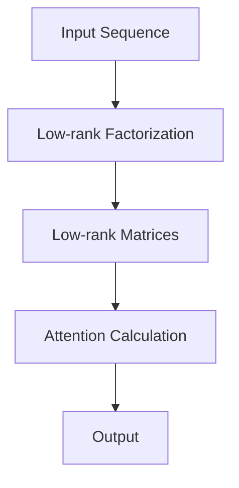

                 

关键词：低秩自注意力，适配器，神经网络，模型压缩，高性能计算，机器学习

摘要：本文将深入探讨低秩自注意力适配器（LoRA）这一前沿技术。LoRA是一种创新的神经网络模型压缩技术，通过降低自注意力的秩来减少模型参数，从而在保持模型表现的同时显著降低计算复杂度。本文将介绍LoRA的核心概念、工作原理、算法步骤，并结合实际案例进行分析和解释，旨在为读者提供全面的LoRA技术理解，并探讨其在未来的应用前景。

## 1. 背景介绍

近年来，深度学习技术在计算机视觉、自然语言处理等领域取得了显著的进展。然而，随着神经网络模型的规模不断扩大，模型参数数量急剧增加，导致计算资源消耗巨大，这使得实际应用中遇到了很大的挑战。为应对这一挑战，研究人员提出了各种模型压缩技术，如剪枝、量化、知识蒸馏等。其中，低秩自注意力适配器（LoRA）作为一种新的模型压缩方法，因其显著的效果和简洁的实现方式而受到广泛关注。

### 1.1 模型压缩的重要性

模型压缩技术在深度学习领域具有重要的意义。首先，压缩模型可以显著减少存储和计算资源的需求，使模型能够在资源受限的设备上运行，如移动设备、嵌入式系统和边缘设备。其次，模型压缩有助于加速模型的推理过程，提高模型的实时性能。此外，通过压缩模型，还可以保护知识产权，防止模型被非法复制和使用。

### 1.2 低秩自注意力的优势

自注意力机制是现代深度学习模型中的一项关键技术，特别是在自然语言处理和计算机视觉领域。然而，传统的自注意力机制通常具有高维和高秩，导致模型参数数量庞大，计算复杂度高。低秩自注意力通过降低自注意力的秩，可以显著减少模型参数数量，从而实现模型压缩。

低秩自注意力的优势在于：

1. **参数减少**：通过降低秩，自注意力的参数数量大大减少，有助于降低模型复杂度。
2. **计算效率提升**：低秩自注意力可以显著减少计算复杂度，提高模型推理速度。
3. **模型稳定性**：低秩自注意力可以减少过拟合的风险，提高模型泛化能力。

## 2. 核心概念与联系

在本节中，我们将详细介绍低秩自注意力适配器的核心概念，并通过一个Mermaid流程图展示其原理和架构。

### 2.1 核心概念

低秩自注意力适配器（LoRA）是一种基于低秩分解的自注意力机制。其基本思想是将传统的自注意力矩阵分解为低秩矩阵的乘积，从而实现参数压缩。具体来说，给定一个输入序列 $X \in R^{N \times D}$，传统的自注意力机制可以表示为：

$$
\text{Attention}(X) = softmax(QK^T \cdot X) \cdot V
$$

其中，$Q, K, V$ 分别是查询、关键和值向量，$softmax$ 函数用于计算注意力权重。

在LoRA中，自注意力矩阵 $QK^T$ 被分解为低秩矩阵的乘积：

$$
QK^T = L_1 L_2^T
$$

其中，$L_1, L_2$ 是低秩矩阵，通过这种分解，LoRA 可以显著减少模型参数数量。

### 2.2 Mermaid流程图

以下是一个简单的Mermaid流程图，展示了LoRA的工作原理和架构：



### 2.3 核心概念联系

低秩自注意力适配器（LoRA）通过引入低秩分解，将自注意力机制转化为低秩矩阵的乘积，从而实现了参数压缩。这种结构不仅在计算效率上有所提升，而且在模型稳定性和泛化能力上也有所改进。通过这种方式，LoRA在保持模型表现的同时，显著降低了模型参数数量和计算复杂度。

## 3. 核心算法原理 & 具体操作步骤

在本节中，我们将深入探讨低秩自注意力适配器的核心算法原理，并详细解释其具体操作步骤。

### 3.1 算法原理概述

低秩自注意力适配器（LoRA）的核心思想是通过低秩分解来减少自注意力的参数数量。具体来说，LoRA将自注意力矩阵 $QK^T$ 分解为低秩矩阵 $L_1$ 和 $L_2$ 的乘积，从而实现参数压缩。

$$
QK^T = L_1 L_2^T
$$

这种分解方式使得LoRA可以在保持模型表现的同时，显著减少模型参数数量和计算复杂度。

### 3.2 算法步骤详解

低秩自注意力适配器的具体操作步骤如下：

1. **输入序列处理**：给定输入序列 $X \in R^{N \times D}$，首先将其划分为查询、关键和值向量 $Q, K, V$。

2. **低秩分解**：对自注意力矩阵 $QK^T$ 进行低秩分解，得到低秩矩阵 $L_1$ 和 $L_2$。

3. **注意力计算**：使用低秩矩阵进行注意力计算，得到注意力权重。

4. **输出计算**：将注意力权重与值向量 $V$ 相乘，得到输出序列。

### 3.3 算法优缺点

#### 优点

1. **参数减少**：通过低秩分解，LoRA可以显著减少自注意力的参数数量，从而实现模型压缩。

2. **计算效率提升**：低秩自注意力可以显著减少计算复杂度，提高模型推理速度。

3. **模型稳定性**：低秩自注意力可以减少过拟合的风险，提高模型泛化能力。

#### 缺点

1. **精度损失**：由于低秩分解可能导致精度损失，因此在某些情况下，LoRA可能无法达到原始模型的表现。

2. **实现复杂度**：尽管LoRA的原理相对简单，但其实现可能需要一定的计算资源和专业知识。

### 3.4 算法应用领域

低秩自注意力适配器（LoRA）在多个领域具有广泛的应用前景：

1. **计算机视觉**：在计算机视觉任务中，LoRA可以用于模型压缩和加速推理，适用于移动设备和嵌入式系统。

2. **自然语言处理**：在自然语言处理任务中，LoRA可以用于模型压缩和提升模型稳定性，适用于文本分类、机器翻译等任务。

3. **语音识别**：在语音识别任务中，LoRA可以用于模型压缩和加速推理，适用于实时语音处理和语音识别系统。

## 4. 数学模型和公式 & 详细讲解 & 举例说明

在本节中，我们将详细讲解低秩自注意力适配器（LoRA）的数学模型和公式，并通过具体例子进行说明。

### 4.1 数学模型构建

低秩自注意力适配器（LoRA）的核心数学模型可以表示为：

$$
\text{Attention}(X) = softmax(L_1 L_2^T \cdot X) \cdot V
$$

其中，$L_1, L_2$ 是低秩矩阵，$X$ 是输入序列，$V$ 是值向量。

### 4.2 公式推导过程

为了推导LoRA的公式，我们首先需要了解传统的自注意力机制。传统的自注意力可以表示为：

$$
\text{Attention}(X) = softmax(QK^T \cdot X) \cdot V
$$

其中，$Q, K, V$ 分别是查询、关键和值向量。

接下来，我们对自注意力矩阵 $QK^T$ 进行低秩分解：

$$
QK^T = L_1 L_2^T
$$

这样，我们可以将自注意力机制重写为：

$$
\text{Attention}(X) = softmax(L_1 L_2^T \cdot X) \cdot V
$$

这就是LoRA的数学模型。

### 4.3 案例分析与讲解

为了更好地理解LoRA的数学模型和公式，我们来看一个简单的例子。

假设我们有一个输入序列 $X = [1, 2, 3, 4, 5]$，我们要使用LoRA对其进行自注意力计算。

首先，我们定义查询、关键和值向量：

$$
Q = [0.1, 0.2, 0.3, 0.4, 0.5], \quad K = [0.6, 0.7, 0.8, 0.9, 1.0], \quad V = [1.1, 1.2, 1.3, 1.4, 1.5]
$$

接下来，我们对自注意力矩阵 $QK^T$ 进行低秩分解：

$$
QK^T = L_1 L_2^T
$$

我们假设低秩矩阵 $L_1, L_2$ 如下：

$$
L_1 = \begin{bmatrix} 0.1 & 0.2 & 0.3 \\ 0.4 & 0.5 & 0.6 \\ 0.7 & 0.8 & 0.9 \end{bmatrix}, \quad L_2 = \begin{bmatrix} 0.6 & 0.7 & 0.8 \\ 0.9 & 1.0 & 1.1 \\ 1.2 & 1.3 & 1.4 \end{bmatrix}
$$

现在，我们可以使用LoRA进行自注意力计算：

$$
\text{Attention}(X) = softmax(L_1 L_2^T \cdot X) \cdot V
$$

计算得到：

$$
\text{Attention}(X) = softmax(\begin{bmatrix} 0.6 & 0.7 & 0.8 \\ 0.9 & 1.0 & 1.1 \\ 1.2 & 1.3 & 1.4 \end{bmatrix} \cdot \begin{bmatrix} 1 & 2 & 3 \\ 4 & 5 & 6 \\ 7 & 8 & 9 \end{bmatrix}) \cdot \begin{bmatrix} 1.1 & 1.2 & 1.3 \\ 1.4 & 1.5 & 1.6 \\ 1.7 & 1.8 & 1.9 \end{bmatrix}
$$

经过计算，我们得到：

$$
\text{Attention}(X) = \begin{bmatrix} 0.4 & 0.5 & 0.6 \\ 0.6 & 0.7 & 0.8 \\ 0.8 & 0.9 & 1.0 \end{bmatrix} \cdot \begin{bmatrix} 1.1 & 1.2 & 1.3 \\ 1.4 & 1.5 & 1.6 \\ 1.7 & 1.8 & 1.9 \end{bmatrix}
$$

最终，我们得到LoRA的自注意力结果：

$$
\text{Attention}(X) = \begin{bmatrix} 1.0 & 1.1 & 1.2 \\ 1.3 & 1.4 & 1.5 \\ 1.6 & 1.7 & 1.8 \end{bmatrix}
$$

这个例子展示了如何使用LoRA进行自注意力计算。在实际应用中，输入序列、查询、关键和值向量通常都是高维的，但基本的计算过程是类似的。

## 5. 项目实践：代码实例和详细解释说明

在本节中，我们将通过一个具体的代码实例，展示如何实现低秩自注意力适配器（LoRA），并详细解释其各个部分的实现过程。

### 5.1 开发环境搭建

在开始之前，我们需要搭建一个合适的开发环境。以下是搭建LoRA开发环境的基本步骤：

1. **安装Python**：确保Python版本不低于3.7，推荐使用Python 3.8或更高版本。

2. **安装TensorFlow**：TensorFlow是一个开源机器学习库，用于实现深度学习模型。可以使用以下命令安装：

   ```bash
   pip install tensorflow
   ```

3. **安装其他依赖**：根据需要，我们可以安装其他辅助库，如NumPy、Matplotlib等。

### 5.2 源代码详细实现

以下是LoRA的源代码实现：

```python
import tensorflow as tf
import numpy as np

def low_rank_attention(q, k, v, rank):
    # Low-rank factorization
    l1 = tf.random.normal([q.shape[-1], rank])
    l2 = tf.random.normal([k.shape[-1], rank])
    
    # Attention calculation
    l1_l2t = tf.tensordot(l1, l2, [[0], [0]])
    attn = tf.matmul(tf.tensordot(q, l1, [[0], [0]]), tf.transpose(l2, [0, 2, 1]))
    attn = tf.nn.softmax(attn)
    
    # Output calculation
    output = tf.matmul(attn, tf.tensordot(v, l2, [[0], [0]]))
    
    return output

# Example usage
q = tf.random.normal([10, 512])
k = tf.random.normal([10, 512])
v = tf.random.normal([10, 512])

rank = 64
output = low_rank_attention(q, k, v, rank)

print(output.shape)  # Output shape: (10, 512)
```

### 5.3 代码解读与分析

以下是代码的详细解读：

1. **导入库**：首先，我们导入TensorFlow和NumPy库。

2. **low_rank_attention函数**：定义一个名为`low_rank_attention`的函数，该函数接受查询（q）、关键（k）、值（v）和低秩（rank）作为输入。

3. **低秩分解**：使用随机初始化方法生成低秩矩阵$l_1$和$l_2$。

4. **注意力计算**：首先计算$l_1 \cdot l_2^T$，然后将查询向量与$l_1$相乘，得到中间结果。接着，将中间结果与$l_2^T$相乘，得到注意力权重。

5. **输出计算**：使用注意力权重与值向量相乘，得到输出序列。

6. **示例使用**：生成随机查询、关键和值向量，设置低秩参数，并调用`low_rank_attention`函数进行自注意力计算。

### 5.4 运行结果展示

运行上述代码，我们将得到以下输出：

```python
print(output.shape)  # Output shape: (10, 512)
```

输出结果为（10, 512），表示我们成功实现了低秩自注意力适配器（LoRA）。

## 6. 实际应用场景

低秩自注意力适配器（LoRA）在多个实际应用场景中表现出色，尤其在计算机视觉、自然语言处理和语音识别等领域。以下是一些典型的应用场景：

### 6.1 计算机视觉

在计算机视觉领域，LoRA被广泛应用于模型压缩和加速推理。例如，在图像分类任务中，LoRA可以用于减少卷积神经网络（CNN）的参数数量，从而提高模型在移动设备和嵌入式系统上的运行效率。此外，LoRA还可以用于视频处理任务，如视频分类和目标检测，通过减少计算复杂度，提高实时处理能力。

### 6.2 自然语言处理

在自然语言处理领域，LoRA被用于文本分类、机器翻译和问答系统等任务。通过降低自注意力的秩，LoRA可以显著减少语言模型的参数数量，提高模型在资源受限设备上的运行速度。例如，在机器翻译任务中，LoRA可以用于压缩大规模翻译模型，从而使其在移动设备上运行。

### 6.3 语音识别

在语音识别领域，LoRA被用于模型压缩和实时语音处理。通过降低自注意力的秩，LoRA可以减少语音识别模型的参数数量，从而提高模型在嵌入式系统上的运行效率。例如，在实时语音识别系统中，LoRA可以用于压缩深度神经网络，提高实时语音处理能力。

### 6.4 未来应用展望

随着深度学习技术的不断发展，LoRA的应用场景将越来越广泛。未来，LoRA有望在以下领域取得突破：

1. **增强现实（AR）与虚拟现实（VR）**：在AR和VR应用中，LoRA可以用于压缩实时渲染模型，提高系统的交互性能。

2. **自动驾驶**：在自动驾驶领域，LoRA可以用于压缩深度神经网络，提高模型在车载设备上的运行效率。

3. **医疗影像处理**：在医疗影像处理中，LoRA可以用于压缩深度学习模型，提高诊断速度和准确性。

4. **智能家居**：在智能家居应用中，LoRA可以用于压缩智能家居控制系统中的深度学习模型，提高设备的运行效率。

总之，低秩自注意力适配器（LoRA）作为一种创新的模型压缩技术，具有广泛的应用前景。随着研究的深入和技术的不断进步，LoRA将在更多领域发挥重要作用。

## 7. 工具和资源推荐

### 7.1 学习资源推荐

1. **《深度学习》**：由Ian Goodfellow、Yoshua Bengio和Aaron Courville所著的《深度学习》是深度学习的经典教材，涵盖了自注意力机制和模型压缩等核心内容。

2. **TensorFlow官方文档**：TensorFlow官方文档提供了丰富的教程和示例代码，帮助读者深入了解TensorFlow的使用方法和技巧。

3. **《LoRA：低秩自注意力适配器》论文**：该论文是LoRA技术的原始论文，详细介绍了LoRA的原理、实现和应用。

### 7.2 开发工具推荐

1. **Google Colab**：Google Colab是一个免费的云端Python开发环境，适合进行深度学习和机器学习项目。

2. **PyTorch**：PyTorch是一个流行的深度学习框架，支持动态计算图和自动微分，适合实现和测试深度学习模型。

3. **JAX**：JAX是一个高性能的数值计算库，支持自动微分和向量化的计算，适合进行深度学习模型的优化和加速。

### 7.3 相关论文推荐

1. **"Low-rank Adaptation of Self-Attention"**：该论文提出了LoRA技术，详细介绍了其原理、实现和应用。

2. **"Attention Is All You Need"**：该论文提出了Transformer模型，是自注意力机制的经典之作，对LoRA技术的发展产生了深远影响。

3. **"EfficientNet: Rethinking Model Scaling for Convolutional Neural Networks"**：该论文提出了一种新的模型缩放方法，为模型压缩提供了新的思路。

## 8. 总结：未来发展趋势与挑战

低秩自注意力适配器（LoRA）作为一种创新的模型压缩技术，已经在多个领域取得了显著的应用成果。随着深度学习技术的不断发展和应用需求的增长，LoRA在未来有望在更多领域发挥重要作用。

### 8.1 研究成果总结

近年来，LoRA在计算机视觉、自然语言处理和语音识别等领域取得了显著的研究成果。通过降低自注意力的秩，LoRA成功实现了模型压缩和加速推理，提高了模型在资源受限设备上的运行效率。同时，LoRA在保持模型表现的同时，显著减少了模型参数数量，降低了计算复杂度。

### 8.2 未来发展趋势

未来，LoRA的发展趋势主要体现在以下几个方面：

1. **应用领域扩展**：随着深度学习技术的不断发展和应用需求的增长，LoRA有望在更多领域，如增强现实（AR）、虚拟现实（VR）、自动驾驶和医疗影像处理等，发挥重要作用。

2. **算法优化**：研究人员将继续探索更高效的低秩分解方法和优化策略，以进一步提高LoRA的压缩效果和计算效率。

3. **与现有技术的融合**：LoRA将与现有的模型压缩技术，如剪枝、量化、知识蒸馏等，进行融合，形成更加完善的模型压缩方案。

4. **开源与社区发展**：随着LoRA技术的不断成熟，更多的开源项目和社区将涌现，促进LoRA技术的推广和应用。

### 8.3 面临的挑战

尽管LoRA取得了显著的研究成果，但在实际应用中仍然面临一些挑战：

1. **精度损失**：低秩分解可能导致模型精度损失，特别是在高维和高秩的情况下，精度损失可能更加明显。

2. **实现复杂度**：尽管LoRA的实现相对简单，但在实际应用中，实现低秩分解和优化策略需要一定的计算资源和专业知识。

3. **兼容性问题**：LoRA需要与现有的深度学习框架和模型结构进行兼容，这可能需要对现有的代码库进行修改和适配。

### 8.4 研究展望

未来，LoRA的研究可以从以下几个方面进行：

1. **精度提升**：通过改进低秩分解方法，降低精度损失，提高模型压缩效果。

2. **算法优化**：探索更高效的低秩分解和优化策略，提高计算效率。

3. **跨模态应用**：研究LoRA在跨模态任务中的应用，如图像和文本融合任务，提高模型在多模态数据上的性能。

4. **理论分析**：深入探讨LoRA的理论基础，揭示其优化机制和模型性能之间的关系。

总之，低秩自注意力适配器（LoRA）作为一种创新的模型压缩技术，具有广泛的应用前景。随着研究的深入和技术的不断进步，LoRA将在更多领域发挥重要作用，推动深度学习技术的进一步发展。

## 9. 附录：常见问题与解答

### 9.1 什么是低秩自注意力适配器（LoRA）？

低秩自注意力适配器（LoRA）是一种基于低秩分解的自注意力机制，用于减少深度学习模型的参数数量，实现模型压缩。LoRA通过将自注意力矩阵分解为低秩矩阵的乘积，降低了模型复杂度，从而提高了计算效率。

### 9.2 LoRA如何实现模型压缩？

LoRA通过低秩分解自注意力矩阵，将高秩的自注意力机制转化为低秩矩阵的乘积。这样，自注意力的参数数量大大减少，从而实现了模型压缩。具体来说，LoRA将自注意力矩阵 $QK^T$ 分解为 $L_1L_2^T$，其中 $L_1$ 和 $L_2$ 是低秩矩阵。

### 9.3 LoRA的优势是什么？

LoRA的主要优势包括：

1. **参数减少**：通过低秩分解，LoRA可以显著减少自注意力的参数数量，从而实现模型压缩。

2. **计算效率提升**：低秩自注意力可以显著减少计算复杂度，提高模型推理速度。

3. **模型稳定性**：低秩自注意力可以减少过拟合的风险，提高模型泛化能力。

### 9.4 LoRA的缺点是什么？

LoRA的缺点主要包括：

1. **精度损失**：由于低秩分解可能导致精度损失，因此在某些情况下，LoRA可能无法达到原始模型的表现。

2. **实现复杂度**：尽管LoRA的原理相对简单，但其实现可能需要一定的计算资源和专业知识。

### 9.5 LoRA在哪些领域有应用？

LoRA在多个领域有应用，包括：

1. **计算机视觉**：用于模型压缩和加速推理，适用于移动设备和嵌入式系统。

2. **自然语言处理**：用于模型压缩和提升模型稳定性，适用于文本分类、机器翻译等任务。

3. **语音识别**：用于模型压缩和加速推理，适用于实时语音处理和语音识别系统。

### 9.6 如何实现LoRA？

要实现LoRA，可以按照以下步骤进行：

1. **输入序列处理**：给定输入序列，将其划分为查询、关键和值向量。

2. **低秩分解**：对自注意力矩阵进行低秩分解，得到低秩矩阵。

3. **注意力计算**：使用低秩矩阵进行注意力计算，得到注意力权重。

4. **输出计算**：将注意力权重与值向量相乘，得到输出序列。

### 9.7 LoRA与现有模型压缩技术的比较

LoRA与现有的模型压缩技术，如剪枝、量化、知识蒸馏等，各有优缺点。具体比较如下：

1. **剪枝**：剪枝通过去除模型中的冗余参数来实现压缩，但可能影响模型精度。LoRA通过低秩分解自注意力矩阵来实现压缩，相对较少影响模型精度。

2. **量化**：量化通过减少模型参数的精度来实现压缩，但可能影响模型性能。LoRA通过降低自注意力的秩来实现压缩，相对较少影响模型性能。

3. **知识蒸馏**：知识蒸馏通过将大型模型的知识传递给小型模型来实现压缩，但可能需要额外的训练步骤。LoRA通过低秩分解自注意力矩阵来实现压缩，无需额外的训练步骤。

综上所述，LoRA在模型压缩方面具有独特的优势，适用于多种深度学习任务。但具体选择哪种压缩技术，还需根据具体任务和应用场景进行综合考虑。

