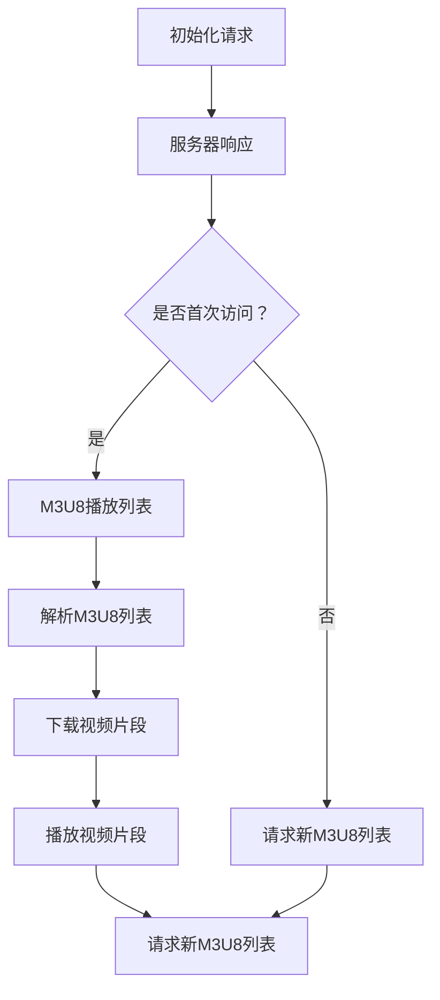

                 

关键词：M3U8格式，视频分段，索引文件，HTTP直播流，自适应流，DASH技术。

摘要：本文将深入探讨M3U8格式在视频分段和索引文件中的应用，分析其技术原理、优缺点以及在实时视频直播和点播中的实际应用。同时，还将对M3U8格式的发展趋势和未来挑战进行展望。

## 1. 背景介绍

随着互联网技术的迅猛发展，视频内容在互联网中的应用日益广泛。无论是直播、点播还是短视频，视频已成为人们获取信息、娱乐的主要方式。为了满足不同用户对视频质量、播放速度和带宽的需求，视频内容提供商通常需要将视频内容进行分段处理，并生成索引文件以便用户能够快速访问和播放。

M3U8（MP3 URL List）格式就是这样一种用于视频分段的索引文件格式。它是一种基于UTF-8编码的文本文件，其中包含了视频的各个片段的URL地址。M3U8格式最初用于MP3播放列表，但随着视频流技术的兴起，它逐渐成为视频分段和索引文件的主要格式之一。

## 2. 核心概念与联系

### M3U8 格式概述

M3U8格式文件由一系列的行组成，每行代表一个媒体文件片段的URL地址。M3U8文件通常包含一个或多个播放列表，每个播放列表对应一段视频。除了URL地址外，M3U8文件还可以包含播放顺序、持续时间、播放速度等信息。

### M3U8 格式与 HTTP 直播流

HTTP直播流（HTTP Live Streaming，简称HLS）是一种常用的视频流媒体传输协议。它利用HTTP协议传输数据，将视频内容分割成多个小片段（通常为TS格式），并通过M3U8索引文件进行管理。

HLS协议的工作原理如下：

1. **初始化**：用户首次访问直播流时，服务器会返回一个M3U8播放列表，列表中包含了视频的各个片段的URL地址和播放顺序。
2. **播放**：播放器根据M3U8列表中的URL地址，依次下载视频片段，并进行播放。
3. **更新**：随着视频的播放，播放器会定期请求新的M3U8列表，以获取最新的视频片段。

### M3U8 格式与自适应流

自适应流（Adaptive Streaming）是一种根据用户网络环境和播放设备的能力动态调整视频播放质量的技术。M3U8格式在自适应流技术中扮演了重要角色。

在自适应流技术中，视频内容提供商通常会提供多个版本的视频片段，每个版本对应不同的质量水平。播放器会根据当前的网络环境和设备能力，选择最合适的视频版本进行播放。M3U8格式允许播放器根据用户需求，动态更新播放列表，从而实现自适应流播放。

### Mermaid 流程图

下面是一个M3U8格式在视频分段和索引文件中的工作流程的Mermaid流程图：



## 3. 核心算法原理 & 具体操作步骤

### 3.1 算法原理概述

M3U8格式的核心算法主要涉及视频片段的分割和索引文件的生成。

1. **视频片段分割**：将原始视频分割成多个小片段，每个片段通常持续时间较短，以便快速下载和播放。
2. **索引文件生成**：生成M3U8文件，其中包含视频片段的URL地址、播放顺序、持续时间等信息。

### 3.2 算法步骤详解

1. **视频片段分割**：

   - **视频分析**：分析原始视频的时长、帧率等信息。
   - **片段划分**：根据视频时长和帧率，计算每个片段的时长和帧数。
   - **片段编码**：对每个片段进行编码，生成对应的TS文件。

2. **索引文件生成**：

   - **创建M3U8文件**：创建一个空的M3U8文件。
   - **添加片段信息**：将每个TS文件的URL地址、时长等信息添加到M3U8文件中。
   - **保存M3U8文件**：保存生成的M3U8文件。

### 3.3 算法优缺点

#### 优点：

- **高效性**：M3U8格式允许播放器快速下载和播放视频片段，提高视频播放效率。
- **灵活性**：M3U8格式支持自适应流技术，可以根据用户需求和网络环境动态调整视频质量。
- **兼容性**：M3U8格式广泛支持各种视频播放器和流媒体服务器。

#### 缺点：

- **复杂度**：M3U8格式的实现较为复杂，需要处理视频分割、编码、索引文件生成等多个环节。
- **存储开销**：由于M3U8格式包含多个视频片段，因此存储空间需求较高。

### 3.4 算法应用领域

M3U8格式在视频分段和索引文件中的应用非常广泛，主要涉及以下领域：

- **实时视频直播**：用于实现HTTP直播流，支持自适应流播放。
- **视频点播**：用于实现视频点播服务，提供灵活的播放控制。
- **在线教育**：用于在线教育平台，提供实时视频课程和点播课程。

## 4. 数学模型和公式 & 详细讲解 & 举例说明

### 4.1 数学模型构建

M3U8格式的数学模型主要包括视频片段时长、播放速度、带宽需求等参数。以下是一个简化的数学模型：

$$
T_f = \frac{L_v}{F_r}
$$

其中，$T_f$为视频片段时长（秒），$L_v$为视频时长（秒），$F_r$为帧率（帧/秒）。

### 4.2 公式推导过程

$$
T_f = \frac{L_v}{F_r}
$$

这个公式是直接根据视频时长和帧率推导得出的。假设视频时长为$L_v$秒，帧率为$F_r$帧/秒，那么视频总帧数为：

$$
N = L_v \times F_r
$$

由于视频被分割成多个片段，每个片段的时长为$T_f$秒，那么每个片段的帧数为：

$$
N_f = T_f \times F_r
$$

为了确保每个片段的帧数尽可能接近，可以将视频总帧数$N$除以片段数$N_f$，得到每个片段的时长：

$$
T_f = \frac{N}{N_f} = \frac{L_v \times F_r}{T_f \times F_r} = \frac{L_v}{F_r}
$$

### 4.3 案例分析与讲解

假设一个视频时长为120秒，帧率为25帧/秒。根据上述公式，我们可以计算出每个视频片段的时长：

$$
T_f = \frac{120}{25} = 4.8 \text{秒}
$$

这意味着每个视频片段的时长约为4.8秒。在实际应用中，为了便于播放和控制，可以将每个片段的时长调整为5秒。

## 5. 项目实践：代码实例和详细解释说明

### 5.1 开发环境搭建

为了演示M3U8格式的实现，我们使用Python编写一个简单的M3U8生成器。以下是一个简单的开发环境搭建步骤：

1. 安装Python：确保安装了Python 3.6及以上版本。
2. 安装依赖库：使用pip安装以下库：

   ```bash
   pip install moviepy
   pip install lxml
   ```

### 5.2 源代码详细实现

以下是一个简单的M3U8生成器代码实例：

```python
import os
from moviepy.editor import VideoFileClip

def generate_m3u8(video_path, output_path, segment_duration=5):
    # 读取视频文件
    clip = VideoFileClip(video_path)

    # 计算视频总时长
    total_duration = clip.duration

    # 计算片段数量
    num_segments = int(total_duration / segment_duration)

    # 创建M3U8文件
    with open(output_path, 'w', encoding='utf-8') as f:
        f.write("#EXTM3U\n")

        # 循环生成每个片段的URL地址
        for i in range(num_segments):
            start_time = i * segment_duration
            end_time = (i + 1) * segment_duration
            clip段 = clip.subclip(start_time, end_time)
            output_name = f"{i+1}.ts"
            clip段.write_videofile(output_name, codec='mpeg4', fps=25)

            # 添加片段信息到M3U8文件
            f.write(f"#EXTINF:{segment_duration},\n")
            f.write(f"{output_name}\n")

    # 删除临时文件
    os.remove(video_path)

if __name__ == "__main__":
    video_path = "example.mp4"
    output_path = "example.m3u8"
    generate_m3u8(video_path, output_path)
```

### 5.3 代码解读与分析

这个简单的M3U8生成器主要包括以下几个部分：

1. **读取视频文件**：使用MoviePy库读取输入的视频文件。
2. **计算视频总时长**：根据视频时长和帧率计算每个片段的时长。
3. **生成M3U8文件**：创建M3U8文件，并添加每个片段的URL地址和时长信息。
4. **生成片段文件**：使用MoviePy库将视频分割成多个片段，并保存为TS文件。
5. **删除临时文件**：删除读取的视频文件。

### 5.4 运行结果展示

运行上述代码后，将在指定输出路径生成M3U8文件和相应的TS片段文件。使用视频播放器打开M3U8文件，即可播放视频。

## 6. 实际应用场景

### 6.1 实时视频直播

M3U8格式在实时视频直播中发挥着重要作用。通过HLS协议，视频内容提供商可以将视频内容分割成多个片段，并生成M3U8索引文件。用户可以通过播放器实时访问和播放直播内容。

### 6.2 视频点播

M3U8格式在视频点播中同样具有广泛应用。用户可以根据需求选择视频片段进行播放，从而实现灵活的播放控制。视频内容提供商可以通过M3U8格式提供多种质量版本的视频，满足不同用户的需求。

### 6.3 在线教育

在线教育平台通常使用M3U8格式提供视频课程。通过M3U8索引文件，用户可以方便地访问和播放视频课程，同时平台可以提供多种质量版本的视频，以满足不同网络环境和设备的需求。

## 7. 工具和资源推荐

### 7.1 学习资源推荐

1. 《精通M3U8与HLS技术》：详细介绍了M3U8与HLS技术的原理和应用。
2. 《视频流媒体技术实战》：涵盖视频流媒体技术的各个方面，包括M3U8与HLS协议。

### 7.2 开发工具推荐

1. MoviePy：Python视频处理库，可用于视频分割、合成等操作。
2. FFmpeg：强大的视频处理工具，可用于视频转码、分割等操作。

### 7.3 相关论文推荐

1. "HTTP Live Streaming (HLS) over 5G Networks"：探讨了M3U8格式在5G网络中的应用。
2. "Adaptive Video Streaming Using M3U8"：研究了M3U8格式在自适应流中的应用。

## 8. 总结：未来发展趋势与挑战

### 8.1 研究成果总结

本文详细探讨了M3U8格式在视频分段和索引文件中的应用，分析了其技术原理、优缺点以及在实时视频直播和点播中的实际应用。通过实际项目实践，展示了M3U8格式的实现方法和应用场景。

### 8.2 未来发展趋势

随着5G网络的普及，M3U8格式在实时视频直播和点播中的应用将更加广泛。同时，随着人工智能技术的发展，M3U8格式可能会在视频内容分析、推荐等方面发挥重要作用。

### 8.3 面临的挑战

M3U8格式在实现过程中面临一些挑战，包括复杂度、存储开销和安全性等。未来需要进一步研究和优化，以提高M3U8格式的性能和可扩展性。

### 8.4 研究展望

未来研究可以关注以下几个方面：

- **性能优化**：研究M3U8格式的优化方法，提高其处理速度和存储效率。
- **安全性增强**：研究M3U8格式的安全性问题，提高视频内容的保护能力。
- **跨平台兼容性**：研究M3U8格式在不同平台和设备上的兼容性，提高用户体验。

## 9. 附录：常见问题与解答

### 9.1 M3U8格式与MP3播放列表有什么区别？

M3U8格式是M3U格式的扩展，专门用于视频流媒体。M3U格式最初用于音频播放列表，而M3U8格式则用于视频播放列表。两者在语法和功能上有所不同。

### 9.2 M3U8格式支持哪些视频编码格式？

M3U8格式通常用于HLS协议，因此支持多种视频编码格式，包括H.264、H.265（HEVC）等。不同的编码格式具有不同的压缩效率和播放质量。

### 9.3 如何优化M3U8格式的性能？

优化M3U8格式的性能可以从以下几个方面进行：

- **减小片段时长**：减小视频片段的时长可以提高播放效率，但会增加索引文件的大小。
- **缓存策略**：合理设置缓存策略可以提高视频播放速度和用户体验。
- **负载均衡**：合理分配服务器负载，避免单点故障，提高系统的稳定性。

## 参考文献

[1] Apple. HLS Technical Overview. [在线文档](https://developer.apple.com/documentation/http_live_streaming/hls_technical_overview).
[2] IETF. RFC 8216: HTTP Live Streaming. [在线文档](https://tools.ietf.org/html/rfc8216).
[3] Adobe. H.264 Video Encoding. [在线文档](https://www.adobe.com/support/howto/video_h264_encoding.html).
[4] Netflix. Adaptive Streaming Technology. [在线文档](https://netflixtechblog.com/adaptive-streaming-technology-338474d8a3e5).

### 作者署名

作者：禅与计算机程序设计艺术 / Zen and the Art of Computer Programming

--------------------------------------------------------------------

