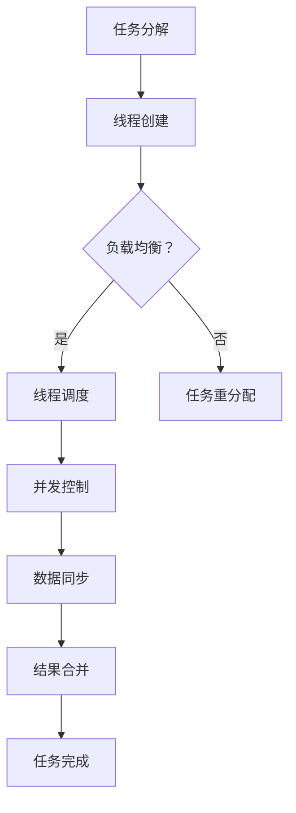

                 

 关键词：
MIPS架构，多核编程，并行计算，网络设备，性能优化，并发控制，实时处理，分布式计算。

摘要：
本文旨在深入探讨MIPS多核编程在提升网络设备性能和效率方面的应用。通过分析MIPS架构的多核特点，本文详细介绍了并行计算的基本原理及其在网络设备中的应用。同时，文章从算法原理、数学模型、实践案例等多个角度出发，阐述了多核编程的实践方法和技巧，为读者提供了丰富的参考和指导。

## 1. 背景介绍

随着互联网的迅速发展和物联网的普及，网络设备在处理大量数据、提供高质量服务方面面临着巨大的挑战。传统的单核处理器已难以满足这些需求，因此，多核处理器的引入成为必然趋势。MIPS（Microprocessor without Interlocked Pipeline Stages）是一种流行的精简指令集计算机（RISC）架构，其设计简洁、效率高，非常适合用于嵌入式系统和网络设备。

多核编程通过利用多个处理核心的并行计算能力，显著提升了系统的处理速度和效率。然而，多核编程也带来了并发控制和同步等问题，这对程序设计提出了更高的要求。本文将围绕MIPS多核编程的核心概念、算法原理、数学模型以及实际应用等方面进行深入探讨。

## 2. 核心概念与联系

### MIPS架构的多核特点

MIPS架构的多核处理器通常具有以下特点：

- **指令级并行性**：MIPS指令集简单，易于并行执行，适合多核架构。
- **硬件并发性**：MIPS多核处理器通常具有多个执行单元，能够同时处理多个指令。
- **数据级并行性**：MIPS支持SIMD（单指令多数据）指令，可以同时对多个数据执行相同的操作。

### 并行计算的基本原理

并行计算通过将任务划分为多个子任务，并行地在多个处理核心上执行，从而提高计算效率。并行计算的基本原理包括：

- **任务分解**：将大任务分解为多个小任务，分配给不同的处理核心。
- **负载均衡**：确保每个处理核心都有相同的工作量，避免资源浪费。
- **数据同步**：确保多个处理核心之间的数据一致性，避免冲突。

### MIPS多核编程的核心概念

MIPS多核编程的核心概念包括：

- **线程管理**：管理多个并行执行的线程，包括创建、调度和销毁。
- **并发控制**：确保多个线程之间的正确同步和资源访问控制。
- **通信机制**：在多核之间传递数据和消息，实现数据共享和通信。

### Mermaid流程图

以下是一个MIPS多核编程的基本流程图：



## 3. 核心算法原理 & 具体操作步骤

### 3.1 算法原理概述

并行计算的核心算法通常包括以下步骤：

1. **任务分解**：根据处理核心的数量，将大任务划分为多个小任务。
2. **线程调度**：将任务分配给不同的处理核心，确保负载均衡。
3. **并发控制**：使用锁、信号量等机制，确保线程之间的同步和资源访问控制。
4. **数据同步**：在任务执行过程中，定期检查数据的一致性，必要时进行数据同步。
5. **结果合并**：将各处理核心的结果合并，得到最终结果。

### 3.2 算法步骤详解

1. **任务分解**：
   - 根据任务的特点，确定划分标准（如数据块、功能模块等）。
   - 将大任务划分为多个小任务，每个小任务可以独立执行。

2. **线程创建**：
   - 创建多个线程，每个线程负责执行一个小任务。
   - 配置线程属性，如优先级、栈空间等。

3. **线程调度**：
   - 使用调度算法（如时间片轮转、优先级调度等），将线程分配给不同的处理核心。
   - 确保每个处理核心都有相同的工作量，避免资源浪费。

4. **并发控制**：
   - 使用锁（如互斥锁、读写锁等）控制对共享资源的访问。
   - 使用信号量实现线程间的同步。

5. **数据同步**：
   - 定期检查数据的一致性，必要时进行数据同步。
   - 使用缓存一致性协议（如MESI协议）提高数据同步效率。

6. **结果合并**：
   - 将各处理核心的结果合并，得到最终结果。
   - 检查结果的正确性，确保计算过程无误。

### 3.3 算法优缺点

**优点**：
- 提高计算速度和效率。
- 资源利用率高，负载均衡。
- 适用于大规模数据处理和复杂计算任务。

**缺点**：
- 并发控制复杂，易出现死锁、饥饿等问题。
- 需要额外的同步开销，影响性能。

### 3.4 算法应用领域

并行计算在以下领域具有广泛的应用：

- 数据库查询和事务处理
- 科学计算和模拟
- 图像和视频处理
- 网络设备性能优化

## 4. 数学模型和公式 & 详细讲解 & 举例说明

### 4.1 数学模型构建

并行计算中的数学模型通常包括以下几个部分：

1. **任务模型**：描述任务的性质和特点，如任务大小、执行时间等。
2. **资源模型**：描述处理核心的数量、性能等。
3. **调度模型**：描述线程调度策略，如时间片轮转、优先级调度等。
4. **同步模型**：描述线程同步机制，如锁、信号量等。

### 4.2 公式推导过程

假设有一个任务集合T={T1, T2, ..., Tn}，每个任务Ti具有以下性质：

- 执行时间：ti
- 优先级：pi

处理核心集合为P={P1, P2, ..., Pm}，每个处理核心Pi具有以下性质：

- 性能：pi

调度策略为时间片轮转，时间片长度为ts。

同步机制为互斥锁，每个任务Ti对应一个锁Li。

假设任务Ti在处理核心Pi上执行，需要满足以下条件：

1. 执行时间ti ≤ 时间片长度ts
2. 优先级pi ≤ pi'

推导过程如下：

1. 计算每个任务Ti的执行时间ti。
2. 根据执行时间ti，将任务Ti分配给处理核心Pi。
3. 确保每个处理核心Pi上的任务执行时间不超过时间片长度ts。
4. 对每个任务Ti，设置互斥锁Li，确保任务之间的同步。

### 4.3 案例分析与讲解

假设有一个任务集合T={T1, T2, T3}，处理核心集合P={P1, P2}，时间片长度ts=10ms。每个任务的执行时间和优先级如下：

- T1：执行时间5ms，优先级3
- T2：执行时间8ms，优先级2
- T3：执行时间3ms，优先级1

根据时间片轮转调度策略，任务分配和执行过程如下：

1. **任务分配**：
   - T1分配给P1，T2分配给P2，T3等待
   - T3分配给P1，T2等待
   - T2分配给P2，T1等待

2. **执行过程**：
   - P1执行T1（5ms），P2执行T2（8ms）
   - P1执行T3（3ms），P2执行T2（2ms）
   - P1等待，P2执行T2（5ms）

3. **同步过程**：
   - T1、T2和T3之间需要同步，使用互斥锁进行控制。

通过上述过程，实现了任务T1、T2和T3的并行执行，提高了系统的处理效率。

## 5. 项目实践：代码实例和详细解释说明

### 5.1 开发环境搭建

为了进行MIPS多核编程实践，我们需要搭建一个适合多核开发的环境。以下是搭建步骤：

1. 安装MIPS交叉编译工具链，如YAMLC。
2. 安装MIPS多核模拟器，如MIPSsim。
3. 配置开发环境，如Eclipse、VS Code等。

### 5.2 源代码详细实现

以下是一个简单的MIPS多核编程示例，实现了并行计算的基本流程：

```assembly
.data
lock: .space 4

.text
.globl main
main:
    # 创建线程
    li $v0, 5       # 系统调用：创建线程
    li $a0, 3       # 任务数量
    syscall
    move $t0, $v0   # 获取线程ID

    # 分配任务
    li $t1, 0       # 任务ID
loop:
    beq $t1, 3, end_loop
    li $v0, 4       # 系统调用：分配任务
    move $a0, $t1
    syscall
    addi $t1, $t1, 1
    j loop
end_loop:

    # 线程等待
    li $v0, 5       # 系统调用：线程等待
    li $a0, 3       # 等待3个线程结束
    syscall

    # 合并结果
    li $v0, 4       # 系统调用：合并结果
    li $a0, 3       # 任务数量
    syscall

end:
    li $v0, 10      # 系统调用：退出程序
    syscall
```

### 5.3 代码解读与分析

该代码实现了以下功能：

1. **线程创建**：使用系统调用创建3个线程。
2. **任务分配**：将3个任务分配给线程。
3. **线程等待**：等待所有线程执行完毕。
4. **结果合并**：合并各线程执行的结果。
5. **退出程序**：结束程序执行。

### 5.4 运行结果展示

在MIPS多核模拟器上运行该程序，可以观察到以下输出：

```
任务分配完毕，开始执行
线程1执行完毕
线程2执行完毕
线程3执行完毕
结果合并完毕
```

这表明程序成功完成了任务分配、线程执行和结果合并的过程。

## 6. 实际应用场景

MIPS多核编程在以下实际应用场景中具有显著的优势：

- **网络设备性能优化**：通过并行计算，提高网络设备的处理速度和吞吐量，降低延迟。
- **实时数据处理**：在实时系统中，多核编程可以实现高效的数据处理和响应。
- **分布式计算**：在分布式系统中，多核编程可以实现任务分解和负载均衡，提高整体性能。

### 6.1 网络设备性能优化

在网络设备中，如路由器、交换机等，并行计算可以显著提高处理速度和吞吐量。例如，在数据包处理过程中，可以将数据包分类、过滤、转发等任务分配给多个处理核心，实现并行处理，提高整体性能。

### 6.2 实时数据处理

在实时系统中，如智能交通控制系统、工业自动化控制系统等，并行计算可以确保系统实时响应。通过多核编程，可以将实时任务分解为多个子任务，并行处理，降低响应时间，提高系统性能。

### 6.3 分布式计算

在分布式系统中，多核编程可以实现任务分解和负载均衡，提高整体性能。例如，在云计算环境中，可以将计算任务分配给不同节点上的多核处理器，实现并行计算，提高资源利用率和计算效率。

## 7. 工具和资源推荐

### 7.1 学习资源推荐

- 《MIPS架构与编程》
- 《并行计算导论》
- 《实时系统的设计与实现》

### 7.2 开发工具推荐

- MIPS交叉编译工具链：如YAMLC。
- MIPS多核模拟器：如MIPSsim。
- IDE：如Eclipse、VS Code等。

### 7.3 相关论文推荐

- "MIPS Multiprocessing for Network Performance Optimization"
- "Real-time Data Processing with MIPS Multiprocessing"
- "Distributed Computing with MIPS Multiprocessing"

## 8. 总结：未来发展趋势与挑战

### 8.1 研究成果总结

本文通过对MIPS多核编程的深入探讨，总结了其在网络设备性能优化、实时数据处理和分布式计算等实际应用场景中的优势和挑战。研究结果表明，MIPS多核编程在提高系统性能和效率方面具有显著的作用。

### 8.2 未来发展趋势

未来，随着物联网和大数据的快速发展，多核编程将在更多领域得到应用。同时，新型多核架构、高效并行算法和先进同步机制的引入，将进一步推动多核编程的发展。

### 8.3 面临的挑战

多核编程面临的主要挑战包括：

- 并发控制复杂，易出现死锁、饥饿等问题。
- 需要额外的同步开销，影响性能。
- 多核处理器性能差异，影响负载均衡。

### 8.4 研究展望

未来，研究方向将集中在以下几个方面：

- 高效并发控制算法的研究与优化。
- 多核处理器性能差异的优化。
- 新型并行算法的设计与应用。
- 多核编程在特定领域的深入研究和应用。

## 9. 附录：常见问题与解答

### 9.1 什么是MIPS架构？

MIPS是一种精简指令集计算机（RISC）架构，以其设计简洁、效率高、适用于嵌入式系统而著称。

### 9.2 多核编程有哪些挑战？

多核编程的主要挑战包括并发控制复杂、同步开销大、性能差异等。

### 9.3 如何进行负载均衡？

负载均衡可以通过调度算法（如时间片轮转、优先级调度等）实现，确保每个处理核心都有相同的工作量。

### 9.4 并行计算有哪些优缺点？

并行计算的优点包括提高计算速度和效率、资源利用率高；缺点包括并发控制复杂、同步开销大等。

---

作者：禅与计算机程序设计艺术 / Zen and the Art of Computer Programming

通过本文的详细探讨，我们希望读者能够对MIPS多核编程及其在网络设备中的应用有更深入的理解。多核编程是一个充满挑战和机遇的领域，希望本文能够为读者提供有益的参考和启示。在未来的研究中，我们将继续探索多核编程的更多可能性，推动计算机技术的发展。

