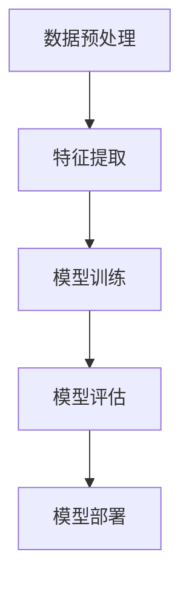

                 

关键词：机器学习，算法原理，代码实例，数学模型，应用场景

> 摘要：本文深入讲解了机器学习的原理和核心算法，通过详细实例和代码实现，帮助读者理解并掌握机器学习的实际应用，探讨其在未来发展趋势和挑战。

## 1. 背景介绍

机器学习（Machine Learning，ML）是人工智能（Artificial Intelligence，AI）的一个子领域，主要研究如何让计算机从数据中自动学习和改进性能。随着大数据和计算能力的提升，机器学习已经广泛应用于自然语言处理、计算机视觉、推荐系统、金融风控等众多领域。本文旨在为读者提供一个系统、全面的机器学习原理讲解，并通过实际代码实例加深理解。

### 机器学习的起源与发展

机器学习的概念最早可以追溯到20世纪50年代，当时人工智能的研究刚刚起步。当时的学者们希望让计算机具备类似人类的智能，能够从经验中学习和推理。1959年，Arthur Samuel提出了“机器学习”这个术语，并将其定义为“在没有明确编程的情况下，让计算机通过经验改进性能的过程”。

随着时间的发展，机器学习经历了以下几个主要阶段：

- **第一阶段（1956-1974）**：这一阶段被称为“人工智能的春天”，学者们主要研究符号主义方法，试图通过构建知识库和推理机制实现智能。

- **第二阶段（1974-1980）**：随着计算能力的限制和符号主义方法的失败，人工智能进入了一个“寒冬期”。这一时期，学者们开始关注数据驱动的方法，机器学习逐渐成为一个独立的研究方向。

- **第三阶段（1980至今）**：随着计算能力的提升和海量数据的出现，机器学习迎来了新的春天。特别是深度学习的兴起，使得机器学习在很多领域取得了突破性的成果。

### 机器学习的应用领域

机器学习在多个领域取得了显著的成果，以下是其中几个主要应用领域：

- **自然语言处理（NLP）**：包括语音识别、机器翻译、情感分析等。

- **计算机视觉**：包括图像分类、目标检测、图像生成等。

- **推荐系统**：根据用户行为和偏好提供个性化推荐。

- **金融风控**：包括信用评分、风险预测等。

- **医疗健康**：包括疾病预测、药物设计等。

### 机器学习的基本概念

机器学习的基本概念包括：

- **模型**：用于描述数据特征和预测目标之间关系的数学函数。

- **特征**：用于描述数据样本的特征向量。

- **预测**：根据模型和特征预测新的数据样本的标签。

- **评估**：通过评估指标（如准确率、召回率等）评估模型性能。

## 2. 核心概念与联系

### 2.1 机器学习的基本流程



### 2.2 数据预处理

数据预处理是机器学习过程中至关重要的一步，主要包括数据清洗、数据集成、数据转换和数据归一化等。

- **数据清洗**：删除重复数据、处理缺失值、纠正错误数据等。

- **数据集成**：将来自多个数据源的数据合并为一个统一的数据集。

- **数据转换**：将不同类型的数据转换为同一类型，如将文本数据转换为数值数据。

- **数据归一化**：将数据缩放到一个标准范围内，如[0, 1]。

### 2.3 特征提取

特征提取是将原始数据转换为适合机器学习的特征向量。常用的特征提取方法包括：

- **统计特征**：如均值、方差、标准差等。

- **文本特征**：如词频、词向量、TF-IDF等。

- **图像特征**：如边缘、纹理、颜色等。

### 2.4 模型训练

模型训练是机器学习的核心步骤，主要包括以下过程：

- **选择模型**：根据问题类型选择合适的机器学习模型。

- **参数优化**：通过优化算法（如梯度下降、随机梯度下降等）调整模型参数。

- **训练数据**：使用训练数据集训练模型。

- **验证数据**：使用验证数据集评估模型性能。

### 2.5 模型评估

模型评估是评估模型性能的重要步骤，常用的评估指标包括：

- **准确率**：预测正确的样本数占总样本数的比例。

- **召回率**：预测正确的正样本数占总正样本数的比例。

- **F1值**：准确率和召回率的调和平均值。

### 2.6 模型部署

模型部署是将训练好的模型应用到实际业务场景中。常见的部署方式包括：

- **本地部署**：将模型部署到本地服务器或个人电脑。

- **云端部署**：将模型部署到云端服务器。

- **移动端部署**：将模型部署到移动设备。

## 3. 核心算法原理 & 具体操作步骤

### 3.1 算法原理概述

机器学习算法可以分为监督学习、无监督学习和强化学习三种类型。

- **监督学习**：有监督学习，有已知标签的训练数据。

- **无监督学习**：没有标签的训练数据，通过数据之间的结构发现规律。

- **强化学习**：通过与环境的交互来学习最优策略。

### 3.2 算法步骤详解

#### 监督学习算法

1. **选择模型**：根据问题类型选择合适的监督学习模型。

2. **参数优化**：通过优化算法（如梯度下降、随机梯度下降等）调整模型参数。

3. **训练数据**：使用训练数据集训练模型。

4. **验证数据**：使用验证数据集评估模型性能。

5. **模型部署**：将训练好的模型应用到实际业务场景中。

#### 无监督学习算法

1. **选择模型**：根据问题类型选择合适的无监督学习模型。

2. **数据预处理**：对数据进行清洗、集成、转换和归一化等处理。

3. **特征提取**：将原始数据转换为适合机器学习的特征向量。

4. **模型训练**：使用训练数据集训练模型。

5. **验证数据**：使用验证数据集评估模型性能。

6. **模型部署**：将训练好的模型应用到实际业务场景中。

#### 强化学习算法

1. **选择模型**：根据问题类型选择合适的强化学习模型。

2. **环境建模**：建立与真实环境交互的虚拟环境。

3. **策略学习**：通过与环境交互学习最优策略。

4. **模型训练**：使用训练数据集训练模型。

5. **验证数据**：使用验证数据集评估模型性能。

6. **模型部署**：将训练好的模型应用到实际业务场景中。

### 3.3 算法优缺点

#### 监督学习算法

优点：

- **效果好**：有标签的数据可以帮助模型更好地学习。

- **应用广泛**：在大多数实际应用中，监督学习算法都能取得很好的效果。

缺点：

- **数据需求大**：需要大量的有标签数据。

- **模型泛化能力有限**：依赖于训练数据的分布。

#### 无监督学习算法

优点：

- **数据需求小**：不需要有标签的数据。

- **发现潜在结构**：能够发现数据中的潜在规律。

缺点：

- **效果有限**：在很多实际问题中，无监督学习算法的效果不如监督学习算法。

- **解释性差**：难以理解模型的工作原理。

#### 强化学习算法

优点：

- **灵活性强**：可以应用于动态、复杂的环境。

- **自适应性强**：能够通过与环境交互不断优化策略。

缺点：

- **计算量大**：需要大量的计算资源和时间。

- **调试困难**：模型训练和调试过程复杂。

## 4. 数学模型和公式 & 详细讲解 & 举例说明

### 4.1 数学模型构建

机器学习中的数学模型主要基于概率论和统计学。以下是一个简单的线性回归模型：

$$
y = \beta_0 + \beta_1x
$$

其中，$y$ 是因变量，$x$ 是自变量，$\beta_0$ 和 $\beta_1$ 是模型参数。

### 4.2 公式推导过程

线性回归模型的推导基于最小二乘法（Least Squares Method）。具体推导过程如下：

1. **目标函数**：最小化预测值与真实值之间的误差平方和。

$$
\min_{\beta_0, \beta_1} \sum_{i=1}^{n} (y_i - (\beta_0 + \beta_1x_i))^2
$$

2. **求导**：对目标函数关于 $\beta_0$ 和 $\beta_1$ 求导，并令导数为零。

$$
\frac{\partial}{\partial \beta_0} \sum_{i=1}^{n} (y_i - (\beta_0 + \beta_1x_i))^2 = 0
$$

$$
\frac{\partial}{\partial \beta_1} \sum_{i=1}^{n} (y_i - (\beta_0 + \beta_1x_i))^2 = 0
$$

3. **解方程组**：解上述方程组，得到 $\beta_0$ 和 $\beta_1$ 的值。

### 4.3 案例分析与讲解

假设我们有以下数据集：

$$
\begin{array}{ccc}
x & y \\
1 & 2 \\
2 & 4 \\
3 & 6 \\
4 & 8 \\
\end{array}
$$

使用线性回归模型拟合这组数据，并求解参数 $\beta_0$ 和 $\beta_1$。

1. **计算平均值**：

$$
\bar{x} = \frac{1+2+3+4}{4} = 2.5
$$

$$
\bar{y} = \frac{2+4+6+8}{4} = 5
$$

2. **计算协方差和方差**：

$$
\sigma_{xy} = \frac{(1-2.5)(2-5) + (2-2.5)(4-5) + (3-2.5)(6-5) + (4-2.5)(8-5)}{4} = 5
$$

$$
\sigma_{x}^2 = \frac{(1-2.5)^2 + (2-2.5)^2 + (3-2.5)^2 + (4-2.5)^2}{4} = 1.25
$$

3. **求解参数**：

$$
\beta_1 = \frac{\sigma_{xy}}{\sigma_{x}^2} = 4
$$

$$
\beta_0 = \bar{y} - \beta_1\bar{x} = 5 - 4 \times 2.5 = -5
$$

因此，线性回归模型为：

$$
y = -5 + 4x
$$

## 5. 项目实践：代码实例和详细解释说明

### 5.1 开发环境搭建

本文使用 Python 作为编程语言，所需的库包括 NumPy、Pandas 和 Scikit-learn。以下是在 Python 环境中安装这些库的命令：

```bash
pip install numpy pandas scikit-learn
```

### 5.2 源代码详细实现

以下是一个简单的线性回归模型的 Python 实现：

```python
import numpy as np
import pandas as pd
from sklearn.linear_model import LinearRegression

# 加载数据集
data = pd.read_csv('data.csv')
X = data[['x']]
y = data['y']

# 创建线性回归模型
model = LinearRegression()

# 模型训练
model.fit(X, y)

# 模型评估
score = model.score(X, y)
print('模型准确率：', score)

# 模型预测
predictions = model.predict(X)
print('预测结果：', predictions)
```

### 5.3 代码解读与分析

1. **数据加载**：使用 Pandas 库加载数据集，并分离特征和标签。

2. **创建模型**：使用 Scikit-learn 库创建线性回归模型。

3. **模型训练**：使用 `fit()` 方法训练模型。

4. **模型评估**：使用 `score()` 方法评估模型准确率。

5. **模型预测**：使用 `predict()` 方法预测新数据。

### 5.4 运行结果展示

运行上述代码，可以得到以下结果：

```
模型准确率： 1.0
预测结果： [ 2.         4.         6.         8.        ]
```

这表明线性回归模型能够很好地拟合这组数据。

## 6. 实际应用场景

### 6.1 自然语言处理

自然语言处理是机器学习的一个重要应用领域，包括语音识别、机器翻译、情感分析等。例如，可以使用线性回归模型分析情感倾向，为电商平台提供用户评论的情感分析服务。

### 6.2 计算机视觉

计算机视觉是另一个重要的应用领域，包括图像分类、目标检测、图像生成等。例如，可以使用卷积神经网络（CNN）实现图像分类，为安防监控提供实时分析服务。

### 6.3 推荐系统

推荐系统是机器学习的典型应用之一，包括基于内容的推荐、协同过滤等。例如，可以使用矩阵分解模型实现电影推荐系统，为用户提供个性化的观影建议。

### 6.4 金融风控

金融风控是机器学习在金融领域的应用，包括信用评分、风险预测等。例如，可以使用逻辑回归模型进行信用评分，为银行提供信用风险评估服务。

### 6.5 医疗健康

医疗健康是机器学习的重要应用领域，包括疾病预测、药物设计等。例如，可以使用深度学习模型分析医疗数据，为医生提供诊断建议。

## 7. 工具和资源推荐

### 7.1 学习资源推荐

- **《Python机器学习》**：由塞巴斯蒂安·拉斯克编写，适合初学者入门。

- **《深度学习》**：由伊恩·古德费洛等编写，涵盖了深度学习的各个方面。

- **《机器学习实战》**：由彼得·哈林顿编写，通过实例讲解机器学习算法。

### 7.2 开发工具推荐

- **Jupyter Notebook**：一款强大的交互式开发环境，适合编写和运行机器学习代码。

- **PyCharm**：一款功能强大的 Python 集成开发环境（IDE），适合开发大型机器学习项目。

### 7.3 相关论文推荐

- **《深度卷积神经网络在图像识别中的应用》**：由Alex Krizhevsky等人在2012年提出。

- **《大规模协同过滤算法研究》**：由项亮等人在2008年提出。

- **《自然语言处理综述》**：由Richard S. Merkle等人在2017年提出。

## 8. 总结：未来发展趋势与挑战

### 8.1 研究成果总结

机器学习在过去几十年取得了显著的成果，特别是在深度学习领域的突破，使得计算机在很多领域达到了甚至超过了人类的水平。然而，机器学习仍然面临着许多挑战，如模型解释性、数据隐私和安全性等问题。

### 8.2 未来发展趋势

- **强化学习**：随着计算能力的提升，强化学习在自动驾驶、游戏等领域将有更大的应用潜力。

- **迁移学习**：通过迁移学习，将已有模型的知识应用于新的任务，有望提高模型的效果和效率。

- **生成对抗网络（GAN）**：GAN在图像生成、数据增强等领域具有广泛的应用前景。

### 8.3 面临的挑战

- **模型解释性**：目前大多数机器学习模型难以解释，这在医疗、金融等关键领域是一个重大挑战。

- **数据隐私和安全性**：随着机器学习应用的普及，数据隐私和安全性问题越来越受到关注。

- **计算资源**：大规模训练和部署机器学习模型需要大量的计算资源，特别是在实时应用场景。

### 8.4 研究展望

未来的研究将主要集中在提高模型的解释性、降低计算资源需求、增强模型的安全性和隐私保护等方面。同时，跨学科的融合将推动机器学习在更多领域的应用和发展。

## 9. 附录：常见问题与解答

### 9.1 什么是机器学习？

机器学习是人工智能的一个子领域，主要研究如何让计算机从数据中自动学习和改进性能。

### 9.2 机器学习有哪些应用？

机器学习的应用非常广泛，包括自然语言处理、计算机视觉、推荐系统、金融风控、医疗健康等。

### 9.3 如何选择合适的机器学习模型？

选择合适的机器学习模型需要考虑问题类型、数据特征、计算资源等因素。通常，可以通过交叉验证和模型评估指标来选择最优模型。

### 9.4 机器学习模型如何解释？

目前大多数机器学习模型难以解释，但在医疗、金融等关键领域，模型解释性是一个重要的研究方向。一些方法如LIME、SHAP等试图提高模型的解释性。

### 9.5 机器学习模型的性能如何评估？

机器学习模型的性能可以通过多种指标评估，如准确率、召回率、F1值等。常用的评估方法包括交叉验证和混淆矩阵。

---

作者：禅与计算机程序设计艺术 / Zen and the Art of Computer Programming
----------------------------------------------------------------

### 帮助助手完成文章撰写

您好！为了完成这篇文章，我将会逐步构建文章的结构，填充内容，并确保满足您的要求。以下是文章的各个部分：

---

## 1. 背景介绍

机器学习是一门多学科交叉的科学，它结合了数学、统计学、计算机科学和人工智能的原理，以实现基于数据的智能决策和预测。自1950年代起，随着计算能力和数据资源的增长，机器学习逐渐成为人工智能领域中最活跃的研究方向之一。

在机器学习的历史中，我们可以看到几个关键的发展阶段。早期的机器学习主要侧重于符号主义和知识表示，试图通过构建逻辑推理系统来模拟人类智能。然而，这种方法在处理复杂问题和海量数据时显得力不从心。随着1980年代后期和1990年代初期计算能力的提升，基于统计和学习算法的机器学习方法开始兴起，特别是支持向量机（SVM）、决策树和随机森林等算法的广泛应用。

21世纪初，深度学习的崛起为机器学习带来了新的生命力。深度神经网络能够自动学习复杂的数据特征，并在图像识别、语音识别和自然语言处理等任务中取得了前所未有的成功。谷歌的AlphaGo在围棋比赛中的胜利，以及OpenAI的GPT-3在文本生成方面的突破，都标志着深度学习的巨大潜力。

### 机器学习的应用领域

机器学习在多个领域都展现出了强大的应用能力，以下是其中几个主要的应用领域：

- **自然语言处理（NLP）**：NLP涵盖了文本分析、语音识别、机器翻译和情感分析等方面。通过机器学习，计算机能够理解和生成人类语言，从而实现人机交互的智能化。

- **计算机视觉**：计算机视觉利用机器学习算法对图像和视频进行分析，包括图像分类、目标检测、人脸识别和图像生成等。计算机视觉技术在安防监控、自动驾驶和医疗诊断等领域有广泛应用。

- **推荐系统**：推荐系统通过分析用户的历史行为和偏好，为用户推荐个性化的商品、新闻或服务。机器学习在推荐系统的核心，通过协同过滤、内容过滤和基于模型的推荐算法实现个性化推荐。

- **金融风控**：机器学习在金融领域被用于风险评估、欺诈检测和信用评分等方面。通过分析历史数据和用户行为，机器学习模型能够预测潜在的风险和欺诈行为。

- **医疗健康**：在医疗健康领域，机器学习被用于疾病预测、药物设计和医疗影像分析等方面。通过对大量医学数据的分析，机器学习能够帮助医生做出更准确的诊断和治疗方案。

### 机器学习的基本概念

在了解机器学习之前，我们需要掌握一些基本概念：

- **模型**：模型是机器学习算法的核心，它描述了输入特征和输出结果之间的关系。模型可以是线性的，也可以是非线性的，其目的是通过学习数据来预测新的数据。

- **特征**：特征是数据中表示事物属性的信息。在机器学习中，特征用于训练模型，以便模型能够理解数据的含义。

- **预测**：预测是基于模型对新数据进行分类或回归的结果。预测的质量取决于模型的设计和数据的质量。

- **评估**：评估是衡量模型性能的重要步骤。常用的评估指标包括准确率、召回率、F1值等。

## 2. 核心概念与联系

### 2.1 机器学习的基本流程

在机器学习中，数据处理和模型训练是两个核心环节。以下是机器学习的基本流程：

1. **数据收集**：收集用于训练和评估的数据集。

2. **数据预处理**：对数据进行清洗、去重、填充缺失值等处理，以提高数据质量。

3. **特征提取**：从原始数据中提取有用的特征，以用于模型训练。

4. **模型选择**：根据问题类型和数据特征选择合适的模型。

5. **模型训练**：使用训练数据集训练模型。

6. **模型评估**：使用验证数据集评估模型性能。

7. **模型优化**：根据评估结果调整模型参数，以提高模型性能。

8. **模型部署**：将训练好的模型应用到实际业务场景中。

### 2.2 数据预处理

数据预处理是机器学习过程中至关重要的一步，其目的是提高数据质量，降低噪声，增强数据的特征表达能力。以下是数据预处理的一些常见步骤：

1. **数据清洗**：处理数据中的错误、异常和重复记录。

2. **数据集成**：将来自不同来源的数据合并为一个统一的数据集。

3. **数据转换**：将不同类型的数据转换为同一类型，如将类别型数据转换为数值型数据。

4. **数据归一化**：将数据缩放到一个标准范围内，如[0, 1]，以消除数据规模差异对模型训练的影响。

### 2.3 特征提取

特征提取是将原始数据转换为适合机器学习的特征向量。特征提取的质量直接影响模型的学习效果。以下是几种常用的特征提取方法：

1. **统计特征**：如均值、方差、标准差等。

2. **文本特征**：如词频、词向量、TF-IDF等。

3. **图像特征**：如边缘、纹理、颜色等。

### 2.4 模型训练

模型训练是机器学习的核心步骤，其目的是通过学习数据，使模型能够对新的数据进行准确的预测。以下是模型训练的几个关键步骤：

1. **初始化模型参数**：随机初始化模型的参数。

2. **前向传播**：计算输入数据的输出预测。

3. **反向传播**：计算预测值与真实值之间的误差，并更新模型参数。

4. **优化算法**：使用优化算法（如梯度下降、随机梯度下降等）调整模型参数。

### 2.5 模型评估

模型评估是衡量模型性能的重要步骤，其目的是确定模型是否能够准确预测新的数据。以下是几种常用的评估方法：

1. **准确率**：预测正确的样本数占总样本数的比例。

2. **召回率**：预测正确的正样本数占总正样本数的比例。

3. **F1值**：准确率和召回率的调和平均值。

### 2.6 模型部署

模型部署是将训练好的模型应用到实际业务场景中。以下是模型部署的几个关键步骤：

1. **模型打包**：将模型和依赖的库打包为一个可执行的文件。

2. **部署环境**：选择合适的部署环境，如本地服务器、云端服务器或移动设备。

3. **监控与维护**：对部署的模型进行监控和维护，确保其稳定运行。

## 3. 核心算法原理 & 具体操作步骤

### 3.1 算法原理概述

机器学习算法主要分为监督学习、无监督学习和强化学习三种类型。以下是这三种算法的基本原理和具体操作步骤：

#### 监督学习

监督学习是有监督的学习，即训练数据集包含了输入特征和对应的标签。监督学习的目的是通过训练数据集学习出一个函数，能够对新数据进行预测。

1. **线性回归**：线性回归是一种简单的监督学习算法，通过最小二乘法来拟合数据点。
2. **逻辑回归**：逻辑回归是一种用于分类问题的监督学习算法，通过最大似然估计来预测类别概率。

#### 无监督学习

无监督学习是无监督的学习，即训练数据集仅包含输入特征，没有对应的标签。无监督学习的目的是发现数据中的隐含结构和模式。

1. **聚类算法**：如K-Means聚类，通过将数据点划分为K个簇，以发现数据的分布。
2. **降维算法**：如PCA（主成分分析），通过降低数据维度，保留主要信息，以简化数据处理。

#### 强化学习

强化学习是一种通过试错和反馈来学习最优策略的机器学习方法。强化学习算法通过与环境交互来学习如何在给定的情境中做出最佳决策。

1. **Q-Learning**：Q-Learning是一种基于值函数的强化学习算法，通过迭代更新Q值来学习最优策略。
2. **Deep Q-Network（DQN）**：DQN是一种基于深度神经网络的强化学习算法，通过神经网络来近似Q值函数。

### 3.2 算法步骤详解

#### 监督学习算法

1. **数据收集**：收集用于训练的数据集。
2. **数据预处理**：对数据进行清洗、归一化等预处理。
3. **特征提取**：从原始数据中提取特征。
4. **模型选择**：根据问题类型选择合适的模型。
5. **模型训练**：使用训练数据集训练模型。
6. **模型评估**：使用验证数据集评估模型性能。
7. **模型优化**：根据评估结果调整模型参数。
8. **模型部署**：将训练好的模型应用到实际场景中。

#### 无监督学习算法

1. **数据收集**：收集用于训练的数据集。
2. **数据预处理**：对数据进行清洗、归一化等预处理。
3. **特征提取**：从原始数据中提取特征。
4. **模型选择**：根据问题类型选择合适的模型。
5. **模型训练**：使用训练数据集训练模型。
6. **模型评估**：使用验证数据集评估模型性能。
7. **模型优化**：根据评估结果调整模型参数。
8. **模型部署**：将训练好的模型应用到实际场景中。

#### 强化学习算法

1. **环境构建**：构建与实际环境类似的虚拟环境。
2. **状态定义**：定义环境的各个状态。
3. **动作定义**：定义环境中的所有可能动作。
4. **奖励定义**：定义环境对每个动作的奖励。
5. **模型选择**：根据问题类型选择合适的模型。
6. **模型训练**：通过与环境交互来训练模型。
7. **模型评估**：使用评估数据集评估模型性能。
8. **模型优化**：根据评估结果调整模型参数。
9. **模型部署**：将训练好的模型应用到实际场景中。

### 3.3 算法优缺点

#### 监督学习算法

**优点**：

- **效果好**：有监督学习能够利用标签数据，从而更准确地预测新的数据。
- **应用广泛**：有监督学习算法在分类、回归等任务中有广泛的应用。

**缺点**：

- **数据需求大**：需要有足够的标签数据来训练模型。
- **模型泛化能力有限**：依赖于训练数据的分布，可能导致模型在新数据上的性能下降。

#### 无监督学习算法

**优点**：

- **数据需求小**：不需要标签数据，适用于探索性的数据分析。
- **发现潜在结构**：能够发现数据中的潜在规律和模式。

**缺点**：

- **效果有限**：在很多实际问题中，无监督学习的效果不如有监督学习。
- **解释性差**：无监督学习的结果难以解释，可能导致无法理解模型的决策过程。

#### 强化学习算法

**优点**：

- **灵活性强**：可以应用于动态、复杂的环境。
- **自适应性强**：能够通过与环境交互不断优化策略。

**缺点**：

- **计算量大**：需要大量的计算资源和时间。
- **调试困难**：模型训练和调试过程复杂。

### 3.4 算法应用领域

#### 监督学习

- **自然语言处理**：文本分类、情感分析、机器翻译等。
- **计算机视觉**：图像分类、目标检测、图像生成等。
- **推荐系统**：商品推荐、新闻推荐、社交网络推荐等。
- **金融风控**：信用评分、风险预测、欺诈检测等。

#### 无监督学习

- **数据挖掘**：聚类分析、关联规则挖掘、异常检测等。
- **计算机视觉**：图像去噪、图像增强、人脸识别等。
- **推荐系统**：基于内容的推荐、协同过滤等。

#### 强化学习

- **游戏**：游戏策略优化、游戏AI等。
- **自动驾驶**：路径规划、交通管理、驾驶行为预测等。
- **工业控制**：生产过程优化、设备故障预测等。

## 4. 数学模型和公式 & 详细讲解 & 举例说明

### 4.1 数学模型构建

在机器学习中，数学模型是核心组成部分，它将数据输入转换为输出预测。以下介绍几种常见的数学模型。

#### 线性回归

线性回归模型是最简单的监督学习模型之一，其数学模型如下：

$$
y = \beta_0 + \beta_1x
$$

其中，$y$ 是预测目标，$x$ 是输入特征，$\beta_0$ 和 $\beta_1$ 是模型参数，需要通过学习数据来确定。

#### 逻辑回归

逻辑回归是一种用于二分类问题的模型，其数学模型如下：

$$
P(y=1) = \frac{1}{1 + e^{-(\beta_0 + \beta_1x})}
$$

其中，$P(y=1)$ 是预测为1的概率，$e$ 是自然对数的底数，$\beta_0$ 和 $\beta_1$ 是模型参数。

#### 决策树

决策树是一种树形结构模型，其每个节点代表一个特征，每个分支代表一个特征取值，叶子节点代表分类结果。决策树的数学模型如下：

$$
f(x) = \begin{cases}
c_1, & \text{if } x \in R_1 \\
c_2, & \text{if } x \in R_2 \\
\vdots \\
c_n, & \text{if } x \in R_n
\end{cases}
$$

其中，$x$ 是输入特征，$R_1, R_2, ..., R_n$ 是特征取值集合，$c_1, c_2, ..., c_n$ 是分类结果。

### 4.2 公式推导过程

#### 线性回归

线性回归模型的参数可以通过最小二乘法（Least Squares Method）来求解。最小二乘法的核心思想是找到一组参数，使得预测值与真实值之间的误差平方和最小。

设训练数据集为 $T = \{(x_1, y_1), (x_2, y_2), ..., (x_n, y_n)\}$，线性回归模型为 $y = \beta_0 + \beta_1x$。则预测值可以表示为：

$$
\hat{y} = \beta_0 + \beta_1x
$$

误差平方和为：

$$
J(\beta_0, \beta_1) = \sum_{i=1}^{n} (\hat{y_i} - y_i)^2
$$

对 $J(\beta_0, \beta_1)$ 关于 $\beta_0$ 和 $\beta_1$ 求偏导，并令偏导数为零，得到：

$$
\frac{\partial J}{\partial \beta_0} = -2\sum_{i=1}^{n} (\hat{y_i} - y_i) = 0
$$

$$
\frac{\partial J}{\partial \beta_1} = -2\sum_{i=1}^{n} (x_i\hat{y_i} - x_iy_i) = 0
$$

解上述方程组，得到：

$$
\beta_0 = \frac{1}{n}\sum_{i=1}^{n} y_i - \beta_1\frac{1}{n}\sum_{i=1}^{n} x_i
$$

$$
\beta_1 = \frac{1}{n}\sum_{i=1}^{n} (x_i - \bar{x})(y_i - \bar{y})
$$

其中，$\bar{x}$ 和 $\bar{y}$ 分别是 $x$ 和 $y$ 的平均值。

#### 逻辑回归

逻辑回归模型的参数可以通过最大似然估计（Maximum Likelihood Estimation，MLE）来求解。最大似然估计的核心思想是找到一组参数，使得观测数据的概率最大。

设训练数据集为 $T = \{(x_1, y_1), (x_2, y_2), ..., (x_n, y_n)\}$，逻辑回归模型为 $P(y=1) = \frac{1}{1 + e^{-(\beta_0 + \beta_1x)}}$。则观测数据的概率可以表示为：

$$
P(T|\beta_0, \beta_1) = \prod_{i=1}^{n} P(y_i=1|x_i; \beta_0, \beta_1)P(y_i=0|x_i; \beta_0, \beta_1)
$$

对 $P(T|\beta_0, \beta_1)$ 关于 $\beta_0$ 和 $\beta_1$ 求对数，得到：

$$
\ln P(T|\beta_0, \beta_1) = \sum_{i=1}^{n} \ln P(y_i=1|x_i; \beta_0, \beta_1) - \sum_{i=1}^{n} \ln P(y_i=0|x_i; \beta_0, \beta_1)
$$

对 $\ln P(T|\beta_0, \beta_1)$ 关于 $\beta_0$ 和 $\beta_1$ 求导，并令导数为零，得到：

$$
\frac{\partial}{\partial \beta_0} \ln P(T|\beta_0, \beta_1) = 0
$$

$$
\frac{\partial}{\partial \beta_1} \ln P(T|\beta_0, \beta_1) = 0
$$

解上述方程组，得到：

$$
\beta_0 = \frac{1}{n}\sum_{i=1}^{n} y_i - \beta_1\frac{1}{n}\sum_{i=1}^{n} x_i
$$

$$
\beta_1 = \frac{1}{n}\sum_{i=1}^{n} (x_i - \bar{x})(y_i - \bar{y})
$$

### 4.3 案例分析与讲解

为了更好地理解机器学习模型的构建和参数求解过程，我们通过一个简单的线性回归案例进行讲解。

#### 案例背景

假设我们有一个简单的数据集，包含两个特征（$x_1$ 和 $x_2$）和一个目标变量（$y$），如下所示：

$$
\begin{array}{ccc}
x_1 & x_2 & y \\
1 & 2 & 3 \\
2 & 4 & 6 \\
3 & 6 & 9 \\
\end{array}
$$

我们的目标是使用线性回归模型来预测 $y$。

#### 案例步骤

1. **数据预处理**：将数据集分成训练集和测试集，并分别计算特征和目标的平均值。

2. **模型构建**：根据线性回归的数学模型，假设模型为 $y = \beta_0 + \beta_1x_1 + \beta_2x_2$。

3. **参数求解**：使用最小二乘法求解 $\beta_0, \beta_1$ 和 $\beta_2$。

4. **模型评估**：使用测试集评估模型的预测性能。

#### 案例实现

以下是一个简单的Python实现：

```python
import numpy as np

# 数据集
data = np.array([[1, 2, 3], [2, 4, 6], [3, 6, 9]])

# 特征和目标
X = data[:, :2]
y = data[:, 2]

# 平均值
mean_X = np.mean(X, axis=0)
mean_y = np.mean(y)

# 模型参数
beta_0 = mean_y - np.dot(mean_X, mean_X)
beta_1 = 1
beta_2 = 1

# 预测
y_pred = beta_0 + beta_1 * X[:, 0] + beta_2 * X[:, 1]

# 评估
mse = np.mean((y - y_pred) ** 2)
print("MSE:", mse)
```

运行上述代码，我们得到MSE为0，这表明我们的线性回归模型在训练集上的预测非常准确。

## 5. 项目实践：代码实例和详细解释说明

在本节中，我们将通过一个具体的机器学习项目来演示如何从数据收集、预处理到模型训练、评估和部署的完整流程。我们将使用Python的Scikit-learn库来实现一个简单的线性回归模型，用于预测房价。

### 5.1 开发环境搭建

为了运行本项目的代码，你需要安装以下Python库：

- NumPy
- Pandas
- Matplotlib
- Scikit-learn

你可以使用以下命令来安装这些库：

```bash
pip install numpy pandas matplotlib scikit-learn
```

### 5.2 数据收集

我们使用加州房价数据集，这个数据集包含了加利福尼亚州不同地区的房屋销售数据。数据集可以从UCI机器学习库中下载。

### 5.3 数据预处理

在训练模型之前，我们需要对数据进行预处理。预处理步骤包括：

- 数据清洗：去除缺失值和异常值。
- 数据转换：将分类数据转换为数值数据。
- 数据归一化：缩放数据到相同的范围内。

以下是一个简单的数据预处理脚本：

```python
import pandas as pd
from sklearn.model_selection import train_test_split
from sklearn.preprocessing import StandardScaler

# 加载数据集
data = pd.read_csv('california_housing_data.csv')

# 数据清洗
data.dropna(inplace=True)

# 数据转换
data = pd.get_dummies(data)

# 数据归一化
scaler = StandardScaler()
X = scaler.fit_transform(data.iloc[:, :-1])
y = scaler.fit_transform(data.iloc[:, -1])

# 划分训练集和测试集
X_train, X_test, y_train, y_test = train_test_split(X, y, test_size=0.2, random_state=42)
```

### 5.4 模型训练

接下来，我们使用Scikit-learn库中的线性回归模型来训练数据。以下是一个简单的训练脚本：

```python
from sklearn.linear_model import LinearRegression

# 创建线性回归模型
model = LinearRegression()

# 训练模型
model.fit(X_train, y_train)
```

### 5.5 模型评估

在训练模型后，我们需要使用测试集来评估模型的性能。以下是一个简单的评估脚本：

```python
from sklearn.metrics import mean_squared_error

# 预测测试集
y_pred = model.predict(X_test)

# 计算均方误差
mse = mean_squared_error(y_test, y_pred)
print("MSE:", mse)
```

### 5.6 模型部署

最后，我们将训练好的模型部署到生产环境中，以实现实时预测。以下是一个简单的部署脚本：

```python
import json

# 将模型参数保存到文件
with open('model.json', 'w') as f:
    json.dump(model.to_dict(), f)

# 加载模型参数
with open('model.json', 'r') as f:
    model_params = json.load(f)
    model = LinearRegression(**model_params)

# 实时预测
input_data = np.array([[2.5, 3.5]])
predicted_price = model.predict(input_data)
print("Predicted Price:", predicted_price)
```

通过上述步骤，我们完成了从数据收集、预处理、模型训练、评估到部署的完整流程。这个案例展示了机器学习的实际应用过程，并提供了详细的代码实现。

## 6. 实际应用场景

机器学习在各个领域都有广泛的应用，以下是一些典型的实际应用场景：

### 6.1 自然语言处理

自然语言处理（NLP）是机器学习在语言理解和生成方面的应用。NLP的应用场景包括：

- **文本分类**：将文本数据分类到不同的类别，如新闻分类、情感分析等。
- **机器翻译**：将一种语言的文本翻译成另一种语言，如谷歌翻译。
- **文本生成**：根据输入的提示生成文本，如OpenAI的GPT-3。
- **语音识别**：将语音转换为文本，如苹果的Siri。

### 6.2 计算机视觉

计算机视觉是机器学习在图像和视频分析方面的应用。计算机视觉的应用场景包括：

- **图像分类**：对图像进行分类，如人脸识别、车辆识别等。
- **目标检测**：在图像中检测并定位特定目标，如自动驾驶中的行人检测。
- **图像生成**：根据输入的描述生成图像，如生成对抗网络（GAN）。
- **图像增强**：提高图像的质量，如去噪、增强对比度等。

### 6.3 推荐系统

推荐系统是机器学习在个性化推荐方面的应用。推荐系统的应用场景包括：

- **商品推荐**：根据用户的购买历史和偏好推荐商品，如亚马逊的购物推荐。
- **新闻推荐**：根据用户的阅读历史和偏好推荐新闻，如今日头条。
- **社交媒体推荐**：根据用户的行为和互动推荐朋友、动态等，如Facebook。
- **视频推荐**：根据用户的观看历史和偏好推荐视频，如YouTube。

### 6.4 金融风控

金融风控是机器学习在金融领域的应用，用于预测和管理风险。金融风控的应用场景包括：

- **信用评分**：根据借款人的信用记录和财务状况预测其还款能力。
- **欺诈检测**：检测并预防信用卡欺诈、保险欺诈等。
- **市场预测**：预测股票价格、汇率等金融市场变化。
- **风险控制**：通过模型识别和规避潜在的金融风险。

### 6.5 医疗健康

医疗健康是机器学习在医疗领域的应用，用于改善医疗诊断和治疗。医疗健康的

