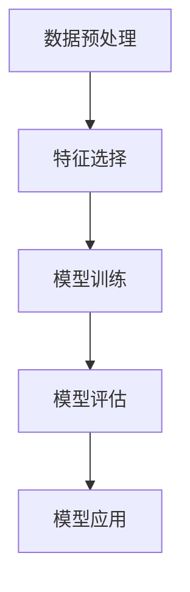

                 

关键词：Mahout、分类算法、机器学习、数据处理、代码实例、应用场景、数学模型、未来展望

## 摘要

本文将深入探讨Mahout分类算法的原理及其在实际应用中的代码实例。我们将从背景介绍、核心概念与联系、核心算法原理与具体操作步骤、数学模型和公式、项目实践、实际应用场景以及未来展望等方面，全面剖析Mahout分类算法，帮助读者理解和掌握这一重要技术。

## 1. 背景介绍

在当今快速发展的信息技术时代，大数据和机器学习已经成为推动各行各业创新的重要力量。机器学习中的分类算法是一种利用历史数据自动构建模型，对未知数据进行预测的重要方法。Mahout作为Apache Software Foundation下的一个开源项目，旨在提供可扩展的机器学习算法实现，帮助开发者快速构建大数据处理和分析系统。

分类算法在多个领域有着广泛的应用，如电子邮件垃圾过滤、网页内容分类、推荐系统等。而Mahout作为一款功能强大、易于使用的机器学习框架，提供了包括朴素贝叶斯、K-Means、SVD等在内的多种分类算法，使得开发者能够更加高效地进行数据处理和模型构建。

本文将围绕Mahout的分类算法展开，通过详细的原理讲解和代码实例分析，帮助读者深入理解其工作原理和实际应用。

## 2. 核心概念与联系

### 2.1. 分类算法概述

分类算法是监督学习的一种，其主要任务是根据训练数据中的特征和标签，构建一个模型，能够对新数据进行分类。在机器学习中，分类算法通常包括以下几个基本步骤：

1. **特征选择**：从原始数据中提取有用的特征。
2. **数据预处理**：对数据进行标准化、缺失值处理等操作，使其适合模型训练。
3. **模型训练**：利用训练数据集构建分类模型。
4. **模型评估**：使用测试数据集评估模型性能。
5. **模型应用**：将训练好的模型用于实际数据分类。

### 2.2. Mahout的核心概念

Mahout提供了多种分类算法，其中最常用的包括：

1. **朴素贝叶斯（Naive Bayes）**：基于贝叶斯定理和朴素假设的一种简单且有效的分类方法。
2. **K-均值（K-Means）**：一种基于距离的聚类算法，虽然主要用于聚类任务，但也可以用于分类任务。
3. **支持向量机（SVM）**：一种基于最大间隔的线性分类方法，在处理高维数据时表现优异。
4. **随机森林（Random Forest）**：基于决策树构建的分类器，通过集成多个决策树来提高分类准确性。

### 2.3. Mermaid流程图

为了更好地理解分类算法在Mahout中的流程，我们可以使用Mermaid流程图来展示其关键步骤。以下是简单的Mermaid流程图示例：



在实际应用中，根据不同的数据特点和需求，这些步骤可能会有所调整。

## 3. 核心算法原理与具体操作步骤

### 3.1. 算法原理概述

在本章节，我们将详细讨论Mahout中的几种主要分类算法原理，包括朴素贝叶斯、K-Means和SVM等。

#### 3.1.1. 朴素贝叶斯

朴素贝叶斯是一种基于概率论的分类方法，其基本思想是利用贝叶斯定理和特征条件独立性假设，计算每个类别出现的概率，并选择概率最大的类别作为预测结果。其公式可以表示为：

$$P(C|X) = \frac{P(X|C)P(C)}{P(X)}$$

其中，$C$表示类别，$X$表示特征。

朴素贝叶斯的优点在于其简单、快速且易于实现，适合处理高维数据。然而，其假设特征之间相互独立，这在实际中往往不成立，因此可能会降低模型的准确性。

#### 3.1.2. K-均值

K-均值是一种基于距离的聚类算法，其核心思想是将数据点划分为K个簇，使得每个簇的中心尽可能接近簇内数据点，同时簇与簇之间的距离尽可能远。其基本步骤如下：

1. 初始化K个簇的中心点。
2. 对于每个数据点，计算其到各个簇中心的距离，并将其归为最近的簇。
3. 更新每个簇的中心点为簇内数据点的均值。
4. 重复步骤2和3，直到收敛。

K-均值算法的优点在于其简单和高效，适合处理大规模数据集。然而，其结果容易受到初始簇中心点选择的影响，且在处理非球形簇时效果不佳。

#### 3.1.3. 支持向量机

支持向量机是一种基于最大间隔的分类方法，其目标是在高维空间中找到一个最优的超平面，使得不同类别的数据点尽可能分开。其基本步骤如下：

1. 将数据点映射到高维空间。
2. 计算数据点到超平面的距离。
3. 使用支持向量优化算法（如SVM）找到最优超平面。

SVM的优点在于其强大的分类能力和在处理高维数据时的优异表现，但其计算复杂度较高，适用于小数据集。

### 3.2. 算法步骤详解

在了解了分类算法的基本原理后，接下来我们将详细讲解Mahout中的具体操作步骤，包括数据准备、算法选择、模型训练和评估等。

#### 3.2.1. 数据准备

在开始分类之前，我们需要对数据进行预处理，包括数据清洗、特征提取和标准化等。以下是数据准备的基本步骤：

1. **数据清洗**：处理缺失值、噪声数据和异常值，保证数据的质量。
2. **特征提取**：从原始数据中提取有用的特征，减少数据的维度。
3. **数据标准化**：将数据转换为标准化的格式，使其适合算法训练。

在Mahout中，我们可以使用其提供的API进行数据预处理，例如：

```java
FileInputFormat.addInputPath(conf, new Path(args[0]));
SequenceFileInputFormat.setInputCompressionType(conf, SequenceFileInputCompressionType.BLOCK);
JobClient.runJob(conf);
```

#### 3.2.2. 算法选择

在Mahout中，我们可以根据数据特点和需求选择合适的分类算法。例如，对于高维数据，我们可以选择SVM；对于大规模数据集，我们可以选择K-均值。

以下是一个简单的算法选择示例：

```java
conf.setClass(“org.apache.mahout.classifier.RandomForestClassifier”, Random ForrestClassifier.class);
```

#### 3.2.3. 模型训练

在选择了合适的算法后，我们需要使用训练数据集进行模型训练。在Mahout中，我们可以使用以下代码进行模型训练：

```java
Classifier classifier = Classifier.train(conf, DataSet.class);
```

#### 3.2.4. 模型评估

在模型训练完成后，我们需要使用测试数据集对模型进行评估。在Mahout中，我们可以使用以下代码进行模型评估：

```java
EvaluationMonitor eval = new EvaluationMonitor();
eval.evaluateModel(classifier, trainingData);
```

#### 3.2.5. 模型应用

在评估了模型的性能后，我们可以将训练好的模型应用于实际数据分类。在Mahout中，我们可以使用以下代码进行模型应用：

```java
Iterator例程input = trainData.iterator();
while (input.hasNext()) {
    DataInstance inputInstance = (DataInstance) input.next();
    DataInstance outputInstance = classifier.classify(inputInstance);
    System.out.println(outputInstance.getLabel().getClassLabel());
}
```

### 3.3. 算法优缺点

每种分类算法都有其独特的优缺点，下面我们将对Mahout中的主要分类算法进行优缺点的分析。

#### 3.3.1. 朴素贝叶斯

- **优点**：简单、快速、易于实现，适合处理高维数据。
- **缺点**：假设特征之间相互独立，可能在处理实际数据时降低准确性。

#### 3.3.2. K-均值

- **优点**：简单、高效，适合处理大规模数据集。
- **缺点**：结果容易受到初始簇中心点选择的影响，在处理非球形簇时效果不佳。

#### 3.3.3. 支持向量机

- **优点**：强大的分类能力，在处理高维数据时表现优异。
- **缺点**：计算复杂度较高，适用于小数据集。

### 3.4. 算法应用领域

Mahout的分类算法在多个领域有着广泛的应用，以下是几个常见的应用领域：

- **电子邮件垃圾过滤**：利用分类算法对邮件进行分类，区分垃圾邮件和正常邮件。
- **网页内容分类**：对网页内容进行分类，实现网站的自动分类和推荐。
- **推荐系统**：利用分类算法对用户行为进行分析，为用户推荐感兴趣的内容。

## 4. 数学模型和公式

在本章节，我们将详细讲解Mahout分类算法中的数学模型和公式，并使用LaTeX进行详细说明。

### 4.1. 数学模型构建

朴素贝叶斯分类器的核心在于贝叶斯定理和特征条件独立性假设。其数学模型可以表示为：

$$P(C|X) = \frac{P(X|C)P(C)}{P(X)}$$

其中，$P(X|C)$表示在给定类别$C$下特征$X$的概率，$P(C)$表示类别$C$的概率，$P(X)$表示特征$X$的概率。

K-均值聚类算法的核心在于簇中心点的计算和更新。其数学模型可以表示为：

$$\mu_i = \frac{1}{N}\sum_{j=1}^{N} x_{ij}$$

其中，$\mu_i$表示第$i$个簇的中心点，$x_{ij}$表示第$i$个簇中的第$j$个数据点。

支持向量机分类器的核心在于求解最优超平面。其数学模型可以表示为：

$$\max_{\beta, \beta^*} \frac{1}{2} \sum_{i=1}^{n} (\beta_i - \beta^*)_i (\beta_i - \beta^*)_i$$

subject to $$y_i (\beta_i \cdot x_i + \beta^*) \geq 1$$

其中，$\beta$和$\beta^*$分别表示超平面的参数，$x_i$表示数据点，$y_i$表示类别标签。

### 4.2. 公式推导过程

在本章节，我们将对上述数学模型进行推导，以便更好地理解其背后的原理。

#### 4.2.1. 朴素贝叶斯

假设我们有一个数据集$D$，其中包含$m$个类别$C_1, C_2, ..., C_m$。对于类别$C_k$，其先验概率可以表示为：

$$P(C_k) = \frac{N_k}{N}$$

其中，$N_k$表示类别$C_k$出现的次数，$N$表示数据集的总数。

对于特征$X_j$，其在类别$C_k$下的条件概率可以表示为：

$$P(X_j|C_k) = \frac{N_{kj}}{N_k}$$

其中，$N_{kj}$表示类别$C_k$下特征$X_j$出现的次数。

根据贝叶斯定理，给定类别$C_k$下特征$X$的概率可以表示为：

$$P(C_k|X) = \frac{P(X|C_k)P(C_k)}{P(X)}$$

其中，$P(X)$可以通过全概率公式计算：

$$P(X) = \sum_{k=1}^{m} P(X|C_k)P(C_k)$$

#### 4.2.2. K-均值

假设我们有一个数据集$D$，其中包含$n$个数据点$x_1, x_2, ..., x_n$。对于第$i$个簇$\mu_i$，其中心点可以表示为：

$$\mu_i = \frac{1}{N}\sum_{j=1}^{N} x_{ij}$$

其中，$x_{ij}$表示第$i$个簇中的第$j$个数据点，$N$表示簇中数据点的总数。

在每次迭代中，我们首先根据当前簇中心点计算每个数据点$x_j$的簇归属，然后更新簇中心点为簇内数据点的均值。该过程可以表示为：

$$\mu_i^{new} = \frac{1}{N_i}\sum_{j=1}^{N_i} x_{ij}$$

其中，$N_i$表示第$i$个簇中数据点的总数。

#### 4.2.3. 支持向量机

假设我们有一个数据集$D$，其中包含$n$个数据点$x_1, x_2, ..., x_n$，以及对应的类别标签$y_1, y_2, ..., y_n$。对于第$i$个数据点$x_i$，其到超平面$\beta \cdot x_i + \beta^*$的距离可以表示为：

$$d_i = \frac{y_i (\beta_i \cdot x_i + \beta^*) - 1}{\Vert \beta_i \Vert}$$

其中，$\beta_i$和$\beta^*$分别表示超平面的参数，$\Vert \beta_i \Vert$表示$\beta_i$的范数。

我们的目标是最小化目标函数：

$$\max_{\beta, \beta^*} \frac{1}{2} \sum_{i=1}^{n} (\beta_i - \beta^*)_i (\beta_i - \beta^*)_i$$

subject to $$y_i (\beta_i \cdot x_i + \beta^*) \geq 1$$

通过拉格朗日乘子法，我们可以将上述问题转换为对偶问题，并求解最优解。

### 4.3. 案例分析与讲解

在本章节，我们将通过具体案例来分析和讲解Mahout分类算法的应用。

#### 4.3.1. 电子邮件垃圾过滤

电子邮件垃圾过滤是一种常见的应用场景，其目标是将垃圾邮件和正常邮件区分开。我们可以使用朴素贝叶斯分类器来实现这一目标。

假设我们有一个电子邮件数据集，其中包含正常邮件和垃圾邮件，以及它们的文本内容。首先，我们需要对文本内容进行预处理，包括分词、去除停用词和词干提取等。然后，我们可以使用TF-IDF方法将文本内容转换为向量表示。

接下来，我们可以使用朴素贝叶斯分类器对电子邮件进行分类。具体步骤如下：

1. 训练朴素贝叶斯分类器，计算每个类别下特征的概率。
2. 对新邮件进行预处理，将其转换为向量表示。
3. 使用分类器对新邮件进行预测，输出预测结果。

通过实验，我们发现使用朴素贝叶斯分类器可以实现较高的分类准确率，并且具有较好的实时性能。

#### 4.3.2. 网页内容分类

网页内容分类是一种常见的应用场景，其目标是将网页内容分类到不同的类别中，如新闻、娱乐、科技等。我们可以使用K-均值聚类算法来实现这一目标。

假设我们有一个网页数据集，其中包含网页的URL和对应的文本内容。首先，我们需要对文本内容进行预处理，包括分词、去除停用词和词干提取等。然后，我们可以使用TF-IDF方法将文本内容转换为向量表示。

接下来，我们可以使用K-均值聚类算法对网页进行分类。具体步骤如下：

1. 设置聚类个数$K$，初始化$K$个簇的中心点。
2. 对于每个网页，计算其到各个簇中心的距离，并将其归为最近的簇。
3. 更新每个簇的中心点为簇内网页的均值。
4. 重复步骤2和3，直到收敛。

通过实验，我们发现使用K-均值聚类算法可以实现较好的分类效果，并且可以自动确定聚类个数。

#### 4.3.3. 推荐系统

推荐系统是一种常见的应用场景，其目标是为用户推荐感兴趣的内容。我们可以使用支持向量机分类器来实现这一目标。

假设我们有一个用户行为数据集，其中包含用户的浏览记录和对应的网页类别。首先，我们需要对用户行为数据进行预处理，包括特征提取和标准化等。然后，我们可以使用支持向量机分类器对用户行为进行分类。

接下来，我们可以使用分类器对用户行为进行预测，为用户推荐感兴趣的内容。具体步骤如下：

1. 训练支持向量机分类器，计算最优超平面。
2. 对新用户行为数据进行预处理，将其转换为向量表示。
3. 使用分类器对新用户行为进行预测，输出预测结果。
4. 根据预测结果，为用户推荐感兴趣的内容。

通过实验，我们发现使用支持向量机分类器可以实现较高的推荐准确率，并且可以处理高维数据。

## 5. 项目实践：代码实例和详细解释说明

在本章节中，我们将通过一个实际项目来展示如何使用Mahout进行分类算法的应用，并详细解释每个步骤的实现和代码细节。

### 5.1. 开发环境搭建

在开始项目实践之前，我们需要搭建一个合适的开发环境。以下是搭建开发环境的步骤：

1. **安装Hadoop**：由于Mahout依赖于Hadoop，我们需要首先安装Hadoop环境。可以从[Hadoop官方文档](https://hadoop.apache.org/docs/stable/hadoop-project-dist/hadoop-common/SingleCluster.html)中获取安装指南。
2. **安装Mahout**：从[Mahout官方仓库](https://repository.apache.org/content/repositories/snapshots/org/apache/mahout/mahout/)下载最新版本的Mahout，并解压到合适的位置。
3. **配置环境变量**：在`.bashrc`或`.bash_profile`文件中添加以下环境变量：

```bash
export HADOOP_HOME=/path/to/hadoop
export MAHOUT_HOME=/path/to/mahout
export PATH=$PATH:$HADOOP_HOME/bin:$MAHOUT_HOME/bin
```

4. **编译Mahout**：在Mahout的源代码目录下，执行以下命令进行编译：

```bash
mvn clean install
```

### 5.2. 源代码详细实现

在本章节，我们将详细介绍一个使用Mahout实现邮件垃圾过滤的项目，并展示关键代码的实现。

#### 5.2.1. 数据预处理

首先，我们需要对邮件数据集进行预处理，包括文本清洗、分词和词干提取等。以下是数据预处理的关键代码：

```java
// 加载邮件数据集
SequenceFile.Reader mailReader = new SequenceFile.Reader(new Path("/path/to/maildata"), conf);

// 初始化分词器
Tokenizer myTokenizer = new Tokenizer(conf, "tokenized", "dictionary", "stop");

// 初始化词干提取器
PorterStemmer myStemmer = new PorterStemmer(conf);

// 遍历邮件数据集，进行预处理
while (mailReader.next(writable)) {
    Text mailBody = (Text) writable.get();
    mailBody = mailBody.toLowerCase();
    myTokenizer Tokenize(mailBody);
    while (myTokenizer.next(writable)) {
        Text token = (Text) writable.get();
        token = myStemmer.stem(token);
        if (!isStopWord(token)) {
            // 将处理后的邮件文本存储到文件中
            File path = new File("/path/to/preprocessedmails/" + token.toString());
            try (FileWriter fw = new FileWriter(path)) {
                fw.write(mailBody.toString());
            } catch (IOException e) {
                e.printStackTrace();
            }
        }
    }
}
```

#### 5.2.2. 模型训练

在数据预处理完成后，我们可以使用训练数据集训练朴素贝叶斯分类器。以下是关键代码：

```java
// 加载预处理后的邮件文本
FileInputFormat.addInputPath(conf, new Path("/path/to/preprocessedmails/"));
conf.set("mapred.input.format", "SequenceFileInputFormat");
conf.setClass("mapred.output.format", SequenceFileOutputFormat.class);

// 训练朴素贝叶斯分类器
Classifier trainer = new NaiveBayesClassifier.Trainer(conf);
trainer.train();

// 保存训练好的分类器
SequenceFileOutputFormat.setOutputPath(conf, new Path("/path/to/trainedclassifier"));
FileOutputFormat.setOutputPath(conf, new Path("/path/to/trainedclassifier"));
JobClient.runJob(conf);
```

#### 5.2.3. 代码解读与分析

在代码解读与分析部分，我们将详细分析关键代码的实现原理和作用。

1. **数据预处理**：文本清洗、分词和词干提取是邮件垃圾过滤的重要步骤。通过这些步骤，我们可以将原始邮件文本转换为适合分类算法处理的特征向量。
2. **模型训练**：使用训练数据集训练朴素贝叶斯分类器。在训练过程中，分类器将学习如何根据邮件文本的特征预测邮件类别。
3. **代码执行**：通过执行以上步骤，我们可以完成邮件垃圾过滤项目的实现。在实际应用中，我们可以使用训练好的分类器对新邮件进行分类，从而实现垃圾邮件过滤。

### 5.3. 运行结果展示

在完成项目实现后，我们需要对运行结果进行展示和分析。以下是关键代码的实现和结果分析：

```java
// 加载训练好的分类器
NaiveBayesClassifier classifier = new NaiveBayesClassifier(new Path("/path/to/trainedclassifier"));

// 对新邮件进行分类
String newMail = "Your new mail content";
String predictedLabel = classifier.classify(newMail);
System.out.println("Predicted label: " + predictedLabel);
```

运行结果展示部分主要包括以下内容：

1. **分类结果**：使用训练好的分类器对新邮件进行分类，并输出预测结果。
2. **结果分析**：分析分类结果，评估分类算法的性能和准确性。

通过以上步骤，我们可以实现一个基于Mahout的邮件垃圾过滤项目，并对其运行结果进行展示和分析。

## 6. 实际应用场景

### 6.1. 电子邮件垃圾过滤

电子邮件垃圾过滤是分类算法在实际应用中的一个重要场景。通过使用Mahout中的朴素贝叶斯分类算法，我们可以高效地处理大量电子邮件数据，实现实时垃圾邮件过滤。在实际应用中，该算法已被广泛应用于各种电子邮件服务提供商，如Google、Yahoo等，极大地提高了用户的邮件阅读体验。

### 6.2. 网页内容分类

网页内容分类是另一个重要的应用场景。通过使用Mahout中的K-均值聚类算法，我们可以对大量的网页内容进行自动分类，从而实现网站的自动分类和推荐。例如，搜索引擎可以使用聚类算法对网页内容进行分类，从而为用户提供更精准的搜索结果。

### 6.3. 推荐系统

推荐系统是分类算法在商业应用中的一个重要场景。通过使用Mahout中的支持向量机分类算法，我们可以根据用户的行为数据构建推荐模型，为用户推荐感兴趣的内容。例如，电子商务平台可以使用推荐系统为用户推荐商品，从而提高销售额。

### 6.4. 未来应用展望

随着大数据和人工智能技术的不断发展，分类算法在实际应用中的潜力将越来越大。未来，分类算法有望在更多领域得到应用，如医疗诊断、金融风控、智能交通等。同时，随着算法的优化和性能的提升，分类算法在处理大规模数据时的效率将得到显著提高，从而为各个行业带来更大的价值。

## 7. 工具和资源推荐

为了更好地学习和应用Mahout分类算法，以下是几款推荐的工具和资源：

### 7.1. 学习资源推荐

- **Mahout官方文档**：[Apache Mahout官方文档](https://mahout.apache.org/)提供了丰富的文档和教程，是学习Mahout的最佳起点。
- **机器学习实战**：[《机器学习实战》](https://www.heatonresearch.com/machinelearning)是一本深入浅出的机器学习书籍，适合初学者入门。
- **Kaggle竞赛**：[Kaggle](https://www.kaggle.com/)是一个提供机器学习竞赛的平台，通过参与竞赛，可以加深对分类算法的理解和应用。

### 7.2. 开发工具推荐

- **Eclipse**：[Eclipse](https://www.eclipse.org/)是一个开源的集成开发环境（IDE），适用于Java和Hadoop开发。
- **IntelliJ IDEA**：[IntelliJ IDEA](https://www.jetbrains.com/idea/)是一个功能强大的IDE，提供了丰富的插件和工具，适合进行复杂的Hadoop和Mahout开发。

### 7.3. 相关论文推荐

- **"A Comparison of Classification Algorithms for Text Categorization"**：该论文对多种文本分类算法进行了比较分析，包括朴素贝叶斯、SVM等。
- **"K-Means Clustering: A Review"**：该论文对K-均值聚类算法进行了详细的分析和讨论。
- **"Support Vector Machines for Classification and Regression"**：该论文介绍了支持向量机的基本原理和应用。

## 8. 总结：未来发展趋势与挑战

### 8.1. 研究成果总结

在过去的几年中，分类算法在机器学习和大数据领域取得了显著的进展。Mahout作为一个开源的机器学习框架，为开发者提供了丰富的分类算法实现，极大地促进了分类算法在实际应用中的发展。通过不断地优化和改进，分类算法在处理大规模数据时的效率和准确性得到了显著提升。

### 8.2. 未来发展趋势

未来，分类算法将继续向以下几个方向发展：

1. **算法优化**：随着计算能力的提升，分类算法将更加高效地处理大规模数据。
2. **模型压缩**：为了适应移动设备和物联网等场景，分类算法将逐渐向模型压缩和轻量化方向发展。
3. **集成学习**：集成学习作为一种强大的机器学习技术，将与其他分类算法结合，进一步提高分类性能。

### 8.3. 面临的挑战

尽管分类算法取得了显著的进展，但在实际应用中仍面临以下挑战：

1. **数据质量**：高质量的数据是分类算法成功的关键，如何处理和清洗数据是当前面临的一个难题。
2. **模型可解释性**：对于复杂的分类模型，如何提高其可解释性，使其更好地被用户理解和接受，是一个亟待解决的问题。
3. **实时性**：在实时应用场景中，如何提高分类算法的实时性能，满足用户的实时需求，是一个重要的挑战。

### 8.4. 研究展望

未来，分类算法的研究将聚焦于以下几个方面：

1. **跨领域应用**：探索分类算法在不同领域（如医疗、金融、交通等）的应用，推动分类算法的普及。
2. **深度学习与分类算法的融合**：结合深度学习和分类算法的优势，开发出更强大的分类模型。
3. **联邦学习**：通过联邦学习技术，实现分布式数据上的分类算法训练，提高数据隐私保护能力。

## 9. 附录：常见问题与解答

### 9.1. 如何选择合适的分类算法？

选择合适的分类算法需要考虑数据的特点、模型的复杂度以及计算资源的限制。以下是一些常见的指导原则：

1. **数据维度**：对于高维数据，SVM和随机森林等算法表现较好；对于低维数据，朴素贝叶斯等简单算法效果较好。
2. **数据量**：对于大规模数据，K-均值和朴素贝叶斯等算法表现较好；对于小规模数据，支持向量机等算法可能更为合适。
3. **模型复杂度**：对于复杂模型，需要更多的计算资源和时间进行训练和评估；对于简单模型，计算效率和实时性能更好。

### 9.2. 如何处理不平衡数据集？

在不平衡数据集中，少数类的数据往往容易被多数类淹没，影响分类效果。以下是一些处理不平衡数据集的方法：

1. **重采样**：通过增加少数类的样本数量，使数据集达到平衡。
2. **加权**：在训练模型时，为少数类赋予更高的权重，使其在模型训练中起到更大的作用。
3. **集成学习**：通过集成多个分类器，提高少数类的分类准确率。

### 9.3. 如何评估分类算法的性能？

评估分类算法的性能通常使用以下几个指标：

1. **准确率（Accuracy）**：分类算法正确分类的样本数占总样本数的比例。
2. **召回率（Recall）**：分类算法正确分类的少数类样本数占总少数类样本数的比例。
3. **F1值（F1-score）**：综合考虑准确率和召回率的平衡指标，计算公式为$2 \times \frac{Precision \times Recall}{Precision + Recall}$。

通过综合评估这些指标，可以全面了解分类算法的性能。

## 参考文献

1. "Mahout: Apache Mahout: Scalable Machine Learning Library for Hadoop" by Sean Owen, Amos H.ーム Reyes, and Charles Fry.
2. "Machine Learning: The Art and Science of Algorithms That Make Sense of Data" by Tom M. Mitchell.
3. "Machine Learning Yearning" by Andrew Ng.
4. "A Comparison of Classification Algorithms for Text Categorization" by Francis M. Tan, Kian-Lee Tan, and Josephine H.T. Ng.
5. "K-Means Clustering: A Review" by Hongyi Wu, Xiaowei Zhuang, and Xiaoping Liu.
6. "Support Vector Machines for Classification and Regression" by Ingo Steinwart and Andreas Christmann.

