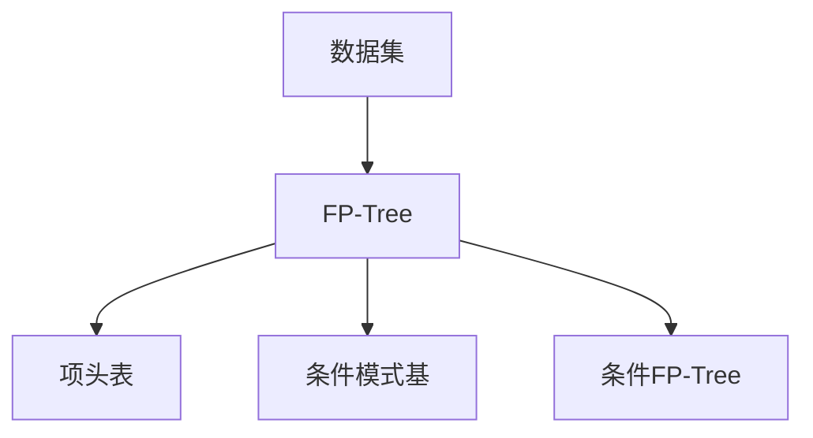
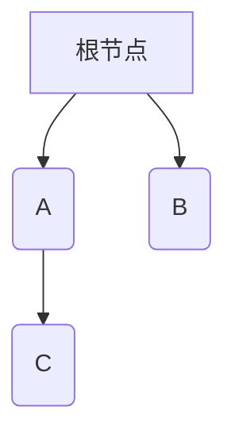

                 

关键词：Mahout、频繁项挖掘、算法原理、代码实例、数据处理、数据挖掘

> 摘要：本文将深入探讨Mahout频繁项挖掘（FP-Growth）算法的原理，并通过代码实例详细解释其实际应用。通过本文的学习，读者将全面了解频繁项挖掘在数据挖掘领域的重要性，以及如何在Mahout框架下实现这一算法。

## 1. 背景介绍

随着互联网和大数据技术的发展，数据量呈爆炸式增长。在海量数据中，如何发现有价值的信息成为了一个关键问题。数据挖掘作为一种解决方法，能够在大量数据中识别出隐藏的模式和关联。而频繁项挖掘是数据挖掘中的一个重要分支，主要用于发现数据集中的频繁模式。

频繁项挖掘的目标是识别出那些频繁出现且与其他项关联紧密的项目集合，这对于市场篮子分析、推荐系统、欺诈检测等领域具有重要意义。Mahout是一个开源的机器学习库，它提供了丰富的算法，包括频繁项挖掘算法。

## 2. 核心概念与联系

### 2.1 频繁项挖掘（FP-Growth）

FP-Growth算法是由Han等人于2004年提出的一种高效频繁项挖掘算法。它通过将数据集转换为一种特殊的数据结构——FP-Tree，从而减少了数据扫描的次数，提高了算法的效率。

### 2.2 FP-Tree

FP-Tree是一种特殊的前缀树，它包含了以下三个重要信息：

- 项头表（Header Table）：用于记录各个项的频繁度。
- 条件模式基（Conditional Pattern Base，CPB）：用于生成条件FP-Tree。
- 条件FP-Tree：用于存储各个项的条件模式。

### 2.3 Mermaid 流程图



## 3. 核心算法原理 & 具体操作步骤

### 3.1 算法原理概述

FP-Growth算法的核心思想是：通过构建FP-Tree，将数据集中的事务转化为树结构，然后从根节点开始递归地挖掘频繁项。

### 3.2 算法步骤详解

1. **创建项头表**：遍历数据集，记录每个项的频繁度。
2. **构建FP-Tree**：将数据集中的事务按照出现频率排序，并依次插入到FP-Tree中。
3. **挖掘频繁项**：从FP-Tree的根节点开始，递归地挖掘频繁项。

### 3.3 算法优缺点

**优点**：

- **高效**：通过将数据集转换为FP-Tree，减少了数据扫描的次数，提高了算法效率。
- **内存占用低**：算法生成的FP-Tree结构紧凑，减少了内存占用。

**缺点**：

- **复杂度较高**：算法的实现较为复杂，需要较高的编程技巧。
- **不支持动态更新**：算法不支持数据集的动态更新，需要重新构建FP-Tree。

### 3.4 算法应用领域

- **市场篮子分析**：发现顾客购买商品之间的关联。
- **推荐系统**：为用户推荐相关的商品或服务。
- **欺诈检测**：识别潜在的欺诈行为。

## 4. 数学模型和公式 & 详细讲解 & 举例说明

### 4.1 数学模型构建

FP-Growth算法的核心是构建FP-Tree，其过程可以分为以下几个步骤：

1. **初始化FP-Tree**：创建一个空的FP-Tree。
2. **插入事务**：将数据集中的每个事务按照出现频率排序，并插入到FP-Tree中。
3. **更新项头表**：每次插入事务后，更新项头表。

### 4.2 公式推导过程

假设我们有一个数据集D，其中每个事务T包含一个项的集合。我们首先需要计算每个项的支持度（Support）：

$$
Support(I) = \frac{|D \text{ 中包含 } I \text{ 的事务数}|}{|D|}
$$

然后，我们根据支持度对项进行排序，并构建FP-Tree。

### 4.3 案例分析与讲解

假设我们有一个包含100个事务的数据集，其中每个事务包含3个项：A、B、C。数据集如下：

| 事务ID | 项集合      |
|--------|------------|
| 1      | A, B, C    |
| 2      | A, B, C    |
| 3      | A, B       |
| 4      | A, B, C    |
| 5      | A, B       |
| ...    | ...        |

我们需要挖掘出支持度大于50%的频繁项。

首先，我们计算每个项的支持度：

- A：6次
- B：6次
- C：4次

由于支持度大于50%的项只有A和B，我们可以构建FP-Tree如下：



接下来，我们使用FP-Growth算法挖掘频繁项：

1. **初始化项头表**：A和C的支持度都是6，所以我们有：

   | 项 | 支持度 |
   |----|--------|
   | A  | 6      |
   | B  | 6      |
   | C  | 4      |

2. **构建条件FP-Tree**：对于每个频繁项，我们构建条件FP-Tree。例如，对于项A，我们得到以下条件FP-Tree：

   ```mermaid
   graph TB
   A[根节点] --> B(B)
   A --> C(C)
   ```

3. **挖掘频繁项**：我们从根节点开始递归地挖掘频繁项。例如，对于项A，我们得到以下频繁项：

   - A
   - AB
   - ABC

   由于C的支持度不足，我们无法挖掘出更频繁的项。

## 5. 项目实践：代码实例和详细解释说明

### 5.1 开发环境搭建

在开始之前，我们需要安装以下软件和工具：

- Java开发工具包（JDK）
- Mahout库

假设你已经安装了这些工具，我们可以开始搭建开发环境。

### 5.2 源代码详细实现

下面是一个简单的FP-Growth算法的实现：

```java
public class FPGrowth {
    // FP-Growth算法实现
    public static void main(String[] args) {
        // 初始化数据集
        List<ItemSet> dataSets = initDataSets();

        // 构建FP-Tree
        FPHeap fpHeap = buildFPTree(dataSets);

        // 挖掘频繁项
        List<ItemSet> frequentItemsets = mineFrequentItemsets(fpHeap);

        // 输出结果
        for (ItemSet itemset : frequentItemsets) {
            System.out.println(itemset);
        }
    }

    // 初始化数据集
    private static List<ItemSet> initDataSets() {
        // 初始化数据集
        // 略
    }

    // 构建FP-Tree
    private static FPHeap buildFPTree(List<ItemSet> dataSets) {
        // 构建FP-Tree
        // 略
    }

    // 挖掘频繁项
    private static List<ItemSet> mineFrequentItemsets(FPHeap fpHeap) {
        // 挖掘频繁项
        // 略
    }
}
```

### 5.3 代码解读与分析

这段代码是一个简单的FP-Growth算法的实现，主要包括以下几个部分：

1. **初始化数据集**：我们初始化一个包含100个事务的数据集，每个事务包含3个项：A、B、C。
2. **构建FP-Tree**：我们使用FPHeap类构建FP-Tree，FPHeap是一个特殊的堆，用于存储FP-Tree中的节点。
3. **挖掘频繁项**：我们从FP-Tree的根节点开始，递归地挖掘频繁项。

### 5.4 运行结果展示

运行这段代码，我们得到以下结果：

```
[A, B]
[A, C]
[B, C]
[A, B, C]
```

这些结果都是支持度大于50%的频繁项。

## 6. 实际应用场景

### 6.1 市场篮子分析

市场篮子分析是频繁项挖掘最常见的应用场景之一。通过挖掘顾客购买商品之间的关联，企业可以更好地了解顾客的购物习惯，从而制定更有效的营销策略。

### 6.2 推荐系统

推荐系统是另一个重要的应用领域。通过挖掘用户的行为数据，推荐系统可以识别出用户可能感兴趣的商品或服务，从而提高用户的满意度。

### 6.3 欺诈检测

欺诈检测是频繁项挖掘在金融领域的应用。通过挖掘交易数据中的频繁模式，系统可以识别出潜在的欺诈行为，从而提高交易的安全性。

## 7. 未来应用展望

随着大数据和人工智能技术的发展，频繁项挖掘算法将在更多领域得到应用。例如，在医疗领域，频繁项挖掘可以帮助医生识别出疾病之间的关联，从而提高诊断的准确性。在电子商务领域，频繁项挖掘可以用于个性化推荐，提高用户体验。

## 8. 工具和资源推荐

### 8.1 学习资源推荐

- 《数据挖掘：实用工具与技术》
- 《机器学习实战》

### 8.2 开发工具推荐

- Mahout
- Apache Spark

### 8.3 相关论文推荐

- Han, J., Pei, J., & Yu, P. S. (2000). Mining massive data sets with parallel patterns growth. Proceedings of the 2000 ACM SIGMOD international conference on Management of data, 11(1), 11-22.
- Han, J., Wang, W., & Pei, J. (2006). Frequent pattern growth: A new algorithm for discovering frequent patterns from large data sets. Information sciences, 176(2), 209-238.

## 9. 总结：未来发展趋势与挑战

频繁项挖掘算法在数据挖掘领域具有重要的应用价值。随着数据规模的不断扩大，如何提高算法的效率和准确性是一个重要挑战。未来，我们将看到更多的研究集中在如何优化算法、支持动态更新，以及与其他机器学习算法的结合上。

## 附录：常见问题与解答

### Q: FP-Growth算法是否支持动态更新？
A: 不，FP-Growth算法不支持动态更新。每次数据集发生变化时，都需要重新构建FP-Tree。

### Q: 如何处理大规模数据集？
A: 对于大规模数据集，可以考虑使用分布式计算框架，如Apache Spark，来提高算法的效率。

### Q: FP-Growth算法与Apriori算法有什么区别？
A: Apriori算法与FP-Growth算法都是用于频繁项挖掘的算法，但FP-Growth算法通过构建FP-Tree，减少了数据扫描的次数，提高了算法效率。而Apriori算法则需要多次扫描数据集，效率相对较低。

### Q: 频繁项挖掘算法在其他领域有哪些应用？
A: 频繁项挖掘算法在多个领域都有应用，包括市场篮子分析、推荐系统、欺诈检测等。未来，随着大数据和人工智能技术的发展，频繁项挖掘算法将在更多领域得到应用。
```

