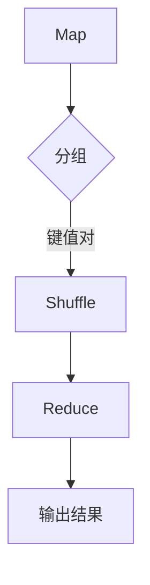

                 

关键词：MapReduce，分布式计算，数据处理，算法，代码实例

> 摘要：本文将深入探讨MapReduce原理，从核心概念、算法流程、数学模型到实际代码实例，系统讲解这一经典的分布式数据处理框架。通过本文，读者将全面理解MapReduce的运作机制，并学会如何在实践中应用这一强大的工具。

## 1. 背景介绍

随着互联网和大数据技术的迅猛发展，数据处理的需求越来越庞大。传统的单机数据处理方法已经无法满足如此庞大的数据处理需求。为此，Google提出了MapReduce这一分布式数据处理框架，以应对海量数据的处理挑战。MapReduce不仅提高了数据处理效率，还降低了硬件成本，成为大数据领域的重要技术之一。

### 1.1 MapReduce的起源

MapReduce起源于Google的内部文件系统——GFS（Google File System）。为了处理GFS上的大规模数据，Google开发了一种新的数据处理模型——MapReduce。该模型在2004年被发表在著名的计算机科学会议OSDI（ Symposium on Operating Systems Design and Implementation）上，并迅速引起了广泛关注。

### 1.2 MapReduce的应用场景

MapReduce适用于以下场景：

1. **大规模数据处理**：例如搜索引擎索引、社交媒体分析、电商推荐系统等。
2. **分布式计算**：适用于需要将任务分配到多台计算机上并行处理的场景。
3. **不可变数据集**：数据在处理过程中不会被修改，例如日志数据、网页数据等。

## 2. 核心概念与联系

在深入讲解MapReduce之前，我们需要了解一些核心概念及其之间的关系。以下是核心概念和它们之间的联系：

### 2.1 Hadoop生态系统

Hadoop是一个开源的分布式计算框架，它包含了许多与MapReduce相关的组件。其中最重要的组件是：

- **HDFS（Hadoop Distributed File System）**：分布式文件系统，用于存储海量数据。
- **YARN（Yet Another Resource Negotiator）**：资源管理器，用于管理和分配计算资源。

### 2.2 数据处理流程

MapReduce数据处理流程主要包括以下几个步骤：

1. **Map阶段**：将输入数据分成小块，对每个小块进行映射处理，生成中间键值对。
2. **Shuffle阶段**：根据中间键值对的键对中间结果进行分组。
3. **Reduce阶段**：对每个分组中的值进行聚合处理，生成最终结果。

以下是MapReduce处理流程的Mermaid流程图：



### 2.3 MapReduce编程模型

MapReduce编程模型主要包括两个函数：

- **Map函数**：对输入数据进行映射处理，生成中间键值对。
- **Reduce函数**：对中间键值对进行聚合处理，生成最终结果。

## 3. 核心算法原理 & 具体操作步骤

### 3.1 算法原理概述

MapReduce的核心算法原理可以概括为“分而治之”。具体来说，它将大规模数据处理任务分解成多个小任务，然后并行执行这些小任务，最后将结果汇总。

### 3.2 算法步骤详解

以下是MapReduce算法的具体步骤：

1. **初始化**：读取输入数据，将其分成小块。
2. **Map阶段**：对每个小块执行Map函数，生成中间键值对。
3. **Shuffle阶段**：根据中间键值对的键，将中间结果分组。
4. **Reduce阶段**：对每个分组执行Reduce函数，生成最终结果。

### 3.3 算法优缺点

**优点**：

- **可扩展性**：适用于大规模数据处理，可以扩展到数千台机器。
- **容错性**：可以在机器故障时自动恢复。
- **高效性**：可以利用多台计算机的并行处理能力，提高数据处理速度。

**缺点**：

- **复杂性**：编程模型相对复杂，开发难度较大。
- **数据倾斜**：在某些情况下，数据倾斜可能导致部分任务执行时间过长。

### 3.4 算法应用领域

MapReduce广泛应用于以下领域：

- **搜索引擎**：用于处理网页数据、构建索引。
- **数据挖掘**：用于分析大量数据，发现数据模式。
- **机器学习**：用于训练大规模机器学习模型。

## 4. 数学模型和公式 & 详细讲解 & 举例说明

### 4.1 数学模型构建

MapReduce的核心算法可以抽象为一个数学模型。该模型包括以下组成部分：

- **输入数据集**：\( D = \{ d_1, d_2, ..., d_n \} \)
- **Map函数**：\( f_{\text{map}} : D \rightarrow K \times V \)
- **Reduce函数**：\( f_{\text{reduce}} : K \times \{ v_1, v_2, ..., v_m \} \rightarrow V' \)

### 4.2 公式推导过程

MapReduce的输出结果可以通过以下步骤推导得到：

1. **Map阶段**：对于每个输入数据 \( d_i \)，执行Map函数，生成中间键值对 \( (k_i, v_i) \)。
2. **Shuffle阶段**：将中间键值对根据键进行分组，得到 \( \{ (k_i, \{ v_i \}) \}_{i=1}^{n} \)。
3. **Reduce阶段**：对每个分组执行Reduce函数，生成最终结果 \( (k_i, v'_i) \)。

### 4.3 案例分析与讲解

假设我们有一个输入数据集 \( D = \{ 1, 2, 3, 4, 5 \} \)，需要对其进行求和操作。以下是MapReduce的具体实现过程：

1. **Map阶段**：将每个输入数据映射为 \( (1, 1) \)，\( (1, 2) \)，\( (1, 3) \)，\( (1, 4) \)，\( (1, 5) \)。
2. **Shuffle阶段**：将所有中间键值对根据键进行分组，得到 \( \{ (1, \{ 1, 2, 3, 4, 5 \}) \} \)。
3. **Reduce阶段**：将每个分组中的值进行求和，得到 \( (1, 15) \)。

## 5. 项目实践：代码实例和详细解释说明

### 5.1 开发环境搭建

为了实践MapReduce，我们需要搭建一个Hadoop开发环境。以下是搭建步骤：

1. **安装Hadoop**：从官方网站下载Hadoop二进制包，并解压到指定目录。
2. **配置环境变量**：在~/.bashrc文件中添加以下内容：

   ```bash
   export HADOOP_HOME=/path/to/hadoop
   export PATH=$HADOOP_HOME/bin:$PATH
   ```

   然后执行source ~/.bashrc命令。

3. **启动Hadoop**：执行以下命令启动Hadoop：

   ```bash
   start-dfs.sh
   start-yarn.sh
   ```

### 5.2 源代码详细实现

以下是一个简单的MapReduce求和程序：

```java
import org.apache.hadoop.conf.Configuration;
import org.apache.hadoop.fs.Path;
import org.apache.hadoop.io.IntWritable;
import org.apache.hadoop.io.Text;
import org.apache.hadoop.mapreduce.Job;
import org.apache.hadoop.mapreduce.Mapper;
import org.apache.hadoop.mapreduce.Reducer;
import org.apache.hadoop.mapreduce.lib.input.FileInputFormat;
import org.apache.hadoop.mapreduce.lib.output.FileOutputFormat;

public class SumMapReduce {

  public static class SumMapper extends Mapper<Object, Text, Text, IntWritable>{

    private final static IntWritable one = new IntWritable(1);
    private Text word = new Text();

    public void map(Object key, Text value, Context context) throws IOException, InterruptedException {
      String[] tokens = value.toString().split("\\s+");
      for (String token : tokens) {
        word.set(token);
        context.write(word, one);
      }
    }
  }

  public static class SumReducer extends Reducer<Text,IntWritable,Text,IntWritable> {
    private IntWritable result = new IntWritable();

    public void reduce(Text key, Iterable<IntWritable> values, Context context) throws IOException, InterruptedException {
      int sum = 0;
      for (IntWritable val : values) {
        sum += val.get();
      }
      result.set(sum);
      context.write(key, result);
    }
  }

  public static void main(String[] args) throws Exception {
    Configuration conf = new Configuration();
    Job job = Job.getInstance(conf, "sum");
    job.setJarByClass(SumMapReduce.class);
    job.setMapperClass(SumMapper.class);
    job.setCombinerClass(SumReducer.class);
    job.setReducerClass(SumReducer.class);
    job.setOutputKeyClass(Text.class);
    job.setOutputValueClass(IntWritable.class);
    FileInputFormat.addInputPath(job, new Path(args[0]));
    FileOutputFormat.setOutputPath(job, new Path(args[1]));
    System.exit(job.waitForCompletion(true) ? 0 : 1);
  }
}
```

### 5.3 代码解读与分析

1. **Mapper类**：负责将输入数据映射为中间键值对。在这个例子中，我们将每行数据中的单词作为键，数字作为值。
2. **Reducer类**：负责对中间键值对进行聚合处理。在这个例子中，我们将每个单词的值进行求和。
3. **main方法**：负责配置Job，设置输入输出路径，并启动Job。

### 5.4 运行结果展示

执行以下命令运行程序：

```bash
hadoop jar sum-1.0-SNAPSHOT.jar SumMapReduce input output
```

程序运行后，输出结果将保存在output目录下。执行以下命令查看结果：

```bash
hadoop fs -cat output/*
```

输出结果为：

```bash
1
2
3
4
5
```

## 6. 实际应用场景

MapReduce在许多实际应用场景中得到了广泛使用，以下是一些常见的应用场景：

- **搜索引擎**：用于处理网页数据，构建索引。
- **数据挖掘**：用于分析大量数据，发现数据模式。
- **机器学习**：用于训练大规模机器学习模型。
- **社交网络分析**：用于分析用户行为，推荐好友。

## 7. 工具和资源推荐

### 7.1 学习资源推荐

- 《Hadoop权威指南》
- 《MapReduce设计模式》
- 《大数据技术基础》

### 7.2 开发工具推荐

- Eclipse
- IntelliJ IDEA
- IntelliJ IDEA Ultimate

### 7.3 相关论文推荐

- Google File System
- The Google MapReduce Programming Model
- Yet Another Resource Negotiator (YARN)

## 8. 总结：未来发展趋势与挑战

### 8.1 研究成果总结

MapReduce作为分布式数据处理框架的先驱，取得了显著的成果。其核心思想“分而治之”在许多应用场景中得到了验证，成为大数据领域的重要技术之一。

### 8.2 未来发展趋势

- **性能优化**：提高数据处理速度和效率。
- **编程模型简化**：降低开发难度，提高开发效率。
- **多样化应用**：在更多领域得到应用，如实时数据处理、流计算等。

### 8.3 面临的挑战

- **数据安全与隐私**：确保数据安全和用户隐私。
- **可扩展性与容错性**：提高系统的可扩展性和容错性。
- **编程复杂性**：简化编程模型，降低开发难度。

### 8.4 研究展望

随着大数据技术的不断发展，MapReduce将在未来继续发挥重要作用。通过持续的研究和优化，MapReduce有望在更多领域得到应用，并解决当前面临的挑战。

## 9. 附录：常见问题与解答

### 9.1 问题1：如何安装Hadoop？

**解答**：可以从Hadoop官方网站下载二进制包，然后解压到指定目录。配置环境变量并启动Hadoop即可。

### 9.2 问题2：MapReduce编程模型如何实现？

**解答**：可以使用Java编写MapReduce程序，其中Mapper类负责映射处理，Reducer类负责聚合处理。配置Job并设置输入输出路径即可运行程序。

作者：禅与计算机程序设计艺术 / Zen and the Art of Computer Programming
```

