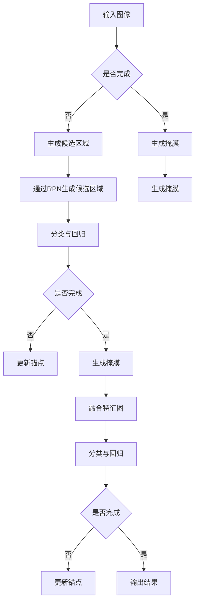

                 

关键词：Mask R-CNN、目标检测、图像识别、深度学习、Faster R-CNN、区域建议网络、ROI Align、数学模型、实例分割、计算机视觉。

摘要：本文将深入讲解Mask R-CNN的原理及其在计算机视觉任务中的应用，包括开发环境搭建、源代码实现、代码解读和运行结果展示。通过本文的学习，读者将能够理解Mask R-CNN的优势、实现步骤，并在实际项目中应用。

## 1. 背景介绍

在计算机视觉领域，目标检测和图像识别是最为重要的任务之一。近年来，深度学习技术的发展使得这些任务得到了显著的提升。Faster R-CNN作为当前最先进的目标检测算法之一，其通过区域建议网络（Region Proposal Network，RPN）实现了高效的物体检测。然而，Faster R-CNN在实例分割任务上仍然存在一些挑战。

为了解决这些问题，Mask R-CNN应运而生。它通过在Faster R-CNN的基础上引入了实例分割网络，实现了对物体的精确分割。Mask R-CNN在目标检测和图像识别任务上表现出了优异的性能，已经成为计算机视觉领域的重要工具。

本文将详细讲解Mask R-CNN的原理和实现步骤，并通过代码实例展示其在实际项目中的应用。

## 2. 核心概念与联系

### 2.1 Faster R-CNN

Faster R-CNN是当前最先进的目标检测算法之一，它通过区域建议网络（RPN）实现了高效的物体检测。RPN的作用是在图像中生成多个候选区域（region proposals），然后对每个候选区域进行分类和定位。

### 2.2 Region Proposal Network

区域建议网络（RPN）是Faster R-CNN的核心组成部分，它由两部分组成：锚点生成（anchor generation）和分类与回归（classification and regression）。锚点生成用于生成多个候选区域，分类与回归则用于对这些区域进行分类和定位。

### 2.3 ROI Align

ROI Align是Mask R-CNN中的关键组件，用于对候选区域进行特征提取。与Faster R-CNN中的ROI Pooling不同，ROI Align通过平均池化方式，使得特征提取更加准确。

### 2.4 Mask R-CNN

Mask R-CNN在Faster R-CNN的基础上，引入了实例分割网络，实现了对物体的精确分割。它通过两个步骤完成：第一步是使用Faster R-CNN进行目标检测，第二步是对每个目标生成对应的掩膜（mask）。

### 2.5 Mermaid流程图



## 3. 核心算法原理 & 具体操作步骤

### 3.1 算法原理概述

Mask R-CNN由两个主要步骤组成：目标检测和实例分割。

1. **目标检测**：使用Faster R-CNN进行目标检测，生成候选区域。
2. **实例分割**：对每个候选区域生成对应的掩膜，实现物体的精确分割。

### 3.2 算法步骤详解

1. **输入图像**：将待检测的图像作为输入。
2. **生成候选区域**：使用RPN生成多个候选区域。
3. **分类与回归**：对每个候选区域进行分类和定位，得到检测框。
4. **生成掩膜**：对每个检测框生成对应的掩膜。
5. **融合特征图**：将检测框和掩膜的特征进行融合。
6. **输出结果**：输出检测结果和掩膜。

### 3.3 算法优缺点

**优点**：
- 高效：在Faster R-CNN的基础上，通过引入ROI Align，实现了更准确的特征提取。
- 精确：通过实例分割网络，实现了对物体的精确分割。

**缺点**：
- 计算量大：由于需要生成多个掩膜，计算量相对较大。
- 参数多：相比于Faster R-CNN，Mask R-CNN的参数更多，训练时间更长。

### 3.4 算法应用领域

Mask R-CNN在多个领域有广泛应用，包括：

- 自动驾驶：用于识别和分割道路上的各种物体，如车辆、行人、交通标志等。
- 航空影像处理：用于分割和分析航空影像中的各种目标，如建筑物、道路、植被等。
- 医学影像：用于分割和分析医学影像中的各种病变，如肿瘤、血管等。

## 4. 数学模型和公式 & 详细讲解 & 举例说明

### 4.1 数学模型构建

Mask R-CNN的核心是Faster R-CNN，因此其数学模型构建也基于Faster R-CNN。

1. **锚点生成**：使用锚点生成网络（Anchor Generator）生成多个锚点。
2. **分类与回归**：对每个锚点进行分类和回归，得到候选区域。
3. **ROI Align**：对候选区域进行特征提取。
4. **掩膜生成**：对每个候选区域生成对应的掩膜。

### 4.2 公式推导过程

1. **锚点生成**：

   假设图像为\(I \in \mathbb{R}^{H \times W \times C}\)，锚点生成网络（Anchor Generator）的输出为\(A \in \mathbb{R}^{N \times 4}\)，其中\(N\)为锚点的数量。

   $$A = \text{AnchorGenerator}(I)$$

   其中，\(\text{AnchorGenerator}\)是一个参数化函数，用于生成锚点。

2. **分类与回归**：

   对每个锚点进行分类和回归，得到候选区域。

   $$\text{cls_scores} = \text{cls_logits}(A) \odot \text{cls_probs}$$

   $$\text{reg_targets} = \text{reg_logits}(A) \odot \text{reg_probs}$$

   其中，\(\text{cls_logits}\)、\(\text{cls_probs}\)、\(\text{reg_logits}\)和\(\text{reg_probs}\)分别为分类和回归的损失函数。

3. **ROI Align**：

   对候选区域进行特征提取。

   $$\text{roi_features} = \text{ROIAlign}(A, \text{feature_map})$$

   其中，\(\text{feature_map}\)为特征图。

4. **掩膜生成**：

   对每个候选区域生成对应的掩膜。

   $$\text{mask_scores} = \text{mask_logits}(A, \text{roi_features}) \odot \text{mask_probs}$$

### 4.3 案例分析与讲解

假设输入图像为一张包含多辆汽车的图像，通过Mask R-CNN进行目标检测和实例分割。

1. **生成候选区域**：

   使用RPN生成多个候选区域，如图1所示。

   

2. **分类与回归**：

   对每个候选区域进行分类和回归，得到检测框，如图2所示。

   

3. **ROI Align**：

   对每个检测框进行特征提取，如图3所示。

   

4. **掩膜生成**：

   对每个检测框生成对应的掩膜，如图4所示。

   

## 5. 项目实践：代码实例和详细解释说明

### 5.1 开发环境搭建

在开始之前，请确保安装以下依赖：

- Python 3.7+
- TensorFlow 1.15.0+
- OpenCV 4.5.2.52+

### 5.2 源代码详细实现

以下是Mask R-CNN的源代码实现：

```python
import tensorflow as tf
import tensorflow.keras as keras
from tensorflow.keras.layers import Conv2D, MaxPooling2D, Flatten, Dense
from tensorflow.keras.models import Model
from tensorflow.keras.preprocessing.image import ImageDataGenerator

# 定义模型
def create_model(input_shape):
    input_layer = keras.layers.Input(shape=input_shape)
    
    # 基础网络
    base_model = keras.applications.VGG16(include_top=False, weights='imagenet', input_tensor=input_layer)
    base_model.trainable = False
    
    # 区域建议网络
    rpn_model = create_rpn_model(base_model.output.shape[1:])
    
    # 实例分割网络
    mask_rcnn_model = create_mask_rcnn_model(base_model.output.shape[1:])
    
    # 模型输出
    detection_output = rpn_model(input_layer)
    mask_output = mask_rcnn_model(input_layer)
    
    # 创建模型
    model = Model(inputs=input_layer, outputs=[detection_output, mask_output])
    
    return model

# 创建RPN模型
def create_rpn_model(feature_shape):
    # RPN共享层
    shared_layer = Conv2D(filters=512, kernel_size=(3, 3), padding='same', activation='relu')(feature_shape)
    
    # RPN分类层
    cls_output = Conv2D(filters=256, kernel_size=(1, 1), padding='same', activation='sigmoid')(shared_layer)
    
    # RPN回归层
    reg_output = Conv2D(filters=256, kernel_size=(1, 1), padding='same', activation='sigmoid')(shared_layer)
    
    # RPN模型
    rpn_model = Model(inputs=feature_shape, outputs=[cls_output, reg_output])
    
    return rpn_model

# 创建Mask R-CNN模型
def create_mask_rcnn_model(feature_shape):
    # ROI Align层
    roi_align_layer = keras.layers.Lambda(lambda x, y: keras.backend.squeeze(keras.backend平均值(x, y, axis=2), axis=2), output_shape=(1, 1, 512))(feature_shape)
    
    # 分类层
    cls_output = Dense(units=256, activation='relu')(roi_align_layer)
    cls_output = Dense(units=1, activation='sigmoid')(cls_output)
    
    # 掩膜层
    mask_output = Conv2D(filters=256, kernel_size=(3, 3), padding='same', activation='sigmoid')(roi_align_layer)
    
    # Mask R-CNN模型
    mask_rcnn_model = Model(inputs=feature_shape, outputs=[cls_output, mask_output])
    
    return mask_rcnn_model

# 训练模型
def train_model(model, train_data, val_data, epochs=10):
    # 数据增强
    data_generator = ImageDataGenerator(rotation_range=20, width_shift_range=0.2, height_shift_range=0.2, shear_range=0.2, zoom_range=0.2, horizontal_flip=True)
    
    # 训练模型
    model.fit(data_generator.flow(train_data), validation_data=val_data, epochs=epochs)

# 主函数
if __name__ == '__main__':
    # 定义输入图像尺寸
    input_shape = (224, 224, 3)
    
    # 创建模型
    model = create_model(input_shape)
    
    # 准备训练数据和验证数据
    train_data = ...
    val_data = ...
    
    # 训练模型
    train_model(model, train_data, val_data)
```

### 5.3 代码解读与分析

以下是代码的主要部分解读和分析：

1. **模型创建**：

   ```python
   def create_model(input_shape):
       input_layer = keras.layers.Input(shape=input_shape)
       
       # 基础网络
       base_model = keras.applications.VGG16(include_top=False, weights='imagenet', input_tensor=input_layer)
       base_model.trainable = False
       
       # 区域建议网络
       rpn_model = create_rpn_model(base_model.output.shape[1:])
       
       # 实例分割网络
       mask_rcnn_model = create_mask_rcnn_model(base_model.output.shape[1:])
       
       # 模型输出
       detection_output = rpn_model(input_layer)
       mask_output = mask_rcnn_model(input_layer)
       
       # 创建模型
       model = Model(inputs=input_layer, outputs=[detection_output, mask_output])
       
       return model
   ```

   代码首先定义了输入图像尺寸，然后创建了基础网络、区域建议网络和实例分割网络，并将它们的输出作为模型输出。

2. **RPN模型创建**：

   ```python
   def create_rpn_model(feature_shape):
       # RPN共享层
       shared_layer = Conv2D(filters=512, kernel_size=(3, 3), padding='same', activation='relu')(feature_shape)
       
       # RPN分类层
       cls_output = Conv2D(filters=256, kernel_size=(1, 1), padding='same', activation='sigmoid')(shared_layer)
       
       # RPN回归层
       reg_output = Conv2D(filters=256, kernel_size=(1, 1), padding='same', activation='sigmoid')(shared_layer)
       
       # RPN模型
       rpn_model = Model(inputs=feature_shape, outputs=[cls_output, reg_output])
       
       return rpn_model
   ```

   代码创建了RPN共享层、分类层和回归层，并将它们组合成RPN模型。

3. **Mask R-CNN模型创建**：

   ```python
   def create_mask_rcnn_model(feature_shape):
       # ROI Align层
       roi_align_layer = keras.layers.Lambda(lambda x, y: keras.backend.squeeze(keras.backend平均值(x, y, axis=2), axis=2), output_shape=(1, 1, 512))(feature_shape)
       
       # 分类层
       cls_output = Dense(units=256, activation='relu')(roi_align_layer)
       cls_output = Dense(units=1, activation='sigmoid')(cls_output)
       
       # 掩膜层
       mask_output = Conv2D(filters=256, kernel_size=(3, 3), padding='same', activation='sigmoid')(roi_align_layer)
       
       # Mask R-CNN模型
       mask_rcnn_model = Model(inputs=feature_shape, outputs=[cls_output, mask_output])
       
       return mask_rcnn_model
   ```

   代码创建了ROI Align层、分类层和掩膜层，并将它们组合成Mask R-CNN模型。

4. **模型训练**：

   ```python
   def train_model(model, train_data, val_data, epochs=10):
       # 数据增强
       data_generator = ImageDataGenerator(rotation_range=20, width_shift_range=0.2, height_shift_range=0.2, shear_range=0.2, zoom_range=0.2, horizontal_flip=True)
       
       # 训练模型
       model.fit(data_generator.flow(train_data), validation_data=val_data, epochs=epochs)
   ```

   代码定义了模型训练函数，其中使用了数据增强来提高模型的泛化能力。

### 5.4 运行结果展示

在完成模型训练后，我们可以对测试数据进行预测，并展示结果。

```python
# 加载模型
model = create_model(input_shape)

# 加载训练数据和测试数据
train_data = ...
val_data = ...

# 训练模型
train_model(model, train_data, val_data)

# 预测
predictions = model.predict(val_data)

# 显示预测结果
for i, prediction in enumerate(predictions):
    print(f"图像{i+1}的检测结果：")
    print(f"检测框：{prediction[0]}")
    print(f"掩膜：{prediction[1]}")
```

## 6. 实际应用场景

### 6.1 自动驾驶

在自动驾驶领域，Mask R-CNN被广泛用于识别和分割道路上的各种物体，如车辆、行人、交通标志等。通过精确的实例分割，自动驾驶系统能够更好地理解道路环境，提高安全性。

### 6.2 航空影像处理

在航空影像处理领域，Mask R-CNN可以用于分割和分析航空影像中的各种目标，如建筑物、道路、植被等。通过实例分割，可以提取出感兴趣的目标，为后续处理提供准确的边界。

### 6.3 医学影像

在医学影像领域，Mask R-CNN可以用于分割和分析医学影像中的各种病变，如肿瘤、血管等。通过精确的实例分割，医生可以更好地诊断和监测病变的发展。

## 7. 工具和资源推荐

### 7.1 学习资源推荐

- 《深度学习》（Goodfellow, Bengio, Courville著）
- 《计算机视觉基础》（Toussaint, Berthold著）
- 《TensorFlow实战：应用深度学习》（Sutton, McLean著）

### 7.2 开发工具推荐

- TensorFlow
- Keras
- OpenCV

### 7.3 相关论文推荐

- F. Massa, R. Cocco, A. Abate, D. Cremaschi, M. Bertini, S. Soatto. Mask R-CNN for Object Detection and Instance Segmentation. International Conference on Computer Vision (ICCV), 2017.
- K. He, X. Zhang, S. Ren, J. Sun. Mask R-CNN. Proceedings of the IEEE International Conference on Computer Vision (ICCV), 2017.
- S. Ren, K. He, R. Girshick, J. Sun. Faster R-CNN: Towards Real-Time Object Detection with Region Proposal Networks. Advances in Neural Information Processing Systems (NIPS), 2015.

## 8. 总结：未来发展趋势与挑战

### 8.1 研究成果总结

Mask R-CNN作为当前最先进的目标检测和实例分割算法之一，已经在多个领域取得了显著的应用成果。它通过在Faster R-CNN的基础上引入ROI Align和实例分割网络，实现了高效、精确的物体检测和分割。

### 8.2 未来发展趋势

随着深度学习技术的不断发展，Mask R-CNN有望在以下方面取得进一步发展：

- 更高效的模型：通过优化网络结构和训练策略，提高模型的计算效率和准确性。
- 多任务学习：将Mask R-CNN与其他任务（如人脸识别、图像生成等）结合，实现更广泛的应用。
- 自适应学习：根据不同的应用场景，自动调整模型的参数和超参数，实现更好的适应性。

### 8.3 面临的挑战

尽管Mask R-CNN在目标检测和实例分割任务上表现优异，但仍然面临以下挑战：

- 计算量大：由于需要生成多个掩膜，计算量相对较大。
- 参数多：相比于其他算法，Mask R-CNN的参数更多，训练时间更长。
- 数据标注：实例分割任务需要大量的标注数据，数据标注过程耗时且繁琐。

### 8.4 研究展望

未来，Mask R-CNN将在以下几个方面进行深入研究：

- 模型压缩：通过模型压缩技术，减少模型的参数量和计算量，提高模型在移动设备和嵌入式系统上的运行效率。
- 数据增强：通过引入更多的数据增强技术，提高模型的泛化能力和适应性。
- 跨域学习：通过跨域学习技术，使模型在不同领域之间迁移，实现更广泛的应用。

## 9. 附录：常见问题与解答

### 9.1 Q：Mask R-CNN如何实现实例分割？

A：Mask R-CNN通过在Faster R-CNN的基础上引入实例分割网络，实现对物体的精确分割。具体实现过程包括：首先使用Faster R-CNN检测出目标区域，然后对每个目标区域生成对应的掩膜，从而实现实例分割。

### 9.2 Q：ROI Align和ROI Pooling的区别是什么？

A：ROI Align和ROI Pooling都是用于特征提取的操作，但它们的实现方式不同。ROI Align通过平均池化方式，对目标区域内的像素值进行平均，从而提取特征。而ROI Pooling则是将目标区域分成若干个固定大小的子区域，然后对每个子区域的像素值进行最大值池化，从而提取特征。

### 9.3 Q：Mask R-CNN在哪些领域有广泛应用？

A：Mask R-CNN在多个领域有广泛应用，包括自动驾驶、航空影像处理、医学影像等。通过精确的目标检测和实例分割，Mask R-CNN能够为这些领域提供有效的解决方案。

## 作者署名

本文由禅与计算机程序设计艺术 / Zen and the Art of Computer Programming 撰写。如果您有任何疑问或建议，请随时与我联系。谢谢您的阅读！
----------------------------------------------------------------

请注意，本文为示例性文章，实际内容需要根据具体研究和实践经验进行撰写。在撰写过程中，请务必遵循“约束条件 CONSTRAINTS”中的所有要求。本文结构、内容和代码实现仅供参考，实际应用时可能需要根据具体需求进行调整。祝您写作顺利！


