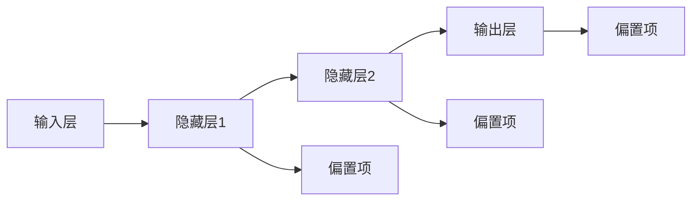

                 

关键词：(机器学习、神经网络、深度学习、多层感知机、MLP、人工神经网络、神经网络的训练、权重更新、反向传播算法、梯度下降)

> 摘要：本文详细介绍了多层感知机（MLP）的原理及其在机器学习中的应用。我们将从MLP的核心概念、数学模型、算法原理和代码实例等方面进行深入讲解，帮助读者全面理解MLP的工作机制及其优势。

## 1. 背景介绍

多层感知机（Multilayer Perceptron，MLP）是一种基于人工神经网络（Artificial Neural Networks，ANN）的模型，是深度学习（Deep Learning）的重要组成部分。MLP的出现可以追溯到1986年，由Dr. David E. Rumelhart、Geoffrey E. Hinton和Ronald J. Williams三位科学家共同提出了反向传播算法（Backpropagation Algorithm），这一算法为MLP的训练提供了有效的手段。

MLP在机器学习领域具有广泛的应用，尤其是在回归、分类和信号处理等方面。它通过学习输入和输出之间的非线性关系，能够处理复杂的任务，例如图像识别、语音识别和自然语言处理等。

## 2. 核心概念与联系

多层感知机由输入层、隐藏层和输出层组成。每一层包含多个神经元，神经元之间通过权重连接。以下是MLP的核心概念及其相互关系：



### 2.1 输入层

输入层接收外部数据，并将其传递到隐藏层。每个输入数据对应一个神经元，该神经元输出数据的大小即为输入数据的值。

### 2.2 隐藏层

隐藏层包含多个神经元，每个神经元接收前一层所有神经元的输出，并通过加权求和后加上偏置项，最后通过激活函数进行非线性变换。隐藏层可以有一个或多个，层数越多，网络的复杂度越高。

### 2.3 输出层

输出层接收隐藏层的输出，并根据任务类型（分类或回归）进行相应的输出。对于分类任务，输出通常是一个概率分布；对于回归任务，输出通常是预测的连续值。

### 2.4 激活函数

激活函数用于引入非线性特性，常见的激活函数有Sigmoid函数、ReLU函数、Tanh函数等。激活函数的选择会影响网络的性能和训练时间。

## 3. 核心算法原理 & 具体操作步骤

### 3.1 算法原理概述

多层感知机的训练过程主要包括两个阶段：前向传播和反向传播。

1. **前向传播**：输入数据从输入层传递到输出层，每个神经元通过加权求和和激活函数计算输出值。
2. **反向传播**：计算输出层的预测误差，并将其反向传播到隐藏层，通过梯度下降法更新网络的权重和偏置项。

### 3.2 算法步骤详解

#### 3.2.1 前向传播

1. **初始化权重和偏置项**：随机初始化网络中的权重和偏置项。
2. **输入数据**：将输入数据传递到输入层。
3. **计算隐藏层输出**：对每个隐藏层的神经元，计算输入值和权重之间的加权和，加上偏置项，并通过激活函数进行非线性变换。
4. **计算输出层输出**：对输出层的神经元，重复上述过程。

#### 3.2.2 反向传播

1. **计算输出误差**：对于每个输出层的神经元，计算实际输出值和预测输出值之间的差异。
2. **计算隐藏层误差**：将输出误差反向传播到隐藏层，对每个隐藏层的神经元，计算误差和激活函数的导数，进而计算误差对每个神经元输出的影响。
3. **更新权重和偏置项**：使用梯度下降法，根据误差对权重和偏置项进行更新。

### 3.3 算法优缺点

#### 优点

- **强大的拟合能力**：MLP可以通过增加隐藏层和神经元数量来拟合复杂的非线性关系。
- **易于实现**：MLP的结构简单，易于编程和调试。
- **广泛的适用性**：MLP可以用于多种机器学习任务，包括回归和分类。

#### 缺点

- **过拟合问题**：MLP的拟合能力很强，但容易导致过拟合。
- **训练时间较长**：多层感知机需要多次迭代训练，训练时间较长。

### 3.4 算法应用领域

多层感知机在以下领域具有广泛的应用：

- **图像识别**：用于分类和特征提取。
- **语音识别**：用于语音信号的处理和分类。
- **自然语言处理**：用于文本分类、情感分析和机器翻译等。

## 4. 数学模型和公式 & 详细讲解 & 举例说明

### 4.1 数学模型构建

多层感知机的数学模型可以表示为：

$$
\begin{aligned}
z_j^{(l)} &= \sum_{i} w_{ji}^{(l)} a_i^{(l-1)} + b_j^{(l)} \\
a_j^{(l)} &= \sigma(z_j^{(l)})
\end{aligned}
$$

其中，$z_j^{(l)}$表示第$l$层第$j$个神经元的加权和，$w_{ji}^{(l)}$和$b_j^{(l)}$分别表示第$l$层第$j$个神经元与第$l-1$层第$i$个神经元的权重和偏置项，$\sigma$表示激活函数，$a_j^{(l)}$表示第$l$层第$j$个神经元的输出。

### 4.2 公式推导过程

#### 4.2.1 梯度下降法

梯度下降法是一种优化算法，用于求解最小化损失函数的参数。对于多层感知机，损失函数可以表示为：

$$
J(\theta) = \frac{1}{m} \sum_{i=1}^{m} \sum_{k=1}^{K} (-y_{ik} \log(a_{ik}^{(L)}))_{+} + (1 - y_{ik}) \log(1 - a_{ik}^{(L)}))_{+}
$$

其中，$m$表示训练样本数量，$K$表示输出类别数量，$y_{ik}$表示第$i$个样本的第$k$个类别的真实标签，$a_{ik}^{(L)}$表示第$i$个样本在第$k$个输出类别的预测概率。

梯度下降法的目的是最小化损失函数$J(\theta)$，其中$\theta$表示网络中的权重和偏置项。梯度可以表示为：

$$
\nabla_{\theta} J(\theta) = \frac{\partial J(\theta)}{\partial \theta}
$$

#### 4.2.2 反向传播算法

反向传播算法是一种计算梯度的方法，用于多层感知机的训练。反向传播算法的步骤如下：

1. **前向传播**：输入数据从输入层传递到输出层，计算每个神经元的输出值。
2. **计算输出误差**：计算输出层的预测误差，并将其反向传播到隐藏层。
3. **计算隐藏层误差**：对每个隐藏层的神经元，计算误差和激活函数的导数，进而计算误差对每个神经元输出的影响。
4. **更新权重和偏置项**：根据误差对权重和偏置项进行更新。

### 4.3 案例分析与讲解

假设我们有一个简单的二分类问题，输入数据为$(x_1, x_2)$，输出类别为$0$或$1$。我们使用Sigmoid函数作为激活函数，损失函数为交叉熵损失函数。

#### 4.3.1 前向传播

输入层：$x_1, x_2$

隐藏层：$z_1 = x_1 + x_2, z_2 = x_1 - x_2$

输出层：$a_1 = \sigma(z_1), a_2 = \sigma(z_2)$

#### 4.3.2 反向传播

输出误差：$d_1 = a_1 - y, d_2 = a_2 - y$

隐藏层误差：$d_1' = \sigma'(z_1) \cdot d_1, d_2' = \sigma'(z_2) \cdot d_2$

权重和偏置项更新：

$$
\begin{aligned}
w_{11}^{(1)} &= w_{11}^{(1)} + \alpha \cdot d_1 \cdot a_1 \\
w_{12}^{(1)} &= w_{12}^{(1)} + \alpha \cdot d_1 \cdot a_2 \\
w_{21}^{(1)} &= w_{21}^{(1)} + \alpha \cdot d_2 \cdot a_1 \\
w_{22}^{(1)} &= w_{22}^{(1)} + \alpha \cdot d_2 \cdot a_2 \\
b_{1}^{(1)} &= b_{1}^{(1)} + \alpha \cdot d_1 \\
b_{2}^{(1)} &= b_{2}^{(1)} + \alpha \cdot d_2
\end{aligned}
$$

其中，$\alpha$表示学习率。

## 5. 项目实践：代码实例和详细解释说明

在本节中，我们将使用Python实现一个简单的一层MLP模型，用于二分类问题。代码中包含了输入层、隐藏层和输出层的实现，以及前向传播和反向传播的算法。

### 5.1 开发环境搭建

在开始编写代码之前，我们需要搭建一个Python开发环境。以下是搭建Python开发环境的步骤：

1. **安装Python**：在Python官方网站（https://www.python.org/）下载并安装Python。
2. **安装NumPy**：NumPy是一个用于科学计算的Python库，用于处理多维数组。使用pip命令安装NumPy：

   ```
   pip install numpy
   ```

### 5.2 源代码详细实现

以下是一层MLP的Python代码实现：

```python
import numpy as np

# 激活函数及其导数
def sigmoid(x):
    return 1 / (1 + np.exp(-x))

def sigmoid_derivative(x):
    return x * (1 - x)

# MLP模型
class MLP:
    def __init__(self, input_size, hidden_size, output_size):
        self.input_size = input_size
        self.hidden_size = hidden_size
        self.output_size = output_size
        
        self.weights_input_to_hidden = np.random.uniform(-1, 1, (input_size, hidden_size))
        self.weights_hidden_to_output = np.random.uniform(-1, 1, (hidden_size, output_size))
        
        self.bias_hidden = np.random.uniform(-1, 1, hidden_size)
        self.bias_output = np.random.uniform(-1, 1, output_size)

    def forward(self, x):
        self.hidden_layer_input = np.dot(x, self.weights_input_to_hidden) + self.bias_hidden
        self.hidden_layer_output = sigmoid(self.hidden_layer_input)
        
        self.output_layer_input = np.dot(self.hidden_layer_output, self.weights_hidden_to_output) + self.bias_output
        self.output_layer_output = sigmoid(self.output_layer_input)
        
        return self.output_layer_output

    def backward(self, x, y, output, learning_rate):
        output_error = y - output
        output_delta = output_error * sigmoid_derivative(output)
        
        hidden_error = output_delta.dot(self.weights_hidden_to_output.T)
        hidden_delta = hidden_error * sigmoid_derivative(self.hidden_layer_output)
        
        # 更新权重和偏置项
        self.weights_hidden_to_output += hidden_layer_output.T * output_delta * learning_rate
        self.bias_output += np.sum(output_delta, axis=0, keepdims=True) * learning_rate
        
        self.weights_input_to_hidden += x.T * hidden_delta * learning_rate
        self.bias_hidden += np.sum(hidden_delta, axis=0, keepdims=True) * learning_rate

# 测试MLP模型
input_data = np.array([[0, 0], [0, 1], [1, 0], [1, 1]])
output_data = np.array([[0], [1], [1], [0]])

model = MLP(2, 2, 1)
learning_rate = 0.1

for epoch in range(1000):
    outputs = model.forward(input_data)
    model.backward(input_data, output_data, outputs, learning_rate)

    if epoch % 100 == 0:
        print(f"Epoch {epoch}: Loss = {np.mean(np.square(outputs - output_data))}")

print(f"Final outputs: {outputs}")
```

### 5.3 代码解读与分析

- **激活函数和导数**：代码中实现了Sigmoid函数及其导数，用于非线性变换和反向传播。
- **MLP模型**：MLP模型由输入层、隐藏层和输出层组成，包括权重、偏置项和激活函数。
- **前向传播**：前向传播过程中，输入数据通过权重和偏置项传递到隐藏层和输出层，并经过激活函数计算输出。
- **反向传播**：反向传播过程中，计算输出误差和隐藏层误差，并更新权重和偏置项。
- **测试**：使用测试数据集对MLP模型进行测试，并打印最终输出结果。

## 6. 实际应用场景

多层感知机在多个实际应用场景中取得了显著的成果，以下是其中的一些应用：

### 6.1 图像识别

多层感知机在图像识别任务中具有广泛的应用，例如人脸识别、物体检测和图像分类等。通过增加隐藏层和神经元数量，MLP可以提取复杂的图像特征，提高识别准确率。

### 6.2 语音识别

多层感知机在语音识别领域具有重要作用，例如语音合成、语音识别和语音转换等。通过结合声学模型和语言模型，MLP可以有效地处理语音信号，提高识别精度。

### 6.3 自然语言处理

多层感知机在自然语言处理领域也得到了广泛应用，例如文本分类、情感分析和机器翻译等。通过结合深度神经网络和循环神经网络，MLP可以处理复杂的文本数据，提高处理效果。

## 7. 未来应用展望

随着人工智能技术的不断发展，多层感知机在未来的应用领域将更加广泛。以下是未来应用的一些展望：

### 7.1 自动驾驶

多层感知机在自动驾驶领域具有巨大潜力，例如车辆检测、路径规划和交通信号识别等。通过结合深度学习和计算机视觉技术，MLP可以实现对复杂环境的高效识别和处理。

### 7.2 医疗诊断

多层感知机在医疗诊断领域具有广泛的应用前景，例如疾病预测、医学图像分析和基因分析等。通过结合医学知识和大数据分析，MLP可以辅助医生进行诊断和治疗。

### 7.3 能源管理

多层感知机在能源管理领域可以用于预测能源需求、优化能源分配和减少能源浪费。通过结合物联网技术和大数据分析，MLP可以实现对能源系统的高效管理和优化。

## 8. 工具和资源推荐

在学习和应用多层感知机时，以下工具和资源可以帮助您更好地理解和掌握MLP：

### 8.1 学习资源推荐

- 《深度学习》（Goodfellow, Bengio, Courville著）：这是一本深度学习的经典教材，涵盖了多层感知机及其相关算法。
- 《神经网络与深度学习》（邱锡鹏著）：这本书系统地介绍了神经网络和深度学习的原理、算法和应用。

### 8.2 开发工具推荐

- TensorFlow：一个开源的深度学习框架，提供了丰富的API和工具，用于构建和训练多层感知机模型。
- PyTorch：一个流行的深度学习框架，具有灵活的动态图计算功能，适用于快速原型开发和研究。

### 8.3 相关论文推荐

- "Learning representations by backpropagation"（1986）：Rumelhart, Hinton和Williams首次提出反向传播算法。
- "Gradient Flow in Neural Networks"（1998）：Hinton提出梯度流方法，为深度学习奠定了基础。

## 9. 总结：未来发展趋势与挑战

多层感知机作为深度学习的重要组成部分，具有广泛的应用前景。随着人工智能技术的不断发展，MLP在多个领域取得了显著的成果。然而，MLP也存在一些挑战，如过拟合问题、训练时间较长等。未来，研究者将继续探索更高效的训练算法和模型结构，以提高MLP的性能和应用范围。

## 10. 附录：常见问题与解答

### 10.1 多层感知机与单层感知机有什么区别？

多层感知机与单层感知机的主要区别在于网络结构。单层感知机只有一个输入层和一个输出层，无法处理复杂的非线性关系。而多层感知机通过增加隐藏层和神经元数量，可以拟合更复杂的非线性关系。

### 10.2 多层感知机的训练时间为什么较长？

多层感知机的训练时间较长主要是因为需要多次迭代计算梯度并进行权重更新。随着网络层数的增加，梯度计算的复杂度也会增加，导致训练时间变长。此外，反向传播算法需要遍历整个数据集，增加了训练时间。

### 10.3 多层感知机容易过拟合吗？

是的，多层感知机容易过拟合。由于多层感知机的拟合能力很强，如果训练数据不足，模型容易在训练数据上过度拟合，导致泛化能力差。因此，在训练多层感知机时，需要采用合适的正则化方法和数据增强技术，以避免过拟合。

### 10.4 多层感知机有哪些变体？

多层感知机的变体包括：

- **卷积神经网络（CNN）**：通过卷积层提取图像特征，适用于图像识别任务。
- **循环神经网络（RNN）**：通过循环结构处理序列数据，适用于自然语言处理和语音识别等任务。
- **生成对抗网络（GAN）**：通过对抗训练生成高质量的数据，适用于图像生成和图像修复等任务。

## 作者署名

作者：禅与计算机程序设计艺术 / Zen and the Art of Computer Programming
----------------------------------------------------------------

以上内容是一篇完整的多层感知机（MLP）原理与代码实例讲解的文章。文章涵盖了MLP的核心概念、数学模型、算法原理、代码实现、应用场景和未来展望，内容丰富且具有深度。希望这篇文章对您有所帮助。如果您有任何问题或建议，欢迎在评论区留言。感谢您的阅读！

