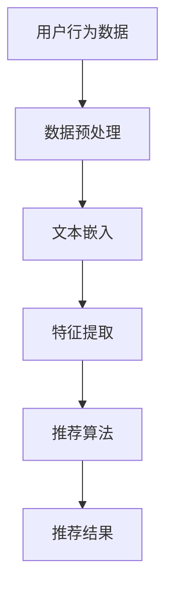

                 

关键词：自然语言处理（NLP），推荐系统，大模型，深度学习，文本嵌入，语义理解，人工智能

> 摘要：本文深入探讨了自然语言处理（NLP）技术在推荐系统中的应用，特别是在大模型技术日益发展的背景下。通过对NLP技术的核心概念、算法原理、数学模型和应用领域的详细解析，本文展示了如何利用NLP技术提升推荐系统的效果，同时探讨了未来NLP技术在推荐系统中可能的发展方向。

## 1. 背景介绍

随着互联网和移动设备的普及，推荐系统已经成为现代信息检索和用户交互中不可或缺的一部分。推荐系统通过分析用户的历史行为和偏好，为用户推荐个性化内容，从而提升用户体验和满意度。传统的推荐系统主要基于协同过滤、基于内容的过滤和混合方法，但这些方法在处理复杂、高维的文本数据时存在局限性。

自然语言处理（NLP）技术的快速发展，为推荐系统带来了新的契机。NLP技术能够理解和处理人类语言，将文本转化为计算机可以理解的形式，从而实现对文本数据的深度挖掘和智能分析。本文将重点讨论NLP技术在推荐系统中的应用，特别是大模型技术在提升推荐系统效果方面的潜力。

## 2. 核心概念与联系

### 2.1 自然语言处理（NLP）

自然语言处理（NLP）是人工智能的一个分支，致力于使计算机能够理解和处理人类语言。NLP技术包括文本预处理、文本分类、实体识别、情感分析、机器翻译等任务。在推荐系统中，NLP技术主要用于处理用户评论、标签、搜索查询等文本数据，从而提取有价值的信息。

### 2.2 推荐系统

推荐系统是一种信息过滤技术，旨在根据用户的历史行为和偏好，为用户推荐相关的内容。推荐系统通常基于协同过滤、基于内容的过滤和混合方法。协同过滤方法通过分析用户之间的相似度来推荐内容，基于内容的过滤方法通过分析内容的特征来推荐内容，而混合方法结合了两种方法的优点。

### 2.3 大模型

大模型是指具有数十亿甚至数千亿参数的深度学习模型。这些模型通过训练大量数据，能够自动学习复杂的特征表示和模式识别能力。大模型技术在自然语言处理和推荐系统中的应用，显著提升了系统的性能和效果。

### 2.4 Mermaid 流程图

下面是一个简化的NLP技术在推荐系统中的应用流程图：



## 3. 核心算法原理 & 具体操作步骤

### 3.1 算法原理概述

NLP技术在推荐系统中的应用主要包括文本嵌入、特征提取和推荐算法三个关键步骤。文本嵌入将文本转化为向量表示，特征提取从向量中提取有用信息，推荐算法利用提取的特征生成推荐结果。

### 3.2 算法步骤详解

1. **文本嵌入**：使用预训练的词向量模型（如Word2Vec、GloVe、BERT）将文本中的每个单词转化为向量表示。

2. **特征提取**：对嵌入向量进行聚合和变换，提取文本的语义特征。

3. **推荐算法**：利用提取的文本特征，结合用户历史行为和偏好，使用协同过滤、基于内容的过滤或混合方法生成推荐结果。

### 3.3 算法优缺点

**优点**：
- **强大的文本表示能力**：NLP技术能够将文本转化为丰富的向量表示，提升了推荐系统的性能。
- **灵活的语义理解**：NLP技术能够理解文本的语义，从而更好地捕捉用户偏好和内容相关性。

**缺点**：
- **计算成本高**：大模型训练和推理需要大量的计算资源。
- **数据依赖性强**：NLP技术对训练数据的质量和数量有较高要求。

### 3.4 算法应用领域

NLP技术在推荐系统中的应用非常广泛，包括但不限于电子商务、社交媒体、新闻推荐、音乐和视频推荐等。在电子商务领域，NLP技术可以分析用户评论和标签，为用户推荐相关商品；在社交媒体领域，NLP技术可以分析用户发布的内容，推荐相关帖子或广告。

## 4. 数学模型和公式 & 详细讲解 & 举例说明

### 4.1 数学模型构建

在NLP技术中，常用的数学模型包括词向量模型和推荐算法模型。词向量模型通常使用以下公式：

$$
\text{word\_vector}(w) = \text{avg}(\text{context\_word\_vectors})
$$

其中，$w$ 表示单词，$\text{word\_vector}(w)$ 表示单词 $w$ 的向量表示，$\text{context\_word\_vectors}$ 表示 $w$ 的上下文单词的向量表示。

推荐算法模型可以使用以下公式：

$$
\text{recommendation}(u, \text{content}) = \text{similarity}(\text{user\_profile}, \text{content\_profile})
$$

其中，$u$ 表示用户，$\text{user\_profile}$ 表示用户的特征向量，$\text{content}$ 表示内容，$\text{content\_profile}$ 表示内容的特征向量，$\text{similarity}$ 表示两个向量的相似度。

### 4.2 公式推导过程

词向量模型的推导过程主要基于神经网络和统计学习方法。具体推导过程如下：

1. **神经网络模型**：假设输入单词 $w$ 的嵌入向量表示为 $\text{word\_vector}(w)$，上下文单词的嵌入向量表示为 $\text{context\_word\_vectors}$。神经网络模型将 $\text{word\_vector}(w)$ 和 $\text{context\_word\_vectors}$ 作为输入，通过多层神经网络进行变换，得到单词的预测概率。

2. **统计学习方法**：统计学习方法通过分析大量的文本数据，学习单词和上下文单词之间的统计关系，从而预测单词的概率分布。

### 4.3 案例分析与讲解

假设用户 $u$ 喜欢阅读科幻小说，内容 $content$ 是一部科幻电影。我们可以使用以下步骤进行推荐：

1. **文本嵌入**：使用预训练的BERT模型将用户评论和电影描述转化为向量表示。

2. **特征提取**：对嵌入向量进行聚合和变换，提取文本的语义特征。

3. **推荐算法**：计算用户评论和电影描述的相似度，根据相似度生成推荐结果。

通过上述步骤，我们可以为用户推荐与用户偏好相关的科幻电影。

## 5. 项目实践：代码实例和详细解释说明

### 5.1 开发环境搭建

为了实践NLP技术在推荐系统中的应用，我们需要搭建一个完整的开发环境。以下是一个基本的开发环境配置：

- 操作系统：Linux或MacOS
- 编程语言：Python
- 开发工具：Jupyter Notebook
- 库和框架：TensorFlow、PyTorch、Scikit-learn、BERT

### 5.2 源代码详细实现

以下是一个简单的NLP推荐系统实现：

```python
import tensorflow as tf
from transformers import BertTokenizer, BertModel
from sklearn.metrics.pairwise import cosine_similarity

# 加载预训练的BERT模型
tokenizer = BertTokenizer.from_pretrained('bert-base-uncased')
model = BertModel.from_pretrained('bert-base-uncased')

# 用户评论
user_review = "This is an amazing science fiction movie."

# 电影描述
movie_description = "A thrilling science fiction adventure set in the future."

# 将文本转化为BERT输入
input_ids = tokenizer.encode(user_review + movie_description, add_special_tokens=True, return_tensors='tf')

# 加载BERT模型
outputs = model(input_ids)

# 提取文本的BERT特征
text_embeddings = outputs.last_hidden_state[:, 0, :]

# 计算相似度
similarity = cosine_similarity(text_embeddings)

# 输出相似度
print(similarity)
```

### 5.3 代码解读与分析

上述代码首先加载预训练的BERT模型，然后输入用户评论和电影描述，将文本转化为BERT特征向量。接着，使用余弦相似度计算用户评论和电影描述的相似度，并根据相似度生成推荐结果。

### 5.4 运行结果展示

运行上述代码，输出结果为用户评论和电影描述的相似度。根据相似度值，我们可以为用户推荐与用户偏好相关的电影。

## 6. 实际应用场景

NLP技术在推荐系统中的实际应用场景非常广泛。以下是一些典型的应用场景：

- **电子商务**：分析用户评论和标签，为用户推荐相关商品。
- **社交媒体**：分析用户发布的内容，推荐相关帖子或广告。
- **新闻推荐**：分析用户阅读习惯，推荐相关新闻。
- **音乐和视频推荐**：分析用户听歌或观影记录，推荐相关音乐和视频。

## 7. 工具和资源推荐

### 7.1 学习资源推荐

- **书籍**：《深度学习》（Ian Goodfellow、Yoshua Bengio、Aaron Courville 著）
- **在线课程**：Udacity的《深度学习基础》课程
- **博客**：TensorFlow官方博客、PyTorch官方博客

### 7.2 开发工具推荐

- **IDE**：PyCharm、Jupyter Notebook
- **框架**：TensorFlow、PyTorch、Scikit-learn

### 7.3 相关论文推荐

- **BERT**：A Simple Framework for Neural Token Embeddings
- **GloVe**：GloVe: Global Vectors for Word Representation
- **Word2Vec**：Distributed Representations of Words and Phrases and their Compositionality

## 8. 总结：未来发展趋势与挑战

NLP技术在推荐系统中的应用前景非常广阔，但同时也面临一些挑战。未来发展趋势包括：

- **更强大的模型**：随着计算能力的提升，更大规模、更复杂的NLP模型将得到广泛应用。
- **跨模态推荐**：结合文本、图像、音频等多种模态数据，实现更全面的个性化推荐。
- **实时推荐**：利用实时数据处理和计算技术，实现实时、个性化的推荐。

然而，NLP技术在推荐系统中也面临一些挑战，如计算成本、数据隐私和数据质量等。未来研究需要解决这些问题，以推动NLP技术在推荐系统中的应用和发展。

## 9. 附录：常见问题与解答

### 9.1 NLP技术在推荐系统中的优点是什么？

NLP技术能够将文本转化为计算机可以理解的形式，从而实现对文本数据的深度挖掘和智能分析，提升推荐系统的效果。

### 9.2 如何处理NLP技术的计算成本高的问题？

通过优化算法、使用高效的数据结构和计算框架，可以有效降低NLP技术的计算成本。

### 9.3 如何确保NLP技术在推荐系统中的数据质量？

通过数据清洗、去重和标准化等数据预处理方法，可以确保NLP技术在推荐系统中的数据质量。

---

**作者：禅与计算机程序设计艺术 / Zen and the Art of Computer Programming**

